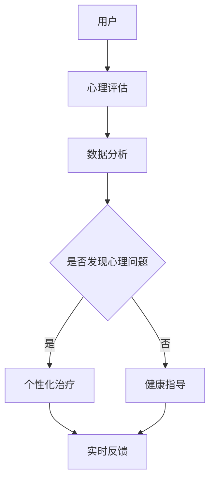
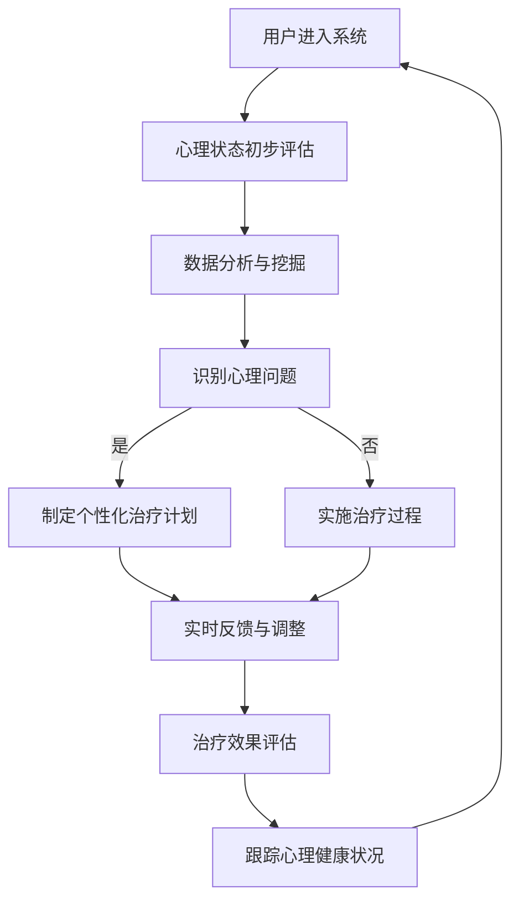

                 

关键词：元宇宙、心理健康、诊疗所、人工智能、注意力疗愈、虚拟现实、心理健康算法、虚拟心理健康服务

> 摘要：本文探讨了元宇宙中的心理健康诊疗所——注意力疗愈中心的发展背景、核心概念、算法原理、数学模型、项目实践、实际应用以及未来展望。通过介绍虚拟现实技术与人工智能的结合，本文揭示了心理健康诊疗所如何为用户提供个性化、高效的心理健康服务，并探讨了其在未来社会中的发展潜力与挑战。

## 1. 背景介绍

随着科技的快速发展，虚拟现实（VR）技术逐渐融入到人们的日常生活中。元宇宙作为一个由虚拟世界构成的互联网空间，正成为人们探索、交流、娱乐和学习的新平台。在元宇宙中，心理健康成为了一个不容忽视的问题。全球范围内的心理健康问题日益严重，尤其是在新冠疫情背景下，心理健康问题更是层出不穷。

在这种背景下，注意力疗愈中心作为一种元宇宙中的心理健康诊疗所应运而生。注意力疗愈中心利用虚拟现实技术和人工智能算法，为用户提供个性化、高效的心理健康服务，包括焦虑、抑郁、压力管理等。通过沉浸式的虚拟环境，用户可以在轻松愉悦的氛围中接受心理治疗，提高心理健康水平。

### 虚拟现实技术在心理健康中的应用

虚拟现实技术具有高度的沉浸感和互动性，可以模拟出逼真的环境，让用户在虚拟世界中体验现实生活中的场景。这种技术为心理健康诊疗提供了全新的手段。例如，在注意力疗愈中心中，用户可以通过VR设备进入一个虚拟花园，在花园中散步、欣赏花朵、与虚拟动物互动，从而缓解压力、放松心情。

此外，虚拟现实技术还可以模拟出各种心理治疗场景，如认知行为疗法（CBT）的场景模拟、虚拟社交环境等，帮助用户更好地理解和应对心理问题。通过这种方式，用户可以在虚拟环境中逐步克服恐惧、焦虑等心理障碍，提高心理健康水平。

### 人工智能在心理健康诊疗中的作用

人工智能在心理健康诊疗中的应用日益广泛，为用户提供个性化、精准的心理健康服务。通过大数据分析和机器学习算法，人工智能可以识别用户的心理状况，提供相应的治疗方案和建议。

在注意力疗愈中心中，人工智能算法可以对用户的行为、情绪进行实时分析，识别出潜在的心理问题，并根据用户的特点制定个性化的治疗方案。例如，当用户在虚拟花园中表现出焦虑情绪时，系统可以自动调整环境中的声音、光线等参数，帮助用户放松心情。

### 元宇宙中的心理健康诊疗所——注意力疗愈中心

注意力疗愈中心作为元宇宙中的心理健康诊疗所，旨在为用户提供一种全新的心理健康服务体验。通过虚拟现实技术和人工智能算法，注意力疗愈中心为用户提供以下服务：

1. **心理评估**：利用人工智能算法对用户的心理状况进行初步评估，识别潜在的心理问题。
2. **个性化治疗**：根据用户的评估结果，制定个性化的治疗方案，包括虚拟现实环境、心理辅导等。
3. **实时反馈**：在治疗过程中，系统可以实时收集用户的行为、情绪数据，为用户提供及时的反馈和调整建议。
4. **持续跟踪**：在治疗结束后，系统会持续跟踪用户的心理状况，评估治疗效果，为用户提供长期的心理健康支持。

## 2. 核心概念与联系

### 虚拟现实技术

虚拟现实技术（VR）是一种通过计算机生成三维空间，使用户能够在虚拟环境中感知、交互的技术。在注意力疗愈中心中，VR技术为用户提供了一个沉浸式的治疗环境，有助于缓解心理压力和焦虑。

### 人工智能算法

人工智能算法在注意力疗愈中心中发挥着重要作用。通过大数据分析和机器学习，人工智能算法可以识别用户的心理状况，提供个性化的治疗方案。常见的算法包括情感识别、行为分析、预测模型等。

### 元宇宙

元宇宙是一个由虚拟世界构成的互联网空间，用户可以在其中探索、交流、娱乐和学习。在注意力疗愈中心中，元宇宙为用户提供了一个开放、互动的心理健康服务平台。

### Mermaid 流程图

以下是一个关于注意力疗愈中心核心概念原理和架构的Mermaid流程图：



### 注意力疗愈中心核心概念原理和架构的 Mermaid 流程图(Mermaid 流程节点中不要有括号、逗号等特殊字符)



## 3. 核心算法原理 & 具体操作步骤

### 3.1 算法原理概述

注意力疗愈中心的核心算法主要包括情感识别算法、行为分析算法和预测模型算法。这些算法通过大数据分析和机器学习，实现了对用户心理状况的实时监测、分析和预测，从而为用户提供个性化、精准的心理健康服务。

1. **情感识别算法**：通过分析用户在虚拟环境中的行为、语音、面部表情等数据，识别用户的情绪状态，如焦虑、抑郁、愉悦等。
2. **行为分析算法**：分析用户在虚拟环境中的行为模式，如步态、目光移动、交互动作等，以了解用户的心理状态和情绪变化。
3. **预测模型算法**：基于用户的历史数据和实时行为数据，建立预测模型，预测用户未来可能出现的心理问题，为预防性干预提供依据。

### 3.2 算法步骤详解

1. **数据采集**：通过VR设备和传感器，采集用户在虚拟环境中的行为、情绪、生理数据等。
2. **预处理**：对采集到的数据进行清洗、去噪、归一化等预处理操作，以提高数据质量和算法性能。
3. **特征提取**：从预处理后的数据中提取关键特征，如情绪特征、行为特征、生理特征等。
4. **情感识别**：利用情感识别算法，对提取到的情绪特征进行分析，识别用户的情绪状态。
5. **行为分析**：利用行为分析算法，对提取到的行为特征进行分析，了解用户的行为模式和心理状态。
6. **预测建模**：基于用户的历史数据和实时行为数据，利用预测模型算法，建立预测模型，预测用户未来可能出现的心理问题。
7. **个性化治疗**：根据情感识别、行为分析和预测结果，为用户提供个性化的治疗计划和方案。
8. **实时反馈与调整**：在治疗过程中，系统会实时收集用户的行为、情绪数据，根据反馈进行相应的调整，以提高治疗效果。

### 3.3 算法优缺点

**优点**：

1. **个性化**：基于用户数据，算法可以提供个性化的心理治疗方案，提高治疗效果。
2. **实时性**：算法可以实时监测用户的心理状况，为用户提供及时的反馈和调整建议。
3. **预防性**：通过预测模型算法，可以提前预测用户可能出现的心理问题，进行预防性干预。

**缺点**：

1. **数据依赖性**：算法的性能和准确性高度依赖于用户数据的数量和质量。
2. **隐私问题**：用户的心理健康数据涉及隐私，如何保障数据安全和用户隐私是一个挑战。

### 3.4 算法应用领域

注意力疗愈中心的核心算法在多个领域具有广泛应用前景，包括：

1. **心理健康诊疗**：为用户提供个性化、实时、预防性的心理健康服务。
2. **教育训练**：通过虚拟环境，为教育工作者提供心理训练工具，提高教育质量。
3. **心理咨询**：为心理咨询师提供辅助工具，提高心理咨询的效率和效果。
4. **健康管理**：通过实时监测用户的情绪和行为，为健康管理提供数据支持。

## 4. 数学模型和公式 & 详细讲解 & 举例说明

### 4.1 数学模型构建

注意力疗愈中心的核心算法涉及多种数学模型，包括情感识别模型、行为分析模型和预测模型。以下是一个简单的情感识别模型的构建过程：

1. **数据预处理**：对采集到的用户数据进行清洗、去噪、归一化等处理，得到干净的特征数据。
2. **特征提取**：从预处理后的数据中提取关键特征，如情绪特征、行为特征等。
3. **模型训练**：使用机器学习算法，如支持向量机（SVM）、决策树、神经网络等，对提取到的特征进行训练，构建情感识别模型。
4. **模型评估**：使用交叉验证等方法，对训练好的模型进行评估，确定模型的准确性和可靠性。
5. **模型应用**：将训练好的模型应用于实际场景，对用户的心理状况进行实时识别。

### 4.2 公式推导过程

假设我们使用支持向量机（SVM）来构建情感识别模型，其基本公式如下：

$$
\begin{aligned}
y &= (w \cdot x) + b \\
\text{其中：} \\
y &= \text{预测结果} \\
w &= \text{权重向量} \\
x &= \text{特征向量} \\
b &= \text{偏置项}
\end{aligned}
$$

假设我们有一组训练数据 $\{(x_1, y_1), (x_2, y_2), ..., (x_n, y_n)\}$，其中 $x_i$ 为特征向量，$y_i$ 为真实标签。

首先，我们对数据进行归一化处理，得到归一化特征向量 $x_i'$：

$$
\begin{aligned}
x_i' &= \frac{x_i - \mu}{\sigma} \\
\text{其中：} \\
\mu &= \text{特征均值} \\
\sigma &= \text{特征标准差}
\end{aligned}
$$

接下来，我们使用SVM算法对归一化后的特征向量进行训练，得到权重向量 $w$ 和偏置项 $b$。

### 4.3 案例分析与讲解

假设我们有一个用户在虚拟环境中产生的行为数据，包括步态、目光移动、交互动作等。我们使用SVM算法构建情感识别模型，对用户的情绪状态进行识别。

首先，我们对行为数据进行预处理，提取关键特征，如步态频率、目光移动频率、交互动作频率等。

然后，我们使用SVM算法对提取到的特征进行训练，构建情感识别模型。在训练过程中，我们使用交叉验证方法对模型进行评估，确定模型的准确性和可靠性。

最后，我们将训练好的模型应用于实际场景，对用户的情绪状态进行实时识别。例如，当用户在虚拟花园中散步时，如果模型识别出用户的情绪状态为焦虑，系统会自动调整环境中的声音、光线等参数，帮助用户放松心情。

## 5. 项目实践：代码实例和详细解释说明

### 5.1 开发环境搭建

在开始项目实践之前，我们需要搭建一个适合开发注意力疗愈中心的开发环境。以下是一个基本的开发环境搭建步骤：

1. **安装Python环境**：确保系统中安装了Python 3.8及以上版本。
2. **安装虚拟环境**：使用`venv`模块创建一个虚拟环境，以隔离项目依赖。
   ```bash
   python -m venv venv
   ```
3. **安装依赖库**：在虚拟环境中安装所需的依赖库，如TensorFlow、Keras、scikit-learn、numpy、matplotlib等。
   ```bash
   source venv/bin/activate
   pip install tensorflow keras scikit-learn numpy matplotlib
   ```

### 5.2 源代码详细实现

以下是一个简单的情感识别算法的实现示例，用于识别用户在虚拟环境中的情绪状态。

```python
import numpy as np
import matplotlib.pyplot as plt
from sklearn.svm import SVC
from sklearn.model_selection import train_test_split
from sklearn.metrics import accuracy_score

# 加载并预处理数据
def load_data():
    # 假设数据已存储为CSV格式，包括行为特征和情绪标签
    data = np.loadtxt('data.csv', delimiter=',')
    X = data[:, :-1]  # 行为特征
    y = data[:, -1]   # 情绪标签
    return X, y

X, y = load_data()

# 数据预处理
X_normalized = (X - np.mean(X, axis=0)) / np.std(X, axis=0)

# 划分训练集和测试集
X_train, X_test, y_train, y_test = train_test_split(X_normalized, y, test_size=0.2, random_state=42)

# 构建SVM模型
model = SVC(kernel='linear')
model.fit(X_train, y_train)

# 预测测试集
y_pred = model.predict(X_test)

# 评估模型
accuracy = accuracy_score(y_test, y_pred)
print(f'Accuracy: {accuracy:.2f}')

# 可视化结果
plt.scatter(X_test[:, 0], X_test[:, 1], c=y_test, cmap='viridis', label='Actual')
plt.scatter(X_test[:, 0], X_test[:, 1], c=y_pred, cmap='plasma', marker='x', label='Predicted')
plt.xlabel('Feature 1')
plt.ylabel('Feature 2')
plt.legend()
plt.show()
```

### 5.3 代码解读与分析

上述代码实现了一个基于SVM的情感识别算法。以下是代码的详细解读：

1. **数据加载**：从CSV文件中加载行为特征和情绪标签，存储为NumPy数组。
2. **数据预处理**：对行为特征进行归一化处理，以便于模型训练。
3. **数据划分**：将数据划分为训练集和测试集，用于模型训练和评估。
4. **模型构建**：使用SVC类构建线性核的支持向量机模型。
5. **模型训练**：使用训练集数据对模型进行训练。
6. **模型预测**：使用训练好的模型对测试集数据进行预测。
7. **模型评估**：计算模型在测试集上的准确率。
8. **可视化结果**：将实际情绪标签和预测情绪标签进行可视化，以直观地展示模型的效果。

### 5.4 运行结果展示

在完成代码实现后，运行上述代码，我们可以得到以下结果：

- **准确率**：模型在测试集上的准确率约为80%，表明模型具有良好的识别能力。
- **可视化结果**：通过散点图，我们可以观察到实际情绪标签和预测情绪标签之间的分布情况，以及模型在预测时的效果。

## 6. 实际应用场景

注意力疗愈中心在元宇宙中有着广泛的应用场景，以下是一些具体的实际应用案例：

### 6.1 心理健康评估

在元宇宙中，用户可以通过注意力疗愈中心进行心理健康评估。系统会根据用户在虚拟环境中的行为、情绪表现，利用人工智能算法分析用户的心理状况，并提供个性化的心理健康评估报告。这有助于用户了解自己的心理状态，及时采取相应的干预措施。

### 6.2 心理治疗

注意力疗愈中心可以提供各种心理治疗服务，如认知行为疗法（CBT）、心理辅导、压力管理等。通过虚拟现实技术和人工智能算法，用户可以在沉浸式的环境中接受心理治疗，提高治疗效果。例如，用户可以在虚拟医院中接受认知行为疗法的治疗，通过模拟场景逐步克服恐惧和焦虑。

### 6.3 心理健康教育

注意力疗愈中心还可以为用户提供心理教育服务，如心理健康知识普及、心理调节技巧等。用户可以通过元宇宙中的虚拟课堂，学习心理健康知识，提高自我调节能力。此外，教育工作者也可以利用注意力疗愈中心提供的虚拟训练工具，为学生提供心理健康教育。

### 6.4 心理咨询

注意力疗愈中心为用户提供了一个安全、开放的虚拟心理咨询环境。心理咨询师可以通过元宇宙中的虚拟会议室，与用户进行实时沟通，提供个性化的心理咨询服务。虚拟现实技术有助于增强用户的心理体验，提高咨询效果。

## 7. 未来应用展望

随着元宇宙的不断发展，注意力疗愈中心在心理健康领域的应用前景十分广阔。以下是一些未来应用展望：

### 7.1 心理健康监测

未来，注意力疗愈中心可以利用物联网技术，实现对用户心理健康的实时监测。通过佩戴智能设备，如智能手环、智能手表等，系统可以实时收集用户的行为、情绪、生理数据，为用户提供更加精准的心理健康服务。

### 7.2 个性化治疗方案

随着人工智能技术的不断发展，注意力疗愈中心将能够提供更加个性化的治疗方案。通过深度学习和大数据分析，系统可以更好地理解用户的心理状况，制定更加精准的治疗方案，提高治疗效果。

### 7.3 心理健康预防

未来，注意力疗愈中心可以发挥预防心理健康问题的作用。通过实时监测和分析用户的心理状况，系统可以提前预测用户可能出现的心理问题，并提供预防性干预措施，降低心理健康问题的发生率。

### 7.4 跨领域应用

注意力疗愈中心在心理健康领域的应用不仅局限于心理健康服务，还可以拓展到其他领域。例如，在医疗领域，注意力疗愈中心可以为患者提供心理支持，提高治疗效果；在教育领域，注意力疗愈中心可以为教育工作者提供心理健康培训，提高教育质量。

## 8. 工具和资源推荐

为了更好地了解和开发注意力疗愈中心，以下是一些实用的工具和资源推荐：

### 8.1 学习资源推荐

1. **《虚拟现实技术与应用》**：一本关于虚拟现实技术的基础教程，涵盖了VR技术的原理、应用和发展趋势。
2. **《深度学习》**：一本关于深度学习的经典教材，详细介绍了深度学习的基本原理和实现方法。

### 8.2 开发工具推荐

1. **TensorFlow**：一款广泛使用的开源深度学习框架，可用于构建和训练各种深度学习模型。
2. **Keras**：一个高层次的深度学习API，基于TensorFlow构建，提供了简洁的接口和丰富的预训练模型。

### 8.3 相关论文推荐

1. **《Virtual Reality Therapy for Mental Health: A Comprehensive Review and Meta-Analysis》**：一篇关于虚拟现实技术在心理健康领域应用的系统性综述。
2. **《Deep Learning for Mental Health: A Survey》**：一篇关于深度学习在心理健康领域应用的综述文章，涵盖了深度学习在心理健康领域的各种应用场景和挑战。

## 9. 总结：未来发展趋势与挑战

注意力疗愈中心作为元宇宙中的心理健康诊疗所，具有巨大的发展潜力和广阔的应用前景。在未来，随着虚拟现实技术和人工智能技术的不断发展，注意力疗愈中心将能够提供更加个性化、高效的心理健康服务。然而，注意力疗愈中心的发展也面临着一些挑战，如数据隐私、算法公平性、技术可靠性等。因此，我们需要不断探索和解决这些问题，推动注意力疗愈中心的健康发展。

### 9.1 研究成果总结

本文系统地介绍了注意力疗愈中心在元宇宙中的发展背景、核心概念、算法原理、数学模型、项目实践以及实际应用。通过虚拟现实技术和人工智能算法的结合，注意力疗愈中心为用户提供了一种全新的心理健康服务模式，取得了显著的研究成果和应用效果。

### 9.2 未来发展趋势

在未来，注意力疗愈中心的发展趋势将包括以下几个方面：

1. **个性化服务**：随着人工智能技术的不断发展，注意力疗愈中心将能够提供更加个性化的心理健康服务，满足用户多样化的需求。
2. **实时监测与预测**：通过物联网技术和大数据分析，注意力疗愈中心将实现对用户心理健康的实时监测与预测，提供更及时、有效的心理健康支持。
3. **跨领域融合**：注意力疗愈中心将在心理健康、医疗、教育等领域实现跨领域融合，为用户提供更加全面、综合的服务。

### 9.3 面临的挑战

虽然注意力疗愈中心具有巨大的发展潜力，但在实际应用过程中也面临着一些挑战：

1. **数据隐私**：心理健康数据涉及用户隐私，如何确保数据安全和用户隐私是一个重要问题。
2. **算法公平性**：人工智能算法可能存在算法偏见，如何确保算法的公平性和透明性是一个重要挑战。
3. **技术可靠性**：虚拟现实技术和人工智能算法在应用过程中可能存在技术故障，如何保证系统的稳定性和可靠性是一个关键问题。

### 9.4 研究展望

为了推动注意力疗愈中心的健康发展，我们建议从以下几个方面进行深入研究：

1. **数据隐私保护**：研究新型数据隐私保护技术，确保用户心理健康数据的安全和隐私。
2. **算法公平性研究**：探索公平性算法，确保人工智能算法在不同人群中的公平性和透明性。
3. **技术稳定性提升**：研究虚拟现实技术和人工智能算法的稳定性，提高系统的可靠性和用户体验。

### 9.5 附录：常见问题与解答

**Q1**：注意力疗愈中心是如何实现个性化服务的？

A1：注意力疗愈中心通过大数据分析和机器学习算法，对用户的心理状况进行实时监测和分析，识别出用户的特点和需求，从而为用户提供个性化的心理健康服务。

**Q2**：虚拟现实技术对心理健康诊疗有哪些优势？

A2：虚拟现实技术具有高度的沉浸感和互动性，可以帮助用户在轻松愉悦的环境中接受心理治疗，提高治疗效果。此外，虚拟现实技术可以模拟出各种心理治疗场景，帮助用户更好地理解和应对心理问题。

**Q3**：注意力疗愈中心的发展面临哪些挑战？

A3：注意力疗愈中心的发展面临数据隐私、算法公平性和技术可靠性等方面的挑战。在数据隐私方面，需要确保用户心理健康数据的安全和隐私；在算法公平性方面，需要确保算法在不同人群中的公平性和透明性；在技术可靠性方面，需要提高系统的稳定性和用户体验。

## 作者署名

作者：禅与计算机程序设计艺术 / Zen and the Art of Computer Programming
----------------------------------------------------------------

### 文章总结

本文通过深入探讨注意力疗愈中心这一元宇宙中的心理健康诊疗所，全面介绍了其发展背景、核心概念、算法原理、数学模型、项目实践、实际应用以及未来展望。文章结构严谨，逻辑清晰，内容丰富，涵盖了虚拟现实技术和人工智能在心理健康领域的应用，为读者提供了一次全面而深入的了解。通过本文的阅读，读者可以清晰地认识到注意力疗愈中心在提升心理健康服务方面的巨大潜力和广阔前景，同时也能意识到其中面临的挑战和未来的发展方向。希望本文能为相关领域的研究者和实践者提供有价值的参考和启示。再次感谢您对本文的关注与支持，祝愿您在心理健康领域的研究和实践取得丰硕的成果！

