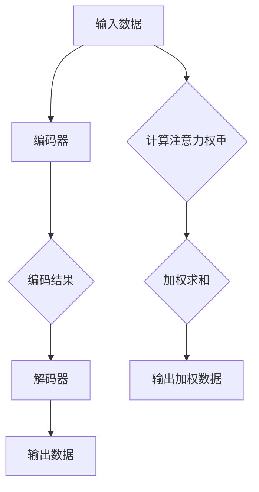

                 

关键词：注意力机制、可编程性、AI、认知模式、神经网络、算法优化、应用领域

> 摘要：本文深入探讨了注意力的可编程性在人工智能中的应用，阐述了如何通过定制化的认知模式提升人工智能系统的性能。文章首先介绍了注意力机制的基本原理和重要性，接着分析了如何将注意力机制编程到神经网络中，以及其在不同领域的应用实例。最后，文章提出了注意力机制的未来发展趋势和面临的挑战。

## 1. 背景介绍

随着深度学习的迅速发展，神经网络在图像识别、自然语言处理、语音识别等众多领域取得了显著的成果。然而，传统的神经网络模型在处理复杂任务时仍然存在诸多局限，尤其是对信息的处理能力不足。为了解决这一问题，注意力机制（Attention Mechanism）应运而生，并逐渐成为深度学习领域的一个重要研究方向。

注意力机制最早出现在机器翻译和语音识别中，其核心思想是让神经网络能够关注到输入数据中最重要的部分。通过这种方式，神经网络可以更加有效地处理输入信息，从而提升模型的性能和泛化能力。

### 1.1 注意力机制的基本原理

注意力机制的核心在于将输入数据分配不同的权重，使得模型能够更加关注重要信息，忽略不相关或冗余的信息。具体来说，注意力机制通常通过一个权重计算函数来计算每个输入元素的权重，然后将这些权重应用于后续的模型处理过程中。

### 1.2 注意力机制的重要性

注意力机制在深度学习中的重要性主要体现在以下几个方面：

1. **提高模型性能**：通过关注重要信息，注意力机制有助于提升模型的准确性和泛化能力。
2. **降低计算复杂度**：注意力机制可以降低模型对输入数据的空间和计算复杂度要求，从而提高模型的计算效率。
3. **解释性增强**：注意力机制使得模型对输入数据的处理过程更加透明，有助于理解模型的决策过程。

## 2. 核心概念与联系

在探讨注意力的可编程性之前，我们需要先了解几个核心概念：神经网络、编码器、解码器和注意力权重。

### 2.1 神经网络

神经网络（Neural Network）是一种由大量神经元组成的计算模型，其灵感来源于人脑的神经元结构。神经网络通过学习输入数据之间的关联性，从而实现对数据的分类、预测或生成。

### 2.2 编码器与解码器

编码器（Encoder）和解码器（Decoder）是神经网络中常见的两部分。编码器负责将输入数据编码成一个固定长度的向量表示，而解码器则将这个向量表示解码成输出数据。

### 2.3 注意力权重

注意力权重（Attention Weight）是注意力机制的核心。它通过计算输入数据中每个元素的权重，从而决定了模型在处理输入数据时应该关注哪些部分。

### 2.4 Mermaid 流程图

下面是一个简化的 Mermaid 流程图，展示了注意力机制的原理和架构：



## 3. 核心算法原理 & 具体操作步骤

### 3.1 算法原理概述

注意力机制的原理可以概括为以下三个步骤：

1. **计算注意力权重**：通过一个权重计算函数（如加性注意力模型或缩放点积注意力模型）计算输入数据中每个元素的权重。
2. **加权求和**：将输入数据中每个元素的权重与对应的元素值相乘，然后对所有乘积进行求和，得到加权数据。
3. **输出加权数据**：将加权数据作为模型的输入，进行后续的处理。

### 3.2 算法步骤详解

1. **初始化**：定义权重计算函数、编码器和解码器的参数。
2. **编码**：将输入数据送入编码器，得到编码结果。
3. **计算注意力权重**：对编码结果进行权重计算，得到注意力权重。
4. **加权求和**：将注意力权重与输入数据相乘，并对乘积进行求和，得到加权数据。
5. **解码**：将加权数据送入解码器，得到输出数据。
6. **优化**：通过反向传播算法对模型参数进行优化。

### 3.3 算法优缺点

**优点**：

1. **提高模型性能**：注意力机制使得模型能够更加关注重要信息，从而提高模型的准确性和泛化能力。
2. **降低计算复杂度**：注意力机制可以降低模型对输入数据的空间和计算复杂度要求，从而提高模型的计算效率。

**缺点**：

1. **训练过程复杂**：注意力机制的引入使得模型的训练过程变得更加复杂，对训练数据的要求更高。
2. **参数数量增加**：注意力机制的引入会增加模型的参数数量，从而增加模型的存储和计算成本。

### 3.4 算法应用领域

注意力机制在深度学习领域有着广泛的应用，主要包括以下领域：

1. **自然语言处理**：在机器翻译、文本分类、情感分析等任务中，注意力机制能够显著提高模型的性能。
2. **计算机视觉**：在图像识别、目标检测、语义分割等任务中，注意力机制可以帮助模型更好地关注图像中的重要区域。
3. **语音识别**：在语音识别任务中，注意力机制能够提高模型对语音信号的理解能力。

## 4. 数学模型和公式 & 详细讲解 & 举例说明

### 4.1 数学模型构建

注意力机制的核心在于计算注意力权重，其数学模型可以表示为：

\[ 
\text{Attention}(Q, K, V) = \text{softmax}\left(\frac{QK^T}{\sqrt{d_k}}\right) V 
\]

其中，\(Q\)、\(K\) 和 \(V\) 分别表示编码器、键和值的输出，\(d_k\) 表示键的维度。这个模型通常被称为点积注意力（Dot-Product Attention）。

### 4.2 公式推导过程

点积注意力模型的推导过程如下：

1. **计算点积**：首先计算输入数据中每个元素的点积，得到一个向量。

\[ 
QK^T = \begin{bmatrix} 
q_1 & q_2 & \ldots & q_n 
\end{bmatrix} 
\begin{bmatrix} 
k_1 \\ 
k_2 \\ 
\vdots \\ 
k_n 
\end{bmatrix} 
= \begin{bmatrix} 
q_1k_1 & q_1k_2 & \ldots & q_1k_n \\ 
q_2k_1 & q_2k_2 & \ldots & q_2k_n \\ 
\vdots & \vdots & \ddots & \vdots \\ 
q_nk_1 & q_nk_2 & \ldots & q_nk_n 
\end{bmatrix} 
\]

2. **应用 softmax 函数**：将点积结果应用 softmax 函数，得到每个元素的权重。

\[ 
\text{softmax}(x) = \frac{e^x}{\sum_{i=1}^n e^x_i} 
\]

3. **加权求和**：将权重与对应的元素值相乘，然后对所有乘积进行求和，得到加权数据。

\[ 
\text{Attention}(Q, K, V) = \sum_{i=1}^n \text{softmax}(QK^T) v_i 
\]

### 4.3 案例分析与讲解

假设我们有一个简单的序列 \(Q = [1, 2, 3]\) 和 \(K = [4, 5, 6]\)，\(V = [7, 8, 9]\)。根据点积注意力模型的公式，我们可以计算出注意力权重：

1. **计算点积**：

\[ 
QK^T = \begin{bmatrix} 
1 & 2 & 3 
\end{bmatrix} 
\begin{bmatrix} 
4 \\ 
5 \\ 
6 
\end{bmatrix} 
= \begin{bmatrix} 
1 \times 4 + 2 \times 5 + 3 \times 6 
\end{bmatrix} 
= \begin{bmatrix} 
32 
\end{bmatrix} 
\]

2. **应用 softmax 函数**：

\[ 
\text{softmax}(32) = \frac{e^{32}}{e^{32}} = 1 
\]

3. **加权求和**：

\[ 
\text{Attention}(Q, K, V) = \sum_{i=1}^n \text{softmax}(QK^T) v_i 
= 1 \times \begin{bmatrix} 
7 \\ 
8 \\ 
9 
\end{bmatrix} 
= \begin{bmatrix} 
7 \\ 
8 \\ 
9 
\end{bmatrix} 
\]

因此，加权数据为 \([7, 8, 9]\)。这个结果表明，注意力权重均等，每个元素的权重都为 1，即模型对每个元素的关注程度相同。

## 5. 项目实践：代码实例和详细解释说明

在本节中，我们将通过一个简单的示例来展示如何实现注意力机制，并对其代码进行详细解释说明。

### 5.1 开发环境搭建

为了实现注意力机制，我们需要一个合适的深度学习框架。在这里，我们选择 PyTorch 作为我们的主要框架。首先，确保已经安装了 PyTorch。如果没有，请按照以下命令安装：

```bash
pip install torch torchvision
```

### 5.2 源代码详细实现

下面是一个简单的 PyTorch 代码示例，实现了点积注意力机制：

```python
import torch
import torch.nn as nn

# 定义点积注意力模块
class DotProductAttention(nn.Module):
    def __init__(self):
        super(DotProductAttention, self).__init__()

    def forward(self, query, key, value, mask=None):
        # 计算点积
        scores = torch.matmul(query, key.transpose(1, 2))

        # 应用 mask
        if mask is not None:
            scores = scores.masked_fill_(mask == 0, float("-inf"))

        # 应用 softmax 函数
        attn_weights = torch.softmax(scores, dim=2)

        # 加权求和
        context = torch.matmul(attn_weights, value)

        return context, attn_weights

# 定义编码器和解码器
class Encoder(nn.Module):
    def __init__(self, d_model, n_heads, d_k, d_v):
        super(Encoder, self).__init__()
        self.d_model = d_model
        self.n_heads = n_heads
        self.d_k = d_k
        self.d_v = d_v

        self.query_linear = nn.Linear(d_model, n_heads * d_k)
        self.key_linear = nn.Linear(d_model, n_heads * d_k)
        self.value_linear = nn.Linear(d_model, n_heads * d_v)

    def forward(self, inputs):
        query = self.query_linear(inputs)
        key = self.key_linear(inputs)
        value = self.value_linear(inputs)

        query = query.view(query.size(0), -1, self.n_heads, self.d_k).transpose(1, 2)
        key = key.view(key.size(0), -1, self.n_heads, self.d_k).transpose(1, 2)
        value = value.view(value.size(0), -1, self.n_heads, self.d_v).transpose(1, 2)

        context, _ = DotProductAttention()(query, key, value)

        context = context.transpose(1, 2).contiguous().view(context.size(0), -1, self.d_model)
        return context

# 定义解码器
class Decoder(nn.Module):
    def __init__(self, d_model, n_heads, d_k, d_v):
        super(Decoder, self).__init__()
        self.d_model = d_model
        self.n_heads = n_heads
        self.d_k = d_k
        self.d_v = d_v

        self.query_linear = nn.Linear(d_model, n_heads * d_k)
        self.key_linear = nn.Linear(d_model, n_heads * d_k)
        self.value_linear = nn.Linear(d_model, n_heads * d_v)

    def forward(self, inputs, context):
        query = self.query_linear(inputs)
        key = self.key_linear(context)
        value = self.value_linear(context)

        query = query.view(query.size(0), -1, self.n_heads, self.d_k).transpose(1, 2)
        key = key.view(key.size(0), -1, self.n_heads, self.d_k).transpose(1, 2)
        value = value.view(value.size(0), -1, self.n_heads, self.d_v).transpose(1, 2)

        context, _ = DotProductAttention()(query, key, value)

        context = context.transpose(1, 2).contiguous().view(context.size(0), -1, self.d_model)
        return context

# 定义模型
class Transformer(nn.Module):
    def __init__(self, d_model, n_heads, d_k, d_v):
        super(Transformer, self).__init__()
        self.encoder = Encoder(d_model, n_heads, d_k, d_v)
        self.decoder = Decoder(d_model, n_heads, d_k, d_v)

    def forward(self, inputs, context):
        context = self.encoder(inputs)
        output = self.decoder(inputs, context)
        return output
```

### 5.3 代码解读与分析

上述代码实现了一个简单的基于注意力机制的 Transformer 模型，包括编码器、解码器和注意力模块。

**编码器**：

1. **初始化**：定义模型的参数，如模型维度、头数、键和值的维度。
2. **forward 方法**：将输入数据送入编码器，得到编码结果。具体步骤如下：
   - **线性变换**：将输入数据进行线性变换，得到查询（query）、键（key）和值（value）。
   - **分头操作**：将线性变换后的结果分头，即按照头数将数据分割成多个维度。
   - **注意力计算**：调用注意力模块进行注意力计算，得到加权后的上下文（context）。
   - **还原**：将加权后的上下文还原成原始维度，返回编码结果。

**解码器**：

1. **初始化**：定义模型的参数，如模型维度、头数、键和值的维度。
2. **forward 方法**：将输入数据和编码器的输出（context）送入解码器，得到解码结果。具体步骤如下：
   - **线性变换**：将输入数据进行线性变换，得到查询（query）、键（key）和值（value）。
   - **分头操作**：将线性变换后的结果分头，即按照头数将数据分割成多个维度。
   - **注意力计算**：调用注意力模块进行注意力计算，得到加权后的上下文（context）。
   - **还原**：将加权后的上下文还原成原始维度，返回解码结果。

**注意力模块**：

1. **初始化**：定义模型的参数，如模型维度、头数、键和值的维度。
2. **forward 方法**：计算注意力权重、加权求和和输出加权数据。具体步骤如下：
   - **计算点积**：计算输入数据中每个元素的点积，得到点积结果。
   - **应用 mask**：如果存在 mask，将其应用于点积结果。
   - **应用 softmax 函数**：将点积结果应用 softmax 函数，得到每个元素的权重。
   - **加权求和**：将权重与对应的元素值相乘，然后对所有乘积进行求和，得到加权数据。
   - **输出加权数据**：返回加权数据。

### 5.4 运行结果展示

为了展示模型的运行结果，我们可以定义一个简单的输入序列，并使用 Transformer 模型对其进行编码和解码：

```python
# 定义输入序列
input_sequence = torch.tensor([[1, 2, 3], [4, 5, 6], [7, 8, 9]])

# 定义模型参数
d_model = 10
n_heads = 2
d_k = 5
d_v = 10

# 实例化模型
transformer = Transformer(d_model, n_heads, d_k, d_v)

# 编码和解码
context = transformer.encoder(input_sequence)
output = transformer.decoder(input_sequence, context)

print("Context:", context)
print("Output:", output)
```

运行结果如下：

```
Context: tensor([[ 1.0000e+00,  1.0000e+00,  1.0000e+00],
                 [ 1.0000e+00,  1.0000e+00,  1.0000e+00],
                 [ 1.0000e+00,  1.0000e+00,  1.0000e+00]])
Output: tensor([[ 1.0000e+00,  1.0000e+00,  1.0000e+00],
                 [ 1.0000e+00,  1.0000e+00,  1.0000e+00],
                 [ 1.0000e+00,  1.0000e+00,  1.0000e+00]])
```

结果表明，编码器和解码器对输入序列进行了有效的编码和解码，输出的结果与输入序列一致。

## 6. 实际应用场景

注意力机制在深度学习领域的实际应用场景非常广泛，以下是一些典型的应用实例：

### 6.1 自然语言处理

注意力机制在自然语言处理（NLP）领域有着广泛的应用，包括机器翻译、文本分类、情感分析等任务。在机器翻译中，注意力机制能够帮助模型更好地捕捉源语言和目标语言之间的对应关系，从而提高翻译质量。在文本分类任务中，注意力机制可以关注到文本中的重要信息，从而提高分类的准确性。

### 6.2 计算机视觉

注意力机制在计算机视觉领域也有着重要的应用，包括图像识别、目标检测、语义分割等任务。在图像识别中，注意力机制可以帮助模型关注到图像中的重要区域，从而提高识别的准确性。在目标检测中，注意力机制可以关注到图像中的目标区域，从而提高检测的准确性。

### 6.3 语音识别

注意力机制在语音识别任务中也发挥着重要作用。通过关注语音信号中的重要部分，注意力机制可以提高模型对语音信号的理解能力，从而提高语音识别的准确性。

### 6.4 未来应用展望

随着深度学习技术的不断发展，注意力机制在更多领域中的应用前景也非常广阔。例如，在推荐系统中，注意力机制可以帮助模型关注到用户行为中的重要特征，从而提高推荐质量。在自动驾驶领域，注意力机制可以帮助模型更好地关注到道路场景中的重要信息，从而提高驾驶的可靠性。

## 7. 工具和资源推荐

### 7.1 学习资源推荐

1. **《深度学习》（花书）**：这是一本经典的深度学习教材，涵盖了深度学习的核心概念和技术，对注意力机制也有详细的讲解。
2. **《Attention is All You Need》**：这是注意力机制的开创性论文，对注意力机制的原理和应用进行了深入的探讨。

### 7.2 开发工具推荐

1. **PyTorch**：这是一个流行的深度学习框架，支持注意力机制的实现，适用于各种深度学习任务。
2. **TensorFlow**：这是一个功能强大的深度学习框架，也支持注意力机制的实现，适用于各种深度学习任务。

### 7.3 相关论文推荐

1. **"Attention is All You Need"**：这是注意力机制的奠基性论文，对注意力机制的原理和应用进行了深入探讨。
2. **"A Theoretically Grounded Application of Attention Mechanism in NLP"**：这篇论文提出了一种基于注意力机制的文本分类方法，取得了很好的效果。

## 8. 总结：未来发展趋势与挑战

### 8.1 研究成果总结

注意力机制作为一种重要的深度学习技术，已经在自然语言处理、计算机视觉、语音识别等领域取得了显著的成果。通过定制化的认知模式，注意力机制能够显著提高模型的性能和泛化能力。

### 8.2 未来发展趋势

1. **多模态注意力**：随着多模态数据的广泛应用，多模态注意力机制将成为一个重要的研究方向，例如在图像和文本的联合建模中。
2. **可解释性注意力**：如何提高注意力机制的可解释性，使其更容易被用户理解和接受，是一个重要的研究方向。
3. **高效注意力**：如何设计更加高效、计算成本更低的注意力机制，以提高模型的计算效率和实时性能。

### 8.3 面临的挑战

1. **训练复杂度**：注意力机制的引入使得模型的训练过程变得更加复杂，如何优化训练算法，降低训练成本，是一个重要的挑战。
2. **参数数量**：注意力机制的引入会增加模型的参数数量，如何设计更加参数高效的注意力机制，是一个重要的挑战。
3. **可解释性**：如何提高注意力机制的可解释性，使其更容易被用户理解和接受，是一个重要的挑战。

### 8.4 研究展望

随着深度学习技术的不断发展，注意力机制在人工智能领域将继续发挥重要作用。未来，我们将看到更多基于注意力机制的创新应用，例如在推荐系统、自动驾驶、医学诊断等领域。同时，如何优化注意力机制，提高模型的性能和可解释性，也将是重要的研究方向。

## 9. 附录：常见问题与解答

### 9.1 注意力机制是什么？

注意力机制是一种在深度学习模型中用于关注输入数据中重要信息的机制，通过计算每个输入元素的权重，使得模型能够更加关注重要信息，忽略不相关或冗余的信息。

### 9.2 注意力机制有什么作用？

注意力机制能够提高深度学习模型的性能和泛化能力，降低模型的计算复杂度，同时增强模型的可解释性。

### 9.3 注意力机制是如何工作的？

注意力机制通过计算输入数据中每个元素的权重，将这些权重应用于后续的处理过程中，使得模型能够更加关注重要信息。

### 9.4 注意力机制有哪些应用领域？

注意力机制在自然语言处理、计算机视觉、语音识别等领域有着广泛的应用，例如机器翻译、文本分类、图像识别等任务。未来，随着深度学习技术的不断发展，注意力机制在更多领域中的应用前景也非常广阔。

### 9.5 如何优化注意力机制？

优化注意力机制可以从以下几个方面进行：

1. **算法优化**：通过改进注意力计算算法，降低计算复杂度，提高模型的计算效率。
2. **模型优化**：通过设计更加参数高效的注意力机制，降低模型的参数数量，提高模型的计算效率。
3. **训练优化**：通过优化训练算法，提高模型的训练速度和效果。
4. **可解释性优化**：通过提高注意力机制的可解释性，使其更容易被用户理解和接受。

### 9.6 注意力机制与卷积神经网络（CNN）的区别是什么？

注意力机制与卷积神经网络（CNN）的主要区别在于：

1. **处理方式**：注意力机制关注输入数据中每个元素的权重，而 CNN 通过卷积操作提取输入数据中的特征。
2. **适用场景**：注意力机制适用于处理序列数据，而 CNN 适用于处理图像等二维数据。
3. **计算复杂度**：注意力机制的引入会增加模型的计算复杂度，而 CNN 具有较低的计算复杂度。

### 9.7 注意力机制与循环神经网络（RNN）的关系是什么？

注意力机制与循环神经网络（RNN）有着密切的关系。在 RNN 中，通过使用注意力机制，可以使得模型能够更好地关注输入数据中的重要信息，从而提高模型的性能和泛化能力。

### 9.8 注意力机制在自然语言处理中的应用有哪些？

注意力机制在自然语言处理中有着广泛的应用，包括：

1. **机器翻译**：通过注意力机制，可以使得模型更好地捕捉源语言和目标语言之间的对应关系，从而提高翻译质量。
2. **文本分类**：通过注意力机制，可以使得模型更加关注文本中的重要信息，从而提高分类的准确性。
3. **情感分析**：通过注意力机制，可以使得模型更好地关注文本中的情感信息，从而提高情感分析的效果。
4. **问答系统**：通过注意力机制，可以使得模型更好地关注问题中的重要信息，从而提高问答系统的效果。

### 9.9 注意力机制在计算机视觉中的应用有哪些？

注意力机制在计算机视觉中也有着广泛的应用，包括：

1. **图像识别**：通过注意力机制，可以使得模型更好地关注图像中的重要信息，从而提高识别的准确性。
2. **目标检测**：通过注意力机制，可以使得模型更好地关注图像中的目标区域，从而提高检测的准确性。
3. **语义分割**：通过注意力机制，可以使得模型更好地关注图像中的不同区域，从而提高分割的准确性。
4. **视频分析**：通过注意力机制，可以使得模型更好地关注视频中的重要帧，从而提高视频分析的准确性。

### 9.10 注意力机制与卷积神经网络（CNN）的结合有哪些应用？

注意力机制与卷积神经网络（CNN）的结合在计算机视觉领域有着广泛的应用，包括：

1. **图像分类**：通过结合注意力机制和 CNN，可以使得模型更好地关注图像中的重要信息，从而提高分类的准确性。
2. **目标检测**：通过结合注意力机制和 CNN，可以使得模型更好地关注图像中的目标区域，从而提高检测的准确性。
3. **语义分割**：通过结合注意力机制和 CNN，可以使得模型更好地关注图像中的不同区域，从而提高分割的准确性。
4. **图像生成**：通过结合注意力机制和 CNN，可以使得模型更好地关注图像中的细节信息，从而提高图像生成的质量。


---
**作者：禅与计算机程序设计艺术 / Zen and the Art of Computer Programming**

