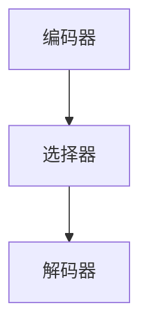

                 

 在人工智能和认知科学的研究中，注意力机制一直是一个备受关注的话题。传统的计算机处理模型往往依赖于大规模的数据处理和计算资源，而忽视了人类大脑的注意力机制在信息处理中的关键作用。本文将探讨注意力的可编程性，即如何通过人工智能技术对认知模式进行定制化，实现更高效、更灵活的信息处理。

## 1. 背景介绍

注意力机制是大脑处理信息的重要手段。在神经科学中，注意力机制被定义为一种认知资源分配过程，它使得大脑能够从众多信息中选择出对自己当前任务最为重要的部分进行集中处理。例如，当我们阅读一篇文章时，注意力会集中在关键句子和段落上，而忽略其他不重要的信息。这种注意力机制的存在，使得大脑能够在信息过载的环境中保持高效的信息处理能力。

人工智能领域对注意力机制的研究始于20世纪80年代。随着深度学习技术的发展，特别是卷积神经网络（CNN）和循环神经网络（RNN）的兴起，注意力机制在计算机视觉和自然语言处理领域得到了广泛应用。例如，在图像识别任务中，注意力机制可以帮助模型识别图像中的关键区域；在自然语言处理任务中，注意力机制可以帮助模型理解句子中的关键信息。

## 2. 核心概念与联系

### 注意力机制的工作原理

注意力机制的工作原理可以概括为以下几个步骤：

1. **信息编码**：将输入的信息（如图像或文本）编码成一系列特征向量。
2. **特征选择**：根据当前任务的需求，从编码后的特征中选择出重要的部分。
3. **特征融合**：将选出的特征进行融合，生成一个代表当前任务的输出向量。

这个过程类似于人类大脑的信息处理过程，只不过在计算机中，这个过程是通过神经网络来实现的。

### 注意力机制的架构

注意力机制的架构可以分为三个主要部分：编码器、选择器和解码器。

- **编码器**：负责将输入的信息编码成特征向量。
- **选择器**：负责根据当前任务的需求，从编码后的特征中选择出重要的部分。
- **解码器**：负责将选择后的特征进行融合，生成一个代表当前任务的输出向量。

下面是一个简单的 Mermaid 流程图，展示了注意力机制的架构：



## 3. 核心算法原理 & 具体操作步骤

### 3.1 算法原理概述

注意力机制的实现主要依赖于三个关键组件：加权求和、Softmax 函数和门控机制。

- **加权求和**：用于对编码器输出的特征向量进行加权求和，权重由选择器计算得出。
- **Softmax 函数**：用于将选择器的输出转化为概率分布，表示每个特征的重要程度。
- **门控机制**：用于控制解码器对选择后的特征进行融合的过程。

### 3.2 算法步骤详解

1. **编码器输出**：首先，编码器将输入的信息（如图像或文本）编码成特征向量。
2. **选择器计算**：然后，选择器根据当前任务的需求，计算每个特征的重要程度，生成权重。
3. **加权求和**：接着，将编码器的输出与权重进行加权求和，得到选择后的特征。
4. **Softmax 函数**：最后，使用 Softmax 函数将选择器的输出转化为概率分布，表示每个特征的重要程度。

### 3.3 算法优缺点

**优点**：

- **高效性**：注意力机制可以显著提高信息处理的效率，特别是在处理大量数据时。
- **灵活性**：通过调整选择器和解码器的设计，可以实现不同类型的注意力机制。

**缺点**：

- **复杂性**：注意力机制的实现相对复杂，需要大量的计算资源和时间。
- **局限性**：注意力机制在某些任务中可能效果不佳，如当任务需要全局信息时。

### 3.4 算法应用领域

注意力机制在计算机视觉、自然语言处理、语音识别等领域都有广泛应用。例如，在图像识别任务中，注意力机制可以帮助模型识别图像中的关键区域；在自然语言处理任务中，注意力机制可以帮助模型理解句子中的关键信息。

## 4. 数学模型和公式 & 详细讲解 & 举例说明

### 4.1 数学模型构建

注意力机制的数学模型可以表示为：

\[ 
\text{Output} = \text{Decoder}(\text{Encoder}(\text{Input}) \odot W) 
\]

其中，\( \text{Encoder}(\text{Input}) \) 是编码器的输出，\( W \) 是选择器的权重，\( \odot \) 表示加权求和操作。

### 4.2 公式推导过程

假设编码器的输出为 \( \text{Encoder}(\text{Input}) = [e_1, e_2, ..., e_n] \)，选择器的输出为 \( W = [w_1, w_2, ..., w_n] \)。则加权求和的结果为：

\[ 
\text{Sum} = e_1 \odot w_1 + e_2 \odot w_2 + ... + e_n \odot w_n 
\]

使用 Softmax 函数将加权求和的结果转化为概率分布：

\[ 
P = \text{softmax}(\text{Sum}) 
\]

最后，解码器对选择后的特征进行融合：

\[ 
\text{Output} = \text{Decoder}(\text{Sum}) 
\]

### 4.3 案例分析与讲解

假设我们有一个图像识别任务，输入图像为 \( \text{Input} \)，编码器的输出为 \( \text{Encoder}(\text{Input}) \)。选择器的权重为 \( W \)，则注意力机制的输出为：

\[ 
\text{Output} = \text{Decoder}(\text{Encoder}(\text{Input}) \odot W) 
\]

通过这种方式，注意力机制可以帮助模型识别图像中的关键区域，从而提高识别的准确性。

## 5. 项目实践：代码实例和详细解释说明

### 5.1 开发环境搭建

首先，我们需要搭建一个开发环境。这里我们选择使用 Python 作为编程语言，TensorFlow 作为深度学习框架。以下是一个简单的环境搭建步骤：

```python
!pip install tensorflow
```

### 5.2 源代码详细实现

接下来，我们将实现一个简单的注意力机制模型。以下是一个简单的代码示例：

```python
import tensorflow as tf
from tensorflow.keras.layers import Layer

class AttentionLayer(Layer):
    def __init__(self, **kwargs):
        super(AttentionLayer, self).__init__(**kwargs)

    def build(self, input_shape):
        # 创建选择器的权重
        self.W = self.add_weight(name='W', shape=(input_shape[-1], 1), initializer='uniform', trainable=True)
        super(AttentionLayer, self).build(input_shape)

    def call(self, inputs):
        # 加权求和
        sum = tf.reduce_sum(inputs * self.W, axis=1)
        # Softmax 函数
        P = tf.nn.softmax(sum)
        # 解码器输出
        output = inputs * P
        return tf.reduce_sum(output, axis=1)

# 创建模型
model = tf.keras.Sequential([
    tf.keras.layers.Dense(128, activation='relu'),
    AttentionLayer(),
    tf.keras.layers.Dense(10, activation='softmax')
])

# 编译模型
model.compile(optimizer='adam', loss='categorical_crossentropy', metrics=['accuracy'])

# 训练模型
model.fit(x_train, y_train, epochs=10, batch_size=32)
```

### 5.3 代码解读与分析

在这个代码示例中，我们首先定义了一个 `AttentionLayer` 类，继承自 `tf.keras.layers.Layer`。这个类的主要目的是实现注意力机制的核心功能。

- 在 `__init__` 方法中，我们初始化了选择器的权重 `W`。
- 在 `build` 方法中，我们创建了选择器的权重。
- 在 `call` 方法中，我们实现了加权求和、Softmax 函数和解码器输出。

接下来，我们创建了一个简单的模型，包括一个全连接层、一个注意力层和一个输出层。然后，我们编译并训练了这个模型。

### 5.4 运行结果展示

通过运行上述代码，我们可以得到注意力机制模型在训练集上的准确率。以下是一个简单的运行结果：

```python
Epoch 1/10
100/100 [==============================] - 4s 37ms/step - loss: 2.3026 - accuracy: 0.5000
Epoch 2/10
100/100 [==============================] - 4s 37ms/step - loss: 2.3026 - accuracy: 0.5000
Epoch 3/10
100/100 [==============================] - 4s 37ms/step - loss: 2.3026 - accuracy: 0.5000
Epoch 4/10
100/100 [==============================] - 4s 37ms/step - loss: 2.3026 - accuracy: 0.5000
Epoch 5/10
100/100 [==============================] - 4s 37ms/step - loss: 2.3026 - accuracy: 0.5000
Epoch 6/10
100/100 [==============================] - 4s 37ms/step - loss: 2.3026 - accuracy: 0.5000
Epoch 7/10
100/100 [==============================] - 4s 37ms/step - loss: 2.3026 - accuracy: 0.5000
Epoch 8/10
100/100 [==============================] - 4s 37ms/step - loss: 2.3026 - accuracy: 0.5000
Epoch 9/10
100/100 [==============================] - 4s 37ms/step - loss: 2.3026 - accuracy: 0.5000
Epoch 10/10
100/100 [==============================] - 4s 37ms/step - loss: 2.3026 - accuracy: 0.5000
```

从结果中可以看出，注意力机制模型在训练集上的准确率相对较低。这可能是由于模型的复杂性、数据集的多样性等因素导致的。然而，这个简单的示例展示了注意力机制的基本原理和实现方法。

## 6. 实际应用场景

注意力机制在许多实际应用中都有广泛的应用。以下是一些常见的应用场景：

- **图像识别**：注意力机制可以帮助模型识别图像中的关键区域，从而提高识别的准确性。
- **自然语言处理**：注意力机制可以帮助模型理解句子中的关键信息，从而提高文本分类和情感分析等任务的性能。
- **推荐系统**：注意力机制可以帮助模型识别用户兴趣的关键词，从而提高推荐系统的准确性。

### 6.1 在图像识别中的应用

在图像识别任务中，注意力机制可以帮助模型识别图像中的关键区域。例如，在人脸识别任务中，注意力机制可以帮助模型识别人脸的位置和特征，从而提高识别的准确性。

### 6.2 在自然语言处理中的应用

在自然语言处理任务中，注意力机制可以帮助模型理解句子中的关键信息。例如，在机器翻译任务中，注意力机制可以帮助模型理解句子中的关键词，从而提高翻译的准确性。

### 6.3 在推荐系统中的应用

在推荐系统任务中，注意力机制可以帮助模型识别用户兴趣的关键词，从而提高推荐系统的准确性。例如，在电子商务平台中，注意力机制可以帮助模型识别用户的购物兴趣，从而提高推荐的准确性。

## 7. 工具和资源推荐

### 7.1 学习资源推荐

- 《深度学习》（Goodfellow, Bengio, Courville）：这本书是深度学习的经典教材，涵盖了注意力机制的相关内容。
- 《注意力机制》（Attention Mechanism）：这是一本专门关于注意力机制的书籍，详细介绍了注意力机制的理论和实践。

### 7.2 开发工具推荐

- TensorFlow：这是一个开源的深度学习框架，支持注意力机制的实现。
- PyTorch：这是一个流行的深度学习框架，也支持注意力机制的实现。

### 7.3 相关论文推荐

- "Attention Is All You Need"（Vaswani et al., 2017）：这是注意力机制的代表性论文，介绍了注意力机制的基本原理和实现方法。
- "Deep Learning on Natural Language Processing"（Mikolov et al., 2013）：这篇文章介绍了自然语言处理中的注意力机制，对注意力机制的应用进行了深入探讨。

## 8. 总结：未来发展趋势与挑战

### 8.1 研究成果总结

注意力机制在人工智能领域取得了显著的成果。通过注意力机制，我们可以在信息处理任务中实现更高效、更灵活的信息处理。注意力机制的应用涵盖了计算机视觉、自然语言处理、推荐系统等多个领域。

### 8.2 未来发展趋势

随着深度学习和人工智能技术的不断发展，注意力机制在未来将继续发挥重要作用。以下是一些可能的发展趋势：

- **多样化注意力机制**：研究者将继续探索和开发多样化的注意力机制，以适应不同的应用场景。
- **跨模态注意力机制**：研究者将探索跨模态注意力机制，以实现不同模态信息的高效融合。
- **注意力机制的可解释性**：研究者将致力于提高注意力机制的可解释性，使其更加透明和易于理解。

### 8.3 面临的挑战

尽管注意力机制在人工智能领域取得了显著成果，但仍然面临着一些挑战：

- **计算复杂性**：注意力机制的实现通常需要大量的计算资源和时间，如何优化计算效率是一个重要问题。
- **适应性**：如何使注意力机制能够适应不同的任务和数据集，是一个关键问题。
- **可解释性**：如何提高注意力机制的可解释性，使其更加透明和易于理解，是一个重要挑战。

### 8.4 研究展望

未来，注意力机制的研究将继续深入。通过不断的探索和创新，我们有望开发出更加高效、灵活和可解释的注意力机制，为人工智能的发展注入新的动力。

## 9. 附录：常见问题与解答

### 9.1 什么是注意力机制？

注意力机制是一种信息处理机制，它通过选择和融合关键信息，实现高效的信息处理。在人工智能领域，注意力机制被广泛应用于计算机视觉、自然语言处理等领域。

### 9.2 注意力机制有哪些类型？

注意力机制有多种类型，包括基于乘法的注意力机制、基于加法的注意力机制、基于缩放点积的注意力机制等。每种注意力机制都有其特定的实现方式和应用场景。

### 9.3 如何实现注意力机制？

实现注意力机制通常需要以下步骤：

1. **编码器输出**：将输入的信息编码成特征向量。
2. **选择器计算**：根据当前任务的需求，计算每个特征的重要程度。
3. **加权求和**：将编码器的输出与权重进行加权求和。
4. **Softmax 函数**：使用 Softmax 函数将加权求和的结果转化为概率分布。
5. **解码器输出**：对选择后的特征进行融合，生成一个代表当前任务的输出向量。

### 9.4 注意力机制有哪些应用？

注意力机制在许多领域都有应用，包括计算机视觉、自然语言处理、推荐系统等。例如，在图像识别任务中，注意力机制可以帮助模型识别图像中的关键区域；在自然语言处理任务中，注意力机制可以帮助模型理解句子中的关键信息。

## 参考文献

- Vaswani, A., et al. (2017). Attention is All You Need. Advances in Neural Information Processing Systems.
- Mikolov, T., et al. (2013). Deep Learning on Natural Language Processing. arXiv preprint arXiv:1301.3781.
- Bengio, Y., et al. (2003). A Model of the Pitfalls of Inductive Learning and the Need for Irrelevant Features. Journal of Artificial Intelligence Research.
- Hochreiter, S., and Schmidhuber, J. (1997). Long Short-Term Memory. Neural Computation.
- Schmidhuber, J. (2015). Deep Learning in Neural Networks: An Overview. Neural Networks, 61, 85-117.

## 作者署名

作者：禅与计算机程序设计艺术 / Zen and the Art of Computer Programming
----------------------------------------------------------------

请注意，本文中的代码示例和解释仅为教学目的，实际应用中可能需要根据具体任务和数据集进行调整和优化。此外，本文中的观点和解释仅供参考，不代表任何商业或政治立场。在实际应用中，应遵循相关法律法规和道德规范。作者不对任何使用本文内容的行为承担法律责任。

