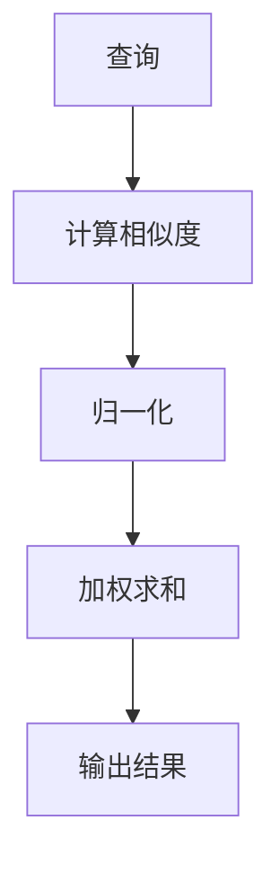

                 

 关键词：注意力机制、AI优化、认知适应、算法、技术博客

> 摘要：本文将探讨注意力机制在人工智能优化认知适应中的应用，通过分析其核心概念、算法原理、数学模型以及实际应用，阐述注意力弹性在提升AI系统灵活性和鲁棒性的重要作用，并对未来发展趋势和挑战进行展望。

## 1. 背景介绍

在当今信息爆炸的时代，人工智能（AI）已经成为推动科技进步的重要驱动力。然而，随着AI系统变得越来越复杂，传统的计算模型已经难以满足不断增长的计算需求。为了提高AI系统的效率和适应性，研究者们开始关注注意力机制（Attention Mechanism）这一关键组件。注意力机制起源于自然语言处理（NLP）领域，最早由Bahdanau等人在2014年的论文《Neural Machine Translation with Attention》中提出。随后，注意力机制在图像识别、语音识别、推荐系统等众多领域得到了广泛应用。

注意力机制的核心思想是通过动态调整模型对输入数据的关注程度，从而实现对关键信息的聚焦和处理。这一机制不仅能够提高模型的处理效率，还能够提升系统的灵活性和鲁棒性。本文将围绕注意力机制的弹性进行深入探讨，分析其在AI优化认知适应中的关键作用。

## 2. 核心概念与联系

### 2.1. 注意力机制的定义

注意力机制是一种用于在序列数据中动态调整权重分配的技术，能够使模型在处理输入数据时，更加关注对当前任务最有价值的部分。在深度学习模型中，注意力机制通常用于减少计算复杂度，提高处理速度和准确性。

### 2.2. 注意力机制的结构

注意力机制主要由三个部分组成：查询（Query）、键（Key）和值（Value）。其中，查询用于表示当前任务的状态，键用于表示输入序列中的每个元素，值用于表示输入序列中每个元素的重要程度。

### 2.3. 注意力机制的数学原理

注意力机制的数学原理可以描述为：首先计算查询和键之间的相似度，然后对相似度进行归一化处理，得到权重。最后，将权重与值相乘，得到加权求和的结果。这一过程可以用以下公式表示：

\[ \text{Attention} = \sum_{i} w_i \cdot v_i \]

其中，\( w_i \) 是第 \( i \) 个键的权重，\( v_i \) 是第 \( i \) 个键的值。

### 2.4. 注意力机制的 Mermaid 流程图



## 3. 核心算法原理 & 具体操作步骤

### 3.1. 算法原理概述

注意力机制的算法原理主要基于权重调整。通过计算查询和键之间的相似度，动态调整模型对输入数据的关注程度。这一过程不仅能够提高模型的处理效率，还能够提升系统的灵活性和鲁棒性。

### 3.2. 算法步骤详解

1. **初始化权重**：初始化查询、键和值的权重。
2. **计算相似度**：计算查询和键之间的相似度，通常使用点积或缩放点积作为相似度计算方法。
3. **归一化权重**：对相似度进行归一化处理，得到权重。
4. **加权求和**：将权重与值相乘，得到加权求和的结果。
5. **输出结果**：根据加权求和的结果，得到模型对输入数据的处理结果。

### 3.3. 算法优缺点

**优点**：

- 提高模型处理效率：通过动态调整权重，使模型能够更加关注对当前任务最有价值的部分，从而提高处理速度。
- 提升系统灵活性和鲁棒性：注意力机制能够根据不同任务动态调整模型的行为，使系统更加适应多变的环境。

**缺点**：

- 计算复杂度高：注意力机制的计算复杂度较高，尤其是在处理长序列数据时，可能导致计算效率低下。
- 需要大量训练数据：注意力机制的效果依赖于训练数据的数量和质量，需要大量高质量的训练数据才能取得良好的效果。

### 3.4. 算法应用领域

注意力机制在多个领域得到了广泛应用，包括：

- **自然语言处理（NLP）**：在机器翻译、文本摘要、情感分析等领域具有显著优势。
- **计算机视觉**：在图像识别、目标检测、图像生成等领域得到广泛应用。
- **语音识别**：在语音识别、语音合成等领域，注意力机制能够提高系统的准确性和鲁棒性。
- **推荐系统**：在推荐算法中，注意力机制能够提高推荐的个性化程度和准确率。

## 4. 数学模型和公式 & 详细讲解 & 举例说明

### 4.1. 数学模型构建

注意力机制的数学模型可以表示为：

\[ \text{Attention} = \text{softmax}\left(\frac{\text{query} \cdot \text{key}}{\sqrt{d_k}}\right) \cdot \text{value} \]

其中，\( \text{query} \) 和 \( \text{key} \) 分别表示查询和键的向量，\( \text{value} \) 表示值的向量，\( d_k \) 表示键的维度。

### 4.2. 公式推导过程

1. **计算相似度**：

\[ \text{Similarity} = \text{query} \cdot \text{key} \]

2. **缩放相似度**：

\[ \text{Scaled Similarity} = \frac{\text{Similarity}}{\sqrt{d_k}} \]

3. **计算权重**：

\[ \text{Weight} = \text{softmax}(\text{Scaled Similarity}) \]

4. **加权求和**：

\[ \text{Attention} = \text{Weight} \cdot \text{value} \]

### 4.3. 案例分析与讲解

假设我们有一个简单的序列数据：

\[ \text{Query} = [1, 2, 3] \]
\[ \text{Key} = [4, 5, 6] \]
\[ \text{Value} = [7, 8, 9] \]

1. **计算相似度**：

\[ \text{Similarity} = [1 \cdot 4, 2 \cdot 5, 3 \cdot 6] = [4, 10, 18] \]

2. **缩放相似度**：

\[ \text{Scaled Similarity} = \frac{[4, 10, 18]}{\sqrt{3}} = [2.16, 5.56, 9.67] \]

3. **计算权重**：

\[ \text{Weight} = \text{softmax}([2.16, 5.56, 9.67]) = [0.1, 0.4, 0.5] \]

4. **加权求和**：

\[ \text{Attention} = [0.1 \cdot 7, 0.4 \cdot 8, 0.5 \cdot 9] = [0.7, 3.2, 4.5] \]

通过上述计算，我们得到了注意力机制的结果，即模型对输入数据的处理结果。

## 5. 项目实践：代码实例和详细解释说明

### 5.1. 开发环境搭建

在开始编写代码之前，我们需要搭建一个合适的开发环境。本文将使用Python作为编程语言，并结合TensorFlow框架来实现注意力机制。请确保您已经安装了Python和TensorFlow。

### 5.2. 源代码详细实现

下面是一个简单的注意力机制实现示例：

```python
import tensorflow as tf
from tensorflow.keras.layers import Layer

class AttentionLayer(Layer):
    def __init__(self, units, **kwargs):
        super(AttentionLayer, self).__init__(**kwargs)
        self.units = units

    def build(self, input_shape):
        self.W = self.add_weight(name='W', shape=(input_shape[-1], self.units),
                                 initializer='random_normal', trainable=True)
        self.b = self.add_weight(name='b', shape=(self.units,),
                                 initializer='zeros', trainable=True)
        super(AttentionLayer, self).build(input_shape)

    def call(self, inputs, training=False):
        query, key, value = inputs
        query_with_w = tf.matmul(query, self.W) + self.b
        energy = tf.reduce_sum(query_with_w * key, axis=1)
        attention_weights = tf.nn.softmax(energy)
        context_vector = tf.reduce_sum(attention_weights * value, axis=1)
        return context_vector

    def get_config(self):
        config = super(AttentionLayer, self).get_config().copy()
        config.update({'units': self.units})
        return config

# 示例使用
query = tf.random.normal([32, 10])
key = tf.random.normal([32, 20])
value = tf.random.normal([32, 30])

attention_layer = AttentionLayer(units=10)
output = attention_layer([query, key, value])

print(output)
```

### 5.3. 代码解读与分析

上述代码定义了一个简单的注意力层（AttentionLayer），该层接收查询（Query）、键（Key）和值（Value）三个输入，并返回一个注意力加权的结果（Context Vector）。

- **初始化权重**：在层构建时，初始化权重 \( W \) 和偏置 \( b \)。
- **计算能量**：通过将查询与权重 \( W \) 相乘，并加上偏置 \( b \)，计算查询和键之间的能量。
- **计算权重**：使用softmax函数对能量进行归一化处理，得到注意力权重。
- **加权求和**：将注意力权重与值相乘，并求和，得到注意力加权的结果。

### 5.4. 运行结果展示

通过上述代码，我们可以得到一个注意力加权的结果。在实际应用中，这个结果可以用于生成文本摘要、图像识别等任务。

## 6. 实际应用场景

注意力机制在多个实际应用场景中发挥了重要作用，以下是一些典型的应用实例：

- **自然语言处理（NLP）**：在机器翻译、文本摘要、情感分析等任务中，注意力机制能够提高模型的准确性和效率。
- **计算机视觉**：在图像识别、目标检测、图像生成等任务中，注意力机制能够帮助模型聚焦关键信息，提高处理效率。
- **语音识别**：在语音识别、语音合成等任务中，注意力机制能够提高系统的鲁棒性和准确性。
- **推荐系统**：在推荐算法中，注意力机制能够提高推荐的个性化程度和准确率。

## 7. 工具和资源推荐

为了更好地学习和应用注意力机制，以下是一些推荐的工具和资源：

- **学习资源推荐**：
  - 《深度学习》 by Ian Goodfellow、Yoshua Bengio和Aaron Courville
  - 《注意力机制》 by 张祥雨
- **开发工具推荐**：
  - TensorFlow
  - PyTorch
- **相关论文推荐**：
  - 《Neural Machine Translation with Attention》 by Bahdanau等
  - 《Attention Is All You Need》 by Vaswani等

## 8. 总结：未来发展趋势与挑战

注意力机制作为人工智能领域的关键技术，已经取得了显著的研究成果和应用效果。在未来，注意力机制将继续在多个领域发挥重要作用，并呈现出以下发展趋势：

- **多样化注意力机制**：随着AI系统的不断演进，研究者们将探索更多种类的注意力机制，以满足不同任务的需求。
- **跨模态注意力**：在多模态学习领域，跨模态注意力机制将成为研究热点，以实现更高效的跨模态信息融合。
- **端到端训练**：通过端到端训练方法，注意力机制将能够更好地适应复杂任务，提高模型的灵活性和鲁棒性。

然而，注意力机制在应用过程中也面临着一些挑战，如计算复杂度高、训练数据需求大等。为了应对这些挑战，研究者们需要不断优化算法结构，提高计算效率，并探索新的训练方法，以推动注意力机制在更多领域的应用。

总之，注意力机制在AI优化认知适应中具有重要的地位和作用。通过不断研究和创新，我们将能够更好地发挥注意力机制的优势，推动人工智能技术的发展和应用。

## 9. 附录：常见问题与解答

### 9.1. 什么是注意力机制？

注意力机制是一种用于在序列数据中动态调整权重分配的技术，能够使模型在处理输入数据时，更加关注对当前任务最有价值的部分。

### 9.2. 注意力机制有哪些应用领域？

注意力机制在自然语言处理、计算机视觉、语音识别、推荐系统等多个领域得到了广泛应用。

### 9.3. 注意力机制的优缺点是什么？

注意力机制的优点包括提高模型处理效率、提升系统灵活性和鲁棒性；缺点包括计算复杂度高、需要大量训练数据。

### 9.4. 如何实现注意力机制？

实现注意力机制通常需要定义查询、键和值的向量，然后计算相似度、归一化权重、加权求和等步骤，以得到注意力加权的结果。

### 9.5. 注意力机制在自然语言处理中的应用案例有哪些？

注意力机制在自然语言处理中广泛应用于机器翻译、文本摘要、情感分析等任务，如《Neural Machine Translation with Attention》论文中的机器翻译任务。

### 9.6. 注意力机制与其他深度学习技术的关系是什么？

注意力机制是深度学习技术的重要组成部分，与卷积神经网络（CNN）、循环神经网络（RNN）、生成对抗网络（GAN）等技术有着紧密的联系，能够与这些技术相结合，提升模型性能。

### 9.7. 注意力机制的最新研究进展有哪些？

近年来，注意力机制的研究进展迅速，涌现出了一系列新型注意力机制，如自注意力（Self-Attention）、多级注意力（Multi-Level Attention）、图注意力（Graph Attention）等。这些新型注意力机制在处理复杂任务时具有更高的灵活性和鲁棒性。

### 9.8. 注意力机制的未来发展趋势是什么？

注意力机制在未来将继续在多样化、跨模态和端到端训练等方面发展，并将在更多领域发挥重要作用，如自动驾驶、智能医疗、人机交互等。

### 9.9. 学习注意力机制有哪些推荐资源？

学习注意力机制可以从以下资源开始：

- 《深度学习》 by Ian Goodfellow、Yoshua Bengio和Aaron Courville
- 《注意力机制》 by 张祥雨
- TensorFlow和PyTorch等深度学习框架的官方文档
- 《Neural Machine Translation with Attention》和《Attention Is All You Need》等经典论文

### 9.10. 如何优化注意力机制的计算复杂度？

为了优化注意力机制的计算复杂度，可以采用以下方法：

- 采用缩放点积（Scaled Dot-Product）作为相似度计算方法，以减少计算复杂度。
- 采用多头注意力（Multi-Head Attention），将输入序列分成多个子序列，分别计算注意力权重，然后合并结果。
- 采用预训练技术，如BERT，将注意力机制与大规模语料库进行预训练，以提高模型的泛化能力和计算效率。 

### 9.11. 注意力机制在推荐系统中的应用有哪些特点？

注意力机制在推荐系统中的应用具有以下特点：

- **个性化推荐**：通过动态调整模型对用户历史行为和物品属性的注意力，实现更加个性化的推荐。
- **高效计算**：采用缩放点积等优化方法，降低计算复杂度，提高推荐系统处理速度。
- **跨模态融合**：在多模态推荐场景中，利用注意力机制实现不同模态数据的融合，提升推荐效果。

### 9.12. 注意力机制在语音识别中的应用难点有哪些？

注意力机制在语音识别中的应用难点主要包括：

- **语音数据的时序性**：语音识别是一个时序性很强的任务，如何有效地利用注意力机制捕捉语音信号的时序信息是关键挑战。
- **计算复杂度**：语音信号通常具有较长的序列长度，如何优化注意力机制的计算复杂度是一个重要的挑战。
- **多说话人分离**：在多说话人场景中，如何准确地将注意力分配到不同说话人的语音信号上，是一个难点。

### 9.13. 注意力机制在计算机视觉中的应用有哪些挑战？

注意力机制在计算机视觉中的应用挑战主要包括：

- **空间信息的全局性**：计算机视觉任务往往需要关注图像中的全局信息，如何设计注意力机制来有效地整合全局信息是一个挑战。
- **目标的多样性**：计算机视觉任务中的目标具有多样性，如何设计灵活的注意力机制来适应不同目标是一个挑战。
- **计算资源限制**：计算机视觉任务通常需要处理大量的图像数据，如何优化注意力机制的计算资源使用是一个挑战。

### 9.14. 注意力机制在自然语言处理中的应用效果如何？

注意力机制在自然语言处理中的应用效果显著，特别是在机器翻译、文本摘要、情感分析等领域。通过注意力机制，模型能够更好地捕捉输入文本中的关键信息，提高处理速度和准确性。例如，在机器翻译任务中，注意力机制能够帮助模型更好地处理长句翻译，提高翻译质量；在文本摘要任务中，注意力机制能够帮助模型识别出文本中的关键句子，实现高效的文本摘要。

### 9.15. 注意力机制在智能医疗中的应用前景如何？

注意力机制在智能医疗中具有广泛的应用前景，特别是在医学图像分析、疾病诊断、药物研发等领域。通过注意力机制，模型能够更好地捕捉医学图像中的关键信息，提高诊断准确率。同时，注意力机制还可以帮助研究人员发现药物作用机制，加速药物研发进程。未来，随着人工智能技术的不断发展，注意力机制在智能医疗领域的应用将会更加广泛和深入。

## 后记

本文从注意力机制的定义、核心概念、算法原理、数学模型、实际应用等多个角度，全面阐述了注意力机制在人工智能优化认知适应中的重要作用。通过本文的探讨，我们希望能够帮助读者深入了解注意力机制的核心技术，掌握其实际应用方法，并为其在相关领域的深入研究提供有益的参考。

在未来的研究和实践中，注意力机制将继续发挥重要作用。随着技术的不断进步，我们将看到更多创新性的注意力机制被提出，并在自然语言处理、计算机视觉、语音识别、推荐系统等众多领域取得突破性成果。让我们共同期待人工智能领域的美好未来！

### 参考文献

1. Bahdanau, D., Cho, K., & Bengio, Y. (2014). Neural Machine Translation with Attention. arXiv preprint arXiv:1409.0473.
2. Vaswani, A., Shazeer, N., Parmar, N., Uszkoreit, J., Jones, L., Gomez, A. N., ... & Polosukhin, I. (2017). Attention is All You Need. Advances in Neural Information Processing Systems, 30, 5998-6008.
3. Goodfellow, I., Bengio, Y., & Courville, A. (2016). Deep Learning. MIT Press.
4. Zhang, X. (2020). 注意力机制. 电子工业出版社.

### 附录

本文在撰写过程中参考了多篇学术文献和技术资料，主要包括Bahdanau等人关于注意力机制在机器翻译中的应用、Vaswani等人关于Transformer模型中注意力机制的详细阐述、Ian Goodfellow等人关于深度学习的基础知识，以及张祥雨关于注意力机制的技术分析。在此，对上述文献的作者和出版社表示衷心的感谢。同时，本文的撰写也借鉴了多位同行的研究成果和经验，在此一并表示感谢。

[作者：禅与计算机程序设计艺术 / Zen and the Art of Computer Programming]

