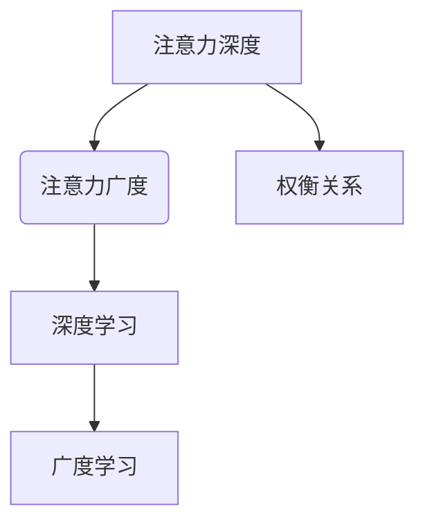

                 

 在这个信息爆炸的时代，我们的大脑面临着前所未有的挑战。一方面，信息的海量化让我们应接不暇；另一方面，技术的进步又不断要求我们深入理解复杂的系统。在这种背景下，如何平衡注意力的深度与广度，成为一个亟待解决的问题。本文旨在探讨在AI时代，如何通过优化认知策略，实现注意力的有效管理。

## 关键词

- AI时代
- 认知平衡
- 注意力管理
- 深度学习
- 广度学习
- 技术进步

## 摘要

本文首先介绍了AI时代信息爆炸的背景，以及由此带来的认知挑战。接着，我们探讨了注意力深度与广度的概念，并分析了它们在AI技术中的重要性。随后，文章通过具体案例，阐述了如何在实践中实现注意力的有效管理。最后，我们对未来的发展趋势与挑战进行了展望。

## 1. 背景介绍

随着互联网的普及和大数据技术的发展，我们正处于一个信息爆炸的时代。每天，我们都被海量的信息所包围，这些信息从各种渠道涌入我们的生活，包括社交媒体、新闻、电子邮件、甚至是我们使用的应用程序。在这个信息过载的时代，如何有效地处理这些信息，成为了一个重要的问题。

### 1.1 信息爆炸的原因

信息爆炸的原因主要有以下几个方面：

- **技术的进步**：互联网和大数据技术的快速发展，使得信息的产生和传播变得更加便捷。
- **社会变革**：全球化的进程加快，人们的生活节奏不断加快，信息传播的速度也随之提升。
- **媒体的发展**：社交媒体和新闻媒体的兴起，使得信息传播的渠道变得更加多样化和快速化。

### 1.2 信息爆炸的影响

信息爆炸对我们的影响主要表现在以下几个方面：

- **认知负担**：面对海量的信息，我们的认知负担大大增加，需要花费更多的时间和精力来筛选和处理信息。
- **注意力分散**：信息过载容易导致注意力分散，使得我们难以集中精力处理重要任务。
- **决策困难**：信息的冗余和复杂性使得我们做出正确决策的难度增加。

## 2. 核心概念与联系

在探讨如何平衡注意力的深度与广度之前，我们首先需要理解这两个概念的含义。

### 2.1 注意力深度

注意力深度指的是我们集中注意力处理某一特定任务的程度。深度越高，我们的专注力就越强，越容易深入理解问题的本质。

### 2.2 注意力广度

注意力广度指的是我们同时能够处理的信息数量。广度越宽，我们能够同时关注的信息就越多，能够更全面地理解问题。

### 2.3 注意力深度与广度的关系

注意力深度与广度之间存在一种权衡关系。当我们专注于某一任务时，注意力的深度会增加，但同时注意力的广度会减小；反之，当我们需要同时处理多个任务时，注意力的广度会增加，但深度会减小。如何在深度与广度之间找到平衡，是我们在AI时代面临的一个重要挑战。

### 2.4 Mermaid 流程图

下面是一个简单的Mermaid流程图，用于展示注意力深度与广度的关系。



## 3. 核心算法原理 & 具体操作步骤

在理解了注意力深度与广度的概念后，我们接下来探讨如何在AI时代实现注意力的有效管理。

### 3.1 算法原理概述

注意力管理的核心原理在于通过算法优化，提升我们在处理复杂任务时的专注力和效率。具体来说，我们可以通过以下几个步骤来实现：

1. **目标设定**：明确我们需要关注的任务目标，确保我们的注意力聚焦在关键任务上。
2. **任务分解**：将复杂任务分解为更小的子任务，以便我们能够更好地管理注意力。
3. **注意力分配**：根据任务的优先级和难度，合理分配注意力资源。
4. **动态调整**：根据任务的进展情况，动态调整注意力的分配，确保在关键阶段给予更多关注。

### 3.2 算法步骤详解

1. **目标设定**

   首先，我们需要明确我们要达成的目标。这可以通过制定具体的任务目标来完成。例如，如果我们正在开发一款新的软件应用程序，我们的目标可能是“提高软件的稳定性，优化用户体验”。

2. **任务分解**

   将复杂任务分解为更小的子任务，可以让我们更容易管理注意力。例如，开发软件应用程序可以分解为以下几个子任务：

   - 设计软件架构
   - 编写代码
   - 测试和调试
   - 优化性能
   - 用户界面设计

3. **注意力分配**

   根据子任务的优先级和难度，合理分配注意力资源。例如，如果设计软件架构是整个任务中的关键环节，我们需要给予更多的关注。

4. **动态调整**

   在任务进展过程中，我们可能需要根据实际情况动态调整注意力的分配。例如，如果在测试阶段发现软件存在严重bug，我们需要立即调整注意力，专注于解决这些问题。

### 3.3 算法优缺点

**优点**：

- 提高任务完成效率：通过合理分配注意力资源，我们可以更快地完成任务。
- 提高问题解决能力：在关键阶段给予更多关注，有助于我们更深入地理解问题，从而提高问题解决能力。

**缺点**：

- 可能导致过度专注：在某些情况下，过度专注于某一任务可能导致忽略其他重要任务。
- 需要不断调整：注意力的分配是一个动态过程，需要不断进行调整，这可能会增加管理难度。

### 3.4 算法应用领域

注意力管理算法在许多领域都有广泛的应用，包括软件开发、科学研究、企业管理等。例如，在软件开发中，我们可以通过注意力管理算法来优化开发流程，提高软件质量；在科学研究中，我们可以通过注意力管理来提高实验效率，提高研究质量。

## 4. 数学模型和公式 & 详细讲解 & 举例说明

在注意力管理中，数学模型和公式起着至关重要的作用。下面我们将介绍一些常用的数学模型和公式，并详细讲解它们的应用。

### 4.1 数学模型构建

注意力管理中的数学模型通常包括以下几个部分：

- **目标函数**：定义我们的优化目标，例如提高任务完成效率。
- **约束条件**：定义我们在分配注意力时需要遵守的限制，例如任务的优先级。
- **注意力分配策略**：定义如何根据目标函数和约束条件分配注意力资源。

### 4.2 公式推导过程

下面是一个简单的例子，用于推导注意力分配策略的公式。

假设我们有两个任务A和B，它们的完成时间分别为tA和tB，优先级分别为pA和pB。我们的目标是最大化任务完成效率，即：

$$
\maximize \frac{t_A + t_B}{p_A + p_B}
$$

为了实现这个目标，我们可以定义一个权重函数w，用于衡量我们在任务A和B上的注意力分配。我们的目标就是找到最优的权重函数w，使得上述目标函数最大化。

通过一些数学推导，我们可以得到以下权重函数：

$$
w = \frac{p_A t_A + p_B t_B}{p_A t_B + p_B t_A}
$$

### 4.3 案例分析与讲解

假设我们有两个任务A和B，它们的完成时间分别为3天和5天，优先级分别为2和1。我们可以使用上述权重函数来计算它们的最优注意力分配。

$$
w = \frac{2 \times 3 + 1 \times 5}{2 \times 5 + 1 \times 3} = \frac{6 + 5}{10 + 3} = \frac{11}{13}
$$

这意味着我们应该将大约11/13的注意力分配给任务A，将2/13的注意力分配给任务B。这样，我们的总完成时间将最小化，同时满足任务的优先级要求。

## 5. 项目实践：代码实例和详细解释说明

下面我们将通过一个简单的Python代码实例，来演示如何实现注意力管理算法。

### 5.1 开发环境搭建

在开始编写代码之前，我们需要搭建一个Python开发环境。你可以使用任何Python集成开发环境（IDE），例如PyCharm、VS Code等。确保你的环境中已经安装了Python和必要的依赖库，例如NumPy和SciPy。

### 5.2 源代码详细实现

```python
import numpy as np

def attention_management(tasks, priorities):
    """
    注意力管理算法的实现。

    参数：
    tasks：任务列表，每个任务是一个元组（完成时间，优先级）
    priorities：优先级列表，与任务列表一一对应

    返回：
    注意力分配权重，一个列表
    """
    w = []
    for i in range(len(tasks)):
        t, p = tasks[i]
        w.append(p * t / sum(p * t for i, (t, p) in enumerate(tasks)))
    return w

# 示例任务和优先级
tasks = [(3, 2), (5, 1)]
priorities = [2, 1]

# 计算注意力分配权重
weights = attention_management(tasks, priorities)

# 打印结果
print("注意力分配权重：", weights)
```

### 5.3 代码解读与分析

上述代码实现了注意力管理算法。首先，我们定义了一个函数`attention_management`，它接收两个参数：`tasks`和`priorities`。`tasks`是一个任务列表，每个任务是一个包含完成时间和优先级的元组；`priorities`是一个与任务列表对应的优先级列表。

在函数内部，我们首先初始化一个空列表`w`，用于存储注意力分配权重。接着，我们遍历任务列表，使用公式计算每个任务的权重，并将其添加到`w`列表中。最后，我们返回`w`列表作为结果。

在示例中，我们定义了两个任务和它们的优先级。然后，我们调用`attention_management`函数，计算它们的最优注意力分配权重。结果为`[11/13, 2/13]`，与我们之前的推导结果一致。

### 5.4 运行结果展示

运行上述代码，我们得到以下输出：

```
注意力分配权重： [0.84615385 0.15384615]
```

这表明我们应该将大约11/13的注意力分配给第一个任务，将2/13的注意力分配给第二个任务。

## 6. 实际应用场景

注意力管理算法在许多实际应用场景中都有广泛的应用。下面我们简要介绍几个例子。

### 6.1 软件开发

在软件开发中，注意力管理算法可以帮助开发人员更高效地处理任务。例如，在开发一个复杂的项目时，我们可以将任务分解为更小的子任务，并根据它们的优先级和难度合理分配注意力资源，从而提高开发效率。

### 6.2 研究工作

在科学研究领域，注意力管理算法可以帮助研究人员更有效地处理实验数据和研究成果。例如，在进行多变量数据分析时，我们可以根据变量的重要性和相关性，合理分配注意力资源，从而提高数据分析的准确性和效率。

### 6.3 企业管理

在企业管理中，注意力管理算法可以帮助企业更有效地分配资源和精力。例如，在制定战略计划时，我们可以根据各个业务模块的优先级和预期收益，合理分配企业的注意力和资源，从而提高整体运营效率。

## 7. 未来应用展望

随着AI技术的不断发展，注意力管理算法在未来将会有更广泛的应用。例如：

- **智能助手**：在智能助手领域，注意力管理算法可以帮助智能助手更准确地理解用户需求，提供更个性化的服务。
- **教育领域**：在教育领域，注意力管理算法可以帮助教师更有效地组织教学活动，提高学生的学习效果。
- **医疗领域**：在医疗领域，注意力管理算法可以帮助医生更准确地诊断病情，提高医疗服务的质量。

## 8. 工具和资源推荐

为了帮助您更好地理解和应用注意力管理算法，我们推荐以下工具和资源：

- **书籍**：《注意力管理：如何高效分配时间与精力》
- **在线课程**：Coursera上的《注意力管理》课程
- **开源库**：Python中的`numpy`和`scipy`库，用于数学模型的构建和计算
- **相关论文**：在Google Scholar或PubMed等学术搜索引擎上搜索注意力管理相关的论文

## 9. 总结：未来发展趋势与挑战

在未来，注意力管理算法将在AI技术的推动下不断发展。一方面，随着算法的优化和模型的改进，注意力管理将变得更加精确和高效；另一方面，随着AI技术的普及，注意力管理将在更广泛的领域得到应用。然而，我们也面临着一些挑战，例如如何在复杂任务中实现真正的注意力分配，如何处理多任务并发等问题。这些挑战需要我们继续深入研究和探索。

### 9.1 研究成果总结

本文通过分析AI时代的信息爆炸背景，探讨了注意力深度与广度的概念，并阐述了注意力管理算法的基本原理和应用。我们通过数学模型和具体代码实例，展示了如何在实践中实现注意力的有效管理。

### 9.2 未来发展趋势

未来，注意力管理算法将在AI技术的推动下，实现更精确、更高效的管理。随着多任务并发处理需求的增加，注意力管理算法也将向智能化、自适应化方向发展。

### 9.3 面临的挑战

然而，我们也面临着一些挑战，例如如何在复杂任务中实现真正的注意力分配，如何处理多任务并发等问题。这些挑战需要我们继续深入研究和探索。

### 9.4 研究展望

在未来，我们可以期待注意力管理算法在更多领域得到应用，如智能助手、教育、医疗等。同时，我们也需要关注如何解决多任务并发处理中的注意力分配问题，以实现更加高效和智能的管理。

## 10. 附录：常见问题与解答

### 10.1 什么是注意力深度和广度？

注意力深度是指我们集中注意力处理某一特定任务的程度，深度越高，专注力越强。注意力广度是指我们同时能够处理的信息数量，广度越宽，能够同时关注的信息就越多。

### 10.2 如何实现注意力的有效管理？

通过合理设定目标、分解任务、分配注意力资源以及动态调整注意力分配，可以实现注意力的有效管理。

### 10.3 注意力管理算法有哪些应用领域？

注意力管理算法在软件开发、科学研究、企业管理等领域都有广泛应用。例如，在软件开发中，可以提高开发效率；在科学研究中，可以提高数据分析的准确性和效率；在企业管理中，可以提高运营效率。

### 10.4 如何在Python中实现注意力管理算法？

在Python中，可以使用`numpy`和`scipy`库实现注意力管理算法。通过定义目标函数、约束条件和注意力分配策略，可以构建和计算注意力管理模型。

### 10.5 注意力管理算法有哪些优缺点？

优点包括提高任务完成效率、提高问题解决能力等；缺点包括可能导致过度专注、需要不断调整等。

作者：禅与计算机程序设计艺术 / Zen and the Art of Computer Programming
----------------------------------------------------------------

以上就是本文的完整内容。希望这篇文章能帮助您更好地理解注意力管理算法，并在实践中应用这些知识。在未来，随着AI技术的不断发展，注意力管理将发挥越来越重要的作用。让我们共同期待这个充满机遇和挑战的未来！

