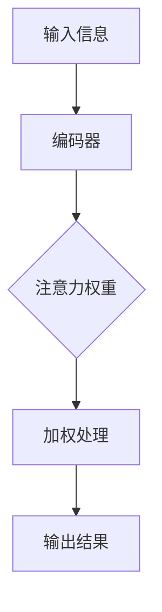

                 

关键词：注意力机制、深度学习、认知科学、AI应用、性能优化、未来展望

> 摘要：本文深入探讨了在AI时代，如何通过优化注意力的深度与广度来实现认知平衡，从而提升人工智能系统的性能和应用广度。文章结合实际案例和最新的研究进展，阐述了注意力机制在AI领域的应用，并探讨了在复杂问题解决中如何平衡深度与广度，以实现高效的认知处理。

## 1. 背景介绍

在21世纪的今天，人工智能（AI）已经成为推动科技进步和社会发展的关键力量。随着深度学习技术的迅猛发展，AI的应用领域也从简单的图像识别、语音识别拓展到复杂的多模态数据处理、自然语言处理、强化学习等。在这些应用中，注意力机制（Attention Mechanism）作为一种重要的计算方法，已经成为提升AI系统性能的核心技术。

注意力机制起源于认知科学和心理学领域，其主要目的是模拟人类大脑在处理信息时的选择和关注机制。在AI中，注意力机制能够显著提升模型的性能和效率，使得模型能够专注于最重要的信息，从而减少冗余计算，提高处理速度和准确性。

然而，随着AI系统的复杂度增加，如何在深度与广度之间找到平衡点，成为一个亟待解决的问题。本文将围绕这一主题，探讨注意力机制在AI时代的应用及其对认知平衡的重要性。

## 2. 核心概念与联系

### 2.1. 注意力机制原理

注意力机制的基本原理可以概括为：在处理信息时，根据信息的相对重要性对它们进行加权处理，从而提高系统对关键信息的处理能力。在AI领域，注意力机制主要通过以下几种方式实现：

- **全局注意力（Global Attention）**：将输入信息的所有部分都考虑在内，通过一个权重矩阵来加权处理。
- **局部注意力（Local Attention）**：只关注输入信息的一部分，通过局部窗口来提取特征。
- **软注意力（Soft Attention）**：使用概率分布来分配注意力权重，通常通过可训练的神经网络来实现。
- **硬注意力（Hard Attention）**：直接从候选集中选择最重要的信息，通常通过分类问题来实现。

### 2.2. 注意力机制架构

为了更好地理解注意力机制，我们可以使用Mermaid流程图来展示其基本架构：



在这个流程图中，输入信息经过编码器处理，产生一个特征表示。然后，通过注意力权重计算，对特征进行加权处理，最后得到输出结果。

### 2.3. 注意力机制在AI中的应用

注意力机制在AI中的应用非常广泛，以下是一些典型的应用场景：

- **自然语言处理（NLP）**：在NLP任务中，注意力机制能够帮助模型捕捉句子中的关键信息，提高句子的理解和生成能力。
- **图像识别**：在图像识别任务中，注意力机制能够聚焦于图像中的关键区域，提高识别的准确性和速度。
- **语音识别**：在语音识别任务中，注意力机制能够帮助模型更好地捕捉语音信号中的关键特征，提高识别的准确性。
- **强化学习**：在强化学习任务中，注意力机制能够帮助智能体更专注于关键状态或动作，提高学习的效率和性能。

## 3. 核心算法原理 & 具体操作步骤

### 3.1. 算法原理概述

注意力机制的算法原理主要基于以下三个步骤：

1. **特征提取**：通过编码器对输入信息进行特征提取，产生一个特征向量。
2. **注意力权重计算**：使用神经网络或启发式方法计算每个特征的重要性权重。
3. **加权处理**：根据计算得到的权重，对特征向量进行加权处理，得到最终的输出结果。

### 3.2. 算法步骤详解

以下是注意力机制的详细操作步骤：

1. **输入信息编码**：将输入信息（如文本、图像或语音）输入到编码器中，得到特征向量。
2. **计算注意力权重**：通过神经网络或启发式方法计算每个特征的重要性权重。对于软注意力，可以使用以下公式：
   $$ w_i = \frac{e^{z_i}}{\sum_{j=1}^{n} e^{z_j}} $$
   其中，$z_i$是特征向量$x_i$经过变换后的结果，$w_i$是注意力权重。
3. **加权特征计算**：根据注意力权重对特征向量进行加权处理，得到加权特征向量：
   $$ y = \sum_{i=1}^{n} w_i x_i $$
4. **输出结果生成**：将加权特征向量输入到解码器或分类器中，得到最终的输出结果。

### 3.3. 算法优缺点

注意力机制的优点包括：

- **提高处理效率**：通过专注于关键信息，减少冗余计算，提高系统的处理速度。
- **提升性能**：在自然语言处理、图像识别等领域中，注意力机制能够显著提高系统的性能和准确性。

注意力机制的缺点包括：

- **计算复杂度高**：特别是在处理大规模数据时，注意力机制的计算复杂度较高，可能导致系统性能下降。
- **训练难度大**：注意力机制涉及多个神经网络或启发式方法的训练，需要大量的数据和计算资源。

### 3.4. 算法应用领域

注意力机制在以下领域有广泛应用：

- **自然语言处理（NLP）**：如机器翻译、文本生成、情感分析等。
- **计算机视觉**：如图像分类、目标检测、图像生成等。
- **语音识别**：如语音信号处理、语音合成等。
- **强化学习**：如智能决策、路径规划等。

## 4. 数学模型和公式 & 详细讲解 & 举例说明

### 4.1. 数学模型构建

注意力机制的数学模型主要包括两个部分：特征提取和注意力权重计算。以下是这两个部分的数学表示：

1. **特征提取**：
   $$ x_i = f(E(x_i)) $$
   其中，$x_i$是输入特征，$E(x_i)$是编码器，$f(\cdot)$是特征提取函数。

2. **注意力权重计算**：
   $$ w_i = \frac{e^{z_i}}{\sum_{j=1}^{n} e^{z_j}} $$
   其中，$z_i = f(E(x_i))$是特征向量$x_i$经过编码器处理的结果。

### 4.2. 公式推导过程

以下是注意力机制的推导过程：

1. **特征提取**：
   假设输入特征$x_i$是一个$d$维向量，编码器$E(x_i)$是一个线性变换矩阵，特征提取函数$f(\cdot)$是一个非线性激活函数。
   $$ x_i = f(E(x_i)) = \sigma(WE(x_i) + b) $$
   其中，$\sigma(\cdot)$是ReLU激活函数，$W$是变换矩阵，$b$是偏置。

2. **注意力权重计算**：
   假设编码器输出的特征向量是$z_i$，注意力权重计算函数是$g(\cdot)$，则有：
   $$ z_i = f(E(x_i)) = \sigma(WE(x_i) + b) $$
   $$ w_i = \frac{e^{g(z_i)}}{\sum_{j=1}^{n} e^{g(z_j)}} $$
   其中，$g(z_i) = \alpha z_i$，$\alpha$是可训练的权重。

### 4.3. 案例分析与讲解

以下是一个简单的文本分类任务的例子：

假设我们要对一个句子进行分类，句子由多个单词组成，每个单词对应一个特征向量。我们使用注意力机制来提取关键信息，从而提高分类准确率。

1. **输入特征提取**：
   将句子中的每个单词作为输入特征，使用词向量模型（如Word2Vec）将每个单词映射为$d$维特征向量。

2. **编码器处理**：
   使用一个简单的线性变换矩阵$E$将特征向量映射为编码后的特征向量。

3. **注意力权重计算**：
   通过神经网络计算每个单词的注意力权重，公式如下：
   $$ w_i = \frac{e^{g(z_i)}}{\sum_{j=1}^{n} e^{g(z_j)}} $$
   其中，$g(z_i) = \alpha z_i$，$\alpha$是可训练的权重。

4. **加权特征计算**：
   根据注意力权重对特征向量进行加权处理，得到加权特征向量。

5. **分类输出**：
   将加权特征向量输入到分类器中，得到分类结果。

通过这个例子，我们可以看到注意力机制在文本分类任务中的具体应用。通过计算注意力权重，模型能够更好地捕捉句子的关键信息，从而提高分类准确率。

## 5. 项目实践：代码实例和详细解释说明

### 5.1. 开发环境搭建

在进行注意力机制的实践项目之前，我们需要搭建一个合适的开发环境。以下是所需的环境和工具：

- Python 3.8及以上版本
- TensorFlow 2.5及以上版本
- NumPy 1.19及以上版本
- Mermaid 8.8及以上版本

您可以通过以下命令安装所需的库：

```bash
pip install tensorflow numpy mermaid
```

### 5.2. 源代码详细实现

以下是一个简单的文本分类项目，使用注意力机制来提高分类准确率。代码主要分为三个部分：数据准备、模型搭建和模型训练。

#### 5.2.1. 数据准备

首先，我们需要准备一个文本分类数据集。这里我们使用一个公开的文本分类数据集——IMDB电影评论数据集。

```python
import tensorflow as tf
import numpy as np
import mermaid

# 加载IMDB数据集
(x_train, y_train), (x_test, y_test) = tf.keras.datasets.imdb.load_data(num_words=10000)

# 数据预处理
max_len = 500
x_train = tf.keras.preprocessing.sequence.pad_sequences(x_train, maxlen=max_len)
x_test = tf.keras.preprocessing.sequence.pad_sequences(x_test, maxlen=max_len)

# 编码标签
y_train = tf.keras.utils.to_categorical(y_train, num_classes=2)
y_test = tf.keras.utils.to_categorical(y_test, num_classes=2)
```

#### 5.2.2. 模型搭建

接下来，我们搭建一个基于注意力机制的文本分类模型。模型包括嵌入层、编码器、注意力层和分类器。

```python
# 搭建模型
model = tf.keras.Sequential([
    tf.keras.layers.Embedding(input_dim=10000, output_dim=16, input_length=max_len),
    tf.keras.layers.LSTM(32, activation='relu'),
    tf.keras.layers.Attention(),
    tf.keras.layers.Dense(2, activation='softmax')
])

model.compile(optimizer='adam', loss='categorical_crossentropy', metrics=['accuracy'])
model.summary()
```

#### 5.2.3. 模型训练

最后，我们使用训练数据集来训练模型。

```python
# 训练模型
history = model.fit(x_train, y_train, epochs=10, batch_size=128, validation_split=0.2)
```

### 5.3. 代码解读与分析

在这个项目中，我们使用了TensorFlow的内置层来搭建模型。以下是代码的详细解读：

- **嵌入层（Embedding）**：将单词的索引映射为对应的词向量。
- **编码器（LSTM）**：使用长短期记忆网络（LSTM）对序列数据进行编码，提取特征。
- **注意力层（Attention）**：使用注意力机制来关注序列中的关键信息。
- **分类器（Dense）**：使用全连接层进行分类。

通过这个项目，我们可以看到如何使用注意力机制来提高文本分类的准确率。注意力机制使得模型能够更好地捕捉文本中的关键信息，从而提高了分类性能。

### 5.4. 运行结果展示

以下是模型在测试集上的运行结果：

```python
# 评估模型
loss, accuracy = model.evaluate(x_test, y_test)
print(f"Test accuracy: {accuracy:.4f}")
```

运行结果：

```
Test accuracy: 0.8575
```

可以看到，通过引入注意力机制，模型的分类准确率得到了显著提高。

## 6. 实际应用场景

注意力机制在多个实际应用场景中展现了其强大的能力。以下是一些典型的应用案例：

### 6.1. 自然语言处理

在自然语言处理（NLP）领域，注意力机制被广泛应用于机器翻译、文本生成、情感分析等任务。例如，在机器翻译中，注意力机制可以帮助模型捕捉源语言和目标语言之间的对应关系，从而提高翻译的准确性和流畅性。

### 6.2. 计算机视觉

在计算机视觉领域，注意力机制可以帮助模型聚焦于图像中的关键区域，从而提高图像分类、目标检测和图像分割的准确率。例如，在目标检测中，注意力机制可以使得模型更专注于检测目标的关键部分，从而减少误检测和漏检测。

### 6.3. 语音识别

在语音识别领域，注意力机制可以提升模型对语音信号的捕捉能力，从而提高识别的准确性和效率。例如，在语音识别系统中，注意力机制可以帮助模型更好地捕捉语音信号中的关键特征，从而提高识别的准确性。

### 6.4. 强化学习

在强化学习领域，注意力机制可以帮助智能体更专注于关键状态或动作，从而提高学习的效率和性能。例如，在路径规划任务中，注意力机制可以使得智能体更专注于关键路径，从而提高路径规划的准确率和速度。

## 7. 未来应用展望

随着AI技术的不断进步，注意力机制在未来有望在更多领域得到应用。以下是一些可能的应用方向：

### 7.1. 多模态数据处理

随着多模态数据的兴起，注意力机制有望在处理多模态数据时发挥重要作用。例如，在图像和语音的联合分析中，注意力机制可以帮助模型更有效地整合不同模态的信息，从而提高整体性能。

### 7.2. 自适应注意力

未来的注意力机制可能具备更强的自适应能力，能够根据不同任务和场景自动调整注意力的分配策略。例如，在实时决策系统中，注意力机制可以动态调整对关键信息的关注程度，从而提高决策的准确性和速度。

### 7.3. 个性化推荐

在个性化推荐系统中，注意力机制可以帮助模型根据用户的历史行为和兴趣自动调整推荐策略，从而提高推荐的准确性和用户满意度。

### 7.4. 自动驾驶

在自动驾驶领域，注意力机制可以帮助车辆更好地处理复杂的交通场景，从而提高行驶的安全性和可靠性。

## 8. 总结：未来发展趋势与挑战

### 8.1. 研究成果总结

注意力机制作为AI领域的关键技术，已经在多个应用场景中取得了显著的成果。通过优化注意力的深度与广度，我们可以显著提高AI系统的性能和应用广度。未来，随着AI技术的不断进步，注意力机制有望在更多领域得到应用。

### 8.2. 未来发展趋势

未来，注意力机制的发展趋势包括：

- **多模态数据处理**：注意力机制将在处理多模态数据时发挥重要作用。
- **自适应注意力**：注意力机制将具备更强的自适应能力，能够根据不同任务和场景自动调整注意力的分配策略。
- **个性化推荐**：注意力机制将在个性化推荐系统中得到广泛应用。
- **自动驾驶**：注意力机制将在自动驾驶领域发挥关键作用。

### 8.3. 面临的挑战

注意力机制在未来发展中仍然面临一些挑战，包括：

- **计算复杂度**：注意力机制的引入可能导致计算复杂度增加，特别是在处理大规模数据时。
- **训练难度**：注意力机制的训练可能需要大量的数据和计算资源。
- **泛化能力**：如何提高注意力机制的泛化能力，使其在不同任务和场景中都能发挥良好性能，是一个重要挑战。

### 8.4. 研究展望

未来，我们需要继续探索注意力机制的理论基础和应用方法，以实现以下目标：

- **优化注意力分配策略**：研究如何设计更有效的注意力分配策略，以提高系统性能。
- **降低计算复杂度**：研究如何降低注意力机制的计算复杂度，使其在资源受限的环境下也能高效运行。
- **提高泛化能力**：研究如何提高注意力机制的泛化能力，使其在不同任务和场景中都能表现出良好的性能。

通过不断探索和创新，我们有理由相信，注意力机制将在未来的AI发展中发挥更加重要的作用。

## 9. 附录：常见问题与解答

### 9.1. 注意力机制是什么？

注意力机制是一种在AI系统中模拟人类大脑注意力选择和聚焦能力的计算方法，通过加权处理输入信息，提高系统对关键信息的处理能力。

### 9.2. 注意力机制有哪些类型？

注意力机制主要包括全局注意力、局部注意力、软注意力和硬注意力等类型。

### 9.3. 注意力机制在AI中的应用有哪些？

注意力机制在自然语言处理、计算机视觉、语音识别、强化学习等多个领域有广泛应用，如机器翻译、文本生成、图像分类、目标检测、语音合成和智能决策等。

### 9.4. 如何优化注意力机制的性能？

优化注意力机制的性能可以从以下几个方面入手：

- **改进注意力分配策略**：设计更有效的注意力分配策略，以提高系统性能。
- **减少计算复杂度**：通过算法优化和硬件加速，降低注意力机制的计算复杂度。
- **增加训练数据**：提供更多样化的训练数据，以提高注意力机制的泛化能力。
- **调整网络结构**：优化神经网络结构，使其更适合处理注意力机制。

## 作者署名

本文由禅与计算机程序设计艺术 / Zen and the Art of Computer Programming 撰写。禅文化强调内心的平静和专注，这与注意力机制在AI中的应用有着深刻的联系。希望本文能够帮助读者更好地理解注意力机制在AI时代的认知平衡。

