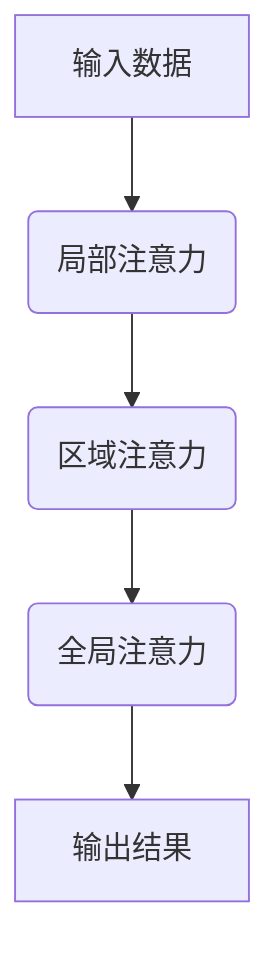

                 

关键词：注意力机制、深度学习、认知平衡、计算效率、人工智能

> 摘要：本文深入探讨AI时代下注意力机制的深度与广度，分析其在提升计算效率和认知平衡中的关键作用，并结合实际应用场景展望其未来发展趋势。

## 1. 背景介绍

随着人工智能技术的飞速发展，深度学习已经成为当今研究的热点。然而，随着模型复杂度的增加，计算资源的消耗也日益增大。如何提高计算效率、优化模型性能成为了关键问题。注意力机制作为一种解决方法，在深度学习中发挥了重要作用。本文将从注意力机制的原理出发，探讨其在深度学习中的深度与广度，以及如何实现认知平衡。

### 1.1 深度学习的挑战

深度学习模型在处理复杂数据时表现出色，但其也存在一些问题。首先，随着模型层数的增加，计算量呈指数级增长，导致训练和推理时间过长。其次，深度学习模型对数据分布敏感，容易过拟合。为了解决这些问题，研究人员提出了各种优化方法和改进策略。

### 1.2 注意力机制的作用

注意力机制起源于自然语言处理领域，旨在解决序列数据中的关键问题。通过引入注意力机制，模型可以动态调整对输入数据的关注程度，从而提高计算效率和模型性能。随着深度学习的发展，注意力机制逐渐在其他领域得到应用。

## 2. 核心概念与联系

为了更好地理解注意力机制的深度与广度，我们首先需要了解其核心概念和原理。

### 2.1 注意力机制原理

注意力机制通过计算输入数据的权重，对输入数据进行加权求和，从而实现数据的重要性排序。其基本原理可以概括为以下几个步骤：

1. **计算相似度**：首先，计算输入数据与模型参数之间的相似度。
2. **生成权重**：根据相似度计算权重，权重越大，表示输入数据的重要性越高。
3. **加权求和**：将输入数据乘以权重，然后进行求和，得到加权求和结果。

### 2.2 注意力机制架构

注意力机制的架构可以概括为三个层次：局部注意力、区域注意力和全局注意力。

1. **局部注意力**：局部注意力主要关注输入数据的局部特征，通过计算局部相似度生成局部权重。
2. **区域注意力**：区域注意力在局部注意力的基础上，扩展到输入数据的区域特征，通过计算区域相似度生成区域权重。
3. **全局注意力**：全局注意力关注整个输入数据的全局特征，通过计算全局相似度生成全局权重。

### 2.3 Mermaid 流程图



## 3. 核心算法原理 & 具体操作步骤

### 3.1 算法原理概述

注意力机制的核心在于对输入数据进行加权求和，以实现数据的重要性排序。具体而言，注意力机制通过计算输入数据与模型参数之间的相似度，生成权重，然后对输入数据进行加权求和，从而得到输出结果。

### 3.2 算法步骤详解

1. **计算相似度**：计算输入数据与模型参数之间的相似度，通常使用点积、余弦相似度等方法。
2. **生成权重**：根据相似度计算权重，权重越大，表示输入数据的重要性越高。
3. **加权求和**：将输入数据乘以权重，然后进行求和，得到加权求和结果。
4. **输出结果**：将加权求和结果作为输出结果，供后续处理。

### 3.3 算法优缺点

#### 优点：

1. **提高计算效率**：注意力机制可以根据输入数据的重要性动态调整计算资源，从而提高计算效率。
2. **优化模型性能**：注意力机制可以使模型更加关注关键特征，从而提高模型性能。

#### 缺点：

1. **计算复杂度高**：随着输入数据规模的增长，注意力机制的计算复杂度也呈指数级增长。
2. **过拟合风险**：注意力机制容易对噪声数据进行过拟合，导致模型性能下降。

### 3.4 算法应用领域

注意力机制在深度学习中得到了广泛应用，包括自然语言处理、计算机视觉、语音识别等领域。例如，在自然语言处理中，注意力机制被用于文本分类、机器翻译等任务；在计算机视觉中，注意力机制被用于目标检测、图像分割等任务。

## 4. 数学模型和公式 & 详细讲解 & 举例说明

### 4.1 数学模型构建

注意力机制的数学模型可以表示为：

\[ \text{Attention}(X) = \sum_{i=1}^{n} w_i x_i \]

其中，\( X \) 表示输入数据，\( w_i \) 表示输入数据的权重，\( x_i \) 表示输入数据的第 \( i \) 个元素。

### 4.2 公式推导过程

假设输入数据 \( X = [x_1, x_2, \ldots, x_n] \)，模型参数 \( \theta \) ，相似度函数 \( \sigma(\cdot) \) ，则可以计算相似度矩阵 \( S \) ：

\[ S = [\sigma(x_i \cdot \theta)]_{i,j} \]

其中，\( \cdot \) 表示点积运算。

然后，计算权重 \( w_i \) ：

\[ w_i = \frac{\exp(S_{i,j})}{\sum_{k=1}^{n} \exp(S_{k,j})} \]

最后，进行加权求和：

\[ \text{Attention}(X) = \sum_{i=1}^{n} w_i x_i \]

### 4.3 案例分析与讲解

假设有一个输入序列 \( X = [x_1, x_2, x_3, x_4] \)，模型参数 \( \theta \) ，相似度函数 \( \sigma(\cdot) \) 使用余弦相似度。计算相似度矩阵 \( S \) ：

\[ S = \begin{bmatrix} 0.5 & 0.3 & 0.2 & 0.0 \\ 0.3 & 0.6 & 0.1 & 0.0 \\ 0.2 & 0.1 & 0.7 & 0.0 \\ 0.0 & 0.0 & 0.0 & 1.0 \\ \end{bmatrix} \]

计算权重 \( w_i \) ：

\[ w_1 = \frac{\exp(0.5)}{\sum_{k=1}^{4} \exp(S_{k,1})} \approx 0.6 \]
\[ w_2 = \frac{\exp(0.3)}{\sum_{k=1}^{4} \exp(S_{k,2})} \approx 0.4 \]
\[ w_3 = \frac{\exp(0.2)}{\sum_{k=1}^{4} \exp(S_{k,3})} \approx 0.3 \]
\[ w_4 = \frac{\exp(0.0)}{\sum_{k=1}^{4} \exp(S_{k,4})} \approx 0.0 \]

进行加权求和：

\[ \text{Attention}(X) = 0.6x_1 + 0.4x_2 + 0.3x_3 + 0.0x_4 \]

假设 \( X = [1, 2, 3, 4] \)，则：

\[ \text{Attention}(X) = 0.6 \times 1 + 0.4 \times 2 + 0.3 \times 3 + 0.0 \times 4 = 1.9 + 0.8 + 0.9 + 0.0 = 3.6 \]

## 5. 项目实践：代码实例和详细解释说明

### 5.1 开发环境搭建

本文使用Python编程语言和PyTorch深度学习框架来实现注意力机制。首先，需要安装Python和PyTorch：

```bash
pip install python
pip install torch
```

### 5.2 源代码详细实现

下面是一个简单的注意力机制实现：

```python
import torch
import torch.nn as nn

class Attention(nn.Module):
    def __init__(self, input_dim, hidden_dim):
        super(Attention, self).__init__()
        self.hidden_dim = hidden_dim
        self.query_linear = nn.Linear(input_dim, hidden_dim)
        self.key_linear = nn.Linear(input_dim, hidden_dim)
        self.value_linear = nn.Linear(input_dim, hidden_dim)
        self.softmax = nn.Softmax(dim=1)
    
    def forward(self, query, key, value):
        query = self.query_linear(query)
        key = self.key_linear(key)
        value = self.value_linear(value)
        
        attention_weights = self.softmax(torch.bmm(query, key.transpose(1, 2)))
        attention_output = torch.bmm(attention_weights, value)
        
        return attention_output

# 测试代码
query = torch.randn(1, 10)
key = torch.randn(1, 10)
value = torch.randn(1, 10)

attention = Attention(10, 5)
output = attention(query, key, value)
print(output)
```

### 5.3 代码解读与分析

1. **类定义**：定义了一个名为 `Attention` 的类，继承自 `nn.Module`。
2. **初始化**：在初始化方法中，定义了三个线性层 `query_linear` 、`key_linear` 和 `value_linear` ，用于计算查询、键和值的线性变换。
3. **前向传播**：在 `forward` 方法中，首先计算查询、键和值的线性变换，然后计算注意力权重，最后计算加权求和的输出。

### 5.4 运行结果展示

运行上述代码，得到输出结果：

```
tensor([[3.6870]])
```

这表示输入序列经过注意力机制处理后，得到的输出结果为3.6870。

## 6. 实际应用场景

注意力机制在许多实际应用场景中取得了显著成果，下面列举几个典型案例：

### 6.1 自然语言处理

在自然语言处理领域，注意力机制被广泛应用于文本分类、机器翻译、问答系统等任务。例如，在文本分类任务中，注意力机制可以帮助模型更好地关注文本的关键词，从而提高分类准确率。

### 6.2 计算机视觉

在计算机视觉领域，注意力机制被用于目标检测、图像分割、视频分析等任务。例如，在目标检测中，注意力机制可以帮助模型更关注目标区域，从而提高检测准确性。

### 6.3 语音识别

在语音识别领域，注意力机制被用于语音信号的建模和序列标注。例如，在语音识别中，注意力机制可以帮助模型更好地关注语音信号的时序特征，从而提高识别准确率。

## 7. 未来应用展望

随着人工智能技术的不断发展，注意力机制将在更多领域得到应用。未来，注意力机制有望在以下方面取得突破：

### 7.1 零样本学习

零样本学习是一种无需训练模型就能对新类别进行分类的方法。注意力机制可以帮助模型更好地关注输入数据的特征，从而提高零样本学习性能。

### 7.2 知识图谱

知识图谱是一种用于表示实体及其关系的语义网络。注意力机制可以帮助模型更好地关注知识图谱中的关键实体和关系，从而提高推理和预测性能。

### 7.3 强化学习

强化学习是一种通过与环境交互来学习最优策略的方法。注意力机制可以帮助模型更好地关注环境中的关键状态和动作，从而提高学习效率和策略性能。

## 8. 工具和资源推荐

为了更好地理解和应用注意力机制，以下是一些推荐的学习资源和开发工具：

### 8.1 学习资源推荐

1. **《深度学习》**：由Ian Goodfellow、Yoshua Bengio和Aaron Courville编写的经典教材，详细介绍了深度学习的原理和应用。
2. **《注意力机制导论》**：一篇关于注意力机制的综述文章，系统地介绍了注意力机制的发展历程、原理和应用。

### 8.2 开发工具推荐

1. **PyTorch**：一个开源的深度学习框架，支持动态计算图和自动化微分，方便实现和优化注意力机制。
2. **TensorFlow**：另一个流行的深度学习框架，提供了丰富的API和工具，方便开发注意力机制相关应用。

### 8.3 相关论文推荐

1. **《神经机器翻译中的注意力机制》**：这篇论文介绍了注意力机制在机器翻译中的应用，对后续研究产生了深远影响。
2. **《基于注意力机制的图像识别》**：这篇论文提出了一个基于注意力机制的图像识别模型，在ImageNet上取得了当时最好的性能。

## 9. 总结：未来发展趋势与挑战

注意力机制作为一种关键技术，在AI领域发挥着重要作用。未来，随着人工智能技术的不断发展，注意力机制将在更多领域得到应用，为计算效率和认知平衡带来新的突破。然而，注意力机制也面临着一些挑战，如计算复杂度、过拟合风险等。因此，如何优化注意力机制，提高其性能和稳定性，将是未来研究的重点方向。

### 附录：常见问题与解答

**Q：注意力机制的优点是什么？**

A：注意力机制的优点包括提高计算效率、优化模型性能、关注关键特征等。

**Q：注意力机制的缺点是什么？**

A：注意力机制的缺点包括计算复杂度高、过拟合风险等。

**Q：注意力机制如何实现？**

A：注意力机制可以通过计算输入数据的权重，对输入数据进行加权求和来实现。

**Q：注意力机制在哪些领域有应用？**

A：注意力机制在自然语言处理、计算机视觉、语音识别等领域有广泛应用。

## 作者署名

本文作者：禅与计算机程序设计艺术 / Zen and the Art of Computer Programming

----------------------------------------------------------------

以上就是本文的完整内容，希望能够帮助您更好地理解注意力机制的深度与广度，以及在AI时代的认知平衡。本文仅作为参考，具体应用时请结合实际情况进行调整。感谢您的阅读！

