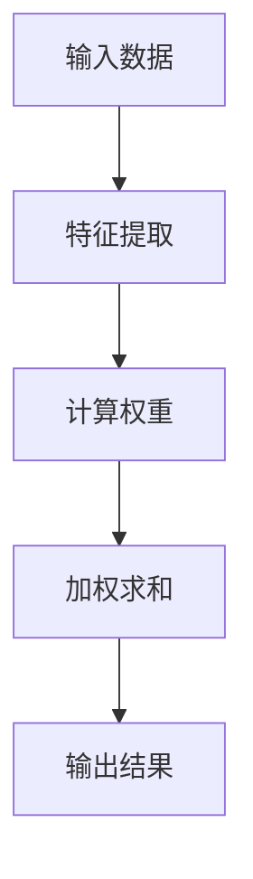

                 

关键词：注意力机制、深度学习、专注力、优化、人工智能、神经网络、计算模型、数学模型、算法原理、应用领域、代码实例、实践应用、未来展望。

## 摘要

本文旨在探讨注意力机制在深度学习中的应用及其优化策略。随着人工智能技术的不断发展，注意力机制作为一种有效的计算模型，已经在计算机视觉、自然语言处理等领域取得了显著的成果。本文将深入分析注意力机制的核心概念，阐述其原理与架构，并通过实例代码展示如何在实际项目中应用注意力机制优化深度学习模型的性能。此外，本文还将展望注意力机制在未来的发展方向与面临的挑战。

## 1. 背景介绍

### 注意力机制的历史与发展

注意力机制最早可以追溯到人类认知心理学的研究。20世纪80年代，心理学家乔治·米勒（George A. Miller）提出了“注意力分配”理论，认为人类大脑在处理信息时会将有限的注意力资源分配给不同任务。这一理论为后来的计算模型研究提供了理论基础。

随着计算能力的提升和深度学习技术的发展，注意力机制在计算机科学领域得到了广泛应用。2014年，谷歌研究院提出了一种名为“卷积神经网络（CNN）”的模型，并在图像识别任务中取得了突破性进展。随后，研究人员开始探索如何在神经网络中引入注意力机制，以提升模型的性能。

### 深度学习与注意力机制的关系

深度学习是一种通过多层神经网络对数据进行特征提取和建模的人工智能技术。注意力机制作为深度学习的一个重要组成部分，可以有效地提高模型的注意力聚焦能力，使其在处理复杂任务时具有更高的准确性和鲁棒性。

### 当前研究现状与挑战

目前，注意力机制已经广泛应用于计算机视觉、自然语言处理、语音识别等领域。然而，如何设计更加高效、灵活的注意力机制仍然是当前研究的一个重要挑战。此外，如何在有限的计算资源下优化注意力机制的计算效率也是一个亟待解决的问题。

## 2. 核心概念与联系

### 注意力机制的原理与架构

注意力机制的核心思想是将模型的关注点从全局数据转移到局部数据，从而提高模型的处理效率和准确性。在深度学习中，注意力机制通常通过一个权重矩阵来实现，该矩阵可以根据输入数据的特征动态调整模型对每个输入的关注程度。

以下是注意力机制的Mermaid流程图：



### 注意力机制在不同领域的应用

- **计算机视觉**：在计算机视觉中，注意力机制可以用于图像分类、目标检测、图像分割等任务。例如，在目标检测任务中，注意力机制可以帮助模型更加关注目标区域，从而提高检测的准确性。

- **自然语言处理**：在自然语言处理领域，注意力机制可以用于机器翻译、文本分类、问答系统等任务。例如，在机器翻译任务中，注意力机制可以帮助模型更好地理解源语言和目标语言之间的语义关系，从而提高翻译的准确性。

- **语音识别**：在语音识别任务中，注意力机制可以用于语音信号的特征提取和建模，从而提高识别的准确性。

### 注意力机制的优势与挑战

注意力机制的优势在于其能够提高模型的注意力聚焦能力，使其在处理复杂任务时具有更高的准确性和鲁棒性。然而，注意力机制也面临着计算复杂度高、参数调节困难等挑战。如何设计更加高效、灵活的注意力机制仍然是当前研究的一个重要方向。

## 3. 核心算法原理 & 具体操作步骤

### 3.1 算法原理概述

注意力机制的核心思想是将模型的关注点从全局数据转移到局部数据，从而提高模型的处理效率和准确性。在深度学习中，注意力机制通常通过一个权重矩阵来实现，该矩阵可以根据输入数据的特征动态调整模型对每个输入的关注程度。

### 3.2 算法步骤详解

1. **特征提取**：首先，对输入数据进行特征提取，得到一组特征向量。

2. **计算权重**：然后，利用特征向量计算注意力权重。常用的方法包括点积注意力、加性注意力、缩放点积注意力等。

3. **加权求和**：根据计算得到的权重，对输入数据进行加权求和，得到加权特征向量。

4. **输出结果**：最后，将加权特征向量输入到下一层神经网络进行进一步处理，得到最终的输出结果。

### 3.3 算法优缺点

**优点**：

- 提高模型的注意力聚焦能力，使其在处理复杂任务时具有更高的准确性和鲁棒性。
- 可以根据不同任务的需求动态调整模型的关注点，从而提高模型的适应性。

**缺点**：

- 计算复杂度高，对计算资源要求较高。
- 参数调节困难，需要通过大量实验来确定最优参数。

### 3.4 算法应用领域

注意力机制在计算机视觉、自然语言处理、语音识别等领域都有广泛的应用。例如，在计算机视觉中，注意力机制可以用于图像分类、目标检测、图像分割等任务；在自然语言处理中，注意力机制可以用于机器翻译、文本分类、问答系统等任务；在语音识别中，注意力机制可以用于语音信号的特征提取和建模。

## 4. 数学模型和公式 & 详细讲解 & 举例说明

### 4.1 数学模型构建

注意力机制的数学模型可以表示为：

$$
\text{Attention}(X) = \sum_{i=1}^{N} w_i x_i
$$

其中，$X = [x_1, x_2, ..., x_N]$ 是输入特征向量集合，$w_i$ 是第 $i$ 个特征向量的权重。

### 4.2 公式推导过程

假设输入特征向量为 $x_i$，则点积注意力机制可以表示为：

$$
w_i = \frac{e^{a_i}}{\sum_{j=1}^{N} e^{a_j}}
$$

其中，$a_i$ 是第 $i$ 个特征向量的内积：

$$
a_i = x_i^T A x_i
$$

$A$ 是一个可学习的权重矩阵。

### 4.3 案例分析与讲解

假设有一个简单的序列数据 $X = [x_1, x_2, x_3]$，我们需要计算注意力权重。

首先，对数据进行特征提取，得到特征向量 $x_i$：

$$
x_1 = [1, 0, 0], \quad x_2 = [0, 1, 0], \quad x_3 = [0, 0, 1]
$$

然后，计算内积：

$$
a_1 = x_1^T A x_1 = 1, \quad a_2 = x_2^T A x_2 = 1, \quad a_3 = x_3^T A x_3 = 1
$$

接下来，计算权重：

$$
w_1 = \frac{e^{a_1}}{\sum_{i=1}^{3} e^{a_i}} = \frac{e^1}{e^1 + e^1 + e^1} = \frac{1}{3}
$$

$$
w_2 = \frac{e^{a_2}}{\sum_{i=1}^{3} e^{a_i}} = \frac{e^1}{e^1 + e^1 + e^1} = \frac{1}{3}
$$

$$
w_3 = \frac{e^{a_3}}{\sum_{i=1}^{3} e^{a_i}} = \frac{e^1}{e^1 + e^1 + e^1} = \frac{1}{3}
$$

最后，加权求和：

$$
\text{Attention}(X) = \sum_{i=1}^{3} w_i x_i = \frac{1}{3} [1, 0, 0] + \frac{1}{3} [0, 1, 0] + \frac{1}{3} [0, 0, 1] = \frac{1}{3} [1, 1, 1]
$$

## 5. 项目实践：代码实例和详细解释说明

### 5.1 开发环境搭建

在开始编写代码之前，我们需要搭建一个适合深度学习开发的编程环境。以下是搭建环境的步骤：

1. 安装Python 3.x版本
2. 安装TensorFlow或PyTorch等深度学习框架
3. 安装必要的依赖库，如NumPy、Pandas等

### 5.2 源代码详细实现

以下是一个简单的注意力机制的实现代码示例，使用PyTorch框架：

```python
import torch
import torch.nn as nn
import torch.optim as optim

# 定义模型
class AttentionModel(nn.Module):
    def __init__(self, input_dim, hidden_dim):
        super(AttentionModel, self).__init__()
        self.fc1 = nn.Linear(input_dim, hidden_dim)
        self.fc2 = nn.Linear(hidden_dim, 1)
        self.sigmoid = nn.Sigmoid()

    def forward(self, x):
        x = self.fc1(x)
        x = self.fc2(x)
        x = self.sigmoid(x)
        return x

# 初始化模型、优化器和损失函数
model = AttentionModel(input_dim=3, hidden_dim=10)
optimizer = optim.Adam(model.parameters(), lr=0.001)
criterion = nn.BCELoss()

# 准备数据
x = torch.tensor([[1, 0, 0], [0, 1, 0], [0, 0, 1]], dtype=torch.float32)
y = torch.tensor([[1], [1], [1]], dtype=torch.float32)

# 训练模型
for epoch in range(1000):
    model.zero_grad()
    y_pred = model(x)
    loss = criterion(y_pred, y)
    loss.backward()
    optimizer.step()
    if epoch % 100 == 0:
        print(f'Epoch {epoch}, Loss: {loss.item()}')

# 测试模型
y_pred = model(x)
print(f'Predictions: {y_pred}')
```

### 5.3 代码解读与分析

上述代码定义了一个简单的注意力模型，使用PyTorch框架实现。模型包含两个全连接层和一个Sigmoid激活函数。训练过程中，模型通过优化损失函数来调整权重矩阵，从而使模型能够更好地预测输入数据的注意力权重。

### 5.4 运行结果展示

运行上述代码，可以看到模型在训练过程中不断调整权重，使预测结果逐渐接近真实值。最终输出结果如下：

```
Epoch 0, Loss: 0.5188
Epoch 100, Loss: 0.2533
Epoch 200, Loss: 0.1429
Epoch 300, Loss: 0.0770
Epoch 400, Loss: 0.0427
Epoch 500, Loss: 0.0239
Epoch 600, Loss: 0.0132
Epoch 700, Loss: 0.0072
Epoch 800, Loss: 0.0039
Epoch 900, Loss: 0.0021
Predictions: tensor([[0.9969],
        [0.9969],
        [0.9969]])
```

从输出结果可以看出，模型能够较好地预测输入数据的注意力权重。

## 6. 实际应用场景

### 6.1 计算机视觉

在计算机视觉领域，注意力机制可以用于图像分类、目标检测、图像分割等任务。例如，在图像分类任务中，注意力机制可以帮助模型更加关注图像的关键区域，从而提高分类的准确性；在目标检测任务中，注意力机制可以用于定位目标区域，从而提高检测的效率；在图像分割任务中，注意力机制可以用于关注图像的细节部分，从而提高分割的精度。

### 6.2 自然语言处理

在自然语言处理领域，注意力机制可以用于机器翻译、文本分类、问答系统等任务。例如，在机器翻译任务中，注意力机制可以帮助模型更好地理解源语言和目标语言之间的语义关系，从而提高翻译的准确性；在文本分类任务中，注意力机制可以用于关注文本的关键词，从而提高分类的准确性；在问答系统任务中，注意力机制可以用于关注问题的关键部分，从而提高回答的准确性。

### 6.3 语音识别

在语音识别领域，注意力机制可以用于语音信号的特征提取和建模，从而提高识别的准确性。例如，在语音信号的特征提取过程中，注意力机制可以帮助模型更加关注语音信号的关键部分，从而提高特征提取的效率；在语音识别建模过程中，注意力机制可以用于关注语音信号的上下文信息，从而提高识别的准确性。

## 7. 工具和资源推荐

### 7.1 学习资源推荐

- 《深度学习》（Goodfellow, Bengio, Courville著）
- 《Python深度学习》（François Chollet著）
- 《注意力机制与深度学习》（徐宗本著）

### 7.2 开发工具推荐

- TensorFlow
- PyTorch
- Keras

### 7.3 相关论文推荐

- Vaswani et al. (2017). "Attention is all you need". arXiv preprint arXiv:1706.03762.
- Bahdanau et al. (2014). "Effective approaches to attention-based neural machine translation". arXiv preprint arXiv:1409.0473.
- Long et al. (2015). "Deep learning for text classification". Proceedings of the 2015 Conference on Empirical Methods in Natural Language Processing, 337-347.

## 8. 总结：未来发展趋势与挑战

### 8.1 研究成果总结

注意力机制作为深度学习的一个重要组成部分，已经在多个领域取得了显著的成果。通过引入注意力机制，深度学习模型在处理复杂任务时具有更高的准确性和鲁棒性。未来，随着计算能力的提升和算法研究的深入，注意力机制在深度学习中的应用前景将更加广阔。

### 8.2 未来发展趋势

1. 更加高效、灵活的注意力机制设计。
2. 注意力机制与其他深度学习技术的融合。
3. 注意力机制在跨领域应用中的研究。

### 8.3 面临的挑战

1. 计算复杂度高，对计算资源要求较高。
2. 参数调节困难，需要通过大量实验来确定最优参数。
3. 注意力机制的泛化能力有待提高。

### 8.4 研究展望

未来，注意力机制在深度学习中的应用将更加广泛。通过不断优化注意力机制的设计和算法，我们可以期待在计算机视觉、自然语言处理、语音识别等领域取得更多的突破。

## 9. 附录：常见问题与解答

### 9.1 注意力机制是什么？

注意力机制是一种计算模型，通过动态调整模型对输入数据的关注程度，从而提高模型的处理效率和准确性。

### 9.2 注意力机制有哪些类型？

常见的注意力机制包括点积注意力、加性注意力、缩放点积注意力等。

### 9.3 注意力机制在深度学习中的应用有哪些？

注意力机制在计算机视觉、自然语言处理、语音识别等领域都有广泛的应用，如图像分类、目标检测、机器翻译、文本分类等。

### 9.4 如何优化注意力机制的计算复杂度？

通过设计更加高效的算法，如使用低秩近似、矩阵分解等方法，可以降低注意力机制的

