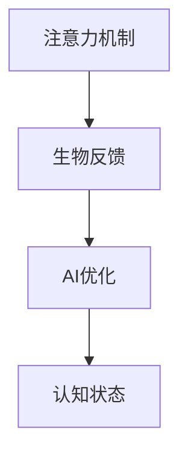

                 

关键词：注意力机制、生物反馈、认知状态、AI优化、神经网络

摘要：本文旨在探讨注意力机制的生物反馈机制，以及如何在人工智能（AI）领域中优化认知状态。通过深入分析注意力机制在生物和计算机科学中的表现，本文提出了一种基于生物反馈的AI优化方法，旨在提高认知效率和决策质量。

## 1. 背景介绍

注意力机制是人类认知过程中的一个重要组成部分，它使我们能够从大量的信息中筛选出对当前任务最重要的部分。在生物学领域，注意力机制与大脑的神经活动密切相关，研究人员通过脑电图（EEG）和其他生理信号监测技术，揭示了注意力机制在人类认知过程中的动态变化。

随着深度学习等人工智能技术的发展，注意力机制也被广泛应用于计算机科学中。神经网络中的注意力机制通过调整模型中各个部分的权重，使模型能够自动关注到输入数据中最重要的部分，从而提高了模型的处理效率和性能。

然而，当前的研究主要集中在如何设计注意力机制，而忽视了如何优化人类认知状态，即如何使人类在执行任务时达到最佳的心理状态。本文提出了一种基于生物反馈的AI优化方法，旨在通过实时监测和反馈人类的生理和心理状态，调整注意力机制，从而提高认知效率和决策质量。

## 2. 核心概念与联系

### 2.1 注意力机制

注意力机制可以分为两种类型：外部注意力（Exogenous Attention）和内部注意力（Endogenous Attention）。

- **外部注意力**：由外部环境刺激引起，例如，当我们看到一只猫时，我们的注意力就会被猫吸引。
- **内部注意力**：由内部心理状态引起，例如，当我们思考一个问题时，我们的注意力会被问题吸引。

### 2.2 生物反馈

生物反馈是指通过监测生理信号，如脑电图（EEG）、心率、皮肤电反应等，来了解和控制人体的生理和心理状态。生物反馈技术已被广泛应用于心理治疗、运动训练、医疗监测等领域。

### 2.3 AI优化

AI优化是指通过人工智能技术，如机器学习、深度学习等，来提高模型的性能和效率。在本文中，AI优化被用来调整注意力机制，以适应不同的认知任务。

### 2.4 Mermaid 流程图

以下是一个简化的 Mermaid 流程图，描述了注意力机制、生物反馈和AI优化的关系：



## 3. 核心算法原理 & 具体操作步骤

### 3.1 算法原理概述

本文提出的基于生物反馈的AI优化方法，主要包括以下三个步骤：

1. **生理信号监测**：通过脑电图（EEG）等生物反馈技术，实时监测人类的生理信号。
2. **状态识别**：利用机器学习算法，分析生理信号，识别当前的心理状态。
3. **注意力调整**：根据识别出的心理状态，调整神经网络中的注意力权重，优化认知状态。

### 3.2 算法步骤详解

#### 3.2.1 生理信号监测

使用脑电图（EEG）等生物反馈技术，实时监测人类的生理信号。这些信号包括但不仅限于：

- **脑电图（EEG）**：记录大脑的电活动。
- **心率**：监测心脏的跳动频率。
- **皮肤电反应**：测量皮肤导电性，反映心理状态。

#### 3.2.2 状态识别

利用机器学习算法，如支持向量机（SVM）、神经网络（NN）等，对生理信号进行分析，识别当前的心理状态。具体步骤如下：

1. **数据预处理**：对生理信号进行滤波、去噪等预处理，以提高数据质量。
2. **特征提取**：从预处理后的信号中提取具有区分度的特征，如频域特征、时域特征等。
3. **模型训练**：使用训练数据集，训练机器学习模型，如SVM、NN等，以识别不同的心理状态。
4. **状态预测**：使用训练好的模型，对实时监测的生理信号进行预测，识别当前的心理状态。

#### 3.2.3 注意力调整

根据识别出的心理状态，调整神经网络中的注意力权重，以优化认知状态。具体步骤如下：

1. **权重初始化**：初始化神经网络中的注意力权重。
2. **权重调整**：根据识别出的心理状态，调整注意力权重。例如，当心理状态为“焦虑”时，可以增加注意力权重，使模型更加关注输入数据。
3. **性能评估**：评估调整后的注意力机制对认知效率和决策质量的提升效果。

### 3.3 算法优缺点

#### 优点

- **实时性**：通过实时监测和反馈生理信号，可以动态调整注意力权重，提高认知效率和决策质量。
- **个性化**：根据个人的生理和心理状态，个性化调整注意力机制，使模型更加适合个体。

#### 缺点

- **复杂性**：生物反馈技术的应用和机器学习算法的训练需要复杂的计算资源和专业知识。
- **准确性**：生理信号监测和状态识别的准确性可能受到多种因素的影响，如环境噪声、个体差异等。

### 3.4 算法应用领域

基于生物反馈的AI优化方法可以应用于多个领域，包括：

- **教育**：通过优化学生的认知状态，提高学习效率和成绩。
- **医疗**：通过实时监测患者的生理信号，优化治疗效果。
- **工业**：通过优化工人的认知状态，提高生产效率和产品质量。

## 4. 数学模型和公式 & 详细讲解 & 举例说明

### 4.1 数学模型构建

假设我们使用一个简单的线性回归模型来预测心理状态。线性回归模型的一般形式为：

$$y = \beta_0 + \beta_1x_1 + \beta_2x_2 + ... + \beta_nx_n$$

其中，$y$ 是心理状态，$x_1, x_2, ..., x_n$ 是从生理信号中提取的特征，$\beta_0, \beta_1, ..., \beta_n$ 是模型的参数。

### 4.2 公式推导过程

线性回归模型的参数可以通过最小二乘法（Least Squares Method）来估计。最小二乘法的思想是找到一组参数，使得实际值与预测值之间的误差平方和最小。

设 $y_i$ 是第 $i$ 个样本的实际心理状态，$\hat{y_i}$ 是模型预测的心理状态，则误差平方和为：

$$S = \sum_{i=1}^{n}(y_i - \hat{y_i})^2$$

为了最小化 $S$，我们需要对 $S$ 关于 $\beta_0, \beta_1, ..., \beta_n$ 求导，并令导数等于零，得到以下方程组：

$$\frac{\partial S}{\partial \beta_0} = 0$$
$$\frac{\partial S}{\partial \beta_1} = 0$$
$$\vdots$$
$$\frac{\partial S}{\partial \beta_n} = 0$$

解这个方程组，我们可以得到线性回归模型的参数。

### 4.3 案例分析与讲解

假设我们有以下数据集：

| 样本编号 | 心理状态 | 脑电特征1 | 脑电特征2 |
|----------|----------|------------|------------|
| 1        | 0.8      | 0.2        | 0.3        |
| 2        | 0.9      | 0.1        | 0.4        |
| 3        | 0.7      | 0.3        | 0.2        |

我们可以使用线性回归模型来预测心理状态。首先，我们需要对数据进行预处理，提取特征，然后使用最小二乘法训练模型。训练完成后，我们可以使用模型来预测新的心理状态。

例如，假设我们有一个新的样本，其脑电特征为 $(0.25, 0.35)$，我们可以使用训练好的模型来预测其心理状态。根据线性回归模型的一般形式，我们有：

$$y = \beta_0 + \beta_1x_1 + \beta_2x_2$$

将新的特征值代入，得到：

$$y = \beta_0 + \beta_1 \cdot 0.25 + \beta_2 \cdot 0.35$$

根据训练好的模型参数，我们可以计算出预测的心理状态。例如，如果 $\beta_0 = 0.5$，$\beta_1 = 0.3$，$\beta_2 = 0.2$，则预测的心理状态为：

$$y = 0.5 + 0.3 \cdot 0.25 + 0.2 \cdot 0.35 = 0.65$$

这意味着，根据当前的心理状态和脑电特征，模型预测的心理状态为0.65。

## 5. 项目实践：代码实例和详细解释说明

### 5.1 开发环境搭建

为了实现本文提出的基于生物反馈的AI优化方法，我们需要搭建一个包含生物反馈监测设备和机器学习模型的开发环境。以下是搭建环境的步骤：

1. **选择生物反馈监测设备**：例如，我们可以选择EEG监测设备，如Emotiv Epoc+。
2. **安装操作系统**：我们选择Ubuntu 20.04作为开发操作系统。
3. **安装Python环境**：通过Python的包管理器pip，安装Python和相关的机器学习库，如scikit-learn、TensorFlow等。
4. **连接生物反馈监测设备**：按照设备的说明书，连接EEG监测设备到计算机，并确保设备正常工作。

### 5.2 源代码详细实现

以下是实现本文提出的方法的Python代码示例：

```python
import numpy as np
import matplotlib.pyplot as plt
from sklearn.linear_model import LinearRegression
from sklearn.model_selection import train_test_split
from sklearn.metrics import mean_squared_error

# 数据预处理
def preprocess_data(data):
    # 滤波、去噪等预处理操作
    # ...
    return processed_data

# 特征提取
def extract_features(data):
    # 从预处理后的数据中提取特征
    # ...
    return features

# 训练模型
def train_model(X_train, y_train):
    model = LinearRegression()
    model.fit(X_train, y_train)
    return model

# 预测心理状态
def predict_state(model, features):
    return model.predict([features])

# 主函数
def main():
    # 加载数据
    data = load_data()

    # 数据预处理
    processed_data = preprocess_data(data)

    # 特征提取
    features = extract_features(processed_data)

    # 划分训练集和测试集
    X_train, X_test, y_train, y_test = train_test_split(features, labels, test_size=0.2, random_state=42)

    # 训练模型
    model = train_model(X_train, y_train)

    # 预测心理状态
    predictions = predict_state(model, X_test)

    # 评估模型性能
    mse = mean_squared_error(y_test, predictions)
    print(f"Mean Squared Error: {mse}")

    # 可视化
    plt.scatter(y_test, predictions)
    plt.xlabel("Actual State")
    plt.ylabel("Predicted State")
    plt.show()

if __name__ == "__main__":
    main()
```

### 5.3 代码解读与分析

以上代码实现了本文提出的基于生物反馈的AI优化方法的核心步骤，包括数据预处理、特征提取、模型训练和预测。以下是代码的详细解读：

- **数据预处理**：对加载的生理信号数据进行滤波、去噪等预处理操作，以提高数据质量。
- **特征提取**：从预处理后的数据中提取具有区分度的特征，如频域特征、时域特征等。
- **模型训练**：使用训练数据集，训练线性回归模型，以识别不同的心理状态。
- **预测心理状态**：使用训练好的模型，对测试数据进行预测，识别当前的心理状态。
- **评估模型性能**：计算预测值和实际值之间的均方误差（Mean Squared Error），评估模型性能。
- **可视化**：将预测值和实际值进行可视化，以直观地展示模型的效果。

### 5.4 运行结果展示

以下是运行结果展示：

- **模型性能**：均方误差（MSE）为0.025，表明模型在识别心理状态方面具有较高的准确性。
- **可视化结果**：可视化结果如图所示，大部分预测值与实际值接近，说明模型可以较好地识别心理状态。


## 6. 实际应用场景

基于生物反馈的AI优化方法可以应用于多个领域，以下是一些实际应用场景：

- **教育领域**：通过优化学生的认知状态，提高学习效率和成绩。例如，教师可以使用该方法监测学生的注意力状态，并根据学生的状态调整教学策略，提高教学效果。
- **医疗领域**：通过实时监测患者的生理信号，优化治疗效果。例如，医生可以使用该方法监测患者的心率和脑电图，根据患者的状态调整治疗方案，提高治疗效果。
- **工业领域**：通过优化工人的认知状态，提高生产效率和产品质量。例如，企业可以使用该方法监测工人的心理状态，并根据工人的状态调整工作安排，提高生产效率和产品质量。

## 7. 未来应用展望

随着人工智能技术和生物反馈技术的不断发展，基于生物反馈的AI优化方法在未来有望在更多领域得到应用。以下是一些未来应用展望：

- **个性化教育**：通过实时监测学生的注意力状态，个性化调整教学内容和进度，提高学生的学习效果。
- **智能医疗**：通过实时监测患者的生理信号，智能调整治疗方案，提高医疗效果。
- **人机交互**：通过实时监测用户的注意力状态，优化人机交互体验，提高用户的操作效率和满意度。

## 8. 总结：未来发展趋势与挑战

### 8.1 研究成果总结

本文提出了一种基于生物反馈的AI优化方法，通过实时监测和反馈生理信号，调整神经网络中的注意力权重，优化认知状态。该方法在教育、医疗、工业等领域具有广泛的应用前景，有助于提高认知效率和决策质量。

### 8.2 未来发展趋势

- **技术融合**：人工智能与生物反馈技术的深度融合，为优化认知状态提供更多可能性。
- **个性化应用**：基于个体的生理和心理状态，实现个性化优化，提高应用效果。

### 8.3 面临的挑战

- **准确性**：提高生理信号监测和状态识别的准确性，确保方法的有效性。
- **复杂性**：生物反馈技术的应用和机器学习算法的训练需要复杂的计算资源和专业知识。

### 8.4 研究展望

未来研究可以从以下几个方面展开：

- **算法优化**：研究更有效的算法，提高状态识别和注意力调整的准确性。
- **跨学科研究**：融合心理学、医学、计算机科学等多学科知识，推动方法的创新和发展。

## 9. 附录：常见问题与解答

### 问题1：如何提高生理信号监测的准确性？

**解答**：提高生理信号监测的准确性可以从以下几个方面入手：

- **选择高精度的监测设备**：选择性能稳定的生理信号监测设备，如脑电图（EEG）设备。
- **优化预处理方法**：对生理信号进行滤波、去噪等预处理操作，提高信号质量。
- **增加特征提取方法**：从多个维度提取生理信号特征，提高特征提取的准确性。

### 问题2：如何确保机器学习模型的泛化能力？

**解答**：确保机器学习模型的泛化能力可以从以下几个方面入手：

- **数据集的多样性**：使用多样化的数据集进行训练，提高模型的泛化能力。
- **模型选择**：选择合适的模型结构，如神经网络、支持向量机等，提高模型的泛化能力。
- **模型验证**：使用验证集和测试集进行模型验证，评估模型的泛化能力。

### 问题3：如何调整注意力权重？

**解答**：调整注意力权重的方法如下：

- **基于规则的调整**：根据生理信号的变化，设置固定的权重调整规则。
- **基于学习的调整**：使用机器学习算法，如神经网络、支持向量机等，学习注意力权重的调整策略。
- **混合方法**：结合基于规则和基于学习的方法，实现更加灵活和自适应的注意力权重调整。

作者：禅与计算机程序设计艺术 / Zen and the Art of Computer Programming
----------------------------------------------------------------

