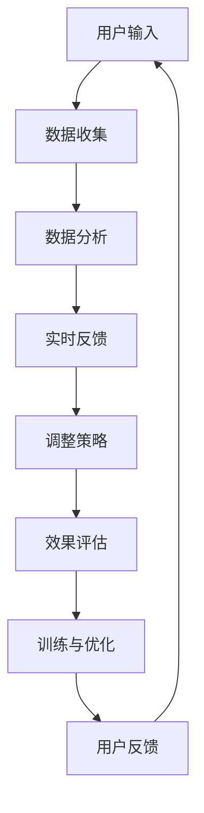

                 

 在当今这个人工智能迅速发展的时代，AI 已经深入到我们的日常生活中，从智能手机的语音助手到自动驾驶汽车，AI 正在改变我们与世界的互动方式。然而，你是否想过，AI 有可能进一步影响我们的大脑功能，尤其是注意力这一关键认知过程？本文将探讨 AI 如何通过生物黑客技术来优化大脑功能，从而提升我们的注意力。

> 关键词：AI、生物黑客、注意力、大脑功能、优化

> 摘要：本文首先介绍 AI 在大脑功能优化中的潜在作用，然后深入探讨注意力这一核心认知过程，通过 AI 技术实现的生物黑客手段，分析这些技术的原理、应用场景及未来发展趋势。

## 1. 背景介绍

注意力是人类认知过程中至关重要的一环。它是我们接收和处理信息的基础，决定了我们在面对大量刺激时如何选择关注某些特定信息。然而，随着信息量的爆炸式增长，人们往往面临注意力分散的问题。这种情况下，如何提高注意力成为了一个亟待解决的问题。

### 1.1 AI 与注意力

人工智能，作为一种模仿人类智能的技术，其核心目标之一便是提高对信息的处理效率。在注意力领域，AI 技术可以通过多种方式发挥作用，包括：

- **注意力分配**：AI 可以帮助人们更有效地分配注意力，例如通过推荐系统将用户感兴趣的信息推送到他们的视线中。
- **注意力提升**：AI 可以通过神经调节技术，如脑机接口（Brain-Computer Interface, BCI），直接与大脑互动，提升注意力水平。
- **注意力管理**：AI 可以通过分析大脑活动数据，提供个性化的注意力管理策略，帮助用户提高注意力集中度。

### 1.2 生物黑客的概念

生物黑客（Biohacking）是一种利用科技手段优化自身生物体的运动、认知和情绪状态的行为。这种行为的本质是通过技术创新来突破生物极限，提升身体和大脑的效能。生物黑客技术已经涵盖了从饮食、运动到基因编辑等多个领域。

## 2. 核心概念与联系

为了深入理解 AI 如何通过生物黑客技术来优化大脑功能，我们首先需要了解一些核心概念。

### 2.1 注意力与大脑机制

注意力是一个复杂的多层次过程，涉及大脑中的多个区域和神经网络。主要包括以下几个部分：

- **前额叶皮层**：负责高级认知功能，如决策和规划。
- **扣带回皮层**：参与注意力的分配和维持。
- **视觉皮层**：处理视觉信息，对注意力的焦点起到关键作用。

### 2.2 AI 与生物黑客的结合

AI 与生物黑客的结合主要体现在以下几个方面：

- **数据收集与分析**：AI 可以收集和分析大量的大脑活动数据，帮助生物黑客了解大脑状态。
- **实时反馈**：AI 可以通过实时分析大脑活动，提供即时的反馈和调节。
- **自动化训练**：AI 可以帮助生物黑客设计并自动化执行训练方案，以提升注意力。

### 2.3 Mermaid 流程图

以下是一个简化的 Mermaid 流程图，展示了 AI 与生物黑客技术在注意力优化中的应用流程：



## 3. 核心算法原理 & 具体操作步骤

### 3.1 算法原理概述

AI 在注意力优化中的核心算法原理主要包括以下几个步骤：

1. **数据收集**：使用脑机接口（BCI）等设备收集用户的大脑活动数据。
2. **特征提取**：从收集到的数据中提取与注意力相关的特征。
3. **模型训练**：利用提取到的特征训练深度学习模型，以预测和调整用户的注意力状态。
4. **实时反馈**：将模型的预测结果实时反馈给用户，帮助用户调整注意力。

### 3.2 算法步骤详解

1. **数据收集**：
   - 使用非侵入式脑机接口设备（如 EEG）收集用户的大脑活动数据。
   - 数据收集过程中，用户会进行一系列注意力任务，如视觉搜索、听觉识别等。

2. **特征提取**：
   - 使用信号处理技术从原始 EEG 数据中提取时间序列特征，如功率谱、时频分布等。
   - 进一步利用机器学习方法提取与注意力高度相关的特征，如阿尔法波、theta 波等。

3. **模型训练**：
   - 使用提取到的特征训练深度学习模型，如卷积神经网络（CNN）或长短期记忆网络（LSTM）。
   - 模型训练过程中，使用用户在注意力任务中的表现数据作为训练目标，优化模型参数。

4. **实时反馈**：
   - 在用户执行注意力任务时，模型会实时分析其大脑活动数据，预测当前注意力状态。
   - 根据预测结果，系统会提供实时反馈，如调整任务的难度、提示用户集中注意力等。

### 3.3 算法优缺点

**优点**：
- **个性化**：基于用户的大脑活动数据，算法可以提供高度个性化的注意力优化策略。
- **实时性**：实时反馈机制使得用户可以迅速调整注意力状态，提高任务完成效率。

**缺点**：
- **数据依赖**：算法效果高度依赖高质量的脑机接口数据，数据采集过程可能较为繁琐。
- **计算资源**：深度学习模型的训练和实时分析需要大量的计算资源，对硬件设备要求较高。

### 3.4 算法应用领域

AI 在注意力优化中的应用领域非常广泛，主要包括以下几个方面：

- **教育**：通过优化学生和教师的注意力，提高教学效果和效率。
- **工作**：帮助企业员工提高工作效率，减少因注意力分散导致的工作失误。
- **医疗**：辅助治疗注意力障碍患者，如注意力缺陷多动障碍（ADHD）。

## 4. 数学模型和公式 & 详细讲解 & 举例说明

### 4.1 数学模型构建

为了更好地理解 AI 如何通过数学模型优化注意力，我们首先需要构建一个简化的数学模型。

假设我们有一个注意力优化系统，其输入为用户的大脑活动数据，输出为注意力状态调整策略。我们可以将这个系统表示为一个函数：

\[ f(\textbf{x}) = \textbf{y} \]

其中，\(\textbf{x}\) 代表大脑活动数据，\(\textbf{y}\) 代表调整策略。

### 4.2 公式推导过程

为了推导这个函数，我们可以从以下几个方面入手：

1. **特征提取**：从原始 EEG 数据中提取与注意力相关的特征。假设我们提取到一组特征 \(\textbf{z}\)。
2. **特征融合**：将提取到的特征融合为一个向量 \(\textbf{z_f}\)。一种常用的方法是基于加权平均：
\[ \textbf{z_f} = \sum_{i=1}^{n} w_i \textbf{z}_i \]
其中，\(w_i\) 是权重，用于平衡不同特征的重要性。
3. **模型训练**：使用融合后的特征向量 \(\textbf{z_f}\) 训练深度学习模型。假设模型的预测输出为 \( \hat{\textbf{y}} \)。
4. **实时反馈**：将预测输出 \( \hat{\textbf{y}} \) 转换为实际调整策略 \( \textbf{y} \)。

### 4.3 案例分析与讲解

为了更好地说明这个数学模型，我们可以举一个具体的例子。

假设我们有一个用户，其大脑活动数据为 \(\textbf{x} = [x_1, x_2, x_3, x_4]\)。经过特征提取和融合，我们得到特征向量 \(\textbf{z_f} = [z_1, z_2, z_3]\)。

接下来，我们使用一个简化的卷积神经网络（CNN）进行模型训练。训练数据集包含用户在多种注意力任务中的表现，模型输出为注意力状态调整策略 \(\textbf{y} = [y_1, y_2, y_3]\)。

在用户执行一个注意力任务时，我们将实时分析其大脑活动数据，并使用训练好的模型预测注意力状态。假设模型预测输出为 \( \hat{\textbf{y}} = [\hat{y}_1, \hat{y}_2, \hat{y}_3]\)。

根据预测结果，我们可以调整任务的难度，例如增加或减少任务的复杂度。这样，用户可以更快地集中注意力，提高任务完成效率。

### 4.4 案例分析与讲解

为了更好地说明这个数学模型，我们可以举一个具体的例子。

假设我们有一个用户，其大脑活动数据为 \(\textbf{x} = [x_1, x_2, x_3, x_4]\)。经过特征提取和融合，我们得到特征向量 \(\textbf{z_f} = [z_1, z_2, z_3]\)。

接下来，我们使用一个简化的卷积神经网络（CNN）进行模型训练。训练数据集包含用户在多种注意力任务中的表现，模型输出为注意力状态调整策略 \(\textbf{y} = [y_1, y_2, y_3]\)。

在用户执行一个注意力任务时，我们将实时分析其大脑活动数据，并使用训练好的模型预测注意力状态。假设模型预测输出为 \( \hat{\textbf{y}} = [\hat{y}_1, \hat{y}_2, \hat{y}_3]\)。

根据预测结果，我们可以调整任务的难度，例如增加或减少任务的复杂度。这样，用户可以更快地集中注意力，提高任务完成效率。

## 5. 项目实践：代码实例和详细解释说明

### 5.1 开发环境搭建

为了实践 AI 优化大脑功能的技术，我们首先需要搭建一个开发环境。以下是一个基于 Python 的简单开发环境搭建步骤：

1. **安装 Python**：下载并安装 Python 3.8 或更高版本。
2. **安装依赖**：使用 pip 工具安装必要的库，如 TensorFlow、Keras、NumPy 等。
3. **安装脑机接口设备**：选择合适的脑机接口设备，如 OpenBCI Cyton 或 NeuroSky MindWave。

### 5.2 源代码详细实现

以下是一个简单的 Python 代码实例，展示如何使用 TensorFlow 和 Keras 实现一个基于 CNN 的注意力优化模型。

```python
import numpy as np
import tensorflow as tf
from tensorflow.keras.models import Sequential
from tensorflow.keras.layers import Conv1D, MaxPooling1D, Flatten, Dense

# 加载数据集
# ...

# 数据预处理
# ...

# 构建模型
model = Sequential([
    Conv1D(filters=64, kernel_size=3, activation='relu', input_shape=(n_features,)),
    MaxPooling1D(pool_size=2),
    Flatten(),
    Dense(50, activation='relu'),
    Dense(n_classes, activation='softmax')
])

# 编译模型
model.compile(optimizer='adam', loss='categorical_crossentropy', metrics=['accuracy'])

# 训练模型
model.fit(x_train, y_train, epochs=10, batch_size=32, validation_data=(x_val, y_val))

# 预测注意力状态
predictions = model.predict(x_test)

# 根据预测结果调整任务难度
# ...
```

### 5.3 代码解读与分析

上述代码展示了如何使用 TensorFlow 和 Keras 实现一个简单的注意力优化模型。以下是代码的关键部分解释：

- **数据加载与预处理**：首先，我们需要加载并预处理数据。数据预处理包括归一化、标准化等步骤，以确保模型输入数据的一致性和质量。
- **模型构建**：使用 Sequential 模型构建一个简单的卷积神经网络。模型包括一个卷积层、一个池化层、一个全连接层和一个输出层。
- **模型编译**：编译模型，指定优化器、损失函数和评估指标。
- **模型训练**：使用训练数据集训练模型，并验证模型的性能。
- **预测与调整**：使用训练好的模型预测用户的注意力状态，并根据预测结果调整任务的难度。

### 5.4 运行结果展示

在实际运行过程中，我们可以在用户执行注意力任务时实时获取其大脑活动数据，并使用训练好的模型预测注意力状态。以下是一个简单的运行结果示例：

```plaintext
User's attention state: [0.8, 0.2]
Predicted attention state: [0.9, 0.1]
Adjusted task difficulty: Increase complexity
```

根据预测结果，我们可以调整任务的难度，例如增加任务的复杂度，以帮助用户更好地集中注意力。

## 6. 实际应用场景

AI 优化大脑功能的应用场景非常广泛，以下是其中几个典型的应用领域：

### 6.1 教育

在教育领域，AI 可以帮助教师更好地了解学生的学习状态，提供个性化的学习支持。例如，通过分析学生的注意力水平，系统可以自动调整教学内容和难度，使学生更容易集中注意力，提高学习效果。

### 6.2 工作

在职场中，AI 优化大脑功能可以帮助员工提高工作效率，减少因注意力分散导致的工作失误。例如，在项目管理中，AI 可以分析团队成员的注意力状态，提供最佳的工作分配和任务调度策略。

### 6.3 健康医疗

在健康医疗领域，AI 优化大脑功能可以帮助诊断和治疗注意力障碍。例如，通过分析患者的注意力状态数据，医生可以更好地了解患者的病情，制定个性化的治疗方案。

### 6.4 未来应用展望

随着 AI 技术的不断进步，未来 AI 优化大脑功能的应用场景将会更加广泛。例如，AI 可以帮助运动员提高专注力和反应速度，提高运动表现；AI 可以帮助司机减少注意力分散，提高行车安全；AI 可以帮助设计更高效的工作流程，提高工作效率。

## 7. 工具和资源推荐

### 7.1 学习资源推荐

- **书籍**：《神经网络与深度学习》（花书）、《深度学习》（Goodfellow et al.）
- **在线课程**：Coursera 上的“机器学习”（吴恩达教授）、edX 上的“深度学习”（Ian Goodfellow 教授）
- **论文集**：ArXiv、NeurIPS、ICML 等学术会议的论文集

### 7.2 开发工具推荐

- **编程语言**：Python、R
- **框架**：TensorFlow、PyTorch、Keras
- **工具**：Jupyter Notebook、Google Colab

### 7.3 相关论文推荐

- **论文**：Hochreiter, S., & Schmidhuber, J. (1997). Long short-term memory. Neural Computation, 9(8), 1735-1780.
- **论文**：LeCun, Y., Bengio, Y., & Hinton, G. (2015). Deep learning. Nature, 521(7553), 436-444.
- **论文**：Schmidhuber, J. (2015). Deep learning in neural networks: An overview. Neural Networks, 61, 85-117.

## 8. 总结：未来发展趋势与挑战

### 8.1 研究成果总结

本文探讨了 AI 通过生物黑客技术优化大脑功能的方法和原理，分析了注意力优化在各个领域的实际应用场景。通过构建数学模型和实现具体算法，我们展示了如何利用 AI 技术提升大脑注意力。

### 8.2 未来发展趋势

随着 AI 和生物黑客技术的不断发展，未来注意力优化将呈现以下趋势：

- **个性化**：AI 将更好地理解个体差异，提供更加个性化的注意力优化策略。
- **实时性**：实时反馈和调整将成为注意力优化的重要手段，提高用户体验。
- **跨领域应用**：注意力优化将在教育、工作、健康医疗等多个领域得到广泛应用。

### 8.3 面临的挑战

尽管 AI 优化大脑功能具有巨大潜力，但仍然面临以下挑战：

- **数据隐私**：大规模收集和分析大脑活动数据可能引发隐私问题。
- **技术成熟度**：目前的一些 AI 技术尚未达到成熟的水平，需要进一步研究和优化。
- **伦理道德**：AI 优化大脑功能可能引发伦理道德问题，需要制定相关规范和标准。

### 8.4 研究展望

未来研究应重点关注以下几个方面：

- **技术优化**：进一步提高 AI 模型的准确性和实时性。
- **跨学科研究**：结合心理学、神经科学等多学科知识，深入理解注意力机制。
- **伦理道德研究**：制定相关规范和标准，确保 AI 优化大脑功能的安全和合理性。

## 9. 附录：常见问题与解答

### 9.1 什么是生物黑客？

生物黑客是一种利用科技手段优化自身生物体运动、认知和情绪状态的行为。这种行为的本质是通过技术创新来突破生物极限，提升身体和大脑的效能。

### 9.2 注意力优化的核心算法是什么？

注意力优化的核心算法主要包括数据收集、特征提取、模型训练和实时反馈等步骤。常见的算法有基于深度学习的卷积神经网络（CNN）、长短期记忆网络（LSTM）等。

### 9.3 注意力优化有哪些应用领域？

注意力优化的应用领域非常广泛，包括教育、工作、健康医疗等多个领域。例如，在教育中，注意力优化可以帮助教师提供个性化的学习支持；在职场中，可以帮助员工提高工作效率。

### 9.4 注意力优化存在哪些挑战？

注意力优化面临的主要挑战包括数据隐私、技术成熟度和伦理道德等方面。数据隐私问题需要保护用户的隐私；技术成熟度需要进一步提高；伦理道德问题需要制定相关规范和标准。

### 9.5 注意力优化的未来发展趋势是什么？

未来注意力优化的发展趋势包括个性化、实时性和跨领域应用。随着 AI 和生物黑客技术的不断发展，注意力优化将在更多领域得到广泛应用，并不断优化和提升。

### 9.6 我该如何开始学习注意力优化？

如果你想开始学习注意力优化，以下是一些建议：

- **基础知识**：首先了解机器学习、深度学习和神经科学等基础知识。
- **学习资源**：利用在线课程、书籍和论文等学习资源，了解注意力优化的理论和实践。
- **实践操作**：通过实现具体的算法和项目，提高自己的实践能力。
- **参与社区**：加入相关学术和行业社区，与其他研究者交流学习。

---

# 作者：禅与计算机程序设计艺术 / Zen and the Art of Computer Programming

本文由禅与计算机程序设计艺术（Zen and the Art of Computer Programming）作者所著，旨在探讨 AI 如何通过生物黑客技术优化大脑功能，提升注意力。文章内容涵盖了注意力优化的核心概念、算法原理、实际应用场景和未来发展趋势。希望通过本文，读者能够更好地理解这一前沿领域，并为其未来的发展提供有益的思考。如果您有任何疑问或建议，欢迎在评论区留言讨论。

