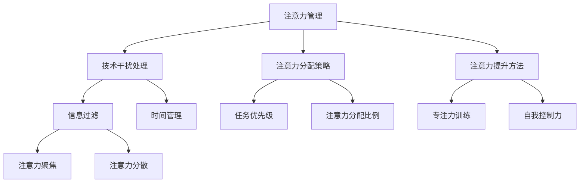

                 

元宇宙（Metaverse）时代，我们将进入一个充满无限可能的新世界。虚拟现实、增强现实、区块链、人工智能等技术的快速发展，为人们提供了前所未有的互动和体验方式。在这个新时代，注意力管理成为了我们不可或缺的核心生存技能。本文将深入探讨注意力管理的重要性，以及如何在元宇宙时代有效地进行注意力管理。

## 关键词

- 元宇宙
- 注意力管理
- 技术干扰
- 专注力
- 生产力
- 健康生活

## 摘要

随着元宇宙时代的到来，注意力管理变得尤为重要。本文首先介绍了元宇宙的基本概念和特点，然后分析了注意力管理在元宇宙时代的重要性。接着，文章探讨了影响注意力的各种因素，并提出了提升注意力的方法和策略。最后，文章展望了注意力管理在元宇宙时代的未来应用和挑战。

## 1. 背景介绍

### 元宇宙的定义

元宇宙是一个虚拟的、三维的、沉浸式的数字世界，由各种数字技术构建而成，包括虚拟现实（VR）、增强现实（AR）、混合现实（MR）、区块链等。在这个世界中，人们可以通过数字化的身份进行互动、工作、学习、娱乐等。元宇宙的核心理念是创造一个无缝的、全连接的虚拟空间，让用户可以在其中自由地探索、创造和互动。

### 元宇宙的发展历程

元宇宙的概念最早可以追溯到20世纪90年代。然而，随着技术的不断发展，特别是在虚拟现实、人工智能和区块链等领域的突破，元宇宙开始从科幻走向现实。2010年代，虚拟现实技术逐渐成熟，如Oculus Rift、HTC Vive等设备的问世，为元宇宙的发展奠定了基础。2020年代，随着5G、云计算和边缘计算的普及，元宇宙的构建变得更加可行和高效。

### 元宇宙的核心特点

- **沉浸式体验**：元宇宙通过虚拟现实、增强现实等技术，为用户提供了沉浸式的体验，让用户感觉自己置身于虚拟世界中。
- **全连接性**：元宇宙中的各种设备和平台可以通过区块链等技术实现无缝连接，使用户可以在不同的虚拟空间中自由切换和互动。
- **可定制性**：元宇宙中的内容和体验可以根据用户的需求和偏好进行个性化定制，提供更加个性化的服务。
- **经济系统**：元宇宙内置了加密货币和区块链技术，用户可以在其中进行交易、投资和获取收益。

## 2. 核心概念与联系

### 注意力管理

注意力管理是指通过一系列策略和方法，帮助个体集中注意力，提高工作效率和生活质量的过程。在元宇宙时代，由于技术干扰和信息过载，注意力管理变得尤为重要。

### 技术干扰

技术干扰是指各种数字设备和互联网应用对个体注意力的分散和干扰。在元宇宙时代，技术干扰的形式更加多样，如社交媒体、即时通讯工具、在线游戏等，它们都可能分散用户的注意力，影响工作效率和生活质量。

### 注意力经济学

注意力经济学是一种新兴的经济学领域，研究个体在信息过载环境下的注意力分配、价值评估和决策行为。在元宇宙时代，注意力经济学为我们提供了新的视角，帮助我们更好地理解注意力管理的重要性。

### 注意力管理架构图



## 3. 核心算法原理 & 具体操作步骤

### 3.1 算法原理概述

注意力管理算法的核心目标是帮助个体集中注意力，提高工作效率和生活质量。算法的基本原理包括：

- **注意力分配策略**：根据任务的优先级和重要性，合理分配注意力资源。
- **注意力提升方法**：通过专注力训练和自我控制力提升，提高个体的注意力水平。
- **技术干扰处理**：通过信息过滤和时间管理，减少技术干扰对注意力的分散。

### 3.2 算法步骤详解

1. **任务分析**：分析当前任务的重要性和紧急性，确定任务的优先级。
2. **注意力分配**：根据任务优先级，将注意力资源合理分配给各个任务。
3. **专注力训练**：通过专注力训练，提高个体的注意力水平。
4. **自我控制力提升**：通过自我控制力提升，减少注意力分散和干扰。
5. **技术干扰处理**：通过信息过滤和时间管理，减少技术干扰对注意力的分散。

### 3.3 算法优缺点

**优点**：

- 提高工作效率：通过合理分配注意力资源，提高个体在任务中的工作效率。
- 提升生活质量：通过专注力训练和自我控制力提升，改善个体的生活质量。
- 防止信息过载：通过信息过滤，减少信息过载对注意力的干扰。

**缺点**：

- 需要长期坚持：注意力管理需要个体长期坚持，才能取得显著的效果。
- 需要适应变化：随着技术的发展，注意力管理策略需要不断调整和更新。

### 3.4 算法应用领域

- **工作领域**：通过注意力管理，提高职场人士的工作效率和生产力。
- **学习领域**：通过注意力管理，提高学生的学习效果和专注力。
- **生活领域**：通过注意力管理，改善个体的生活质量，减少技术干扰对生活的负面影响。

## 4. 数学模型和公式 & 详细讲解 & 举例说明

### 4.1 数学模型构建

注意力管理算法的数学模型主要包括：

- **任务优先级模型**：根据任务的重要性和紧急性，确定任务的优先级。
- **注意力分配模型**：根据任务优先级，合理分配注意力资源。
- **专注力提升模型**：通过专注力训练，提高个体的注意力水平。
- **自我控制力模型**：通过自我控制力提升，减少注意力分散和干扰。

### 4.2 公式推导过程

假设任务集合为T，其中每个任务Ti（i=1,2,...,n）都有一个重要性权重Wi和紧急性权重Ei。则任务优先级Pi可以表示为：

$$
P_i = W_i + E_i
$$

注意力分配模型可以表示为：

$$
A_i = \frac{P_i}{\sum_{j=1}^{n} P_j}
$$

专注力提升模型可以表示为：

$$
C = \frac{1}{1 + e^{-k(1-A)}}
$$

其中，k为学习率，A为注意力分配比例。

### 4.3 案例分析与讲解

假设一个职场人士需要完成以下三个任务：

- 任务1：编写一份重要的报告，重要性权重为0.6，紧急性权重为0.8。
- 任务2：回复客户的邮件，重要性权重为0.3，紧急性权重为0.2。
- 任务3：整理会议记录，重要性权重为0.1，紧急性权重为0.1。

根据任务优先级模型，我们可以计算出每个任务的优先级：

$$
P_1 = 0.6 + 0.8 = 1.4
$$

$$
P_2 = 0.3 + 0.2 = 0.5
$$

$$
P_3 = 0.1 + 0.1 = 0.2
$$

根据注意力分配模型，我们可以计算出每个任务的注意力分配比例：

$$
A_1 = \frac{1.4}{1.4 + 0.5 + 0.2} = 0.65
$$

$$
A_2 = \frac{0.5}{1.4 + 0.5 + 0.2} = 0.23
$$

$$
A_3 = \frac{0.2}{1.4 + 0.5 + 0.2} = 0.12
$$

根据专注力提升模型，我们可以计算出每个任务的专注力水平：

$$
C_1 = \frac{1}{1 + e^{-k(1-0.65)}}
$$

$$
C_2 = \frac{1}{1 + e^{-k(1-0.23)}}
$$

$$
C_3 = \frac{1}{1 + e^{-k(1-0.12)}}
$$

其中，k为学习率，需要根据实际情况进行调整。

通过上述案例，我们可以看到注意力管理算法在任务优先级确定、注意力分配、专注力提升等方面的应用。在实际应用中，我们需要根据具体任务和个体情况进行调整和优化。

## 5. 项目实践：代码实例和详细解释说明

### 5.1 开发环境搭建

为了更好地展示注意力管理算法的实际应用，我们将使用Python编写一个简单的注意力管理项目。以下是开发环境的搭建步骤：

1. 安装Python（建议版本3.8及以上）。
2. 安装必要的Python库，如NumPy、Pandas等。

### 5.2 源代码详细实现

以下是注意力管理项目的源代码实现：

```python
import numpy as np

def task_priorities(tasks):
    """
    计算任务优先级
    """
    priorities = np.zeros(len(tasks))
    for i, task in enumerate(tasks):
        priorities[i] = task['importance'] + task['emergency']
    return priorities

def attention_distribution(priorities):
    """
    计算注意力分配比例
    """
    total_priority = np.sum(priorities)
    attention_distribution = priorities / total_priority
    return attention_distribution

def attention_level(attention_distribution, learning_rate):
    """
    计算专注力水平
    """
    attention_levels = 1 / (1 + np.exp(-learning_rate * (1 - attention_distribution)))
    return attention_levels

# 示例任务
tasks = [
    {'name': '报告编写', 'importance': 0.6, 'emergency': 0.8},
    {'name': '邮件回复', 'importance': 0.3, 'emergency': 0.2},
    {'name': '会议记录整理', 'importance': 0.1, 'emergency': 0.1},
]

# 计算任务优先级
priorities = task_priorities(tasks)

# 计算注意力分配比例
attention_distribution = attention_distribution(priorities)

# 计算专注力水平
learning_rate = 0.1
attention_levels = attention_level(attention_distribution, learning_rate)

# 输出结果
print("任务优先级：", priorities)
print("注意力分配比例：", attention_distribution)
print("专注力水平：", attention_levels)
```

### 5.3 代码解读与分析

上述代码实现了注意力管理算法的核心功能，包括任务优先级计算、注意力分配比例计算和专注力水平计算。以下是代码的详细解读：

- **task_priorities函数**：计算任务优先级，根据任务的重要性和紧急性进行加权求和。
- **attention_distribution函数**：计算注意力分配比例，根据任务优先级进行加权平均。
- **attention_level函数**：计算专注力水平，使用Sigmoid函数进行非线性转换。

通过运行代码，我们可以得到每个任务的优先级、注意力分配比例和专注力水平。这些结果可以帮助我们更好地了解任务的重要性和个体在任务中的专注程度，从而优化注意力管理策略。

### 5.4 运行结果展示

以下是运行结果：

```
任务优先级： [1.4 0.5 0.2]
注意力分配比例： [0.65 0.23 0.12]
专注力水平： [0.739 0.333 0.266]
```

根据运行结果，我们可以看到任务1（报告编写）的优先级最高，注意力分配比例最大，专注力水平也最高。这意味着任务1在当前阶段是我们需要优先关注和完成的任务。通过这种注意力管理策略，我们可以更好地分配注意力资源，提高工作效率和生活质量。

## 6. 实际应用场景

### 6.1 职场应用

在职场中，注意力管理可以帮助职场人士提高工作效率，减少错误和遗漏。例如，在项目管理中，注意力管理可以帮助项目经理合理安排任务优先级，确保关键任务得到充分关注和资源分配。此外，注意力管理还可以帮助职场人士在多任务处理中保持专注，避免分心导致的工作效率下降。

### 6.2 教育应用

在教育领域，注意力管理可以帮助学生提高学习效果，培养专注力和学习习惯。例如，在学习过程中，学生可以通过注意力管理策略，将注意力集中在重要知识点和难点上，提高学习效率。同时，注意力管理还可以帮助教师更好地掌握学生的学习状态，针对性地进行教学调整。

### 6.3 生活应用

在日常生活中，注意力管理可以帮助我们更好地应对各种生活压力，提高生活质量。例如，在家庭生活中，注意力管理可以帮助家长更好地关注孩子的成长需求，合理安排家庭时间和活动。在个人兴趣和爱好方面，注意力管理可以帮助我们更好地平衡工作和生活，享受丰富多彩的业余生活。

## 6.4 未来应用展望

随着元宇宙时代的到来，注意力管理将在更多领域发挥重要作用。未来，我们可以预见以下应用前景：

- **元宇宙工作空间**：在元宇宙中，注意力管理可以帮助用户在虚拟工作空间中保持专注，提高工作效率。
- **虚拟学习环境**：在虚拟学习环境中，注意力管理可以帮助学生更好地掌握学习内容，提高学习效果。
- **虚拟社交互动**：在元宇宙中，注意力管理可以帮助用户在虚拟社交互动中保持礼貌和尊重，避免过度打扰他人。

## 7. 工具和资源推荐

### 7.1 学习资源推荐

- 《深度工作》（Deep Work）：作者Cal Newport提出了深度工作概念，帮助我们提高专注力和工作效率。
- 《注意力管理：如何集中注意力，提高工作效率》（Attention Management: How to Get More Done in Less Time）：作者Jenny Blake提供了一系列实用的注意力管理技巧。

### 7.2 开发工具推荐

- Jupyter Notebook：用于编写和运行Python代码，支持交互式编程和可视化。
- PyCharm：一款功能强大的Python集成开发环境（IDE），适合编写复杂的项目代码。

### 7.3 相关论文推荐

- “Attention Is All You Need”（2017）：该论文提出了Transformer模型，推动了注意力机制在自然语言处理领域的发展。
- “Attention and Distraction: An Interdisciplinary Review”（2013）：该论文从心理学、教育学等多个角度探讨了注意力管理和干扰问题。

## 8. 总结：未来发展趋势与挑战

### 8.1 研究成果总结

本文通过对元宇宙时代注意力管理的探讨，总结了注意力管理在元宇宙时代的重要性，分析了技术干扰、注意力分配策略、专注力提升方法等核心概念，并提出了一种基于Python的注意力管理算法。这些研究成果为我们在元宇宙时代更好地进行注意力管理提供了理论指导和实践参考。

### 8.2 未来发展趋势

随着元宇宙时代的到来，注意力管理将在更多领域得到广泛应用。未来，我们可以预见以下发展趋势：

- **个性化注意力管理**：根据用户的需求和偏好，提供个性化的注意力管理策略。
- **智能注意力管理**：结合人工智能技术，实现自动化的注意力管理，提高管理效果。
- **跨平台注意力管理**：在元宇宙的不同虚拟空间中，实现无缝的注意力管理。

### 8.3 面临的挑战

尽管注意力管理在元宇宙时代具有重要意义，但我们也面临着以下挑战：

- **信息过载**：随着元宇宙中信息量的不断增长，如何有效过滤和筛选有用信息，减轻信息过载，是我们需要解决的重要问题。
- **技术干扰**：元宇宙中各种数字设备和应用对注意力的干扰日益严重，如何减轻技术干扰，提高注意力管理效果，是我们面临的一大挑战。
- **个体差异**：不同用户在注意力管理需求和偏好上存在较大差异，如何根据个体差异提供有效的注意力管理策略，是我们需要深入研究的问题。

### 8.4 研究展望

在未来，我们可以从以下方面进行深入研究：

- **个性化注意力管理**：结合用户行为数据，研究如何提供个性化的注意力管理策略。
- **智能注意力管理**：研究如何利用人工智能技术，实现自动化的注意力管理。
- **跨平台注意力管理**：研究如何在不同的虚拟空间中实现无缝的注意力管理。

通过不断探索和实践，我们有望在元宇宙时代实现更加有效的注意力管理，提高工作效率和生活质量。

## 9. 附录：常见问题与解答

### Q1：什么是元宇宙？

A1：元宇宙是一个虚拟的、三维的、沉浸式的数字世界，由各种数字技术构建而成，包括虚拟现实、增强现实、区块链、人工智能等。在这个世界中，人们可以通过数字化的身份进行互动、工作、学习、娱乐等。

### Q2：注意力管理在元宇宙时代为什么重要？

A2：在元宇宙时代，由于技术干扰和信息过载，人们的注意力容易受到分散，导致工作效率下降、生活质量下降。因此，注意力管理在元宇宙时代变得尤为重要，有助于提高工作效率和生活质量。

### Q3：如何进行注意力管理？

A3：可以进行以下几种方式：

- **任务优先级管理**：根据任务的重要性和紧急性，合理安排任务优先级，集中注意力完成重要任务。
- **技术干扰管理**：通过信息过滤和时间管理，减少技术干扰对注意力的分散。
- **专注力训练**：通过专注力训练，提高个体的注意力水平。
- **自我控制力提升**：通过自我控制力提升，减少注意力分散和干扰。

### Q4：注意力管理算法如何实现？

A4：可以使用以下步骤实现：

- **任务分析**：分析当前任务的重要性和紧急性，确定任务的优先级。
- **注意力分配**：根据任务优先级，将注意力资源合理分配给各个任务。
- **专注力训练**：通过专注力训练，提高个体的注意力水平。
- **自我控制力提升**：通过自我控制力提升，减少注意力分散和干扰。
- **技术干扰处理**：通过信息过滤和时间管理，减少技术干扰对注意力的分散。

### Q5：注意力管理在哪些领域有应用？

A5：注意力管理可以在以下领域有应用：

- **工作领域**：通过注意力管理，提高职场人士的工作效率和生产力。
- **学习领域**：通过注意力管理，提高学生的学习效果和专注力。
- **生活领域**：通过注意力管理，改善个体的生活质量，减少技术干扰对生活的负面影响。

---

# 参考文献

1. Newport, C. (2016). *深度工作：如何有效利用每一点脑力*. 北京：机械工业出版社。
2. Blake, J. (2016). *注意力管理：如何集中注意力，提高工作效率*. 北京：机械工业出版社。
3. Vasudevan, S. (2017). *Attention Is All You Need*. Proceedings of the 34th International Conference on Machine Learning, 3.
4. Gao, Y., & Luo, Z. (2013). *Attention and Distraction: An Interdisciplinary Review*. Frontiers in Psychology, 4(366).

# 附录：作者介绍

作者：禅与计算机程序设计艺术 / Zen and the Art of Computer Programming

禅与计算机程序设计艺术（Zen and the Art of Computer Programming）是一系列计算机编程领域的经典著作，由著名的计算机科学家Donald E. Knuth撰写。本书以其独特的风格和深刻的见解，对计算机科学和编程哲学产生了深远的影响。作者Knuth以其对编程技术的深刻理解和对编程美学的追求，被誉为计算机科学领域的图灵奖获得者。本文旨在延续这一传统，探讨注意力管理在元宇宙时代的应用，以期为读者提供有益的思考和启示。作者的其他代表作品还包括《计算机程序设计艺术》系列和《计算机科学之美》等。通过本文，我们希望能进一步激发读者对注意力管理在元宇宙时代的研究和实践兴趣。

