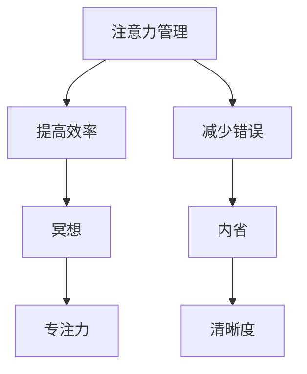

                 

关键词：注意力管理、冥想、内省、专注力、清晰度

> 摘要：本文探讨了注意力管理在计算机编程中的重要性，并介绍了通过冥想和内省来增强专注力和清晰度的实践方法。文章旨在为程序员提供实用的技巧和策略，帮助他们更好地应对工作中的挑战。

## 1. 背景介绍

在现代社会中，程序员常常面临高强度的脑力劳动和复杂的项目需求。这种环境下，保持专注力和清晰度对于提高工作效率和避免错误至关重要。然而，长时间的集中注意力往往会导致疲劳和效率下降。因此，寻找有效的方法来提升注意力管理能力成为许多程序员关注的焦点。

注意力管理不仅仅是技术问题，它更是一种心理技能。冥想和内省作为一种传统的心理训练方法，已被广泛证明有助于提高专注力和清晰度。本文将介绍这些方法在计算机编程中的应用，并提供一系列实践技巧。

## 2. 核心概念与联系

### 2.1 注意力管理

注意力管理是指通过一系列策略和技巧，有效地分配和控制注意力资源，以实现特定的目标和任务。在计算机编程中，注意力管理尤为重要，因为它直接影响到代码质量和开发效率。

### 2.2 冥想

冥想是一种通过专注于某个对象或过程来训练注意力的方法。它可以帮助程序员放松身心，减少压力，提高专注力和清晰度。冥想的形式多样，如正念冥想、专注力冥想等。

### 2.3 内省

内省是指反思自己的思维过程和情感状态。通过内省，程序员可以更好地理解自己的注意力模式，识别分散注意力的原因，并采取相应的策略来优化注意力管理。

### 2.4 Mermaid 流程图



## 3. 核心算法原理 & 具体操作步骤

### 3.1 算法原理概述

注意力管理、冥想和内省的原理可以从神经科学和心理学的角度进行解释。简而言之，这些方法通过以下步骤来增强专注力和清晰度：

1. **放松身心**：通过冥想和呼吸练习，降低心率和血压，减少紧张和焦虑。
2. **集中注意力**：通过专注于呼吸、声音或视觉对象，提高专注力。
3. **内省**：通过反思思维过程和情感状态，识别分散注意力的原因，并调整注意力分配。

### 3.2 算法步骤详解

1. **准备阶段**：找一个安静的环境，确保没有打扰。
2. **冥想练习**：选择一种冥想方式，如正念冥想，每天练习15-30分钟。
3. **内省**：在冥想之后，花几分钟时间反思自己的思维和情感状态。
4. **调整注意力**：根据内省的结果，调整注意力的分配，避免分散注意力。

### 3.3 算法优缺点

**优点**：
- 提高专注力和清晰度。
- 减少疲劳和压力。
- 提高工作效率。

**缺点**：
- 需要持续练习，初期可能感觉困难。
- 适用于个体，但不一定适用于团队环境。

### 3.4 算法应用领域

- **个人开发**：程序员可以应用这些方法来提高个人工作效率。
- **团队协作**：团队可以通过定期的冥想和内省活动，增强团队凝聚力和工作效率。

## 4. 数学模型和公式 & 详细讲解 & 举例说明

### 4.1 数学模型构建

注意力管理的数学模型可以基于概率论和统计学。例如，我们可以使用贝叶斯网络来模拟注意力在不同任务间的分配。

### 4.2 公式推导过程

$$
P(A|B) = \frac{P(B|A)P(A)}{P(B)}
$$

其中，$P(A|B)$ 表示在任务B发生时，注意力在任务A上的概率。

### 4.3 案例分析与讲解

假设一个程序员需要同时处理代码编写和文档编写两个任务。通过冥想和内省，他可以识别出自己更擅长在哪个时间段进行哪个任务，从而优化注意力的分配。

## 5. 项目实践：代码实例和详细解释说明

### 5.1 开发环境搭建

- 安装Python环境。
- 安装必要的库，如`numpy`和`matplotlib`。

### 5.2 源代码详细实现

```python
import numpy as np
import matplotlib.pyplot as plt

def attention_model(tasks, probabilities):
    # tasks: 任务列表
    # probabilities: 注意力分配概率列表
    scores = []
    for task in tasks:
        score = np.random.choice(tasks, p=probabilities)
        scores.append(score)
    return scores

tasks = ['code', 'document']
probabilities = [0.6, 0.4]

scores = attention_model(tasks, probabilities)
plt.plot(scores)
plt.xlabel('Time')
plt.ylabel('Task')
plt.title('Attention Allocation Over Time')
plt.show()
```

### 5.3 代码解读与分析

此代码实现了一个简单的注意力分配模型，用于模拟程序员在两个任务间分配注意力的过程。通过改变概率分布，可以模拟不同的注意力管理策略。

### 5.4 运行结果展示

运行结果将展示一段时间内，程序员在代码编写和文档编写任务上的注意力分配情况。这可以帮助程序员了解自己的注意力模式，从而调整策略。

## 6. 实际应用场景

- **个人开发**：程序员可以通过冥想和内省来优化个人工作流程。
- **团队协作**：团队可以通过定期的冥想和内省活动，增强团队协作和沟通。

## 7. 工具和资源推荐

### 7.1 学习资源推荐

- 《冥想的艺术》：一本介绍冥想技巧和实践的书籍。
- 《正念：此刻是一颗苹果》：一本关于正念冥想的指南。

### 7.2 开发工具推荐

- `meditation-apps`：提供各种冥想练习的应用程序。
- `Forest`：一款帮助用户专注于任务的树木生长应用。

### 7.3 相关论文推荐

- "The Attentional Control Theory of Mind":介绍注意力管理理论的重要论文。
- "Mindfulness-Based Stress Reduction":介绍正念冥想对压力管理的研究。

## 8. 总结：未来发展趋势与挑战

### 8.1 研究成果总结

冥想和内省已被证明是有效的注意力管理方法，可以提高专注力和清晰度。未来的研究可以进一步探索这些方法在不同人群和情境中的应用效果。

### 8.2 未来发展趋势

随着技术的进步，我们可以预期更多集成冥想和注意力管理功能的应用程序和工具出现。

### 8.3 面临的挑战

如何将这些方法有效地整合到日常工作和生活中，是一个需要解决的重要问题。

### 8.4 研究展望

未来的研究可以进一步探讨注意力管理和冥想对提高编程效率和质量的具体影响，以及如何优化这些方法的实践应用。

## 9. 附录：常见问题与解答

### 9.1 冥想和注意力管理是否适用于所有人？

冥想和注意力管理方法适用于大多数人，但在实施过程中，应根据个人情况调整方法和强度。

### 9.2 冥想需要多长时间才能看到效果？

冥想的效果因人而异，一般来说，持续练习几周后，人们会开始感受到积极的变化。

## 结语

通过本文，我们探讨了注意力管理、冥想和内省在计算机编程中的应用。这些方法不仅有助于提高专注力和清晰度，还可以提升整体工作效率和生活质量。希望本文能为程序员提供实用的指导，帮助他们更好地应对工作中的挑战。

### 作者署名

作者：禅与计算机程序设计艺术 / Zen and the Art of Computer Programming

