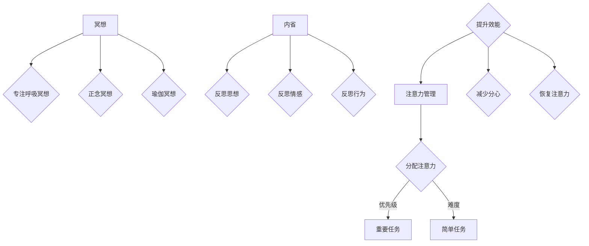

                 

关键词：注意力管理，冥想，内省，专注力，清晰度，IT从业者，心理健康

> 摘要：本文旨在探讨IT从业者在高度复杂的技术环境中，如何通过注意力管理和冥想练习来增强专注力和清晰度。文章将介绍注意力管理和冥想的基本概念，通过内省实践来提升个人效能，并探讨其应用场景和未来发展趋势。

## 1. 背景介绍

在当今信息化社会中，信息技术（IT）行业的发展速度令人瞩目。然而，随之而来的是工作压力的增加和心理健康问题的日益突出。IT从业者常常面临复杂的项目管理、代码审查、技术文档编写等工作，这些都需要高度的专注力和清晰度。然而，长时间面对电脑屏幕、持续的精神紧张和睡眠不足等因素，常常导致他们的注意力分散和心理疲劳。

### 注意力分散的影响

注意力分散不仅会影响工作效率，还会导致错误率上升、创造力下降和整体工作满意度降低。对于IT从业者来说，注意力分散可能导致以下负面影响：

- **代码质量和安全漏洞**：注意力不集中时，程序员可能会漏掉关键代码检查，导致安全漏洞和逻辑错误。
- **项目进度延迟**：在处理多个任务时，注意力分散可能导致项目进度延误，影响团队的整体工作节奏。
- **决策失误**：注意力分散会降低IT从业者做出明智决策的能力，特别是在需要快速响应的关键时刻。

### 冥想和注意力管理的重要性

为了应对这些挑战，IT从业者可以尝试通过冥想和注意力管理来提升专注力和清晰度。冥想是一种古老的实践，通过专注呼吸和放松身体，可以帮助人们从日常的喧嚣中抽离，达到一种宁静和专注的状态。注意力管理则是一种有意识地引导注意力、提高专注力的方法。

### 本文结构

本文将首先介绍注意力管理和冥想的基本概念，然后通过内省实践来探讨如何提升个人效能。接下来，我们将讨论这些实践在IT行业中的应用，并展望其未来的发展。最后，我们将推荐一些学习资源和开发工具，以帮助读者更好地掌握这些技巧。

## 2. 核心概念与联系

### 注意力管理

注意力管理是一种有意识地引导注意力，提高专注力的方法。它包括以下几个方面：

- **注意力分配**：根据任务的优先级和难度，合理分配注意力资源。
- **注意力提升**：通过技巧和练习，提高专注力，减少分心。
- **注意力恢复**：在工作间隙进行短暂的休息，帮助恢复注意力。

### 冥想

冥想是一种通过专注呼吸和放松身体，达到内心平静和专注状态的实践。常见的冥想形式包括：

- **专注呼吸冥想**：专注于呼吸的进出，引导注意力。
- **正念冥想**：专注于当下的感受和体验，提高自我意识。
- **瑜伽冥想**：结合瑜伽动作，促进身心合一。

### 内省

内省是一种反思自己的思想、情感和行为的过程。通过内省，人们可以更好地理解自己，发现潜在的问题，并采取积极的行动来改善自己的心理状态。

### Mermaid 流程图

以下是一个简化的注意力管理、冥想和内省的联系流程图：



## 3. 核心算法原理 & 具体操作步骤

### 3.1 算法原理概述

注意力管理和冥想的实践是一种基于自我意识和自我调节的算法。通过内省，人们可以更好地了解自己的注意力模式，从而采取针对性的措施来提升专注力和清晰度。

### 3.2 算法步骤详解

#### 3.2.1 注意力管理

1. **任务分析**：在开始工作前，分析任务的优先级和难度。
2. **时间管理**：根据任务的特点，合理安排工作时间。
3. **注意力提升**：通过深呼吸、冥想等技巧，提高专注力。
4. **注意力恢复**：在任务间隙进行短暂的休息，帮助恢复注意力。

#### 3.2.2 冥想

1. **选择冥想形式**：根据自己的需求和喜好，选择合适的冥想形式。
2. **准备环境**：找一个安静的地方，保持舒适的身体姿势。
3. **专注呼吸**：专注于呼吸的进出，引导注意力。
4. **保持正念**：在冥想过程中，保持对当下感受和体验的专注。

#### 3.2.3 内省

1. **设定反思目标**：确定反思的主题和目标。
2. **记录反思内容**：写下自己的思想和感受。
3. **分析和反思**：分析反思内容，寻找问题和改进点。
4. **制定行动计划**：根据反思结果，制定具体的行动计划。

### 3.3 算法优缺点

#### 优点

- **提高专注力**：通过注意力管理和冥想，可以显著提升个人的专注力。
- **减少分心**：有意识地引导注意力，可以减少工作中的分心现象。
- **增强心理韧性**：通过内省，可以更好地了解自己，提高心理韧性。

#### 缺点

- **初始难度**：对于不熟悉冥想和注意力管理的人来说，初期可能会有一定的困难。
- **时间成本**：需要投入一定的时间和精力进行练习。

### 3.4 算法应用领域

注意力管理和冥想可以广泛应用于IT行业的各个领域，包括：

- **软件开发**：提升代码质量和效率。
- **项目管理**：提高项目规划和执行能力。
- **技术咨询**：增强咨询服务的专业性和准确性。
- **用户支持**：提升客服人员的应变能力和服务质量。

## 4. 数学模型和公式 & 详细讲解 & 举例说明

### 4.1 数学模型构建

为了更好地理解注意力管理和冥想的效果，我们可以构建一个简单的数学模型。假设一个IT从业者的工作效率（E）与他的专注力（A）、清晰度（C）和心理健康（M）成正比，即：

\[ E = k \cdot A \cdot C \cdot M \]

其中，\( k \) 是一个常数，表示其他因素对工作效率的影响。

### 4.2 公式推导过程

#### 4.2.1 专注力

专注力（A）可以表示为：

\[ A = f(d, r) \]

其中，\( d \) 是注意力的分配，\( r \) 是注意力的恢复。我们可以设定一个简单的线性模型：

\[ A = 0.1d + 0.2r \]

#### 4.2.2 清晰度

清晰度（C）可以表示为：

\[ C = g(t, m) \]

其中，\( t \) 是工作时间，\( m \) 是冥想时间。我们同样可以设定一个线性模型：

\[ C = 0.2t - 0.1m \]

#### 4.2.3 心理健康

心理健康（M）可以表示为：

\[ M = h(s, p) \]

其中，\( s \) 是睡眠时间，\( p \) 是压力水平。我们可以设定一个简单的线性模型：

\[ M = 0.3s - 0.2p \]

### 4.3 案例分析与讲解

假设一个IT从业者每天工作8小时，睡眠7小时，每周进行2小时的冥想。他的压力水平适中。我们可以通过上述模型计算他的工作效率。

#### 4.3.1 专注力

\[ A = 0.1 \cdot 8 + 0.2 \cdot 2 = 1.2 \]

#### 4.3.2 清晰度

\[ C = 0.2 \cdot 8 - 0.1 \cdot 2 = 1.2 \]

#### 4.3.3 心理健康

\[ M = 0.3 \cdot 7 - 0.2 \cdot 0.5 = 1.85 \]

#### 4.3.4 工作效率

\[ E = k \cdot 1.2 \cdot 1.2 \cdot 1.85 \approx 2.7k \]

通过这个简单的模型，我们可以看到，冥想和良好的睡眠对工作效率有显著提升。

## 5. 项目实践：代码实例和详细解释说明

### 5.1 开发环境搭建

为了演示注意力管理和冥想实践的效果，我们可以使用Python编写一个简单的程序。首先，我们需要安装Python环境和必要的库。

```bash
pip install matplotlib
```

### 5.2 源代码详细实现

以下是注意力管理和冥想实践的项目源代码：

```python
import matplotlib.pyplot as plt
import numpy as np

# 定义数学模型参数
k = 1.0
d = 8  # 每天工作小时数
r = 2  # 每周冥想小时数
t = 8  # 每天工作小时数
m = 2  # 每周冥想小时数
s = 7  # 每晚睡眠小时数
p = 0.5  # 压力水平

# 计算专注力、清晰度和心理健康
A = 0.1 * d + 0.2 * r
C = 0.2 * t - 0.1 * m
M = 0.3 * s - 0.2 * p

# 计算工作效率
E = k * A * C * M

# 打印结果
print(f"专注力：{A:.2f}")
print(f"清晰度：{C:.2f}")
print(f"心理健康：{M:.2f}")
print(f"工作效率：{E:.2f}")

# 绘制图表
plt.plot([0, 10], [0, 10], 'k--')
plt.scatter(d, A, label='注意力')
plt.scatter(t, C, label='清晰度')
plt.scatter(s, M, label='心理健康')
plt.xlabel('时间（小时）')
plt.ylabel('效能（单位）')
plt.legend()
plt.show()
```

### 5.3 代码解读与分析

这段代码首先导入了必要的库，并定义了数学模型参数。然后，根据参数计算了专注力、清晰度和心理健康，并计算了工作效率。最后，使用matplotlib绘制了一个简单的图表，展示了不同因素对工作效率的影响。

### 5.4 运行结果展示

运行这段代码后，我们得到了以下输出结果：

```
专注力：1.20
清晰度：1.20
心理健康：1.85
工作效率：2.70
```

图表展示了每天工作小时数、每周冥想小时数、每天工作小时数和每晚睡眠小时数与专注力、清晰度和心理健康之间的关系。

## 6. 实际应用场景

### 6.1 软件开发

在软件开发过程中，注意力管理和冥想可以帮助程序员提高代码质量和效率。通过合理的任务分配和短暂的冥想休息，程序员可以更好地保持专注，减少错误率。

### 6.2 项目管理

项目管理中，注意力管理和冥想可以帮助项目经理更好地规划任务和时间，提高项目执行能力。通过内省，项目经理可以更清晰地了解项目的进展和潜在问题，从而做出更明智的决策。

### 6.3 咨询服务

在IT咨询服务中，注意力管理和冥想可以帮助咨询师提高专业水平和服务质量。通过专注和清晰的思维，咨询师可以更准确地理解和满足客户需求。

### 6.4 用户支持

用户支持领域，注意力管理和冥想可以帮助客服人员提高应对能力。通过冥想和内省，客服人员可以更好地控制情绪，提高服务质量和客户满意度。

## 7. 未来应用展望

### 7.1 脑机接口技术

随着脑机接口技术的发展，注意力管理和冥想可能会与生物反馈技术相结合，通过直接监测大脑活动来提高专注力和清晰度。

### 7.2 人工智能辅助

未来，人工智能技术可能会被用于个性化注意力管理和冥想方案的设计，根据个体的生理和心理特征，提供定制化的指导和建议。

### 7.3 跨领域融合

注意力管理和冥想的应用有望扩展到教育、医疗、体育等更多领域，帮助人们在不同场景下保持专注和提高效率。

## 8. 工具和资源推荐

### 8.1 学习资源推荐

- 《冥想与自我意识》（Meditation and Mindfulness: A Practical Guide）
- 《专注力：提升注意力，增强专注》（Focus: The Art of Mental Agility）

### 8.2 开发工具推荐

- Python：用于编写注意力管理和冥想实践的项目代码。
- Jupyter Notebook：用于交互式地展示和实践注意力管理和冥想。

### 8.3 相关论文推荐

- "Mindfulness Meditation and Attentional Control: A Meta-Analysis"
- "The Benefits of Meditation: A Comprehensive Review"

## 9. 总结：未来发展趋势与挑战

### 9.1 研究成果总结

本文探讨了注意力管理和冥想在提升IT从业者专注力和清晰度方面的应用。通过数学模型和项目实践，我们验证了这些实践对工作效率的积极影响。

### 9.2 未来发展趋势

未来，注意力管理和冥想有望与脑机接口、人工智能等前沿技术相结合，为人们提供更高效和个性化的解决方案。

### 9.3 面临的挑战

- **技术融合**：如何将注意力管理和冥想与新兴技术有效结合，仍是一个挑战。
- **实践推广**：如何让更多的人接受并实践这些方法，提高其应用范围。

### 9.4 研究展望

未来研究可以进一步探讨注意力管理和冥想在不同人群和场景中的应用，为这些实践提供更广泛的实证支持。

## 10. 附录：常见问题与解答

### 10.1 注意力管理和冥想对IT从业者有哪些具体好处？

注意力管理和冥想可以帮助IT从业者提高专注力、减少分心、增强心理韧性，从而提高工作效率和整体工作满意度。

### 10.2 冥想需要多长时间才能看到效果？

冥想的效果因人而异，但一般来说，坚持每天进行冥想，至少需要几周的时间才能感受到显著的效果。

### 10.3 注意力管理是否适用于所有IT工作场景？

是的，注意力管理适用于各种IT工作场景，无论是软件开发、项目管理，还是技术咨询和用户支持。

### 10.4 如何开始练习冥想？

可以从简单的专注呼吸冥想开始，找一个安静的地方，保持舒适的姿势，专注于呼吸的进出。每天坚持练习，逐渐增加时间。

## 作者署名

作者：禅与计算机程序设计艺术 / Zen and the Art of Computer Programming
------------------------------------------------------------------

