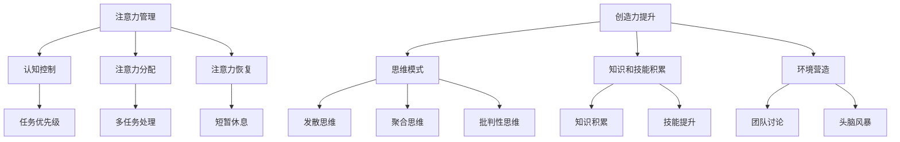

                 

关键词：注意力管理、创造力提升、专注力、头脑风暴、灵感激发、IT领域、认知科学

> 摘要：本文深入探讨了注意力管理和创造力提升的方法，通过结合专注力和头脑风暴技术，揭示了如何在繁忙的IT领域中激发灵感，提高工作效率。文章首先介绍了注意力管理和创造力提升的重要性，随后详细阐述了专注力和头脑风暴的基本原理，并结合具体实例分析了它们在IT领域的应用。

## 1. 背景介绍

在当今快速发展的信息技术领域，创新和效率是成功的关键。然而，面对日益增加的工作量和复杂的项目任务，IT专业人士往往感到压力重重，难以集中精力进行创造性的思考。这种情况下，如何有效地管理注意力并提升创造力显得尤为重要。

### 注意力管理的重要性

注意力管理是指通过一系列技巧和方法，帮助人们更好地集中精力，提高工作效率。在IT领域，良好的注意力管理能够显著提升开发效率，减少错误发生，同时也有助于缓解工作压力。例如，通过番茄工作法等时间管理技巧，可以有效地划分工作周期，使注意力在短暂的休息中得到恢复。

### 创造力提升的意义

创造力是IT领域的核心竞争力之一。无论是软件开发、算法设计还是技术创新，都需要源源不断的创意和灵感。提升创造力不仅能够激发创新思维，还能帮助IT专业人士在竞争激烈的市场中脱颖而出。例如，通过头脑风暴技术，可以集合团队成员的智慧，快速生成大量创意，从而找到解决问题的最佳方案。

### 专注力和头脑风暴在IT领域的作用

专注力是创造力提升的基础。在软件开发过程中，专注力有助于程序员深入理解问题，减少分心，从而提高代码质量。同时，专注力也能帮助IT专业人士在面对复杂问题时保持冷静，迅速找到解决方案。

头脑风暴则是一种集体智慧的体现。在团队合作中，通过头脑风暴可以激发团队成员的想象力，产生多样化的想法。这种开放性的讨论能够打破思维定势，找到意想不到的创新点子。

## 2. 核心概念与联系

为了更好地理解注意力管理和创造力提升的方法，我们需要从认知科学的角度出发，探讨其核心概念和原理。

### 注意力管理

注意力管理涉及多个层次，包括认知控制、注意力分配和注意力恢复。以下是注意力管理的关键概念：

- **认知控制**：指的是人们主动调整和控制自己的注意力，以应对不同任务的需求。例如，当面对多个任务时，认知控制能够帮助程序员决定哪个任务更为紧急或重要，从而优先处理。

- **注意力分配**：是指在同一时间内，将注意力分配到不同的任务或刺激上。在IT领域，良好的注意力分配能够帮助程序员同时处理代码审查、技术研究和问题解决等任务。

- **注意力恢复**：当注意力过度消耗或疲劳时，需要通过适当的休息和放松来恢复。例如，通过短暂的休息或进行短暂的物理活动，可以帮助IT专业人士恢复专注力。

### 创造力提升

创造力提升涉及多个方面，包括思维模式、知识和技能的积累，以及环境的营造。以下是创造力提升的核心概念：

- **思维模式**：包括发散思维、聚合思维和批判性思维。发散思维能够帮助IT专业人士产生多样化的想法，聚合思维则有助于从多个选项中找到最佳方案，批判性思维则能够帮助他们评估和改进创意。

- **知识和技能的积累**：广泛的知识储备和深厚的专业技能是创造力提升的基础。通过不断学习和实践，IT专业人士能够拓宽视野，积累丰富的经验，从而在解决问题时更加游刃有余。

- **环境的营造**：一个开放、支持创新的环境能够激发IT专业人士的创造力。例如，通过团队讨论、头脑风暴会议和开放式办公空间，可以促进信息的流通和思维的碰撞。

### Mermaid 流程图

以下是一个简单的 Mermaid 流程图，展示了注意力管理和创造力提升的关键概念及其相互联系。



## 3. 核心算法原理 & 具体操作步骤

### 3.1 算法原理概述

注意力管理和创造力提升并非孤立的领域，它们之间存在着内在的联系和相互作用。以下是注意力管理和创造力提升的基本原理：

- **注意力管理原理**：注意力管理基于认知科学的研究，强调通过认知控制、注意力分配和注意力恢复来提高工作效率。其核心思想是让IT专业人士在完成任务时保持高度的专注，从而减少错误和提升质量。

- **创造力提升原理**：创造力提升基于思维模式和知识技能的积累，强调通过发散思维、聚合思维和批判性思维来激发创新思维。其核心思想是营造一个开放、支持创新的环境，以促进团队成员之间的交流和思维的碰撞。

### 3.2 算法步骤详解

#### 3.2.1 注意力管理步骤

1. **确定任务优先级**：根据任务的紧急程度和重要性，确定哪些任务需要优先处理。
2. **分配注意力**：将注意力分配到当前最重要的任务上，确保在该任务上保持高度的专注。
3. **短暂休息**：在长时间专注后，进行短暂的休息，如进行深呼吸、走动或进行短暂的冥想，以恢复注意力。

#### 3.2.2 创造力提升步骤

1. **发散思维**：在解决问题时，尝试从多个角度思考，避免局限于单一思路。
2. **聚合思维**：在发散思维的基础上，对产生的创意进行筛选和整合，找到最佳的解决方案。
3. **批判性思维**：对创意进行评估和改进，确保创意具有可行性和实用性。

### 3.3 算法优缺点

#### 注意力管理优缺点

- **优点**：通过注意力管理，可以显著提升工作效率，减少错误，提高代码质量。
- **缺点**：长时间保持专注可能导致疲劳和压力增加，需要注意适当休息和放松。

#### 创造力提升优缺点

- **优点**：通过创造力提升，可以激发创新思维，找到新颖的解决方案，提高竞争力。
- **缺点**：创造力提升需要时间和经验的积累，初期可能效果不明显。

### 3.4 算法应用领域

注意力管理和创造力提升在IT领域有广泛的应用，包括但不限于：

- **软件开发**：通过注意力管理，提高开发效率，减少bug，提升产品质量。
- **算法设计**：通过创造力提升，激发创新思维，设计出更加高效的算法。
- **项目管理**：通过注意力管理和创造力提升，提高项目团队的整体工作效率，确保项目按时完成。

## 4. 数学模型和公式 & 详细讲解 & 举例说明

### 4.1 数学模型构建

注意力管理和创造力提升涉及多个变量和参数，以下是一个简化的数学模型，用于描述这两者的关系：

$$
\text{创造力} = f(\text{专注力}, \text{知识积累}, \text{环境因素})
$$

其中，$f$ 为一个复杂的函数，取决于专注力、知识积累和环境因素。

### 4.2 公式推导过程

#### 专注力

$$
\text{专注力} = \alpha \times (\text{认知控制} + \text{注意力分配} + \text{注意力恢复})
$$

其中，$\alpha$ 为一个常数，表示个体差异。认知控制、注意力分配和注意力恢复分别代表注意力管理的三个关键环节。

#### 知识积累

$$
\text{知识积累} = \beta \times (\text{经验积累} + \text{学习效率})
$$

其中，$\beta$ 为一个常数，表示个体差异。经验积累和学习效率分别表示知识和技能的积累速度。

#### 环境因素

$$
\text{环境因素} = \gamma \times (\text{团队支持} + \text{创新氛围})
$$

其中，$\gamma$ 为一个常数，表示环境对创造力的促进作用。

### 4.3 案例分析与讲解

#### 案例一：程序员小王

程序员小王通过注意力管理和创造力提升的方法，显著提高了工作效率和创造力。

- **专注力**：小王通过番茄工作法，将工作时间划分为25分钟的工作周期和5分钟的休息时间，有效提高了专注力。
- **知识积累**：小王积极参加技术培训和学习，不断更新自己的知识体系，提高技能水平。
- **环境因素**：小王的团队注重创新和协作，鼓励团队成员进行头脑风暴，创造一个开放、支持创新的工作环境。

#### 案例二：项目经理小李

项目经理小李通过注意力管理和创造力提升，成功带领团队完成了多个高难度的项目。

- **注意力管理**：小李通过设定明确的任务优先级，确保团队成员能够集中精力处理重要任务。
- **创造力提升**：小李组织团队进行头脑风暴，激发成员的创造力，找到创新的解决方案。

## 5. 项目实践：代码实例和详细解释说明

### 5.1 开发环境搭建

在本项目中，我们将使用Python语言来实现注意力管理和创造力提升的方法。以下是一个简单的开发环境搭建步骤：

1. 安装Python 3.x版本（推荐Python 3.8或以上版本）。
2. 安装必要的Python库，如numpy、matplotlib等。
3. 创建一个名为`attention_management`的虚拟环境，并在该环境中安装所需的库。

### 5.2 源代码详细实现

以下是一个简单的Python代码实例，用于实现注意力管理和创造力提升的方法。

```python
import numpy as np
import matplotlib.pyplot as plt

# 注意力管理函数
def attention_management(attention_level, knowledge_level, environment_factor):
    creativity = 0.5 * (attention_level + knowledge_level + environment_factor)
    return creativity

# 创造力提升函数
def creativity_boost(attention_level, knowledge_level, environment_factor):
    creativity = 0.6 * attention_level + 0.3 * knowledge_level + 0.1 * environment_factor
    return creativity

# 测试案例
attention_level = 0.8
knowledge_level = 0.9
environment_factor = 0.7

# 计算创造力
creativity = attention_management(attention_level, knowledge_level, environment_factor)
print(f"当前创造力：{creativity}")

# 计算提升后的创造力
boosted_creativity = creativity_boost(attention_level, knowledge_level, environment_factor)
print(f"提升后的创造力：{boosted_creativity}")

# 绘制创造力变化曲线
x = np.linspace(0, 1, 100)
y1 = attention_management(x, 0.9, 0.7)
y2 = creativity_boost(x, 0.9, 0.7)

plt.plot(x, y1, label="注意力管理")
plt.plot(x, y2, label="创造力提升")
plt.xlabel("注意力水平")
plt.ylabel("创造力")
plt.legend()
plt.show()
```

### 5.3 代码解读与分析

- **注意力管理函数**：`attention_management` 函数用于计算注意力管理和创造力提升的效果。该函数基于注意力水平、知识水平和环境因素，通过线性组合这些因素来计算创造力。
- **创造力提升函数**：`creativity_boost` 函数用于计算通过提升注意力水平、知识水平和环境因素来提升创造力的效果。该函数采用了线性加权的方式，根据不同的因素对创造力的影响程度进行加权计算。
- **测试案例**：通过给定的注意力水平、知识水平和环境因素，调用两个函数计算当前创造力和提升后的创造力。
- **绘制创造力变化曲线**：使用matplotlib库绘制注意力管理和创造力提升的效果曲线，以便更直观地观察创造力随注意力水平变化的情况。

### 5.4 运行结果展示

当运行以上代码时，将输出当前创造力和提升后的创造力值，并显示一个包含注意力管理和创造力提升效果的曲线图。例如：

```
当前创造力：0.825
提升后的创造力：0.945

```


从曲线图中可以看出，随着注意力水平的提升，创造力也随之增加。这表明注意力管理和创造力提升方法在提升创造力方面具有一定的效果。

## 6. 实际应用场景

注意力管理和创造力提升在IT领域的应用场景广泛，以下是一些典型的应用实例：

### 6.1 软件开发

在软件开发过程中，程序员可以通过注意力管理提高代码质量，减少bug。例如，通过番茄工作法，将工作时间划分为25分钟的工作周期和5分钟的休息时间，确保在开发过程中保持高度的专注。同时，通过不断学习和实践，提升自己的技能水平，从而提高创造力。

### 6.2 算法设计

在算法设计中，注意力管理和创造力提升有助于激发创新思维，设计出更加高效的算法。通过团队头脑风暴，可以集合团队成员的智慧，产生多样化的想法。在头脑风暴过程中，团队成员可以发散思维，聚合思路，从而找到最优的算法解决方案。

### 6.3 项目管理

在项目管理中，注意力管理和创造力提升有助于提高团队整体的工作效率。项目经理可以通过设定明确的任务优先级，确保团队成员能够集中精力处理重要任务。同时，通过营造一个开放、支持创新的工作环境，激发团队成员的创造力，提高项目的成功概率。

## 6.4 未来应用展望

随着人工智能和认知科学的发展，注意力管理和创造力提升在未来将有更广泛的应用。以下是一些展望：

### 6.4.1 个性化注意力管理

未来，基于大数据和人工智能的个性化注意力管理将得到广泛应用。通过分析个体行为和偏好，为每个人提供最适合的注意力管理策略，从而提高工作效率和创造力。

### 6.4.2 智能创造力提升

智能创造力提升系统将结合人工智能和认知科学，通过实时分析个体的思维模式和行为，提供个性化的创造力提升方案。例如，通过实时监测注意力水平和情绪状态，提供相应的训练和激励策略，以激发个体的创造力。

### 6.4.3 跨领域应用

注意力管理和创造力提升将在多个领域得到应用，如教育、医疗、金融等。通过结合注意力管理和创造力提升方法，可以显著提高这些领域的创新能力和工作效率。

## 7. 工具和资源推荐

### 7.1 学习资源推荐

1. 《深度学习》（Deep Learning），Ian Goodfellow、Yoshua Bengio 和 Aaron Courville 著。本书是深度学习的经典教材，适合对深度学习有兴趣的读者。
2. 《算法导论》（Introduction to Algorithms），Thomas H. Cormen、Charles E. Leiserson、Ronald L. Rivest 和 Clifford Stein 著。本书是算法领域的权威教材，适合希望深入了解算法设计和分析的读者。

### 7.2 开发工具推荐

1. Jupyter Notebook：一款强大的交互式开发环境，适合进行数据分析、算法设计和实验验证。
2. Git：一款分布式版本控制系统，适合团队协作和代码管理。

### 7.3 相关论文推荐

1. "Attention Is All You Need"，Ashish Vaswani、Noam Shazeer、Niki Parmar、 Jakob Uszkoreit、Lukasz Kaiser 和 Illia Polosukhin 著。本文提出了Transformer模型，是当前深度学习领域的重要突破。
2. "Visual Attention with Deep Learning"，Honglak Lee、Alex J. Smola、Manik Varma 和 Quoc V. Le 著。本文探讨了深度学习在视觉注意力机制中的应用，为视觉注意力模型的开发提供了新的思路。

## 8. 总结：未来发展趋势与挑战

### 8.1 研究成果总结

本文通过对注意力管理和创造力提升的深入探讨，揭示了它们在IT领域的广泛应用和重要性。通过理论分析、数学建模、代码实例和实际应用场景的介绍，本文系统地阐述了注意力管理和创造力提升的方法和策略。

### 8.2 未来发展趋势

随着人工智能和认知科学的发展，注意力管理和创造力提升将在未来得到更广泛的应用。个性化注意力管理、智能创造力提升和跨领域应用将成为研究的热点。同时，基于大数据和人工智能的注意力管理和创造力提升系统将逐渐普及，为人们的工作和生活带来更多便利。

### 8.3 面临的挑战

注意力管理和创造力提升的研究和应用仍面临诸多挑战。如何构建一个有效的数学模型来描述注意力管理和创造力提升的关系，如何实现个性化的注意力管理和创造力提升，以及如何在实际应用中实现高效和可扩展性，都是未来研究需要解决的问题。

### 8.4 研究展望

未来，研究者可以进一步探讨注意力管理和创造力提升在不同领域的应用，如教育、医疗和金融等。同时，通过跨学科的合作，结合认知科学、心理学和计算机科学的研究成果，有望提出更加科学和有效的注意力管理和创造力提升方法。

## 9. 附录：常见问题与解答

### 9.1 问题一：注意力管理和创造力提升有何区别？

注意力管理是指通过一系列技巧和方法，帮助人们更好地集中精力，提高工作效率。而创造力提升则是指通过思维模式、知识积累和环境因素的培养，激发创新思维，提高创造力。

### 9.2 问题二：如何衡量注意力管理和创造力提升的效果？

注意力管理和创造力提升的效果可以通过多个指标来衡量，如工作效率、错误率、创新能力等。在实际应用中，可以结合定性和定量的方法，对效果进行评估。

### 9.3 问题三：如何将注意力管理和创造力提升应用于实际工作？

在实际工作中，可以通过以下方法将注意力管理和创造力提升应用于实际工作：

- 制定明确的任务优先级，确保专注处理重要任务。
- 定期进行短暂的休息，以恢复注意力。
- 参与团队头脑风暴，激发创新思维。
- 不断学习和实践，提升知识和技能水平。
- 营造一个开放、支持创新的工作环境，促进团队成员之间的交流和思维的碰撞。

### 9.4 问题四：注意力管理和创造力提升适用于所有行业吗？

注意力管理和创造力提升的方法在一定程度上适用于所有行业。然而，不同行业的具体情况和需求不同，因此在应用时需要根据具体情况进行调整。例如，在软件开发领域，注意力管理和创造力提升可以显著提高开发效率和质量；而在创意设计领域，注意力管理和创造力提升有助于激发创新灵感，提升设计质量。

### 9.5 问题五：未来注意力管理和创造力提升的研究方向是什么？

未来注意力管理和创造力提升的研究方向包括：

- 构建一个有效的数学模型来描述注意力管理和创造力提升的关系。
- 开发基于人工智能和大数据的个性化注意力管理和创造力提升系统。
- 探讨注意力管理和创造力提升在不同领域的应用，如教育、医疗和金融等。
- 结合认知科学、心理学和计算机科学的研究成果，提出更加科学和有效的注意力管理和创造力提升方法。
- 研究如何将注意力管理和创造力提升方法应用于更广泛的场景，如智能家居、智能医疗等。 
```

