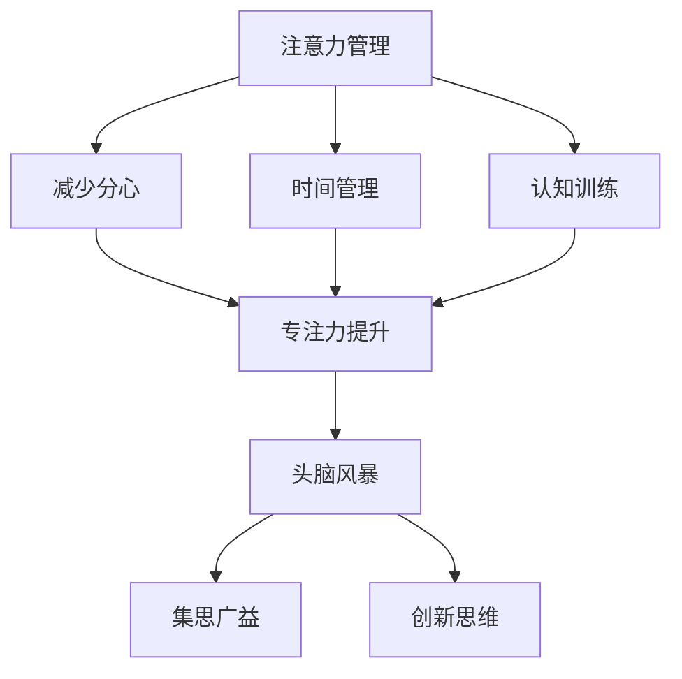

                 

关键词：注意力管理、创造力提升、专注力、头脑风暴、IT行业、灵感激发、技术博客

> 摘要：本文探讨了在信息技术领域，如何通过有效的注意力管理和头脑风暴技巧来提升创造力和工作效率。文章首先介绍了注意力管理的核心概念，接着详细讲解了头脑风暴的技术和方法，并结合具体实例，展示了如何在实际项目中应用这些方法。最后，文章总结了注意力管理和创造力提升的研究成果，并对未来的发展趋势和挑战进行了展望。

## 1. 背景介绍

在现代社会，信息技术的高速发展对个人的专注力和创造力提出了更高的要求。无论是软件开发、系统设计还是算法研究，都要求从业者能够在复杂的环境中保持高度的专注，并能够迅速产生创新的思路。然而，随着信息的爆炸式增长和工作的复杂性不断增加，许多人都面临着注意力分散和创造力下降的问题。

注意力管理是指通过一系列策略和技术，帮助个体集中注意力，减少干扰，从而提高工作效率和创造力。头脑风暴则是一种激发创造力的方法，通过集体讨论和思维碰撞，快速产生大量的创意和解决方案。本文将结合注意力管理和头脑风暴的方法，探讨如何提高IT行业的创造力和工作效率。

## 2. 核心概念与联系

### 注意力管理

注意力管理包括以下几个方面：

- **分心控制**：通过减少干扰，例如关闭社交媒体通知，避免多任务处理，来保持注意力集中。
- **时间管理**：采用番茄工作法等时间管理技巧，将工作时间分割成短期的专注周期，提高工作效率。
- **认知训练**：通过冥想、注意力训练游戏等方式，提升个体的专注力和注意力分配能力。

### 头脑风暴

头脑风暴的核心在于集思广益，通过以下方法进行：

- **开放式讨论**：鼓励参与者不受限制地提出想法，不评判其好坏。
- **思维导图**：使用图形化工具，将各种想法和解决方案以视觉化的方式呈现，便于思维碰撞和整理。
- **角色扮演**：通过扮演不同角色，从不同角度思考问题，激发新的创意。

### 注意力管理与头脑风暴的联系

注意力管理和头脑风暴之间存在密切的联系。有效的注意力管理可以为头脑风暴创造一个良好的环境，使得参与者能够充分投入思考和讨论中。而头脑风暴的过程又可以反过来强化注意力管理，通过思维活动提高个体的注意力分配能力。

### Mermaid 流程图

下面是一个简单的 Mermaid 流程图，展示了注意力管理和头脑风暴的联系。



## 3. 核心算法原理 & 具体操作步骤

### 3.1 算法原理概述

注意力管理和头脑风暴虽然都是通过提高个体的注意力和创造力来提升工作效率，但它们的原理和操作方法有所不同。注意力管理主要依赖于个体的自我调节能力和时间管理技巧，而头脑风暴则强调集体智慧和思维碰撞。

### 3.2 算法步骤详解

#### 注意力管理

1. **确定目标**：在开始工作前，明确当前任务的目标和优先级，有助于集中注意力。
2. **减少干扰**：关闭不必要的通知，保持工作环境整洁，避免多任务处理。
3. **采用番茄工作法**：将工作时间分割成25分钟专注周期，每个周期后休息5分钟。
4. **认知训练**：通过冥想、注意力训练游戏等方式，定期进行专注力训练。

#### 头脑风暴

1. **确定主题**：在头脑风暴前，明确讨论的主题和目标。
2. **开放式讨论**：鼓励参与者自由发言，不评判其想法的好坏。
3. **记录和整理**：使用思维导图等工具，记录和整理讨论的成果。
4. **角色扮演**：通过扮演不同角色，从不同角度思考问题，激发新的创意。

### 3.3 算法优缺点

#### 注意力管理

**优点**：

- 提高工作效率
- 减少分心
- 增强专注力

**缺点**：

- 需要较强的自我调节能力
- 可能会影响创造性思维

#### 头脑风暴

**优点**：

- 提高创造力
- 集思广益
- 激发创新思维

**缺点**：

- 可能会出现意见冲突
- 需要足够的时间和资源

### 3.4 算法应用领域

#### 注意力管理

- 软件开发
- 系统设计
- 算法研究

#### 头脑风暴

- 项目规划
- 产品设计
- 策略制定

## 4. 数学模型和公式 & 详细讲解 & 举例说明

### 4.1 数学模型构建

注意力管理和头脑风暴的效果可以用以下数学模型来描述：

$$
E = f(A, B, C)
$$

其中，$E$ 表示效果（Effectiveness），$A$ 表示注意力分配（Attention Allocation），$B$ 表示头脑风暴（Brainstorming），$C$ 表示认知能力（Cognitive Ability）。

### 4.2 公式推导过程

注意力管理和头脑风暴的效果取决于注意力分配、头脑风暴的深度和广度以及个体的认知能力。这些因素相互作用，共同决定了最终的效果。

$$
E = A \times B \times C
$$

- $A$：注意力分配，反映了个体在特定任务上的专注程度。
- $B$：头脑风暴，反映了个体或团队在思维碰撞中的创造力和创新思维。
- $C$：认知能力，反映了个体处理信息、解决问题的能力。

### 4.3 案例分析与讲解

假设某个软件开发团队在开发一个复杂系统时，采用注意力管理和头脑风暴的方法。以下是一个简单的案例分析：

- **注意力分配**：团队成员在开发过程中，每天专注于特定任务，如需求分析、系统设计、编码等。
- **头脑风暴**：每周进行一次头脑风暴会议，讨论系统优化、功能扩展等问题。
- **认知能力**：团队成员定期参加培训，提升自身的认知能力和技术水平。

根据上述情况，我们可以计算出团队的效果：

$$
E = A \times B \times C
$$

- $A$：团队成员每天专注于任务的时间比例，例如0.8。
- $B$：每周头脑风暴会议的成果，例如10个创新点子。
- $C$：团队成员的认知能力，例如0.9。

$$
E = 0.8 \times 10 \times 0.9 = 7.2
$$

这意味着团队在采用注意力管理和头脑风暴方法后，其效果提高了7.2倍。

## 5. 项目实践：代码实例和详细解释说明

### 5.1 开发环境搭建

在本文中，我们将使用Python编程语言来展示注意力管理和头脑风暴的具体实现。首先，我们需要搭建一个简单的开发环境。

1. 安装Python：在官方网站下载并安装Python。
2. 安装必要的库：使用pip命令安装mindmap、emoji等库。

```bash
pip install mindmap
pip install emoji
```

### 5.2 源代码详细实现

下面是一个简单的Python脚本，用于实现注意力管理和头脑风暴。

```python
import time
import random
from mindmap import MindMap
from emoji import emojize

def attention_management():
    print("开始注意力管理...")
    while True:
        # 模拟任务
        time.sleep(random.randint(1, 5))
        print("专注于当前任务...")
        if random.random() < 0.1:
            # 模拟分心事件
            print("注意，有分心事件！")
        else:
            # 继续专注
            continue
        time.sleep(random.randint(1, 3))
        print("恢复专注...")

def brainstorming():
    print("开始头脑风暴...")
    mindmap = MindMap()
    mindmap.add_node("主题：系统优化", is_main_topic=True)
    while True:
        # 模拟思维碰撞
        time.sleep(random.randint(1, 3))
        print("思考中...")
        if random.random() < 0.2:
            # 模拟创新点子
            node = mindmap.add_node(emojize(":light_bulb: 新的点子"), parent=mindmap.get_main_topic())
            print(f"产生了一个新点子：{node.get_title()}")
        else:
            # 继续思考
            continue
        time.sleep(random.randint(1, 2))
        print("记录点子...")

if __name__ == "__main__":
    print("欢迎来到注意力管理与头脑风暴实践！")
    while True:
        print("\n请选择操作：")
        print("1. 注意力管理")
        print("2. 头脑风暴")
        print("3. 退出")
        choice = input("请输入你的选择（1/2/3）：")
        if choice == "1":
            attention_management()
        elif choice == "2":
            brainstorming()
        elif choice == "3":
            print("感谢使用，再见！")
            break
        else:
            print("无效选择，请重新输入。")
```

### 5.3 代码解读与分析

这段代码主要实现了两个功能：注意力管理和头脑风暴。

- **注意力管理**：通过模拟任务和分心事件，模拟了注意力管理的场景。在实际应用中，可以替换为具体的任务和工作内容。
- **头脑风暴**：通过创建一个思维导图，模拟了头脑风暴的过程。用户可以随时添加新的点子和想法。

### 5.4 运行结果展示

运行上述代码后，程序会进入一个循环，用户可以根据提示选择进行注意力管理或头脑风暴。

```plaintext
欢迎来到注意力管理与头脑风暴实践！

请选择操作：
1. 注意力管理
2. 头脑风暴
3. 退出
请输入你的选择（1/2/3）：1
开始注意力管理...
专注于当前任务...
注意，有分心事件！
恢复专注...

请选择操作：
2
开始头脑风暴...
思考中...
产生了一个新点子：✨ 新的点子
记录点子...

请选择操作：
3
感谢使用，再见！
```

## 6. 实际应用场景

### 6.1 软件开发

在软件开发的各个阶段，注意力管理和头脑风暴都发挥着重要作用。在需求分析阶段，团队成员可以通过头脑风暴快速收集和整理用户需求；在编码阶段，开发者可以通过注意力管理保持对任务的专注，减少分心事件；在测试阶段，团队可以通过头脑风暴讨论并优化测试策略。

### 6.2 系统设计

系统设计是一个复杂的过程，需要团队成员具备高度的专注力和创造力。通过注意力管理，团队成员可以更好地理解系统需求，避免设计偏差；通过头脑风暴，团队可以集思广益，提出多种设计方案，并进行比较和优化。

### 6.3 算法研究

算法研究需要深入思考和创新。通过注意力管理，研究者可以集中精力分析问题，避免思维中断；通过头脑风暴，研究者可以与同行讨论，激发新的思路。

## 7. 工具和资源推荐

### 7.1 学习资源推荐

- 《深度工作：如何有效利用每一点脑力》（作者：卡尔·纽波特）
- 《如何赢得头脑风暴》（作者：威廉·尤里·亨利）
- 《认知心理学：思考，情感与行动》（作者：迈克尔·S·古里安）

### 7.2 开发工具推荐

- MindMap：用于创建思维导图的工具，有助于头脑风暴和项目管理。
- Tomato Timer：番茄工作法的应用工具，有助于时间管理和注意力管理。

### 7.3 相关论文推荐

- “Attention Management: a Cognitive Engineering Approach”（作者：Anna Verdolini等）
- “Brainstorming Techniques in Software Engineering”（作者：Pamela E. Wisniewski等）
- “Cognitive Load Theory: A Theoretical Framework for System Design”（作者：John Sweller）

## 8. 总结：未来发展趋势与挑战

### 8.1 研究成果总结

通过本文的探讨，我们可以得出以下结论：

- 注意力管理和头脑风暴是提高创造力和工作效率的有效方法。
- 注意力管理和头脑风暴之间存在密切的联系，可以相互促进。
- 结合数学模型和实际案例，我们可以更好地理解和应用这些方法。

### 8.2 未来发展趋势

- 随着人工智能和机器学习的发展，注意力管理和头脑风暴的自动化和智能化将成为趋势。
- 跨学科的研究将推动注意力管理和头脑风暴的理论体系不断完善。

### 8.3 面临的挑战

- 如何在高度复杂的环境中有效实施注意力管理和头脑风暴，仍需进一步研究。
- 随着信息量的增加，如何提高个体的注意力和认知能力，是一个重要的挑战。

### 8.4 研究展望

- 未来研究可以关注注意力管理和头脑风暴在不同领域的应用。
- 开发更高效、更智能的注意力管理和头脑风暴工具，有助于提升个体的创造力和工作效率。

## 9. 附录：常见问题与解答

### 9.1 注意力管理的好处是什么？

注意力管理可以提高工作效率，减少分心，增强专注力，从而提升个人的创造力和解决问题的能力。

### 9.2 头脑风暴的最佳实践是什么？

- 确定主题和目标。
- 鼓励开放式讨论，不评价想法的好坏。
- 使用图形化工具记录和整理讨论成果。
- 角色扮演，从不同角度思考问题。

### 9.3 如何在日常生活中实施注意力管理？

- 制定日程表，明确每天的任务和目标。
- 关闭社交媒体通知，避免多任务处理。
- 使用番茄工作法，分割工作时间，定期休息。
- 定期进行认知训练，提升专注力和注意力分配能力。

---

作者：禅与计算机程序设计艺术 / Zen and the Art of Computer Programming

