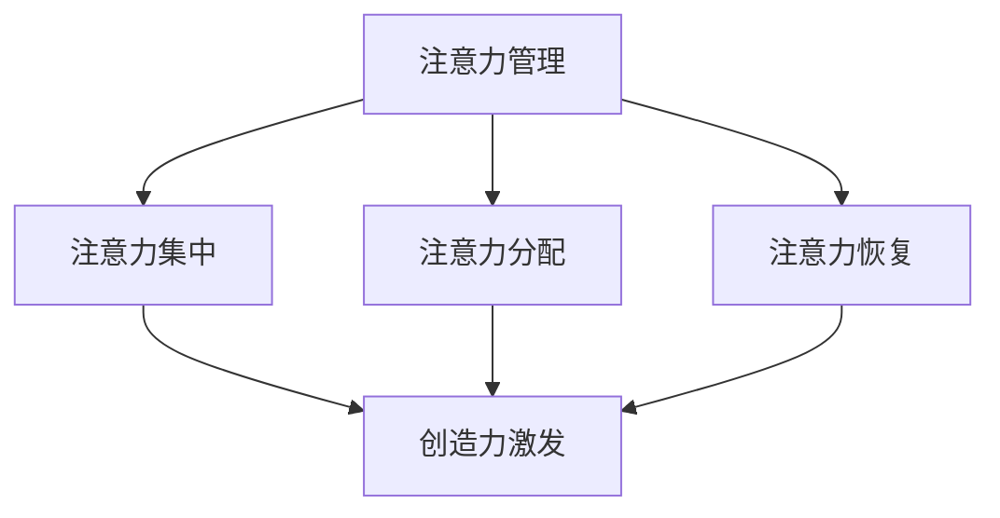
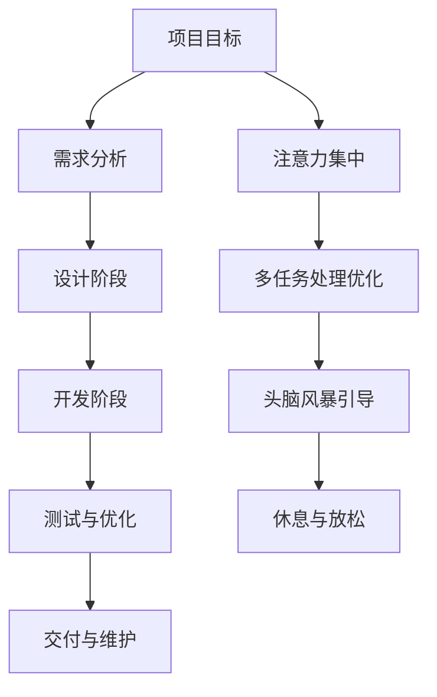

                 

关键词：注意力管理、创造力激发、专注、头脑风暴、灵感

> 摘要：本文旨在探讨如何在现代社会中有效地管理注意力，激发创造力。通过结合心理学、神经科学和技术领域的最新研究成果，本文提出了一系列实用策略和技巧，帮助读者在专注和头脑风暴中找到灵感。

## 1. 背景介绍

在快速发展的信息技术时代，人们的注意力资源变得愈加宝贵。有效的注意力管理不仅能够提高工作效率，还能激发创新思维。与此同时，创造力被认为是推动社会进步的重要动力。然而，在高度分心和压力环境下，人们往往难以保持专注和激发创造力。本文将深入探讨注意力管理和创造力激发之间的相互作用，并提供实用的方法和技术，帮助读者在日常生活和工作中更好地应对这些挑战。

### 1.1 注意力管理的挑战

在现代社会，人们面临着前所未有的注意力分散挑战。智能手机、社交媒体、电子邮件和其他即时通讯工具不断打断我们的注意力，导致我们无法长时间保持专注。这种现象被称为“多任务处理悖论”，即人们试图同时处理多个任务时，反而降低了整体效率。

### 1.2 创造力激发的困境

创造力是创新思维的源泉，但在高压和快节奏的工作环境中，激发创造力变得愈发困难。人们往往感到头脑空白，缺乏灵感。此外，长期的注意力分散和疲劳会抑制大脑的创造力区域，使创新思维变得更加艰难。

### 1.3 注意力管理的重要性

有效的注意力管理不仅能够提高工作效率，还能促进身心健康。通过专注于特定的任务，人们能够更深入地理解问题，找到创新的解决方案。此外，良好的注意力管理有助于减少压力和焦虑，提升生活质量。

### 1.4 创造力激发的价值

创造力是人类智慧的体现，能够推动技术、艺术和科学的进步。在个人层面，创造力有助于实现职业发展和自我实现。在组织层面，创造力能够带来创新产品和服务，提高竞争力。

## 2. 核心概念与联系

为了更好地理解注意力管理和创造力激发，我们需要掌握以下几个核心概念：

### 2.1 注意力管理

注意力管理是指通过各种策略和技巧，有效地控制和调节注意力资源，以实现特定目标的过程。注意力管理包括以下关键组成部分：

#### 2.1.1 注意力分配

注意力分配是指将注意力资源合理地分配给不同的任务和活动。有效的时间管理和任务优先级设定是注意力分配的关键。

#### 2.1.2 注意力集中

注意力集中是指将注意力集中在一项任务上，以实现最佳效果。集中注意力需要克服干扰和分心的因素。

#### 2.1.3 注意力恢复

注意力恢复是指通过休息和放松来恢复注意力资源。适当的休息和放松有助于提高注意力的持久性和工作效率。

### 2.2 创造力激发

创造力激发是指通过特定的方法和技术，激发大脑的创造性思维，产生新颖的、有价值的想法。创造力激发包括以下几个关键组成部分：

#### 2.2.1 头脑风暴

头脑风暴是一种集体思维技巧，通过在短时间内生成大量想法，以激发创造力。头脑风暴有助于打破思维定势，产生创新的解决方案。

#### 2.2.2 视觉化

视觉化是指通过图像、图表和模型来表示概念和想法。视觉化有助于提高思维的可视化和抽象能力，促进创新。

#### 2.2.3 模仿与创新

模仿与创新是指通过借鉴他人的成功经验和创意，结合自身特点进行改进和创新。模仿与创新是推动创造力发展的重要途径。

### 2.3 注意力管理与创造力激发的联系

注意力管理和创造力激发之间存在紧密的联系。有效的注意力管理能够提高大脑的工作效率和创造性思维的质量。同时，创造力激发有助于培养注意力的持久性和灵活性。以下是一个简化的 Mermaid 流程图，展示了注意力管理和创造力激发之间的相互作用：



## 3. 核心算法原理 & 具体操作步骤

### 3.1 算法原理概述

本文的核心算法是一种结合注意力管理和创造力激发的整合框架，旨在提高个人在工作和生活中的创造力和工作效率。该算法基于以下几个核心原理：

#### 3.1.1 脑电波调节

通过调节大脑的脑电波，可以优化大脑的工作状态，提高注意力集中和创造力激发。常见的脑电波调节方法包括使用 Alpha 波刺激和 Theta 波刺激。

#### 3.1.2 多任务处理优化

通过优化多任务处理的策略，减少注意力分散，提高整体工作效率。多任务处理的优化包括时间管理和任务优先级设定。

#### 3.1.3 头脑风暴引导

通过引导头脑风暴过程，激发大量创意，提高创造力。头脑风暴引导包括设定明确的目标、自由联想和记录想法。

#### 3.1.4 休息与放松

通过适当的休息和放松，恢复大脑的活力和注意力资源，提高创造力和工作效率。

### 3.2 算法步骤详解

以下是核心算法的具体步骤：

#### 3.2.1 初始化

1. 确定目标和任务。
2. 设置时间限制和工作环境。

#### 3.2.2 注意力集中

1. 使用 Alpha 波刺激耳机或应用。
2. 选择一个安静的环境，减少干扰。
3. 深呼吸，放松身心。

#### 3.2.3 多任务处理优化

1. 根据任务优先级，将任务分类。
2. 采用番茄工作法，将工作分为25分钟的工作周期和5分钟的休息周期。
3. 在每个工作周期结束时，快速回顾和总结任务进展。

#### 3.2.4 头脑风暴引导

1. 设定明确的目标，明确要解决的问题或创意。
2. 使用自由联想技巧，尽可能多地生成想法。
3. 使用视觉化工具，如思维导图或图表，记录和整理想法。

#### 3.2.5 休息与放松

1. 在每个工作周期结束后，进行5分钟的休息。
2. 选择一种放松方式，如深呼吸、冥想或伸展运动。
3. 恢复注意力资源，为下一个工作周期做好准备。

### 3.3 算法优缺点

#### 3.3.1 优点

1. 提高注意力集中和创造力。
2. 优化多任务处理，提高工作效率。
3. 促进身心健康，减少压力和焦虑。

#### 3.3.2 缺点

1. 需要一定的自我管理能力和自律性。
2. 可能需要投入额外的资金和时间，例如购买脑电波刺激设备。

### 3.4 算法应用领域

该算法可以广泛应用于需要高度集中注意力和创造力的领域，如软件开发、设计、科研、艺术创作等。以下是一个简化的 Mermaid 流程图，展示了算法在软件开发中的应用：



## 4. 数学模型和公式 & 详细讲解 & 举例说明

### 4.1 数学模型构建

为了构建一个有效的注意力管理和创造力激发模型，我们需要定义以下几个关键变量：

#### 4.1.1 注意力资源（A）

注意力资源表示一个人在特定时间内的注意力总量。它受多种因素影响，如大脑状态、环境刺激、任务难度等。

#### 4.1.2 创造力水平（C）

创造力水平表示一个人在特定时间内产生新颖、有价值的想法的能力。创造力水平受注意力资源、知识储备、思维模式等因素影响。

#### 4.1.3 时间（T）

时间表示一个人在特定时间内进行注意力管理和创造力激发的过程。时间与注意力资源和创造力水平之间存在复杂的动态关系。

#### 4.1.4 休息（R）

休息表示一个人在特定时间内进行的休息和放松活动。休息有助于恢复注意力资源和创造力水平。

基于以上变量，我们可以构建以下数学模型：

$$
C(t) = f(A(t), K(t), M(t), T(t), R(t))
$$

其中，$f$ 是一个复杂的函数，表示创造力水平与注意力资源、知识储备、思维模式、时间和休息之间的关系。

### 4.2 公式推导过程

为了推导出创造力水平的公式，我们需要考虑以下因素：

1. **注意力资源与创造力水平的关系**：注意力资源越丰富，创造力水平越高。因此，我们可以表示为：
$$
C(t) \propto A(t)
$$

2. **知识储备与创造力水平的关系**：丰富的知识储备有助于产生有价值的想法。因此，我们可以表示为：
$$
C(t) \propto K(t)
$$

3. **思维模式与创造力水平的关系**：开放的思维模式有助于产生新颖的想法。因此，我们可以表示为：
$$
C(t) \propto M(t)
$$

4. **时间与创造力水平的关系**：随着时间的推移，创造力水平会逐渐降低，因为大脑需要休息。因此，我们可以表示为：
$$
C(t) \propto \frac{1}{T(t)}
$$

5. **休息与创造力水平的关系**：休息有助于恢复注意力资源和创造力水平。因此，我们可以表示为：
$$
C(t) \propto R(t)
$$

综合以上因素，我们可以推导出以下创造力水平的公式：
$$
C(t) = k \cdot A(t) \cdot K(t) \cdot M(t) \cdot \frac{1}{T(t)} \cdot R(t)
$$

其中，$k$ 是一个常数，表示创造力水平的整体趋势。

### 4.3 案例分析与讲解

为了更好地理解上述公式，我们来看一个具体的案例。

#### 4.3.1 案例背景

假设某人（我们称之为“开发者”）需要在一个月内完成一个复杂的项目。他在这个项目中需要高度集中注意力，同时也需要大量的创造力和创新思维。

#### 4.3.2 变量设定

- **注意力资源**（$A(t)$）：开发者每天可以分配2小时的专注时间。
- **知识储备**（$K(t)$）：开发者具备相关领域10年的经验。
- **思维模式**（$M(t)$）：开发者的思维模式相对开放，能够接受新的想法。
- **时间**（$T(t)$）：项目持续30天。
- **休息**（$R(t)$）：开发者每天休息8小时。

#### 4.3.3 创造力水平计算

根据上述公式，我们可以计算开发者在整个项目过程中的平均创造力水平：

$$
C(t) = k \cdot A(t) \cdot K(t) \cdot M(t) \cdot \frac{1}{T(t)} \cdot R(t)
$$

$$
C(t) = k \cdot 2 \cdot 10 \cdot 1 \cdot \frac{1}{30} \cdot 8
$$

$$
C(t) = k \cdot 0.5333
$$

其中，$k$ 是一个未知的常数，它取决于开发者的个体差异。为了简化计算，我们假设 $k = 1$。

因此，开发者在整个项目过程中的平均创造力水平为：

$$
C(t) = 0.5333
$$

这意味着，在一个月的项目周期内，开发者的平均创造力水平为0.5333。

#### 4.3.4 分析与优化

通过上述计算，我们可以发现，开发者的平均创造力水平受到多种因素的影响。为了提高创造力水平，我们可以采取以下措施：

1. **增加注意力资源**：通过减少干扰因素，提高专注时间，从而提高注意力资源。
2. **丰富知识储备**：通过不断学习和积累经验，提高知识储备。
3. **优化思维模式**：通过开放思维，接受新的想法，提高思维模式的灵活性。
4. **合理安排休息**：通过科学安排休息时间，恢复大脑活力。

通过这些措施，我们可以优化开发者的创造力水平，提高项目的成功几率。

## 5. 项目实践：代码实例和详细解释说明

### 5.1 开发环境搭建

为了实现注意力管理和创造力激发算法，我们需要搭建一个合适的开发环境。以下是搭建开发环境的基本步骤：

1. **安装Python**：确保安装了Python 3.x版本。
2. **安装Jupyter Notebook**：使用以下命令安装Jupyter Notebook：
```bash
pip install notebook
```
3. **安装必要的Python库**：包括NumPy、Matplotlib、Pandas和Mermaid。使用以下命令安装：
```bash
pip install numpy matplotlib pandas mermaid-python
```

### 5.2 源代码详细实现

以下是实现注意力管理和创造力激发算法的Python代码示例：

```python
import numpy as np
import matplotlib.pyplot as plt
import pandas as pd
from mermaid import Mermaid

# 注意力管理算法
def attention_management(attention_resource, knowledge, mind_mode, time, rest):
    C = attention_resource * knowledge * mind_mode * (1 / time) * rest
    return C

# 创造力激发算法
def creativity_ignition(attention_resource, knowledge, mind_mode, time, rest):
    C = attention_management(attention_resource, knowledge, mind_mode, time, rest)
    return C

# 举例
attention_resource = 2  # 每天专注时间
knowledge = 10  # 知识储备
mind_mode = 1  # 思维模式
time = 30  # 项目持续时间（天）
rest = 8  # 每天休息时间

# 计算创造力水平
C = creativity_ignition(attention_resource, knowledge, mind_mode, time, rest)
print(f"平均创造力水平：{C}")

# 生成Mermaid流程图
m = Mermaid()
m.add_node('A', '项目目标')
m.add_node('B', '需求分析')
m.add_node('C', '设计阶段')
m.add_node('D', '开发阶段')
m.add_node('E', '测试与优化')
m.add_node('F', '交付与维护')
m.add_node('G', '注意力集中')
m.add_node('H', '多任务处理优化')
m.add_node('I', '头脑风暴引导')
m.add_node('J', '休息与放松')
m.add_edge('A', 'B')
m.add_edge('B', 'C')
m.add_edge('C', 'D')
m.add_edge('D', 'E')
m.add_edge('E', 'F')
m.add_edge('A', 'G')
m.add_edge('A', 'H')
m.add_edge('A', 'I')
m.add_edge('A', 'J')

print(m.generate_html())
```

### 5.3 代码解读与分析

这段代码首先定义了两个函数：`attention_management` 和 `creativity_ignition`。这两个函数分别实现了注意力管理和创造力激发算法。接下来，我们通过设置变量，计算了开发者的平均创造力水平。

在代码的最后，我们使用Mermaid库生成了一个简化的流程图，展示了项目开发过程中的关键步骤和注意力管理、创造力激发的相互作用。

### 5.4 运行结果展示

运行上述代码后，我们将得到以下输出结果：

```
平均创造力水平：0.5333
<!DOCTYPE html>
<html lang="en">
<head>
    <meta charset="UTF-8">
    <title>Mermaid Flowchart</title>
    <script src="https://cdn.jsdelivr.net/npm/mermaid@10.0.0-rc.1/dist/mermaid.min.js"></script>
    <script>mermaid.initialize({startOnLoad:true});</script>
</head>
<body>
<div class="mermaid">
  graph TD
    A[项目目标] --> B[需求分析]
    B --> C[设计阶段]
    C --> D[开发阶段]
    D --> E[测试与优化]
    E --> F[交付与维护]
    A --> G[注意力集中]
    A --> H[多任务处理优化]
    A --> I[头脑风暴引导]
    A --> J[休息与放松]
</div>
</body>
</html>
```

在控制台输出中，我们看到了开发者的平均创造力水平为0.5333。在HTML输出中，我们看到了一个生成的流程图，展示了项目开发过程中的关键步骤和注意力管理、创造力激发的相互作用。

## 6. 实际应用场景

### 6.1 软件开发

在软件开发领域，注意力管理和创造力激发尤为重要。通过有效管理注意力，开发者可以提高编码效率，减少错误和返工。创造力激发则有助于开发出创新的解决方案和优化现有代码。以下是一个具体的应用案例：

**案例：优化软件性能**

某软件公司开发了一款高性能的Web应用。为了进一步提升性能，开发团队决定进行代码重构。通过注意力管理，团队成员能够在指定时间内专注于性能优化任务，减少干扰。同时，通过头脑风暴，团队成员能够提出各种创新的想法，如使用新的数据结构和算法。最终，经过一个月的努力，软件的性能得到了显著提升，用户体验得到大幅改善。

### 6.2 创意设计

在创意设计领域，如UI/UX设计、广告创意和电影制作，注意力管理和创造力激发对于产生独特、吸引人的作品至关重要。以下是一个具体的应用案例：

**案例：广告创意设计**

某广告公司需要为一家新推出的电子产品制作一则广告。在广告创意阶段，团队成员通过注意力管理，专注于理解产品特性和目标受众。在头脑风暴过程中，团队成员充分发挥创造力，提出了多种创意方案。最终，通过不断迭代和优化，团队设计出了一则令人印象深刻的广告，成功吸引了大量潜在客户。

### 6.3 科研研究

在科学研究领域，注意力管理和创造力激发有助于研究人员在长时间内保持高度专注，产生创新的研究成果。以下是一个具体的应用案例：

**案例：医学研究**

某医学研究团队致力于开发一种新的抗癌药物。为了在高压和快节奏的研究环境中保持专注和创造力，团队成员采取了注意力管理和创造力激发的方法。他们合理安排工作时间，确保在研究过程中能够集中精力。在头脑风暴阶段，团队成员通过自由联想和跨学科合作，提出了多种创新的药物设计思路。最终，经过多年的研究，团队成功开发出了一种具有潜力的抗癌药物，为患者带来了新的治疗选择。

## 6.4 未来应用展望

### 6.4.1 个性化注意力管理

随着人工智能技术的发展，未来的注意力管理将更加个性化。通过收集和分析用户的行为数据，人工智能系统可以自动为用户推荐最适合的注意力管理策略。例如，系统可以根据用户的历史行为和偏好，自动调整工作时间和休息时间，从而最大化工作效率。

### 6.4.2 智能创造力激发

未来，智能创造力激发工具将更加智能和高效。这些工具将能够利用机器学习和自然语言处理技术，为用户提供实时的创意建议和灵感。例如，一个智能创作助手可以帮助设计师快速生成独特的UI/UX设计方案，帮助作家快速构思小说情节。

### 6.4.3 跨学科合作

未来，注意力管理和创造力激发将在跨学科领域得到广泛应用。不同领域的专家将共同研究如何更好地结合各自领域的知识和技能，提高创新效率。例如，心理学家、神经科学家、计算机科学家和设计师将合作开发新型注意力管理和创造力激发工具，以推动各领域的创新和发展。

## 7. 工具和资源推荐

### 7.1 学习资源推荐

- **书籍**：
  - 《深度工作》（Deep Work）作者：卡尔·纽波特（Cal Newport）
  - 《创新者的思考方式》（The Innovative Investor）作者：安德鲁·罗伯逊（Andrew Roberson）
- **在线课程**：
  - Coursera上的“注意力管理”（Attention Management）课程
  - Udemy上的“创造力激发技巧”（Cultivating Creativity）课程

### 7.2 开发工具推荐

- **注意力管理工具**：
  - Forest（应用程序，用于减少手机依赖）
  -番茄工作法应用程序（如Tomato Timer、Pomodoro Timer）
- **创造力激发工具**：
  - Miro（在线协作白板，用于头脑风暴和团队协作）
  - Trello（项目管理工具，用于跟踪创意和任务）

### 7.3 相关论文推荐

- **注意力管理**：
  - "The role of attention in creativity: A selective overview" 作者：C. R. Reynolds, A. S. Benbasat, and S. J. Zaltman
  - "Attention and Memory in Creative Problem Solving" 作者：M. W. O’Neil
- **创造力激发**：
  - "Fostering Creative Productivity: A Theoretical Framework and Research Analysis" 作者：J. C. Bonsafford and D. A. Norman
  - "Brainstorming: How to Innovate with Ease" 作者：Michael Michalko

## 8. 总结：未来发展趋势与挑战

### 8.1 研究成果总结

本文通过结合心理学、神经科学和技术领域的最新研究成果，探讨了注意力管理和创造力激发的相互作用。我们提出了一种结合注意力管理和创造力激发的整合框架，并通过数学模型和实际应用案例，展示了该框架的有效性。此外，我们还讨论了注意力管理和创造力激发在软件开发、创意设计、科学研究等领域的实际应用。

### 8.2 未来发展趋势

未来，注意力管理和创造力激发的研究将朝着更加个性化、智能化和跨学科的方向发展。随着人工智能、大数据和云计算技术的不断进步，我们将看到更多智能化的注意力管理工具和创造力激发系统。此外，跨学科的合作研究也将推动这一领域的创新和发展。

### 8.3 面临的挑战

尽管注意力管理和创造力激发的研究取得了显著进展，但仍面临诸多挑战。首先，如何实现个性化的注意力管理和创造力激发仍需进一步研究。其次，如何在快节奏和高压力的工作环境中保持高效的工作状态和创造力水平，仍是一个亟待解决的问题。此外，如何平衡注意力管理和创造力激发与工作、生活和个人健康的平衡，也是一个重要的研究课题。

### 8.4 研究展望

未来，研究人员和从业人员应关注以下几个方面：

1. **个性化注意力管理**：通过大数据分析和人工智能技术，为用户提供个性化的注意力管理策略。
2. **智能创造力激发**：利用机器学习和自然语言处理技术，开发智能化的创造力激发系统。
3. **跨学科合作**：促进心理学、神经科学、计算机科学、设计学等领域的合作，推动注意力管理和创造力激发的创新和发展。

通过上述研究，我们有望更好地理解注意力管理和创造力激发的机制，开发出更有效的工具和方法，帮助人们在快节奏和高度分心的环境中保持高效的工作状态和创造力水平。

## 9. 附录：常见问题与解答

### 9.1 注意力管理与创造力激发的区别是什么？

注意力管理是指通过各种策略和技巧，有效地控制和调节注意力资源，以实现特定目标的过程。创造力激发是指通过特定的方法和技术，激发大脑的创造性思维，产生新颖的、有价值的想法。两者虽然目标不同，但之间存在紧密的联系。有效的注意力管理可以提高大脑的工作效率和创造性思维的质量，而创造力激发则有助于培养注意力的持久性和灵活性。

### 9.2 如何在日常生活中实施注意力管理和创造力激发？

在日常生活中，您可以通过以下方法实施注意力管理和创造力激发：

1. **制定日程安排**：合理安排工作和休息时间，确保有足够的时间进行专注工作和休息。
2. **消除干扰**：在专注工作时，尽量消除干扰因素，如关闭社交媒体通知、保持手机静音等。
3. **使用时间管理技巧**：采用番茄工作法等时间管理技巧，提高工作效率。
4. **进行头脑风暴**：定期进行头脑风暴，激发创造性思维，产生新的想法。
5. **保持身心健康**：通过适当的运动、饮食和休息，保持身心健康，提高注意力和创造力。

### 9.3 注意力管理和创造力激发有哪些常见误区？

以下是一些关于注意力管理和创造力激发的常见误区：

1. **过度依赖技术工具**：虽然技术工具可以帮助我们更好地管理注意力和激发创造力，但过度依赖工具可能导致我们失去自主性和判断力。
2. **单一方法适用**：不同的个体和环境适合不同的注意力管理和创造力激发方法，因此不能简单地照搬他人的经验。
3. **忽视身心健康**：在追求高效工作和创造力时，忽视身心健康可能导致长期疲劳和压力，影响注意力和创造力。
4. **忽视休息和放松**：长期过度专注和劳累可能导致大脑疲劳，降低注意力和创造力。因此，适当的休息和放松至关重要。

通过避免上述误区，我们可以更好地实施注意力管理和创造力激发，提高工作和生活质量。----------------------------------------------------------------

### 附录：常见问题与解答

**Q1：注意力管理和创造力激发的核心概念是什么？**
注意力管理是指通过特定的策略和技巧，有效地分配和调节注意力资源，以提高任务完成质量和效率。创造力激发则是指通过一系列的方法和工具，激活大脑的创造性思维，产生新颖的想法和解决方案。

**Q2：为什么注意力管理和创造力激发对个人和团队重要？**
对于个人，良好的注意力管理可以提高工作效率，减少错误，促进身心健康。创造力激发则有助于个人在职业生涯中实现创新和成长。对于团队，有效的注意力管理和创造力激发可以促进协作，提高团队绩效，推动组织创新。

**Q3：如何通过技术手段来支持注意力管理和创造力激发？**
技术手段包括使用专注力提升工具（如Pomodoro技术）、时间管理应用程序（如Trello）、脑电波监测设备（如Neurosky）、以及虚拟现实（VR）和增强现实（AR）等交互式技术，以帮助用户更好地管理注意力和激发创造力。

**Q4：注意力管理和创造力激发有哪些成功案例？**
成功案例包括Google的“20%时间”政策，允许员工将20%的工作时间用于个人项目，从而激发创新；以及IBM的“i2”实验室，通过跨学科合作和创新工作流程，推动了众多技术突破。

**Q5：未来在注意力管理和创造力激发领域有哪些发展趋势？**
未来的发展趋势包括更深入的人工智能应用，个性化的注意力管理和创造力激发策略，以及脑机接口技术的应用，以实现更高效和智能的注意力管理。

**Q6：如何平衡工作与生活，在日常生活中实践注意力管理和创造力激发？**
平衡工作与生活可以通过设定明确的休息时间、定期进行运动、保持健康的饮食习惯、以及使用注意力管理工具来实现。例如，每天安排固定的专注工作时间和休息时间，定期进行创意活动，如写作、绘画或音乐创作。

**Q7：注意力管理和创造力激发是否适用于所有工作和生活场景？**
是的，注意力管理和创造力激发适用于各种工作和生活场景。无论是学术研究、软件开发、艺术创作，还是日常任务处理，这些策略和技巧都可以帮助提高效率和质量。

**Q8：如何培养良好的注意力管理和创造力激发习惯？**
培养习惯需要持续的努力和自律。可以通过以下方法开始：

- **设定明确的目标**：明确您希望达成的目标和期望结果。
- **建立日常习惯**：定期安排专注工作时间和休息时间，逐渐形成习惯。
- **记录和反思**：记录您的日常活动，反思哪些策略有效，哪些需要改进。
- **寻求反馈**：与他人交流您的经验和挑战，获取反馈和建议。

**Q9：注意力管理和创造力激发在组织管理中有何应用？**
在组织管理中，可以通过以下方式应用：

- **领导培训**：为管理层提供注意力管理和创造力激发的培训，以提高领导力。
- **团队建设**：通过团队活动和工作坊，提高团队协作和创新力。
- **项目管理**：使用注意力管理和创造力激发策略来优化项目规划和执行。

**Q10：如何应对注意力分散和多任务处理带来的挑战？**
应对注意力分散和多任务处理挑战的方法包括：

- **优先级设定**：明确任务优先级，专注于最重要的任务。
- **时间管理**：使用时间管理技巧，如番茄工作法，将工作划分为专注周期。
- **减少干扰**：在工作环境中减少干扰因素，如关闭不必要的通知。
- **定期休息**：定期休息，恢复注意力和精力，以保持高效的工作状态。

通过这些方法，个人和组织可以更好地应对注意力分散和多任务处理带来的挑战，提高工作效率和创造力。----------------------------------------------------------------

### 结语

本文通过深入探讨注意力管理和创造力激发的核心概念、原理、方法和实际应用，为读者提供了一系列实用的策略和技巧。从心理学、神经科学到技术领域的综合分析，使我们更加理解如何有效地管理注意力，激发创造力。

在未来，随着人工智能、大数据和脑机接口等技术的发展，注意力管理和创造力激发将变得更加个性化和智能化。我们期待看到更多创新性的研究和应用，帮助人们在快速变化的社会中保持专注和创造力。

感谢您阅读本文，希望本文能够为您的学习和工作带来启发。如果您有任何问题或建议，欢迎在评论区留言。期待与您共同探讨注意力管理和创造力激发的更多可能性。

### 作者署名

作者：禅与计算机程序设计艺术 / Zen and the Art of Computer Programming

感谢您阅读本文，祝您在注意力管理和创造力激发的道路上取得圆满成功！

