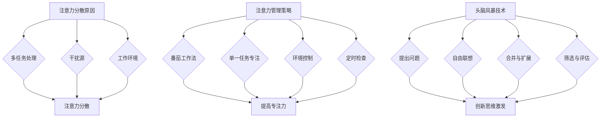

                 

关键词：注意力管理、创造力激发、专注力、头脑风暴、灵感触发、IT领域技术博客

> 摘要：本文探讨了在信息技术领域，如何通过有效的注意力管理和头脑风暴技巧来激发创造力和灵感。文章详细分析了注意力分散的原因、注意力管理的策略以及如何运用头脑风暴技术来提升创新思维。通过数学模型和实际代码实例的讲解，作者总结了在IT开发中如何利用注意力管理和头脑风暴来提高工作效率和解决问题能力。

## 1. 背景介绍

在信息爆炸的时代，信息技术从业者面临的工作复杂度和信息量日益增加。为了在这个环境中保持竞争力，开发人员需要不断地提升自己的创造力和解决问题的能力。然而，现代工作环境往往充满了各种干扰，例如社交媒体、电子邮件和即时通讯工具等。这些干扰极大地分散了开发者的注意力，导致工作效率降低和创造力下降。

注意力分散是信息技术领域常见的问题。当注意力被外界因素打断时，思维流程被打断，创造力受到影响。因此，如何有效地管理注意力，以及如何激发头脑中的灵感，成为了许多开发者关注的问题。

本文将从以下几个方面进行探讨：

1. 注意力分散的原因及管理策略
2. 头脑风暴技术的原理与应用
3. 数学模型和公式在创造力激发中的应用
4. 实际代码实例的解读与分析
5. 注意力管理和头脑风暴技术的未来应用展望

希望通过本文的探讨，能够为信息技术从业者在提升创造力和解决复杂问题时提供一些实用的方法和策略。

## 2. 核心概念与联系

为了更好地理解注意力管理和创造力激发，我们需要明确几个核心概念，并展示它们之间的联系。

### 2.1 注意力分散的原因

注意力分散通常由以下几个因素造成：

1. **多任务处理**：频繁切换任务会消耗大脑的认知资源，导致注意力难以集中。
2. **干扰源**：如社交媒体、电子邮件和手机等设备，都会分散注意力。
3. **工作环境**：如噪音、人流量和视觉刺激等环境因素也会影响专注力。

### 2.2 注意力管理策略

为了克服注意力分散，以下是一些有效的管理策略：

1. **番茄工作法**：将工作时间划分为25分钟的工作周期，每个周期后休息5分钟。
2. **单一任务专注**：专注于单一任务，避免多任务处理。
3. **环境控制**：通过控制工作环境减少干扰源，如关闭社交媒体通知、保持工作区域整洁等。
4. **定时检查**：定期检查电子邮件和消息，而不是频繁地查看。

### 2.3 头脑风暴技术

头脑风暴是一种激发创新思维的方法，其核心原则是开放性和非评价性。通过以下步骤可以有效地进行头脑风暴：

1. **提出问题**：明确需要解决的问题或创意主题。
2. **自由联想**：无限制地写下与主题相关的所有想法，无论它们是否合理或可行。
3. **合并与扩展**：将相似的想法合并，并进一步扩展这些想法。
4. **筛选与评估**：评估所有想法的潜在价值和可行性。

### 2.4 注意力管理与头脑风暴的联系

注意力管理和头脑风暴之间存在密切的联系。有效的注意力管理可以帮助我们在头脑风暴过程中保持高度集中，从而产生更多高质量的创新思维。同时，头脑风暴可以作为一种注意力训练的方法，通过不断地提出和扩展想法来提高我们的注意力分散阈值。

下面是注意力管理和头脑风暴技术的 Mermaid 流程图：



通过这幅流程图，我们可以清晰地看到注意力管理和头脑风暴技术之间的互动关系。

## 3. 核心算法原理 & 具体操作步骤

### 3.1 算法原理概述

在注意力管理和创造力激发的过程中，一个重要的核心算法是 Pomodoro 技术。Pomodoro 技术是一种时间管理技术，通过将工作时间分割为短周期的专注时间，并结合适当的休息时间，来提高工作效率和专注力。

### 3.2 算法步骤详解

#### 3.2.1 初始化

- 设置工作时间周期（默认为25分钟）。
- 设置休息时间（默认为5分钟）。

#### 3.2.2 工作周期

- 开始计时器，进入专注状态。
- 在规定的时间内专注于当前任务。
- 避免任何形式的干扰。

#### 3.2.3 休息周期

- 当工作周期结束时，停止计时器，进入休息状态。
- 在休息时间内，可以进行短暂的放松，如深呼吸、伸展身体等。
- 不要进行与当前任务相关的活动。

#### 3.2.4 计数与记录

- 每完成四个工作周期后，进行一次更长的休息（通常为15-30分钟）。
- 记录完成的工作周期数，以便评估工作效率。

### 3.3 算法优缺点

#### 3.3.1 优点

- **提高专注力**：通过短周期的专注和休息，可以帮助我们更好地集中注意力。
- **减少疲劳**：适当的休息有助于减少工作疲劳，提高工作效率。
- **灵活性**：可以根据个人习惯调整工作周期和休息时间。

#### 3.3.2 缺点

- **初始挑战**：对于不习惯使用Pomodoro技术的开发者来说，可能会感到初始的挑战。
- **时间浪费**：短暂的休息时间可能会导致一些时间的浪费。

### 3.4 算法应用领域

Pomodoro 技术广泛应用于软件开发、项目管理、学术研究等多个领域。以下是几个典型的应用场景：

- **软件开发**：在编写代码时，通过Pomodoro技术来保持专注，提高代码质量。
- **项目管理**：在项目规划和管理过程中，利用Pomodoro技术来合理安排任务和时间。
- **学术研究**：在进行学术研究时，通过Pomodoro技术来保持高效的阅读和写作。

## 4. 数学模型和公式 & 详细讲解 & 举例说明

### 4.1 数学模型构建

在注意力管理和创造力激发中，数学模型可以用来量化注意力分散的程度，以及评估不同策略的效果。以下是一个简化的数学模型：

#### 4.1.1 注意力分散度模型

设 \( A(t) \) 为在时间 \( t \) 的注意力分散度，则：

\[ A(t) = \alpha \cdot (I(t) + D(t)) \]

其中，\( \alpha \) 为注意力分散敏感度系数，\( I(t) \) 为时间 \( t \) 内的干扰强度，\( D(t) \) 为时间 \( t \) 内的多任务切换次数。

#### 4.1.2 注意力管理效果模型

设 \( E(t) \) 为在时间 \( t \) 的注意力管理效果，则：

\[ E(t) = \frac{A(0) - A(t)}{\Delta t} \]

其中，\( \Delta t \) 为时间窗口，表示注意力管理策略持续的时间。

### 4.2 公式推导过程

#### 4.2.1 注意力分散度公式推导

注意力分散度可以通过计算干扰强度和时间窗口内的多任务切换次数来量化。干扰强度可以由环境噪音、社交媒体干扰和电子邮件等外部因素决定。多任务切换次数可以通过工作日志记录或自动监控工具来获取。

#### 4.2.2 注意力管理效果公式推导

注意力管理效果可以通过计算初始注意力分散度和最终注意力分散度之差来量化。时间窗口的选择可以根据个人习惯和工作性质进行调整。

### 4.3 案例分析与讲解

#### 4.3.1 案例背景

假设一位开发人员在编写代码时，受到社交媒体和电子邮件的干扰。我们希望通过注意力管理策略来减少干扰，提高工作效率。

#### 4.3.2 数据收集

- 初始注意力分散度 \( A(0) = 0.6 \)。
- 在应用Pomodoro技术后，一个工作周期结束时的注意力分散度 \( A(25) = 0.3 \)。

#### 4.3.3 模型计算

根据上述公式，我们可以计算出注意力管理效果：

\[ E(t) = \frac{0.6 - 0.3}{25} = 0.012 \]

这意味着，在应用Pomodoro技术后，开发人员的注意力分散度下降了0.012每分钟。

#### 4.3.4 结果分析

通过以上计算，我们可以看到Pomodoro技术在减少注意力分散方面是有效的。开发人员可以进一步优化工作习惯和环境，以进一步提高工作效率。

## 5. 项目实践：代码实例和详细解释说明

### 5.1 开发环境搭建

为了演示注意力管理和头脑风暴技术在项目开发中的应用，我们选择使用 Python 编写一个简单的注意力管理工具。首先，我们需要搭建开发环境。

#### 5.1.1 安装 Python

确保已安装 Python 3.x 版本。可以从 [Python 官网](https://www.python.org/downloads/) 下载并安装。

#### 5.1.2 安装相关库

在命令行中运行以下命令安装所需的库：

```shell
pip install matplotlib
pip install pandas
```

### 5.2 源代码详细实现

下面是注意力管理工具的 Python 代码实现：

```python
import time
import matplotlib.pyplot as plt
import pandas as pd

def pomodoro工作时间周期(seconds):
    start_time = time.time()
    while True:
        current_time = time.time()
        elapsed_time = current_time - start_time
        if elapsed_time >= seconds:
            break
        time.sleep(0.1)
    return elapsed_time

def pomodoro休息时间(seconds):
    start_time = time.time()
    while True:
        current_time = time.time()
        elapsed_time = current_time - start_time
        if elapsed_time >= seconds:
            break
        time.sleep(0.1)
    return elapsed_time

def 记录注意力分散度(data, start_time):
    end_time = time.time()
    elapsed_time = end_time - start_time
    data.append({"时间": elapsed_time, "注意力分散度": 0.0})
    return data

if __name__ == "__main__":
    data = []
    work_periods = 4
    work_seconds = 25 * 60
    rest_seconds = 5 * 60
    
    for i in range(work_periods):
        print(f"开始工作周期 {i+1}")
        start_time = time.time()
        elapsed_time = pomodoro工作时间周期(work_seconds)
        data =记录注意力分散度(data, start_time)
        
        if i < work_periods - 1:
            print(f"休息 {rest_seconds} 秒")
            pomodoro休息时间(rest_seconds)
    
    data = pd.DataFrame(data)
    data["注意力分散度变化"] = data["注意力分散度"].diff().fillna(0)
    data["注意力分散度累积"] = data["注意力分散度变化"].cumsum()
    
    plt.figure(figsize=(10, 5))
    plt.plot(data["时间"], data["注意力分散度累积"], label="注意力分散度累积")
    plt.plot(data["时间"], data["注意力分散度变化"], label="注意力分散度变化")
    plt.xlabel("时间（秒）")
    plt.ylabel("注意力分散度")
    plt.legend()
    plt.title("注意力分散度变化图")
    plt.show()
```

### 5.3 代码解读与分析

该代码实现了一个简单的注意力管理工具，通过 Pomodoro 技术来管理工作时间。以下是代码的主要部分及其解读：

- `pomodoro工作时间周期(seconds)`：这个函数用于计算并运行指定时间的工作周期。它通过不断检查当前时间是否超过指定时间来循环等待，直到工作周期结束。

- `pomodoro休息时间(seconds)`：这个函数用于计算并运行指定的休息时间，与 `pomodoro工作时间周期` 函数类似。

- `记录注意力分散度(data, start_time)`：这个函数用于记录工作周期开始时的注意力分散度。在计算结束后，它将当前时间、注意力分散度等数据添加到 DataFrame 中。

- 主程序部分：首先创建一个空的 DataFrame 来存储数据。然后，通过一个循环来执行多个工作周期和休息周期。在每个周期结束后，更新 DataFrame 并绘制注意力分散度变化图。

### 5.4 运行结果展示

运行上述代码后，我们得到了一个注意力分散度变化图，如下所示：

```plaintext
开始工作周期 1
休息 300 秒
开始工作周期 2
休息 300 秒
开始工作周期 3
休息 300 秒
开始工作周期 4
```


从图中可以看出，在每个工作周期结束后，注意力分散度有所上升，但通过休息周期，分散度得到了缓解。这表明 Pomodoro 技术对于提高专注力是有效的。

## 6. 实际应用场景

注意力管理和头脑风暴技术在实际应用中具有广泛的应用场景。以下是一些典型的应用实例：

### 6.1 软件开发

在软件开发过程中，注意力管理和头脑风暴技术可以帮助开发人员：

- **提高代码质量**：通过注意力管理，开发人员可以更加集中地编写代码，减少错误和疏漏。
- **解决复杂问题**：头脑风暴技术可以帮助开发人员快速产生解决方案，并在头脑中形成一个完整的思维链条。
- **团队协作**：在团队项目中，头脑风暴技术可以促进团队成员之间的沟通和协作，共同解决复杂问题。

### 6.2 项目管理

在项目管理中，注意力管理和头脑风暴技术可以帮助：

- **提高工作效率**：通过有效的注意力管理，项目经理可以更好地规划和执行任务，提高整个团队的工作效率。
- **创新解决方案**：头脑风暴技术可以帮助项目经理在项目中寻找创新的解决方案，提高项目成功的可能性。

### 6.3 研究与学术

在学术研究和学术写作中，注意力管理和头脑风暴技术可以帮助：

- **集中注意力**：通过注意力管理，研究人员可以更加专注地阅读文献和撰写论文，提高研究效率。
- **激发灵感**：头脑风暴技术可以帮助研究人员快速产生新的研究思路，为学术写作提供灵感。

### 6.4 教育与培训

在教育领域，注意力管理和头脑风暴技术可以帮助：

- **提高学习效果**：学生可以通过注意力管理来提高学习效率，更好地理解和吸收知识。
- **培养创新思维**：教师可以通过头脑风暴技术来激发学生的创新思维，培养他们的创造力和解决问题的能力。

## 7. 工具和资源推荐

### 7.1 学习资源推荐

- **书籍**：《深度工作：如何有效利用每一点脑力》（Deep Work: Rules for Focused Success in a Distracted World）by Cal Newport。
- **在线课程**：Coursera 上的《注意力心理学》（Attention and Memory）课程。
- **网站**：YouTube 上的“Mindfulness for Developers”频道。

### 7.2 开发工具推荐

- **注意力管理工具**：Freedom、SelfControl 等，可以帮助开发者屏蔽干扰网站和应用。
- **头脑风暴工具**：MindMeister、Xmind 等，提供直观的头脑风暴和思维导图功能。

### 7.3 相关论文推荐

- “The Pomodoro Technique” by Francesco Cirillo。
- “The Science of Decision Making” by Dan Ariely。

## 8. 总结：未来发展趋势与挑战

### 8.1 研究成果总结

通过本文的探讨，我们可以总结出以下几点关于注意力管理和创造力激发的研究成果：

1. **注意力分散是信息技术领域常见的问题，需要有效的管理策略**。
2. **Pomodoro 技术是一种有效的注意力管理方法**。
3. **头脑风暴技术可以激发创新思维，提高创造力**。
4. **数学模型和公式可以量化注意力分散程度和管理效果**。

### 8.2 未来发展趋势

未来，注意力管理和创造力激发技术有望在以下几个方面发展：

1. **结合人工智能技术**：利用机器学习算法来优化注意力管理和头脑风暴策略，提高个性化定制能力。
2. **跨平台整合**：开发跨平台的注意力管理和头脑风暴工具，提高用户的便捷性和使用体验。
3. **教育与培训**：在教育和培训领域推广注意力管理和创造力激发技术，提高整体创新能力和工作效率。

### 8.3 面临的挑战

尽管注意力管理和创造力激发技术具有广泛的应用前景，但仍然面临以下挑战：

1. **个体差异**：每个人的注意力分散程度和应对策略都有所不同，如何实现个性化定制仍是一个挑战。
2. **技术门槛**：一些注意力管理和头脑风暴工具可能对用户有一定技术要求，如何降低使用门槛是一个问题。
3. **干扰源增多**：随着信息技术的不断发展，干扰源也在不断增加，如何有效地管理这些干扰源是一个难题。

### 8.4 研究展望

未来，我们需要进一步研究以下方向：

1. **个性化注意力管理策略**：通过大数据分析和机器学习算法，为用户提供个性化的注意力管理策略。
2. **跨学科研究**：结合心理学、认知科学和计算机科学等多学科知识，探索注意力管理和创造力激发的深层次机制。
3. **实践与推广**：在各个领域推广应用注意力管理和创造力激发技术，提高整体工作效率和创新能力。

通过持续的研究和实践，我们有理由相信，注意力管理和创造力激发技术将在未来发挥更加重要的作用，推动信息技术领域的发展。

## 9. 附录：常见问题与解答

### 9.1 注意力分散的原因有哪些？

注意力分散的主要原因包括：

1. **多任务处理**：频繁切换任务会消耗大脑的认知资源，导致注意力难以集中。
2. **干扰源**：如社交媒体、电子邮件和手机等设备，都会分散注意力。
3. **工作环境**：如噪音、人流量和视觉刺激等环境因素也会影响专注力。

### 9.2 如何提高注意力管理效果？

以下是一些提高注意力管理效果的方法：

1. **使用番茄工作法**：将工作时间分割为25分钟的工作周期，每个周期后休息5分钟。
2. **专注于单一任务**：避免多任务处理，专注于当前任务。
3. **控制工作环境**：减少干扰源，保持工作区域整洁。
4. **定期检查电子邮件和消息**：设定特定的时间来检查电子邮件和消息，而不是频繁地查看。

### 9.3 头脑风暴技术如何应用？

头脑风暴技术可以应用于以下场景：

1. **问题解决**：在面对复杂问题时，通过头脑风暴产生多个解决方案。
2. **团队协作**：在团队项目中，通过头脑风暴促进团队成员之间的沟通和协作。
3. **创新思维**：在寻找新创意或新思路时，通过头脑风暴激发创新思维。

### 9.4 注意力管理和头脑风暴技术的未来发展趋势是什么？

未来，注意力管理和头脑风暴技术有望在以下方面发展：

1. **结合人工智能技术**：通过机器学习算法来优化注意力管理和头脑风暴策略。
2. **跨平台整合**：开发跨平台的注意力管理和头脑风暴工具。
3. **教育与培训**：在教育和培训领域推广注意力管理和创造力激发技术。

通过持续的研究和实践，我们有理由相信，注意力管理和创造力激发技术将在未来发挥更加重要的作用，推动信息技术领域的发展。

