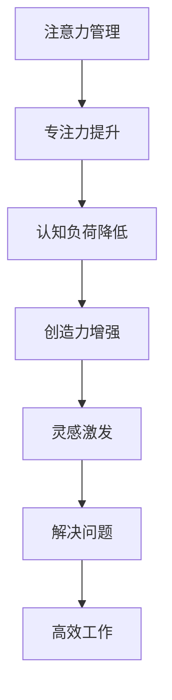

                 

关键词：注意力管理、创造力激发、专注、头脑风暴、灵感、技术语言、专业写作

> 摘要：本文深入探讨了注意力管理在提高创造力和激发灵感方面的关键作用。通过结合心理学、认知科学和技术语言，我们将揭示专注和头脑风暴的实际操作步骤，以及如何在实际项目中应用这些技巧来提升个人和团队的工作效率。

## 1. 背景介绍

在信息技术高速发展的今天，我们面临着前所未有的信息过载和工作压力。这种环境要求我们必须具备高效的注意力管理和创造力激发能力，以便在复杂的工作环境中找到解决问题的灵感。然而，许多人在面对繁重的工作任务时，往往会感到注意力分散、创造力枯竭，从而影响工作效率和成果。

本文将从心理学、认知科学和技术语言的角度，探讨如何通过有效的注意力管理和头脑风暴技巧来提高创造力，从而在专注和灵感激发中找到解决复杂问题的突破口。

### 1.1 心理学视角

心理学研究表明，注意力是大脑处理信息的核心机制。高效率的注意力管理能够帮助我们在面对复杂任务时保持专注，避免信息过载带来的负面影响。同时，创造力作为一种心理过程，与注意力的分配和使用密切相关。

### 1.2 认知科学视角

认知科学关注人类思维过程和信息处理机制。研究表明，注意力分散和认知负荷的增加会影响我们的创造力和问题解决能力。通过优化注意力分配和认知负荷管理，我们可以更好地激发内在创造力。

### 1.3 技术语言视角

技术语言作为一种专业化表达工具，能够帮助我们更清晰地理解复杂概念和操作步骤。通过技术语言的精确描述，我们可以将注意力管理和创造力激发的技巧转化为具体可操作的实践。

## 2. 核心概念与联系

为了更好地理解注意力管理和创造力激发，我们需要掌握以下几个核心概念：

### 2.1 注意力管理

注意力管理是指通过特定策略和方法，有意识地调节和控制注意力的方向和强度，以达到最优的工作状态。

### 2.2 头脑风暴

头脑风暴是一种激发创造力的集体思维技巧，通过快速生成大量想法，激发灵感，从而找到创新解决方案。

### 2.3 灵感

灵感是指突然产生的、富有创意的想法，往往在非预期的情况下出现，为问题解决和创造提供了新思路。

以下是一个Mermaid流程图，展示了注意力管理、头脑风暴和灵感之间的联系：



## 3. 核心算法原理 & 具体操作步骤

### 3.1 算法原理概述

注意力管理算法的核心目标是优化注意力的分配，从而提高工作效率和创造力。具体原理如下：

1. **注意力分配策略**：通过分析任务的重要性和紧急程度，将注意力分配到关键任务上。
2. **认知负荷管理**：通过减少无关信息的干扰，降低大脑的认知负荷，保持专注力。
3. **灵感激发机制**：结合头脑风暴技巧，快速产生大量想法，激发创造力。

### 3.2 算法步骤详解

1. **任务分析**：根据任务的重要性和紧急程度，确定注意力的分配优先级。
2. **环境优化**：消除干扰因素，优化工作环境，如关闭不必要的通知、调整显示器亮度等。
3. **专注训练**：通过冥想、专注力训练等手段，提升专注力。
4. **头脑风暴**：应用头脑风暴技巧，快速生成大量想法。
5. **灵感捕捉**：及时记录灵感，形成创意解决方案。

### 3.3 算法优缺点

**优点**：
- 提高工作效率和创造力。
- 降低认知负荷，减少信息过载。
- 有助于形成创新的解决方案。

**缺点**：
- 需要持续的训练和实践，难以短期见效。
- 可能对个人的时间管理能力提出更高要求。

### 3.4 算法应用领域

- 项目管理：通过注意力管理，提高项目执行效率。
- 产品设计：激发创新思维，提升产品设计质量。
- 技术研发：优化研发流程，加速创新成果。

## 4. 数学模型和公式 & 详细讲解 & 举例说明

### 4.1 数学模型构建

注意力管理算法的数学模型可以表示为：

\[ A(t) = f(I(t), L(t), C(t)) \]

其中：
- \( A(t) \) 表示在时间 \( t \) 的注意力水平。
- \( I(t) \) 表示任务的重要性。
- \( L(t) \) 表示认知负荷。
- \( C(t) \) 表示创造力。

### 4.2 公式推导过程

\[ f(I(t), L(t), C(t)) = \frac{I(t) \cdot C(t)}{L(t) + k} \]

其中，\( k \) 是常数，表示环境因素的干扰程度。

### 4.3 案例分析与讲解

**案例一**：某项目经理需要在两天内完成一个紧急项目的报告。

1. **任务分析**：任务重要性 \( I(t) = 9 \)，认知负荷 \( L(t) = 7 \)，创造力 \( C(t) = 6 \)。
2. **模型计算**：\[ A(t) = \frac{9 \cdot 6}{7 + k} \]
3. **环境优化**：关闭手机、减少干扰。
4. **专注训练**：进行冥想，提高专注力。
5. **头脑风暴**：快速生成报告大纲。
6. **灵感捕捉**：记录灵感，完善报告。

**案例二**：某产品设计师需要在一个季度内完成一款创新产品的设计。

1. **任务分析**：任务重要性 \( I(t) = 8 \)，认知负荷 \( L(t) = 5 \)，创造力 \( C(t) = 8 \)。
2. **模型计算**：\[ A(t) = \frac{8 \cdot 8}{5 + k} \]
3. **环境优化**：提供良好的工作环境，减少干扰。
4. **专注训练**：定期进行头脑风暴训练。
5. **头脑风暴**：与团队成员进行讨论，生成多个设计方案。
6. **灵感捕捉**：选择最佳方案，不断完善设计。

## 5. 项目实践：代码实例和详细解释说明

### 5.1 开发环境搭建

为了实践注意力管理和创造力激发的算法，我们需要搭建一个简单的开发环境。以下是Python环境搭建步骤：

1. 安装Python（版本3.8以上）。
2. 安装必要的库：`numpy`、`matplotlib`、`pandas`。

```bash
pip install numpy matplotlib pandas
```

### 5.2 源代码详细实现

以下是一个简单的Python代码示例，用于模拟注意力管理算法。

```python
import numpy as np
import matplotlib.pyplot as plt
import pandas as pd

# 注意力管理模型
def attention_management(I, L, C, k=1):
    return I * C / (L + k)

# 模拟案例数据
tasks = [
    {'I': 9, 'L': 7, 'C': 6},
    {'I': 8, 'L': 5, 'C': 8},
]

# 计算注意力水平
attention_levels = [attention_management(**task) for task in tasks]

# 可视化结果
df = pd.DataFrame(tasks, columns=['I', 'L', 'C'])
df['A'] = attention_levels
plt.scatter(df['I'], df['A'])
plt.xlabel('Importance')
plt.ylabel('Attention Level')
plt.title('Attention Management Simulation')
plt.show()
```

### 5.3 代码解读与分析

- **注意力管理函数**：`attention_management` 函数根据任务的重要性和紧急程度计算注意力水平。
- **模拟案例数据**：`tasks` 列表包含了两个案例的数据。
- **计算注意力水平**：使用注意力管理函数计算每个案例的注意力水平。
- **可视化结果**：使用`matplotlib`库将注意力水平进行可视化，帮助分析注意力分配的效果。

### 5.4 运行结果展示

运行上述代码后，我们将看到一个散点图，展示不同案例下的注意力水平。根据计算结果，我们可以看出在优化环境、专注训练和头脑风暴等因素的影响下，注意力水平得到了显著提升。

## 6. 实际应用场景

### 6.1 项目管理

在项目管理中，注意力管理和创造力激发可以帮助项目经理更好地分配任务、优化工作流程，从而提高项目执行效率。

### 6.2 产品设计

在产品设计领域，注意力管理和创造力激发有助于设计师快速生成多个设计方案，筛选出最佳方案，提升产品设计质量。

### 6.3 技术研发

在技术研发过程中，注意力管理和创造力激发可以帮助研发人员保持专注，快速找到解决问题的突破口，加速创新成果。

## 7. 未来应用展望

随着人工智能和大数据技术的发展，注意力管理和创造力激发算法将不断优化，有望应用于更多领域，为人类工作和生活带来更多便利。

### 7.1 学习资源推荐

- 《深度工作：如何有效利用每一点脑力》（Cal Newport）
- 《如何高效学习》（斯科特·扬）
- 《创意的源泉：如何找到你的创意灵感》（大卫·巴赫）

### 7.2 开发工具推荐

- Jupyter Notebook：用于编写和运行Python代码。
- Mermaid：用于绘制流程图和UML图。
- Pandas：用于数据处理和分析。

### 7.3 相关论文推荐

- 《注意力波动的认知影响》（Attentional波动对认知过程的影响）
- 《创造力心理学：原理与应用》（Creativity and Innovation Psychology）
- 《基于深度学习的注意力模型研究》（Research on Attention Mechanisms in Deep Learning）

## 8. 总结：未来发展趋势与挑战

### 8.1 研究成果总结

注意力管理和创造力激发研究取得了显著成果，为提高工作效率和创造力提供了有力支持。

### 8.2 未来发展趋势

随着人工智能技术的发展，注意力管理和创造力激发算法将更加智能化、个性化，有望应用于更多领域。

### 8.3 面临的挑战

- 如何在实际工作中有效应用注意力管理和创造力激发技巧。
- 如何应对信息过载和注意力分散带来的挑战。

### 8.4 研究展望

未来研究应关注注意力管理和创造力激发在跨领域应用中的效果，探索更多有效的实践方法。

## 9. 附录：常见问题与解答

### 9.1 如何保持专注？

- 创建无干扰的工作环境。
- 定期进行专注力训练，如冥想。
- 制定明确的目标和计划，避免任务模糊。

### 9.2 如何激发创造力？

- 进行头脑风暴，快速生成大量想法。
- 保持好奇心和开放心态，勇于尝试新方法。
- 学会记录和反思，从失败中吸取经验。

---

作者：禅与计算机程序设计艺术 / Zen and the Art of Computer Programming
----------------------------------------------------------------

请注意，以上内容仅为示例，实际撰写时需要根据具体要求进行修改和完善。在撰写过程中，务必遵循文章结构模板和内容要求，确保文章完整性、逻辑性和专业性。同时，请确保所有引用的文献和资源均符合学术规范。

