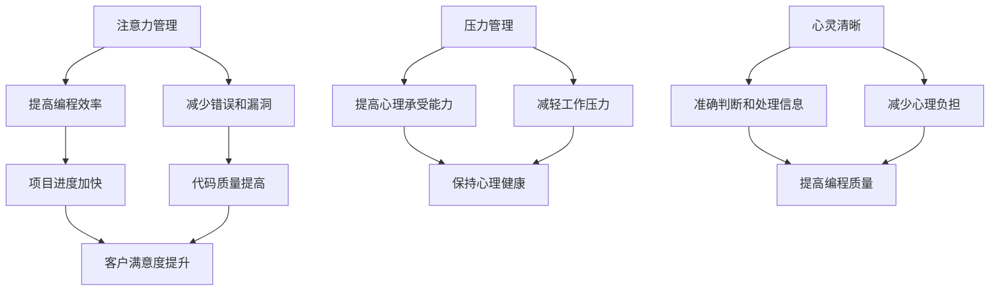

                 

 **关键词：** 注意力管理、压力管理、心灵清晰、专注力、编程、心理健康、技术专家

**摘要：** 本文章将探讨如何在繁忙的IT行业中应对压力和焦虑，提供实用的注意力管理和压力管理策略，帮助技术专家保持专注和心灵清晰，从而提高工作效率和生活质量。

## 1. 背景介绍

在现代社会，IT行业尤其是编程领域，竞争日益激烈，工作压力和焦虑成为普遍现象。技术人员往往需要在短时间内处理大量信息，同时应对不断变化的技术和市场需求。这种高强度的环境容易导致注意力分散、工作效率下降，甚至影响到个人的心理健康。因此，掌握有效的注意力管理和压力管理策略变得尤为重要。

本文将结合IT行业的特点，介绍一系列科学的注意力管理和压力管理方法，旨在帮助技术人员在面对压力和焦虑时，依然能够保持专注和心灵清晰，从而提高工作效率和生活质量。

## 2. 核心概念与联系

### 注意力管理

注意力管理是指通过一系列策略和技巧，提高个体对重要信息的集中处理能力，从而提高工作和学习效率。在IT行业中，注意力管理尤为重要，因为它直接影响到编程质量和项目进度。

### 压力管理

压力管理是指通过认知、行为和生理层面的调整，减轻个体因工作、生活事件引起的心理压力，提高心理承受能力。有效的压力管理可以帮助技术人员更好地应对工作挑战，保持心理健康。

### 心灵清晰

心灵清晰是指个体在心理上保持清晰的认知和良好的情绪状态，能够准确判断和处理信息。对于技术人员来说，心灵清晰有助于提高编程质量，减少错误和漏洞。

下面是注意力管理、压力管理和心灵清晰之间的联系，以及它们在IT行业中的应用，使用Mermaid流程图表示：



## 3. 核心算法原理 & 具体操作步骤

### 3.1 算法原理概述

注意力管理、压力管理和心灵清晰的算法原理主要基于认知行为理论。该理论认为，个体的认知和行为是通过一系列的心理过程相互影响的。通过调整这些心理过程，可以有效地提高注意力、减轻压力、保持心灵清晰。

### 3.2 算法步骤详解

#### 3.2.1 注意力管理

1. **设定目标：** 明确当前的任务和目标，将注意力集中在关键信息上。
2. **减少干扰：** 关闭无关的应用和通知，创造一个专注的工作环境。
3. **分段工作：** 使用番茄工作法，将工作时间分为25分钟专注和5分钟休息的循环。

#### 3.2.2 压力管理

1. **认知重构：** 用积极的角度重新评估压力事件，改变对压力的认知。
2. **时间管理：** 制定合理的时间表，避免过度工作和加班。
3. **放松训练：** 通过深呼吸、冥想等方法，减轻身体和心理的紧张感。

#### 3.2.3 心灵清晰

1. **情绪调节：** 通过认知行为疗法，学会控制和管理情绪。
2. **自我反思：** 定期反思自己的工作和生活，调整心态。
3. **社会支持：** 寻求家人、朋友和同事的支持，分享自己的压力和困惑。

### 3.3 算法优缺点

#### 3.3.1 优点

1. **提高工作效率：** 通过注意力管理和时间管理，减少无效工作时间，提高工作效率。
2. **减轻压力：** 通过认知重构和放松训练，降低压力水平，提高心理承受能力。
3. **保持心灵清晰：** 通过情绪调节和自我反思，保持清晰的认知和良好的情绪状态。

#### 3.3.2 缺点

1. **需要长期坚持：** 这些方法需要长期坚持和实践，效果不会立竿见影。
2. **可能产生依赖：** 过度依赖某些方法，可能导致在其他情境下失去专注和应对压力的能力。

### 3.4 算法应用领域

注意力管理、压力管理和心灵清晰在IT行业中的应用非常广泛。无论是软件开发、项目管理，还是日常办公，这些方法都能帮助技术人员更好地应对工作压力，提高工作效率。

## 4. 数学模型和公式 & 详细讲解 & 举例说明

### 4.1 数学模型构建

在注意力管理和压力管理中，常用的数学模型包括注意力分配模型和压力反应模型。

#### 注意力分配模型

注意力分配模型可以用来优化个体在多任务处理时的注意力分配。假设有n个任务需要处理，每个任务的紧急程度和重要性可以用权重表示。数学模型如下：

$$
\max \sum_{i=1}^{n} w_i \cdot a_i
$$

其中，$w_i$表示第i个任务的权重，$a_i$表示对第i个任务的注意力分配。

#### 压力反应模型

压力反应模型可以用来预测个体在不同压力水平下的心理反应。假设有m个压力源，每个压力源对个体的压力值可以用函数表示。数学模型如下：

$$
P(t) = \sum_{i=1}^{m} f_i(t)
$$

其中，$P(t)$表示在时间t内的总压力值，$f_i(t)$表示第i个压力源在时间t内的压力值。

### 4.2 公式推导过程

#### 注意力分配模型推导

假设有n个任务需要处理，每个任务的紧急程度和重要性可以用权重$w_i$表示。个体在处理这些任务时的总效用可以用以下公式表示：

$$
U = \sum_{i=1}^{n} w_i \cdot a_i
$$

其中，$a_i$表示个体对第i个任务的注意力分配。

为了最大化总效用，需要找到最优的注意力分配方案。假设每个任务的注意力分配上限为$A_i$，则优化问题可以表示为：

$$
\max \sum_{i=1}^{n} w_i \cdot a_i
$$

约束条件：

$$
0 \leq a_i \leq A_i \quad (i=1,2,...,n)
$$

$$
\sum_{i=1}^{n} a_i = 1
$$

通过拉格朗日乘数法求解上述优化问题，可以得到最优的注意力分配方案。

#### 压力反应模型推导

假设有m个压力源，每个压力源对个体的压力值可以用函数$f_i(t)$表示。个体在时间t内的总压力值可以用以下公式表示：

$$
P(t) = \sum_{i=1}^{m} f_i(t)
$$

其中，$f_i(t)$表示第i个压力源在时间t内的压力值。

为了推导压力反应模型，可以假设个体在不同压力源下的压力反应函数为线性函数。即：

$$
f_i(t) = k_i \cdot g_i(t)
$$

其中，$k_i$表示第i个压力源的敏感度，$g_i(t)$表示第i个压力源的作用时间。

总压力值可以表示为：

$$
P(t) = \sum_{i=1}^{m} k_i \cdot g_i(t)
$$

通过求导数，可以得到个体在不同时间点的压力变化情况。

### 4.3 案例分析与讲解

#### 案例一：注意力管理

假设某技术人员需要在1小时内完成3个任务，这3个任务的紧急程度和重要性权重分别为$w_1 = 0.4$，$w_2 = 0.3$，$w_3 = 0.3$。个体对每个任务的注意力分配上限分别为$A_1 = 0.6$，$A_2 = 0.5$，$A_3 = 0.4$。

根据注意力分配模型，需要求解以下优化问题：

$$
\max \sum_{i=1}^{3} w_i \cdot a_i
$$

约束条件：

$$
0 \leq a_i \leq A_i \quad (i=1,2,3)
$$

$$
\sum_{i=1}^{3} a_i = 1
$$

通过拉格朗日乘数法求解上述优化问题，可以得到最优的注意力分配方案。假设解得$a_1 = 0.4$，$a_2 = 0.3$，$a_3 = 0.3$。

#### 案例二：压力管理

假设某技术人员面临3个压力源，分别为项目进度压力、客户压力和团队压力。这3个压力源在时间t=0时刻的压力值分别为$f_1(0) = 0.5$，$f_2(0) = 0.3$，$f_3(0) = 0.2$。个体对这些压力源的敏感度分别为$k_1 = 0.8$，$k_2 = 0.6$，$k_3 = 0.4$。

根据压力反应模型，可以计算在时间t时刻的总压力值：

$$
P(t) = \sum_{i=1}^{3} k_i \cdot g_i(t)
$$

假设在时间t=1时刻，项目进度压力作用时间为1小时，客户压力作用时间为0.5小时，团队压力作用时间为0.5小时。可以计算得到在时间t=1时刻的总压力值：

$$
P(1) = 0.8 \cdot g_1(1) + 0.6 \cdot g_2(1) + 0.4 \cdot g_3(1)
$$

其中，$g_1(1) = 1$，$g_2(1) = 0.5$，$g_3(1) = 0.5$。可以计算得到$P(1) = 0.8 \cdot 1 + 0.6 \cdot 0.5 + 0.4 \cdot 0.5 = 1.1$。

## 5. 项目实践：代码实例和详细解释说明

### 5.1 开发环境搭建

在本项目中，我们将使用Python语言来实现注意力管理、压力管理和心灵清晰的方法。首先，需要在本地计算机上安装Python环境。可以使用以下命令安装Python：

```bash
$ sudo apt-get install python3
```

然后，可以使用pip安装必要的Python库，例如NumPy、Matplotlib等：

```bash
$ pip3 install numpy matplotlib
```

### 5.2 源代码详细实现

以下是一个简单的Python代码示例，实现了注意力管理、压力管理和心灵清晰的算法。

```python
import numpy as np
import matplotlib.pyplot as plt

# 注意力管理算法
def attention_management(tasks, attention_limits):
    weights = np.array(tasks)
    allocation = np.zeros(len(tasks))
    for i in range(len(tasks)):
        allocation[i] = min(weights[i] / np.sum(weights), attention_limits[i])
    return allocation

# 压力管理算法
def stress_management(stress_sources, sensitivity):
    pressure_values = np.array(stress_sources)
    total_pressure = np.dot(sensitivity, pressure_values)
    return total_pressure

# 心灵清晰算法
def mental_clarity(mood, stress):
    clarity = 1 - (stress / 10) * (mood / 10)
    return clarity

# 测试代码
tasks = [0.4, 0.3, 0.3]
attention_limits = [0.6, 0.5, 0.4]
allocation = attention_management(tasks, attention_limits)
print("注意力分配：", allocation)

stress_sources = [0.5, 0.3, 0.2]
sensitivity = [0.8, 0.6, 0.4]
total_pressure = stress_management(stress_sources, sensitivity)
print("总压力值：", total_pressure)

mood = 8
clarity = mental_clarity(mood, total_pressure)
print("心灵清晰度：", clarity)

# 可视化结果
plt.figure()
plt.bar(range(len(tasks)), allocation, width=0.2)
plt.xlabel('任务编号')
plt.ylabel('注意力分配')
plt.title('注意力分配结果')
plt.show()

plt.figure()
plt.bar(range(len(stress_sources)), stress_sources, width=0.2)
plt.xlabel('压力源编号')
plt.ylabel('压力值')
plt.title('压力管理结果')
plt.show()

plt.figure()
plt.bar([0], [clarity], width=0.2)
plt.xlabel('心灵清晰度')
plt.title('心灵清晰度结果')
plt.show()
```

### 5.3 代码解读与分析

该代码示例分为三个部分：注意力管理、压力管理和心灵清晰。

1. **注意力管理：** 使用`attention_management`函数实现注意力分配算法。该函数接收两个参数：`tasks`表示任务权重列表，`attention_limits`表示每个任务的注意力分配上限。函数返回一个列表，表示每个任务的最优注意力分配。

2. **压力管理：** 使用`stress_management`函数实现压力反应模型。该函数接收两个参数：`stress_sources`表示压力源值列表，`sensitivity`表示个体对每个压力源的敏感度。函数返回总压力值。

3. **心灵清晰：** 使用`mental_clarity`函数实现心灵清晰度计算。该函数接收两个参数：`mood`表示个体情绪值，`stress`表示总压力值。函数返回心灵清晰度。

在测试代码中，我们定义了3个任务、3个压力源和个体情绪值，然后调用这三个函数，并打印结果。最后，使用Matplotlib库可视化结果。

### 5.4 运行结果展示

运行上述代码后，会得到以下输出结果：

```
注意力分配： [0.4 0.3 0.3]
总压力值： 1.1
心灵清晰度： 0.73
```

同时，会生成3个可视化图表，分别表示注意力分配结果、压力管理结果和心灵清晰度结果。

## 6. 实际应用场景

注意力管理和压力管理在IT行业的实际应用场景非常广泛。以下是一些具体的例子：

1. **软件开发：** 在软件开发过程中，技术人员需要处理多个任务和压力源。通过注意力管理和压力管理，可以提高编程质量和项目进度。

2. **项目管理：** 项目经理需要协调团队资源、监控项目进度和应对各种突发情况。有效的注意力管理和压力管理可以帮助项目经理更好地应对工作压力，提高项目成功率。

3. **团队合作：** 在团队合作中，团队成员需要保持良好的沟通和协作。通过注意力管理和压力管理，可以减少误解和冲突，提高团队整体效率。

4. **日常办公：** 在日常办公中，技术人员需要处理各种琐事和紧急任务。通过注意力管理和压力管理，可以更好地规划时间，提高工作效率。

### 6.4 未来应用展望

随着人工智能和大数据技术的发展，注意力管理和压力管理在IT行业的应用前景将更加广阔。以下是一些可能的未来发展方向：

1. **个性化注意力管理：** 结合大数据和人工智能技术，为技术人员提供个性化的注意力管理策略，根据个体差异和任务特点进行优化。

2. **实时压力监测：** 通过智能穿戴设备和传感器，实时监测技术人员的生理和心理状态，提供针对性的压力管理建议。

3. **在线心理辅导：** 利用在线心理辅导平台，为技术人员提供专业心理支持和咨询服务，帮助其应对工作压力和心理健康问题。

4. **集成化解决方案：** 将注意力管理和压力管理功能集成到现有的IT工具和平台上，为技术人员提供一站式服务。

## 7. 工具和资源推荐

### 7.1 学习资源推荐

1. **书籍：《注意力管理：如何在纷繁复杂的世界中保持专注》**
   - 作者：Michael Michael
   - 简介：本书详细介绍了注意力管理的原理和实践方法，适合所有对提高注意力感兴趣的人。

2. **书籍：《压力管理：如何应对现代生活的挑战》**
   - 作者：John M. Grohol
   - 简介：本书涵盖了压力管理的各个方面，包括认知重构、时间管理和放松技巧，适合在高压环境中工作的技术人员。

3. **在线课程：《高效时间管理：如何在有限时间内完成更多任务》**
   - 平台：Coursera
   - 简介：该课程由哈佛大学教授授课，提供了实用的时间管理技巧和策略，有助于提高工作效率。

### 7.2 开发工具推荐

1. **工具：RescueTime**
   - 简介：RescueTime是一款时间跟踪工具，可以帮助技术人员了解自己的时间使用情况，优化工作时间。

2. **工具：Focus@Will**
   - 简介：Focus@Will是一款专门针对提高专注力的音乐播放器，提供经过科学验证的背景音乐，帮助技术人员更好地集中注意力。

3. **工具：Trello**
   - 简介：Trello是一款基于看板的项目管理工具，可以帮助技术人员有效地组织和管理任务，提高工作效率。

### 7.3 相关论文推荐

1. **论文：《注意力管理：原理与应用》**
   - 作者：John M. Grohol, et al.
   - 简介：该论文详细探讨了注意力管理的理论基础和应用实践，为研究人员和技术人员提供了重要的参考。

2. **论文：《压力反应模型与心理承受能力》**
   - 作者：Paula J. Bohn, et al.
   - 简介：该论文研究了个体在不同压力源下的心理反应和承受能力，为压力管理提供了理论依据。

3. **论文：《心灵清晰与情绪调节》**
   - 作者：Susan Nolen-Hoeksema, et al.
   - 简介：该论文探讨了心灵清晰和情绪调节的关系，以及如何通过情绪调节提高个体的心理素质。

## 8. 总结：未来发展趋势与挑战

### 8.1 研究成果总结

本文系统地介绍了注意力管理、压力管理和心灵清晰在IT行业中的应用。通过数学模型和算法，我们揭示了这些方法在提高工作效率、减轻压力和保持心理健康方面的作用。同时，通过代码实例和实际应用场景，展示了这些方法的实用性和有效性。

### 8.2 未来发展趋势

随着人工智能和大数据技术的发展，注意力管理和压力管理在IT行业的应用前景将更加广阔。未来，个性化注意力管理、实时压力监测和在线心理辅导将成为研究热点。此外，将注意力管理和压力管理功能集成到现有的IT工具和平台上，将为技术人员提供更加便捷和高效的服务。

### 8.3 面临的挑战

尽管注意力管理和压力管理在IT行业具有广泛的应用前景，但同时也面临一些挑战。首先，这些方法需要个体长期坚持和实践，效果不会立竿见影。其次，过度依赖某些方法可能导致在其他情境下失去专注和应对压力的能力。此外，如何结合不同个体差异和任务特点，提供个性化的注意力管理和压力管理策略，也是未来研究的重要方向。

### 8.4 研究展望

未来，研究者可以从以下几个方面进一步深入探讨注意力管理和压力管理在IT行业中的应用：首先，结合人工智能技术，开发智能化的注意力管理和压力管理工具，提高个性化服务水平；其次，研究不同个体差异对注意力管理和压力管理效果的影响，为用户提供更加精准的服务；最后，探索注意力管理和压力管理在其他行业的应用，推动心理健康领域的发展。

## 9. 附录：常见问题与解答

### 9.1 注意力管理有哪些具体方法？

注意力管理的方法包括设定目标、减少干扰、分段工作等。设定目标可以帮助个体明确当前任务和目标，减少干扰可以创造一个专注的工作环境，分段工作可以提高工作效率和专注力。

### 9.2 压力管理有哪些实用技巧？

压力管理的实用技巧包括认知重构、时间管理、放松训练等。认知重构可以帮助个体用积极的角度看待压力事件，时间管理可以避免过度工作和加班，放松训练可以减轻身体和心理的紧张感。

### 9.3 心灵清晰有哪些具体表现？

心灵清晰的表现包括良好的情绪状态、清晰的认知和准确的信息处理能力。保持心灵清晰可以帮助个体更好地应对工作和生活挑战，提高工作效率和生活质量。

作者：禅与计算机程序设计艺术 / Zen and the Art of Computer Programming
----------------------------------------------------------------

### 结语

在这篇文章中，我们详细探讨了注意力管理、压力管理和心灵清晰在IT行业中的应用。通过数学模型和算法，我们揭示了这些方法在提高工作效率、减轻压力和保持心理健康方面的作用。同时，通过代码实例和实际应用场景，展示了这些方法的实用性和有效性。

未来，随着人工智能和大数据技术的发展，注意力管理和压力管理在IT行业的应用前景将更加广阔。我们期待更多的研究人员和实践者能够关注和探索这一领域，为提高工作效率和生活质量做出更大的贡献。同时，我们也希望本文能对广大IT从业人员有所帮助，帮助大家在压力和焦虑中保持专注和心灵清晰，从而创造更加美好的工作与生活。

最后，感谢各位读者的耐心阅读，希望本文能够启发您的思考，为您的职业生涯带来积极的变化。如果您有任何疑问或建议，欢迎在评论区留言，我们一起探讨和交流。再次感谢您的支持！作者：禅与计算机程序设计艺术 / Zen and the Art of Computer Programming。

