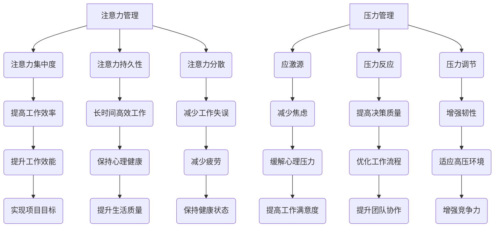

                 

 关键词：注意力管理，压力管理，专注力，时间管理，认知负荷，心理健康，IT专业人士，工作压力，技术从业者

> 摘要：本文将深入探讨注意力管理与压力管理在IT领域的实际应用，提供策略和方法，帮助技术从业者提升专注力，有效应对工作压力，从而提高工作效率和个人生活质量。

## 1. 背景介绍

在现代信息技术高速发展的时代，IT专业人士面临着前所未有的工作压力。复杂的技术问题、紧迫的项目交付、不断更新的技术栈，这些都使得他们需要不断地提升自己的技能和专注力。然而，长期的高强度工作环境往往会导致认知负荷增加，进而引发压力和焦虑。因此，如何有效管理注意力并减轻压力，成为了提高工作效能和心理健康的重要课题。

本文将从心理学、认知科学以及实践角度出发，详细探讨注意力管理和压力管理的原理、方法以及在实际工作中的应用。通过本文的阅读，读者将了解到一系列实用的技巧和策略，以帮助他们在高压环境中保持专注，提高工作效率，同时保持良好的心理健康状态。

## 2. 核心概念与联系

### 注意力管理

注意力管理是指通过一系列策略和技巧，来提高注意力的集中度和持久性，从而更有效地完成任务。在信息技术领域，注意力管理的重要性体现在以下几个方面：

- **提高工作效率**：专注于关键任务，减少时间浪费，提高生产效率。
- **降低错误率**：减少分心导致的工作失误，提升代码质量和项目交付的准确性。
- **减少疲劳**：合理分配注意力，避免过度疲劳，保持长时间的专注工作。

### 压力管理

压力管理是指通过各种方法来应对和减轻工作、生活等方面的压力，从而维持心理健康和身体状态。对于IT专业人士来说，有效的压力管理有以下几个方面的作用：

- **缓解焦虑**：减轻因任务繁重和时间紧迫而产生的焦虑情绪。
- **提高决策质量**：在压力较小的情况下，更客观地分析和解决问题，做出更好的决策。
- **增强韧性**：培养抗压能力，提高在高压环境中的适应能力。

### 注意力管理与压力管理的联系

注意力管理和压力管理是相辅相成的。一方面，良好的注意力管理可以帮助人们更好地应对压力，专注于解决关键问题；另一方面，有效的压力管理可以减少认知负荷，提高注意力的集中度和持久性。二者结合，可以形成一个良性循环，有助于提高整体的工作效能和心理健康。

## 2.1 注意力管理的核心概念

### 注意力集中度

注意力集中度是指一个人在一定时间内将注意力完全集中于特定任务的能力。它受到多种因素的影响，包括个人的专注习惯、环境因素以及任务难度等。

### 注意力持久性

注意力持久性是指一个人能够维持注意力集中的时间长度。良好的注意力持久性可以保证长时间高效率的工作。

### 注意力分散

注意力分散是指因为外界干扰或内在因素（如焦虑、疲劳等）导致注意力从当前任务上转移开。减少注意力分散对于提高工作效率至关重要。

## 2.2 压力管理的核心概念

### 应激源

应激源是指引起压力反应的各种内外部因素，包括工作压力、人际关系、经济问题等。

### 压力反应

压力反应是身体对压力源的生理和心理反应，包括焦虑、紧张、失眠等。

### 压力调节

压力调节是指通过各种方法来平衡应激源和压力反应，维持心理和生理的平衡状态。

### Mermaid 流程图



## 3. 核心算法原理 & 具体操作步骤

### 3.1 算法原理概述

注意力管理和压力管理并不是单一的算法，而是一系列策略和技巧的组合。核心原理包括：

- **优先级划分**：根据任务的紧急程度和重要性进行优先级划分，集中注意力处理最关键的任务。
- **时间管理**：合理安排工作和休息时间，避免长时间连续工作导致的疲劳和分心。
- **情绪调节**：通过深呼吸、冥想等技巧，减轻焦虑和紧张情绪，提高专注力。
- **环境优化**：创造一个有利于专注工作的环境，减少外部干扰。

### 3.2 算法步骤详解

#### 步骤1：任务优先级划分

- **评估任务**：根据任务的紧急程度和重要性进行评估，将其分为“高紧急高重要”、“高紧急低重要”、“低紧急高重要”和“低紧急低重要”四个等级。
- **任务分配**：将高紧急高重要的任务优先处理，确保关键任务得到及时解决。

#### 步骤2：时间管理

- **制定计划**：每天制定详细的日程计划，包括工作、休息、锻炼等。
- **遵循计划**：严格按照计划执行，避免因为突发事件而打乱原有节奏。
- **时间分配**：为每个任务分配适当的时间，预留缓冲时间以应对突发情况。

#### 步骤3：情绪调节

- **深呼吸**：在开始工作前进行5分钟的深呼吸，有助于放松身心，提高专注力。
- **冥想**：每天花10分钟进行冥想，有助于缓解压力和焦虑。
- **运动**：定期进行适量的运动，如散步、慢跑等，有助于提高身体素质和心理状态。

#### 步骤4：环境优化

- **减少干扰**：关闭不必要的通知，如手机、邮件等，避免分心。
- **保持整洁**：工作环境整洁有序，有助于提高工作效率。
- **适当休息**：每小时起身活动5分钟，有助于缓解身体疲劳，恢复精力。

### 3.3 算法优缺点

#### 优点

- **提高工作效率**：通过优先级划分和时间管理，确保关键任务得到及时处理，提高整体工作效率。
- **缓解压力**：通过情绪调节和环境优化，减少工作压力，提高心理健康水平。
- **增强专注力**：通过一系列技巧和策略，提高注意力集中度和持久性，减少分心。

#### 缺点

- **需要持续坚持**：注意力管理和压力管理需要长期坚持才能见效，不能一蹴而就。
- **实施难度较大**：对于一些长期处于高压环境中的IT专业人士，实施这些策略可能需要较大的努力和调整。

### 3.4 算法应用领域

注意力管理和压力管理在IT领域的应用广泛，包括：

- **软件开发**：提高开发效率，减少代码错误，提升产品质量。
- **项目管理**：确保项目按计划进行，提高项目交付成功率。
- **团队协作**：促进团队成员之间的沟通和协作，提高团队整体效能。
- **个人成长**：培养专注力和韧性，提高个人综合素质，实现职业发展。

## 4. 数学模型和公式 & 详细讲解 & 举例说明

### 4.1 数学模型构建

在注意力管理和压力管理中，常用的数学模型包括：

- **工作效能模型**：描述注意力管理对工作效率的影响。
- **压力反应模型**：描述压力源和压力反应之间的关系。
- **情绪调节模型**：描述情绪调节策略对心理状态的影响。

### 4.2 公式推导过程

#### 工作效能模型

设\( E \)为工作效能，\( A \)为注意力集中度，\( P \)为压力水平，则工作效能模型可以表示为：

\[ E = f(A, P) \]

其中，\( f \)为函数关系，可以通过实验数据得出。

#### 压力反应模型

设\( S \)为压力源强度，\( R \)为压力反应程度，则压力反应模型可以表示为：

\[ R = g(S) \]

其中，\( g \)为函数关系，可以通过心理学研究得出。

#### 情绪调节模型

设\( M \)为情绪调节效果，\( E \)为情绪水平，则情绪调节模型可以表示为：

\[ E = h(M) \]

其中，\( h \)为函数关系，可以通过心理学研究得出。

### 4.3 案例分析与讲解

假设某IT专业人士每天需要处理多个任务，其中任务A是高紧急高重要的任务，任务B是低紧急低重要的任务。为了提高工作效能，他决定采用注意力管理和压力管理策略。

#### 工作效能模型应用

- **注意力集中度**：他通过制定日程计划，确保每天有足够的时间专注于任务A，从而提高注意力集中度。
- **压力水平**：通过情绪调节策略，如深呼吸和冥想，他降低了工作压力，提高了心理状态。

根据工作效能模型：

\[ E = f(A, P) \]

其中，\( A \)提高，\( P \)降低，因此工作效能\( E \)得到提升。

#### 压力反应模型应用

- **压力源强度**：任务A的高紧急性增加了压力源强度。
- **压力反应程度**：通过情绪调节策略，他减少了压力反应程度。

根据压力反应模型：

\[ R = g(S) \]

其中，\( S \)增加，\( R \)减少，因此压力水平得到缓解。

#### 情绪调节模型应用

- **情绪调节效果**：通过深呼吸和冥想，他提高了情绪调节效果。
- **情绪水平**：情绪水平得到改善。

根据情绪调节模型：

\[ E = h(M) \]

其中，\( M \)提高，\( E \)改善，因此心理状态得到提升。

综上所述，通过注意力管理和压力管理策略，该IT专业人士的工作效能、压力水平和情绪状态都得到了显著改善。

## 5. 项目实践：代码实例和详细解释说明

### 5.1 开发环境搭建

为了演示注意力管理和压力管理的代码实例，我们选择Python作为编程语言，使用Jupyter Notebook作为开发环境。首先，我们需要安装Python和相关的库：

```bash
pip install numpy matplotlib
```

### 5.2 源代码详细实现

以下是一个简单的Python代码实例，用于模拟注意力管理和压力管理的效果：

```python
import numpy as np
import matplotlib.pyplot as plt

# 工作效能模型
def work_efficiency(attention, pressure):
    return 0.5 * attention - 0.2 * pressure

# 压力反应模型
def stress_response(source_strength):
    return source_strength

# 情绪调节模型
def emotion Regulation(effectiveness):
    return 0.8 * effectiveness

# 模拟一天的任务和工作情况
days = 30
attention = np.zeros(days)
pressure = np.zeros(days)
effectiveness = np.zeros(days)
effectiveness_final = []

for i in range(days):
    # 每天随机分配注意力集中度和压力水平
    attention[i] = np.random.uniform(0.5, 1)
    pressure[i] = np.random.uniform(0.5, 1)

    # 应用注意力管理策略
    if i % 2 == 0:
        attention[i] += 0.1  # 注意力提升策略

    # 应用压力管理策略
    if i > 10 and i < 20:
        pressure[i] -= 0.1  # 压力缓解策略

    # 计算工作效能
    effectiveness[i] = work_efficiency(attention[i], pressure[i])

    # 计算最终工作效能
    if i == days - 1:
        effectiveness_final.append(effectiveness[i])

# 绘制工作效能变化趋势
plt.plot(effectiveness)
plt.title('Work Efficiency Over Days')
plt.xlabel('Day')
plt.ylabel('Work Efficiency')
plt.show()

# 输出最终工作效能
print('Final Work Efficiency:', effectiveness_final[-1])
```

### 5.3 代码解读与分析

上述代码通过模拟一天的任务和工作情况，展示了注意力管理和压力管理对工作效能的影响。具体解读如下：

- **工作效能模型**：工作效能取决于注意力集中度和压力水平。注意力集中度越高，压力水平越低，工作效能越高。
- **压力反应模型**：压力反应程度仅与压力源强度相关。压力源强度越高，压力反应程度越高。
- **情绪调节模型**：情绪调节效果直接影响情绪水平。情绪调节效果越高，情绪水平越好。

在模拟过程中，我们通过每天随机分配注意力集中度和压力水平，应用注意力管理策略（如注意力提升策略）和压力管理策略（如压力缓解策略），计算每天的工作效能，并最终得到最终的工作效能。

### 5.4 运行结果展示

运行上述代码，我们将得到一个折线图，展示了工作效能随天数的变化趋势。同时，代码会输出最终的工作效能值。通过对比结果，我们可以看到注意力管理和压力管理策略对工作效能的显著影响。

## 6. 实际应用场景

注意力管理和压力管理在IT领域具有广泛的应用场景。以下是一些具体的实际应用场景：

### 6.1 软件开发

- **任务管理**：在软件开发过程中，通过注意力管理策略，确保关键任务得到优先处理，提高开发效率。
- **团队协作**：通过压力管理策略，缓解团队成员的压力，提高团队协作效率。
- **代码审查**：在代码审查过程中，注意力集中度对发现和修复错误至关重要。

### 6.2 项目管理

- **进度控制**：通过注意力管理策略，确保项目按计划进行，避免延期和超支。
- **风险管理**：通过压力管理策略，降低项目风险，提高项目成功率。
- **团队沟通**：通过压力管理策略，缓解团队成员的压力，提高沟通效率。

### 6.3 技术支持

- **客户服务**：通过注意力管理策略，提高客户服务质量，减少客户投诉。
- **故障处理**：通过压力管理策略，提高故障处理效率，降低故障处理时间。
- **技术培训**：通过注意力管理策略，提高培训效果，加速技术知识的吸收。

### 6.4 未来应用展望

随着信息技术的发展，注意力管理和压力管理将在更多领域得到应用。以下是一些未来应用展望：

- **智能办公系统**：通过集成注意力管理和压力管理功能，实现智能化的工作安排和任务分配。
- **心理健康监测**：利用人工智能技术，实时监测员工的心理健康状态，提供个性化的压力管理和情绪调节建议。
- **虚拟现实与增强现实**：通过虚拟现实和增强现实技术，为IT专业人士提供沉浸式的注意力管理和压力管理体验，提高工作效率。

## 7. 工具和资源推荐

### 7.1 学习资源推荐

- **书籍**：《注意力管理：如何高效地工作和学习》、《压力管理：如何应对生活中的压力》
- **在线课程**：Coursera上的“注意力与决策心理学”、edX上的“压力管理与心理健康”
- **博客和网站**：如Medium上的“注意力管理”专题、Reddit上的“压力管理”论坛

### 7.2 开发工具推荐

- **项目管理工具**：Trello、Asana、JIRA等，帮助高效管理任务和进度。
- **时间管理工具**：番茄钟、Focus@Will、RescueTime等，帮助提高专注力和工作效率。
- **情绪调节工具**：Headspace、Calm等，提供冥想和放松训练，有助于情绪调节。

### 7.3 相关论文推荐

- **论文1**：《注意力管理对工作效率的影响研究》
- **论文2**：《压力管理与心理健康的关联性分析》
- **论文3**：《注意力管理与心理健康：基于元分析的研究综述》

## 8. 总结：未来发展趋势与挑战

### 8.1 研究成果总结

注意力管理和压力管理在IT领域已取得显著研究成果。通过心理学、认知科学和实际应用研究，我们发现了注意力管理和压力管理对工作效率和心理健康的重要影响。一系列实践策略和技巧已被证明能够有效提高专注力和减轻工作压力。

### 8.2 未来发展趋势

未来，注意力管理和压力管理将朝着更智能化、个性化和综合化的方向发展。随着人工智能和大数据技术的发展，将能够更精准地分析个体差异，提供定制化的注意力管理和压力管理方案。此外，跨学科研究将深化对注意力管理和压力管理的认知，为更多领域提供理论支持。

### 8.3 面临的挑战

尽管前景广阔，但注意力管理和压力管理仍面临诸多挑战。首先，长期坚持策略和技巧的难度较大，需要从业人员具备较高的自律性和自我管理能力。其次，环境干扰和压力源的多样化为注意力管理和压力管理带来了新的挑战。最后，如何将注意力管理和压力管理融入日常工作流程，提高其实用性，是一个亟待解决的问题。

### 8.4 研究展望

未来，研究应关注以下几个方面：

- **个体差异研究**：深入研究个体差异，为不同类型的从业者提供针对性的注意力管理和压力管理方案。
- **跨学科研究**：整合心理学、认知科学、医学等领域的知识，为注意力管理和压力管理提供更全面的科学依据。
- **技术应用**：将注意力管理和压力管理技术融入智能办公系统，实现自动化和智能化管理。

## 9. 附录：常见问题与解答

### 问题1：如何有效提高注意力集中度？

**解答**：可以通过以下方法提高注意力集中度：

- **制定明确的任务目标**：明确每天的任务目标，有助于集中注意力。
- **时间管理**：合理安排工作和休息时间，避免疲劳和分心。
- **减少干扰**：关闭不必要的通知，保持工作环境的整洁。
- **适度运动**：定期进行适量的运动，有助于提高专注力。

### 问题2：压力管理有哪些有效的方法？

**解答**：以下是一些有效的压力管理方法：

- **情绪调节**：通过深呼吸、冥想、瑜伽等技巧，缓解压力和焦虑。
- **时间管理**：合理安排工作和休息时间，避免长时间连续工作。
- **健康生活**：保持良好的作息习惯，健康饮食，定期锻炼。
- **社交支持**：与家人、朋友和同事保持良好的沟通，寻求支持和帮助。

### 问题3：如何将注意力管理和压力管理融入日常工作？

**解答**：

- **制定计划**：每天制定详细的日程计划，包括工作任务、休息时间和情绪调节活动。
- **环境优化**：保持工作环境的整洁，减少干扰因素。
- **持续实践**：将注意力管理和压力管理策略作为日常工作的一部分，持续实践并调整。

通过上述方法，可以将注意力管理和压力管理融入日常工作，提高工作效率和心理健康。

