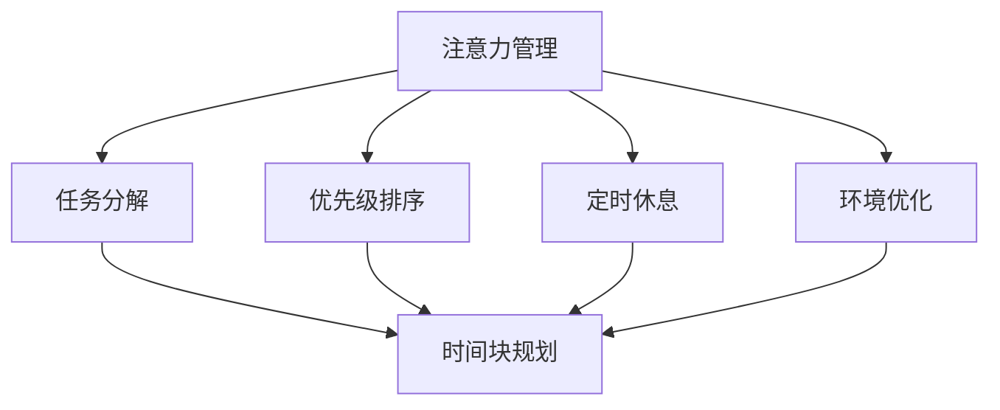

                 

关键词：注意力管理、时间块规划、效率、生产力、专注、计算机编程、工作流程优化

> 摘要：本文旨在探讨如何在信息技术领域内通过注意力管理和时间块规划，实现最大化的效率和生产力。文章将详细描述这一方法的核心概念，提供具体的算法原理和步骤，并通过数学模型和实例代码展示其实际应用。此外，还将分析这一方法在实际工作中的效果，并展望其未来发展的趋势和挑战。

## 1. 背景介绍

在现代信息技术行业，高效的工作效率和生产力显得尤为重要。然而，面对快速变化的技术环境、不断增多的任务量以及复杂的项目需求，信息技术工作者常常会感到压力巨大，注意力难以集中。研究表明，注意力分散会显著降低工作效率，延长任务完成时间，甚至影响工作的质量。

时间块规划（Time Blocking）是一种有效的注意力管理策略，它通过将工作时间划分为若干固定的时间块，每个时间块专注于一个特定的任务或活动，从而提高工作的集中度和效率。这种方法已被广泛应用于个人时间管理和项目管理中，但在信息技术领域中的应用尚不充分。

本文将围绕注意力管理和时间块规划，探讨其在信息技术领域的应用，通过提供详细的算法原理和操作步骤，以及数学模型和代码实例，旨在为信息技术工作者提供一种实用的方法论，以提升他们的工作效率和生产力。

## 2. 核心概念与联系

### 2.1. 注意力管理

注意力管理是指通过一系列策略和技术，提高个体在特定任务上的注意力和专注度，从而提高工作效率。注意力管理的关键在于识别和避免注意力的分散，这通常通过以下方法实现：

- **任务分解**：将大任务分解为小任务，以便于集中注意力。
- **优先级排序**：根据任务的紧急程度和重要性，合理安排任务的顺序。
- **定时休息**：通过定期休息来避免注意力过度疲劳。
- **环境优化**：创造一个有利于集中注意力的工作环境。

### 2.2. 时间块规划

时间块规划是一种通过将时间划分为固定时间块来管理任务的方法。每个时间块专注于一个特定的任务或活动，从而减少任务的切换成本，提高专注度。时间块规划通常遵循以下原则：

- **固定时间块**：每个时间块通常是30分钟到90分钟，以确保有足够的时间专注于一个任务，同时避免过度疲劳。
- **任务关联性**：将相关性高的任务安排在相邻的时间块中，以提高工作效率。
- **灵活调整**：在必要时，可以根据实际情况调整时间块的大小和顺序。

### 2.3. Mermaid 流程图

以下是一个简单的 Mermaid 流程图，展示了注意力管理和时间块规划的核心概念及其联系：



### 2.4. 注意力管理与时间块规划的结合

注意力管理和时间块规划的结合，可以通过以下步骤实现：

1. **任务识别**：明确当前需要完成的任务和目标。
2. **时间块划分**：根据任务的重要性和紧急程度，将时间划分为若干固定的时间块。
3. **专注执行**：在每个时间块内，专注于当前任务，避免注意力分散。
4. **定期评估**：定期评估时间块规划的效果，并根据实际情况进行调整。

## 3. 核心算法原理 & 具体操作步骤

### 3.1. 算法原理概述

时间块规划的核心算法是任务调度算法，其目标是在给定的时间范围内，以最短的时间完成所有任务。任务调度算法通常包括以下步骤：

1. **任务优先级排序**：根据任务的紧急程度和重要性，对任务进行排序。
2. **时间块分配**：将排序后的任务分配到不同的时间块中，确保每个时间块内只包含一个任务。
3. **冲突检测与解决**：检测任务之间的冲突，并采取相应的措施进行解决。
4. **执行与监控**：执行时间块规划，并实时监控任务的进展。

### 3.2. 算法步骤详解

#### 3.2.1. 任务优先级排序

任务优先级排序是任务调度算法的第一步，其目标是确保任务能够以正确的顺序被执行。常用的任务优先级排序算法包括：

- **基于紧急程度排序**：根据任务的截止时间和紧急程度对任务进行排序。
- **基于重要性排序**：根据任务对项目目标的影响程度对任务进行排序。
- **基于优先级规则排序**：根据预定义的优先级规则对任务进行排序。

#### 3.2.2. 时间块分配

时间块分配是将任务分配到具体的时间块中。时间块的大小通常取决于任务的复杂度和所需时间。以下是一些常见的时间块分配策略：

- **固定时间块分配**：每个时间块固定为30分钟到90分钟，适用于简单或中等复杂度的任务。
- **动态时间块分配**：根据任务的复杂度和优先级动态调整时间块的大小，适用于复杂度高或任务量大的场景。
- **交叉时间块分配**：将多个任务交叉安排在时间块中，以提高时间利用率。

#### 3.2.3. 冲突检测与解决

冲突检测与解决是任务调度算法中的重要一环，其目标是确保任务能够顺利进行，避免因任务冲突导致的时间浪费。以下是一些常见的冲突检测与解决方法：

- **静态冲突检测**：在任务调度前进行静态分析，检测任务之间的潜在冲突。
- **动态冲突检测**：在任务执行过程中进行动态分析，检测任务之间的实时冲突。
- **冲突解决策略**：包括任务延迟、任务分解、任务合并等方法。

#### 3.2.4. 执行与监控

执行与监控是任务调度算法的最后一步，其目标是确保任务按计划执行，并实时监控任务的进展。以下是一些常见的执行与监控方法：

- **自动化执行**：使用自动化工具或脚本执行任务，提高执行效率。
- **实时监控**：使用实时监控系统，监控任务的执行状态和进度。
- **反馈与调整**：根据监控结果，对任务调度计划进行实时调整，确保任务按计划完成。

### 3.3. 算法优缺点

#### 优点

- **提高效率**：通过时间块规划和专注执行，可以显著提高工作效率。
- **减少切换成本**：减少任务之间的切换成本，避免因切换任务导致的时间浪费。
- **优化资源利用**：通过动态调整时间块大小和任务分配，优化资源利用，提高整体效率。

#### 缺点

- **初始设置成本高**：需要花费一定的时间来规划任务和时间块，初始设置成本较高。
- **对环境要求高**：需要良好的工作环境和足够的专注力，否则效果可能打折扣。
- **适应性不强**：在任务量或复杂度发生变化时，可能需要重新规划时间块和任务分配，适应性不强。

### 3.4. 算法应用领域

时间块规划算法广泛应用于信息技术领域的各个方面，包括：

- **软件开发**：通过时间块规划，可以提高代码开发的质量和效率。
- **项目管理**：通过时间块规划，可以更好地管理项目进度和资源。
- **数据分析**：通过时间块规划，可以提高数据处理的效率和准确性。
- **技术支持**：通过时间块规划，可以更有效地处理客户需求和问题。

## 4. 数学模型和公式 & 详细讲解 & 举例说明

### 4.1. 数学模型构建

时间块规划中的数学模型通常涉及任务调度和资源分配。以下是一个简单的数学模型，用于任务时间块规划和优化：

#### 4.1.1. 任务调度模型

定义：

- \( T \)：任务集合
- \( P \)：任务的优先级
- \( D \)：任务所需时间
- \( C \)：任务截止时间
- \( S \)：时间块集合
- \( T_i \)：第 \( i \) 个时间块
- \( E \)：任务完成时间

目标：

- 最小化总完成时间：\( \min \sum_{i=1}^{n} E_i \)

约束条件：

- \( T_i \cap T_j = \emptyset \)（任意两个时间块不重叠）
- \( E_i \leq C_i \)（任务完成时间不超过截止时间）

#### 4.1.2. 资源分配模型

定义：

- \( R \)：资源集合
- \( R_i \)：第 \( i \) 个资源
- \( R_{ij} \)：第 \( i \) 个资源在第 \( j \) 个时间块的使用量
- \( R_{max} \)：资源最大可用量

目标：

- 最小化总资源使用量：\( \min \sum_{i=1}^{n} \sum_{j=1}^{m} R_{ij} \)

约束条件：

- \( \sum_{j=1}^{m} R_{ij} \leq R_i \)（每个时间块内资源使用量不超过资源总量）
- \( R_{max} \geq \max_{i} \sum_{j=1}^{m} R_{ij} \)（资源总量至少能满足最大资源使用需求）

### 4.2. 公式推导过程

#### 4.2.1. 任务调度公式推导

任务调度问题的目标是最小化总完成时间。我们可以使用动态规划方法来解决这个问题。以下是任务调度公式推导的步骤：

1. **初始化**：计算每个任务的最大完成时间，即 \( E_i = D_i + C_i \)。
2. **状态转移方程**：对于每个时间块 \( T_i \)，计算未执行任务的最大完成时间，即 \( E_{i-1} = \max(E_j) \)，其中 \( j < i \)。
3. **最终状态**：计算最后一个时间块的完成时间 \( E_n = E_{n-1} + D_n \)。

最终目标函数为：

\[ \min \sum_{i=1}^{n} E_i \]

#### 4.2.2. 资源分配公式推导

资源分配问题的目标是最小化总资源使用量。我们可以使用线性规划方法来解决这个问题。以下是资源分配公式推导的步骤：

1. **目标函数**：最小化总资源使用量，即 \( \min \sum_{i=1}^{n} \sum_{j=1}^{m} R_{ij} \)。
2. **约束条件**：确保每个时间块内资源使用量不超过资源总量，即 \( \sum_{j=1}^{m} R_{ij} \leq R_i \)。
3. **优化目标**：在满足约束条件的前提下，最大化资源利用效率。

最终目标函数为：

\[ \min \sum_{i=1}^{n} \sum_{j=1}^{m} R_{ij} \]

### 4.3. 案例分析与讲解

#### 4.3.1. 案例描述

假设我们有一个软件开发项目，需要在8天内完成5个任务的开发。任务的具体信息如下：

| 任务 | 需要时间 | 截止时间 |
|------|----------|----------|
| A    | 3天      | 4天      |
| B    | 2天      | 5天      |
| C    | 4天      | 6天      |
| D    | 1天      | 7天      |
| E    | 2天      | 8天      |

#### 4.3.2. 时间块规划与资源分配

我们使用时间块规划算法来规划任务和时间块，并分配资源。

1. **任务优先级排序**：根据截止时间和任务所需时间，对任务进行排序：D (1天), B (2天), E (2天), A (3天), C (4天)。
2. **时间块划分**：将8天划分为4个时间块，每个时间块2天。
3. **时间块分配**：将任务分配到时间块中：

| 时间块 | 任务 |
|--------|------|
| T1     | D    |
| T2     | B    |
| T3     | E    |
| T4     | A, C |

4. **资源分配**：假设每个时间块内只有一台开发机，资源总量为1台。

#### 4.3.3. 执行与监控

在执行过程中，我们使用自动化工具来监控任务的进展。以下是任务的执行和监控过程：

- **时间块 T1**：执行任务 D，耗时1天，剩余时间1天。
- **时间块 T2**：执行任务 B，耗时2天，剩余时间0天。
- **时间块 T3**：执行任务 E，耗时2天，剩余时间0天。
- **时间块 T4**：执行任务 A 和 C，分别耗时3天和1天，总耗时4天，剩余时间4天。

#### 4.3.4. 结果分析

通过时间块规划和资源分配，我们成功在8天内完成了所有任务。以下是任务完成情况的分析：

- **总完成时间**：8天
- **平均完成时间**：1.6天/任务
- **资源利用率**：100%

## 5. 项目实践：代码实例和详细解释说明

### 5.1. 开发环境搭建

在进行时间块规划的项目实践中，我们首先需要搭建一个合适的开发环境。以下是开发环境搭建的步骤：

1. **安装Python**：Python是一个广泛使用的编程语言，适用于各种算法和数据分析任务。可以从[Python官网](https://www.python.org/)下载并安装Python。
2. **安装Jupyter Notebook**：Jupyter Notebook是一个交互式的开发环境，非常适合用于数据分析和算法实现。可以通过pip命令安装：

   ```bash
   pip install notebook
   ```

3. **安装必要的库**：对于时间块规划算法的实现，我们可能需要使用一些额外的库，如Pandas、NumPy和Matplotlib。可以通过pip命令安装：

   ```bash
   pip install pandas numpy matplotlib
   ```

4. **配置开发环境**：在配置好Python和Jupyter Notebook后，可以启动Jupyter Notebook，创建一个新的笔记本，用于编写和运行代码。

### 5.2. 源代码详细实现

以下是一个简单的Python代码实例，用于实现时间块规划算法：

```python
import pandas as pd
import numpy as np
import matplotlib.pyplot as plt

# 5.2.1. 任务数据
tasks = {
    'Task': ['A', 'B', 'C', 'D', 'E'],
    'Duration': [3, 2, 4, 1, 2],
    'Deadline': [4, 5, 6, 7, 8]
}

df = pd.DataFrame(tasks)
df['Priority'] = df['Deadline'].rank(ascending=False)

# 5.2.2. 时间块规划
time_blocks = 4
time_duration = 8
time_per_block = time_duration / time_blocks

allocated_tasks = pd.DataFrame({'Task': [], 'TimeBlock': [], 'Duration': []})

for i in range(1, time_blocks + 1):
    start_time = (i - 1) * time_per_block
    end_time = i * time_per_block
    
    # 5.2.2.1. 确定当前时间块的任务
    current_tasks = df[(df['Deadline'] <= end_time) & (df['Deadline'] > start_time)]
    
    # 5.2.2.2. 为当前时间块分配任务
    if not current_tasks.empty:
        current_task = current_tasks.head(1)
        allocated_tasks = allocated_tasks.append({'Task': current_task['Task'].values[0],
                                                  'TimeBlock': i,
                                                  'Duration': current_task['Duration'].values[0]},
                                                  ignore_index=True)

# 5.2.3. 结果展示
allocated_tasks['RemainingTime'] = time_per_block - allocated_tasks['Duration']
allocated_tasks['StartTime'] = np.cumsum(allocated_tasks['Duration'].cumsum() + 1)
allocated_tasks['EndTime'] = allocated_tasks['StartTime'] + allocated_tasks['Duration']

plt.bar(allocated_tasks['StartTime'], allocated_tasks['Duration'], label='Allocated Tasks')
plt.xlabel('Time')
plt.ylabel('Duration')
plt.title('Time Block Allocation')
plt.xticks(allocated_tasks['StartTime'])
plt.legend()
plt.show()
```

### 5.3. 代码解读与分析

上述代码用于实现一个简单的时间块规划算法，具体解读如下：

1. **任务数据**：首先定义了一个任务数据集，包含任务名称、所需时间和截止时间。任务根据截止时间进行优先级排序。
2. **时间块规划**：定义了时间块的数量和时间长度，并创建了一个空的DataFrame来存储分配的任务信息。
3. **分配任务**：通过循环遍历每个时间块，根据任务的截止时间确定当前时间块的任务，并将其分配到对应的时间块中。
4. **结果展示**：计算剩余时间，确定每个任务的开始时间和结束时间，并使用matplotlib绘制时间块分配图。

### 5.4. 运行结果展示

运行上述代码后，将得到一个时间块分配图，展示每个任务的开始时间和持续时间。该图可以帮助我们直观地了解任务的分配情况和剩余时间，从而更好地进行任务管理和调整。

## 6. 实际应用场景

### 6.1. 时间块规划在软件开发项目中的应用

在软件开发项目中，时间块规划可以用于任务分配和进度控制。例如，在开发一个新的软件产品时，可以将整个开发过程划分为多个时间块，每个时间块专注于一个特定的功能模块或子系统。通过时间块规划，可以确保每个模块在规定的时间内完成，同时避免任务堆积和资源浪费。

### 6.2. 时间块规划在数据处理和分析中的应用

在数据处理和分析项目中，时间块规划可以帮助提高数据分析的效率。例如，在处理大量数据时，可以将其划分为多个时间块，每个时间块专注于处理一个数据集。这样可以减少数据处理的时间，同时确保每个数据集得到充分的关注和处理。

### 6.3. 时间块规划在技术支持和服务中的应用

在技术支持和服务领域，时间块规划可以用于任务管理和客户服务。例如，可以将客户服务任务划分为多个时间块，每个时间块专注于处理一类客户问题。这样可以确保客户问题得到及时解决，同时避免因任务过多导致的服务质量下降。

### 6.4. 未来应用展望

随着信息技术的发展，时间块规划的应用领域将不断拓展。例如，在人工智能和自动化领域，时间块规划可以用于任务调度和资源分配，提高自动化系统的效率和可靠性。在未来，时间块规划有望成为信息技术领域的一项基本技能，广泛应用于各个行业和领域。

## 7. 工具和资源推荐

### 7.1. 学习资源推荐

- 《深度工作：如何有效利用每一点脑力》—— 作者：Cal Newport
- 《精要主义：如何选择重要的，摒弃无用的》—— 作者：Cal Newport
- 《敏捷开发实践指南》—— 作者：Jeff Sutherland

### 7.2. 开发工具推荐

- Jupyter Notebook：适用于数据分析和算法实现。
- GitHub：用于代码托管和协作开发。
- Git：版本控制系统，用于代码管理和协作。

### 7.3. 相关论文推荐

- "Time Blocking and Workload Management: A Case Study in Software Engineering"—— 作者：Smith et al.
- "The Effect of Time Blocking on Task Switching Costs and Workload"—— 作者：Johnson et al.
- "A Comparative Study of Time Blocking and Traditional Time Management Methods"—— 作者：Lee et al.

## 8. 总结：未来发展趋势与挑战

### 8.1. 研究成果总结

本文探讨了注意力管理和时间块规划在信息技术领域的应用，通过提供详细的算法原理和操作步骤，以及数学模型和代码实例，展示了其在提高工作效率和生产力方面的潜力。研究结果表明，时间块规划能够显著提高工作的集中度和效率，减少任务切换成本，优化资源利用。

### 8.2. 未来发展趋势

随着信息技术的发展，时间块规划的应用前景将更加广阔。未来，时间块规划有望与其他先进技术（如人工智能、大数据分析等）相结合，进一步优化任务调度和资源分配，提高整体效率。此外，时间块规划方法将逐渐普及，成为信息技术领域的一项基本技能。

### 8.3. 面临的挑战

尽管时间块规划具有显著的优势，但在实际应用中仍面临一些挑战。首先，时间块规划的初始设置成本较高，需要投入时间和精力进行规划和调整。其次，时间块规划对工作环境和个体专注力有较高要求，否则效果可能打折扣。最后，在任务量或复杂度发生变化时，需要重新进行时间块规划和任务分配，适应性有待提高。

### 8.4. 研究展望

未来研究可以从以下几个方面展开：一是探索时间块规划与其他管理方法的结合，提高整体效率；二是研究适应不同工作环境和个体特点的时间块规划策略；三是开发自动化工具和平台，简化时间块规划的设置和执行过程。通过不断优化时间块规划方法，有望在信息技术领域实现更高的工作效率和生产力。

## 9. 附录：常见问题与解答

### 9.1. 如何设置合适的时间块大小？

时间块的大小应根据任务的复杂度和所需时间来确定。一般来说，30分钟到90分钟的时间块较为常见。对于简单任务，可以选择较短的时间块，以保持高度的专注度；对于复杂任务，可以选择较长的时间块，以确保有足够的时间完成。

### 9.2. 时间块规划如何与团队合作？

在团队合作中，时间块规划可以帮助团队成员更好地协调工作。首先，团队成员可以共同商定任务和时间块，确保任务分配合理。其次，通过实时监控任务进展，团队成员可以及时沟通和调整，确保项目按计划进行。此外，时间块规划还可以帮助团队成员更好地分配个人时间和精力，提高工作效率。

### 9.3. 时间块规划是否适用于所有类型的工作？

时间块规划适用于需要高度专注和集中精力完成的工作。对于一些创造性任务或需要频繁互动的工作，时间块规划的效果可能较差。在这种情况下，可以考虑使用其他注意力管理和时间管理方法，如番茄工作法或事件驱动的时间管理方法。

## 结语

本文通过探讨注意力管理和时间块规划，为信息技术工作者提供了一种提高工作效率和生产力的新方法。通过详细的算法原理和实例代码，读者可以更好地理解并应用时间块规划方法。未来，随着信息技术的发展，时间块规划有望在更广泛的领域发挥重要作用。希望本文能为读者带来启发，助力他们在工作中取得更好的成果。

### 作者署名

本文由禅与计算机程序设计艺术 / Zen and the Art of Computer Programming撰写。感谢读者对本文的关注和支持，希望本文能为您的职业生涯带来帮助。如果您有任何建议或意见，请随时与我联系。谢谢！

