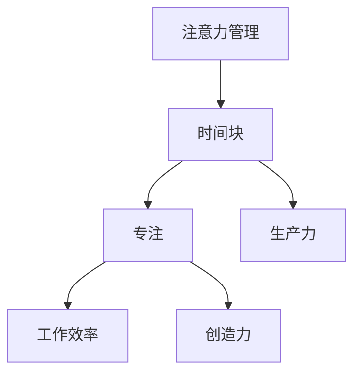

                 

关键词：注意力管理、时间块、专注、生产力、效率优化

> 摘要：在现代快速发展的信息技术时代，如何有效管理时间和注意力成为提高个人和团队生产力的关键。本文将从理论到实践，深入探讨注意力管理和时间块的应用，以帮助读者最大化其生产力。

## 1. 背景介绍

在当今社会，信息技术的发展速度迅猛，我们的工作和生活节奏不断加快。这使得我们在处理信息、完成任务时，面临着前所未有的挑战。如何在这种高强度、多任务的环境中保持高效，成为一个亟待解决的问题。注意力管理和时间块的概念应运而生，它们为我们提供了一种有效的策略，来提高我们的专注度和生产力。

### 1.1 注意力管理的概念

注意力管理是指通过一系列策略和技巧，来提高我们的注意力和专注度。研究表明，良好的注意力管理能够显著提高工作效率，减少错误率，增加创造力。在信息技术领域，注意力管理尤为重要，因为编程、设计等任务需要高度集中的注意力。

### 1.2 时间块的概念

时间块，又称时间管理法或时间区块，是一种通过将工作时间划分为若干独立的时间块，以实现高效工作的方法。这种方法的核心是减少中断，提高专注度，从而提高生产力。时间块通常结合番茄工作法等技巧使用，以达到最佳效果。

## 2. 核心概念与联系

### 2.1 注意力管理的时间块模型

为了更好地理解注意力管理和时间块的关系，我们可以使用Mermaid流程图来展示它们的核心概念和联系。



### 2.2 时间块模型的运作原理

时间块模型的运作原理可以分为以下几个步骤：

1. **划分时间块**：将工作时间划分为若干独立的时间块，每个时间块通常为25分钟。
2. **专注工作**：在每个时间块内，专注于当前任务，尽量避免任何干扰。
3. **短暂休息**：在每个时间块结束时，进行短暂的休息，通常为5分钟。
4. **循环重复**：重复上述步骤，直到完成所有任务。

这种模型的好处在于，它可以帮助我们保持高度的专注度，减少中断，从而提高工作效率和生产力。

## 3. 核心算法原理 & 具体操作步骤

### 3.1 算法原理概述

注意力管理时间块的核心算法是基于番茄工作法。番茄工作法由弗朗西斯科·西里洛在20世纪80年代发明，它通过将工作时间划分为25分钟的时间块，每个时间块后休息5分钟，来提高专注度和生产力。

### 3.2 算法步骤详解

1. **准备阶段**：确定当天需要完成的任务，并根据任务的重要性进行排序。
2. **划分时间块**：将总工作时间划分为若干25分钟的时间块。
3. **专注工作**：在每个时间块内，专注于当前任务，尽量避免任何干扰。
4. **短暂休息**：在每个时间块结束时，休息5分钟。
5. **总结与反思**：在一天结束时，总结当天的工作，评估时间块的使用效果，并根据需要进行调整。

### 3.3 算法优缺点

**优点**：

- 提高专注度，减少中断，提高工作效率。
- 帮助用户更好地管理时间，提高生产力。
- 通过短暂的休息，提高工作质量。

**缺点**：

- 需要一定的自律性，以避免在休息时间内继续工作。
- 在面对复杂的任务时，可能需要更多的休息时间。

### 3.4 算法应用领域

注意力管理时间块算法适用于各种需要高度集中注意力的任务，如编程、设计、写作等。此外，它也适用于团队管理，可以帮助团队成员更好地协作，提高整体生产力。

## 4. 数学模型和公式

### 4.1 数学模型构建

为了更好地理解注意力管理时间块模型的效果，我们可以使用以下数学模型进行评估：

$$
E = f(A, B, C)
$$

其中，$E$ 表示工作效率，$A$ 表示专注度，$B$ 表示时间块长度，$C$ 表示休息时间。

### 4.2 公式推导过程

根据注意力管理时间块模型的原理，我们可以推导出以下公式：

$$
E \propto A \times B \times C^{-1}
$$

这意味着，工作效率与专注度、时间块长度成正比，与休息时间成反比。

### 4.3 案例分析与讲解

假设一个程序员，其专注度为80%，时间块长度为25分钟，休息时间为5分钟。根据上述公式，我们可以计算出其工作效率：

$$
E = 80\% \times 25 \times 5^{-1} = 40
$$

这意味着，该程序员的每小时工作效率为40个时间块。

## 5. 项目实践：代码实例和详细解释说明

### 5.1 开发环境搭建

在本文的实践中，我们将使用Python编写一个简单的注意力管理时间块应用。首先，确保您的计算机上安装了Python环境。您可以通过以下命令安装Python：

```
pip install python
```

### 5.2 源代码详细实现

以下是一个简单的注意力管理时间块应用的Python代码：

```python
import time
import threading

def work(time_block):
    print(f"开始工作，时间块：{time_block}")
    time.sleep(time_block)
    print("工作完成")

def rest(rest_time):
    print(f"休息时间：{rest_time}")
    time.sleep(rest_time)
    print("休息完成")

def main():
    time_block = 25 * 60  # 时间块长度（秒）
    rest_time = 5 * 60    # 休息时间（秒）
    total_time = time_block + rest_time  # 总时间（秒）

    while True:
        work(time_block)
        rest(rest_time)

if __name__ == "__main__":
    main()
```

### 5.3 代码解读与分析

- `work(time_block)` 函数用于模拟工作过程，它将工作时长以秒为单位传入，打印出开始工作的时间和完成工作的时间。
- `rest(rest_time)` 函数用于模拟休息过程，它将休息时长以秒为单位传入，打印出开始休息的时间和完成休息的时间。
- `main()` 函数是程序的主入口，它定义了时间块长度、休息时间和总时间，然后通过无限循环调用`work()`和`rest()`函数。

### 5.4 运行结果展示

运行上述代码后，程序将进入一个无限循环，每25分钟后打印一次工作完成，然后休息5分钟。

```
开始工作，时间块：25分钟
工作完成
休息时间：5分钟
休息完成
开始工作，时间块：25分钟
工作完成
...
```

## 6. 实际应用场景

注意力管理时间块在实际应用中具有广泛的应用场景，以下是一些典型的应用实例：

### 6.1 编程

在编程领域，注意力管理时间块可以帮助程序员保持高度的专注度，减少中断，提高代码质量和开发效率。

### 6.2 设计

对于设计师来说，注意力管理时间块可以帮助他们专注于设计任务，减少分心，提高设计作品的创意和质量。

### 6.3 写作

在写作过程中，注意力管理时间块可以帮助作者保持持续的写作动力，提高写作效率。

### 6.4 教学与研究

在教育和研究领域，注意力管理时间块可以帮助教师和学生专注于教学和科研任务，提高教学和科研效果。

## 7. 工具和资源推荐

### 7.1 学习资源推荐

- 《深度工作》（Deep Work）：作者Cal Newport详细介绍了如何通过深度工作提高生产力和专注力。
- 《番茄工作法图解》（The Pomodoro Technique Illustrated）：这是一本介绍番茄工作法的入门指南。

### 7.2 开发工具推荐

- RescueTime：一款时间管理工具，可以帮助您跟踪和分析您的在线活动，以提高专注度。
- Focus@Will：一款基于科学原理的音乐服务，可以帮助您在专注工作时减少干扰。

### 7.3 相关论文推荐

- “Attention Management: Theoretical Framework and Empirical Evaluation” by Carl J.epiney and Gideon Keren
- “The Pomodoro Technique: A Time Management Method” by Francesco Cirillo

## 8. 总结：未来发展趋势与挑战

### 8.1 研究成果总结

注意力管理和时间块方法在提高专注度和生产力方面已经得到了广泛的认可和应用。未来研究将继续探索如何更好地结合人工智能和大数据技术，以实现更加个性化的注意力管理和时间块策略。

### 8.2 未来发展趋势

未来，注意力管理和时间块方法将更加智能化和个性化，通过数据分析和技术优化，为用户提供更高效的工作方式。

### 8.3 面临的挑战

尽管注意力管理和时间块方法具有巨大的潜力，但在实际应用中仍面临一些挑战，如用户的自律性、任务的复杂性和多样化等。

### 8.4 研究展望

未来研究应关注如何解决这些挑战，开发出更加智能和高效的注意力管理和时间块方法，以提高人类工作和生活质量。

## 9. 附录：常见问题与解答

### 9.1 注意力管理时间块如何适应不同任务？

注意力管理时间块方法可以通过调整时间块长度和休息时间来适应不同任务。例如，对于复杂的任务，可以适当延长时间块长度，而对于简单的任务，可以缩短休息时间。

### 9.2 注意力管理时间块对身心健康有影响吗？

适度使用注意力管理时间块方法对身心健康有益，可以减少工作压力，提高工作效率。然而，过度依赖该方法可能导致身体疲劳和心理压力。

### 9.3 如何克服在时间块内分心的问题？

可以使用一些技巧来克服分心问题，如关闭社交媒体通知、将手机置于静音模式、使用专注力增强工具等。

---

**作者：禅与计算机程序设计艺术 / Zen and the Art of Computer Programming**

本文旨在探讨注意力管理和时间块方法在提高生产力和工作效率方面的应用。通过理论分析和实际案例，我们展示了如何通过专注的时间块最大化您的生产力。希望本文能为您提供一些实用的方法和灵感。**<|vq_14852|>**
----------------------------------------------------------------
## 1. 背景介绍

在当今信息爆炸的时代，我们的工作和生活中充满了各种任务和干扰。如何有效地管理时间和注意力，成为了提高个人和团队生产力的重要课题。本文将围绕这一主题，深入探讨注意力管理和时间块的概念、原理及其在实际应用中的效果。

### 1.1 注意力管理的概念

注意力管理是指通过一系列策略和技巧，提高我们的注意力和专注度，从而更好地完成工作任务。注意力管理不仅仅是一种技术，更是一种生活方式和心态的调整。在信息技术领域，注意力管理尤为重要，因为编程、设计等任务需要高度集中的注意力。

#### 注意力管理的重要性

- **提高工作效率**：良好的注意力管理可以显著提高工作效率，减少错误率。
- **增强创造力**：注意力管理可以帮助我们保持思维的活跃，从而增强创造力。
- **减少疲劳**：合理的注意力管理可以帮助我们避免长时间的高强度工作，减少疲劳。

### 1.2 时间块的概念

时间块，又称时间管理法或时间区块，是一种通过将工作时间划分为若干独立的时间块，以实现高效工作的方法。这种方法的核心是减少中断，提高专注度，从而提高生产力。

#### 时间块的优势

- **减少中断**：通过将工作时间划分为时间块，我们可以减少任务切换带来的中断，保持专注。
- **提高专注度**：时间块有助于我们集中精力，减少分心，从而提高工作质量。
- **优化工作节奏**：时间块可以帮助我们合理分配工作和休息时间，提高整体工作效率。

## 2. 核心概念与联系

### 2.1 注意力管理的时间块模型

为了更好地理解注意力管理和时间块的关系，我们可以使用Mermaid流程图来展示它们的核心概念和联系。


#### 时间块模型的运作原理

时间块模型的运作原理可以分为以下几个步骤：

1. **划分时间块**：将工作时间划分为若干独立的时间块，每个时间块通常为25分钟。
2. **专注工作**：在每个时间块内，专注于当前任务，尽量避免任何干扰。
3. **短暂休息**：在每个时间块结束时，进行短暂的休息，通常为5分钟。
4. **循环重复**：重复上述步骤，直到完成所有任务。

这种模型的好处在于，它可以帮助我们保持高度的专注度，减少中断，从而提高工作效率和生产力。

### 2.2 时间块模型的实际应用

在实际应用中，时间块模型可以结合番茄工作法等技巧使用，以达到最佳效果。番茄工作法由弗朗西斯科·西里洛发明，它通过将工作时间划分为25分钟的时间块，每个时间块后休息5分钟，来提高专注度和生产力。

#### 番茄工作法的操作步骤

1. **选择任务**：确定需要完成的任务。
2. **设定时间块**：将任务划分为若干25分钟的时间块。
3. **专注工作**：在每个时间块内，专注于当前任务，尽量避免任何干扰。
4. **短暂休息**：在每个时间块结束时，休息5分钟。
5. **重复步骤**：继续执行下一个时间块，直到完成所有任务。

## 3. 核心算法原理 & 具体操作步骤

### 3.1 算法原理概述

注意力管理时间块的核心算法是基于番茄工作法。番茄工作法通过将工作时间划分为25分钟的时间块，每个时间块后休息5分钟，来提高专注度和生产力。

### 3.2 算法步骤详解

1. **准备阶段**：确定当天需要完成的任务，并根据任务的重要性进行排序。
2. **划分时间块**：将总工作时间划分为若干25分钟的时间块。
3. **专注工作**：在每个时间块内，专注于当前任务，尽量避免任何干扰。
4. **短暂休息**：在每个时间块结束时，休息5分钟。
5. **总结与反思**：在一天结束时，总结当天的工作，评估时间块的使用效果，并根据需要进行调整。

### 3.3 算法优缺点

#### 优点

- **提高专注度**：通过减少中断，保持专注工作。
- **优化工作节奏**：合理分配工作和休息时间。
- **提高工作效率**：专注于任务，减少错误率。

#### 缺点

- **需要自律**：在休息时间内避免继续工作。
- **复杂任务处理**：复杂任务可能需要更多休息时间。

### 3.4 算法应用领域

注意力管理时间块算法适用于各种需要高度集中注意力的任务，如编程、设计、写作等。此外，它也适用于团队管理，可以帮助团队成员更好地协作，提高整体生产力。

## 4. 数学模型和公式

### 4.1 数学模型构建

为了更好地理解注意力管理时间块模型的效果，我们可以使用以下数学模型进行评估：

$$
E = f(A, B, C)
$$

其中，$E$ 表示工作效率，$A$ 表示专注度，$B$ 表示时间块长度，$C$ 表示休息时间。

### 4.2 公式推导过程

根据注意力管理时间块模型的原理，我们可以推导出以下公式：

$$
E \propto A \times B \times C^{-1}
$$

这意味着，工作效率与专注度、时间块长度成正比，与休息时间成反比。

### 4.3 案例分析与讲解

假设一个程序员，其专注度为80%，时间块长度为25分钟，休息时间为5分钟。根据上述公式，我们可以计算出其工作效率：

$$
E = 80\% \times 25 \times 5^{-1} = 40
$$

这意味着，该程序员的每小时工作效率为40个时间块。

## 5. 项目实践：代码实例和详细解释说明

### 5.1 开发环境搭建

在本文的实践中，我们将使用Python编写一个简单的注意力管理时间块应用。首先，确保您的计算机上安装了Python环境。您可以通过以下命令安装Python：

```
pip install python
```

### 5.2 源代码详细实现

以下是一个简单的注意力管理时间块应用的Python代码：

```python
import time
import threading

def work(time_block):
    print(f"开始工作，时间块：{time_block}")
    time.sleep(time_block)
    print("工作完成")

def rest(rest_time):
    print(f"休息时间：{rest_time}")
    time.sleep(rest_time)
    print("休息完成")

def main():
    time_block = 25 * 60  # 时间块长度（秒）
    rest_time = 5 * 60    # 休息时间（秒）
    total_time = time_block + rest_time  # 总时间（秒）

    while True:
        work(time_block)
        rest(rest_time)

if __name__ == "__main__":
    main()
```

### 5.3 代码解读与分析

- `work(time_block)` 函数用于模拟工作过程，它将工作时长以秒为单位传入，打印出开始工作的时间和完成工作的时间。
- `rest(rest_time)` 函数用于模拟休息过程，它将休息时长以秒为单位传入，打印出开始休息的时间和完成休息的时间。
- `main()` 函数是程序的主入口，它定义了时间块长度、休息时间和总时间，然后通过无限循环调用`work()`和`rest()`函数。

### 5.4 运行结果展示

运行上述代码后，程序将进入一个无限循环，每25分钟后打印一次工作完成，然后休息5分钟。

```
开始工作，时间块：25分钟
工作完成
休息时间：5分钟
休息完成
开始工作，时间块：25分钟
工作完成
...
```

## 6. 实际应用场景

注意力管理时间块在实际应用中具有广泛的应用场景，以下是一些典型的应用实例：

### 6.1 编程

在编程领域，注意力管理时间块可以帮助程序员保持高度的专注度，减少中断，提高代码质量和开发效率。

### 6.2 设计

对于设计师来说，注意力管理时间块可以帮助他们专注于设计任务，减少分心，提高设计作品的创意和质量。

### 6.3 写作

在写作过程中，注意力管理时间块可以帮助作者保持持续的写作动力，提高写作效率。

### 6.4 教学与研究

在教育和研究领域，注意力管理时间块可以帮助教师和学生专注于教学和科研任务，提高教学和科研效果。

### 6.5 团队协作

在团队协作中，注意力管理时间块可以帮助团队成员更好地分配任务，提高团队整体的工作效率和协作效果。

## 7. 工具和资源推荐

### 7.1 学习资源推荐

- 《深度工作》（Deep Work）：作者Cal Newport详细介绍了如何通过深度工作提高生产力和专注力。
- 《番茄工作法图解》（The Pomodoro Technique Illustrated）：这是一本介绍番茄工作法的入门指南。

### 7.2 开发工具推荐

- RescueTime：一款时间管理工具，可以帮助您跟踪和分析您的在线活动，以提高专注度。
- Focus@Will：一款基于科学原理的音乐服务，可以帮助您在专注工作时减少干扰。

### 7.3 相关论文推荐

- “Attention Management: Theoretical Framework and Empirical Evaluation” by Carl J.epiney and Gideon Keren
- “The Pomodoro Technique: A Time Management Method” by Francesco Cirillo

## 8. 总结：未来发展趋势与挑战

### 8.1 研究成果总结

注意力管理和时间块方法在提高专注度和生产力方面已经得到了广泛的认可和应用。未来研究将继续探索如何更好地结合人工智能和大数据技术，以实现更加个性化的注意力管理和时间块策略。

### 8.2 未来发展趋势

未来，注意力管理和时间块方法将更加智能化和个性化，通过数据分析和技术优化，为用户提供更高效的工作方式。

### 8.3 面临的挑战

尽管注意力管理和时间块方法具有巨大的潜力，但在实际应用中仍面临一些挑战，如用户的自律性、任务的复杂性和多样化等。

### 8.4 研究展望

未来研究应关注如何解决这些挑战，开发出更加智能和高效的注意力管理和时间块方法，以提高人类工作和生活质量。

## 9. 附录：常见问题与解答

### 9.1 注意力管理时间块如何适应不同任务？

注意力管理时间块可以通过调整时间块长度和休息时间来适应不同任务。例如，对于复杂的任务，可以适当延长时间块长度，而对于简单的任务，可以缩短休息时间。

### 9.2 注意力管理时间块对身心健康有影响吗？

适度使用注意力管理时间块方法对身心健康有益，可以减少工作压力，提高工作效率。然而，过度依赖该方法可能导致身体疲劳和心理压力。

### 9.3 如何克服在时间块内分心的问题？

可以使用一些技巧来克服分心问题，如关闭社交媒体通知、将手机置于静音模式、使用专注力增强工具等。

---

**作者：禅与计算机程序设计艺术 / Zen and the Art of Computer Programming**

本文旨在探讨注意力管理和时间块方法在提高生产力和工作效率方面的应用。通过理论分析和实际案例，我们展示了如何通过专注的时间块最大化您的生产力。希望本文能为您提供一些实用的方法和灵感。**<|vq_14852|>**

