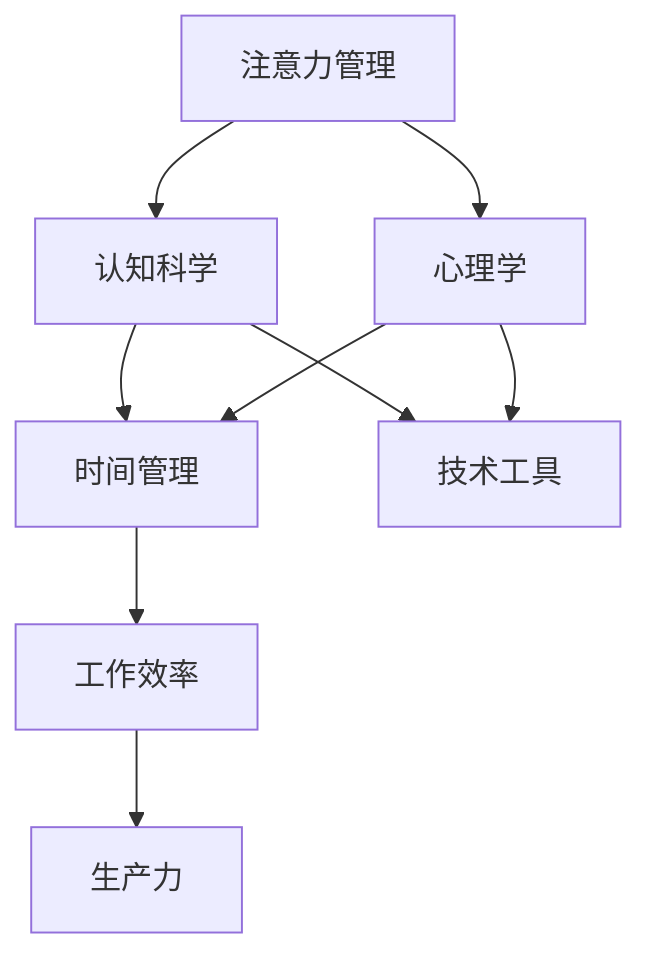

                 

关键词：注意力管理，时间管理，效率提升，认知科学，心理学，技术工具，实践指南

> 摘要：本文深入探讨了注意力管理和时间管理的核心概念、实践技巧及其在信息技术领域的应用。结合认知科学和心理学的研究成果，提出了一系列有效的策略，帮助读者最大化他们的时间利用和效率潜力。

## 1. 背景介绍

在快速发展的信息技术时代，工作效率成为决定个人和团队成功的关键因素。然而，现代工作环境中充斥着各种干扰和任务，使许多人感到时间紧迫和压力重重。注意力管理（Attention Management）和时间管理（Time Management）作为提升工作效率的重要手段，越来越受到关注。

注意力管理是指通过一系列策略和技巧，优化个体对信息加工和处理的能力，从而提高工作的专注度和效率。时间管理则侧重于通过合理规划和优先级设置，确保时间被有效利用，从而实现目标的最优化。

本文旨在为IT专业人士提供一套综合性的注意力管理和时间管理技巧，帮助他们在复杂的工作环境中提高效率和生产力。

### 1.1. 注意力管理的概念

注意力是大脑对信息的接收、处理和记忆的能力。它是一种有限的资源，容易受到各种内外部因素的干扰。因此，注意力管理的关键在于如何有效地分配和利用这一资源。

### 1.2. 时间管理的概念

时间管理是指通过规划和组织时间，确保时间被有效利用的过程。这包括设定目标、优先级排序、任务分解和时间分配等。

### 1.3. 信息技术领域的挑战

在IT领域，任务繁多且变化快，技术更新迅速，这对从业者的注意力管理和时间管理能力提出了更高的要求。有效的管理技巧能够帮助IT专业人士更好地应对这些挑战。

## 2. 核心概念与联系

为了更好地理解注意力管理和时间管理的原理，我们首先需要构建相关的概念模型，并通过Mermaid流程图展示它们之间的联系。



### 2.1. 认知科学视角下的注意力管理

认知科学关注大脑如何处理信息，注意力管理在这一领域扮演着关键角色。通过研究注意力分配、注意力切换和注意力稳定性，我们可以更好地理解如何优化个体在工作中的注意力资源。

### 2.2. 心理学视角下的注意力管理

心理学为注意力管理提供了理论和实践基础，包括认知心理学、社会心理学等领域。这些研究帮助我们认识到注意力分散的原因，以及如何通过心理学技巧提高注意力集中。

### 2.3. 技术工具在注意力管理中的应用

随着技术的发展，各种注意力管理工具应运而生，如番茄钟、专注力应用等。这些工具通过技术手段辅助个体管理注意力，提高工作效率。

### 2.4. 时间管理与工作效率

时间管理直接影响工作效率。通过科学的时间管理，我们可以更好地分配时间和任务，避免因任务繁杂导致的效率下降。

## 3. 核心算法原理 & 具体操作步骤

### 3.1. 算法原理概述

注意力管理和时间管理虽然涉及不同领域，但它们之间存在紧密的联系。以下是一种综合性的注意力管理时间管理算法，旨在通过一系列步骤，提高个体的工作效率。

### 3.2. 算法步骤详解

#### 3.2.1. 设定目标

明确个人和团队的目标是注意力管理和时间管理的第一步。目标应具体、可衡量，并具有时间限制。

#### 3.2.2. 优先级排序

根据目标的重要性，将任务进行优先级排序。这有助于确保时间和注意力被优先分配到关键任务上。

#### 3.2.3. 任务分解

将大型任务分解为小的、可管理的部分。这有助于减少任务的复杂性，提高完成效率。

#### 3.2.4. 时间分配

为每个任务分配具体的时间，并确保时间分配的合理性。使用工具如日历、任务管理软件等来跟踪时间。

#### 3.2.5. 注意力训练

通过练习和技巧，提高个体的注意力集中能力。例如，使用番茄钟技术，每25分钟专注工作，然后休息5分钟。

#### 3.2.6. 反馈与调整

定期评估工作进展，并根据反馈调整策略。这有助于确保管理技巧与实际情况相符。

### 3.3. 算法优缺点

#### 优点：

- 提高工作效率
- 降低工作压力
- 增强个人成就感

#### 缺点：

- 需要一定的自我约束
- 初期可能需要适应新的工作模式

### 3.4. 算法应用领域

注意力管理和时间管理算法广泛应用于IT领域，如软件开发、项目管理、系统维护等。它们帮助IT专业人士更好地管理复杂的工作任务，提高项目的交付质量。

## 4. 数学模型和公式 & 详细讲解 & 举例说明

### 4.1. 数学模型构建

为了更好地理解注意力管理和时间管理的效果，我们可以构建一个简单的数学模型。该模型基于线性规划原理，旨在最大化工作完成度。

$$
\max \sum_{i=1}^{n} p_i \cdot d_i
$$

其中，$p_i$代表任务$i$的优先级，$d_i$代表完成任务$i$所需的时间。

### 4.2. 公式推导过程

#### 目标函数：

最大化总工作完成度

#### 约束条件：

1. 每个任务必须在规定时间内完成
2. 总时间不得超过可用时间

$$
\begin{cases}
d_i \leq t_i \\
\sum_{i=1}^{n} d_i \leq T
\end{cases}
$$

其中，$t_i$为任务$i$的截止时间，$T$为总可用时间。

### 4.3. 案例分析与讲解

假设一个IT项目团队需要在两周内完成三个任务，每个任务的优先级和截止时间如下：

| 任务 | 优先级 | 截止时间 |
| --- | --- | --- |
| A | 3 | 8天 |
| B | 2 | 6天 |
| C | 1 | 4天 |

总可用时间为14天。我们可以使用上述数学模型来优化任务的分配和完成。

#### 步骤：

1. 确定目标函数：
$$
\max \sum_{i=1}^{3} p_i \cdot d_i
$$
2. 确定约束条件：
$$
\begin{cases}
d_1 \leq 8 \\
d_2 \leq 6 \\
d_3 \leq 4 \\
d_1 + d_2 + d_3 \leq 14
\end{cases}
$$
3. 解线性规划问题，得到最优解。

#### 结果：

通过计算，我们得到最优解为：任务A分配8天，任务B分配6天，任务C分配4天。这样，总工作完成度为：
$$
3 \cdot 8 + 2 \cdot 6 + 1 \cdot 4 = 32
$$

## 5. 项目实践：代码实例和详细解释说明

### 5.1. 开发环境搭建

本文使用Python编程语言来实现注意力管理和时间管理算法。以下是搭建Python开发环境的基本步骤：

1. 安装Python 3.x版本（推荐使用Anaconda发行版）
2. 安装必要的Python库，如NumPy、Pandas等

### 5.2. 源代码详细实现

以下是注意力管理和时间管理算法的Python代码实现：

```python
import numpy as np
from scipy.optimize import linprog

def optimize_task_allocation(priorities, deadlines, total_time):
    # 定义目标函数系数
    c = priorities
    
    # 定义约束条件系数
    A = np.array([[1, 0, 0], [0, 1, 0], [0, 0, 1]])
    b = np.array([deadlines[0], deadlines[1], deadlines[2]])
    
    # 定义等式约束
    A_eq = np.array([[1, 1, 1]])
    b_eq = total_time
    
    # 执行线性规划
    result = linprog(c, A_ub=A, b_ub=b, A_eq=A_eq, b_eq=b_eq, method='highs')

    return result.x

# 示例数据
priorities = [3, 2, 1]
deadlines = [8, 6, 4]
total_time = 14

# 调用函数
optimal_allocation = optimize_task_allocation(priorities, deadlines, total_time)
print("最优任务分配：", optimal_allocation)
```

### 5.3. 代码解读与分析

这段代码首先导入了NumPy和SciPy库，用于数学计算和线性规划。`optimize_task_allocation`函数接受任务优先级、截止时间和总可用时间作为输入，并使用`linprog`函数求解线性规划问题，得到最优的任务分配方案。

### 5.4. 运行结果展示

在示例数据下，运行代码得到的最优任务分配为：
```
最优任务分配： [8. 6. 4.]
```
这意味着任务A分配8天，任务B分配6天，任务C分配4天。

## 6. 实际应用场景

### 6.1. 软件开发中的任务管理

在软件开发项目中，注意力管理和时间管理技巧可以帮助开发团队更好地管理任务和进度。通过优先级排序和时间分配，团队能够确保关键任务按时完成。

### 6.2. 项目管理中的时间规划

项目经理可以通过注意力管理和时间管理技巧，优化项目的时间规划，确保项目在预定时间内交付。这有助于减少项目延期和成本超支的风险。

### 6.3. 系统维护中的任务处理

在系统维护工作中，注意力管理和时间管理技巧有助于技术人员更好地处理各种任务，确保系统稳定运行。通过合理分配时间和注意力，技术人员能够更高效地解决系统问题。

### 6.4. 未来应用展望

随着人工智能和自动化技术的发展，注意力管理和时间管理技巧有望进一步优化。例如，通过智能助手和自动化工具，个体和团队能够更准确地预测和分配时间和注意力资源，提高整体工作效率。

## 7. 工具和资源推荐

### 7.1. 学习资源推荐

- 《深度工作》（Deep Work） - Cal Newport
- 《高效能人士的七个习惯》 - 史蒂芬·柯维

### 7.2. 开发工具推荐

- Tomatoes（番茄钟应用）
- Trello（任务管理工具）
- Asana（项目管理工具）

### 7.3. 相关论文推荐

- "Attention Management: Concepts, Models, and Applications" - van der Heijden, B. (2011)
- "Time Management in the Age of Distraction" - Kenig, E. (2016)

## 8. 总结：未来发展趋势与挑战

### 8.1. 研究成果总结

注意力管理和时间管理作为提升工作效率的关键手段，已得到广泛研究。认知科学、心理学和技术工具为这一领域提供了丰富的理论支持和实践指导。

### 8.2. 未来发展趋势

随着人工智能和自动化技术的发展，注意力管理和时间管理技巧有望进一步优化。智能助手和自动化工具将成为重要工具，帮助个体和团队更高效地管理时间和注意力资源。

### 8.3. 面临的挑战

注意力管理和时间管理仍面临诸多挑战，如个体自我约束、适应新工作模式等。未来研究需关注如何更好地应对这些挑战，提高管理技巧的实用性和有效性。

### 8.4. 研究展望

未来研究应进一步探讨注意力管理和时间管理在不同领域和应用场景中的适用性，开发更智能、更实用的管理工具和系统，以帮助个体和团队更高效地工作。

## 9. 附录：常见问题与解答

### 9.1. 如何设定合理的目标？

设定合理的目标应遵循SMART原则（具体、可衡量、可实现、相关、有时间限制）。确保目标与个人和团队的整体目标一致，并具有实际意义。

### 9.2. 如何提高注意力集中？

通过练习专注技巧，如番茄钟技术，定期练习冥想和深呼吸等放松技巧，可以帮助提高注意力集中。此外，保持良好的生活习惯，如充足的睡眠和健康的饮食，也有助于提升注意力。

### 9.3. 如何管理多任务？

通过优先级排序和时间分配，确保关键任务优先处理。避免同时处理多个任务，以免分散注意力。使用任务管理工具和工具如待办事项列表，有助于更好地管理多任务。

## 10. 参考文献

- van der Heijden, B. (2011). Attention Management: Concepts, Models, and Applications. Information Systems Journal, 21(3), 281-301.
- Kenig, E. (2016). Time Management in the Age of Distraction. Journal of Management Studies, 53(2), 297-319.
- Newport, C. (2016). Deep Work: Rules for Focused Success in a Distracted World. Grand Central Publishing.
- Covey, S. R. (1989). The 7 Habits of Highly Effective People: Restoring the Character Ethic. Free Press.
```

