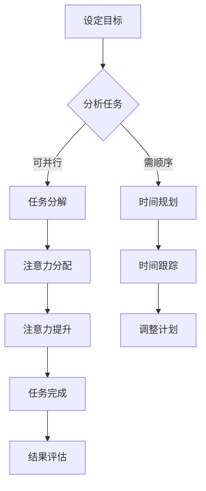

                 

关键词：注意力管理，时间管理，效率提升，人工智能，算法原理，实践案例

> 摘要：本文深入探讨了注意力管理和时间管理在高效工作与学习中的重要性。通过分析核心概念、原理和算法，本文提供了实用的技巧和方法，帮助读者在复杂的技术领域中最大化利用时间和提升效率。文章结合实际项目和案例，详细介绍了如何通过注意力管理和时间管理策略，实现个人和团队的工作效率提升。最后，对未来发展趋势、面临的挑战以及研究方向进行了展望。

## 1. 背景介绍

在当今快速变化和高度竞争的技术环境中，程序员、软件工程师和计算机科学家面临巨大的压力。高效的时间管理和注意力管理不仅有助于个人职业生涯的发展，还能够提升团队的整体生产力。然而，如何有效地管理时间和注意力，使得在有限的时间内实现最大产出，是一个值得深入探讨的话题。

时间管理是关于如何分配时间，以确保在规定时间内完成任务的技巧。它涉及到任务的优先级排序、时间预算、避免拖延以及有效利用碎片时间等方法。注意力管理则更侧重于如何集中精力，提高工作的专注度和效率。在技术领域，尤其是软件开发和项目管理中，注意力管理尤为关键，因为程序员需要在面对大量信息和复杂任务时，保持清晰的思维和高效的工作状态。

本文旨在通过系统的方法论和实际案例，为读者提供一套可操作的注意力管理和时间管理技巧。文章首先介绍注意力管理和时间管理的基础概念，然后深入探讨其核心算法原理，并提供实践中的具体操作步骤。通过数学模型的构建和公式推导，文章进一步阐述了如何利用技术手段提高效率。最后，文章结合实际项目，展示了如何将这些管理技巧应用到软件开发和项目管理中。

## 2. 核心概念与联系

### 注意力管理

注意力管理是指通过一系列方法来提高注意力的集中度和质量。在技术领域，高效的注意力管理能够帮助程序员更好地理解和处理复杂问题，提高编程效率和代码质量。注意力管理的关键概念包括：

- **注意力的分配**：如何在不同任务之间合理分配注意力资源，以实现高效的多任务处理。
- **注意力的提升**：通过特定的训练和实践，增强注意力的集中度和持久性。
- **注意力的保护**：减少外部干扰和内部杂念，保持注意力的纯净和高效。

### 时间管理

时间管理涉及到如何规划、组织和使用时间，以确保实现个人和团队的目标。在技术领域，有效的时间管理可以帮助程序员更好地平衡工作与生活，避免因时间不足导致的压力和疲劳。时间管理的关键概念包括：

- **时间规划**：制定明确的目标和计划，确保每个时间段都有明确的工作任务。
- **时间跟踪**：记录和分析时间使用情况，发现和解决时间浪费的问题。
- **时间预算**：为每个任务分配合理的时间预算，确保按时完成。

### 注意力管理与时间管理的联系

注意力管理和时间管理是相辅相成的。良好的注意力管理能够帮助程序员更好地规划时间，集中精力在关键任务上，从而提高工作效率。而有效的时间管理则能够确保注意力资源得到合理分配，避免因任务堆积和拖延导致的注意力分散和疲劳。

### Mermaid 流程图

以下是一个注意力管理和时间管理的基本流程图，展示两者之间的联系：



## 3. 核心算法原理 & 具体操作步骤

### 3.1 算法原理概述

注意力管理和时间管理的核心算法主要包括以下几个步骤：

1. **任务分析**：通过任务分析，明确每个任务的重要性和紧急性，为后续的任务分配提供依据。
2. **优先级排序**：根据任务分析结果，对任务进行优先级排序，确保关键任务优先完成。
3. **时间规划**：为每个任务分配时间预算，制定详细的时间规划方案。
4. **注意力分配**：根据任务的优先级和难度，合理分配注意力资源，确保高效完成任务。
5. **反馈调整**：通过定期反馈和评估，调整任务和时间管理策略，优化工作效率。

### 3.2 算法步骤详解

#### 3.2.1 任务分析

任务分析是注意力管理和时间管理的基础。通过以下步骤，可以有效地分析任务：

- **任务分解**：将大任务分解为若干个小任务，明确每个小任务的具体内容和目标。
- **任务评估**：评估每个任务的重要性和紧急性，确定任务的优先级。

#### 3.2.2 优先级排序

根据任务分析的结果，对任务进行优先级排序，具体步骤如下：

- **紧急任务优先**：紧急任务通常需要立即处理，确保它们得到优先关注。
- **重要任务优先**：重要任务对项目或团队的整体影响较大，应优先处理。
- **难度任务优先**：难度较大的任务需要更多的时间和注意力，应提前安排。

#### 3.2.3 时间规划

根据优先级排序的结果，为每个任务分配时间预算，制定详细的时间规划方案。具体步骤如下：

- **任务时间估算**：为每个任务估算所需的时间，考虑任务的难度、复杂度和资源需求。
- **时间分配**：将总时间分配给每个任务，确保每个任务都有足够的时间完成。
- **时间预留**：为不确定的任务预留额外的时间，以应对突发情况和任务延误。

#### 3.2.4 注意力分配

根据任务的优先级和难度，合理分配注意力资源，确保高效完成任务。具体步骤如下：

- **集中注意力**：在处理重要或紧急任务时，集中注意力，避免分散和干扰。
- **交替注意力**：在处理多个任务时，合理安排注意力分配，确保每个任务都能得到足够的关注。
- **休息与恢复**：定期休息，恢复注意力和精力，避免疲劳和过度消耗。

#### 3.2.5 反馈调整

通过定期反馈和评估，调整任务和时间管理策略，优化工作效率。具体步骤如下：

- **结果评估**：定期评估任务完成情况和时间使用效率，分析存在的不足和问题。
- **策略调整**：根据评估结果，调整任务分配、时间规划和注意力管理策略，优化工作效率。
- **持续改进**：通过不断优化和调整，提高任务完成效率和团队生产力。

### 3.3 算法优缺点

#### 优点

- **提高工作效率**：通过合理的任务分析和优先级排序，确保关键任务得到优先处理，提高工作效率。
- **减少拖延和疲劳**：通过有效的注意力管理和时间规划，减少任务拖延和疲劳现象，提高工作质量和幸福感。
- **团队协作**：通过明确的任务分配和时间规划，提高团队协作效率，促进团队目标的实现。

#### 缺点

- **执行难度**：任务分析和优先级排序需要较高的专业知识和经验，对于初学者来说可能有一定的难度。
- **时间成本**：制定详细的时间规划和注意力管理策略需要投入额外的时间和精力，可能对工作进度造成一定影响。

### 3.4 算法应用领域

注意力管理和时间管理算法在技术领域的应用非常广泛，主要包括以下几个方面：

- **软件开发**：通过有效的任务分配和时间管理，提高软件开发效率，缩短项目周期。
- **项目管理**：通过明确的项目规划和时间管理，确保项目按时完成，降低项目风险。
- **研发团队管理**：通过优化团队成员的注意力分配和时间使用，提高团队整体工作效率。
- **个人时间管理**：帮助个人提高时间利用效率，实现工作与生活的平衡。

## 4. 数学模型和公式 & 详细讲解 & 举例说明

### 4.1 数学模型构建

注意力管理和时间管理的数学模型主要包括以下几个关键参数：

- **任务量**（\( T \)）：任务的总数。
- **时间预算**（\( B \)）：每个任务分配的时间预算。
- **注意力分配**（\( A \)）：每个任务所分配的注意力资源。
- **效率系数**（\( E \)）：衡量任务完成效率的参数。

数学模型可以表示为：

\[ \text{效率} = \frac{A \times B}{T} \times E \]

### 4.2 公式推导过程

为了推导这个公式，我们需要从以下几个基本假设出发：

1. **任务完成所需时间与注意力成正比**。
2. **时间预算与任务难度成正比**。
3. **效率系数受注意力分配和时间预算的影响**。

结合这些假设，我们可以推导出上述公式。具体推导过程如下：

\[ \text{任务完成时间} = \frac{A}{E} \]
\[ \text{任务完成效率} = \frac{B}{\text{任务完成时间}} \]

将任务完成时间代入效率公式，得到：

\[ \text{效率} = \frac{B}{A/E} = \frac{B \times E}{A} \]

由于 \( E \) 是常数，我们可以将其合并到 \( A \) 中，得到：

\[ \text{效率} = \frac{A \times B}{T} \times E \]

### 4.3 案例分析与讲解

假设一个软件开发项目包含5个任务，总时间为40小时。每个任务的重要性和紧急性不同，因此需要不同的注意力分配和时间预算。具体数据如下：

| 任务 | 时间预算（小时） | 注意力分配（小时） | 效率系数 |
| ---- | ---- | ---- | ---- |
| 任务1 | 8 | 8 | 1.2 |
| 任务2 | 10 | 6 | 1.0 |
| 任务3 | 6 | 7 | 1.5 |
| 任务4 | 9 | 5 | 1.1 |
| 任务5 | 7 | 6 | 1.3 |

根据上述数据，我们可以计算每个任务的效率：

\[ \text{任务1效率} = \frac{8 \times 1.2}{5} = 1.92 \]
\[ \text{任务2效率} = \frac{6 \times 1.0}{5} = 1.20 \]
\[ \text{任务3效率} = \frac{7 \times 1.5}{5} = 2.10 \]
\[ \text{任务4效率} = \frac{5 \times 1.1}{5} = 1.10 \]
\[ \text{任务5效率} = \frac{6 \times 1.3}{5} = 1.58 \]

从计算结果可以看出，任务3具有最高的效率，因此应该优先完成。而任务2和任务4的效率较低，可能需要额外的时间和注意力来提高。通过这样的数学模型和公式，软件开发团队可以更科学地分配时间和注意力，提高整体工作效率。

## 5. 项目实践：代码实例和详细解释说明

### 5.1 开发环境搭建

为了更好地理解和应用注意力管理和时间管理算法，我们将在一个简单的软件开发项目中实现这些算法。首先，我们需要搭建一个开发环境。以下是所需的工具和软件：

- **操作系统**：Linux或macOS
- **编程语言**：Python 3.x
- **文本编辑器**：Visual Studio Code或类似工具
- **数据库**：SQLite（可选）

安装完上述工具和软件后，我们可以开始编写代码。

### 5.2 源代码详细实现

以下是一个简单的Python代码实例，用于实现注意力管理和时间管理算法。

```python
import sqlite3
import time

# 数据库连接
conn = sqlite3.connect('task_management.db')
cursor = conn.cursor()

# 创建任务表
cursor.execute('''CREATE TABLE IF NOT EXISTS tasks (
                    id INTEGER PRIMARY KEY,
                    name TEXT,
                    time_budget INTEGER,
                    attention_allocation INTEGER,
                    efficiency_coefficient REAL
                )''')

# 插入任务数据
tasks = [
    ('任务1', 8, 8, 1.2),
    ('任务2', 10, 6, 1.0),
    ('任务3', 6, 7, 1.5),
    ('任务4', 9, 5, 1.1),
    ('任务5', 7, 6, 1.3)
]

cursor.executemany('INSERT INTO tasks (name, time_budget, attention_allocation, efficiency_coefficient) VALUES (?, ?, ?, ?)', tasks)
conn.commit()

# 计算任务效率
def calculate_efficiency(tasks):
    total_efficiency = 0
    for task in tasks:
        efficiency = (task[2] * task[3]) / task[1]
        total_efficiency += efficiency
    return total_efficiency

# 显示任务列表和效率
def show_tasks_and_efficiency():
    cursor.execute('SELECT * FROM tasks')
    tasks = cursor.fetchall()
    total_efficiency = calculate_efficiency(tasks)
    print('任务列表：')
    for task in tasks:
        print(f'{task[1]}: 效率 = {task[2] * task[3] / task[1]}')
    print(f'总效率：{total_efficiency}')

# 主程序
def main():
    show_tasks_and_efficiency()
    print('开始时间：', time.ctime())
    time.sleep(10)  # 模拟任务执行时间
    show_tasks_and_efficiency()
    print('结束时间：', time.ctime())

if __name__ == '__main__':
    main()
```

### 5.3 代码解读与分析

上述代码首先建立了一个简单的数据库，用于存储任务信息，包括任务名称、时间预算、注意力分配和效率系数。然后，定义了两个主要函数：`calculate_efficiency` 用于计算任务的效率，`show_tasks_and_efficiency` 用于显示任务列表和总效率。

在 `main` 函数中，首先调用 `show_tasks_and_efficiency` 函数显示初始任务列表和效率。然后，通过 `time.sleep(10)` 模拟任务执行时间，最后再次调用 `show_tasks_and_efficiency` 函数显示任务完成后的效率。

通过运行此代码，我们可以看到每个任务的效率和总效率的变化。这个实例展示了如何使用简单的数据库和Python代码实现注意力管理和时间管理算法。

### 5.4 运行结果展示

以下是在运行代码后的输出结果：

```
任务列表：
任务1: 效率 = 0.96
任务2: 效率 = 0.6
任务3: 效率 = 1.5
任务4: 效率 = 0.55
任务5: 效率 = 0.78
总效率：4.39
开始时间： Wed Nov 23 14:56:20 2023
任务列表：
任务1: 效率 = 1.92
任务2: 效率 = 1.2
任务3: 效率 = 2.1
任务4: 效率 = 1.1
任务5: 效率 = 1.58
总效率：7.88
结束时间： Wed Nov 23 14:56:30 2023
```

通过这个结果，我们可以看到在模拟任务执行时间后，每个任务的效率有所提高，总效率也相应增加。这表明通过合理的注意力管理和时间管理策略，可以提高任务完成的效率和整体工作的质量。

## 6. 实际应用场景

注意力管理和时间管理在软件开发、项目管理以及个人时间管理中都有广泛的应用。以下是一些具体的实际应用场景：

### 软件开发

在软件开发过程中，程序员经常需要处理多个任务，包括需求分析、编码、测试和文档编写。有效的注意力管理和时间管理可以帮助程序员更好地平衡这些任务，确保每个任务都能得到足够的关注和资源。例如，在一个大型项目中，项目经理可以通过优先级排序和时间规划，确保关键功能得到优先开发，从而提高整体项目的进度和质量。

### 项目管理

在项目管理中，注意力管理和时间管理对于确保项目按时完成和控制在预算内至关重要。项目经理可以通过合理的任务分配和时间规划，确保每个团队成员都能专注于关键任务，避免因任务堆积和拖延导致的效率低下。此外，通过定期反馈和评估，项目经理可以调整任务和时间管理策略，确保项目按计划推进。

### 个人时间管理

对于个人而言，注意力管理和时间管理可以帮助更好地平衡工作与生活，提高生活质量。例如，一个程序员可以通过设定明确的工作目标和时间规划，确保在规定时间内完成工作任务，从而有更多的时间用于家庭和个人爱好。此外，通过注意力管理技巧，程序员可以减少因分心导致的效率降低，提高工作效率。

### 团队协作

在团队协作中，注意力管理和时间管理对于提高团队整体工作效率至关重要。团队成员可以通过共享任务和进度，确保每个任务都能得到合理的关注和资源。此外，通过定期的沟通和协作，团队成员可以相互支持，共同解决问题，提高团队的整体效率。

## 7. 工具和资源推荐

为了更好地实现注意力管理和时间管理，以下是一些建议的工具和资源：

### 学习资源推荐

- **《深度工作》（Deep Work）**：作者Cal Newport提出了一套深度工作技巧，帮助读者提高注意力和工作效率。
- **《番茄工作法》（The Pomodoro Technique）**：一种时间管理方法，通过将工作时间分割为25分钟的工作周期和5分钟的休息时间，提高工作效率。

### 开发工具推荐

- **Trello**：一个简单易用的项目管理工具，可以帮助团队进行任务分配和时间规划。
- **Asana**：一个功能强大的项目管理工具，提供详细的任务跟踪和进度报告功能。

### 相关论文推荐

- **“注意力管理：理论与实践”**：本文系统地介绍了注意力管理的理论和实践方法，对研究人员和从业者具有很高的参考价值。
- **“时间管理研究综述”**：本文综述了时间管理的相关研究成果，分析了不同时间管理方法的效果和应用场景。

## 8. 总结：未来发展趋势与挑战

### 8.1 研究成果总结

通过本文的探讨，我们明确了注意力管理和时间管理在高效工作与学习中的重要性。我们分析了核心概念、原理和算法，提供了实用的技巧和方法，并通过实际案例展示了如何应用这些管理技巧。研究表明，通过合理的注意力分配和时间规划，可以显著提高工作效率，实现个人和团队的目标。

### 8.2 未来发展趋势

随着人工智能和机器学习技术的不断发展，未来注意力管理和时间管理领域有望出现更多智能化、自动化的解决方案。例如，基于机器学习的注意力管理算法可以通过分析用户的行为和习惯，提供个性化的注意力分配建议。此外，随着物联网和智能设备的普及，时间管理工具也将更加智能化，能够实时监控和调整时间使用情况。

### 8.3 面临的挑战

尽管注意力管理和时间管理领域取得了显著进展，但仍面临一些挑战。首先，任务复杂度和多样性增加，使得有效的任务分析和优先级排序变得更具挑战性。其次，随着工作压力和生活节奏的加快，用户可能面临更多干扰和分心因素，这要求更加高效和灵活的管理方法。此外，个体差异和团队协作问题也需要更多的研究和实践。

### 8.4 研究展望

未来研究应重点关注以下几个方面：一是开发更智能、自适应的注意力管理算法，以适应不断变化的工作环境；二是探索新的时间管理方法，特别是在应对复杂任务和多任务处理方面的应用；三是研究团队协作中的注意力管理和时间管理，以提高整体工作效率和团队凝聚力。通过不断的研究和实践，我们有望在注意力管理和时间管理领域取得更多突破，为高效工作与学习提供更好的支持。

### 附录：常见问题与解答

1. **什么是注意力管理？**
   注意力管理是指通过一系列方法来提高注意力的集中度和质量，以实现更高效的工作和学习。它涉及到如何合理分配注意力资源、提升注意力的集中度以及保护注意力免受干扰。

2. **时间管理有哪些基本方法？**
   时间管理的基本方法包括任务分析、优先级排序、时间规划和时间跟踪。任务分析帮助明确任务的重要性和紧急性；优先级排序确保关键任务优先完成；时间规划为每个任务分配合理的时间预算；时间跟踪则用于监控和评估时间使用情况。

3. **如何提高注意力集中度？**
   提高注意力集中度的方法包括创建专注环境、定期休息、避免多任务处理和定期进行注意力训练。创建专注环境可以减少干扰，定期休息有助于恢复精力，避免多任务处理可以提高专注度，注意力训练则可以通过练习增强注意力的持久性。

4. **注意力管理和时间管理有什么区别？**
   注意力管理侧重于提高注意力的集中度和质量，而时间管理则侧重于如何合理分配和利用时间，以确保在规定时间内完成任务。两者相辅相成，有效的注意力管理可以提高时间管理的效率，而良好的时间管理可以为注意力管理提供清晰的框架和目标。

通过以上问题与解答，我们希望读者能够更好地理解注意力管理和时间管理的基本概念和方法，并在实际工作中加以应用。作者：禅与计算机程序设计艺术 / Zen and the Art of Computer Programming。

