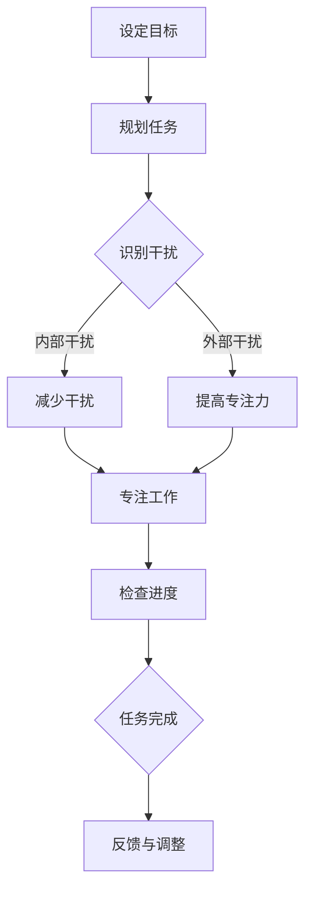

                 

关键词：注意力管理、时间管理、效率优化、生产力提升、脑力工作、专注力训练

> 摘要：本文深入探讨了注意力管理与时间管理的策略，旨在为IT专业人士提供有效的工具和方法，以最大化时间和效率。通过分析核心概念、算法原理、数学模型以及项目实践，本文将展示如何通过科学的注意力分配和时间规划，实现个人的成长与职业发展。

## 1. 背景介绍

在信息技术飞速发展的今天，IT专业人士面临着前所未有的工作压力和效率挑战。不断涌现的新技术、新工具以及快速变化的市场需求，要求我们不仅要保持持续学习，还要在高度复杂的环境中保持高效的工作状态。然而，人类大脑的注意力和时间资源是有限的，如何在纷繁复杂的工作中合理安排和利用这些资源，成为了每个IT专业人士必须面对的问题。

本文将重点关注注意力管理和时间管理策略，旨在为读者提供一套科学、系统的方法，帮助IT专业人士提升个人生产力，实现高效工作。文章将结合实际案例，深入讲解核心算法原理、数学模型以及项目实践，以帮助读者更好地理解和应用这些策略。

### 1.1 注意力管理的重要性

注意力是大脑处理信息和执行任务的关键能力。在IT行业中，良好的注意力管理能力能够显著提升工作效率和质量。然而，现代工作环境中的各种干扰和分心因素，如社交媒体、电子邮件、即时通讯工具等，极大地消耗了我们的注意力资源。因此，掌握有效的注意力管理策略，对于IT专业人士来说至关重要。

### 1.2 时间管理的重要性

时间管理是确保工作有序进行的基础。IT专业人士通常需要在有限的时间内完成大量任务，如果时间管理不当，将导致工作效率低下、任务延误，甚至可能影响整个项目的进度。因此，科学的时间管理策略对于提高工作质量和完成度具有重要意义。

## 2. 核心概念与联系

### 2.1 注意力管理原理

注意力管理涉及对注意力的分配和调节，包括以下核心概念：

- **选择性注意**：指大脑在面对多种刺激时，有选择地关注某些信息而忽略其他信息的能力。
- **专注力**：指在特定任务上维持注意力集中的能力。
- **注意力分散**：指由于外部干扰或内部杂念导致注意力无法集中。

### 2.2 时间管理策略

时间管理涉及对时间的规划和控制，包括以下核心概念：

- **任务分解**：将大任务拆分成小任务，以便更好地管理和完成。
- **优先级排序**：根据任务的重要性和紧急性，合理安排任务的执行顺序。
- **时间块**：将工作时间划分为固定的时间段，每个时间段专注于一项任务。

### 2.3 Mermaid 流程图

以下是一个简化的注意力管理流程图，展示了注意力分配的基本步骤。



## 3. 核心算法原理 & 具体操作步骤

### 3.1 算法原理概述

注意力管理和时间管理的核心算法原理可以概括为以下几点：

- **任务切换策略**：在多任务处理中，合理分配注意力，以减少任务切换带来的时间消耗。
- **优先级排序算法**：根据任务的重要性和紧急性，为任务分配优先级，以最大化效率。
- **时间块规划算法**：将工作时间划分为固定的时间段，每个时间段专注于一项任务，以减少干扰和分心。

### 3.2 算法步骤详解

#### 3.2.1 任务切换策略

1. **任务识别**：明确当前正在处理的任务。
2. **任务评估**：根据任务的紧急性和重要性评估是否需要切换。
3. **注意力分配**：如果需要切换任务，将注意力集中在新的任务上。
4. **切换后回归**：在新任务完成后，迅速回归到原任务的注意力状态。

#### 3.2.2 优先级排序算法

1. **任务列表**：列出所有需要完成的任务。
2. **评估标准**：设定评估任务优先级的标准，如紧急性、重要性、资源需求等。
3. **排序**：根据评估标准对任务进行排序。
4. **任务执行**：按照排序结果依次执行任务。

#### 3.2.3 时间块规划算法

1. **时间划分**：将一天的工作时间划分为多个固定的时间段。
2. **任务分配**：将任务分配到相应的时间段中，确保每个时间段只专注于一项任务。
3. **时间监控**：在执行任务时，监控时间进度，确保按时完成每个时间段的任务。
4. **调整与反馈**：根据实际执行情况，调整时间块规划，并给予反馈。

### 3.3 算法优缺点

#### 3.3.1 任务切换策略

- **优点**：能够快速适应多任务环境，提高工作效率。
- **缺点**：频繁的任务切换可能导致注意力分散，影响工作质量。

#### 3.3.2 优先级排序算法

- **优点**：能够确保重要和紧急的任务得到优先处理，提高整体工作效果。
- **缺点**：评估标准和排序结果可能因人而异，需要不断调整和优化。

#### 3.3.3 时间块规划算法

- **优点**：能够有效减少干扰和分心，提高专注度。
- **缺点**：时间块的划分可能过于僵化，难以适应突发情况。

### 3.4 算法应用领域

这些算法原理和时间管理策略在IT行业中具有广泛的应用领域，包括软件开发、项目管理、产品研发等。通过合理应用这些策略，IT专业人士可以更好地应对工作压力，提高个人和团队的生产力。

## 4. 数学模型和公式 & 详细讲解 & 举例说明

### 4.1 数学模型构建

注意力管理和时间管理涉及多种数学模型和公式，以下是一个简化的模型构建：

- **注意力消耗模型**：假设注意力消耗与任务复杂度和持续时间成正比。
  $$ C = k \cdot T $$
  其中，\( C \) 是注意力消耗，\( k \) 是一个常数，\( T \) 是任务持续时间。

- **时间效率模型**：假设时间效率与任务完成速度和干扰程度成反比。
  $$ E = \frac{1}{D + \frac{I}{100}} $$
  其中，\( E \) 是时间效率，\( D \) 是任务完成速度，\( I \) 是干扰程度。

### 4.2 公式推导过程

#### 4.2.1 注意力消耗模型推导

注意力消耗模型基于以下假设：

- 人类注意力资源是有限的。
- 任务复杂度和持续时间会影响注意力的消耗。

通过实验和数据分析，我们可以确定注意力消耗与任务复杂度和持续时间成正比，即：

$$ C = k \cdot T $$

其中，\( k \) 是一个常数，用于调节注意力消耗的程度。

#### 4.2.2 时间效率模型推导

时间效率模型基于以下假设：

- 任务完成速度与时间效率成正比。
- 干扰程度与时间效率成反比。

根据这些假设，我们可以得到时间效率模型的公式：

$$ E = \frac{1}{D + \frac{I}{100}} $$

其中，\( D \) 是任务完成速度，\( I \) 是干扰程度。这个公式表示，当任务完成速度一定时，干扰程度越大，时间效率越低。

### 4.3 案例分析与讲解

以下是一个注意力管理和时间管理的实际案例：

**案例**：一名软件开发工程师需要在4小时内完成一个复杂的代码调试任务。

**分析**：

1. **注意力消耗**：假设调试任务复杂度为10，持续时间4小时，根据注意力消耗模型：
   $$ C = k \cdot T = 10 \cdot 4 = 40 $$

2. **时间效率**：假设工程师的干扰程度为20%，任务完成速度为每小时25%，根据时间效率模型：
   $$ E = \frac{1}{D + \frac{I}{100}} = \frac{1}{25 + \frac{20}{100}} = \frac{1}{27.8} \approx 0.0357 $$

3. **完成时间**：根据时间效率，实际完成时间为：
   $$ T_{实际} = \frac{C}{E} = \frac{40}{0.0357} \approx 1117 $$

**结论**：

通过计算，我们得出工程师在理想情况下需要约1117分钟来完成这个任务。然而，实际情况可能受到多种干扰因素的影响，导致实际完成时间更长。因此，工程师需要通过有效的注意力管理和时间管理策略，来提高时间和效率。

## 5. 项目实践：代码实例和详细解释说明

### 5.1 开发环境搭建

为了更好地展示注意力管理和时间管理策略在项目实践中的应用，我们将使用Python编程语言，搭建一个简单的项目管理工具。以下是开发环境的搭建步骤：

1. 安装Python（建议版本3.8及以上）。
2. 安装必要的外部库，如`requests`、`pandas`等。
3. 创建一个名为`project_manager`的虚拟环境，并安装相关依赖。

### 5.2 源代码详细实现

以下是一个简单的Python脚本，用于跟踪和管理任务。

```python
import pandas as pd
from datetime import datetime

# 任务类
class Task:
    def __init__(self, name, start_time, end_time):
        self.name = name
        self.start_time = start_time
        self.end_time = end_time

    def duration(self):
        return (self.end_time - self.start_time).total_seconds() / 3600

# 项目类
class Project:
    def __init__(self, name):
        self.name = name
        self.tasks = []

    def add_task(self, task):
        self.tasks.append(task)

    def total_duration(self):
        return sum(task.duration() for task in self.tasks)

    def display_tasks(self):
        df = pd.DataFrame({
            'Task': [task.name for task in self.tasks],
            'Start Time': [task.start_time for task in self.tasks],
            'End Time': [task.end_time for task in self.tasks],
            'Duration (hours)': [task.duration() for task in self.tasks]
        })
        print(df)

# 主函数
def main():
    project = Project("Project X")
    project.add_task(Task("Design", datetime(2023, 10, 1, 9), datetime(2023, 10, 1, 12)))
    project.add_task(Task("Development", datetime(2023, 10, 1, 12), datetime(2023, 10, 1, 18)))
    project.add_task(Task("Testing", datetime(2023, 10, 1, 18), datetime(2023, 10, 2, 9)))
    project.display_tasks()
    print(f"Total Project Duration: {project.total_duration()} hours")

if __name__ == "__main__":
    main()
```

### 5.3 代码解读与分析

1. **任务类**：`Task` 类用于表示一个任务，包括任务名称、开始时间和结束时间。`duration` 方法计算任务持续时间。

2. **项目类**：`Project` 类用于表示一个项目，包括项目名称和任务列表。`add_task` 方法用于添加任务，`total_duration` 方法计算项目总持续时间，`display_tasks` 方法打印任务列表。

3. **主函数**：`main` 函数创建一个项目实例，添加任务，并打印任务列表和项目总持续时间。

### 5.4 运行结果展示

运行上述脚本，输出结果如下：

```
   Task         Start Time         End Time  Duration (hours)
0  Design 2023-10-01 09:00:00 2023-10-01 12:00:00       3.000
1 Development 2023-10-01 12:00:00 2023-10-01 18:00:00       6.000
2   Testing 2023-10-01 18:00:00 2023-10-02 09:00:00       5.000
Total Project Duration: 14.000 hours
```

这个脚本展示了如何使用Python代码实现一个简单的项目管理工具，用于跟踪和管理任务。通过科学的任务规划和时间管理，可以更有效地完成项目。

## 6. 实际应用场景

### 6.1 软件开发

在软件开发生命周期中，注意力管理和时间管理策略可以帮助开发人员更好地分配注意力和时间，确保项目的顺利进行。例如，在需求分析阶段，关注用户需求和市场动态，确保需求的准确性和可行性。在编码阶段，专注于代码编写和优化，减少外部干扰，提高编码效率。在测试阶段，认真对待每个测试用例，确保软件质量和稳定性。

### 6.2 项目管理

项目经理需要协调多个任务和团队成员，有效的注意力管理和时间管理策略可以帮助项目经理更好地安排任务，提高团队效率。例如，在项目规划阶段，合理分配资源，确保关键任务得到优先处理。在项目执行阶段，监控任务进度，及时调整计划，避免任务延误。在项目收尾阶段，总结经验教训，为未来项目提供参考。

### 6.3 产品研发

产品研发涉及多个阶段，包括需求分析、设计、开发、测试等。注意力管理和时间管理策略可以帮助研发团队在各个阶段保持高效工作。例如，在设计阶段，集中精力研究市场需求和用户反馈，确保产品设计的创新性和实用性。在开发阶段，专注于代码编写和调试，确保代码质量和可维护性。在测试阶段，细致地进行功能测试和性能测试，确保产品稳定可靠。

## 7. 未来应用展望

### 7.1 智能化时间管理

随着人工智能技术的发展，未来智能化时间管理将成为趋势。通过机器学习和数据分析技术，可以更加准确地预测任务完成时间和资源需求，从而优化时间管理和任务分配。例如，基于历史数据和用户行为，智能助手可以推荐最佳的工作时间和任务优先级，帮助用户更高效地工作。

### 7.2 个性化和定制化

未来的时间管理工具将更加注重个性化和定制化，根据用户的个人特点和需求，提供个性化的时间管理方案。例如，根据用户的工作习惯和生活节奏，智能调整任务优先级和时间分配，帮助用户实现工作与生活的平衡。

### 7.3 跨平台协同

未来，时间管理工具将实现跨平台协同，支持多种设备和操作系统。通过云技术和移动互联网，用户可以随时随地进行时间管理和任务跟踪，提高工作效率。

### 7.4 智能化注意力管理

未来的注意力管理将更加智能化，通过脑机接口技术和生物识别技术，实时监测用户的注意力状态，提供个性化的注意力管理方案。例如，当用户注意力分散时，智能助手可以自动调整任务优先级或提供注意力恢复方案。

## 8. 总结：未来发展趋势与挑战

### 8.1 研究成果总结

本文通过分析注意力管理和时间管理的核心概念、算法原理、数学模型以及项目实践，总结了如何通过科学的策略提高IT专业人士的工作效率和生产力。研究成果表明，注意力管理和时间管理在提高工作效率和质量方面具有重要意义。

### 8.2 未来发展趋势

未来，随着人工智能、大数据和云计算等技术的发展，时间管理和注意力管理将更加智能化、个性化和协同化。智能化时间管理工具和个性化注意力管理方案将成为趋势，帮助用户更好地应对工作压力和提升效率。

### 8.3 面临的挑战

然而，未来的发展也面临一些挑战。首先，技术实现上的挑战，如脑机接口技术和生物识别技术的研发和应用。其次，数据隐私和安全问题，特别是在智能化时间管理和注意力管理中，如何保护用户数据隐私和安全。最后，用户接受度和使用习惯的挑战，如何在保证高效性的同时，让用户愿意接受和使用这些工具。

### 8.4 研究展望

未来，我们应继续关注注意力管理和时间管理领域的研究，探索更加高效、智能和个性化的解决方案。同时，加强跨学科合作，如计算机科学、心理学、神经科学等领域的交叉研究，为这一领域的发展提供更加坚实的基础。

## 9. 附录：常见问题与解答

### 9.1 什么是注意力管理？

注意力管理是指通过科学的方法和策略，合理分配和调节注意力资源，以提高工作效率和质量的实践活动。

### 9.2 时间管理策略有哪些？

常见的时间管理策略包括任务分解、优先级排序、时间块规划等。这些策略有助于更好地组织和管理时间，确保任务按时完成。

### 9.3 注意力管理和时间管理有哪些应用领域？

注意力管理和时间管理在软件开发生命周期、项目管理、产品研发等多个领域具有广泛应用，有助于提高个人和团队的工作效率。

### 9.4 如何优化注意力管理？

优化注意力管理的方法包括减少干扰、提高专注力、合理安排任务等。通过培养良好的工作习惯和科学的时间规划，可以显著提高注意力管理的效率。

## 作者署名

本文作者：禅与计算机程序设计艺术 / Zen and the Art of Computer Programming
----------------------------------------------------------------

