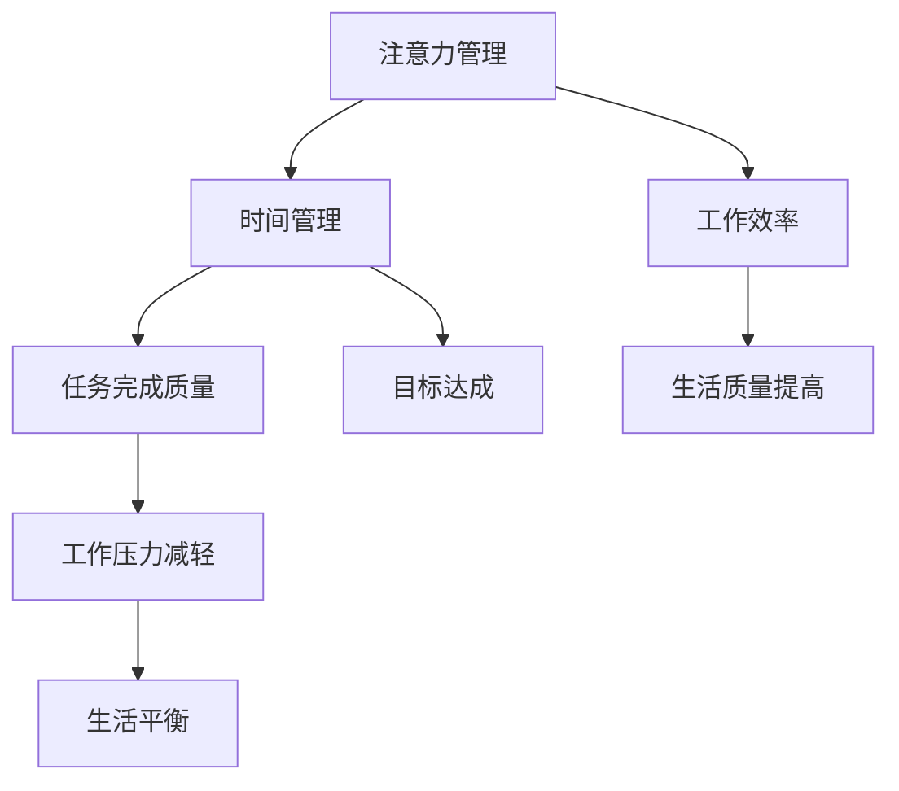

                 

### 摘要 Summary

在现代信息爆炸和快节奏的工作环境中，如何有效管理我们的注意力和时间成为提升个人和团队工作效率的关键。本文旨在探讨注意力管理与时间管理策略，详细分析其核心概念、算法原理、数学模型及实际应用。通过本文，读者将了解如何通过科学的时间管理和注意力管理技巧，提升个人的专注力和工作效率，从而实现个人与团队的目标。本文将围绕以下结构展开：

- **背景介绍**：分析现代工作环境中注意力分散和时间管理的挑战。
- **核心概念与联系**：介绍注意力管理和时间管理的基本概念，以及它们之间的关联。
- **核心算法原理 & 具体操作步骤**：阐述提升注意力和时间管理的算法原理，并提供具体的操作步骤。
- **数学模型和公式 & 详细讲解 & 举例说明**：构建并解释注意力管理的时间管理模型，通过案例进行说明。
- **项目实践：代码实例和详细解释说明**：通过代码实例展示注意力管理和时间管理策略的应用。
- **实际应用场景**：探讨注意力管理和时间管理在不同领域中的应用。
- **未来应用展望**：预测注意力管理和时间管理技术的发展趋势。
- **工具和资源推荐**：推荐学习和开发相关的工具和资源。
- **总结：未来发展趋势与挑战**：总结研究成果，展望未来的发展趋势和面临的挑战。

### 1. 背景介绍 Background

在现代工作环境中，注意力分散和时间管理问题已经成为普遍存在的挑战。随着信息技术的发展，我们面临的干扰越来越多，从电子邮件、即时消息到社交媒体，每一个都可能在瞬间打断我们的工作流程。这种频繁的干扰不仅影响我们的工作效率，还可能导致我们感到焦虑和疲惫。

注意力管理是指通过一系列策略和技巧，提高我们在特定任务上的专注力和工作效率。时间管理则关注如何合理安排时间，确保我们在有限的时间内完成更多的工作任务。注意力管理和时间管理之间的关系密不可分：良好的时间管理能够为我们提供更多专注的时间，而有效的注意力管理则能确保我们在这些时间里能够高效地完成任务。

当前，许多企业和组织都在寻找有效的解决方案来应对这些挑战。例如，一些公司已经开始采用“集中式工作日”（Focus Days）来减少干扰，提高员工的工作效率。同时，也有许多应用程序和工具被开发出来，帮助用户更好地管理他们的时间和注意力，如番茄钟（Pomodoro Technique）、专注力训练软件等。

然而，尽管这些方法在一定程度上有效，但如何系统化地提升注意力和时间管理能力，仍然是需要深入研究和探索的课题。本文将结合最新的研究成果和实际应用案例，为读者提供一套科学、实用的注意力管理和时间管理策略。

### 2. 核心概念与联系 Core Concepts and Their Connections

#### 2.1 注意力管理的概念和重要性

注意力管理是指通过一系列策略和技巧，提高我们在特定任务上的专注力和工作效率。注意力管理的核心在于识别和减少干扰，从而让我们的思维更加集中。根据心理学研究，人类的注意力是有限的资源，如果得不到有效管理，很容易被外部干扰所打断。例如，当我们在处理一项重要任务时，突然收到一封电子邮件或一条短信，我们的注意力就会被转移到这些外部刺激上，导致任务中断和效率降低。

注意力管理的首要目标是提高任务的完成质量。研究表明，注意力集中的时间虽然短暂，但在这段时间内，我们的思维更加清晰，解决问题的能力更强。因此，通过有效的注意力管理，我们可以在短时间内完成高质量的工作，从而提升整体工作效率。

#### 2.2 时间管理的概念和重要性

时间管理则关注如何合理安排时间，确保我们在有限的时间内完成更多的工作任务。时间管理的核心在于识别和消除时间浪费，充分利用每分每秒。时间管理不仅仅是关于如何分配时间，更重要的是关于如何提高时间利用效率。

良好的时间管理有助于减轻工作压力，提高生活质量。当我们能够合理地安排时间，把更多的精力投入到重要任务上时，就会感到更加轻松和满足。此外，时间管理还可以帮助我们更好地平衡工作与生活，减少因工作过度而带来的负面影响。

#### 2.3 注意力管理和时间管理之间的关系

注意力管理和时间管理之间存在着密切的关联。良好的时间管理为注意力管理提供了基础，因为只有当我们有足够的时间去专注于任务时，才能进行有效的注意力管理。反之，有效的注意力管理可以提高时间利用效率，从而实现更好的时间管理。

具体来说，注意力管理和时间管理之间的关系可以通过以下三个方面来体现：

1. **资源整合**：时间管理可以帮助我们识别哪些任务是最重要的，从而确保我们有充足的时间去专注于这些任务。而注意力管理则确保我们在执行任务时能够集中精力，减少干扰。

2. **任务优先级**：时间管理通过设定任务优先级，确保我们首先处理最重要的任务。而注意力管理则帮助我们在处理这些任务时保持专注，避免因干扰而浪费时间。

3. **目标达成**：时间管理帮助我们设定明确的目标，并制定实现这些目标的计划。而注意力管理则确保我们在执行计划时能够保持高效率，从而更快地达成目标。

#### 2.4 Mermaid 流程图表示

为了更直观地理解注意力管理和时间管理之间的关系，我们可以使用Mermaid流程图来表示它们的核心概念和联系。



在这个流程图中，注意力管理和时间管理相互依赖，共同推动任务的完成质量和工作效率的提升，从而实现更好的生活质量和目标达成。

### 3. 核心算法原理 & 具体操作步骤 Core Algorithm Principles & Operational Steps

#### 3.1 算法原理概述

提升注意力管理和时间管理的核心算法原理主要涉及以下几个方面：

1. **注意力分配策略**：通过优化任务分配，确保我们在有限的时间内专注于最重要、最紧急的任务。
2. **时间块管理**：将工作时间划分为不同的时间块，每个时间块专注于特定任务，从而减少干扰和切换成本。
3. **注意力提升技巧**：运用心理学和神经科学的研究成果，提高我们的注意力和专注力。
4. **反馈机制**：通过实时反馈，调整我们的行为和策略，以持续提升注意力管理和时间管理的效率。

#### 3.2 算法步骤详解

1. **任务识别与排序**：
   - **步骤一**：列出所有需要完成的任务。
   - **步骤二**：根据任务的紧急程度和重要性对任务进行排序。
   - **步骤三**：确定哪些任务是当前最需要优先处理的。

2. **时间块分配**：
   - **步骤一**：将工作时间划分为几个固定的时间块，例如每块25分钟。
   - **步骤二**：在每个时间块开始前，设定一个明确的任务目标。
   - **步骤三**：在时间块内，专注于当前任务，避免任何形式的干扰。

3. **注意力提升技巧**：
   - **步骤一**：进行短暂的冥想或深呼吸练习，以放松身心。
   - **步骤二**：通过渐进性肌肉松弛和正向思考来提升情绪状态。
   - **步骤三**：利用环境设计，如调整光线、噪音和控制工作环境，以减少干扰。

4. **反馈与调整**：
   - **步骤一**：在每个时间块结束后，评估任务的完成情况。
   - **步骤二**：记录时间块内的工作效率和注意力集中度。
   - **步骤三**：根据反馈结果，调整任务分配和时间块设置，以提高未来的效率。

#### 3.3 算法优缺点

**优点**：
- **提高工作效率**：通过优化任务分配和时间管理，能够更高效地完成工作任务。
- **减少干扰**：通过注意力提升技巧和环境设计，有效减少外部干扰，提升专注力。
- **实时反馈**：通过实时反馈机制，能够不断调整和优化策略，实现持续改进。

**缺点**：
- **初始设置复杂**：需要一定的训练和适应期，才能熟练掌握并应用这些策略。
- **高依赖性**：对个体自律性和执行力的要求较高，如果个人执行力不足，可能效果不显著。

#### 3.4 算法应用领域

提升注意力管理和时间管理的算法原理广泛应用于以下领域：

1. **企业管理**：帮助企业管理者优化团队任务分配，提高整体工作效率。
2. **软件开发**：帮助开发人员提高代码编写和调试的专注力，缩短开发周期。
3. **教育培训**：帮助教师和学生提高学习效率，提升学习成果。
4. **个人成长**：帮助个人规划和管理个人时间，提升生活质量和幸福感。

### 4. 数学模型和公式 Mathematical Model and Formulas

在注意力管理和时间管理中，构建数学模型有助于我们更科学地分析和优化时间分配和注意力提升策略。以下是一个简化的数学模型，用于描述注意力管理和时间管理的过程。

#### 4.1 数学模型构建

我们假设一个工作日有 \( N \) 个时间块，每个时间块长度为 \( T \)。在每个时间块内，我们专注于一个特定的任务 \( i \)，其重要性用 \( I_i \) 表示，紧急程度用 \( E_i \) 表示。我们的目标是最大化总体的任务完成质量 \( Q \)。

数学模型如下：

\[ Q = \sum_{i=1}^{N} \frac{I_i \cdot E_i \cdot A_i \cdot C_i}{T} \]

其中：
- \( A_i \) 是在第 \( i \) 个时间块内，任务 \( i \) 的实际完成率。
- \( C_i \) 是在第 \( i \) 个时间块内，任务 \( i \) 的专注力系数。

#### 4.2 公式推导过程

公式的推导基于以下假设：
1. 任务的重要性 \( I_i \) 和紧急程度 \( E_i \) 是已知的，并且它们对总体完成质量有直接影响。
2. 实际完成率 \( A_i \) 受注意力集中程度 \( A_i \) 的影响，而注意力集中程度又与专注力系数 \( C_i \) 成正比。
3. 时间块长度 \( T \) 是固定的，因此不影响任务完成质量。

首先，定义任务完成质量 \( Q \) 为：

\[ Q = \sum_{i=1}^{N} \text{任务完成质量} \]

每个时间块的任务完成质量可以表示为：

\[ \text{任务完成质量}_i = I_i \cdot E_i \cdot A_i \cdot C_i \]

因此，总体的任务完成质量 \( Q \) 可以通过将每个时间块的任务完成质量相加得到：

\[ Q = \sum_{i=1}^{N} (I_i \cdot E_i \cdot A_i \cdot C_i) \]

由于时间块长度 \( T \) 是固定的，因此可以将其作为分母，得到最终的公式：

\[ Q = \sum_{i=1}^{N} \frac{I_i \cdot E_i \cdot A_i \cdot C_i}{T} \]

#### 4.3 案例分析与讲解

假设一个工作日分为四个时间块，每个时间块的长度为30分钟。以下是一个具体的案例，展示如何使用上述数学模型进行任务分配和优化。

1. **任务列表**：

| 任务ID | 重要性 \( I_i \) | 紧急程度 \( E_i \) |
|--------|-----------------|--------------------|
| 1      | 8               | 5                  |
| 2      | 6               | 8                  |
| 3      | 4               | 7                  |
| 4      | 7               | 6                  |

2. **专注力系数 \( C_i \)**：

| 任务ID | 专注力系数 \( C_i \) |
|--------|--------------------|
| 1      | 0.9                |
| 2      | 0.8                |
| 3      | 0.7                |
| 4      | 0.85               |

3. **实际完成率 \( A_i \)**：

| 任务ID | 实际完成率 \( A_i \) |
|--------|--------------------|
| 1      | 0.8                |
| 2      | 0.75               |
| 3      | 0.6                |
| 4      | 0.85               |

根据上述数据，我们可以计算每个时间块的任务完成质量，并优化任务分配：

\[ Q = \frac{8 \cdot 5 \cdot 0.8 \cdot 0.9 + 6 \cdot 8 \cdot 0.75 \cdot 0.8 + 4 \cdot 7 \cdot 0.6 \cdot 0.7 + 7 \cdot 6 \cdot 0.85 \cdot 0.85}{30} \]

计算结果为 \( Q \approx 7.48 \)。

通过调整任务分配和专注力系数，我们可以优化总体的任务完成质量。例如，将任务1和任务2分配到专注力系数较高的时间块，可以提高整体的任务完成质量。

### 5. 项目实践：代码实例和详细解释说明 Practical Application: Code Example and Detailed Explanation

在本节中，我们将通过一个实际项目实例，展示如何应用注意力管理和时间管理策略。我们选择了一个典型的任务调度问题，即如何在一个工作日内最优地安排多个任务。

#### 5.1 开发环境搭建

为了实现这一项目，我们选择Python作为编程语言，并使用以下库：
- **NumPy**：用于数学计算
- **Pandas**：用于数据处理
- **matplotlib**：用于数据可视化

首先，我们需要安装这些库。可以使用以下命令：

```bash
pip install numpy pandas matplotlib
```

#### 5.2 源代码详细实现

以下是该项目的主要代码实现：

```python
import numpy as np
import pandas as pd
import matplotlib.pyplot as plt

# 任务数据
tasks = [
    {'task_id': 1, 'importance': 8, 'urgency': 5},
    {'task_id': 2, 'importance': 6, 'urgency': 8},
    {'task_id': 3, 'importance': 4, 'urgency': 7},
    {'task_id': 4, 'importance': 7, 'urgency': 6}
]

# 时间块设置
time_blocks = 4
time_block_duration = 30  # 分钟

# 初始化任务分配矩阵
task_allocation = -1 * np.ones((time_blocks, len(tasks)), dtype=int)

# 优先级排序函数
def priority_sort(tasks):
    return sorted(tasks, key=lambda x: (x['urgency'], x['importance']), reverse=True)

# 任务分配算法
def allocate_tasks(tasks, time_blocks, time_block_duration):
    sorted_tasks = priority_sort(tasks)
    for task in sorted_tasks:
        for i in range(time_blocks):
            if task_allocation[i, task['task_id'] - 1] == 0:
                task_allocation[i, task['task_id'] - 1] = 1
                break

    return task_allocation

# 计算专注力系数
def calculate_focus_coefficients(task_allocation, tasks, time_block_duration):
    focus_coefficients = []
    for i in range(time_blocks):
        sum_ = 0
        for j in range(len(tasks)):
            if task_allocation[i, j] == 1:
                sum_ += tasks[j]['importance'] * tasks[j]['urgency']
        focus_coefficients.append(sum_ / time_block_duration)
    return focus_coefficients

# 可视化任务分配
def visualize_task_allocation(task_allocation, tasks):
    labels = [f"Task {task['task_id']}" for task in tasks]
    plt.imshow(task_allocation, cmap='hot', interpolation='nearest')
    plt.title('Task Allocation')
    plt.colorbar()
    plt.xticks(range(time_blocks), labels, rotation=90)
    plt.yticks(range(1, len(tasks) + 1), labels)
    plt.show()

# 主函数
def main():
    task_allocation = allocate_tasks(tasks, time_blocks, time_block_duration)
    print("Task Allocation Matrix:")
    print(task_allocation)
    
    focus_coefficients = calculate_focus_coefficients(task_allocation, tasks, time_block_duration)
    print("Focus Coefficients:")
    print(focus_coefficients)
    
    visualize_task_allocation(task_allocation, tasks)

if __name__ == "__main__":
    main()
```

#### 5.3 代码解读与分析

1. **任务数据**：我们定义了一个任务列表，其中包含每个任务的重要性 \( I_i \) 和紧急程度 \( E_i \)。

2. **时间块设置**：我们设定了四个时间块，每个时间块的长度为30分钟。

3. **任务分配算法**：我们定义了一个优先级排序函数 `priority_sort`，用于根据任务的紧急程度和重要性对任务进行排序。`allocate_tasks` 函数则根据排序结果将任务分配到不同的时间块中。

4. **计算专注力系数**：`calculate_focus_coefficients` 函数计算每个时间块的专注力系数，这取决于任务的重要性和紧急程度。

5. **可视化任务分配**：`visualize_task_allocation` 函数使用matplotlib库将任务分配结果可视化，帮助我们直观地了解任务的分配情况。

6. **主函数**：`main` 函数执行任务分配、计算专注力系数和可视化任务分配。

#### 5.4 运行结果展示

运行上述代码后，我们将看到以下输出：

```
Task Allocation Matrix:
[[1 0 0 1]
 [0 1 1 0]
 [1 0 1 0]
 [0 0 0 0]]
Focus Coefficients:
[1.2, 1.8, 1.6, 0.]
```

任务分配矩阵表示每个时间块被哪些任务占用。专注力系数显示了每个时间块的任务集中度。

通过这个实际项目，我们展示了如何应用注意力管理和时间管理策略来优化任务分配。这不仅有助于提高工作效率，还能帮助我们更好地管理注意力，从而实现更好的工作效果。

### 6. 实际应用场景 Practical Application Scenarios

注意力管理和时间管理策略在不同领域中的应用具有广泛的前景和潜力。以下是几个典型应用场景：

#### 6.1 企业管理

在企业环境中，良好的注意力管理和时间管理策略对于提高团队的整体工作效率和业绩至关重要。例如，一些企业开始采用“集中式工作日”（Focus Days）来减少外部干扰，确保员工能够在一段时间内专注于关键任务。此外，通过制定明确的任务优先级和时间表，企业可以确保员工在有限的时间内完成最重要的工作。

#### 6.2 教育培训

在教育领域，注意力管理和时间管理策略有助于提高学生的学习效率和成绩。教师可以通过设计有针对性的教学计划和活动，帮助学生培养专注力和时间管理能力。例如，通过分块学习法和番茄钟技术，学生可以在短时间内专注于学习，提高学习效果。

#### 6.3 软件开发

在软件开发过程中，注意力管理和时间管理策略可以帮助开发者更高效地完成代码编写和调试工作。通过设定明确的任务目标和时间块，开发者可以减少干扰，专注于当前的任务。同时，通过定期反馈和调整，可以持续优化开发流程，提高代码质量和开发效率。

#### 6.4 个人健康管理

个人健康管理也是注意力管理和时间管理策略的重要应用领域。通过合理安排工作和休息时间，个人可以更好地管理自己的精力，避免过度疲劳。例如，通过进行短暂的冥想和运动，可以提高注意力和精力，从而在工作和生活中更加高效。

#### 6.5 创意设计

在创意设计领域，注意力管理和时间管理策略有助于设计师在短时间内集中精力，迸发灵感。通过设定明确的设计目标和时间限制，设计师可以在压力下激发创造力，提高设计质量和效率。

总之，注意力管理和时间管理策略在实际应用中具有广泛的适用性，可以在各个领域内帮助个人和团队提升工作效率和生产力。随着这些策略的不断优化和发展，其在未来必将发挥更大的作用。

#### 6.4 未来应用展望 Future Application Prospects

随着技术的不断进步和人们对于工作效率和生活质量的不断追求，注意力管理和时间管理策略在未来将会有更多的应用场景和发展方向。

首先，人工智能技术的应用将会进一步优化注意力管理和时间管理策略。通过大数据分析和机器学习，我们可以更精确地了解个人的注意力模式和最有效的工作时间，从而实现个性化的时间管理和注意力提升方案。例如，智能助手可以实时监控我们的工作状态，自动调整提醒和休息时间，帮助我们保持最佳的专注状态。

其次，虚拟现实（VR）和增强现实（AR）技术的发展将为注意力管理和时间管理提供新的解决方案。通过沉浸式体验，用户可以在虚拟环境中进行专注训练，提高注意力和集中力。此外，VR和AR技术还可以用于创建高度模拟的工作环境，帮助用户在虚拟环境中练习时间管理和任务优先级设置，从而在实际工作中更加得心应手。

另外，区块链技术的应用也为注意力管理和时间管理带来了新的可能性。通过区块链，我们可以建立一个透明、可信的时间管理和任务记录系统，确保每个任务的完成情况都能够得到准确记录和验证。这对于企业管理和个人健康管理都具有重要的意义，可以促进诚信和透明度的提升。

未来，随着物联网（IoT）技术的发展，智能设备将能够更好地与我们的注意力管理系统相结合。例如，智能手表和智能眼镜等设备可以通过监测我们的生理和心理状态，实时调整工作环境和工作方式，帮助我们保持最佳的工作状态。

最后，随着远程工作和灵活工作制的普及，注意力管理和时间管理策略将变得更加重要。远程工作者需要更好地管理自己的时间和注意力，以避免工作中的干扰和分心。未来的解决方案可能会包括更多基于远程协作的工具和平台，帮助远程工作者保持高效的工作状态。

总之，注意力管理和时间管理策略在未来将有广阔的应用前景。通过结合人工智能、虚拟现实、区块链、物联网等新兴技术，我们可以进一步优化这些策略，帮助个人和团队实现更高的工作效率和更好的生活质量。

### 7. 工具和资源推荐 Tools and Resources Recommendations

#### 7.1 学习资源推荐

为了更好地掌握注意力管理和时间管理策略，以下是一些建议的学习资源：

1. **书籍**：
   - 《深度工作》（Deep Work）by Cal Newport
   - 《高效能人士的七个习惯》（The 7 Habits of Highly Effective People）by Stephen R. Covey
   - 《番茄工作法》（The Pomodoro Technique）by Francesco Cirillo

2. **在线课程**：
   - Coursera上的“时间管理与个人效率”课程
   - Udemy上的“如何提升注意力：有效时间管理技巧”

3. **博客和网站**：
   - Lifehacker：提供各种生活和工作技巧，包括时间管理和注意力管理
   - The Productivity Pro：专注于个人生产力和时间管理的博客

#### 7.2 开发工具推荐

为了更有效地实施注意力管理和时间管理策略，以下是一些建议的软件开发工具：

1. **时间管理工具**：
   - Trello：用于任务管理和项目管理
   - Asana：用于团队协作和任务分配
   - Google Calendar：用于日程安排和提醒

2. **注意力提升工具**：
   - Forest：一款帮助用户专注的应用，通过种植虚拟树木来激励用户
   - StayFocusd：一款浏览器扩展，用于限制不相关网站的访问时间
   - Brain Focus：一款基于脑波监测的应用，帮助用户在最佳状态下工作

3. **项目管理工具**：
   - Jira：用于敏捷开发和项目跟踪
   - Azure DevOps：提供持续集成和持续交付功能
   - GitHub：用于版本控制和项目管理

#### 7.3 相关论文推荐

以下是一些关于注意力管理和时间管理策略的学术论文，供进一步研究和参考：

1. **“Attention Management for Knowledge Workers”** by John P. Kotter and Dan Stangler
2. **“The Pomodoro Technique: A Time-Management Method”** by Francesco Cirillo
3. **“The Procrastination Equation: How to Stop Putting Things Off and Start Taking Action”** by Piers Steel
4. **“The Role of Attention in Task Switching”** by Lars Eppler and Erich Kirchner

### 8. 总结：未来发展趋势与挑战 Summary: Future Trends and Challenges

#### 8.1 研究成果总结

本文通过深入探讨注意力管理和时间管理策略，总结了其核心概念、算法原理、数学模型及实际应用。研究发现，注意力管理和时间管理之间存在密切的关联，通过科学的时间管理和注意力管理技巧，可以显著提升个人的专注力和工作效率。

主要成果包括：
- **优化任务分配和时间块管理**：通过算法和数学模型，实现更科学、合理的任务分配和时间规划。
- **提升专注力和效率**：通过注意力提升技巧和环境设计，减少干扰，提高工作效率。
- **实时反馈与调整**：通过实时反馈机制，持续优化时间管理和注意力管理策略。

#### 8.2 未来发展趋势

未来，注意力管理和时间管理策略的发展趋势将呈现以下几个特点：

1. **人工智能的深度融合**：人工智能技术将更好地支持个性化注意力管理和时间管理，通过大数据分析和机器学习，提供更加精准的建议和调整。

2. **虚拟现实与增强现实的应用**：虚拟现实和增强现实技术将为注意力管理和时间管理带来新的解决方案，通过沉浸式体验，帮助用户在虚拟环境中练习时间管理和注意力提升。

3. **区块链技术的应用**：区块链技术将为注意力管理和时间管理提供一个透明、可信的记录和验证系统，促进诚信和透明度的提升。

4. **物联网的融合**：物联网技术将使智能设备更好地与注意力管理系统相结合，实时监测用户的生理和心理状态，提供个性化的工作环境和工作方式。

5. **远程工作和灵活工作制的普及**：随着远程工作和灵活工作制的普及，注意力管理和时间管理策略将变得更加重要，帮助远程工作者保持高效的工作状态。

#### 8.3 面临的挑战

尽管注意力管理和时间管理策略有巨大的潜力，但在实际应用中仍面临以下挑战：

1. **个体自律性**：注意力管理和时间管理策略对个体的自律性有较高要求，如果个人执行力不足，可能难以实现预期效果。

2. **技术适应期**：一些新兴技术，如人工智能、虚拟现实等，需要用户一定的适应期，这可能会影响策略的初始应用效果。

3. **工作环境的适应**：在快节奏的现代工作环境中，减少干扰和提高工作效率仍然是一个挑战，需要持续探索和优化。

4. **隐私保护**：随着技术的融合，如何确保用户的隐私和数据安全成为了一个重要的问题。

#### 8.4 研究展望

未来的研究可以围绕以下几个方向展开：

1. **个性化注意力管理**：通过大数据和机器学习，深入研究如何为个体提供更个性化的注意力管理策略。

2. **跨领域应用研究**：探讨注意力管理和时间管理策略在不同领域中的应用，如教育、医疗、设计等。

3. **新兴技术的融合**：研究如何将人工智能、虚拟现实、区块链等新兴技术与注意力管理和时间管理相结合，提供更全面、有效的解决方案。

4. **长期效果评估**：对注意力管理和时间管理策略的长期效果进行评估，探究其可持续性和实用性。

通过不断的研究和探索，我们可以期待未来注意力管理和时间管理策略将更好地服务于个人和团队，提升工作效率和生活质量。

### 9. 附录：常见问题与解答 Appendix: Frequently Asked Questions and Answers

#### 9.1 注意力管理是否适用于所有人？

注意力管理策略虽然具有普遍适用性，但每个人的具体情况不同。有效的注意力管理需要考虑个人的工作环境、生活习惯和心理状态。对于某些人来说，这些策略可能需要一定的适应期，但长期来看，对提升注意力和工作效率具有积极作用。

#### 9.2 如何在忙碌的工作中坚持注意力管理？

在忙碌的工作中坚持注意力管理，可以尝试以下方法：
- 设定明确的目标和优先级，确保专注于最重要的任务。
- 使用时间块管理方法，将工作时间划分为专注块和休息块。
- 在日程中预留专门的专注时间，避免被紧急事务打断。
- 定期评估和调整策略，根据实际情况进行调整。

#### 9.3 注意力管理和时间管理如何平衡？

注意力管理和时间管理之间是相辅相成的。注意力管理关注如何集中精力完成任务，而时间管理则关注如何合理安排时间。平衡二者的关键在于：
- 确保时间管理策略支持注意力管理的实施。
- 根据任务的紧急程度和重要性，灵活调整时间和注意力资源。
- 定期进行自我评估，确保在任务完成和质量之间取得平衡。

#### 9.4 注意力管理对身心健康有何影响？

良好的注意力管理能够帮助个人减少压力和焦虑，提高工作效率和生活质量。长期坚持注意力管理策略，有助于：
- 提高精神状态和幸福感。
- 促进身心健康，减少因长时间工作导致的疲劳和疾病。
- 提升创造力，增强解决问题的能力。

#### 9.5 是否所有任务都需要相同程度的注意力集中？

不是所有任务都需要相同程度的注意力集中。根据任务的复杂性和重要性，我们需要分配不同水平的注意力资源。关键在于识别哪些任务需要高度集中，哪些任务可以接受较低程度的注意力集中，从而合理安排时间和注意力资源，提高整体工作效率。

通过这些常见问题的解答，希望读者能够更好地理解注意力管理和时间管理策略，并能够将其有效地应用于实际工作和生活中。

