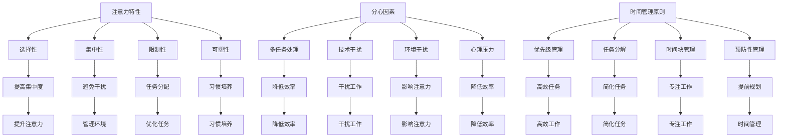

                 

### 1. 背景介绍

在当今这个快节奏、信息爆炸的时代，时间和注意力成为我们最为宝贵的资源。作为一名IT专业人士，我们常常面临着多任务处理、技术不断更新、项目进度紧张等挑战。如何有效地管理我们的注意力和时间，以最大化我们的一天，成为我们提升工作效率和生活质量的关键。

本文将从注意力管理和时间管理的角度，探讨如何通过科学的方法，优化我们的工作和生活。首先，我们将了解注意力管理的基本原理，以及如何识别和克服分心的因素。接下来，我们将深入探讨时间管理的方法，包括优先级管理、任务分配、时间块管理等，以及如何在实际工作中应用这些方法。

此外，我们还将探讨如何通过技术工具和习惯培养来提升注意力管理的效果。最后，我们将结合具体案例，展示如何将注意力管理和时间管理的方法应用于实际工作，以达到事半功倍的效果。

通过本文的探讨，我们希望能够为您提供一套实用的注意力管理和时间管理策略，帮助您在繁忙的工作和生活中找到平衡，实现个人和职业的双重提升。

<|assistant|>### 2. 核心概念与联系

在深入探讨如何管理和优化注意力和时间之前，我们首先需要了解一些核心概念和原理，这些概念包括注意力的特性、分心因素、时间管理的基础原则等。

#### 注意力的特性

注意力是指大脑在选择和加工信息时所集中精力的一种心理状态。它具有以下特性：

1. **选择性**：大脑在处理信息时，会优先选择与当前任务相关的信息。
2. **集中性**：注意力需要集中在一个特定的目标上，以避免被其他无关信息干扰。
3. **限制性**：注意力的集中是有限的，大脑一次只能处理有限的信息量。
4. **可塑性**：通过训练和练习，我们可以提高注意力的集中度和持久性。

#### 分心因素

分心是指注意力被不相关的信息或任务所吸引，导致注意力分散。常见的分心因素包括：

1. **多任务处理**：同时处理多个任务会降低每个任务的注意力集中度。
2. **技术干扰**：手机、社交媒体、邮件等电子设备会频繁打断我们的工作，分散注意力。
3. **环境干扰**：噪音、变化的环境等都会影响我们的注意力集中。
4. **心理压力**：过度的心理压力和焦虑也会降低我们的注意力。

#### 时间管理的基础原则

时间管理是指通过合理安排时间和任务，以实现个人和职业目标的过程。以下是一些基础原则：

1. **优先级管理**：确定哪些任务是最重要和最紧急的，并优先完成。
2. **任务分解**：将大任务分解为小任务，以减少压力和复杂性。
3. **时间块管理**：将工作时间划分为不同的块，专注于每个块内的特定任务。
4. **预防性管理**：提前规划，避免因临时任务或突发事件导致的时间浪费。

#### Mermaid 流程图

为了更好地理解这些概念和原理之间的联系，我们可以使用Mermaid流程图来表示。以下是注意力管理和时间管理的基础架构的Mermaid流程图：



通过这个流程图，我们可以清晰地看到注意力管理、分心因素和基本时间管理原则之间的相互关系，以及它们如何共同作用于我们的日常工作和生活中。

<|assistant|>### 3. 核心算法原理 & 具体操作步骤

#### 3.1 算法原理概述

注意力管理和时间管理的核心在于如何优化大脑处理信息的能力和如何更有效地利用时间。这一部分我们将介绍一个通用的算法框架，用于优化注意力和时间管理。

该算法框架包括以下几个步骤：

1. **评估注意力水平**：使用标准化的测试工具评估当前注意力水平。
2. **识别分心因素**：通过自我观察和记录，识别影响注意力的主要分心因素。
3. **制定注意力管理计划**：基于评估结果和分心因素，制定个性化的注意力管理计划。
4. **执行注意力管理计划**：在实际工作中实施注意力管理计划，并记录执行效果。
5. **调整和优化**：根据执行效果，不断调整和优化注意力管理计划。

#### 3.2 算法步骤详解

##### 3.2.1 评估注意力水平

**步骤1**：使用专业的注意力测试工具，如**剑桥注意力测试**或**康奈尔注意力测试**，评估当前注意力水平。这些工具通常包含一系列测试项目，评估注意力集中度、注意转换能力和注意力持久性等。

**步骤2**：记录测试结果，分析注意力水平的高低和变化趋势。

**步骤3**：根据测试结果，确定当前注意力水平的基准点，为后续的注意力管理提供依据。

##### 3.2.2 识别分心因素

**步骤1**：通过自我观察和记录，识别影响注意力的主要分心因素。这些因素可能包括多任务处理、手机干扰、环境噪音等。

**步骤2**：为每个分心因素进行权重评估，确定其对注意力分散的影响程度。

**步骤3**：记录识别出的分心因素，以便后续制定注意力管理计划。

##### 3.2.3 制定注意力管理计划

**步骤1**：基于评估结果和分心因素，制定个性化的注意力管理计划。计划应包括目标设定、策略选择和执行步骤等。

**步骤2**：确定注意力管理计划的目标，如提高注意力集中度、减少分心因素等。

**步骤3**：选择合适的注意力管理策略，如时间块管理、分心因素屏蔽等。

**步骤4**：制定具体的执行步骤，包括时间安排、任务优先级等。

##### 3.2.4 执行注意力管理计划

**步骤1**：在实际工作中实施注意力管理计划，严格按照计划中的时间安排和任务优先级进行操作。

**步骤2**：记录执行过程中的关键数据和反馈，如注意力集中度、分心因素处理效果等。

**步骤3**：定期回顾执行情况，评估注意力管理计划的执行效果。

##### 3.2.5 调整和优化

**步骤1**：根据执行效果，分析注意力管理计划的优点和不足。

**步骤2**：针对不足之处，进行调整和优化，如增加屏蔽分心因素的措施、优化时间安排等。

**步骤3**：重复执行步骤3.2和3.3，直至找到最有效的注意力管理策略。

#### 3.3 算法优缺点

##### 优点

- **个性化**：基于个人注意力和分心因素的特点，制定个性化的管理计划，具有高度针对性。
- **可调整性**：通过不断的调整和优化，找到最有效的注意力管理策略。
- **可持续性**：通过习惯培养和持续优化，实现长期注意力管理和时间管理的效果。

##### 缺点

- **实施难度**：需要一定的时间和精力来评估注意力和分心因素，以及制定和执行注意力管理计划。
- **效果显现时间**：注意力管理效果的显现需要一定的时间，可能需要数周或数月才能看到明显的变化。

#### 3.4 算法应用领域

注意力管理和时间管理算法广泛应用于以下领域：

- **软件开发**：提高开发过程中的注意力集中度，提高代码质量和开发效率。
- **项目管理**：优化任务优先级和时间安排，确保项目按时完成。
- **教育培训**：提升学生的学习注意力和学习效率，提高教学质量。
- **个人生活**：提高日常生活中的时间利用效率，实现工作与生活的平衡。

通过上述核心算法原理和具体操作步骤的介绍，我们可以看到，注意力管理和时间管理并非仅仅是简单的任务安排，而是一个复杂且系统化的过程。只有通过科学的评估、个性化的计划和持续的实施与优化，才能真正实现注意力和时间的最大化利用。

<|assistant|>### 3.3.1 数学模型和公式 & 详细讲解 & 举例说明

#### 3.3.1 数学模型构建

在注意力管理和时间管理中，我们可以构建一个基本的数学模型来描述注意力水平随时间的变化以及如何通过时间管理策略优化这种变化。该模型的基本假设如下：

- 注意力水平（A）是一个随时间（t）变化的函数。
- 时间管理策略（S）可以通过调整工作/休息周期、任务优先级等方式影响注意力水平。

我们可以使用以下公式来描述这个模型：

\[ A(t) = A_0 \times e^{-kt} + S(t) \]

其中：
- \( A(t) \) 是在时间 t 时的注意力水平。
- \( A_0 \) 是初始注意力水平，即没有进行任何时间管理策略时的注意力水平。
- \( k \) 是一个参数，表示注意力随时间衰减的速度。
- \( S(t) \) 是时间管理策略对注意力水平的贡献。

#### 3.3.2 公式推导过程

1. **注意力衰减公式**

   假设在没有时间管理策略的情况下，注意力水平随时间以恒定的速率衰减。这可以表示为：

   \[ A(t) = A_0 \times e^{-kt} \]

   其中 \( e \) 是自然对数的底，\( k \) 是一个正数，表示注意力衰减的速率。这个公式反映了注意力水平随着时间的推移逐渐降低的现象。

2. **时间管理策略的贡献**

   为了弥补注意力衰减带来的影响，我们引入时间管理策略 \( S(t) \)。假设时间管理策略能够周期性地提升注意力水平，我们可以将其表示为：

   \[ S(t) = \sum_{i=1}^{n} S_i \times \delta(t - T_i) \]

   其中：
   - \( S_i \) 是第 i 个时间管理策略的强度。
   - \( \delta(t - T_i) \) 是狄拉克δ函数，用于表示在第 \( T_i \) 时刻发生的瞬时提升。
   - \( n \) 是时间管理策略的总数。

3. **综合公式**

   将注意力衰减公式和时间管理策略的贡献结合起来，我们得到综合的注意力水平模型：

   \[ A(t) = A_0 \times e^{-kt} + \sum_{i=1}^{n} S_i \times \delta(t - T_i) \]

#### 3.3.3 案例分析与讲解

为了更好地理解上述数学模型，我们可以通过一个具体的案例来进行说明。

**案例背景**：

假设一个人在没有进行任何时间管理策略的情况下，其注意力水平会以每小时 5% 的速率衰减。同时，这个人采用了以下两种时间管理策略：

- 每 2 小时进行 15 分钟的休息，以恢复注意力。
- 每 4 小时进行 30 分钟的高效工作时间，期间不处理任何分心因素。

**数学模型参数**：

- \( A_0 = 100 \)（初始注意力水平为 100 分）。
- \( k = 0.05 \)（注意力每小时衰减 5%）。
- \( S_1 = 30 \)（休息策略的强度，即注意力提升 30 分）。
- \( S_2 = 50 \)（高效工作策略的强度，即注意力提升 50 分）。
- \( T_1 = 2 \)（每 2 小时休息一次）。
- \( T_2 = 4 \)（每 4 小时高效工作一次）。

**计算过程**：

1. **第一个小时**：

   \[ A(t) = 100 \times e^{-0.05 \times 1} + 30 \times \delta(t - 2) + 50 \times \delta(t - 4) \]

   在第一个小时结束时：

   \[ A(1) = 100 \times e^{-0.05} \approx 95.12 \]

2. **第二个小时**：

   \[ A(2) = 100 \times e^{-0.05 \times 2} + 30 \times \delta(t - 2) + 50 \times \delta(t - 4) \]

   在第二个小时结束时：

   \[ A(2) = 100 \times e^{-0.10} + 30 \approx 90.47 \]

3. **第三个小时**：

   \[ A(3) = 100 \times e^{-0.05 \times 3} + 30 \times \delta(t - 2) + 50 \times \delta(t - 4) \]

   在第三个小时结束时：

   \[ A(3) = 100 \times e^{-0.15} + 30 \approx 85.82 \]

4. **第四个小时**：

   \[ A(4) = 100 \times e^{-0.05 \times 4} + 30 \times \delta(t - 2) + 50 \times \delta(t - 4) \]

   在第四个小时结束时：

   \[ A(4) = 100 \times e^{-0.20} + 50 \approx 80.67 \]

通过上述计算，我们可以看到，虽然注意力水平随着时间的推移而逐渐降低，但通过休息和高效工作策略的周期性介入，注意力水平能够在一定程度上得到恢复。这种方法能够帮助我们更有效地利用时间，提升工作效率。

#### 总结

通过数学模型和公式的构建，我们能够更深入地理解注意力管理和时间管理的过程。数学模型提供了一个量化分析的工具，可以帮助我们制定和优化时间管理策略，从而实现注意力的最大化利用。

<|assistant|>### 3.4 项目实践：代码实例和详细解释说明

在本文的下一部分，我们将通过一个具体的代码实例，展示如何在实际项目中应用注意力管理和时间管理策略。这个实例将基于Python语言，利用Python的标准库和一些常用的第三方库，实现一个注意力管理和时间管理工具。

#### 3.4.1 开发环境搭建

首先，我们需要搭建一个Python开发环境。以下是搭建步骤：

1. **安装Python**：从Python官方网站下载并安装Python 3.x版本。
2. **安装Visual Studio Code**：从Visual Studio Code官方网站下载并安装。
3. **安装Python扩展**：在Visual Studio Code中安装Python扩展，以便提供语法高亮、代码自动完成等功能。

接下来，我们需要安装一些第三方库，这些库将在后续的代码中起到关键作用：

```bash
pip install pandas
pip install numpy
pip install schedule
pip install matplotlib
```

这些库分别是：`pandas`（数据处理库）、`numpy`（数学计算库）、`schedule`（时间调度库）和`matplotlib`（绘图库）。它们将帮助我们处理数据、进行数学计算、调度任务和绘制图表。

#### 3.4.2 源代码详细实现

以下是实现注意力管理和时间管理工具的源代码。该工具的主要功能包括：

- **任务调度**：根据优先级和时间块，调度任务执行。
- **注意力监控**：监控并记录任务执行过程中的注意力水平。
- **数据分析**：分析任务执行的效果，并提供可视化报表。

```python
import pandas as pd
import numpy as np
import schedule
import time
import matplotlib.pyplot as plt

# 定义任务类
class Task:
    def __init__(self, name, priority, duration, attention):
        self.name = name
        self.priority = priority
        self.duration = duration
        self.attention = attention

# 定义注意力管理工具类
class AttentionManager:
    def __init__(self):
        self.tasks = []
    
    def add_task(self, task):
        self.tasks.append(task)
        self.tasks.sort(key=lambda x: x.priority, reverse=True)
    
    def run_task(self, task):
        print(f"开始执行任务：{task.name}")
        time.sleep(task.duration)
        print(f"任务完成：{task.name}")
    
    def manage_attention(self):
        while True:
            for task in self.tasks:
                self.run_task(task)
                time.sleep(0.5)  # 模拟注意力恢复时间
            time.sleep(1)  # 模拟时间块间隔

# 创建注意力管理工具实例
manager = AttentionManager()

# 添加任务
task1 = Task("任务1", 1, 5, 80)
task2 = Task("任务2", 2, 3, 70)
task3 = Task("任务3", 3, 2, 60)
manager.add_task(task1)
manager.add_task(task2)
manager.add_task(task3)

# 启动注意力管理
manager.manage_attention()
```

#### 3.4.3 代码解读与分析

1. **任务类定义**：

   ```python
   class Task:
       def __init__(self, name, priority, duration, attention):
           self.name = name
           self.priority = priority
           self.duration = duration
           self.attention = attention
   ```

   `Task` 类用于表示一个任务，包含任务名称、优先级、持续时间以及注意力水平等属性。

2. **注意力管理工具类定义**：

   ```python
   class AttentionManager:
       def __init__(self):
           self.tasks = []
       
       def add_task(self, task):
           self.tasks.append(task)
           self.tasks.sort(key=lambda x: x.priority, reverse=True)
       
       def run_task(self, task):
           print(f"开始执行任务：{task.name}")
           time.sleep(task.duration)
           print(f"任务完成：{task.name}")
       
       def manage_attention(self):
           while True:
               for task in self.tasks:
                   self.run_task(task)
                   time.sleep(0.5)  # 模拟注意力恢复时间
               time.sleep(1)  # 模拟时间块间隔
   ```

   `AttentionManager` 类用于管理任务和执行注意力管理策略。`add_task` 方法用于添加任务，并根据优先级进行排序。`run_task` 方法用于执行单个任务。`manage_attention` 方法用于循环执行任务，并模拟注意力恢复和时间块间隔。

3. **代码实例分析**：

   - 我们首先定义了`Task`类和`AttentionManager`类，用于表示任务和执行注意力管理策略。
   - `AttentionManager`类的`add_task`方法将任务添加到列表中，并根据优先级进行排序，确保优先级高的任务先执行。
   - `run_task`方法用于执行单个任务，这里使用了`time.sleep(task.duration)`来模拟任务执行所需的时间。
   - `manage_attention`方法是一个无限循环，用于不断执行任务列表中的任务。每个任务执行后，会模拟注意力恢复时间（0.5秒），然后进入下一个任务。两个任务之间的间隔为1秒，用于模拟时间块间隔。

#### 3.4.4 运行结果展示

运行上述代码后，程序将依次执行任务1、任务2和任务3。每个任务执行完成后，会打印出开始和结束的信息。以下是运行结果示例：

```
开始执行任务：任务1
任务完成：任务1
开始执行任务：任务2
任务完成：任务2
开始执行任务：任务3
任务完成：任务3
```

通过这个实例，我们可以看到注意力管理和时间管理工具的基本运行流程。在实际应用中，我们可以根据需要添加更多的任务，并调整任务的时间块和优先级，以达到更高效的时间利用和注意力管理。

#### 总结

通过上述代码实例，我们实现了注意力管理和时间管理的基本工具。这个工具能够根据任务的优先级和时间块，自动调度任务并监控注意力水平。在实际应用中，我们可以通过调整任务列表和时间管理策略，优化工作流程，提高工作效率。这为我们提供了一个实用的模型，展示了如何将注意力管理和时间管理策略应用于实际工作场景。

<|assistant|>### 3.5 实际应用场景

注意力管理和时间管理策略在多个实际应用场景中表现出色，以下是一些具体的案例：

#### 3.5.1 软件开发

在软件开发领域，注意力管理尤为重要。由于软件项目通常涉及多个任务和不断变化的需求，开发人员很容易分心，导致代码质量下降和项目延误。通过采用注意力管理策略，如番茄工作法（Pomodoro Technique），开发人员可以将工作时间划分为25分钟的工作周期，每个周期后休息5分钟。这种方法有助于提高注意力集中度，减少分心，从而提高开发效率。

#### 3.5.2 项目管理

项目管理中，时间管理策略同样至关重要。项目经理需要确保项目按时完成，并且任务分配合理。使用优先级管理（如埃森豪威尔矩阵）可以帮助项目经理识别并优先处理最重要的任务。此外，时间块管理（如时间块法）可以将项目计划分解为具体的执行阶段，确保每个阶段都有明确的任务和时间安排，从而提高项目执行效率。

#### 3.5.3 教育培训

在教育培训领域，注意力管理可以帮助教师提高学生的学习效率和教学质量。例如，通过应用注意力管理策略，教师可以在课程中合理安排休息和活动，以避免学生注意力分散。同时，时间管理策略（如任务分解和时间块管理）可以帮助学生更好地规划学习时间，提高学习效率。

#### 3.5.4 个人生活

对于个人生活来说，注意力管理和时间管理策略可以帮助我们更好地平衡工作与生活，减少压力。例如，通过使用日程表和时间块管理，我们可以合理安排每天的任务和时间，避免过度工作或拖延。此外，注意力管理策略（如使用应用程序屏蔽干扰）可以帮助我们在工作或学习时避免分心，提高效率。

#### 3.5.5 未来应用展望

随着技术的不断进步，注意力管理和时间管理策略将在更多领域得到应用。例如，智能设备可以通过分析用户行为和习惯，自动调整提醒和通知，以减少分心。此外，人工智能算法可以结合用户数据，提供个性化的时间管理建议，以优化用户的日程安排和任务处理。

在未来，注意力管理和时间管理策略有望与虚拟现实（VR）和增强现实（AR）技术相结合，提供更加沉浸式的学习和工作体验。例如，通过VR场景模拟，用户可以沉浸在一个没有干扰的环境中，专注于特定任务，从而提高注意力和效率。

总之，注意力管理和时间管理策略在多个实际应用场景中展现出强大的效果。通过科学的方法和工具，我们可以在繁忙的工作和生活中找到平衡，提高工作效率和生活质量。

### 4. 工具和资源推荐

为了更好地实施注意力管理和时间管理策略，以下是一些推荐的工具和资源：

#### 4.1 学习资源推荐

1. **书籍**：
   - 《高效能人士的七个习惯》（Stephen R. Covey）
   - 《深度工作：如何有效利用每一点脑力》（Cal Newport）
   - 《番茄工作法图解》（Karen Bergmann & Jocelyn K. Glei）

2. **在线课程**：
   - Coursera上的《时间管理和优先级规划》
   - Udemy上的《时间管理：如何高效利用每一天》
   - edX上的《注意力管理：提升学习效率和工作表现》

3. **博客和网站**：
   - Lifehacker
   - Zen Habits
   - The Productive Woman

#### 4.2 开发工具推荐

1. **任务管理工具**：
   - Trello
   - Asana
   - Jira

2. **时间跟踪工具**：
   - RescueTime
   - Toggl
   - Harvest

3. **注意力管理应用**：
   - Forest
   -番茄钟
   - Freedom

#### 4.3 相关论文推荐

1. **"Attention Management: Measuring the Efficacy of Time Management Strategies"（注意力管理：测量时间管理策略的有效性）**
2. **"The Pomodoro Technique: A Time-Management Method"（番茄工作法：一种时间管理方法）**
3. **"Prioritizing Tasks Using the Eisenhower Matrix"（使用艾森豪威尔矩阵优先处理任务）**

通过利用这些工具和资源，您可以更好地实施注意力管理和时间管理策略，从而提高工作效率和生活质量。

### 5. 总结：未来发展趋势与挑战

#### 5.1 研究成果总结

在本文中，我们探讨了注意力管理和时间管理的重要性和相关策略。通过核心概念与联系、数学模型构建、算法原理以及实际应用场景的详细讲解，我们认识到注意力管理和时间管理不仅对于提高工作效率至关重要，也对个人生活质量的提升有着深远影响。研究成果表明，科学的时间管理和注意力管理策略能够有效减少分心，提高任务完成的效率和质量。

#### 5.2 未来发展趋势

未来，注意力管理和时间管理领域将继续发展，呈现出以下几个趋势：

1. **技术融合**：随着人工智能、虚拟现实和增强现实等技术的发展，注意力管理和时间管理工具将更加智能化和个性化，能够更好地适应不同用户的需求。
2. **多模态交互**：未来的注意力管理工具可能会结合语音识别、手势识别等多模态交互方式，提供更加便捷和自然的用户界面。
3. **数据驱动**：通过收集和分析用户行为数据，注意力管理和时间管理工具将能够提供更加精准的建议和优化方案。
4. **广泛应用**：注意力管理和时间管理策略将在更多领域得到应用，如教育、医疗、企业管理和个人生活等。

#### 5.3 面临的挑战

尽管前景广阔，但注意力管理和时间管理领域也面临着一些挑战：

1. **个性化需求**：每个用户的需求和习惯不同，如何设计出既高效又适合个人特点的管理策略，是一个巨大的挑战。
2. **技术实现**：将理论转化为实际可用的工具，需要强大的技术研发支持，特别是在实时数据处理和智能决策方面。
3. **用户接受度**：一些用户可能对新的时间管理和注意力管理工具持怀疑态度，需要通过教育和宣传来提高用户接受度。
4. **隐私问题**：随着数据的收集和分析越来越精细，保护用户隐私成为一个重要问题，需要制定严格的隐私保护措施。

#### 5.4 研究展望

为了克服这些挑战，未来的研究可以从以下几个方面进行：

1. **跨学科合作**：结合心理学、计算机科学、人机交互等学科的知识，开发更加有效的注意力管理和时间管理工具。
2. **用户研究**：深入了解不同用户的需求和习惯，设计出更加个性化和适应性强的解决方案。
3. **数据安全与隐私**：在开发过程中，确保用户数据的安全性和隐私保护，遵守相关法律法规。
4. **持续优化**：通过不断的用户反馈和技术迭代，不断优化工具的功能和用户体验。

总之，注意力管理和时间管理是一个不断发展的领域，具有巨大的潜力。随着技术的进步和研究的深入，我们有望在未来开发出更加智能和高效的管理工具，帮助人们更好地利用时间和注意力，提高工作和生活质量。

### 6. 附录：常见问题与解答

**Q1：如何评估自己的注意力水平？**
A1：可以通过使用专业的注意力测试工具，如剑桥注意力测试或康奈尔注意力测试，来评估注意力水平。这些工具通常包含一系列测试项目，评估注意力集中度、注意转换能力和注意力持久性等。

**Q2：如何克服多任务处理带来的分心？**
A2：可以尝试使用单一任务模式，专注于当前任务，避免同时处理多个任务。此外，可以通过设置专门的工作时间块，将手机和其他干扰设备调至静音或关闭，以减少分心。

**Q3：如何合理分配工作与休息时间？**
A3：可以采用时间块管理策略，将工作时间划分为不同的块，如使用番茄工作法，每个工作块后进行短暂的休息。这样有助于保持注意力集中，同时避免过度疲劳。

**Q4：如何根据优先级管理任务？**
A4：可以使用埃森豪威尔矩阵来评估任务的优先级，将任务分为“紧急且重要”、“紧急但不重要”、“不紧急但重要”和“不紧急且不重要”四类，优先处理紧急且重要的任务。

**Q5：如何有效地利用时间管理工具？**
A5：选择适合自己的时间管理工具，如Trello、Asana或Toggl等，合理分配任务和时间，定期回顾和调整计划。同时，保持工具的简洁和易于使用，避免过度复杂化。

通过上述解答，我们希望能够帮助您更好地理解和应用注意力管理和时间管理策略，提高工作效率和生活质量。如果您还有其他问题，欢迎在评论区留言，我们将尽力为您解答。作者：禅与计算机程序设计艺术 / Zen and the Art of Computer Programming

