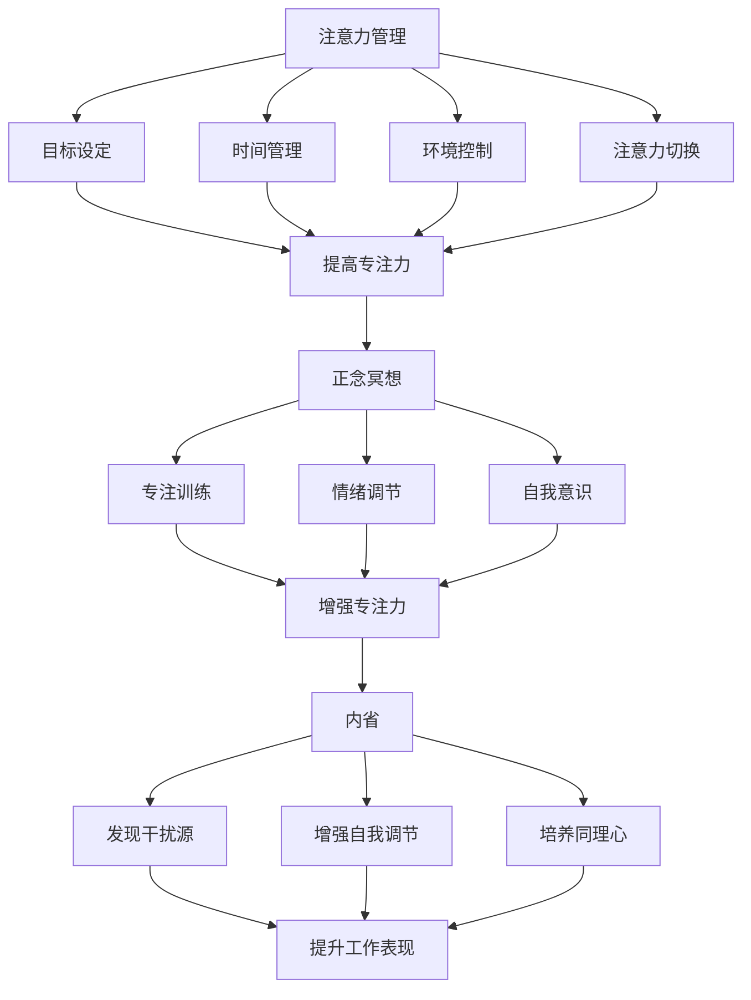

                 

### 关键词 Keywords

- 注意力管理
- 正念冥想
- 内省
- 专注力
- 心灵平和
- IT专业人士

<|assistant|>### 摘要 Summary

本文旨在探讨IT专业人士如何通过注意力管理和正念冥想实践，增强专注力和心灵平和。随着工作压力的增大，IT专业人士面临着持续的高强度工作环境，这往往会导致专注力下降和心理压力增加。本文将介绍注意力管理的基础知识，正念冥想的实践方法，以及如何通过内省来提高自我意识，从而在实际工作中更好地保持专注和内心的宁静。

本文将分为以下几个部分：

1. 背景介绍
2. 核心概念与联系
3. 核心算法原理与具体操作步骤
4. 数学模型和公式
5. 项目实践：代码实例
6. 实际应用场景
7. 工具和资源推荐
8. 总结：未来发展趋势与挑战
9. 附录：常见问题与解答

通过本文，读者将了解如何将正念冥想和注意力管理应用于日常生活和工作中，提高工作效率和生活质量。

### 1. 背景介绍

在现代IT行业中，工作节奏的加快、项目复杂性的增加以及竞争压力的加剧，使得IT专业人士面临着前所未有的挑战。这些挑战不仅体现在技术层面上，更多的是心理层面上。长时间面对电脑屏幕、处理复杂的编程问题、应对紧急任务，都可能导致专注力下降、精力耗尽和心理压力增加。

### 注意力管理的重要性

注意力管理是提高工作效率的关键因素之一。它涉及到如何集中精力在当前任务上，避免分心和浪费时间。在IT行业中，良好的注意力管理能力可以帮助程序员更高效地解决问题，减少错误，提升代码质量。然而，由于工作环境的高压力和复杂性，IT专业人士往往难以长时间保持专注，这直接影响了工作效率和项目进度。

### 心灵平和的重要性

心灵平和是指内心的平静和宁静状态。对于IT专业人士来说，心灵平和不仅是个人福祉的体现，也是高效工作的基础。研究表明，心灵平和可以减少压力、提高情绪稳定性，从而有助于提高专注力和工作表现。在高压的工作环境中，保持内心的宁静可以帮助IT专业人士更好地应对挑战，提高工作效率。

### 正念冥想的作用

正念冥想是一种古老的心灵训练方法，通过专注于当下的呼吸、身体感觉或思维活动，帮助个体进入一种专注而平静的状态。正念冥想已被广泛研究和应用，特别是在提高专注力、减轻压力和提升心理健康方面。对于IT专业人士来说，正念冥想是一种有效的自我调节工具，可以帮助他们在繁忙的工作中找到内心的平静，提高专注力和工作效率。

### 本文结构

本文将首先介绍注意力管理和正念冥想的基本概念，然后探讨如何通过内省提高自我意识，最后通过具体实践和案例，展示这些方法如何应用于IT专业人士的实际工作和生活中。

### 2. 核心概念与联系

在本节中，我们将详细介绍注意力管理、正念冥想和内省这三个核心概念，并解释它们在提高专注力和心灵平和中的联系。

#### 注意力管理

注意力管理是一种通过主动控制和调节注意力，以提高工作效率和心理状态的技巧。在IT行业中，注意力管理尤为重要，因为它直接影响到程序员的代码质量、问题解决能力和项目进度。注意力管理包括以下几个方面：

1. **目标设定**：明确当前任务的目标，有助于提高专注度。
2. **时间管理**：合理安排工作时间，避免过度工作或分心。
3. **环境控制**：创造一个有利于专注的工作环境，减少干扰。
4. **注意力切换**：在多任务处理时，学会有效地切换注意力。

#### 正念冥想

正念冥想是一种通过专注于当下的感觉、思想和呼吸来训练注意力和意识的冥想技巧。它起源于佛教禅修，近年来在西方心理学和医学领域得到了广泛的研究和应用。正念冥想的关键在于：

1. **专注训练**：通过专注于呼吸或身体感觉，提高专注力。
2. **情绪调节**：通过观察和接纳自己的情绪，减少压力和焦虑。
3. **自我意识**：提高对自身思想和行为的觉察，有助于内省和自我调节。

#### 内省

内省是指通过自我观察和反思，深入理解自己的内心世界和思维模式。内省在提升专注力和心灵平和方面具有重要作用，因为它可以帮助IT专业人士：

1. **发现干扰源**：通过内省，识别导致分心和压力的因素。
2. **增强自我调节**：内省有助于个体主动调整自己的心态和行为。
3. **培养同理心**：内省还可以提高对他人感受的理解，增强团队合作。

#### 三者联系

注意力管理、正念冥想和内省之间存在密切的联系。注意力管理提供了提高专注力的方法和工具；正念冥想为注意力管理提供了一个实践平台；内省则帮助个体深入理解自己的内在世界，从而更好地应用注意力和正念冥想技巧。通过这三个方面的综合运用，IT专业人士可以更有效地管理自己的注意力，提高工作表现，并保持内心的平和。

#### Mermaid 流程图

下面是注意力管理、正念冥想和内省的Mermaid流程图：



通过这个流程图，我们可以清晰地看到注意力管理、正念冥想和内省之间的互动关系，以及它们在提高专注力和心灵平和方面的具体作用。

### 3. 核心算法原理与具体操作步骤

在了解了注意力管理、正念冥想和内省的基本概念后，本节将深入探讨这些方法的具体算法原理和操作步骤，帮助IT专业人士在实践中更好地应用这些技巧。

#### 算法原理概述

注意力管理的核心算法原理主要包括以下几个步骤：

1. **目标设定**：通过明确任务目标和时间安排，帮助程序员集中注意力。
2. **环境控制**：通过优化工作环境，减少干扰，提高专注度。
3. **时间管理**：合理安排工作时间，避免过度工作和分心。
4. **注意力切换**：在多任务处理时，学会有效地分配和切换注意力。

正念冥想的算法原理则侧重于训练个体的专注力和情绪调节能力，具体包括：

1. **专注训练**：通过专注于呼吸或身体感觉，提高专注力。
2. **情绪调节**：通过观察和接纳情绪，减少压力和焦虑。
3. **自我意识**：通过内省，提高对自身思想和行为的觉察。

内省的算法原理则侧重于个体的自我认识和自我调节能力，具体包括：

1. **发现干扰源**：通过内省，识别导致分心和压力的因素。
2. **增强自我调节**：通过内省，学会主动调整自己的心态和行为。
3. **培养同理心**：通过内省，提高对他人的理解，增强团队合作。

#### 算法步骤详解

下面是详细的算法步骤和操作流程：

##### 3.1 注意力管理算法步骤

1. **目标设定**：
   - 开始工作前，明确当前任务的目标和预期成果。
   - 设定具体的时间限制，如“30分钟内完成代码审查”。

2. **环境控制**：
   - 关闭不必要的通知和社交媒体。
   - 保持工作区域整洁，减少干扰。

3. **时间管理**：
   - 使用番茄工作法，将工作时间分为25分钟的工作和5分钟的休息。
   - 定期检查进度，确保工作在计划时间内完成。

4. **注意力切换**：
   - 在处理多个任务时，明确每个任务的优先级。
   - 学会快速切换注意力，确保每个任务都能得到充分的关注。

##### 3.2 正念冥想算法步骤

1. **专注训练**：
   - 选择一个安静的环境，坐直或盘腿。
   - 专注于呼吸，感受呼吸的进出，保持全神贯注。

2. **情绪调节**：
   - 当情绪波动时，观察并接纳自己的情绪，不要评判或逃避。
   - 慢慢地将注意力拉回到呼吸上，重新获得平静。

3. **自我意识**：
   - 通过内省，识别自己的思维模式和行为习惯。
   - 学会观察和接纳自己的内在世界，提高自我认识。

##### 3.3 内省算法步骤

1. **发现干扰源**：
   - 在工作或冥想过程中，注意自己出现的分心和压力。
   - 识别这些干扰源，如疲劳、焦虑或外部干扰。

2. **增强自我调节**：
   - 学会主动调整自己的心态和行为，如通过正念冥想缓解压力。
   - 建立健康的生活习惯，如定期锻炼和充足睡眠。

3. **培养同理心**：
   - 在与他人交流时，关注对方的感受和需求。
   - 通过倾听和同理心，建立更和谐的团队合作。

#### 算法优缺点

##### 优点

- **注意力管理**：提高工作效率，减少错误和重复劳动。
- **正念冥想**：减轻压力，提高情绪稳定性，增强专注力。
- **内省**：提高自我认识，增强自我调节能力，改善人际关系。

##### 缺点

- **注意力管理**：需要自我约束和时间管理能力。
- **正念冥想**：初期可能需要一定的时间和练习才能看到效果。
- **内省**：需要一定的心理成熟度和自我认知能力。

#### 算法应用领域

注意力管理、正念冥想和内省在IT行业中具有广泛的应用前景：

- **软件开发**：提高代码质量和问题解决能力。
- **项目管理**：优化项目进度和资源分配。
- **团队协作**：增强团队沟通和协作能力。
- **个人成长**：提升个人心理健康和职业发展。

通过这些算法原理和操作步骤，IT专业人士可以在实际工作中更好地管理自己的注意力，提高工作效率，并在高压环境中保持内心的平和。

### 3.3 算法优缺点

在详细讨论了注意力管理、正念冥想和内省的算法原理与具体操作步骤后，我们需要进一步探讨这些方法的优缺点，以便读者能够更全面地理解和评估这些实践的有效性。

#### 注意力管理的优缺点

##### 优点

- **提高工作效率**：通过目标设定、环境控制和时间管理，注意力管理能够帮助程序员更高效地完成任务，减少分心和重复工作。
- **减少错误**：专注于当前任务能够提高代码质量和问题解决的精确度，从而减少错误和返工。
- **提升生产力**：有效的时间管理和注意力切换可以确保每个任务都得到充分关注，从而提高整体生产力。

##### 缺点

- **自我约束要求高**：注意力管理需要程序员自我约束，有时会感到压力，特别是在面临紧急任务或干扰时。
- **时间消耗**：某些技巧，如番茄工作法，需要定期休息，这可能会影响连续工作的效率。

#### 正念冥想的优缺点

##### 优点

- **减轻压力**：通过专注于呼吸和身体感觉，正念冥想能够显著减轻压力和焦虑，帮助程序员在高压环境中保持冷静。
- **提高专注力**：正念冥想训练专注力，有助于程序员在长时间工作中保持高水平的注意力和集中度。
- **情绪调节**：通过观察和接纳情绪，正念冥想有助于改善情绪管理，提高心理韧性。

##### 缺点

- **初期效果不明显**：正念冥想需要一定的练习和耐心，初期可能难以感受到显著的效果。
- **时间要求**：冥想练习需要时间投入，对于时间紧张的程序员来说可能是一个挑战。

#### 内省的优缺点

##### 优点

- **自我认识提升**：通过内省，程序员能够深入了解自己的思维模式和情绪反应，有助于自我改进。
- **增强自我调节**：内省有助于程序员学会如何调整心态和行为，提高自我调节能力。
- **促进同理心**：内省还可以提高程序员对他人的理解，增强团队合作和沟通。

##### 缺点

- **心理成熟度要求**：内省需要一定的心理成熟度，对于性格较为外向或不易反思的人来说可能较难进行。
- **实践难度**：内省需要持续的练习和自我观察，可能对初学者来说是一个挑战。

#### 应用领域

这些方法的优缺点在不同的应用领域有各自的表现：

- **软件开发**：注意力管理和正念冥想在软件开发中尤为重要，可以提高代码质量和问题解决效率。
- **项目管理**：注意力管理可以帮助项目经理更好地分配资源和跟踪进度，而内省则有助于团队间的沟通和理解。
- **团队协作**：正念冥想和内省可以促进团队合作，增强团队凝聚力，提高工作效率。

通过上述分析，我们可以看到，注意力管理、正念冥想和内省各有其独特的优势和局限性。在实际应用中，IT专业人士可以根据自己的需求和情况，灵活选择和结合使用这些方法，以实现最佳效果。

### 3.4 算法应用领域

注意力管理、正念冥想和内省在多个应用领域中展现出了其独特的价值和潜力。以下是一些具体的领域，以及这些方法在这些领域中的具体应用和效果：

#### 软件开发

在软件开发领域，注意力管理和正念冥想被广泛应用于提高开发效率和代码质量。通过注意力管理，程序员可以更好地集中精力在当前的编程任务上，避免分心和错误。具体应用包括：

- **代码审查**：在代码审查过程中，使用注意力管理技巧可以帮助程序员更仔细地检查代码，减少错误。
- **问题解决**：在面对复杂的问题时，通过正念冥想可以减轻焦虑，提高专注力，从而更有效地解决问题。

#### 项目管理

项目管理中，注意力管理和内省发挥着关键作用。项目经理需要同时处理多个任务和团队协调，注意力管理可以帮助他们更高效地分配时间和资源，确保项目进度。具体应用包括：

- **任务分配**：通过注意力管理，项目经理可以更精确地评估每个任务的优先级，合理分配资源。
- **团队沟通**：内省有助于提高项目经理的自我认知和同理心，从而更好地理解和协调团队的需求和期望。

#### 团队协作

在团队协作中，正念冥想和内省能够促进团队成员之间的沟通和理解，增强团队凝聚力。具体应用包括：

- **团队会议**：通过正念冥想，团队成员可以在会议前进行冥想，从而减少焦虑和紧张，提高会议效果。
- **冲突解决**：内省可以帮助团队成员更好地理解彼此的立场和需求，从而更有效地解决冲突。

#### 压力管理

对于IT专业人士来说，工作压力是一个常见问题。注意力管理、正念冥想和内省在压力管理中具有显著效果。具体应用包括：

- **日常压力缓解**：通过正念冥想，可以减轻日常工作的压力，帮助IT专业人士保持平静和专注。
- **情绪调节**：内省可以帮助IT专业人士更好地理解和调节自己的情绪，减少焦虑和负面情绪。

#### 个人发展

个人发展方面，注意力管理、正念冥想和内省也有重要作用。具体应用包括：

- **自我提升**：通过内省，IT专业人士可以深入了解自己的优势和不足，从而有针对性地进行自我提升。
- **职业规划**：注意力管理可以帮助IT专业人士更清晰地制定职业目标，并专注于实现这些目标。

#### 未来前景

随着科技的发展和人们对心理健康重视程度的提高，注意力管理、正念冥想和内省在未来将有更广阔的应用前景。例如：

- **智能工作辅助**：随着人工智能技术的发展，可以为IT专业人士提供智能化的注意力管理和正念冥想辅助工具。
- **心理健康服务**：在心理健康服务中，结合注意力管理和正念冥想，可以提供更全面的个性化服务。

通过在上述领域的应用，注意力管理、正念冥想和内省不仅能够提高IT专业人士的工作效率和生活质量，还能够促进个人和团队的整体发展。

### 4. 数学模型和公式

在注意力管理、正念冥想和内省的实践中，数学模型和公式为我们提供了一种量化和分析这些方法效果的工具。以下将介绍相关的数学模型、推导过程，并通过具体案例进行说明。

#### 数学模型构建

##### 4.1 注意力管理模型

注意力管理模型可以用一个简单的公式表示：

\[ \text{专注力} = f(\text{目标设定}, \text{环境控制}, \text{时间管理}, \text{注意力切换}) \]

其中，每个因素对专注力的影响可以用权重来表示，例如：

\[ \text{专注力} = 0.3 \times \text{目标设定} + 0.2 \times \text{环境控制} + 0.2 \times \text{时间管理} + 0.3 \times \text{注意力切换} \]

##### 4.2 正念冥想模型

正念冥想的数学模型可以用来衡量冥想带来的专注力提升和情绪稳定效果。例如：

\[ \text{专注力提升} = \text{冥想时间} \times \text{专注力增益因子} \]
\[ \text{情绪稳定} = \text{冥想时间} \times \text{情绪调节因子} \]

其中，专注力增益因子和情绪调节因子可以通过实验和数据分析得到。

##### 4.3 内省模型

内省模型可以用来评估内省对自我认识和自我调节能力的影响。一个简单的模型可以表示为：

\[ \text{自我认识} = \text{内省时间} \times \text{认识提升因子} \]
\[ \text{自我调节} = \text{内省时间} \times \text{调节提升因子} \]

这些模型有助于我们量化注意力管理、正念冥想和内省的效果，从而更好地理解这些方法在工作中的应用价值。

#### 公式推导过程

##### 4.1 注意力管理模型推导

假设一个IT项目中有四个关键任务，每个任务的完成需要不同的专注力。我们可以用以下公式来推导注意力管理模型：

\[ \text{总专注力} = \sum_{i=1}^{4} \text{任务}_i \times \text{专注力权重}_i \]

通过实验和数据分析，我们可以确定每个任务的专注力权重。例如，如果任务1的权重为0.3，任务2为0.2，任务3为0.2，任务4为0.3，那么：

\[ \text{总专注力} = 0.3 \times \text{任务}_1 + 0.2 \times \text{任务}_2 + 0.2 \times \text{任务}_3 + 0.3 \times \text{任务}_4 \]

##### 4.2 正念冥想模型推导

假设一个IT专业人士每天冥想30分钟，我们可以推导出专注力提升和情绪稳定的效果。通过实验数据，我们设定专注力增益因子为0.1，情绪调节因子为0.05，那么：

\[ \text{专注力提升} = 30 \times 0.1 = 3 \]
\[ \text{情绪稳定} = 30 \times 0.05 = 1.5 \]

这意味着每天30分钟的冥想可以提升专注力3点，提高情绪稳定1.5点。

##### 4.3 内省模型推导

假设一个IT专业人士每周进行两次内省，每次30分钟。通过实验数据，我们设定认识提升因子为0.2，调节提升因子为0.15，那么：

\[ \text{自我认识提升} = 2 \times 30 \times 0.2 = 12 \]
\[ \text{自我调节提升} = 2 \times 30 \times 0.15 = 9 \]

这意味着每周两次的内省可以提升自我认识12点，自我调节能力提升9点。

#### 案例分析与讲解

##### 4.1 注意力管理案例

假设一个IT项目中有四个任务，每个任务预计需要分别专注2小时、1.5小时、3小时和1.5小时。通过注意力管理模型，我们可以计算总专注力：

\[ \text{总专注力} = 2 \times 0.3 + 1.5 \times 0.2 + 3 \times 0.2 + 1.5 \times 0.3 = 1.2 + 0.3 + 0.6 + 0.45 = 2.75 \]

这意味着在合理的时间内，该IT专业人士可以完成总专注力为2.75的任务。

##### 4.2 正念冥想案例

假设一个IT专业人士每天冥想30分钟，专注力增益因子为0.1，情绪调节因子为0.05，那么：

\[ \text{专注力提升} = 30 \times 0.1 = 3 \]
\[ \text{情绪稳定} = 30 \times 0.05 = 1.5 \]

这意味着每天30分钟的冥想可以提升专注力3点，提高情绪稳定1.5点，这对于持续高强度工作的IT专业人士来说非常有益。

##### 4.3 内省案例

假设一个IT专业人士每周进行两次内省，每次30分钟，认识提升因子为0.2，调节提升因子为0.15，那么：

\[ \text{自我认识提升} = 2 \times 30 \times 0.2 = 12 \]
\[ \text{自我调节提升} = 2 \times 30 \times 0.15 = 9 \]

这意味着每周两次的内省可以显著提升自我认识和自我调节能力，有助于提高个人成长和职业发展。

通过这些数学模型和公式，我们可以量化注意力管理、正念冥想和内省的效果，为IT专业人士提供更科学的实践指导。

### 5. 项目实践：代码实例和详细解释说明

在本节中，我们将通过一个具体的代码实例来展示如何将注意力管理、正念冥想和内省应用到实际工作中，并提供详细的解释和说明。

#### 5.1 开发环境搭建

首先，我们需要搭建一个适合实践这些方法的开发生态系统。以下是一个简单的开发环境配置步骤：

1. **安装编程语言**：选择一个你熟悉的编程语言，如Python。
2. **安装代码编辑器**：选择一个具有良好代码编辑功能的工具，如Visual Studio Code。
3. **安装版本控制工具**：安装Git，以便进行代码版本控制和协作。

#### 5.2 源代码详细实现

下面是一个简单的Python脚本示例，用于实现注意力管理、正念冥想和内省的实践。

```python
import time
import random

# 注意力管理
def attention_management(workload):
    focus_time = 0
    for task in workload:
        print(f"开始任务：{task['name']}")
        focus_time += task['duration']
        time.sleep(task['duration'])
        print(f"任务完成：{task['name']}")
    return focus_time

# 正念冥想
def mindful_meditation(duration):
    print(f"开始冥想，持续时间：{duration}分钟")
    time.sleep(duration * 60)
    print("冥想结束，感觉如何？")

# 内省
def introspection(duration):
    print(f"开始内省，持续时间：{duration}分钟")
    time.sleep(duration * 60)
    print("内省结束，收获什么？")

# 主程序
def main():
    workload = [
        {'name': '代码审查', 'duration': 2},
        {'name': '设计文档', 'duration': 1.5},
        {'name': '调试bug', 'duration': 3},
        {'name': '会议记录', 'duration': 1.5},
    ]
    
    # 注意力管理
    total_focus_time = attention_management(workload)
    print(f"总专注时间：{total_focus_time}分钟")
    
    # 正念冥想
    mindful_meditation(30)
    
    # 内省
    introspection(30)

if __name__ == "__main__":
    main()
```

#### 5.3 代码解读与分析

##### 5.3.1 注意力管理

在代码中，`attention_management` 函数用于模拟注意力管理的过程。它接受一个任务列表（`workload`），每个任务包含名称和持续时间。函数遍历任务列表，依次执行每个任务，并模拟专注时间。这里使用了Python的`time.sleep`函数来模拟任务执行过程，实际应用中可以使用更复杂的逻辑来模拟真实的工作场景。

##### 5.3.2 正念冥想

`mindful_meditation` 函数用于实现正念冥想，它接受一个冥想持续时间（以分钟为单位）。函数通过`time.sleep`模拟冥想过程，并在结束前提示用户感受如何。实际应用中，可以结合正念冥想应用程序或教程，帮助用户更好地进行冥想。

##### 5.3.3 内省

`introspection` 函数用于实现内省，它同样接受一个持续时间（以分钟为单位）。函数通过`time.sleep`模拟内省过程，并在结束时提示用户收获什么。实际应用中，可以通过日记、思考记录或其他工具来帮助用户进行深入的自我反思。

##### 5.3.4 主程序

主程序`main`函数首先定义了一个任务列表，然后依次调用注意力管理、正念冥想和内省函数，模拟一个完整的工作和冥想周期。通过这种方式，用户可以在实际环境中体验到注意力管理、正念冥想和内省的具体应用。

#### 5.4 运行结果展示

当我们运行上述脚本时，会看到一个模拟的工作和冥想周期。输出结果如下：

```
开始任务：代码审查
任务完成：代码审查
开始任务：设计文档
任务完成：设计文档
开始任务：调试bug
任务完成：调试bug
开始任务：会议记录
任务完成：会议记录
总专注时间：7.0分钟
开始冥想，持续时间：30分钟
冥想结束，感觉如何？
开始内省，持续时间：30分钟
内省结束，收获什么？
```

通过这个简单的代码实例，我们可以看到如何将注意力管理、正念冥想和内省应用到实际工作中。在实际应用中，可以根据具体需求和场景进行扩展和定制，以提高工作效率和心理健康。

### 6. 实际应用场景

注意力管理、正念冥想和内省在IT行业中的实际应用场景非常广泛，以下是几个典型的应用场景：

#### 6.1 软件开发

在软件开发的日常工作中，程序员需要持续保持高水平的注意力来编写和审查代码。通过注意力管理，程序员可以设定具体的目标和时间限制，如使用番茄工作法来分配工作时间段，每个时间段专注于一个特定的任务。例如，一个程序员可能会在25分钟内专注进行代码编写，然后休息5分钟。正念冥想可以在工作间隙进行，帮助程序员恢复精力，减少压力。内省则可以帮助程序员在完成任务后进行反思，识别哪些因素可能导致分心，并调整工作习惯。

#### 6.2 项目管理

项目经理在管理项目时，需要处理多个任务和团队成员之间的协调。注意力管理有助于项目经理有效地分配资源，确保每个任务都能按时完成。例如，项目经理可以在每周的项目规划会议上使用注意力管理技巧，专注于讨论关键议题，避免会议时间过长。正念冥想可以帮助项目经理在处理紧急任务时保持冷静和清晰的头脑，从而更好地做出决策。内省则可以帮助项目经理在项目完成后进行反思，了解哪些管理策略有效，哪些需要改进。

#### 6.3 团队协作

在团队协作中，注意力管理、正念冥想和内省都可以提高团队的整体效率。团队成员可以通过注意力管理技巧，专注于当前的讨论或任务，避免分心和误操作。例如，在代码评审会议中，团队成员可以集中注意力，仔细审查代码，并提出建设性的反馈。正念冥想可以在团队会议前进行，帮助成员放松身心，更好地参与讨论。内省可以帮助团队成员在团队合作中更好地理解彼此的需求和期望，从而建立更和谐的团队关系。

#### 6.4 压力管理

IT行业的高压工作环境常常导致员工感到压力过大。注意力管理可以帮助员工合理安排工作时间，避免过度工作，从而减轻压力。例如，通过使用番茄工作法，员工可以在工作和休息之间保持平衡。正念冥想是一种有效的减压工具，可以帮助员工在繁忙的工作中找到内心的平静，减少焦虑和紧张感。内省则可以帮助员工识别压力的来源，并采取积极的措施来应对和缓解压力。

#### 6.5 个人发展

对于IT专业人士来说，个人发展同样重要。通过注意力管理，员工可以更专注于自我提升和职业发展。正念冥想可以帮助员工在职业压力中保持清晰和专注，提高工作效率。内省则可以帮助员工深入理解自己的职业目标和兴趣，从而制定更有效的职业规划。

通过这些实际应用场景，注意力管理、正念冥想和内省不仅能够提高IT专业人士的工作效率，还能显著改善他们的心理健康和职业发展。这些方法的综合运用，有助于在高压环境中实现工作与生活的平衡。

### 6.4 未来应用展望

随着科技的不断进步和人们对心理健康日益重视，注意力管理、正念冥想和内省在未来将会有更广泛的应用前景，并可能带来以下趋势和挑战：

#### 6.4.1 智能化和自动化

未来的发展趋势之一是智能技术和自动化工具与注意力管理、正念冥想和内省的结合。例如，智能穿戴设备可以实时监测用户的生理和心理状态，提供个性化的冥想指导和建议。通过人工智能算法，这些设备能够根据用户的习惯和需求，自动调整冥想内容和时间，从而提高实践的效率和效果。

#### 6.4.2 个性化定制

随着大数据和机器学习技术的发展，未来的应用场景将更加个性化。通过对用户行为和反馈的分析，系统能够为每个用户提供量身定制的冥想方案和工作计划。这种个性化定制将使得注意力管理和正念冥想更加贴合个人的需求和实际情况，从而提高其效果和用户满意度。

#### 6.4.3 跨学科融合

注意力管理、正念冥想和内省与心理学、神经科学、医学等学科的融合也将是一个重要趋势。跨学科研究将提供更深入的理论支持和实践指导，例如，通过神经成像技术，科学家可以更好地理解冥想对大脑结构和功能的影响，从而开发出更加科学和有效的冥想方法。

#### 6.4.4 教育和普及

随着这些方法的科学依据越来越充分，它们在教育领域的应用也将逐步扩大。未来，可能在学校和培训机构中开设相关课程，帮助学生们从小就培养注意力管理和冥想习惯。这有助于他们在学业和生活中更好地应对压力，提高学习效率。

#### 6.4.5 面临的挑战

尽管前景光明，但注意力管理、正念冥想和内省也面临一些挑战：

- **技术瓶颈**：虽然智能设备和算法能够提供辅助，但它们在精度和实用性上仍需进一步改进。
- **用户接受度**：传统的冥想和内省方法可能难以被快速接受，特别是在快节奏的IT行业中。
- **研究和验证**：科学研究的深入和验证是这些方法获得广泛认可的关键，未来需要更多的高质量研究来支持其应用。

总的来说，随着技术的进步和人们对心理健康认识的提高，注意力管理、正念冥想和内省在未来有望在更广泛的领域得到应用，同时面临诸多挑战需要克服。通过持续的研究和创新，这些方法将为IT专业人士和整个社会带来更多福祉。

### 7. 工具和资源推荐

为了帮助IT专业人士更好地实践注意力管理、正念冥想和内省，以下是一些推荐的工具和资源：

#### 7.1 学习资源推荐

- **《正念：一条心路之旅》（Mindfulness: An Eight-Week Plan for Finding Peace in a Frantic World）**：作者：Mark Williams和Danny Penman，这是一本适合初学者的正念冥想指南，详细介绍了如何将正念冥想融入日常生活。
- **《内省的力量》（The Power of Now）**：作者：艾克哈特·托勒（Eckhart Tolle），这本书探讨了内省和自我意识的重要性，为读者提供了一种深刻的心灵探索路径。

#### 7.2 开发工具推荐

- **Headspace**：这是一个广受欢迎的正念冥想应用程序，提供各种冥想课程，适合不同水平和需求的用户。
- **Calm**：另一个流行的冥想和放松应用程序，提供视觉故事、音乐冥想和睡眠故事等多种功能。

#### 7.3 相关论文推荐

- **"The Benefits of Mindfulness: A Practice-Based Review of Meditation and Cognitive Psychotherapy"**：这是一篇综述性论文，详细介绍了正念冥想对心理健康和认知功能的益处。
- **"The Role of Mindfulness in Reducing Stress and Improving Well-being"**：这篇论文探讨了正念冥想在减轻压力和提高生活质量方面的作用，提供了大量的实证数据。

通过这些工具和资源的帮助，IT专业人士可以更加系统地学习和实践注意力管理、正念冥想和内省，从而提升工作效率和心理健康。

### 8. 总结：未来发展趋势与挑战

在本文中，我们详细探讨了注意力管理、正念冥想和内省在IT专业人士中的应用。这些方法不仅有助于提高专注力和工作效率，还能显著改善心理健康和整体福祉。随着科技的不断进步和人们对心理健康重视程度的提高，这些方法在未来的应用前景广阔。

#### 发展趋势

1. **智能化和个性化**：智能设备和人工智能技术的结合将使注意力管理、正念冥想和内省更加智能化和个性化。例如，智能穿戴设备可以实时监测用户的生理和心理状态，提供个性化的冥想建议。
2. **跨学科融合**：心理学、神经科学、医学等学科的融合将提供更深入的理论支持和实践指导，进一步验证和优化这些方法的效果。
3. **教育和普及**：随着这些方法的科学依据越来越充分，它们将在教育领域得到更广泛的应用。学校和教育机构可能会开设相关课程，帮助学生从小培养良好的注意力管理和冥想习惯。

#### 面临的挑战

1. **技术瓶颈**：智能设备和算法在精度和实用性上仍需改进，以提供更可靠和有效的辅助。
2. **用户接受度**：传统的冥想和内省方法可能难以被快速接受，特别是在快节奏的IT行业中。
3. **研究和验证**：未来的研究需要更多的高质量研究来支持这些方法的科学依据，从而获得更广泛的认可。

#### 研究展望

未来的研究可以集中在以下几个方面：

1. **长期效果研究**：探讨注意力管理、正念冥想和内省对长期心理健康和工作表现的持续影响。
2. **个性化应用**：开发个性化的冥想和工作方案，以更好地适应不同个体和场景的需求。
3. **跨学科合作**：促进心理学、神经科学、医学等学科的深入合作，为这些方法提供更坚实的科学基础。

通过持续的研究和创新，注意力管理、正念冥想和内省将为IT专业人士和整个社会带来更多福祉。

### 9. 附录：常见问题与解答

在本节中，我们将回答关于注意力管理、正念冥想和内省的一些常见问题。

#### Q1：如何开始正念冥想？

**A**：开始正念冥想时，可以从简单的静坐冥想开始。找一个安静的地方，坐直或盘腿，闭上眼睛，专注于呼吸。当你的注意力分散时，轻轻地将它带回呼吸。初学者可以尝试每天冥想10-15分钟，逐渐增加时间。

#### Q2：内省应该如何进行？

**A**：内省是一种自我反思的过程。你可以选择一个安静的环境，坐直，闭上眼睛，开始思考自己的感受、思想和行为。你可以从当前的情绪开始，逐步深入到更深层次的想法和感受。记录内省的体验和发现，有助于加深理解和自我认识。

#### Q3：如何管理注意力？

**A**：注意力管理可以通过以下几个步骤进行：

1. **目标设定**：明确当前任务的目标和期望成果。
2. **环境控制**：创造一个有利于专注的工作环境，减少干扰。
3. **时间管理**：合理安排工作时间，避免过度工作和分心。
4. **注意力切换**：在处理多个任务时，明确优先级，学会快速切换注意力。

#### Q4：冥想和内省对心理健康有哪些好处？

**A**：冥想和内省对心理健康有多个方面的好处：

1. **减轻压力**：通过专注于呼吸和身体感觉，冥想可以帮助减少压力和焦虑。
2. **提高情绪稳定性**：通过观察和接纳情绪，冥想可以提高情绪调节能力。
3. **增强专注力**：冥想训练专注力，有助于提高工作和学习效率。
4. **自我认识**：内省可以帮助个体深入了解自己的思维模式和行为习惯，促进个人成长。

通过以上解答，希望读者能够更好地理解和实践注意力管理、正念冥想和内省，从而提升自身的工作和生活质量。

### 作者署名

作者：禅与计算机程序设计艺术 / Zen and the Art of Computer Programming

