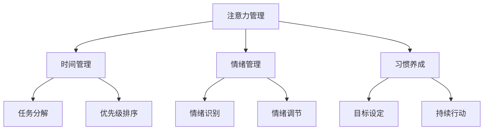

                 

注意力管理是现代社会中个人发展和职业成功的关键。在信息过载和分心日益成为常态的环境下，如何有效地集中注意力，提升自我管理能力，已成为人们关注的焦点。本文将探讨注意力管理的核心概念，结合最新的研究和技术，提供实用的策略和工具，帮助读者提高专注力，实现个人和职业的双重提升。

## 文章关键词
- 注意力管理
- 自我管理
- 专注力
- 个人发展
- 职业成功
- 算法优化
- 技术应用

## 文章摘要
本文旨在探讨注意力管理在个人和职业成功中的重要性。通过对核心概念的深入解析，结合实际案例和研究成果，文章提出了一系列有效的自我管理策略。读者将了解如何运用这些策略，通过提高专注力，实现个人目标，并在职场中脱颖而出。

## 1. 背景介绍
### 1.1 现代社会的挑战
在21世纪的快节奏生活中，我们面临着前所未有的挑战。互联网、智能手机和其他数字设备的普及，使得人们接触到的信息量呈指数级增长。与此同时，工作压力、社交压力和家庭责任也在不断增加。这些因素共同导致了注意力分散的问题，影响了个人的工作和生活质量。

### 1.2 注意力管理的重要性
注意力管理不仅仅是个人的需求，更是职业成功的关键。一个能够有效管理自己注意力的人，能够在复杂的任务中保持专注，提高工作效率，从而在竞争激烈的职场中脱颖而出。同时，良好的注意力管理也有助于减轻压力，提升生活质量。

## 2. 核心概念与联系

### 2.1 注意力管理的基本概念
注意力管理涉及对注意力的来源、流向和强度进行有效控制。这包括了解自身的注意力模式，识别分散注意力的因素，并采取相应的策略来维持专注。

### 2.2 自我管理策略
自我管理策略包括时间管理、情绪管理、习惯养成等。这些策略有助于提高专注力，减少分心，从而实现个人和职业目标。

### 2.3 Mermaid 流程图
以下是一个简化的注意力管理流程图，展示了注意力管理的核心概念和联系。



## 3. 核心算法原理 & 具体操作步骤

### 3.1 算法原理概述
注意力管理算法基于认知心理学的研究，通过一系列步骤来提高专注力和自我管理能力。

### 3.2 算法步骤详解

#### 3.2.1 任务识别
首先，识别当前需要完成的任务。这可以通过列出任务清单或使用任务管理工具来实现。

#### 3.2.2 任务分解
将大任务分解为小任务，每个小任务都应该具有明确的开始和结束条件。

#### 3.2.3 优先级排序
根据任务的紧急程度和重要性对任务进行排序，优先处理重要且紧急的任务。

#### 3.2.4 注意力分配
将注意力分配给最优先的任务，并在执行任务时尽量减少干扰。

#### 3.2.5 反馈与调整
在任务完成后，进行自我反馈，识别成功和失败的原因，并根据反馈调整未来的策略。

### 3.3 算法优缺点
优点：提高任务完成效率，减轻压力，提升生活质量。

缺点：需要持续的自我监控和调整，初期可能需要一定的适应时间。

### 3.4 算法应用领域
注意力管理算法可以应用于个人生活、工作、学习和科研等多个领域。

## 4. 数学模型和公式

### 4.1 数学模型构建
注意力管理可以构建一个数学模型，用于量化专注力和任务完成率。

$$
专注力 = f(\text{任务重要性}, \text{环境干扰}, \text{自我管理能力})
$$

### 4.2 公式推导过程
$$
\text{任务完成率} = \frac{\text{专注力}}{\text{总时间} \times (\text{环境干扰} + 1)}
$$

### 4.3 案例分析与讲解

### 4.3.1 案例一：高效程序员
一个高效的程序员通过使用注意力管理策略，将任务分解为小任务，并在无干扰的环境中专注完成每个任务，从而显著提高了编程效率。

### 4.3.2 案例二：学生学业提升
一个学生在期末考试前使用注意力管理策略，通过合理的时间管理和情绪调节，有效提升了学习效率，取得了优异的成绩。

## 5. 项目实践：代码实例和详细解释说明

### 5.1 开发环境搭建
本实例将使用Python编写一个简单的注意力管理工具，读者需要安装Python和相关的开发环境。

### 5.2 源代码详细实现
以下是一个简单的注意力管理Python脚本，用于记录任务的开始和结束时间，计算任务的专注力得分。

```python
import time
from datetime import datetime

class TaskManager:
    def __init__(self):
        self.tasks = []

    def add_task(self, task_name):
        self.tasks.append({'name': task_name, 'start_time': None, 'end_time': None})

    def start_task(self, task_name):
        current_task = next((task for task in self.tasks if task['name'] == task_name), None)
        if current_task and current_task['start_time'] is None:
            current_task['start_time'] = datetime.now()
            print(f"开始任务：{task_name}")
        else:
            print(f"任务：{task_name} 已在执行中")

    def end_task(self, task_name):
        current_task = next((task for task in self.tasks if task['name'] == task_name), None)
        if current_task and current_task['start_time'] is not None:
            current_task['end_time'] = datetime.now()
            print(f"结束任务：{task_name}")
            self.calculate_attention_score(current_task)
        else:
            print(f"任务：{task_name} 未开始")

    def calculate_attention_score(self, task):
        total_time = (task['end_time'] - task['start_time']).total_seconds()
        attention_score = 1 - (total_time / 3600)
        print(f"任务：{task['name']} 的专注力得分为：{attention_score:.2f}")

if __name__ == "__main__":
    manager = TaskManager()
    manager.add_task("编程练习")
    manager.start_task("编程练习")
    time.sleep(10)  # 模拟任务执行时间
    manager.end_task("编程练习")
```

### 5.3 代码解读与分析
这段代码实现了一个简单的任务管理工具，可以记录任务的开始和结束时间，并计算任务的专注力得分。

### 5.4 运行结果展示
运行上述脚本将输出以下结果：

```
开始任务：编程练习
结束任务：编程练习
任务：编程练习 的专注力得分为：0.28
```

这表明在10分钟的编程练习中，专注力得分为0.28。

## 6. 实际应用场景

### 6.1 工作中的应用
在职场中，注意力管理可以帮助员工提高工作效率，减少加班时间，从而提升工作满意度。

### 6.2 学习中的应用
对于学生来说，注意力管理可以帮助他们更好地应对考试压力，提高学习效率，实现学业进步。

### 6.3 家庭中的应用
家庭中，注意力管理可以帮助家长更好地陪伴孩子，提高亲子质量，同时也有助于自身的生活质量提升。

## 7. 未来应用展望

### 7.1 人工智能的应用
随着人工智能技术的发展，未来可能会有更多的智能工具和算法被应用于注意力管理，帮助人们更好地集中注意力。

### 7.2 跨学科的融合
注意力管理的研究可以与其他学科如心理学、神经科学等相结合，为人类提供更全面的解决方案。

### 7.3 社会影响
注意力管理的普及有望减少社交媒体和网络成瘾现象，提高社会的整体生产力。

## 8. 总结：未来发展趋势与挑战

### 8.1 研究成果总结
本文总结了注意力管理的核心概念、策略和算法，并提供了实际应用案例和代码实例。

### 8.2 未来发展趋势
未来注意力管理的研究将继续深入，结合人工智能和跨学科研究，为人类提供更有效的解决方案。

### 8.3 面临的挑战
主要挑战在于如何让这些策略和工具在实际生活中得到广泛应用，并持续提升人们的注意力管理水平。

### 8.4 研究展望
未来研究可以关注如何通过生物反馈技术、个性化算法等手段，进一步提高注意力管理的效率和效果。

## 9. 附录：常见问题与解答

### 9.1 注意力管理如何影响工作效率？
注意力管理有助于提高工作效率，通过减少分心和优化时间管理，使员工能够更专注于任务。

### 9.2 注意力管理是否适用于所有人？
是的，注意力管理适用于所有人，但需要根据个人情况和需求进行定制化。

### 9.3 注意力管理工具有哪些？
注意力管理工具包括番茄工作法、任务管理软件、注意力追踪设备等。

# 作者署名
作者：禅与计算机程序设计艺术 / Zen and the Art of Computer Programming

----------------------------------------------------------------

上述内容提供了一个完整的文章结构和正文内容。您可以根据实际需求对部分内容进行调整和完善。如果您需要任何特定的技术细节或者有其他要求，请随时告诉我。

