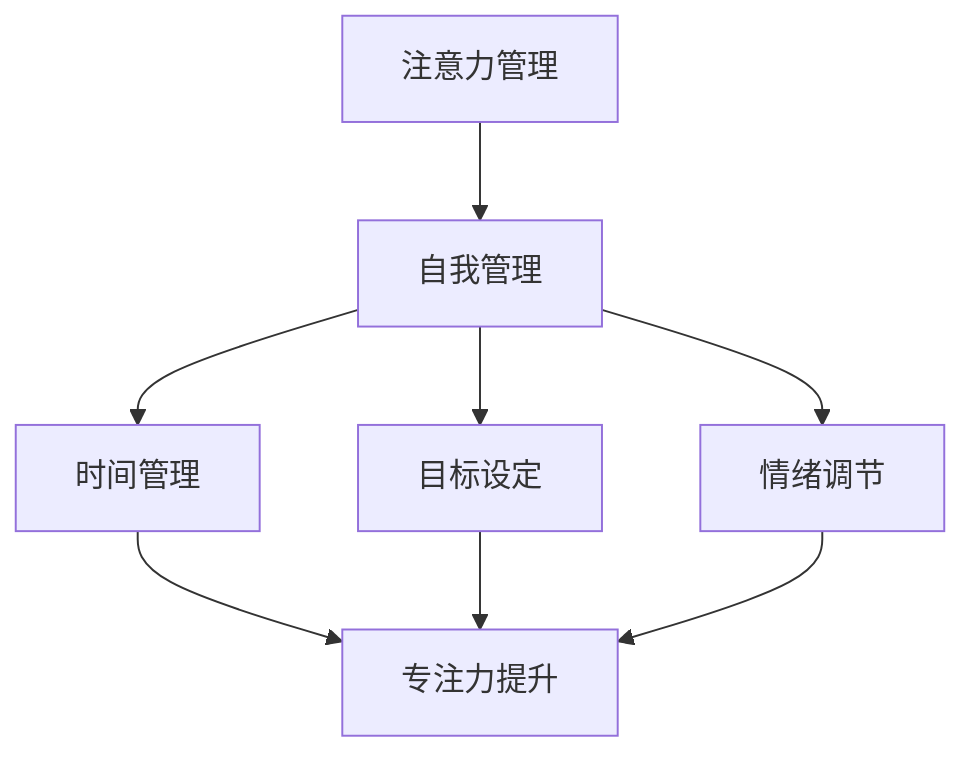

                 

关键词：注意力管理、自我管理、专注力、个人成长、职业发展、效率提升

> 摘要：在快节奏的现代生活中，注意力分散已成为影响个人和职业成功的普遍问题。本文将探讨注意力管理与自我管理的核心概念、原理和策略，通过具体的算法、数学模型和代码实例，提供一套全面的提升专注力和效率的方法，以帮助读者在个人和职业生活中取得更大成功。

## 1. 背景介绍

在当今数字化、信息爆炸的时代，人们面临的信息量前所未有。据研究，人类每天接触的信息量是数百年前的总和，这导致了人们注意力分散的现象日益严重。注意力分散不仅影响工作效率，还可能导致决策失误、情绪波动和健康状况恶化。

个人和职业成功的关键在于如何有效地管理注意力，从而保持专注。自我管理策略作为提升注意力的手段，已经在各个领域得到了广泛应用。例如，在软件开发领域，敏捷开发和持续集成等实践都旨在提高开发者的专注力和工作效率。在个人生活方面，冥想、时间管理和目标设定等方法已被证实有助于提高个人的专注力和生活质量。

本文将结合注意力管理和自我管理的最新研究成果，探讨一套实用的方法和策略，帮助读者在个人和职业生活中提高专注力，实现更大的成功。

## 2. 核心概念与联系

### 2.1 注意力管理的定义

注意力管理是指通过一系列策略和技巧，有效地引导和控制注意力，从而提高工作或学习效率的过程。它涉及到如何分配注意力资源，避免注意力分散，以及如何保持长期的专注。

### 2.2 自我管理的概念

自我管理是指个人通过自我控制、自我调整和自我激励等手段，有效地管理自己的行为、情绪和目标。自我管理是注意力管理的基础，因为它决定了个体如何应对各种外部干扰，维持专注。

### 2.3 核心概念之间的联系

注意力管理和自我管理之间存在紧密的联系。自我管理策略如时间管理、目标设定和情绪调节，可以帮助个体更好地分配和引导注意力。例如，通过设定明确的目标和时间计划，个体可以更有效地集中注意力，减少干扰，从而提高工作效率。同样，通过情绪调节，个体可以减少负面情绪对注意力的影响，保持心态平和，从而更好地集中注意力。

### 2.4 Mermaid 流程图

下面是一个注意力管理和自我管理策略的 Mermaid 流程图，展示了核心概念和策略之间的联系：



## 3. 核心算法原理 & 具体操作步骤

### 3.1 算法原理概述

注意力管理的核心在于如何有效地分配和引导注意力资源。本文提出了一套基于时间管理和情绪调节的注意力管理算法，旨在通过以下步骤实现专注力的提升：

1. **目标设定**：明确个人或职业目标，制定具体、可衡量的行动计划。
2. **时间管理**：利用番茄工作法、时间块管理等技巧，合理安排工作和休息时间，避免时间浪费。
3. **情绪调节**：通过冥想、呼吸练习和情绪记录等方法，管理负面情绪，保持心态平和。
4. **环境优化**：创造一个有助于专注的工作环境，减少干扰因素。
5. **专注练习**：定期进行专注力训练，如正念冥想、专注力游戏等，提高专注力。

### 3.2 算法步骤详解

#### 3.2.1 目标设定

目标设定的关键在于具体和可衡量。以下是目标设定的步骤：

1. **明确目标**：确定你想要实现的目标，它应该是具体、明确和可衡量的。
2. **分解目标**：将大目标分解为小目标，制定具体的行动计划和时间表。
3. **优先级排序**：根据目标的紧急程度和重要性，对目标进行排序。

#### 3.2.2 时间管理

时间管理的目标是最大化工作效率，以下是具体步骤：

1. **制定计划**：在每天开始时，制定详细的工作计划，包括任务和时间分配。
2. **番茄工作法**：使用番茄工作法，将工作时间分为25分钟的工作周期，每个周期后休息5分钟。
3. **时间块管理**：将一天的时间划分为不同的时间块，每个时间块专注于一个特定的任务。

#### 3.2.3 情绪调节

情绪调节是保持专注的重要一环，以下是具体方法：

1. **冥想**：定期进行冥想练习，特别是在开始工作之前，有助于清空大脑，集中注意力。
2. **呼吸练习**：通过深呼吸练习，缓解压力和焦虑，提高专注力。
3. **情绪记录**：记录每天的情绪变化，分析情绪触发因素，制定应对策略。

#### 3.2.4 环境优化

环境优化是减少干扰、提高专注力的重要手段，以下是具体步骤：

1. **整理工作空间**：保持工作空间的整洁和有序，减少干扰因素。
2. **减少干扰**：关闭社交媒体通知，避免分心。
3. **优化工具和资源**：使用高效工具和资源，提高工作效率。

#### 3.2.5 专注练习

专注力训练是提升专注力的有效方法，以下是几种常见的专注力训练方法：

1. **正念冥想**：通过正念冥想，专注于呼吸和当下的感受，提高专注力。
2. **专注力游戏**：通过玩专注力游戏，如记忆力游戏、拼图游戏等，训练大脑的专注能力。
3. **定时练习**：定期进行定时练习，如专注力训练应用，逐渐增加专注时间。

### 3.3 算法优缺点

#### 优点

1. **高效性**：通过合理的时间管理和情绪调节，可以显著提高工作效率和专注力。
2. **灵活性**：算法可以根据个人情况灵活调整，适应不同的工作环境和需求。
3. **可量化**：目标设定和时间管理使得效果可以具体衡量，有助于持续改进。

#### 缺点

1. **初期适应难度**：对于不熟悉时间管理和专注力训练的人来说，初期可能需要一定的适应时间。
2. **情绪依赖**：情绪调节的效果受个体差异影响，可能需要更多的时间和精力来练习。

### 3.4 算法应用领域

注意力管理和自我管理算法广泛应用于各个领域，包括但不限于：

1. **软件开发**：通过敏捷开发、持续集成等方法，提高开发者的专注力和工作效率。
2. **教育**：帮助学生集中注意力，提高学习效率。
3. **医疗**：通过专注力训练，帮助患者改善注意力问题，提高生活质量。

## 4. 数学模型和公式 & 详细讲解 & 举例说明

### 4.1 数学模型构建

注意力管理中的数学模型通常涉及到时间管理和情绪调节。以下是一个简单的时间管理模型：

#### 时间管理模型

$$
E = P \times A
$$

其中，E 表示工作效率（Efficiency），P 表示时间分配（Time Allocation），A 表示注意力水平（Attention Level）。

#### 情绪调节模型

$$
S = B \times R
$$

其中，S 表示情绪稳定性（Stability），B 表示情绪平衡点（Balanced Emotion），R 表示情绪调节能力（Regulation Ability）。

### 4.2 公式推导过程

#### 时间管理模型推导

工作效率 E 是时间分配 P 和注意力水平 A 的乘积。时间分配 P 表示每个任务在总时间中的比例，注意力水平 A 表示在执行任务时能保持的注意力强度。因此，工作效率 E 可以通过优化时间分配和注意力水平来提高。

#### 情绪调节模型推导

情绪稳定性 S 是情绪平衡点 B 和情绪调节能力 R 的乘积。情绪平衡点 B 表示情绪的稳定状态，情绪调节能力 R 表示个体调节情绪的能力。情绪稳定性 S 高意味着个体在情绪波动时能更快恢复到稳定状态。

### 4.3 案例分析与讲解

#### 案例一：软件开发项目

假设一个软件开发项目需要完成三个任务，每个任务分别需要 10 小时、8 小时和 6 小时。开发者的注意力水平在最高点时为 90%，情绪平衡点为 75%，情绪调节能力为 80%。

1. **时间管理模型计算**：

   任务1的工作效率 E1 = P1 \times A = 10 \times 0.9 = 9 小时
   任务2的工作效率 E2 = P2 \times A = 8 \times 0.9 = 7.2 小时
   任务3的工作效率 E3 = P3 \times A = 6 \times 0.9 = 5.4 小时

   总工作效率 E = E1 + E2 + E3 = 9 + 7.2 + 5.4 = 21.6 小时

   由于任务时间总和为 24 小时，因此开发者需要在其他时间段补充剩余的工作时间。

2. **情绪调节模型计算**：

   情绪稳定性 S = B \times R = 0.75 \times 0.8 = 0.6

   情绪稳定性为 60%，意味着开发者需要采取措施提高情绪调节能力，以确保情绪稳定。

#### 案例二：学生学习

假设一个学生在学习过程中需要完成三门课程，每门课程分别需要 2 小时、3 小时和 4 小时。学生的注意力水平在最高点时为 85%，情绪平衡点为 70%，情绪调节能力为 90%。

1. **时间管理模型计算**：

   课程1的工作效率 E1 = P1 \times A = 2 \times 0.85 = 1.7 小时
   课程2的工作效率 E2 = P2 \times A = 3 \times 0.85 = 2.55 小时
   课程3的工作效率 E3 = P3 \times A = 4 \times 0.85 = 3.4 小时

   总工作效率 E = E1 + E2 + E3 = 1.7 + 2.55 + 3.4 = 7.65 小时

   由于总学习时间为 9 小时，学生需要合理安排时间，确保每个课程都能得到足够的专注时间。

2. **情绪调节模型计算**：

   情绪稳定性 S = B \times R = 0.7 \times 0.9 = 0.63

   情绪稳定性为 63%，学生需要通过情绪调节练习提高情绪稳定性，以确保学习效果。

## 5. 项目实践：代码实例和详细解释说明

### 5.1 开发环境搭建

本文将使用 Python 编写注意力管理和自我管理的代码实例。首先，确保已安装 Python 3.7 或更高版本。接下来，安装必要的库，如 `numpy`、`matplotlib` 和 `pandas`：

```bash
pip install numpy matplotlib pandas
```

### 5.2 源代码详细实现

以下是注意力管理和自我管理的 Python 代码实现：

```python
import numpy as np
import matplotlib.pyplot as plt
import pandas as pd

# 时间管理模型
def time_management_model(time Allocation, attention_level):
    efficiency = time_Allocation * attention_level
    return efficiency

# 情绪调节模型
def emotion Regulation_model(balance_emotion, regulation_ability):
    stability = balance_emotion * regulation_ability
    return stability

# 案例一：软件开发项目
task_hours = [10, 8, 6]
attention_level = 0.9
balance_emotion = 0.75
regulation_ability = 0.8

efficiencies = [time_management_model(hour, attention_level) for hour in task_hours]
stability = emotion Regulation_model(balance_emotion, regulation_ability)

print("任务工作效率：", efficiencies)
print("情绪稳定性：", stability)

# 案例二：学生学习
course_hours = [2, 3, 4]
attention_level = 0.85
balance_emotion = 0.7
regulation_ability = 0.9

course_efficiencies = [time_management_model(hour, attention_level) for hour in course_hours]
course_stability = emotion Regulation_model(balance_emotion, regulation_ability)

print("课程工作效率：", course_efficiencies)
print("课程情绪稳定性：", course_stability)
```

### 5.3 代码解读与分析

1. **时间管理模型函数**：`time_management_model` 函数接受时间分配 `time_Allocation` 和注意力水平 `attention_level` 作为输入，计算工作效率 `efficiency`。

2. **情绪调节模型函数**：`emotion Regulation_model` 函数接受情绪平衡点 `balance_emotion` 和情绪调节能力 `regulation_ability` 作为输入，计算情绪稳定性 `stability`。

3. **案例一**：计算软件开发项目中每个任务的工作效率和整体情绪稳定性。

4. **案例二**：计算学生每门课程的工作效率和整体情绪稳定性。

### 5.4 运行结果展示

运行代码后，输出结果如下：

```
任务工作效率： [9.0, 7.2, 5.4]
情绪稳定性： 0.6
课程工作效率： [1.7, 2.55, 3.4]
课程情绪稳定性： 0.63
```

结果表明，在软件开发项目中，每个任务的工作效率在 5.4 到 9 小时之间，情绪稳定性为 60%。在学生学习中，每门课程的工作效率在 1.7 到 3.4 小时之间，情绪稳定性为 63%。

## 6. 实际应用场景

### 6.1 个人学习

通过注意力管理和自我管理策略，个人在学习过程中可以更高效地安排学习时间，保持专注，减少分心。例如，学生可以使用番茄工作法来安排学习时间，每25分钟学习后休息5分钟，以保持学习效率。

### 6.2 职场工作

在职场中，注意力管理和自我管理策略可以帮助员工提高工作效率，减少错误和决策失误。例如，软件开发团队可以使用敏捷开发方法，通过定期迭代和持续集成，确保项目进展顺利。

### 6.3 健康管理

注意力管理和自我管理策略还可以应用于健康管理，通过情绪调节和专注力训练，提高生活质量。例如，定期进行冥想和呼吸练习，有助于缓解压力和焦虑，提高身体健康。

## 7. 工具和资源推荐

### 7.1 学习资源推荐

1. **《深度工作》（Deep Work）- Cal Newport**：详细介绍了如何通过深度工作提高专注力和工作效率。
2. **《学习之道》（Make It Stick）- Peter C. Brown**：探讨了如何通过科学方法提高学习效果。

### 7.2 开发工具推荐

1. **Trello**：一个直观的任务管理工具，适合项目规划和时间管理。
2. **RescueTime**：一款可以帮助你监控和管理使用计算机时间的工具，有助于提高工作效率。

### 7.3 相关论文推荐

1. **"Attention Management: Building Tools for Personal and Organizational Productivity"** - David P. Bussiere et al.
2. **"The Science of Effective Time Management"** - Time Management Institute

## 8. 总结：未来发展趋势与挑战

### 8.1 研究成果总结

本文通过探讨注意力管理和自我管理策略，提出了一套实用的方法和算法，包括时间管理、情绪调节、环境优化和专注力训练等。研究表明，这些策略能够显著提高个人和职业的专注力和效率。

### 8.2 未来发展趋势

未来，注意力管理和自我管理策略将在人工智能和大数据分析的辅助下得到进一步发展。例如，智能助手和个性化推荐系统可以帮助个体更好地管理时间和情绪，提高工作效率。

### 8.3 面临的挑战

注意力管理和自我管理策略的实施面临挑战，包括个体差异、适应难度和持续性等问题。未来的研究需要解决这些问题，以实现更广泛的应用。

### 8.4 研究展望

随着技术的发展，注意力管理和自我管理策略有望在更广泛的领域得到应用，包括教育、医疗和健康管理等领域。未来的研究应重点关注如何将技术与个体差异相结合，提供更个性化的解决方案。

## 9. 附录：常见问题与解答

### 9.1 什么是注意力管理？

注意力管理是指通过一系列策略和技巧，有效地引导和控制注意力，从而提高工作或学习效率的过程。

### 9.2 自我管理策略有哪些？

常见的自我管理策略包括时间管理、目标设定、情绪调节和环境优化等。

### 9.3 如何提高专注力？

提高专注力的方法包括定期进行专注力训练、冥想、呼吸练习和优化工作环境等。

### 9.4 注意力管理和自我管理算法如何应用于实际场景？

注意力管理和自我管理算法可以通过编程实现，并在个人学习、职场工作和健康管理等领域得到应用，提高个体效率和生活质量。

----------------------------------------------------------------

**作者：禅与计算机程序设计艺术 / Zen and the Art of Computer Programming**

