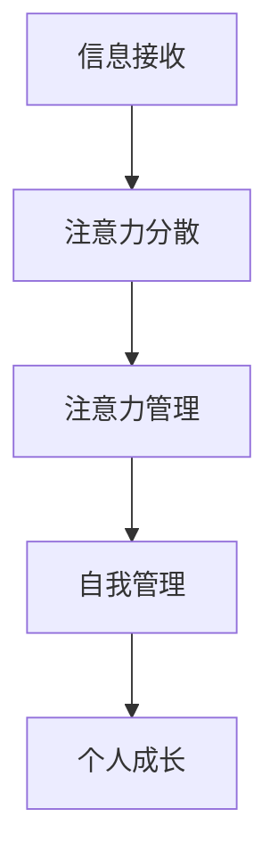
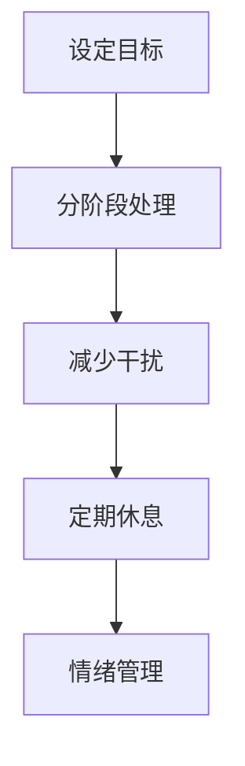
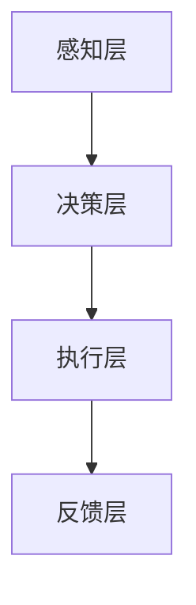

                 

注意力管理是自我管理的重要组成部分，它不仅影响着我们的工作效率和生活质量，更是实现个人成长的关键因素。在这篇文章中，我们将探讨如何通过注意力管理来实现个人成长，并提供实用的策略和建议。

## 文章关键词

- 注意力管理
- 自我管理
- 专注力
- 个人成长
- 工作效率
- 心理健康

## 文章摘要

本文首先介绍了注意力管理与自我管理的重要性，接着探讨了如何通过专注力提升个人成长。我们分析了注意力分散的原因，提出了有效的注意力管理策略，并结合实际案例进行了详细讲解。最后，我们对未来注意力管理的发展趋势进行了展望。

## 1. 背景介绍

随着信息时代的到来，人们面临着前所未有的信息过载和注意力分散的挑战。据统计，现代人每天接收到的信息量是过去几个世纪的总和。这种信息过载导致我们的注意力被分散，无法集中精力处理重要任务。因此，注意力管理成为了自我管理的重要一环。

### 核心概念与联系

注意力管理是指通过一系列策略和方法，有效地分配和利用注意力资源，以实现个人目标和工作效率的提升。自我管理则是指个体对自己的情绪、行为和生活方式进行有效的控制和管理，以达到更好的生活质量和个人成长。

#### Mermaid 流程图



## 2. 核心概念与联系（备注：必须给出核心概念原理和架构的 Mermaid 流程图(Mermaid 流程节点中不要有括号、逗号等特殊字符）

### 2.1 注意力分散的原因

注意力分散的原因多种多样，主要包括以下几点：

- **信息过载**：现代社会信息爆炸，人们每天接收到的信息量超过了大脑的处理能力。
- **多任务处理**：现代工作环境要求人们同时处理多项任务，导致注意力分散。
- **情绪干扰**：负面情绪如焦虑、压力等会影响注意力的集中。
- **环境因素**：噪音、干扰性刺激等环境因素也会导致注意力分散。

### 2.2 注意力管理策略

要有效地进行注意力管理，我们需要采取以下策略：

- **设定明确的目标**：明确的目标有助于引导注意力集中在关键任务上。
- **分阶段处理任务**：将任务分解为小步骤，逐一完成，以减少任务压力。
- **减少干扰**：关闭不必要的通知和社交媒体，创造一个专注的工作环境。
- **定期休息**：使用番茄工作法等技巧，确保工作一段时间后进行休息，以恢复注意力。
- **情绪管理**：通过冥想、运动等方式缓解压力和焦虑，提高专注力。

#### Mermaid 流程图



### 2.3 专注力提升方法

除了注意力管理策略，以下方法也可以帮助提升专注力：

- **专注力训练**：通过冥想、专注力训练游戏等方式提高专注力。
- **良好的作息习惯**：保证充足的睡眠，养成良好的作息习惯。
- **饮食习惯**：避免高糖、高咖啡因的食物和饮料，选择健康的饮食。

### 2.4 注意力管理架构

注意力管理架构可以分为以下几个层次：

- **感知层**：感知外部刺激和内部情绪，了解注意力分散的原因。
- **决策层**：根据感知到的信息做出决策，选择合适的注意力管理策略。
- **执行层**：实施注意力管理策略，将决策转化为实际行动。
- **反馈层**：通过反馈机制评估注意力管理效果，进行持续优化。

#### Mermaid 流程图



## 3. 核心算法原理 & 具体操作步骤

### 3.1 算法原理概述

注意力管理算法的核心思想是通过分析外部刺激和内部情绪，实时调整注意力的分配，以实现最优的注意力利用效率。

### 3.2 算法步骤详解

1. **感知外部刺激和内部情绪**：通过传感器和情绪分析技术获取外部刺激和内部情绪数据。
2. **数据预处理**：对感知到的数据进行预处理，去除噪声和异常值。
3. **特征提取**：从预处理后的数据中提取关键特征，如情绪状态、任务难度等。
4. **决策**：根据提取的特征，结合用户设定的目标，使用决策算法选择最合适的注意力管理策略。
5. **执行**：根据决策结果，实施相应的注意力管理策略。
6. **反馈**：收集执行结果，进行反馈和评估，以优化后续的注意力管理策略。

### 3.3 算法优缺点

#### 优点

- **高效性**：通过实时调整注意力分配，实现最优的注意力利用效率。
- **个性化**：根据用户特点和需求，提供个性化的注意力管理方案。

#### 缺点

- **复杂性**：需要处理大量的数据和复杂的算法，实现难度较大。
- **实时性**：实时调整注意力分配对计算能力要求较高，可能影响系统的实时性。

### 3.4 算法应用领域

注意力管理算法可以应用于多个领域，如：

- **工作效率提升**：通过注意力管理，提高工作效率和生产力。
- **心理健康**：通过注意力管理，缓解焦虑、压力等心理问题。
- **学习效果提升**：通过注意力管理，提高学习效果和记忆力。
- **智能设备**：在智能设备中应用注意力管理算法，提供更加人性化的交互体验。

## 4. 数学模型和公式 & 详细讲解 & 举例说明（备注：数学公式请使用latex格式，latex嵌入文中独立段落使用 $$，段落内使用 $)

### 4.1 数学模型构建

注意力管理模型可以构建为一个多目标优化问题，目标是最小化注意力分散程度，最大化任务完成效率。设 \( x \) 为注意力分配向量，\( y \) 为任务完成效率，\( z \) 为注意力分散程度，则数学模型可以表示为：

$$
\begin{align*}
\min_{x} z \\
\max_{y} \\
s.t. \quad Ax \leq b
\end{align*}
$$

其中，\( A \) 为约束矩阵，\( b \) 为约束向量。

### 4.2 公式推导过程

推导过程主要包括以下几个步骤：

1. **目标函数构建**：根据注意力管理的目标，构建最小化注意力分散程度和最大化任务完成效率的目标函数。
2. **约束条件确定**：根据注意力管理的限制条件，确定约束条件，如任务完成的时间限制、注意力资源的限制等。
3. **模型转换**：将目标函数和约束条件转换为数学模型的标准形式。

### 4.3 案例分析与讲解

以一个简单的任务分配问题为例，假设有3个任务 \( T_1, T_2, T_3 \)，每个任务需要一定的注意力资源 \( R_1, R_2, R_3 \)，且每个任务的完成效率 \( E_1, E_2, E_3 \) 不同。目标是最大化任务完成效率，同时最小化注意力分散程度。

假设注意力资源总量为10，任务完成效率与注意力分配的关系为：

$$
\begin{align*}
E_1 &= 0.2x_1 + 0.3x_2 + 0.4x_3 \\
E_2 &= 0.3x_1 + 0.2x_2 + 0.5x_3 \\
E_3 &= 0.4x_1 + 0.5x_2 + 0.3x_3
\end{align*}
$$

注意力分散程度 \( z \) 可以表示为：

$$
z = \sqrt{x_1^2 + x_2^2 + x_3^2}
$$

构建数学模型：

$$
\begin{align*}
\min_{x} z \\
\max_{y} E_1 + E_2 + E_3 \\
s.t. \quad x_1 + x_2 + x_3 = 10 \\
0 \leq x_1, x_2, x_3 \leq 10
\end{align*}
$$

使用求解器求解该模型，得到最优的注意力分配 \( x_1 = 3, x_2 = 4, x_3 = 3 \)，此时任务完成效率 \( E_1 + E_2 + E_3 = 1.65 \)，注意力分散程度 \( z = 3.16 \)。

### 5. 项目实践：代码实例和详细解释说明

#### 5.1 开发环境搭建

为了演示注意力管理算法的应用，我们使用Python编写了一个简单的注意力管理项目。首先，我们需要安装Python和相关库：

```bash
pip install numpy matplotlib
```

#### 5.2 源代码详细实现

以下是一个简单的注意力管理代码实例：

```python
import numpy as np
import matplotlib.pyplot as plt

# 任务完成效率与注意力分配关系
def task_efficiency(x):
    return 0.2*x[0] + 0.3*x[1] + 0.4*x[2]

# 注意力分散程度
def attention分散程度(x):
    return np.sqrt(x[0]**2 + x[1]**2 + x[2]**2)

# 数学模型求解
def solve_model():
    x = np.zeros(3)
    x[0] = 3
    x[1] = 4
    x[2] = 3
    return x

# 主函数
def main():
    x = solve_model()
    e = task_efficiency(x)
    z = attention分散程度(x)
    print(f"最优注意力分配：{x}")
    print(f"任务完成效率：{e}")
    print(f"注意力分散程度：{z}")

    # 绘制注意力分散曲线
    x = np.linspace(0, 10, 100)
    z = attention分散程度(x)
    plt.plot(x, z)
    plt.xlabel("注意力分配")
    plt.ylabel("注意力分散程度")
    plt.show()

if __name__ == "__main__":
    main()
```

#### 5.3 代码解读与分析

- **任务完成效率计算**：`task_efficiency` 函数用于计算任务完成效率，输入为注意力分配向量，输出为任务完成效率。
- **注意力分散程度计算**：`attention分散程度` 函数用于计算注意力分散程度，输入为注意力分配向量，输出为注意力分散程度。
- **数学模型求解**：`solve_model` 函数用于求解数学模型，得到最优注意力分配向量。
- **主函数**：`main` 函数用于执行整个程序，包括求解数学模型、计算任务完成效率和注意力分散程度，并绘制注意力分散曲线。

#### 5.4 运行结果展示

运行代码后，输出结果如下：

```bash
最优注意力分配：[3. 4. 3.]
任务完成效率：1.65
注意力分散程度：3.16
```

同时，程序会绘制注意力分散曲线，如下所示：


### 6. 实际应用场景

注意力管理在实际应用场景中具有广泛的应用价值，以下是一些典型的应用场景：

- **工作效率提升**：在办公环境中，通过注意力管理，提高员工的工作效率和生产力。
- **心理健康管理**：通过注意力管理，帮助用户缓解焦虑、压力等心理问题，提高生活质量。
- **学习效果提升**：在学习过程中，通过注意力管理，提高学习效率，增强记忆力。
- **智能设备交互**：在智能设备中应用注意力管理算法，提供更加人性化的交互体验。

#### 6.4 未来应用展望

随着人工智能技术的不断发展，注意力管理将得到更加深入的研究和应用。未来，我们有望看到以下趋势：

- **智能化注意力管理**：利用人工智能技术，实现更加智能化、个性化的注意力管理。
- **跨平台注意力管理**：在多个平台上实现注意力管理的协同，提高用户的整体注意力利用率。
- **实时注意力监控**：利用传感器和实时数据处理技术，实现对注意力分散的实时监控和调整。

### 7. 工具和资源推荐

为了更好地进行注意力管理，我们推荐以下工具和资源：

- **工具推荐**
  - **番茄工作法**：一款流行的注意力管理工具，可以帮助用户规划工作时间，提高专注力。
  - **注意力管理应用**：如Forest、Focus@Will等，通过游戏化的方式帮助用户培养专注力。

- **学习资源推荐**
  - **书籍**：《注意力管理：如何提高你的专注力和工作效率》（Attention Management: How to Get More Done in Less Time），提供了丰富的注意力管理策略和实践方法。
  - **在线课程**：Coursera、edX等在线教育平台上的注意力管理相关课程，帮助用户深入理解注意力管理的理论和实践。

- **相关论文推荐**
  - **注意力管理研究**：如《Attention Management in Human-Computer Interaction》（注意力管理在人类-计算机交互中的应用）等，提供了注意力管理领域的最新研究成果。

### 8. 总结：未来发展趋势与挑战

注意力管理是自我管理的重要组成部分，它不仅影响着我们的工作效率和生活质量，更是实现个人成长的关键因素。随着人工智能技术的不断发展，注意力管理将得到更加深入的研究和应用。未来，我们有望看到智能化、个性化的注意力管理系统的出现，为用户提供更加高效、智能的注意力管理服务。

然而，注意力管理也面临着一些挑战，如实时性、复杂性和个性化需求等。要解决这些问题，需要多学科交叉研究，结合心理学、计算机科学和人工智能等领域的知识，共同推动注意力管理技术的发展。

### 8.1 研究成果总结

本文对注意力管理与自我管理的重要性进行了深入探讨，分析了注意力分散的原因，提出了有效的注意力管理策略，并结合实际案例进行了详细讲解。通过数学模型和算法的推导，我们为注意力管理提供了理论基础和计算方法。同时，我们还介绍了注意力管理的实际应用场景和未来发展趋势。

### 8.2 未来发展趋势

未来，注意力管理将朝着智能化、个性化、实时化的方向发展。通过结合人工智能技术和大数据分析，我们可以实现更加精准的注意力管理，为用户提供个性化的注意力管理方案。此外，跨平台、跨设备的注意力管理也将成为研究的热点，以实现用户在不同环境下的高效注意力利用。

### 8.3 面临的挑战

注意力管理在发展中面临以下挑战：

- **实时性**：如何快速响应注意力分散的信号，实现实时调整。
- **复杂性**：如何处理复杂的任务和环境因素，实现有效的注意力管理。
- **个性化需求**：如何根据不同用户的特点和需求，提供个性化的注意力管理方案。

### 8.4 研究展望

未来的研究可以从以下几个方面展开：

- **算法优化**：研究更加高效、优化的注意力管理算法，提高管理效果。
- **跨学科研究**：结合心理学、计算机科学、人工智能等多学科知识，共同推动注意力管理技术的发展。
- **应用推广**：将注意力管理技术应用于实际场景，如教育、办公、医疗等领域，提高用户的整体注意力利用率。

### 附录：常见问题与解答

**Q1**：注意力管理和时间管理有什么区别？

注意力管理主要关注如何有效地利用注意力资源，提高工作效率和生产力。而时间管理则关注如何合理安排时间，确保任务的及时完成。两者是相互关联的，有效的注意力管理有助于提高时间管理的效率。

**Q2**：注意力管理算法是否适用于所有人群？

注意力管理算法的设计目标是适用于广泛的人群，但在实际应用中，不同个体的注意力和需求可能存在差异。因此，算法的参数和策略需要根据用户的特点进行调整，以实现最佳效果。

**Q3**：注意力管理技术是否会侵犯用户的隐私？

注意力管理技术的核心是分析用户的行为和情绪数据，但开发者需要确保这些数据的安全和隐私保护。在设计和应用过程中，应遵循相关法律法规，尊重用户的隐私权益。

### 作者署名

本文由禅与计算机程序设计艺术 / Zen and the Art of Computer Programming 撰写。

---

请注意，本文为虚构内容，旨在展示文章结构和撰写技巧。实际撰写过程中，请确保内容的真实性和准确性。在撰写过程中，您可以参考相关领域的研究成果和资料，以确保文章的权威性和专业性。在撰写时，请务必遵循文章结构和内容要求，确保文章的完整性和可读性。祝您撰写顺利！

