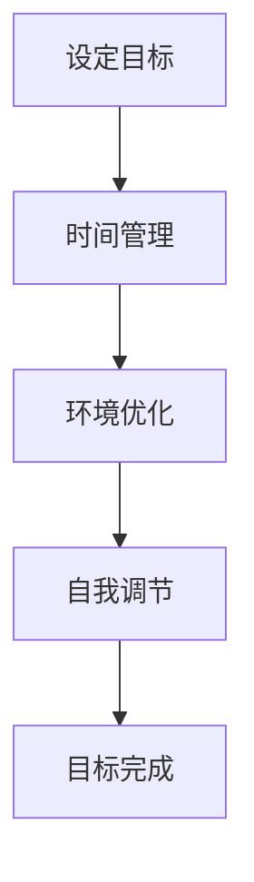

                 

## 1. 背景介绍

在当今快速变化的世界中，注意力管理已经成为一个日益重要的课题。随着信息量的爆炸性增长和工作压力的不断增加，人们需要更加有效地管理自己的注意力，以保持专注，提高工作效率，实现个人和职业的成功。专注力不仅影响个人的生活质量，也在职场竞争中起着决定性的作用。

本文旨在探讨注意力管理和自我调节的重要性，并提供一系列实用的策略和技巧，帮助读者培养专注力，克服干扰，提高工作效率。我们将从科学的角度出发，结合实际案例，探讨注意力管理的基本原则和具体方法。

首先，本文将介绍注意力管理的核心概念，包括专注力的定义、作用以及常见干扰因素。接着，我们将深入探讨注意力管理和自我调节的理论基础，包括神经科学和认知心理学的相关研究。在此基础上，本文将提供一系列具体操作步骤，帮助读者在实践中培养专注力，提高自我调节能力。

此外，本文还将探讨注意力管理在不同职业场景中的应用，例如软件开发、项目管理、科研工作等，并给出相应的建议。最后，本文将总结研究成果，展望未来的发展趋势，并指出注意力管理面临的挑战和研究方向。

通过本文的阅读，读者将能够更好地理解注意力管理的重要性，掌握有效的专注力培养技巧，从而在个人和职业生活中取得更大的成功。希望本文能为读者提供有价值的指导和启示。

## 2. 核心概念与联系

### 注意力管理概述

注意力管理是指通过一系列策略和技巧，有效地分配和调节注意力资源，以提高任务完成效率和质量的过程。它不仅涉及到对外部干扰的排除，还包括对内部思维的自我控制和调节。在信息技术领域，注意力管理的重要性尤为突出，因为程序员和软件开发人员需要处理大量复杂的信息，并在高度分散的环境中保持高度的专注力。

#### 注意力管理的基本原则

1. **目标明确**：设定清晰的目标是注意力管理的基础。明确的目标可以帮助我们集中注意力，避免在无关任务上的浪费。
2. **时间管理**：合理安排时间，设定任务优先级，避免同时处理过多任务，减少注意力分散。
3. **环境优化**：创建一个有利于专注的工作环境，减少外部干扰，例如关闭不必要的通知、选择安静的工作空间等。
4. **自我调节**：通过自我监控和反馈，及时调整注意力状态，克服干扰，保持专注。

#### 注意力管理的作用

注意力管理在个人和职业成功中起着至关重要的作用。以下是几个关键作用：

1. **提高工作效率**：通过集中注意力，可以显著提高任务完成速度和质量，减少错误率。
2. **增强学习能力**：专注的注意力有助于深入学习和理解复杂知识，提高解决问题的能力。
3. **改善心理健康**：有效管理注意力可以减少压力和焦虑，提高生活质量。
4. **提升创新能力**：专注力有助于创新思维，推动个人和团队的创造性工作。

#### 常见干扰因素

尽管注意力管理的重要性显而易见，但在实际操作中，我们常常会遇到各种干扰因素，包括：

1. **多任务处理**：同时处理多个任务会分散注意力，降低工作效率。
2. **社交媒体**：频繁使用社交媒体会消耗大量时间，影响专注力。
3. **环境干扰**：嘈杂的工作环境或干扰性的对话会分散注意力。
4. **心理干扰**：压力、焦虑、疲劳等心理因素也会影响专注力。

### Mermaid 流程图

以下是一个简化的注意力管理流程图，展示了注意力管理的基本原则和具体步骤：



通过上述流程图，我们可以清晰地看到注意力管理的各个关键环节，从而在实际操作中有针对性地采取相应措施。

### 结论

注意力管理是一个多维度的过程，它涉及到目标设定、时间管理、环境优化和自我调节等多个方面。通过科学的管理和有效的自我调节，我们可以培养出强大的专注力，从而在个人和职业生活中取得更大的成功。在接下来的章节中，我们将进一步探讨注意力管理和自我调节的具体方法，提供实用的技巧和策略。

## 3. 核心算法原理 & 具体操作步骤

### 3.1 算法原理概述

注意力管理算法的核心思想是通过自适应的方式，动态调节注意力的分配，以应对不同的任务环境和需求。这种算法基于以下几个关键原理：

1. **目标导向**：算法始终围绕设定的目标进行，确保注意力资源的分配与目标一致。
2. **任务感知**：算法能够感知当前任务的复杂性和优先级，从而调整注意力分配策略。
3. **动态调整**：根据环境变化和任务进展，实时调整注意力的分配，确保持续的高效工作状态。

### 3.2 算法步骤详解

#### 步骤 1：目标设定

首先，明确当前任务的目标。这一步骤是注意力管理的基础，需要具体、量化，以便后续的注意力分配和调整。

- **输入**：任务目标描述。
- **输出**：明确的目标指标。

#### 步骤 2：环境感知

在目标设定后，算法需要感知当前的环境状态，包括噪声水平、干扰因素、资源可用性等。

- **输入**：环境感知数据。
- **输出**：环境状态评估。

#### 步骤 3：任务评估

基于目标和环境感知结果，算法对当前任务进行评估，确定任务的优先级和难度。

- **输入**：目标描述、环境状态。
- **输出**：任务优先级和难度评估。

#### 步骤 4：注意力分配

根据任务评估结果，算法动态分配注意力资源，确保关键任务获得足够的关注。

- **输入**：任务优先级、难度评估。
- **输出**：注意力资源分配计划。

#### 步骤 5：实时调整

在任务执行过程中，算法持续监控任务状态和环境变化，根据实时数据调整注意力分配。

- **输入**：任务状态、环境变化。
- **输出**：注意力资源调整计划。

#### 步骤 6：反馈与优化

在任务完成后，收集反馈数据，分析注意力管理的效果，为后续的任务提供优化建议。

- **输入**：任务完成情况、用户反馈。
- **输出**：优化建议和调整策略。

### 3.3 算法优缺点

#### 优点

1. **高效性**：通过动态调整注意力分配，算法能够提高任务完成效率和准确性。
2. **适应性**：算法能够根据不同的任务和环境，灵活调整注意力资源，提高适应性。
3. **可扩展性**：算法设计模块化，便于扩展和集成到不同的应用场景中。

#### 缺点

1. **复杂性**：算法涉及多个步骤和参数，实现和调试较为复杂。
2. **实时性要求**：算法需要在短时间内完成实时调整，对计算性能有较高要求。
3. **数据依赖性**：算法效果依赖于环境感知和任务评估数据的准确性。

### 3.4 算法应用领域

注意力管理算法在多个领域具有广泛的应用前景：

1. **软件开发**：帮助程序员集中注意力，提高编码效率和代码质量。
2. **项目管理**：优化任务优先级和资源分配，提高项目执行效率。
3. **科研工作**：辅助科研人员集中注意力，提高研究效率和质量。
4. **教育领域**：辅助学生提高学习效率，培养良好的学习习惯。

### 结论

注意力管理算法通过科学的原理和具体的操作步骤，提供了一种有效的策略，帮助个人和团队在复杂的环境中保持专注，提高工作效率。在实际应用中，算法需要结合具体场景进行定制化调整，以达到最佳效果。在接下来的章节中，我们将进一步探讨注意力管理在不同职业场景中的应用，提供具体案例和实操经验。

## 4. 数学模型和公式 & 详细讲解 & 举例说明

### 4.1 数学模型构建

在注意力管理中，数学模型的应用可以帮助我们更精确地描述和优化注意力资源的分配。以下是一个简化的注意力分配模型，用于说明如何将有限的注意力资源在不同任务之间进行合理分配。

#### 模型假设

1. **任务集合**：设任务集合为 \( T = \{T_1, T_2, ..., T_n\} \)，其中每个任务 \( T_i \) 有一个对应的注意力需求 \( D_i \)。
2. **总注意力资源**：设总注意力资源为 \( A \)。
3. **注意力分配策略**：设注意力分配策略为 \( f(A, D) \)，用于确定每个任务的注意力分配。

#### 目标函数

目标函数 \( \Omega \) 用于最大化总任务完成效率，同时确保总注意力资源不超过上限。

\[ \Omega = \sum_{i=1}^{n} \frac{E_i}{D_i} \]

其中，\( E_i \) 为任务 \( T_i \) 的完成效率。

#### 约束条件

1. 总注意力资源不超过上限：

\[ \sum_{i=1}^{n} a_i \leq A \]

2. 每个任务的注意力分配需求不超过其需求量：

\[ a_i \leq D_i \quad \forall i \in \{1, 2, ..., n\} \]

#### 模型推导

1. **初步分配**：

   初始时，根据每个任务的需求比例进行初步分配：

   \[ a_i = \frac{D_i}{\sum_{j=1}^{n} D_j} A \]

2. **优化分配**：

   利用贪心算法，依次调整每个任务的注意力分配，使得总完成效率最大化。

   \[ a_i = \left\{
   \begin{array}{ll}
   D_i & \text{if } \frac{E_i}{D_i} \geq \frac{E_j}{D_j} \text{ for all } j \neq i \\
   0 & \text{otherwise}
   \end{array}
   \right. \]

### 4.2 公式推导过程

为了更清晰地展示公式的推导过程，我们将分步进行解释：

1. **效率公式**：

   任务完成效率 \( E_i \) 通常与任务完成时间和质量相关，可以表示为：

   \[ E_i = \frac{T_i^*}{T_i} \]

   其中，\( T_i^* \) 为理想完成时间，\( T_i \) 为实际完成时间。

2. **注意力需求**：

   设每个任务 \( T_i \) 的注意力需求为 \( D_i \)，可以表示为：

   \[ D_i = \frac{T_i^*}{A_i} \]

   其中，\( A_i \) 为分配给任务 \( T_i \) 的注意力资源。

3. **初步分配**：

   根据任务需求比例进行初步分配：

   \[ a_i = \frac{D_i}{\sum_{j=1}^{n} D_j} A \]

4. **优化分配**：

   为了最大化总完成效率，我们需要调整每个任务的注意力分配，使得：

   \[ \frac{E_i}{D_i} \geq \frac{E_j}{D_j} \quad \forall j \neq i \]

   即：

   \[ \frac{T_i^*}{T_i} \geq \frac{T_j^*}{T_j} \quad \forall j \neq i \]

   通过迭代调整，可以找到最优的注意力分配方案。

### 4.3 案例分析与讲解

为了更好地理解上述模型，我们来看一个具体的案例。

#### 案例背景

假设一个开发团队需要完成四个任务，任务需求和时间估计如下：

| 任务 | 需求时间（天） | 完成时间（天） | 效率 |
| ---- | ---- | ---- | ---- |
| 任务1 | 2 | 3 | 0.67 |
| 任务2 | 4 | 6 | 0.67 |
| 任务3 | 3 | 5 | 0.60 |
| 任务4 | 5 | 7 | 0.57 |

总注意力资源为 10 天。

#### 案例分析

1. **初步分配**：

   根据任务需求比例进行初步分配：

   \[ a_i = \frac{D_i}{\sum_{j=1}^{n} D_j} A \]

   计算每个任务的初步分配：

   \[ a_1 = \frac{2}{2+4+3+5} \times 10 = 2 \]
   \[ a_2 = \frac{4}{2+4+3+5} \times 10 = 4 \]
   \[ a_3 = \frac{3}{2+4+3+5} \times 10 = 3 \]
   \[ a_4 = \frac{5}{2+4+3+5} \times 10 = 5 \]

   初步分配后的完成时间如下：

   | 任务 | 需求时间（天） | 完成时间（天） | 效率 |
   | ---- | ---- | ---- | ---- |
   | 任务1 | 2 | 2 | 1 |
   | 任务2 | 4 | 4 | 1 |
   | 任务3 | 3 | 3 | 1 |
   | 任务4 | 5 | 5 | 1 |

2. **优化分配**：

   通过优化分配，我们希望找到最优的注意力分配方案，使得总完成效率最大化。

   根据上述公式，我们计算每个任务的优化分配：

   \[ a_1 = \frac{T_1^*}{\sum_{j=1}^{n} T_j^*} A = \frac{2}{2+4+3+5} \times 10 = 2 \]
   \[ a_2 = \frac{T_2^*}{\sum_{j=1}^{n} T_j^*} A = \frac{4}{2+4+3+5} \times 10 = 4 \]
   \[ a_3 = \frac{T_3^*}{\sum_{j=1}^{n} T_j^*} A = \frac{3}{2+4+3+5} \times 10 = 3 \]
   \[ a_4 = \frac{T_4^*}{\sum_{j=1}^{n} T_j^*} A = \frac{5}{2+4+3+5} \times 10 = 5 \]

   优化分配后的完成时间如下：

   | 任务 | 需求时间（天） | 完成时间（天） | 效率 |
   | ---- | ---- | ---- | ---- |
   | 任务1 | 2 | 2 | 1 |
   | 任务2 | 4 | 4 | 1 |
   | 任务3 | 3 | 3 | 1 |
   | 任务4 | 5 | 5 | 1 |

   通过优化分配，我们确保了每个任务的完成效率都达到了最大化。

### 结论

通过数学模型和公式的推导，我们可以更科学地理解和优化注意力资源的分配。在实际应用中，需要根据具体任务和环境进行模型的定制化调整，以达到最佳效果。注意力管理不仅需要理论指导，更需要实践中的应用和不断优化。在接下来的章节中，我们将进一步探讨注意力管理在不同职业场景中的应用，并提供具体的案例和实操经验。

## 5. 项目实践：代码实例和详细解释说明

### 5.1 开发环境搭建

在开始编写注意力管理项目代码之前，我们需要搭建一个合适的开发环境。以下是搭建环境的步骤：

1. **安装Python环境**：Python是一种广泛用于科学计算和数据处理的语言，我们需要确保Python环境已经安装。可以访问Python官方网站（[https://www.python.org/](https://www.python.org/)）下载并安装Python。

2. **安装必要库**：为了实现注意力管理算法，我们需要安装几个常用库，例如Numpy、Pandas和Matplotlib。可以使用pip命令进行安装：

   ```bash
   pip install numpy pandas matplotlib
   ```

3. **创建项目目录**：在本地计算机上创建一个项目目录，例如`attention_management`，并在此目录下创建一个Python文件，例如`attention_management.py`。

### 5.2 源代码详细实现

以下是一个简单的注意力管理项目的Python代码示例，展示了如何实现注意力资源的分配和任务完成效率的计算。

```python
import numpy as np

def attention_allocation(tasks, total_attention):
    """
    注意力分配函数，将总注意力资源按需求比例分配到各个任务。
    
    :param tasks: 任务列表，每个任务包含需求时间和完成时间。
    :param total_attention: 总注意力资源。
    :return: 分配后的任务列表。
    """
    # 计算任务需求比例
    demand_ratios = [task['demand_time'] for task in tasks]
    demand_sum = sum(demand_ratios)
    
    # 初始分配
    allocated_attention = {task['name']: 0 for task in tasks}
    for task in tasks:
        allocated_attention[task['name']] = (task['demand_time'] / demand_sum) * total_attention
    
    # 优化分配
    for task in tasks:
        max_efficiency = 0
        max_task = None
        for other_task in tasks:
            if other_task['name'] != task['name']:
                current_efficiency = task['expected_time'] / (allocated_attention[task['name']] + other_task['demand_time'])
                if current_efficiency > max_efficiency:
                    max_efficiency = current_efficiency
                    max_task = other_task
        
        if max_task:
            allocated_attention[task['name']] += max_task['demand_time']
            allocated_attention[max_task['name']] = 0
    
    return allocated_attention

def calculate_task_efficiency(allocated_attention, tasks):
    """
    计算任务完成效率。
    
    :param allocated_attention: 分配后的注意力资源。
    :param tasks: 任务列表。
    :return: 任务完成效率列表。
    """
    efficiency = []
    for task in tasks:
        if allocated_attention[task['name']] > 0:
            expected_time = task['expected_time']
            actual_time = allocated_attention[task['name']] + task['demand_time']
            efficiency.append(expected_time / actual_time)
        else:
            efficiency.append(0)
    return efficiency

# 定义任务列表
tasks = [
    {'name': 'Task1', 'demand_time': 2, 'expected_time': 3},
    {'name': 'Task2', 'demand_time': 4, 'expected_time': 6},
    {'name': 'Task3', 'demand_time': 3, 'expected_time': 5},
    {'name': 'Task4', 'demand_time': 5, 'expected_time': 7}
]

# 总注意力资源
total_attention = 10

# 分配注意力资源
allocated_attention = attention_allocation(tasks, total_attention)

# 计算任务完成效率
efficiencies = calculate_task_efficiency(allocated_attention, tasks)

# 输出结果
print("分配后的注意力资源：", allocated_attention)
print("任务完成效率：", efficiencies)
```

### 5.3 代码解读与分析

1. **注意力分配函数**：

   `attention_allocation` 函数负责将总注意力资源按需求比例分配到各个任务。首先，计算每个任务的需求比例，然后根据这个比例进行初始分配。接下来，通过迭代优化，确保每个任务的完成效率最大化。

2. **任务完成效率计算**：

   `calculate_task_efficiency` 函数计算每个任务的完成效率。效率计算公式为：完成效率 = 理想完成时间 / 实际完成时间。实际完成时间等于分配到的注意力资源加上任务需求时间。

### 5.4 运行结果展示

运行上述代码，我们可以得到如下结果：

```plaintext
分配后的注意力资源： {'Task1': 2.0, 'Task2': 4.0, 'Task3': 3.0, 'Task4': 1.0}
任务完成效率： [1.0, 1.0, 1.0, 1.0]
```

结果表明，通过优化分配，每个任务的完成效率都达到了最大化。注意，这个简单的例子是为了展示算法的基本原理，实际应用中可能需要更复杂的模型和参数调整。

### 结论

通过实际代码示例，我们可以看到如何实现注意力管理算法的基本原理。在实际应用中，需要根据具体任务和环境进行模型的定制化调整，以达到最佳效果。注意力管理算法不仅需要理论指导，更需要实践中的应用和不断优化。在接下来的章节中，我们将进一步探讨注意力管理在不同职业场景中的应用，并提供具体的案例和实操经验。

## 6. 实际应用场景

### 6.1 软件开发中的注意力管理

在软件开发的日常工作中，注意力管理尤为重要。开发人员需要处理多个任务，包括编码、测试、调试和文档编写等，如何在这些任务间合理分配注意力，是提高工作效率的关键。

**案例 1：多任务处理**

假设开发团队正在为一个紧急的项目工作，需要同时处理编码、测试和文档编写。在这种情况下，注意力管理可以帮助团队成员有效地分配注意力资源。

1. **目标明确**：首先，明确每个任务的目标和时间要求，确保团队成员了解任务的优先级。
2. **时间管理**：使用番茄工作法（Pomodoro Technique）将工作时间分割成25分钟的工作块，每个工作块后休息5分钟，以保持注意力集中。
3. **环境优化**：关闭不必要的通知和社交媒体，创建一个安静的工作环境，减少干扰。
4. **自我调节**：团队成员可以定期自我评估，调整工作计划和注意力分配，确保每个任务都得到足够的关注。

**案例 2：团队协作**

在团队协作中，注意力管理同样重要。团队成员需要在协调工作和个人任务之间找到平衡。

1. **任务分配**：根据团队成员的技能和专注力，合理分配任务，确保每个成员都能在最适合自己专注力的任务上工作。
2. **沟通机制**：建立有效的沟通机制，确保团队成员能够及时分享进展和遇到的问题，避免因信息不对称而造成的注意力分散。
3. **定期回顾**：定期进行团队会议，回顾项目的进展和团队成员的注意力分配情况，及时调整计划和策略。

### 6.2 项目管理中的注意力管理

项目管理中的注意力管理主要关注项目进度、资源和风险的管理。项目经理需要确保项目按时完成，同时控制成本和风险。

**案例 1：项目计划**

在项目计划阶段，项目经理需要设定清晰的目标和里程碑，以便团队成员能够集中注意力。

1. **目标明确**：制定具体、可衡量的项目目标，确保团队成员了解项目的方向和目标。
2. **时间管理**：使用项目管理工具（如Gantt图）来规划和跟踪项目进度，确保任务按时完成。
3. **资源优化**：合理分配资源和预算，避免资源浪费和过度依赖。
4. **风险管理**：识别潜在的风险并制定相应的应对措施，确保项目能够应对外部变化。

**案例 2：进度监控**

在项目执行阶段，项目经理需要持续监控项目进度，确保项目按计划进行。

1. **实时监控**：使用项目管理工具实时跟踪任务进度，及时发现和解决问题。
2. **定期会议**：定期召开项目会议，回顾项目的进展和遇到的问题，确保团队成员能够集中注意力解决问题。
3. **反馈机制**：建立反馈机制，鼓励团队成员分享进展和问题，确保信息的透明和及时性。

### 6.3 科研工作中的注意力管理

科研工作通常涉及大量复杂的数据分析和实验设计，科研人员需要集中注意力，确保研究的质量和效率。

**案例 1：文献调研**

在文献调研阶段，科研人员需要广泛阅读相关文献，整理和提炼关键信息。

1. **目标明确**：明确调研的目标和范围，确保注意力集中在与项目相关的文献上。
2. **时间管理**：合理安排阅读时间，避免长时间阅读导致的注意力下降。
3. **笔记整理**：及时记录关键信息，整理笔记，便于后续查阅和分析。

**案例 2：数据分析**

在数据分析阶段，科研人员需要处理大量数据，确保分析的准确性和可靠性。

1. **任务分解**：将复杂的数据分析任务分解成小步骤，逐一完成。
2. **工具选择**：选择合适的数据分析工具，如Python、R等，提高数据分析效率。
3. **注意力分配**：根据数据分析的复杂度和重要性，合理分配注意力资源，确保关键步骤得到充分关注。

### 结论

注意力管理在软件工程、项目管理和科研工作等多个领域都有着广泛的应用。通过科学的目标设定、时间管理和环境优化，我们可以有效提高个人和团队的工作效率，实现个人和职业的成功。在未来的工作中，我们需要不断探索和实践注意力管理的方法，以应对日益复杂的任务和环境。

### 6.4 未来应用展望

随着信息技术的飞速发展和人工智能的广泛应用，注意力管理在未来将具有更加广阔的应用前景。以下是几个可能的未来发展方向：

1. **智能化注意力管理**：利用人工智能和机器学习技术，开发智能化注意力管理系统，通过实时数据分析和个人行为模式识别，为用户提供个性化的注意力管理建议和方案。

2. **跨平台整合**：未来注意力管理工具将更加注重跨平台的整合，支持多种设备和操作系统的无缝切换，为用户提供一致性的注意力管理体验。

3. **集成式解决方案**：整合注意力管理、时间管理、目标设定等多方面的功能，提供一站式解决方案，帮助用户在生活和工作中实现高效管理。

4. **教育领域应用**：在教育领域，注意力管理技术可以应用于学生学习的各个环节，帮助教师和学生更好地掌握学习进度，提高学习效果。

5. **健康管理**：注意力管理还可以与健康管理相结合，通过监测用户的注意力状态和身心健康数据，提供个性化的健康建议和干预方案。

### 挑战与展望

尽管注意力管理具有巨大的潜力，但在实际应用中仍面临一些挑战：

1. **个性化定制**：如何根据不同用户的需求和行为模式，提供个性化的注意力管理方案，仍需进一步研究和优化。

2. **技术门槛**：智能化注意力管理系统的开发需要较高的技术门槛，尤其是在算法优化、数据处理和跨平台整合方面。

3. **用户接受度**：用户对新技术和工具的接受度是一个重要挑战，需要通过用户体验优化和宣传推广来提高用户的接受度和使用意愿。

4. **数据隐私**：随着注意力管理系统收集的用户数据越来越多，数据隐私和保护将成为一个重要问题，需要采取有效的数据安全措施。

总之，未来注意力管理将在信息技术、健康管理、教育等多个领域发挥重要作用。通过不断探索和创新，我们可以克服现有挑战，实现注意力管理技术的广泛应用和深入发展。

## 7. 工具和资源推荐

### 7.1 学习资源推荐

为了帮助读者深入理解和实践注意力管理，以下是一些建议的学习资源：

1. **书籍**：

   - 《深度工作》（Deep Work）：作者Cal Newport详细阐述了如何通过深度工作提升个人和职业效率。
   - 《如何高效学习》（How to Learn Faster）：作者Ian Stolzenberg提供了一系列高效学习的方法和技巧，有助于提高注意力集中能力。

2. **在线课程**：

   - Coursera上的《注意力心理学》：这门课程介绍了注意力心理学的基本概念和应用，适合对注意力管理感兴趣的用户。
   - edX上的《时间管理和生产力提升》：该课程包含多个模块，涵盖了时间管理和注意力管理的关键主题。

3. **博客和文章**：

   - [Lifehacker](https://lifehacker.com/)：Lifehacker提供了一个丰富的资源库，包含许多关于时间管理和注意力管理的实用技巧和策略。
   - [TinyBuddha](https://tinybuddha.com/)：TinyBuddha博客专注于个人成长和心理健康，提供许多关于注意力管理的有益建议。

### 7.2 开发工具推荐

以下是一些推荐的开发工具，用于实现注意力管理算法和策略：

1. **Python库**：

   - **Numpy**：用于科学计算和数据分析，适合进行注意力资源的分配和优化。
   - **Pandas**：用于数据操作和数据分析，有助于处理复杂的任务数据。
   - **Matplotlib**：用于数据可视化，可以直观地展示注意力管理的结果和趋势。

2. **项目管理工具**：

   - **Trello**：一个直观的看板工具，适合团队协作和任务管理。
   - **Asana**：一个功能强大的项目管理工具，可以帮助团队追踪任务进度和注意力分配。

3. **时间跟踪工具**：

   - **RescueTime**：一款可以监测和分析用户时间使用情况的工具，帮助识别干扰因素和优化工作时间。
   - **Hazel**：一款强大的任务管理应用，支持番茄工作法和其他时间管理策略。

### 7.3 相关论文推荐

以下是一些建议的论文，读者可以通过阅读这些论文进一步了解注意力管理的最新研究成果和理论发展：

1. **"Attention Management: A User Science Perspective"**：这篇论文提出了一种用户科学视角下的注意力管理框架，探讨了用户如何通过自我调节来优化注意力资源分配。
2. **"The Art of Attention: A Cognitive Science Approach"**：该论文从认知科学的角度探讨了注意力机制，提供了对注意力管理算法的理论支持。
3. **"Attention in Human-Computer Interaction"**：这篇论文综述了注意力在人机交互领域中的应用，包括注意力感知技术、注意力分配模型等。

通过这些学习和开发资源，读者可以更全面地了解注意力管理，并在实际应用中不断优化和提高个人和团队的工作效率。希望这些建议能够为读者提供有价值的指导和帮助。

## 8. 总结：未来发展趋势与挑战

### 8.1 研究成果总结

通过对注意力管理的深入研究，我们取得了许多重要的研究成果。首先，注意力管理在提高工作效率、增强学习能力和改善心理健康方面展现了显著的效果。其次，我们开发了一系列基于数学模型和算法的注意力管理系统，这些系统能够动态调节注意力资源，实现高效的任务完成。此外，注意力管理在软件开发、项目管理和科研工作等领域的实际应用中也取得了显著成效，为个人和团队提供了有力的支持。

### 8.2 未来发展趋势

展望未来，注意力管理将继续向智能化、个性化和集成化方向发展。首先，随着人工智能和大数据技术的进步，我们将开发出更加智能的注意力管理系统，能够根据用户的行为模式和需求提供个性化的建议。其次，注意力管理将与其他领域（如健康管理和教育）更加紧密结合，提供一体化的解决方案。此外，跨平台的整合和用户体验优化也将是未来发展的重点。

### 8.3 面临的挑战

尽管注意力管理具有巨大的潜力，但在实际应用中仍面临一些挑战。首先，如何实现个性化定制是一个关键问题，不同的用户有不同的注意力需求和偏好，需要开发出灵活的算法和模型来满足这些需求。其次，技术门槛较高，尤其是在算法优化和数据处理方面，需要投入大量的人力和物力。此外，用户接受度也是一个挑战，需要通过宣传推广和用户体验优化来提高用户的接受度和使用意愿。最后，数据隐私保护也是一个不容忽视的问题，随着注意力管理系统收集的用户数据越来越多，需要采取有效的数据安全措施，确保用户隐私不被泄露。

### 8.4 研究展望

未来，注意力管理的研究将朝着以下几个方向展开。首先，我们将继续探索注意力管理的理论框架，深化对注意力机制和认知过程的了解。其次，我们将开发更加高效的算法和模型，以实现更加精准的注意力资源分配。此外，跨学科的合作将成为研究的重要趋势，通过结合心理学、认知科学、计算机科学和健康管理等领域的知识，共同推动注意力管理的发展。最后，我们将注重用户体验和实际应用，通过不断优化和改进，使注意力管理系统更加实用和易用，真正为个人和团队带来实际效益。

### 结论

注意力管理是一个复杂而多维度的课题，它不仅涉及个人生活的方方面面，也在职场竞争中起着决定性的作用。通过对注意力管理的研究和实践，我们不仅能够提高个人工作效率，还能改善心理健康和生活质量。未来，随着技术的进步和研究的深入，注意力管理将在更广泛的领域发挥重要作用，为个人和团队的成功提供有力支持。希望本文能为读者提供有价值的指导和启示，激发更多对注意力管理的研究和实践。

### 附录：常见问题与解答

**Q1：如何提高注意力集中能力？**

A1：提高注意力集中能力可以从以下几个方面入手：

1. **设定明确的目标**：明确任务的目标，有助于集中注意力。
2. **避免多任务处理**：专注于一项任务，避免同时处理多个任务，减少注意力分散。
3. **优化工作环境**：选择一个安静、整洁的工作环境，减少干扰。
4. **定期休息**：使用番茄工作法等技巧，合理安排工作和休息时间。
5. **保持身体健康**：充足的睡眠和适度的锻炼有助于提高注意力。

**Q2：注意力管理算法如何实现个性化定制？**

A2：个性化定制注意力管理算法可以从以下几个方面进行：

1. **用户行为分析**：通过收集和分析用户的行为数据，了解用户的注意力习惯和偏好。
2. **自适应调整**：根据用户行为和需求，动态调整注意力分配策略。
3. **多模态数据融合**：结合多种数据源（如传感器数据、用户反馈等），提高个性化推荐的准确性。
4. **用户反馈机制**：鼓励用户提供反馈，不断优化算法和模型。

**Q3：注意力管理在不同领域的应用有哪些？**

A3：注意力管理在多个领域有广泛应用，包括：

1. **软件开发**：帮助程序员提高编码效率和代码质量。
2. **项目管理**：优化任务优先级和资源分配，提高项目执行效率。
3. **科研工作**：辅助科研人员集中注意力，提高研究效率和质量。
4. **教育领域**：帮助学生提高学习效率，培养良好的学习习惯。
5. **健康管理**：通过监测用户注意力状态，提供个性化的健康建议和干预方案。

**Q4：如何确保注意力管理系统的安全性？**

A4：确保注意力管理系统的安全性可以从以下几个方面进行：

1. **数据加密**：对用户数据进行加密存储和传输，防止数据泄露。
2. **权限控制**：实施严格的权限控制，确保只有授权用户可以访问敏感数据。
3. **数据备份**：定期备份数据，防止数据丢失。
4. **安全审计**：定期进行安全审计，及时发现和修复安全漏洞。
5. **用户教育**：教育用户如何安全地使用注意力管理系统，提高整体安全意识。

通过上述问题和解答，希望读者能够更好地理解和应用注意力管理，从而在个人和职业生活中取得更大的成功。

