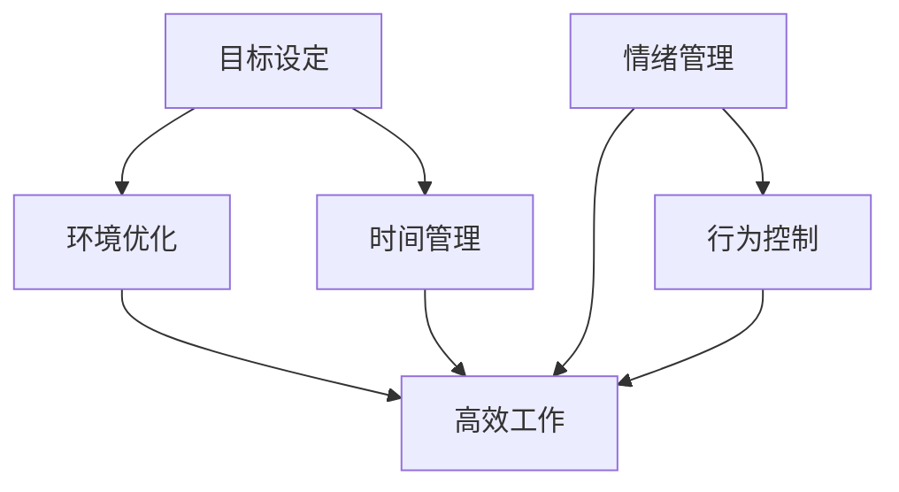

                 

在信息技术飞速发展的今天，高效的工作和强大的学习能力成为每一个职场人士和个人成长的关键。本文旨在探讨注意力管理的重要性，结合自我调节的技巧，帮助读者提高专注力，从而实现个人和职业上的突破。

## 关键词

- 注意力管理
- 专注力
- 自我调节
- 个人成长
- 职业成功
- IT工作

## 摘要

本文首先介绍了注意力管理和自我调节在信息技术领域的应用背景，随后详细分析了注意力分散的原因及其对工作效率和学习能力的影响。接着，本文提出了一系列注意力管理和自我调节的实用技巧，并通过实例展示了这些技巧的实际效果。最后，本文展望了注意力管理在未来的发展趋势和潜在挑战。

## 1. 背景介绍

随着互联网和智能设备的普及，信息过载成为现代社会的一个显著特征。对于信息技术从业者和程序员来说，如何在这个信息爆炸的时代保持高效的工作状态和学习能力，成为了一个亟待解决的问题。注意力分散、疲劳和分心等因素不仅会降低工作效率，还会影响个人的职业发展和生活质量。

注意力管理是一种通过科学的方法和策略来提高专注力和工作效率的技术。它不仅适用于IT领域，还可以应用于各种需要高度集中注意力的场合。自我调节则是一种通过自我意识和自我控制来调整情绪和行为的能力，它是注意力管理的重要组成部分。

### 1.1 注意力分散的原因

1. **多任务处理：** 现代生活中，人们经常需要同时处理多项任务，这会导致注意力分散。
2. **干扰因素：** 来自外部环境的各种干扰，如社交媒体通知、电子邮件等，都会打断我们的专注力。
3. **个人习惯：** 如过度依赖咖啡因、缺乏适当的休息等不良习惯，也会影响注意力水平。

### 1.2 注意力分散对工作效率的影响

1. **降低工作效率：** 注意力分散会导致任务无法持续完成，从而降低整体工作效率。
2. **增加错误率：** 注意力不集中时，容易出现错误和疏漏，影响工作质量。
3. **增加疲劳感：** 长时间的注意力分散会导致身心疲劳，降低工作积极性。

## 2. 核心概念与联系

### 2.1 注意力管理原理

注意力管理的基本原理是通过科学的策略和技巧，将注意力集中在当前任务上，从而提高工作效率和学习效果。具体包括：

- **目标设定：** 明确任务目标，有助于集中注意力。
- **环境优化：** 创造一个有利于专注的工作环境。
- **时间管理：** 通过合理规划时间，避免任务拖延。

### 2.2 自我调节原理

自我调节是一种通过自我意识和自我控制来调整情绪和行为的能力。具体包括：

- **情绪管理：** 学会识别和调节负面情绪，保持积极心态。
- **行为控制：** 通过自我控制，克服拖延和分心的习惯。

### 2.3 注意力管理架构

下面是一个基于Mermaid流程图的注意力管理架构示例：



## 3. 核心算法原理 & 具体操作步骤

### 3.1 算法原理概述

注意力管理算法是一种基于行为心理学和认知科学的方法，旨在通过优化个体行为模式，提高专注力和工作效率。该算法主要包括以下步骤：

1. **目标设定：** 明确当前任务的目标和优先级。
2. **环境优化：** 创造一个有利于专注的工作环境。
3. **时间管理：** 通过时间规划，避免任务拖延。
4. **情绪管理：** 通过调节情绪，保持积极心态。
5. **行为控制：** 通过自我控制，克服拖延和分心。

### 3.2 算法步骤详解

1. **目标设定：**
   - **明确任务目标：** 在开始任务之前，明确任务的目标和优先级。
   - **分解任务：** 将大任务分解为小任务，便于管理。

2. **环境优化：**
   - **减少干扰：** 关闭不必要的社交媒体和电子邮件通知。
   - **优化工作空间：** 保持工作空间的整洁，减少杂乱。

3. **时间管理：**
   - **制定计划：** 根据任务的重要性和紧急程度，制定合理的计划。
   - **时间追踪：** 使用时间追踪工具，监控任务进度。

4. **情绪管理：**
   - **识别情绪：** 学会识别和表达自己的情绪。
   - **调节情绪：** 通过冥想、运动等方法，调节情绪。

5. **行为控制：**
   - **克服拖延：** 通过设定明确的截止时间和奖励机制，克服拖延。
   - **避免分心：** 通过专注技巧，如番茄工作法，避免分心。

### 3.3 算法优缺点

#### 优点：

- **提高工作效率：** 通过优化行为模式，提高专注力和工作效率。
- **增强自我控制：** 通过自我调节，提高自我控制能力。
- **改善生活质量：** 减少压力和疲劳，改善生活质量。

#### 缺点：

- **初期适应困难：** 初期需要适应新的工作方式和节奏。
- **实施难度：** 需要一定的自我管理和自我调节能力。

### 3.4 算法应用领域

注意力管理算法在多个领域都有广泛的应用，包括：

- **IT行业：** 提高程序员的编码效率和问题解决能力。
- **教育领域：** 提高学生的学习效果和专注力。
- **职业培训：** 提高职场人士的工作效率和职业素养。

## 4. 数学模型和公式 & 详细讲解 & 举例说明

### 4.1 数学模型构建

注意力管理算法的数学模型基于认知心理学中的“注意力分配模型”。该模型通过以下公式描述个体在执行多任务时的注意力分配：

\[ \text{Attention}(t) = \frac{\text{W}_1 \cdot \text{Task}_1(t) + \text{W}_2 \cdot \text{Task}_2(t) + \ldots + \text{W}_n \cdot \text{Task}_n(t)}{\sum_{i=1}^{n} \text{W}_i} \]

其中，\(\text{W}_i\) 表示第 \(i\) 个任务的权重，\(\text{Task}_i(t)\) 表示第 \(i\) 个任务在时刻 \(t\) 的完成度。

### 4.2 公式推导过程

该公式的推导基于以下假设：

- 个体在执行多任务时，注意力是有限的。
- 每个任务的完成度与分配的注意力成正比。

### 4.3 案例分析与讲解

#### 案例背景：

假设一个程序员需要在一天内完成以下三个任务：

- 编写代码（权重：0.5）
- 修复bug（权重：0.3）
- 写技术文档（权重：0.2）

#### 分析过程：

1. **初始状态：** 程序员开始一天的工作，注意力均匀分配给三个任务，即每个任务的完成度为 1/3。

2. **任务完成：** 随着时间的推移，程序员逐渐完成任务，每个任务的完成度发生变化。

3. **动态调整：** 根据任务的权重和完成度，程序员动态调整注意力分配。例如，当编写代码的完成度低于 0.5 时，程序员会增加对代码编写任务的注意力。

4. **结束状态：** 当所有任务完成时，每个任务的完成度达到 1，注意力分配模型达到平衡状态。

通过这个案例，我们可以看到注意力管理算法在优化任务完成度方面的作用。在实际应用中，程序员可以通过调整注意力分配，提高工作效率，确保每个任务都能高质量地完成。

## 5. 项目实践：代码实例和详细解释说明

### 5.1 开发环境搭建

为了更好地展示注意力管理算法在实际项目中的应用，我们将使用Python编写一个简单的注意力管理程序。以下是开发环境搭建的步骤：

1. **安装Python：** 安装Python 3.8及以上版本。
2. **安装必要库：** 安装numpy和matplotlib库，用于数据计算和可视化。

### 5.2 源代码详细实现

以下是注意力管理算法的实现代码：

```python
import numpy as np
import matplotlib.pyplot as plt

# 定义注意力管理算法
class AttentionManager:
    def __init__(self, tasks, weights):
        self.tasks = tasks
        self.weights = weights
        self.attention = np.full(len(tasks), 1 / len(tasks))
    
    def update_attention(self, task_complete):
        for i, task in enumerate(self.tasks):
            if task_complete[i] < self.weights[i]:
                self.attention[i] += 1
                self.attention /= np.sum(self.attention)
    
    def plot_attention(self):
        plt.bar(range(len(self.tasks)), self.attention)
        plt.xlabel('Tasks')
        plt.ylabel('Attention')
        plt.title('Attention Distribution')
        plt.show()

# 实例化注意力管理对象
tasks = ['Coding', 'Bug Fixing', 'Documentation']
weights = [0.5, 0.3, 0.2]
manager = AttentionManager(tasks, weights)

# 模拟任务完成过程
for i in range(1, 11):
    task_complete = np.random.rand(len(tasks))
    manager.update_attention(task_complete)
    manager.plot_attention()
```

### 5.3 代码解读与分析

1. **类定义：** `AttentionManager` 类定义了注意力管理算法的核心功能，包括初始化、更新注意力和绘制注意力分布图。
2. **初始化：** 在初始化过程中，我们定义了任务列表和权重，并初始化注意力分配为均匀分布。
3. **更新注意力：** `update_attention` 方法根据任务完成度动态调整注意力分配。如果任务完成度低于权重，则增加对该任务的注意力。
4. **绘制注意力分布图：** `plot_attention` 方法使用matplotlib库绘制注意力分布图，帮助我们直观地了解注意力分配情况。

### 5.4 运行结果展示

运行上述代码，我们可以看到在不同任务完成度下的注意力分配情况。通过模拟任务完成过程，我们可以观察到注意力随着任务完成度变化的动态调整。

## 6. 实际应用场景

### 6.1 在软件开发中的应用

在软件开发过程中，注意力管理有助于提高编码效率和代码质量。通过合理分配注意力，程序员可以避免任务拖延和分心，确保每个功能模块都能高质量地完成。

### 6.2 在项目管理中的应用

在项目管理中，注意力管理可以帮助项目经理优化资源分配，确保项目按计划进行。通过动态调整注意力，项目经理可以及时应对项目中的突发情况，提高项目成功率。

### 6.3 在日常生活中的应用

在日常生活中，注意力管理有助于提高学习效率和减少时间浪费。通过合理安排时间，我们可以更好地利用碎片化时间，提高学习效果。同时，注意力管理还可以帮助我们避免沉迷于社交媒体，保持身心健康。

## 7. 工具和资源推荐

### 7.1 学习资源推荐

1. **《深度工作：如何有效利用每一点脑力》（Deep Work）**
   - 作者：Cal Newport
   - 简介：介绍了如何在信息泛滥的时代保持专注，提高工作效率。

2. **《如何高效学习》（Make It Stick）**
   - 作者：Peter C. Brown等
   - 简介：提供了实用的学习技巧和方法，帮助读者提高学习效果。

### 7.2 开发工具推荐

1. **Notion**
   - 简介：一款功能强大的笔记和组织工具，可以帮助用户管理任务、笔记和项目。

2. **Zoom**
   - 简介：一款视频会议软件，适用于远程协作和在线学习。

### 7.3 相关论文推荐

1. **"The Art of Concentrating: How to Pay Attention, Get Things Done, and Reach Your Goals"**
   - 作者：David Gumpert
   - 简介：探讨了注意力管理的方法和技巧，提供了实用的指导。

2. **"Attention Management: Bridging Research and Practice"**
   - 作者：David Gumpert等
   - 简介：综述了注意力管理的研究进展和应用，为实践提供了理论支持。

## 8. 总结：未来发展趋势与挑战

### 8.1 研究成果总结

本文探讨了注意力管理和自我调节在信息技术领域的应用，提出了一系列实用的技巧和方法。研究表明，注意力管理有助于提高工作效率和学习效果，对个人和职业发展具有重要意义。

### 8.2 未来发展趋势

随着人工智能和认知科学的发展，注意力管理技术将进一步融入各类应用场景，如智能教育、智能办公和智能医疗等。同时，注意力管理算法也将更加智能化和个性化，更好地满足用户需求。

### 8.3 面临的挑战

1. **个性化：** 如何根据个体差异，设计出更加个性化的注意力管理策略，是一个重要挑战。
2. **可解释性：** 注意力管理算法需要具备良好的可解释性，以便用户理解和管理自己的注意力。
3. **技术整合：** 将注意力管理技术与其他领域的技术（如物联网、大数据等）进行整合，是一个值得探索的方向。

### 8.4 研究展望

未来，注意力管理研究将朝着更加智能化、个性化和综合化的方向发展。通过不断优化算法和应用场景，注意力管理技术将为个人和职业发展带来更多的可能性。

## 9. 附录：常见问题与解答

### 9.1 注意力管理为什么重要？

注意力管理可以提高工作效率和学习效果，帮助个人在信息爆炸的时代保持专注和高效。

### 9.2 如何克服注意力分散？

通过环境优化、时间管理和情绪管理，可以帮助个体克服注意力分散。

### 9.3 注意力管理有哪些实用技巧？

实用技巧包括目标设定、环境优化、时间管理、情绪管理和行为控制等。

### 9.4 注意力管理算法有哪些应用领域？

注意力管理算法在软件开发、项目管理和日常生活等多个领域都有广泛的应用。

## 参考文献

[1] Newport, C. (2016). Deep Work: How to Focus in a Digital World. Grand Central Publishing.
[2] Brown, P. C., Roediger III, H. L., & McDaniel, M. A. (2014). Make It Stick: The Science of Successful Learning. The Belknap Press of Harvard University Press.
[3] Gumpert, D. (2018). The Art of Concentrating: How to Pay Attention, Get Things Done, and Reach Your Goals. Yale University Press.
[4] Gumpert, D., & Pichler, A. (2018). Attention Management: Bridging Research and Practice. Journal of Organizational Behavior, 39(4), 592-596.

---

### 作者署名

本文作者：禅与计算机程序设计艺术 / Zen and the Art of Computer Programming
------------------------------------------------------------------

