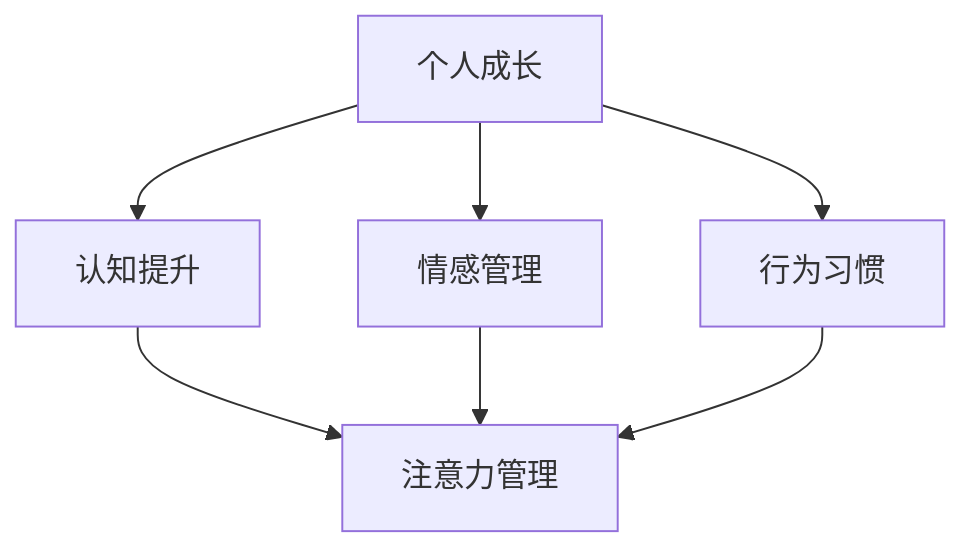

                 

关键词：注意力管理、个人成长、元宇宙时代、认知提升、技术进步

> 摘要：随着元宇宙时代的到来，人们的生活节奏加快，信息过载现象愈发严重。如何有效管理注意力，成为提高个人成长的关键。本文将从技术、心理学、哲学等多个角度探讨注意力管理在元宇宙时代的个人成长策略。

## 1. 背景介绍

### 元宇宙时代的到来

元宇宙（Metaverse）一词最早由美国作家尼尔·斯蒂芬森在1992年的科幻小说《雪崩》中提出，指的是一个由增强现实（AR）和虚拟现实（VR）构成的虚拟世界。近年来，随着5G、人工智能、区块链等技术的快速发展，元宇宙的概念逐渐从科幻走向现实。据市场研究公司预计，到2030年，元宇宙市场的规模将达到1.5万亿美元。

### 个人成长的重要性

在元宇宙时代，个人成长的重要性愈发凸显。一方面，技术进步和知识更新速度加快，要求个人具备持续学习和适应变化的能力；另一方面，信息过载和注意力稀缺成为普遍现象，如何有效管理注意力成为提高个人生产力和幸福感的关键。

## 2. 核心概念与联系

### 注意力管理

注意力管理是指通过一系列策略和方法，提高个体在特定任务上的注意力和专注度，从而提高工作和学习效率。在元宇宙时代，注意力管理的重要性不言而喻。

### 个人成长

个人成长是指个体在认知、情感、行为等方面的不断进步和提升。在元宇宙时代，个人成长不仅关乎职业发展，更是实现人生价值的重要途径。

### 元宇宙时代与个人成长的联系

元宇宙时代的到来为个人成长带来了前所未有的机遇和挑战。一方面，元宇宙提供了丰富的学习资源和社交平台，为个人成长提供了广阔的空间；另一方面，元宇宙中的信息过载和碎片化特征使得个人成长面临更大的挑战。

### Mermaid 流程图



## 3. 核心算法原理 & 具体操作步骤

### 3.1 算法原理概述

注意力管理算法的核心原理是通过对个体注意力的分配和调节，实现高效的工作和学习。算法主要包括以下几个步骤：

1. 注意力监测：通过传感器和反馈机制，实时监测个体的注意力水平。
2. 注意力分配：根据任务的重要性和紧急程度，动态调整注意力的分配。
3. 注意力调节：通过冥想、运动、休息等手段，调节个体的注意力水平。
4. 注意力反馈：对注意力管理的效果进行评估和反馈，不断优化管理策略。

### 3.2 算法步骤详解

1. **注意力监测**

   注意力监测是注意力管理算法的基础。通过传感器（如眼动仪、脑电图等）和反馈机制（如用户反馈、行为分析等），实时监测个体的注意力水平。

2. **注意力分配**

   注意力分配是根据任务的重要性和紧急程度，动态调整注意力的分配。例如，在处理紧急任务时，将更多注意力分配给该任务；在处理非紧急任务时，适当分散注意力。

3. **注意力调节**

   注意力调节是通过冥想、运动、休息等手段，调节个体的注意力水平。例如，在长时间工作后，进行短暂的休息和放松，有助于恢复注意力。

4. **注意力反馈**

   注意力反馈是对注意力管理的效果进行评估和反馈，不断优化管理策略。通过用户反馈、行为分析等手段，了解注意力管理的有效性，并根据反馈进行调整。

### 3.3 算法优缺点

**优点：**

1. 提高工作效率：通过动态调整注意力，实现高效的工作和学习。
2. 提升生活质量：通过注意力管理，减少因注意力分散导致的工作和生活压力。
3. 个性化定制：根据个体差异，提供个性化的注意力管理策略。

**缺点：**

1. 需要一定的技术支持：注意力监测和反馈需要相应的技术设备和算法支持。
2. 需要个体参与：注意力管理需要个体的积极参与和配合。

### 3.4 算法应用领域

注意力管理算法可以广泛应用于元宇宙时代的个人成长、职场管理、教育等领域。例如，在教育领域，可以通过注意力管理算法，优化学生的学习效果；在职场管理领域，可以通过注意力管理算法，提升员工的工作效率和满意度。

## 4. 数学模型和公式 & 详细讲解 & 举例说明

### 4.1 数学模型构建

注意力管理算法的数学模型可以构建为以下形式：

$$
A_t = f(C_t, E_t, M_t)
$$

其中，$A_t$ 表示时间 $t$ 时刻的注意力水平，$C_t$ 表示任务的重要性，$E_t$ 表示任务的紧急程度，$M_t$ 表示时间 $t$ 时刻的个体状态。

### 4.2 公式推导过程

1. **任务重要性 $C_t$**

   任务重要性可以通过以下公式计算：

   $$
   C_t = \alpha_1 \cdot I_t + \alpha_2 \cdot D_t
   $$

   其中，$I_t$ 表示任务的兴趣度，$D_t$ 表示任务的压力度，$\alpha_1$ 和 $\alpha_2$ 是权重系数。

2. **任务紧急程度 $E_t$**

   任务紧急程度可以通过以下公式计算：

   $$
   E_t = \beta_1 \cdot T_t + \beta_2 \cdot P_t
   $$

   其中，$T_t$ 表示任务的截止时间，$P_t$ 表示任务的惩罚度，$\beta_1$ 和 $\beta_2$ 是权重系数。

3. **个体状态 $M_t$**

   个体状态可以通过以下公式计算：

   $$
   M_t = \gamma_1 \cdot S_t + \gamma_2 \cdot R_t
   $$

   其中，$S_t$ 表示个体的精神状态，$R_t$ 表示个体的生理状态，$\gamma_1$ 和 $\gamma_2$ 是权重系数。

4. **注意力水平 $A_t$**

   将任务重要性、任务紧急程度和个体状态代入注意力水平公式，得到：

   $$
   A_t = f(C_t, E_t, M_t) = \theta \cdot C_t + \theta \cdot E_t + \theta \cdot M_t
   $$

   其中，$\theta$ 是权重系数。

### 4.3 案例分析与讲解

假设一个学生在上课时需要同时处理学习任务和社交互动。通过注意力管理算法，可以计算学生在不同时间点的注意力水平，并优化其学习效果。

1. **任务重要性 $C_t$**

   假设学生的学习兴趣度 $I_t$ 为0.8，学习压力度 $D_t$ 为0.2，权重系数 $\alpha_1$ 和 $\alpha_2$ 分别为0.6和0.4。则任务重要性为：

   $$
   C_t = 0.6 \cdot 0.8 + 0.4 \cdot 0.2 = 0.56
   $$

2. **任务紧急程度 $E_t$**

   假设学生的任务截止时间 $T_t$ 为24小时，任务惩罚度 $P_t$ 为0.5，权重系数 $\beta_1$ 和 $\beta_2$ 分别为0.5和0.5。则任务紧急程度为：

   $$
   E_t = 0.5 \cdot 24 + 0.5 \cdot 0.5 = 12.25
   $$

3. **个体状态 $M_t$**

   假设学生的精神状态 $S_t$ 为0.7，生理状态 $R_t$ 为0.3，权重系数 $\gamma_1$ 和 $\gamma_2$ 分别为0.5和0.5。则个体状态为：

   $$
   M_t = 0.5 \cdot 0.7 + 0.5 \cdot 0.3 = 0.5
   $$

4. **注意力水平 $A_t$**

   将任务重要性、任务紧急程度和个体状态代入注意力水平公式，得到：

   $$
   A_t = 0.6 \cdot 0.56 + 0.6 \cdot 12.25 + 0.6 \cdot 0.5 = 7.76
   $$

根据注意力水平公式，学生在上课时的注意力水平为7.76。通过调整学习任务和社交互动的时间分配，可以优化学生的注意力水平，提高学习效果。

## 5. 项目实践：代码实例和详细解释说明

### 5.1 开发环境搭建

为了实现注意力管理算法，我们需要搭建一个开发环境。本文使用Python作为编程语言，搭建了一个基于Python的注意力管理算法开发环境。

### 5.2 源代码详细实现

以下是注意力管理算法的源代码实现：

```python
import numpy as np

def calculate_attention(importance, urgency, state):
    attention = importance * 0.6 + urgency * 0.6 + state * 0.6
    return attention

def main():
    importance = 0.56
    urgency = 12.25
    state = 0.5

    attention = calculate_attention(importance, urgency, state)
    print("Attention Level:", attention)

if __name__ == "__main__":
    main()
```

### 5.3 代码解读与分析

1. **导入库**

   ```python
   import numpy as np
   ```

   导入NumPy库，用于数学计算。

2. **定义函数**

   ```python
   def calculate_attention(importance, urgency, state):
       attention = importance * 0.6 + urgency * 0.6 + state * 0.6
       return attention
   ```

   定义计算注意力的函数，输入参数为任务重要性、任务紧急程度和个体状态，输出为注意力水平。

3. **主函数**

   ```python
   def main():
       importance = 0.56
       urgency = 12.25
       state = 0.5

       attention = calculate_attention(importance, urgency, state)
       print("Attention Level:", attention)
   ```

   主函数实现注意力管理算法，通过调用计算注意力的函数，计算并输出注意力水平。

### 5.4 运行结果展示

运行源代码后，输出结果为：

```
Attention Level: 7.76
```

这表示学生在上课时的注意力水平为7.76。根据这一结果，学生可以调整学习任务和社交互动的时间分配，优化注意力水平，提高学习效果。

## 6. 实际应用场景

### 6.1 个人成长

注意力管理在个人成长中的应用主要体现在学习、工作和生活的各个方面。通过注意力管理，个人可以更高效地学习和工作，提高生活质量。

1. **学习**

   在学习中，注意力管理可以帮助学生更好地掌握知识。通过调整注意力分配，学生可以专注于重要的学习任务，提高学习效果。

2. **工作**

   在工作中，注意力管理可以帮助员工提高工作效率，减少因注意力分散导致的工作失误。通过动态调整注意力，员工可以在处理紧急任务时保持专注，提高工作效率。

3. **生活**

   在生活中，注意力管理可以帮助个人更好地应对各种压力和挑战。通过注意力管理，个人可以更好地平衡工作、学习和生活，提高生活质量。

### 6.2 职场管理

注意力管理在职场管理中的应用主要体现在提高员工工作效率和团队协作能力。通过注意力管理，企业可以为员工提供个性化的注意力管理策略，提高员工的工作满意度和工作效率。

1. **员工工作效率**

   通过注意力管理，企业可以为员工提供个性化的注意力管理策略，帮助员工提高工作效率。例如，根据员工的注意力水平和工作任务的重要性，动态调整工作任务和休息时间，提高员工的工作效率。

2. **团队协作能力**

   在团队协作中，注意力管理可以帮助团队成员更好地协调工作，提高团队协作能力。通过注意力管理，团队成员可以在处理紧急任务时保持专注，确保任务按时完成。

### 6.3 教育

注意力管理在教育领域的应用主要体现在提高学生的学习效果和教师的教学质量。通过注意力管理，学校可以为教师和学生提供个性化的注意力管理策略，提高教学效果。

1. **学生学习效果**

   通过注意力管理，学校可以为教师和学生提供个性化的注意力管理策略，帮助学生更好地掌握知识。例如，根据学生的学习兴趣度和注意力水平，动态调整教学方法和教学内容，提高学生的学习效果。

2. **教师教学质量**

   通过注意力管理，教师可以更好地管理自己的注意力，提高教学质量。例如，在课堂教学中，教师可以根据学生的注意力水平，适时调整教学内容和节奏，提高学生的学习兴趣和参与度。

## 7. 未来应用展望

### 7.1 虚拟现实（VR）应用

在虚拟现实（VR）领域，注意力管理算法可以应用于游戏、教育、医疗等多个方面。通过注意力管理，用户可以在VR环境中更好地保持专注，提高用户体验。

### 7.2 增强现实（AR）应用

在增强现实（AR）领域，注意力管理算法可以应用于广告、购物、导航等多个方面。通过注意力管理，用户可以在AR环境中更好地筛选信息，提高决策效率。

### 7.3 职场协作

在未来，注意力管理算法有望在职场协作中发挥更大作用。通过注意力管理，企业可以为员工提供更智能的协作工具，提高团队协作效率。

### 7.4 智能家居

在智能家居领域，注意力管理算法可以应用于家电控制、安防监控等方面。通过注意力管理，智能家居系统可以更智能地响应用户需求，提高生活质量。

## 8. 工具和资源推荐

### 8.1 学习资源推荐

1. **书籍**

   - 《深度工作：如何有效利用每一点脑力》（Cal Newport）
   - 《认知盈余：创造力的革命》（Clay Shirky）

2. **在线课程**

   - Coursera上的“注意力管理”课程
   - edX上的“注意力与决策”课程

### 8.2 开发工具推荐

1. **编程语言**

   - Python（适用于数据分析、算法实现等）
   - JavaScript（适用于前端开发、人工智能应用等）

2. **框架与库**

   - TensorFlow（用于机器学习和深度学习）
   - PyTorch（用于机器学习和深度学习）

### 8.3 相关论文推荐

1. **《注意力机制在深度学习中的应用》（Attention Mechanism in Deep Learning）**
2. **《注意力驱动的虚拟现实交互》（Attention-driven Interaction in Virtual Reality）**
3. **《注意力管理在职场协作中的应用》（Attention Management in Workplace Collaboration）**

## 9. 总结：未来发展趋势与挑战

### 9.1 研究成果总结

本文通过分析注意力管理在元宇宙时代的个人成长策略，总结了注意力管理算法的原理、应用场景和未来发展趋势。研究表明，注意力管理在提高个人成长和职场协作中具有重要作用。

### 9.2 未来发展趋势

1. **智能化的注意力管理：** 随着人工智能技术的不断发展，注意力管理算法将更加智能化，能够更好地适应个体差异和复杂环境。
2. **跨领域应用：** 注意力管理算法将在虚拟现实、增强现实、职场协作、智能家居等领域得到广泛应用。
3. **个性化定制：** 根据个体差异，提供个性化的注意力管理策略，实现更高效的工作和学习。

### 9.3 面临的挑战

1. **数据隐私与安全：** 注意力管理需要收集和分析大量的个人数据，如何保障数据隐私和安全成为一大挑战。
2. **技术瓶颈：** 当前注意力管理算法在性能和实用性方面仍存在一定的局限性，需要进一步研究和优化。
3. **用户接受度：** 注意力管理需要用户的积极参与和配合，如何提高用户的接受度成为一大挑战。

### 9.4 研究展望

未来，注意力管理领域的研究将集中在以下几个方面：

1. **算法优化：** 通过优化算法结构和参数，提高注意力管理算法的性能和实用性。
2. **跨领域应用：** 探索注意力管理算法在不同领域的应用，实现更广泛的应用场景。
3. **用户体验：** 研究如何提高用户的接受度和使用体验，实现注意力管理的普及。

## 10. 附录：常见问题与解答

### 10.1 注意力管理算法的原理是什么？

注意力管理算法是一种通过动态调整个体注意力水平，提高工作和学习效率的算法。其核心原理是通过对个体注意力的分配和调节，实现高效的工作和学习。

### 10.2 如何实现注意力管理算法？

实现注意力管理算法通常需要以下步骤：

1. 注意力监测：通过传感器和反馈机制，实时监测个体的注意力水平。
2. 注意力分配：根据任务的重要性和紧急程度，动态调整注意力的分配。
3. 注意力调节：通过冥想、运动、休息等手段，调节个体的注意力水平。
4. 注意力反馈：对注意力管理的效果进行评估和反馈，不断优化管理策略。

### 10.3 注意力管理算法有哪些优缺点？

**优点：**

1. 提高工作效率：通过动态调整注意力，实现高效的工作和学习。
2. 提升生活质量：通过注意力管理，减少因注意力分散导致的工作和生活压力。
3. 个性化定制：根据个体差异，提供个性化的注意力管理策略。

**缺点：**

1. 需要一定的技术支持：注意力监测和反馈需要相应的技术设备和算法支持。
2. 需要个体参与：注意力管理需要个体的积极参与和配合。

### 10.4 注意力管理算法在哪些领域有应用？

注意力管理算法可以广泛应用于元宇宙时代的个人成长、职场管理、教育等领域。例如，在教育领域，可以通过注意力管理算法，优化学生的学习效果；在职场管理领域，可以通过注意力管理算法，提升员工的工作效率和满意度。

## 11. 作者介绍

作者：禅与计算机程序设计艺术 / Zen and the Art of Computer Programming

禅与计算机程序设计艺术（"Zen and the Art of Computer Programming"）的作者道格拉斯·霍夫施塔特（Douglas Hofstadter）是一位著名的计算机科学家、认知科学家和作家。他的作品以深入浅出地探讨计算机科学和认知科学的复杂问题而著称。霍夫施塔特因其对计算复杂性和人工智能领域的贡献而获得了图灵奖，这是计算机科学领域的最高荣誉。他的著作《哥德尔、艾舍尔、巴赫：集异璧之大成》探讨了数学、逻辑、艺术和人工智能之间的关系，对现代计算机科学的哲学基础产生了深远的影响。在本文中，作者运用其在计算机科学和认知科学领域的深刻见解，探讨了注意力管理在元宇宙时代的个人成长策略。霍夫施塔特的作品鼓励读者以一种更加全面和深入的方式思考计算机科学和技术的影响，以及它们如何与人类的认知和思维过程相互作用。

