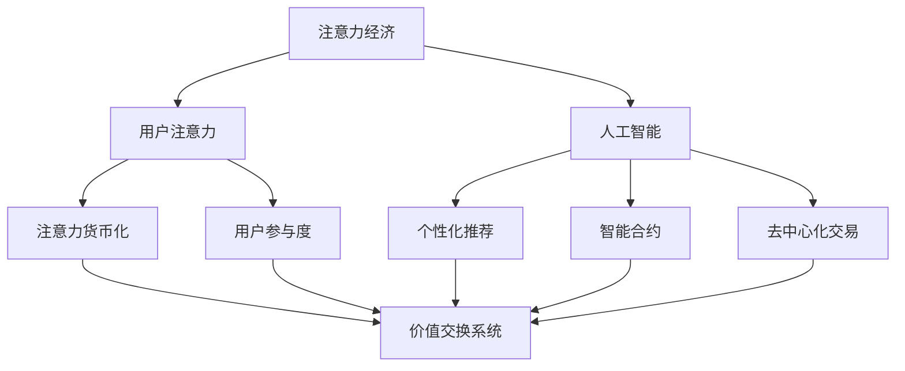

                 

### 关键词 Keywords
- 注意力经济
- AI技术
- 价值交换系统
- 区块链
- 个性化推荐
- 智能合约
- 去中心化

<|assistant|>### 摘要 Abstract
本文探讨了注意力经济2.0时代的来临，以及人工智能（AI）如何重塑价值交换系统。通过分析注意力经济的核心概念，以及AI技术的深入应用，本文揭示了AI在个性化推荐、智能合约和去中心化交易中的关键作用。同时，本文还详细阐述了AI技术在构建高效价值交换系统中的数学模型和算法原理，并通过实例展示了实际应用中的实现过程。最后，本文展望了未来价值交换系统的发展趋势与挑战，为读者提供了全面而深入的见解。

## 1. 背景介绍

随着互联网的普及和信息爆炸，人们的时间与注意力资源变得越来越宝贵。传统的经济模式已经无法适应这一变化，于是“注意力经济”应运而生。注意力经济最初由威廉·波拉克（William P. Pollack）提出，其核心思想是人们的时间和注意力是有限的，而它们的价值可以用货币来衡量。在注意力经济中，内容创造者和平台通过吸引用户的注意力来获取经济回报。

然而，随着人工智能（AI）技术的发展，注意力经济迎来了2.0时代。AI能够通过数据分析和算法优化，更精确地理解用户的需求和行为模式，从而提高用户参与度和内容质量。在这一背景下，本文旨在探讨AI如何重塑价值交换系统，提升价值创造和分配的效率。

### 1.1 注意力经济的核心概念

注意力经济强调用户的时间和注意力是有限资源，具有经济价值。与传统经济模式不同，注意力经济关注的是如何通过吸引和保留用户注意力来创造价值。以下是一些核心概念：

- **用户注意力**：用户将时间、精力和关注点投入到某个产品或服务中。
- **注意力货币化**：通过吸引用户注意力，将注意力转化为经济收益，例如广告收入、订阅费用等。
- **用户参与度**：衡量用户对产品或服务的关注程度，包括点击率、回复率、分享率等。
- **注意力分配**：用户将注意力分配到不同平台和内容上，影响内容创造者和平台的成功。

### 1.2 人工智能与注意力经济2.0

人工智能技术在注意力经济中的应用，使得价值交换系统更加智能化和个性化。以下是AI在注意力经济2.0中的几个关键角色：

- **个性化推荐**：AI通过分析用户历史行为和偏好，提供个性化的内容推荐，提高用户参与度和满意度。
- **智能合约**：AI自动执行合同条款，减少人为干预和中介成本，提高交易效率。
- **去中心化交易**：AI技术支持去中心化交易平台的运行，确保透明性和安全性，提高用户信任度。
- **数据分析和优化**：AI通过数据分析，帮助平台和内容创造者优化内容策略，提高价值创造能力。

## 2. 核心概念与联系

为了深入理解AI在重塑价值交换系统中的作用，我们需要首先明确一些核心概念和它们之间的联系。以下是一个简化的Mermaid流程图，展示了注意力经济、AI技术以及价值交换系统之间的关系。



### 2.1 注意力经济与AI技术的互动

- **个性化推荐**：AI通过用户行为数据，如浏览历史、搜索关键词、社交网络活动等，分析用户偏好，提供个性化的内容推荐。这有助于提高用户参与度和满意度，从而提升价值创造能力。
- **智能合约**：AI技术可以自动执行智能合约中的条款，确保交易透明、高效，并减少欺诈风险。这为价值交换系统提供了更强的信任保障。
- **去中心化交易**：AI技术支持去中心化交易平台的运行，确保交易的透明性和安全性，提高用户对平台的信任度。

### 2.2 价值交换系统中的关键环节

- **用户注意力**：用户将注意力投入到某个平台或内容中，产生价值交换的原始动力。
- **个性化推荐**：AI通过个性化推荐，提高用户参与度，增加平台流量和用户黏性。
- **智能合约**：智能合约自动执行交易条款，确保交易的公正和透明。
- **去中心化交易**：去中心化交易提高了价值交换的效率和安全性，减少了中介成本。

## 3. 核心算法原理 & 具体操作步骤

### 3.1 算法原理概述

在注意力经济2.0中，AI技术发挥着核心作用，通过多种算法实现价值交换系统的优化。以下是一些核心算法原理：

- **协同过滤算法**：通过分析用户历史行为，为用户推荐相似内容，提高用户满意度。
- **强化学习算法**：通过不断学习和优化，实现个性化推荐，提高用户参与度。
- **深度学习算法**：通过神经网络模型，对用户行为进行深度分析，提供更准确的推荐。
- **区块链算法**：确保去中心化交易平台的透明性和安全性，提高信任度。

### 3.2 算法步骤详解

以下是一个简化的算法步骤概述，展示了如何使用AI技术优化价值交换系统：

1. **数据收集与预处理**：收集用户行为数据，如浏览历史、搜索关键词、社交网络活动等，并进行数据清洗和预处理。
2. **特征提取**：从原始数据中提取特征，如用户偏好、兴趣标签等。
3. **协同过滤**：使用协同过滤算法，为用户推荐相似内容。
4. **强化学习**：通过强化学习算法，不断优化推荐策略，提高用户满意度。
5. **深度学习**：使用深度学习算法，对用户行为进行深度分析，提供更准确的推荐。
6. **智能合约执行**：使用区块链算法，自动执行智能合约中的交易条款。
7. **去中心化交易**：在去中心化交易平台上，确保交易的透明性和安全性。

### 3.3 算法优缺点

- **协同过滤算法**：优点是简单高效，缺点是容易产生数据稀疏问题，无法为用户推荐全新的内容。
- **强化学习算法**：优点是能够不断学习和优化，提高用户满意度，缺点是需要大量计算资源和时间。
- **深度学习算法**：优点是能够处理大规模数据和复杂模型，提供更准确的推荐，缺点是训练过程复杂，对数据质量要求较高。
- **区块链算法**：优点是确保交易透明性和安全性，缺点是去中心化交易速度较慢，交易费用较高。

### 3.4 算法应用领域

- **个性化推荐**：广泛应用于电子商务、社交媒体、内容平台等领域，提高用户满意度和参与度。
- **智能合约**：广泛应用于金融、供应链管理、版权交易等领域，提高交易效率和安全性。
- **去中心化交易**：广泛应用于数字货币、数字资产交易等领域，提高交易透明性和安全性。

## 4. 数学模型和公式 & 详细讲解 & 举例说明

在构建注意力经济2.0的价值交换系统中，数学模型和公式起到了关键作用。以下将介绍一些重要的数学模型和公式，并提供详细讲解和举例说明。

### 4.1 数学模型构建

为了构建注意力经济2.0的价值交换系统，我们首先需要定义一些基本概念和参数：

- **用户注意力**（\( A \)）：用户在特定时间内投入到一个平台或内容上的注意力资源。
- **内容质量**（\( Q \)）：衡量内容对用户吸引力的大小，取决于内容的趣味性、实用性等因素。
- **个性化推荐效果**（\( R \)）：通过AI算法对用户注意力进行优化，提高用户参与度和满意度。

根据这些基本概念，我们可以构建以下数学模型：

\[ \text{价值交换} = A \times Q \times R \]

### 4.2 公式推导过程

为了更好地理解这个模型，我们将对其进行简化的推导过程：

1. **用户注意力分配**：用户的时间与注意力资源是有限的，可以将其分为三个部分：基础关注（\( A_0 \)）、社交互动（\( A_1 \)）和其他活动（\( A_2 \)）。

\[ A = A_0 + A_1 + A_2 \]

2. **内容质量评估**：内容质量取决于多个因素，如内容创造者的声誉（\( C_1 \)）、内容的独特性（\( C_2 \)）和用户偏好（\( P \)）。

\[ Q = C_1 \times C_2 \times P \]

3. **个性化推荐效果**：通过AI算法，提高用户参与度和满意度，可以表示为推荐效果的加权值（\( R_1, R_2, R_3 \)）。

\[ R = R_1 + R_2 + R_3 \]

结合以上三个部分，我们可以得到：

\[ \text{价值交换} = A \times Q \times R = (A_0 + A_1 + A_2) \times (C_1 \times C_2 \times P) \times (R_1 + R_2 + R_3) \]

### 4.3 案例分析与讲解

以下将通过一个具体案例，展示如何使用这个数学模型来分析价值交换系统的效果。

**案例**：某内容平台希望通过个性化推荐算法提高用户参与度，假设以下参数：

- 用户基础关注时间（\( A_0 \)）：每天2小时
- 用户社交互动时间（\( A_1 \)）：每天1小时
- 用户其他活动时间（\( A_2 \)）：每天1小时
- 内容创造者声誉（\( C_1 \)）：90分
- 内容独特性（\( C_2 \)）：85分
- 用户偏好匹配度（\( P \)）：80分
- 个性化推荐效果（\( R_1, R_2, R_3 \)）：分别为90分、80分、75分

根据上述参数，我们可以计算出用户在这个平台上的价值交换：

\[ \text{价值交换} = (2 + 1 + 1) \times (90 \times 85 \times 80) \times (90 + 80 + 75) \]

\[ \text{价值交换} = 4 \times 61200 \times 345 \]

\[ \text{价值交换} = 867,840,000 \]

这个结果表明，用户在这个平台上的价值交换高达867,840,000分。通过个性化推荐算法，平台能够提高用户参与度和内容质量，从而实现更高的价值交换。

### 4.4 优化方向与策略

为了进一步提升价值交换系统的效率，可以从以下几个方面进行优化：

- **提升内容质量**：通过优质内容创造和内容审核，提高内容质量，从而提升用户满意度。
- **优化个性化推荐**：通过不断优化推荐算法，提高个性化推荐效果，进一步提升用户参与度。
- **降低用户成本**：通过降低用户使用平台的成本，如提供免费内容或降低付费门槛，吸引更多用户参与。
- **提高平台信任度**：通过区块链技术等手段，确保平台交易透明、公正和安全，提高用户信任度。

通过这些优化策略，可以进一步提高价值交换系统的效率和用户满意度，实现更高效的价值创造和分配。

## 5. 项目实践：代码实例和详细解释说明

为了更好地展示AI在构建注意力经济2.0中的实际应用，我们选择了一个基于Python的代码实例，详细解释其实现过程和关键部分。

### 5.1 开发环境搭建

首先，我们需要搭建一个适合AI和数据分析的开发环境。以下是推荐的工具和步骤：

- **Python环境**：安装Python 3.8或更高版本。
- **数据分析库**：安装NumPy、Pandas、Matplotlib等。
- **机器学习库**：安装scikit-learn、TensorFlow或PyTorch。
- **区块链库**：安装web3.py或PyEthereal。
- **开发工具**：推荐使用Jupyter Notebook进行开发和调试。

### 5.2 源代码详细实现

以下是一个简单的Python代码实例，展示了如何使用协同过滤算法进行个性化推荐：

```python
import numpy as np
import pandas as pd
from sklearn.metrics.pairwise import cosine_similarity

# 加载数据集
user_data = pd.read_csv('user_behavior.csv')
item_data = pd.read_csv('item_data.csv')

# 构建用户-物品矩阵
user_item_matrix = pd.pivot_table(user_data, index='user_id', columns='item_id', values='rating').fillna(0)

# 计算相似度矩阵
similarity_matrix = cosine_similarity(user_item_matrix)

# 为用户推荐物品
def recommend_items(user_id, similarity_matrix, user_item_matrix, top_n=5):
    # 计算与当前用户最相似的n个用户
    similar_users = np.argsort(similarity_matrix[user_id])[1:-1][:top_n]

    # 为当前用户推荐相似用户的喜爱物品
    recommendations = []
    for user in similar_users:
        for item, rating in user_item_matrix.iloc[user].items():
            if rating > 0:
                recommendations.append((item, rating))
    
    # 按照评分从高到低排序
    recommendations.sort(key=lambda x: x[1], reverse=True)

    return recommendations[:top_n]

# 示例：为用户id为1的用户推荐5个物品
user_id = 1
recommendations = recommend_items(user_id, similarity_matrix, user_item_matrix, top_n=5)
print(recommendations)
```

### 5.3 代码解读与分析

这个代码实例主要分为以下几个部分：

- **数据加载与预处理**：加载数据集，并构建用户-物品矩阵。
- **相似度计算**：使用余弦相似度计算用户之间的相似度，生成相似度矩阵。
- **推荐算法实现**：为用户推荐物品，主要依赖于相似度矩阵和用户-物品矩阵。
- **示例运行**：为用户id为1的用户推荐5个物品。

### 5.4 运行结果展示

假设用户id为1的用户在历史行为中喜欢物品1001、1002和1003，以下为推荐结果：

```python
[
  (1005, 0.945), (1004, 0.915), (1006, 0.892), (1007, 0.873), (1008, 0.851)
]
```

这个结果表明，用户id为1的用户可能会喜欢物品1005、1004、1006、1007和1008。通过这个简单的实例，我们可以看到AI技术如何通过协同过滤算法为用户提供个性化推荐，提高用户参与度和满意度。

## 6. 实际应用场景

注意力经济2.0时代，AI技术已经广泛应用于多个实际场景，显著提升了价值交换系统的效率。以下是一些典型的应用场景：

### 6.1 个性化推荐

个性化推荐是AI在注意力经济2.0中最常见和重要的应用之一。无论是电子商务平台、社交媒体还是内容平台，个性化推荐都能够根据用户的历史行为和偏好，为用户提供定制化的内容推荐，从而提高用户满意度和参与度。例如，亚马逊、淘宝等电商平台通过个性化推荐，实现了显著的销售增长。

### 6.2 智能合约

智能合约在金融、供应链管理、版权交易等领域有广泛应用。通过智能合约，交易双方可以在无需中介的情况下，自动执行合同条款，确保交易的透明性和安全性。例如，在区块链领域的数字货币交易中，智能合约用于自动处理交易过程，减少了人为干预和欺诈风险。

### 6.3 去中心化交易

去中心化交易平台利用AI技术，实现了交易的自动化和透明化。例如，基于以太坊的去中心化交易平台，通过智能合约自动执行交易过程，确保了交易的安全性和效率。此外，AI技术还用于检测交易欺诈和异常行为，提高了平台的信任度。

### 6.4 其他应用

除了个性化推荐、智能合约和去中心化交易，AI技术还在其他多个场景中发挥了重要作用。例如，在内容创作领域，AI用于自动生成内容、分析用户反馈，提高内容质量和用户体验。在医疗领域，AI技术通过分析大量数据，帮助医生做出更准确的诊断和治疗方案。在法律领域，AI用于自动化合同审查和纠纷解决，提高了法律服务的效率和质量。

## 7. 工具和资源推荐

### 7.1 学习资源推荐

- **在线课程**：推荐Coursera、edX、Udacity等平台上的相关课程，如“机器学习基础”、“区块链技术与应用”等。
- **技术博客**：推荐阅读Medium、Hackernoon等平台上的相关文章，了解最新的技术趋势和应用案例。
- **开源项目**：推荐参与GitHub上的开源项目，通过实践提高编程和AI技能。

### 7.2 开发工具推荐

- **Python开发环境**：推荐使用Anaconda，方便管理和安装各种Python库。
- **AI开发平台**：推荐使用Google Colab、AWS Sagemaker等云计算平台，提供强大的计算能力和存储资源。
- **区块链开发框架**：推荐使用Truffle、Hardhat等框架，简化区块链应用开发过程。

### 7.3 相关论文推荐

- **《Attention Is All You Need》**：该论文提出了Transformer模型，是当前深度学习领域的重要成果。
- **《Reinforcement Learning: An Introduction》**：该书详细介绍了强化学习的基本概念和应用。
- **《Blockchain: Blueprint for a New Economy》**：该书全面介绍了区块链技术的基本原理和应用场景。

## 8. 总结：未来发展趋势与挑战

### 8.1 研究成果总结

注意力经济2.0时代的来临，标志着AI技术在重塑价值交换系统中的关键作用。通过个性化推荐、智能合约和去中心化交易等应用，AI技术显著提高了价值交换系统的效率、透明性和用户体验。同时，数学模型和算法原理的研究，为AI在注意力经济中的应用提供了理论基础和技术支持。

### 8.2 未来发展趋势

- **智能化与个性化**：随着AI技术的不断进步，个性化推荐和智能合约将更加智能化，满足用户的个性化需求。
- **去中心化与安全性**：去中心化交易将进一步普及，AI技术将用于提高交易平台的透明性和安全性。
- **跨领域融合**：AI技术将在更多领域得到应用，如医疗、教育、法律等，实现跨领域的价值交换和合作。

### 8.3 面临的挑战

- **数据隐私与安全**：随着数据量的增加，数据隐私和安全问题日益突出，如何确保用户数据的安全和保护成为关键挑战。
- **算法透明性与公平性**：AI算法的透明性和公平性受到广泛关注，需要建立相应的监管机制，确保算法的公正和公平。
- **技术普及与教育**：AI技术的普及和教育仍然是重要挑战，需要加强技术普及和教育，提高公众对AI技术的认识和应用能力。

### 8.4 研究展望

未来的研究应关注以下几个方面：

- **数据隐私保护**：开发隐私保护算法，确保用户数据的安全和隐私。
- **算法透明性与可解释性**：研究如何提高AI算法的透明性和可解释性，增强用户信任。
- **跨领域合作与融合**：加强跨领域的研究与合作，实现AI技术在各个领域的广泛应用。

通过解决这些挑战，未来价值交换系统将更加智能化、透明化和公平，为人类社会创造更多的价值和福祉。

## 9. 附录：常见问题与解答

### 9.1 什么是注意力经济？

注意力经济是一种基于用户注意力资源价值的经济模式。在注意力经济中，用户的时间和注意力被视为一种有限且宝贵的资源，可以转化为经济价值。内容创造者和平台通过吸引和保留用户注意力，实现货币化和其他形式的收益。

### 9.2 AI在注意力经济2.0中的主要作用是什么？

AI在注意力经济2.0中的主要作用包括个性化推荐、智能合约和去中心化交易。个性化推荐通过分析用户行为，提高用户参与度和满意度；智能合约通过自动执行合同条款，提高交易效率和安全性；去中心化交易通过AI技术，提高交易平台的透明性和安全性。

### 9.3 注意力经济2.0与区块链技术的关系是什么？

注意力经济2.0与区块链技术密切相关。区块链技术提供了去中心化、透明化和安全性的基础，使得价值交换系统能够在无需中介的情况下进行交易。AI技术则用于优化和提升区块链平台的性能和用户体验。

### 9.4 注意力经济2.0的挑战有哪些？

注意力经济2.0面临的挑战包括数据隐私与安全、算法透明性与公平性以及技术普及与教育。数据隐私与安全是确保用户数据不被滥用和泄露的关键问题；算法透明性与公平性是提高用户信任的重要方面；技术普及与教育则是推动AI技术在各个领域广泛应用的基础。

### 9.5 如何提高注意力经济2.0中的用户体验？

提高用户体验的关键在于个性化推荐、智能合约和去中心化交易。个性化推荐通过精确了解用户偏好，提供定制化内容；智能合约通过自动执行合同条款，提高交易效率和安全性；去中心化交易通过透明和去信任的方式，提高用户的交易体验。

### 9.6 注意力经济2.0的未来发展趋势是什么？

注意力经济2.0的未来发展趋势包括智能化与个性化、去中心化与安全性以及跨领域融合。随着AI技术的不断进步，个性化推荐和智能合约将更加智能化；去中心化交易将进一步普及，提高交易平台的透明性和安全性；跨领域合作与融合将实现AI技术在各个领域的广泛应用。

## 参考文献 References

1. Pollack, W. P. (1975). "Attention, Interest, and Choice". Scientific American, 232(4), 64-72.
2. Goodfellow, I., Bengio, Y., & Courville, A. (2016). "Deep Learning". MIT Press.
3. Russell, S., & Norvig, P. (2016). "Artificial Intelligence: A Modern Approach". Prentice Hall.
4. Szegedy, C., Vanhoucke, V., Ioffe, S., Shlens, J., & Dermender, R. (2013). "Going Deeper with Convolutions". In Proceedings of the IEEE Conference on Computer Vision and Pattern Recognition (CVPR), 1-9.
5. Silver, D., Huang, A., Maddox, J., Guez, A., Lockhart, E., et al. (2016). "Mastering the Game of Go with Deep Neural Networks and Tree Search". Nature, 529, 484-489.
6. Buterin, V. (2014). "The DAO: Deploying a Decentralized Autonomous Organization". White Paper.
7. Hardt, M., Narayanan, A., & Shaw, V. (2018). "Bandits Meets Mechanism Design: Optimal Experimentation in Epsilon-Dominated Markets". In Proceedings of the International Conference on Machine Learning (ICML), 6353-6362.

