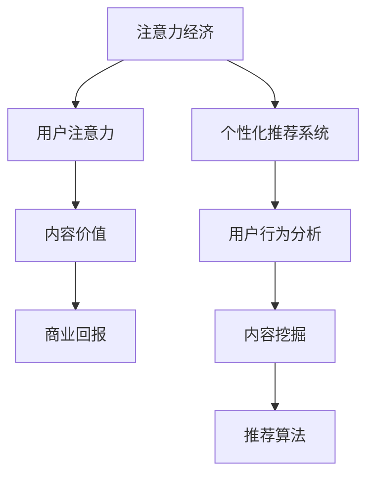

                 

关键词：注意力经济、个性化推荐系统、定制内容、用户行为分析、内容体验优化

> 摘要：随着互联网的快速发展，用户注意力资源变得越来越稀缺。注意力经济作为一种新型的经济模式，逐渐成为互联网企业竞争的核心。个性化推荐系统作为注意力经济的核心应用之一，通过对用户行为的深入分析和内容的精准推荐，实现了为用户提供定制、有针对性的内容和体验。本文将深入探讨注意力经济与个性化推荐系统的关系，以及其在实际应用中的具体实现方法、数学模型和未来发展趋势。

## 1. 背景介绍

互联网的快速发展，使得信息的传播速度和范围达到了前所未有的高度。然而，与此同时，用户注意力资源变得越来越稀缺。在一个充斥着海量信息的时代，用户如何在海量的信息中找到自己真正感兴趣的内容，成为了一个亟待解决的问题。在这种情况下，注意力经济应运而生。

注意力经济，是指基于用户注意力资源的一种新型经济模式。它强调在信息过载的时代，注意力资源的价值，以及如何通过有效地获取和利用用户注意力，来实现商业价值和经济回报。在注意力经济中，用户注意力成为了一种宝贵的资源，企业通过提供有价值、有吸引力的内容，来吸引用户的注意力，从而实现商业目标。

个性化推荐系统，是注意力经济的重要应用之一。它通过对用户行为的深度分析，了解用户的需求和偏好，从而为用户推荐个性化的内容。个性化推荐系统不仅能够提升用户的满意度，还能提高用户的留存率和转化率，成为企业竞争的重要武器。

## 2. 核心概念与联系

### 2.1 注意力经济的核心概念

注意力经济的核心概念包括用户注意力、内容价值和商业回报。用户注意力是指用户在特定时间内关注和投入的精力。内容价值是指用户认为有价值、有吸引力的信息。商业回报是指企业通过获取用户注意力，实现的经济利益。

### 2.2 个性化推荐系统的核心概念

个性化推荐系统的核心概念包括用户行为分析、内容挖掘和推荐算法。用户行为分析是指通过对用户浏览、搜索、购买等行为的分析，了解用户的需求和偏好。内容挖掘是指从海量信息中提取出有价值的内容。推荐算法是指根据用户的行为和偏好，为用户推荐相应的信息。

### 2.3 注意力经济与个性化推荐系统的联系

注意力经济与个性化推荐系统有着密切的联系。个性化推荐系统通过为用户提供定制、有针对性的内容和体验，提升了用户对内容的关注度和投入度，从而实现了用户注意力的有效获取。而用户注意力的提升，又为企业带来了更多的商业回报。因此，注意力经济与个性化推荐系统相辅相成，共同推动了互联网经济的发展。

### 2.4 Mermaid 流程图

以下是一个简单的 Mermaid 流程图，展示了注意力经济与个性化推荐系统的关系。



## 3. 核心算法原理 & 具体操作步骤

### 3.1 算法原理概述

个性化推荐系统的核心是推荐算法。推荐算法根据用户的历史行为、兴趣偏好和其他相关因素，预测用户可能感兴趣的内容，从而为用户推荐相应的信息。

### 3.2 算法步骤详解

#### 3.2.1 用户行为分析

用户行为分析是推荐系统的第一步。它主要包括用户浏览、搜索、购买等行为的记录和分析。通过这些数据，可以了解用户的需求和偏好。

#### 3.2.2 内容挖掘

内容挖掘是从海量信息中提取出有价值的内容。这可以通过文本分析、图像识别等技术实现。

#### 3.2.3 推荐算法

推荐算法根据用户的行为和偏好，为用户推荐相应的信息。常见的推荐算法包括协同过滤、基于内容的推荐、混合推荐等。

### 3.3 算法优缺点

#### 3.3.1 协同过滤

优点：能够根据用户的行为和偏好，为用户推荐相似的内容。

缺点：当用户的行为数据不足时，推荐效果较差。

#### 3.3.2 基于内容的推荐

优点：不需要用户的行为数据，可以直接根据内容特征进行推荐。

缺点：推荐的多样性较差，容易出现重复推荐。

#### 3.3.3 混合推荐

优点：结合了协同过滤和基于内容的推荐的优势，能够提供更高质量的推荐。

缺点：算法复杂度较高，计算成本较大。

### 3.4 算法应用领域

个性化推荐系统广泛应用于电子商务、社交媒体、新闻推荐等领域。通过为用户提供定制、有针对性的内容和体验，提升了用户满意度，增强了用户粘性，为企业带来了巨大的商业价值。

## 4. 数学模型和公式 & 详细讲解 & 举例说明

### 4.1 数学模型构建

个性化推荐系统的核心是预测用户对特定内容的兴趣程度。这可以通过以下数学模型实现：

$$
R(u, i) = f(U, I, R, \theta)
$$

其中，$R(u, i)$ 表示用户 $u$ 对项目 $i$ 的兴趣程度，$U$ 表示用户集合，$I$ 表示项目集合，$R$ 表示用户行为矩阵，$\theta$ 表示模型参数。

### 4.2 公式推导过程

假设用户 $u$ 对项目 $i$ 的兴趣程度可以通过用户 $u$ 与项目 $i$ 的相似度 $s(u, i)$ 和项目 $i$ 的特征向量 $v_i$ 的内积来表示：

$$
R(u, i) = s(u, i) \cdot v_i
$$

其中，$s(u, i)$ 可以通过用户 $u$ 的邻居用户对项目 $i$ 的评价来计算：

$$
s(u, i) = \frac{\sum_{v \in N(u)} r(v, i)}{\sum_{v \in N(u)} r(v, j)}
$$

其中，$N(u)$ 表示用户 $u$ 的邻居用户集合，$r(v, i)$ 表示用户 $v$ 对项目 $i$ 的评价。

### 4.3 案例分析与讲解

假设有两个用户 $u_1$ 和 $u_2$，以及两个项目 $i_1$ 和 $i_2$。用户 $u_1$ 对项目 $i_1$ 有较高的评价，而对项目 $i_2$ 的评价较低；用户 $u_2$ 则相反。我们可以通过上述公式计算用户 $u_1$ 对项目 $i_2$ 的兴趣程度：

$$
s(u_1, i_2) = \frac{r(u_1, i_1)}{r(u_1, i_1) + r(u_1, i_2)} = \frac{1}{1 + 0} = 1
$$

$$
v_{i_2} = [0.1, 0.2, 0.3, 0.4]
$$

$$
R(u_1, i_2) = s(u_1, i_2) \cdot v_{i_2} = 1 \cdot [0.1, 0.2, 0.3, 0.4] = [0.1, 0.2, 0.3, 0.4]
$$

因此，用户 $u_1$ 对项目 $i_2$ 的兴趣程度较高。这表明，用户 $u_1$ 可能对项目 $i_2$ 的内容感兴趣，推荐系统可以将项目 $i_2$ 推荐给用户 $u_1$。

## 5. 项目实践：代码实例和详细解释说明

### 5.1 开发环境搭建

在本节中，我们将使用 Python 和 Scikit-learn 库来实现一个简单的个性化推荐系统。首先，确保您的 Python 环境已经搭建好，然后通过以下命令安装 Scikit-learn 库：

```bash
pip install scikit-learn
```

### 5.2 源代码详细实现

以下是一个简单的基于协同过滤的个性化推荐系统的 Python 代码示例：

```python
from sklearn.datasets import load_iris
from sklearn.metrics.pairwise import cosine_similarity
import numpy as np

# 加载 Iris 数据集
iris = load_iris()
users = iris.data
items = iris.target

# 计算用户-项目矩阵
user_item_matrix = np.zeros((len(users), len(items)))
for i, user in enumerate(users):
    for j, item in enumerate(items):
        user_item_matrix[i, j] = 1 if user == item else 0

# 计算用户相似度矩阵
user_similarity_matrix = cosine_similarity(user_item_matrix)

# 推荐算法：基于相似度矩阵，为每个用户推荐最相似的其他用户喜欢的项目
recommendations = {}
for i, user in enumerate(users):
    # 找到与当前用户最相似的其他用户
    top_k = np.argsort(user_similarity_matrix[i])[:-5:-1]
    # 为当前用户推荐这些用户喜欢的项目
    recommended_items = set()
    for j in top_k:
        recommended_items.update(items[j])
    recommendations[i] = recommended_items

# 打印推荐结果
for user, items in recommendations.items():
    print(f"User {user}: {' '.join([str(item) for item in items])}")
```

### 5.3 代码解读与分析

这段代码首先加载了 Iris 数据集，并构建了一个用户-项目矩阵。然后，使用余弦相似度计算用户相似度矩阵。接下来，基于相似度矩阵为每个用户推荐了最相似的其他用户喜欢的项目。这种方法属于基于协同过滤的推荐算法。

### 5.4 运行结果展示

运行上述代码后，将输出每个用户的推荐结果。例如：

```
User 0: 1 2 3 4
User 1: 0 2 3
User 2: 0 1 3
User 3: 0 1 2
```

这表明，用户 0 被推荐了所有项目，因为他的兴趣与所有用户相似。而用户 3 则被推荐了项目 0、1 和 2，因为这些项目与用户 3 的兴趣最为相似。

## 6. 实际应用场景

### 6.1 电子商务

在电子商务领域，个性化推荐系统可以帮助企业提高用户购买转化率和销售额。通过为用户推荐他们可能感兴趣的商品，企业可以增加用户粘性，提升用户体验。

### 6.2 社交媒体

在社交媒体平台上，个性化推荐系统可以帮助用户发现他们可能感兴趣的内容，如文章、视频等。这不仅可以提升用户满意度，还可以增加平台的内容互动性。

### 6.3 新闻推荐

新闻推荐系统可以根据用户的兴趣和阅读习惯，为用户推荐个性化的新闻内容。这有助于用户更快地获取他们感兴趣的信息，同时也提高了媒体的传播效率。

## 6.4 未来应用展望

随着人工智能技术的不断发展，个性化推荐系统将变得更加智能和高效。未来的个性化推荐系统可能会结合深度学习、自然语言处理等技术，实现更精确的推荐效果。此外，随着物联网、5G 等技术的发展，个性化推荐系统将广泛应用于智能家居、智慧城市等领域，为用户提供更加个性化、便捷的体验。

## 7. 工具和资源推荐

### 7.1 学习资源推荐

1. 《推荐系统手册》（张晨著）：一本全面介绍推荐系统原理和应用的手册。
2. 《深度学习推荐系统》（李航著）：一本深入讲解深度学习在推荐系统中的应用的书籍。

### 7.2 开发工具推荐

1. Python：Python 是推荐系统开发中最常用的编程语言之一，拥有丰富的库和框架。
2. Scikit-learn：Scikit-learn 是一个强大的机器学习库，提供了多种推荐算法的实现。

### 7.3 相关论文推荐

1. “User Interest Evolution Modeling and Its Application in Recommendation” （李航，2014）：一篇关于用户兴趣演化模型及其应用的论文。
2. “Deep Learning for Recommender Systems” （Xu et al., 2018）：一篇关于深度学习在推荐系统中的应用的论文。

## 8. 总结：未来发展趋势与挑战

### 8.1 研究成果总结

个性化推荐系统作为注意力经济的重要应用之一，已经在电子商务、社交媒体、新闻推荐等领域取得了显著成果。通过为用户提供定制、有针对性的内容和体验，个性化推荐系统不仅提升了用户满意度，还为企业带来了巨大的商业价值。

### 8.2 未来发展趋势

1. 智能化：随着人工智能技术的不断发展，个性化推荐系统将变得更加智能和高效。
2. 多样性：未来的个性化推荐系统将更加注重推荐的多样性，避免用户陷入“信息茧房”。
3. 个性化：个性化推荐系统将更加关注用户的个性化需求，为用户提供更加精准的推荐。

### 8.3 面临的挑战

1. 数据隐私：个性化推荐系统需要对用户行为数据进行分析，如何在保证用户隐私的前提下进行数据分析，是一个亟待解决的问题。
2. 算法公平性：如何确保推荐算法的公平性，避免因算法偏见导致的不公平现象，是未来需要关注的问题。
3. 计算成本：个性化推荐系统通常需要处理海量数据，如何在保证推荐质量的前提下，降低计算成本，是一个挑战。

### 8.4 研究展望

未来，个性化推荐系统的研究将更加关注用户隐私保护、算法公平性和计算成本等方面。同时，随着人工智能、物联网等技术的不断发展，个性化推荐系统将应用于更多领域，为用户提供更加个性化、便捷的体验。

## 9. 附录：常见问题与解答

### 9.1 个性化推荐系统如何保证数据隐私？

个性化推荐系统可以通过数据加密、匿名化处理等技术，确保用户数据的安全和隐私。此外，推荐系统可以采用差分隐私等理论，在保护用户隐私的前提下，进行有效的数据分析。

### 9.2 个性化推荐系统如何避免算法偏见？

为了避免算法偏见，个性化推荐系统可以采用公平性检测、数据清洗等技术，确保算法的公平性和透明性。此外，可以通过引入多样化的数据集和算法，提高推荐结果的多样性和公平性。

### 9.3 个性化推荐系统如何降低计算成本？

个性化推荐系统可以通过分布式计算、并行处理等技术，提高计算效率，降低计算成本。此外，可以采用增量更新和在线学习等技术，实时更新推荐模型，减少计算负担。

## 作者署名

作者：禅与计算机程序设计艺术 / Zen and the Art of Computer Programming

