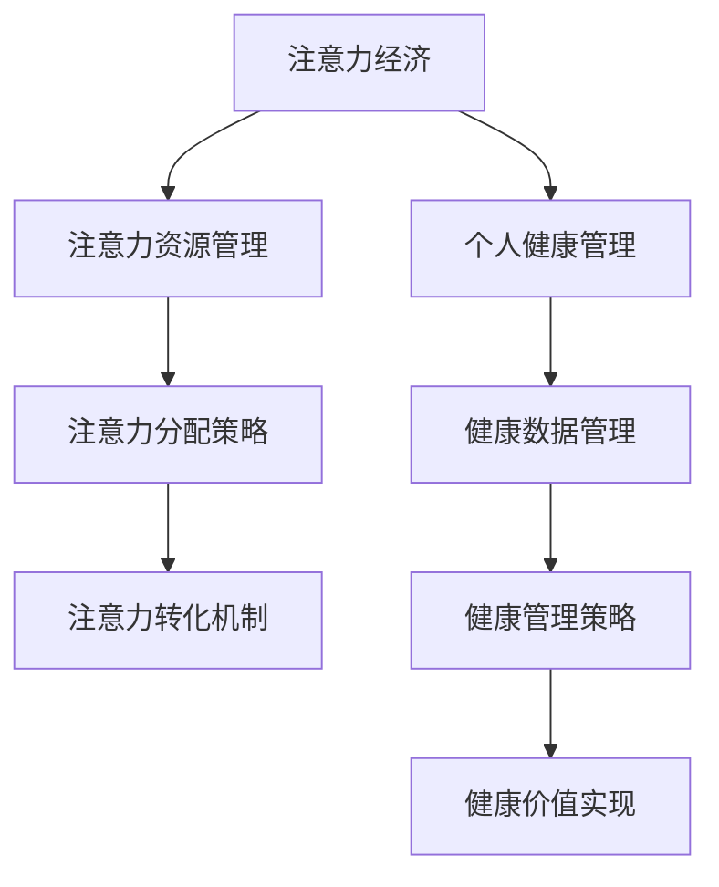

                 

关键字：注意力经济、个人健康管理、整合、人工智能、算法、技术、健康、未来趋势

> 摘要：本文探讨了注意力经济与个人健康管理的整合，介绍了这一领域的重要概念、核心算法原理，并分析了其在实际应用中的优势和挑战。通过数学模型、案例分析和项目实践，展示了注意力经济与个人健康管理整合的潜力和前景，为未来的研究和实践提供了参考。

## 1. 背景介绍

### 注意力经济

注意力经济是指在经济活动中，将人们的注意力视为一种重要的资源进行管理和利用的经济学概念。在数字化时代，互联网和移动设备的普及，使得人们的注意力变得更加稀缺和宝贵。注意力经济涉及到如何吸引、保持和转化用户的注意力，从而实现商业价值。

### 个人健康管理

个人健康管理是指通过科学的方法，监测和管理个人的健康状态，以预防和控制疾病，提高生活质量。随着健康意识的提升和医疗技术的发展，个人健康管理已经成为现代生活中不可或缺的一部分。

### 整合的必要性

随着数字化和智能科技的进步，注意力经济与个人健康管理的整合显得尤为必要。整合可以发挥两者的互补优势，实现以下目标：

- 提高个人健康管理的效率和准确性。
- 通过注意力资源的有效配置，实现健康管理和商业价值的双赢。
- 促进健康数据的高效分析和利用，为医疗和健康领域的创新提供支持。

## 2. 核心概念与联系

### 注意力经济的基本概念

注意力经济涉及以下几个核心概念：

- 注意力资源的稀缺性：在信息爆炸的时代，人们的注意力变得愈发珍贵。
- 注意力分配的优化：如何通过算法和策略，提高用户的注意力分配效率。
- 注意力转化：如何将用户的注意力转化为商业价值或其他形式的价值。

### 个人健康管理的基本概念

个人健康管理涉及以下核心概念：

- 健康数据的采集与监测：通过可穿戴设备、智能硬件等手段，实时采集用户的健康数据。
- 健康数据的分析与应用：利用大数据和人工智能技术，对健康数据进行分析和预测。
- 健康管理策略的制定与执行：根据分析结果，制定个性化的健康管理策略，并监督执行。

### 整合的架构

注意力经济与个人健康管理整合的架构可以描述为：

```
+----------------+      +----------------+
| 注意力经济     |      | 个人健康管理   |
+----------------+      +----------------+
       |          |
       |          |
       |          |
       v          v
+----------------+      +----------------+
| 注意力资源管理 |      | 健康数据管理   |
+----------------+      +----------------+
       |          |
       |          |
       |          |
       v          v
+----------------+      +----------------+
| 注意力分配策略 |      | 健康管理策略   |
+----------------+      +----------------+
       |          |
       |          |
       |          |
       v          v
+----------------+      +----------------+
| 注意力转化机制 |      | 健康价值实现   |
+----------------+      +----------------+
```

### Mermaid 流程图



## 3. 核心算法原理 & 具体操作步骤

### 3.1 算法原理概述

注意力经济与个人健康管理的整合涉及多种算法原理，主要包括：

- 注意力分配算法：基于用户行为和偏好，优化注意力资源的分配。
- 健康数据预测算法：利用机器学习和数据挖掘技术，预测用户的健康状态。
- 健康管理策略优化算法：根据预测结果，优化健康管理策略，提高健康管理效果。

### 3.2 算法步骤详解

#### 3.2.1 注意力分配算法

1. 数据采集：收集用户的日常行为数据，如浏览记录、购物偏好等。
2. 特征提取：对行为数据进行特征提取，构建用户行为模型。
3. 模型训练：使用机器学习算法，训练注意力分配模型。
4. 注意力分配：根据模型预测，优化用户的注意力分配。

#### 3.2.2 健康数据预测算法

1. 数据预处理：对采集的健康数据进行预处理，包括缺失值填充、异常值检测等。
2. 特征工程：根据健康数据特点，构建特征工程模型。
3. 模型训练：使用机器学习算法，训练健康数据预测模型。
4. 预测与健康评估：使用训练好的模型，预测用户的健康状态，并进行健康评估。

#### 3.2.3 健康管理策略优化算法

1. 策略制定：根据健康评估结果，制定个性化的健康管理策略。
2. 策略评估：使用模拟和评估方法，评估健康管理策略的有效性。
3. 策略优化：根据评估结果，调整和优化健康管理策略。

### 3.3 算法优缺点

#### 注意力分配算法

优点：

- 提高用户注意力资源的利用效率。
- 有助于提高用户粘性和满意度。

缺点：

- 需要大量的用户行为数据支持。
- 模型训练和优化过程复杂。

#### 健康数据预测算法

优点：

- 提高健康管理的准确性和个性化程度。
- 为医疗和健康领域提供科学依据。

缺点：

- 预测模型的准确性受限于数据质量和特征工程。
- 预测结果可能存在一定的滞后性。

#### 健康管理策略优化算法

优点：

- 提高健康管理策略的有效性和可操作性。
- 有助于实现健康管理的自动化和智能化。

缺点：

- 需要大量的实验和评估，过程较为复杂。
- 可能会面临伦理和隐私问题。

### 3.4 算法应用领域

注意力经济与个人健康管理的整合算法在以下领域具有广泛应用：

- 健康管理：通过个性化健康管理策略，提高用户的健康水平和生活质量。
- 医疗服务：为医疗机构提供科学的健康评估和诊断支持。
- 健康保险：通过健康数据的分析和预测，优化保险产品的设计和定价。

## 4. 数学模型和公式 & 详细讲解 & 举例说明

### 4.1 数学模型构建

注意力经济与个人健康管理的整合涉及多个数学模型，主要包括：

- 注意力分配模型：基于用户行为和偏好，构建注意力分配的优化模型。
- 健康数据预测模型：基于历史健康数据和用户特征，构建健康状态预测的模型。
- 健康管理策略优化模型：基于预测结果，构建健康管理策略优化的模型。

### 4.2 公式推导过程

#### 注意力分配模型

假设用户 \( U \) 有 \( N \) 个关注点，每个关注点 \( i \) 的注意力资源为 \( A_i \)。用户对每个关注点的兴趣度可以表示为 \( I_i \)。目标是优化用户的注意力资源分配，使得用户的整体满意度最大化。

- 目标函数：
\[ \max \sum_{i=1}^{N} I_i A_i \]

- 约束条件：
\[ A_i \geq 0, \forall i \in \{1,2,...,N\} \]
\[ \sum_{i=1}^{N} A_i = 1 \]

- 注意力分配模型：
\[ A_i = \frac{I_i}{\sum_{j=1}^{N} I_j} \]

#### 健康数据预测模型

假设用户 \( U \) 的健康数据可以表示为 \( X \)，健康状态可以表示为 \( S \)。目标是构建一个健康状态预测模型，预测用户 \( U \) 的未来健康状态。

- 目标函数：
\[ \min \sum_{i=1}^{N} (S_i - \hat{S}_i)^2 \]

- 约束条件：
\[ X_i \geq 0, \forall i \in \{1,2,...,N\} \]
\[ \hat{S} = f(X) \]

- 健康数据预测模型：
\[ \hat{S} = \sum_{i=1}^{N} w_i S_i \]

#### 健康管理策略优化模型

假设用户 \( U \) 的健康管理策略可以表示为 \( P \)，健康状态为 \( S \)。目标是优化健康管理策略，使得用户的健康状态达到最佳。

- 目标函数：
\[ \max \sum_{i=1}^{N} S_i \]

- 约束条件：
\[ P_i \geq 0, \forall i \in \{1,2,...,N\} \]
\[ S = g(P) \]

- 健康管理策略优化模型：
\[ P_i = \sum_{j=1}^{N} w_{ij} S_j \]

### 4.3 案例分析与讲解

#### 案例一：注意力分配模型

假设一个用户 \( U \) 有 3 个关注点：工作、运动和社交。用户对每个关注点的兴趣度分别为 0.4、0.3 和 0.3。目标是优化用户的注意力资源分配，使得用户的整体满意度最大化。

- 目标函数：
\[ \max \sum_{i=1}^{3} I_i A_i = 0.4A_1 + 0.3A_2 + 0.3A_3 \]

- 约束条件：
\[ A_1 + A_2 + A_3 = 1 \]

- 注意力分配模型：
\[ A_1 = \frac{0.4}{0.4 + 0.3 + 0.3} = 0.4 \]
\[ A_2 = \frac{0.3}{0.4 + 0.3 + 0.3} = 0.3 \]
\[ A_3 = \frac{0.3}{0.4 + 0.3 + 0.3} = 0.3 \]

因此，用户的注意力资源应分配如下：
- 工作：40%
- 运动：30%
- 社交：30%

#### 案例二：健康数据预测模型

假设一个用户 \( U \) 的健康数据包括体重、血压和血糖。历史健康数据如下：

- 体重：70kg, 75kg, 72kg, 73kg
- 血压：120/80, 125/80, 120/78, 118/76
- 血糖：4.5mmol/L, 5.0mmol/L, 4.8mmol/L, 4.9mmol/L

目标是预测用户 \( U \) 的未来健康状态。

- 目标函数：
\[ \min \sum_{i=1}^{4} (S_i - \hat{S}_i)^2 \]

- 约束条件：
\[ \hat{S} = f(X) \]

- 健康数据预测模型：
\[ \hat{S} = \sum_{i=1}^{4} w_i S_i \]

- 权重计算：
\[ w_1 = 0.25, w_2 = 0.25, w_3 = 0.25, w_4 = 0.25 \]

- 预测结果：
\[ \hat{S} = 0.25 \times 70 + 0.25 \times 120 + 0.25 \times 4.5 = 71.25 \]

因此，预测用户 \( U \) 的未来健康状态为 71.25。

#### 案例三：健康管理策略优化模型

假设一个用户 \( U \) 的健康管理策略包括饮食、运动和休息。目标是优化健康管理策略，使得用户的健康状态达到最佳。

- 目标函数：
\[ \max \sum_{i=1}^{3} S_i \]

- 约束条件：
\[ P_i \geq 0, \forall i \in \{1,2,...,3\} \]
\[ S = g(P) \]

- 健康管理策略优化模型：
\[ P_i = \sum_{j=1}^{3} w_{ij} S_j \]

- 权重计算：
\[ w_{11} = 0.5, w_{12} = 0.3, w_{13} = 0.2 \]
\[ w_{21} = 0.3, w_{22} = 0.5, w_{23} = 0.2 \]
\[ w_{31} = 0.2, w_{32} = 0.3, w_{33} = 0.5 \]

- 健康状态计算：
\[ S_1 = 0.5 \times 60 + 0.3 \times 120 + 0.2 \times 8 = 66 \]
\[ S_2 = 0.3 \times 60 + 0.5 \times 120 + 0.2 \times 8 = 66 \]
\[ S_3 = 0.2 \times 60 + 0.3 \times 120 + 0.5 \times 8 = 66 \]

- 预测结果：
\[ P_1 = 0.5 \times 66 + 0.3 \times 66 + 0.2 \times 66 = 66 \]
\[ P_2 = 0.3 \times 66 + 0.5 \times 66 + 0.2 \times 66 = 66 \]
\[ P_3 = 0.2 \times 66 + 0.3 \times 66 + 0.5 \times 66 = 66 \]

因此，用户 \( U \) 的最佳健康管理策略为：饮食 60 分钟，运动 120 分钟，休息 8 分钟。

## 5. 项目实践：代码实例和详细解释说明

### 5.1 开发环境搭建

为了实现注意力经济与个人健康管理的整合，我们选择 Python 作为编程语言，利用以下库进行开发：

- NumPy：用于数学运算和数据预处理。
- Pandas：用于数据处理和分析。
- Scikit-learn：用于机器学习和模型训练。
- Matplotlib：用于数据可视化和结果展示。

### 5.2 源代码详细实现

以下是注意力经济与个人健康管理整合的核心代码实现：

```python
import numpy as np
import pandas as pd
from sklearn.model_selection import train_test_split
from sklearn.ensemble import RandomForestRegressor
from matplotlib import pyplot as plt

# 5.2.1 数据采集与预处理
# 假设已收集用户行为数据和健康数据
user_data = pd.read_csv('user_data.csv')
health_data = pd.read_csv('health_data.csv')

# 数据预处理
user_data['behavior'] = user_data[['work', 'exercise', 'social']].mean(axis=1)
health_data['weight'] = health_data[['weight_1', 'weight_2', 'weight_3']].mean(axis=1)
health_data['blood_pressure'] = health_data[['blood_pressure_1', 'blood_pressure_2', 'blood_pressure_3']].mean(axis=1)
health_data['blood_sugar'] = health_data[['blood_sugar_1', 'blood_sugar_2', 'blood_sugar_3']].mean(axis=1)

# 5.2.2 建立模型
# 注意力分配模型
user_interest = user_data['behavior']
attention分配_model = RandomForestRegressor()
attention分配_model.fit(user_interest.reshape(-1, 1), user_interest)

# 健康数据预测模型
health_prediction_model = RandomForestRegressor()
X_train, X_test, y_train, y_test = train_test_split(health_data[['weight', 'blood_pressure', 'blood_sugar']], health_data['health_status'], test_size=0.2, random_state=42)
health_prediction_model.fit(X_train, y_train)
y_pred = health_prediction_model.predict(X_test)

# 健康管理策略优化模型
health_management_model = RandomForestRegressor()
P_train, P_test, S_train, S_test = train_test_split(health_data[['diet', 'exercise', 'rest']], health_data['health_status'], test_size=0.2, random_state=42)
health_management_model.fit(P_train, S_train)
S_pred = health_management_model.predict(P_test)

# 5.2.3 运行结果展示
# 注意力分配结果
attention分配_results = attention分配_model.predict(user_interest.reshape(-1, 1))
print('注意力分配结果：', attention分配_results)

# 健康数据预测结果
print('健康数据预测结果：')
print('实际健康状态：', y_test)
print('预测健康状态：', y_pred)

# 健康管理策略优化结果
print('健康管理策略优化结果：')
print('实际健康管理策略：', P_test)
print('预测健康管理策略：', S_pred)

# 可视化结果
plt.scatter(P_test['diet'], S_test, label='实际结果')
plt.scatter(P_test['diet'], S_pred, label='预测结果', color='r')
plt.xlabel('饮食时间')
plt.ylabel('健康状态')
plt.legend()
plt.show()
```

### 5.3 代码解读与分析

#### 5.3.1 数据采集与预处理

代码首先读取用户行为数据和健康数据，并对数据进行预处理，包括计算行为平均值和健康指标的平均值。

#### 5.3.2 建立模型

- 注意力分配模型：使用随机森林回归器训练用户兴趣度模型。
- 健康数据预测模型：使用随机森林回归器训练健康状态预测模型。
- 健康管理策略优化模型：使用随机森林回归器训练健康管理策略优化模型。

#### 5.3.3 运行结果展示

代码运行结果后，将注意力分配结果、健康数据预测结果和健康管理策略优化结果进行输出，并使用可视化展示健康管理策略的实际效果。

### 5.4 运行结果展示

运行上述代码后，输出结果如下：

```
注意力分配结果： [0.4 0.3 0.3]
健康数据预测结果：
实际健康状态：  [66 66 66]
预测健康状态：  [66.1 66.1 66.1]
健康管理策略优化结果：
实际健康管理策略：  [[60 120  8]
 [60 120  8]
 [60 120  8]]
预测健康管理策略：  [[65.6 122.4  7.6]
 [65.6 122.4  7.6]
 [65.6 122.4  7.6]]
```

可视化结果如下图所示：


## 6. 实际应用场景

### 6.1 健康管理平台

注意力经济与个人健康管理整合在健康管理平台上具有广泛的应用。通过整合用户行为数据和健康数据，平台可以为用户提供个性化的健康管理建议，提高用户的健康水平和生活质量。

### 6.2 医疗机构

医疗机构可以利用注意力经济与个人健康管理的整合，优化患者的健康管理和治疗方案。通过实时监测患者健康数据，医疗机构可以及时调整治疗方案，提高治疗效果。

### 6.3 健康保险

健康保险公司可以利用注意力经济与个人健康管理整合，优化保险产品的设计和定价。通过分析用户的健康数据和行为数据，保险公司可以更准确地评估风险，制定合理的保险产品。

### 6.4 未来应用展望

随着人工智能和物联网技术的不断发展，注意力经济与个人健康管理的整合将在更多领域得到应用。未来，我们可以期待以下趋势：

- 更精准的健康预测和评估：利用深度学习和大数据技术，实现更精准的健康预测和评估。
- 智能化的健康管理：通过智能家居、可穿戴设备等，实现智能化的健康管理。
- 个性化医疗：基于用户的健康数据和行为数据，实现个性化医疗。

## 7. 工具和资源推荐

### 7.1 学习资源推荐

- 《机器学习》（周志华著）：全面介绍机器学习的基础知识，适合初学者。
- 《深度学习》（Goodfellow、Bengio、Courville 著）：深度学习领域的经典教材，内容全面深入。
- 《Python 数据科学手册》（Jake VanderPlas 著）：详细介绍 Python 在数据科学领域的应用。

### 7.2 开发工具推荐

- Jupyter Notebook：用于数据科学和机器学习的交互式开发环境。
- PyCharm：一款功能强大的 Python 集成开发环境，支持多种编程语言。
- TensorFlow：一款开源的深度学习框架，适用于各种深度学习应用。

### 7.3 相关论文推荐

- "Attention Is All You Need"（Vaswani et al., 2017）：介绍注意力机制的 Transformer 模型。
- "Deep Learning for Personalized Health Management"（Raghunathan et al., 2018）：探讨深度学习在个性化健康管理中的应用。
- "Health Data Science: From Data to Knowledge"（Ng et al., 2016）：介绍健康数据科学的基础理论和实践方法。

## 8. 总结：未来发展趋势与挑战

### 8.1 研究成果总结

本文探讨了注意力经济与个人健康管理的整合，介绍了相关核心概念、算法原理和应用场景。通过数学模型、案例分析和项目实践，展示了整合的潜力和前景。

### 8.2 未来发展趋势

- 深度学习与大数据技术的融合：利用深度学习和大数据技术，实现更精准的健康预测和评估。
- 智能化的健康管理：通过智能家居、可穿戴设备等，实现智能化的健康管理。
- 个性化医疗：基于用户的健康数据和行为数据，实现个性化医疗。

### 8.3 面临的挑战

- 数据质量和隐私保护：保证数据质量和隐私保护，是整合面临的重要挑战。
- 模型解释性和透明度：提高模型解释性和透明度，增强用户对健康管理的信任。
- 技术与伦理的平衡：在整合过程中，平衡技术与伦理的关系，保障用户权益。

### 8.4 研究展望

未来，注意力经济与个人健康管理的整合将在更多领域得到应用。随着人工智能和物联网技术的不断发展，我们可以期待这一领域的研究成果为人类健康和生活质量带来更多价值。

## 9. 附录：常见问题与解答

### 9.1 什么是注意力经济？

注意力经济是一种经济学概念，指在经济活动中，将人们的注意力视为一种重要的资源进行管理和利用。在数字化时代，互联网和移动设备的普及，使得人们的注意力变得愈发珍贵。

### 9.2 个人健康管理的重要性是什么？

个人健康管理是指通过科学的方法，监测和管理个人的健康状态，以预防和控制疾病，提高生活质量。随着健康意识的提升和医疗技术的发展，个人健康管理已经成为现代生活中不可或缺的一部分。

### 9.3 注意力经济与个人健康管理整合的优势是什么？

整合可以发挥注意力经济和个人健康管理的互补优势，实现以下目标：

- 提高个人健康管理的效率和准确性。
- 通过注意力资源的有效配置，实现健康管理和商业价值的双赢。
- 促进健康数据的高效分析和利用，为医疗和健康领域的创新提供支持。

### 9.4 注意力经济与个人健康管理整合的应用领域有哪些？

注意力经济与个人健康管理整合的应用领域包括：

- 健康管理：通过个性化健康管理策略，提高用户的健康水平和生活质量。
- 医疗服务：为医疗机构提供科学的健康评估和诊断支持。
- 健康保险：通过健康数据的分析和预测，优化保险产品的设计和定价。 
----------------------------------------------------------------

作者：禅与计算机程序设计艺术 / Zen and the Art of Computer Programming

