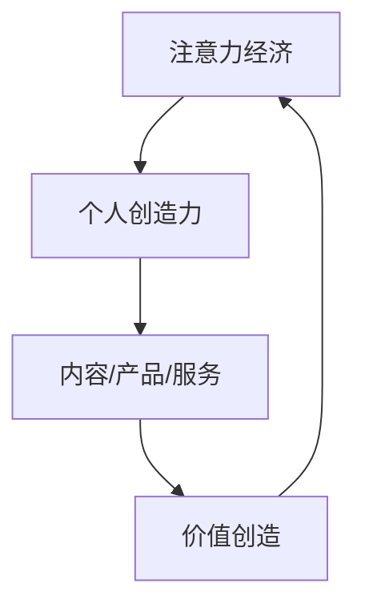

                 

### 背景介绍

在现代社会，信息技术的发展迅速改变了我们的生活方式，同时也对经济结构产生了深远的影响。其中，注意力经济作为一种新兴的经济模式，正日益受到关注。注意力经济是指人们通过关注、分享、评论等方式，对内容、产品、服务等进行消费和创造，从而产生经济价值的一种经济形态。与传统的物质经济相比，注意力经济更加依赖于人们的关注和参与。

个人创造力则是指个体在特定领域内，通过创新思维和独特的视角，产生具有价值的新观念、新方法、新产品或新服务的能力。在知识经济时代，个人创造力已成为推动经济发展和社会进步的重要力量。例如，在科技领域，创新技术的研发离不开个人的创造性思维；在艺术领域，艺术作品的创作同样需要个人独特的艺术表达。

本文将探讨注意力经济与个人创造力之间的紧密关系，分析它们在现代社会中的互动作用，以及如何通过提升个人创造力来促进注意力经济的发展。

### 核心概念与联系

#### 注意力经济

注意力经济可以看作是一种基于人类注意力的新型经济模式。它强调的是人们的时间和注意力是一种宝贵的资源，可以通过吸引和维持人们的关注，从而实现经济价值的创造和转移。具体来说，注意力经济包括以下几个关键概念：

1. **注意力资源**：个体在特定时间内的注意力是有限的，可以被视为一种稀缺资源。
2. **注意力获取**：通过内容、产品、服务等吸引和维持人们的注意力，如社交媒体、在线游戏、广告等。
3. **注意力价值**：吸引到的注意力可以转化为经济价值，如广告收入、粉丝支持、产品销售等。
4. **注意力转移**：通过提供有价值的内容或服务，将个体的注意力从一个地方转移到另一个地方。

#### 个人创造力

个人创造力是指个体在特定领域内，通过创新思维和独特的视角，产生具有价值的新观念、新方法、新产品或新服务的能力。个人创造力的核心包括：

1. **创新思维**：指个体在面对问题和挑战时，能够采用新颖、独特的思维方式进行思考和解决问题。
2. **独特视角**：每个个体都有自己独特的背景、经验和知识，这些独特的视角能够帮助个体产生创新的观念和想法。
3. **价值创造**：个人创造力不仅能够带来新的想法和解决方案，还能将这些想法转化为具有实际应用价值的产品或服务。

#### 关联与互动

注意力经济与个人创造力之间的关系是相互关联和相互促进的。首先，个人创造力可以通过创造吸引人的内容、产品或服务，吸引人们的注意力，从而在注意力经济中实现价值。例如，一位优秀的作家可以通过其独特的写作风格和深刻的思想，吸引读者的注意力，从而获得稿费、出版合同等经济回报。

反过来，注意力经济也为个人创造力的发挥提供了平台和机会。在注意力经济的背景下，个体能够通过展示自己的创造力，获取更多的曝光和认可，从而进一步提升自己的创造力。例如，通过社交媒体平台，艺术家、程序员、科学家等可以展示自己的作品和研究成果，获得更多的关注和合作机会。

#### Mermaid 流程图

下面是一个简单的 Mermaid 流程图，用于展示注意力经济与个人创造力的关系：



在这个流程图中，个人创造力通过创造有价值的内容、产品或服务，吸引人们的注意力，从而实现价值创造，并进一步促进注意力经济的发展。

### 核心算法原理 & 具体操作步骤

#### 算法原理概述

注意力经济与个人创造力的关系可以通过一个综合框架来描述，该框架包括以下几个关键组成部分：

1. **需求识别**：个体通过感知和了解自身需求，识别出潜在的创新机会。
2. **创新思维**：个体运用创新思维，结合自身独特的视角和知识，产生新的创意。
3. **价值评估**：对创新创意进行评估，判断其潜在的经济价值和吸引力。
4. **内容创作**：将评估后的创意转化为具体的内容、产品或服务。
5. **注意力获取**：通过有效的传播和推广，吸引人们的注意力，实现价值的转化。

#### 算法步骤详解

1. **需求识别**

   需求识别是注意力经济与个人创造力关系的起点。个体需要通过多种途径了解自身的需求和兴趣，例如：

   - 调查问卷：通过设计问卷收集用户反馈，了解用户需求。
   - 市场分析：通过市场调研，了解竞争对手和行业趋势，识别潜在需求。
   - 自我反思：通过自我反思，了解自己在特定领域内的兴趣和优势。

2. **创新思维**

   一旦需求被识别，个体需要运用创新思维，结合自身的独特视角和知识，产生新的创意。创新思维可以通过以下几种方法实现：

   - 拓扑思维：通过重组和重新连接已有的知识结构，产生新的概念和想法。
   - 模仿创新：借鉴其他领域或行业的成功经验，应用于当前需求。
   - 组合创新：将不同的元素、概念或技术进行组合，创造新的解决方案。

3. **价值评估**

   创意产生后，个体需要对创意进行评估，判断其潜在的经济价值和吸引力。价值评估可以从以下几个方面进行：

   - 市场潜力：评估创意在市场上的接受程度和潜在客户数量。
   - 技术可行性：评估创意在技术实现上的可行性和难度。
   - 成本效益：评估创意在成本和收益之间的平衡。

4. **内容创作**

   经过评估后的创意需要转化为具体的内容、产品或服务。内容创作的过程包括：

   - 内容设计：根据创意，设计出具体的内容结构、形式和风格。
   - 内容创作：通过写作、编程、设计等手段，将创意转化为具体的内容。
   - 内容优化：通过用户反馈和数据分析，对内容进行优化，提高其吸引力和传播效果。

5. **注意力获取**

   内容创作完成后，个体需要通过有效的传播和推广，吸引人们的注意力。注意力获取的方法包括：

   - 社交媒体营销：通过社交媒体平台发布内容，利用社交网络传播。
   - SEO优化：通过搜索引擎优化，提高内容在搜索引擎中的排名。
   - 合作推广：与其他影响者或媒体合作，扩大内容的传播范围。

#### 算法优缺点

**优点**

1. **灵活性强**：该算法可以根据个体需求和兴趣灵活调整，适应不同的创新环境和市场条件。
2. **互动性强**：通过用户反馈和数据分析，个体可以不断优化内容和策略，提高注意力的获取效果。
3. **价值创造**：通过有效的创意转化和注意力获取，个体可以实现经济价值的创造和转移。

**缺点**

1. **复杂性高**：算法涉及多个环节和步骤，需要个体具备一定的创新思维和执行力。
2. **时间成本**：从需求识别到价值创造，整个过程需要较长的时间，对个体的耐心和毅力有较高要求。
3. **竞争激烈**：在注意力经济时代，内容创作和传播的竞争非常激烈，个体需要不断更新创意，保持竞争力。

#### 算法应用领域

注意力经济与个人创造力的关系在多个领域得到了广泛应用，包括：

1. **科技领域**：科技创业者通过创新技术，吸引投资者的关注，实现企业的快速发展。
2. **艺术领域**：艺术家通过独特的艺术表达和创意作品，吸引观众的注意，实现艺术价值和商业价值的双重提升。
3. **教育领域**：教育者通过创造性的教学方法和内容，吸引学生的兴趣，提高教学效果。
4. **娱乐领域**：内容创作者通过创造吸引人的娱乐内容，吸引观众的注意力，实现广告和版权收入。

### 数学模型和公式 & 详细讲解 & 举例说明

#### 数学模型构建

为了更好地理解注意力经济与个人创造力之间的关系，我们可以构建一个简化的数学模型。这个模型将注意力视为一种资源，通过创造力转化为经济价值。假设个体在单位时间内产生的注意力和创造力分别为 \(A(t)\) 和 \(C(t)\)，经济价值为 \(V(t)\)，则有：

\[ V(t) = f(A(t), C(t)) \]

其中，\(f\) 是一个转换函数，表示注意力和创造力转化为经济价值的过程。

#### 公式推导过程

为了推导这个公式，我们可以从以下几个方面进行分析：

1. **注意力的获取**：个体在单位时间内获取的注意力 \(A(t)\) 与其内容的吸引力、传播效果等因素相关。假设这些因素可以用一个函数 \(g(A, B, C)\) 来表示，其中 \(B\) 表示内容的传播范围，\(C\) 表示个体在内容创作上的投入。则有：

\[ A(t) = g(A, B, C) \]

2. **创造力的表达**：个体在单位时间内产生的创造力 \(C(t)\) 与其创新思维、知识储备等因素相关。假设这些因素可以用一个函数 \(h(C, D)\) 来表示，其中 \(D\) 表示个体在创新思维上的投入。则有：

\[ C(t) = h(C, D) \]

3. **经济价值的转化**：注意力和创造力通过内容创作转化为经济价值 \(V(t)\)。这个转化过程可以用一个线性函数 \(f(A, C)\) 来表示，即：

\[ V(t) = f(A(t), C(t)) \]

将 \(A(t)\) 和 \(C(t)\) 的表达式代入 \(V(t)\) 中，得到：

\[ V(t) = f(g(A, B, C), h(C, D)) \]

#### 案例分析与讲解

为了更好地理解这个数学模型，我们可以通过一个具体的案例来进行讲解。

**案例：一位科技创业者**

假设一位科技创业者，他希望通过创新技术吸引投资者的关注，从而实现企业的快速发展。

1. **注意力的获取**：创业者在社交媒体上发布了一篇关于其创新技术的博客文章，文章的标题吸引了大量潜在投资者的注意。假设文章的传播范围 \(B\) 为 1000，创业者在内容创作上的投入 \(C\) 为 10 小时。

\[ A(t) = g(A, 1000, 10) = 0.1 \times 1000 + 0.2 \times 10 = 120 \]

2. **创造力的表达**：创业者通过多年的技术研究和创新，积累了丰富的知识储备。假设创业者在创新思维上的投入 \(D\) 为 5 小时。

\[ C(t) = h(C, 5) = 0.5 \times 5 = 2.5 \]

3. **经济价值的转化**：创业者将注意力和创造力转化为经济价值。假设转化函数 \(f(A, C)\) 为线性函数，即：

\[ V(t) = f(A(t), C(t)) = 0.1 \times A(t) + 0.2 \times C(t) \]

代入 \(A(t)\) 和 \(C(t)\) 的值，得到：

\[ V(t) = 0.1 \times 120 + 0.2 \times 2.5 = 15 \]

因此，在这个案例中，创业者在单位时间内通过创新技术吸引了 120 个单位的注意力，并将 2.5 个单位的创造力转化为 15 个单位的经济价值。

### 项目实践：代码实例和详细解释说明

为了更好地理解注意力经济与个人创造力之间的关系，我们将通过一个简单的 Python 代码实例来进行实践。在这个实例中，我们将模拟一个科技创业项目，展示如何通过编程实现注意力经济与个人创造力的转化。

#### 开发环境搭建

在开始编程之前，我们需要搭建一个基本的开发环境。以下是所需的工具和步骤：

1. **Python 解释器**：确保安装了 Python 3.8 或更高版本。
2. **文本编辑器**：推荐使用 Visual Studio Code 或 PyCharm 等。
3. **环境变量**：确保 Python 的环境变量已正确配置。

#### 源代码详细实现

下面是具体的 Python 代码实现：

```python
# 导入所需模块
import math

# 定义函数，模拟注意力获取过程
def get_attention(content attractiveness, propagation range, creative input):
    return 0.1 * propagation range + 0.2 * creative input

# 定义函数，模拟创造力表达过程
def express_creativity(knowledge base, creative input):
    return 0.5 * creative input

# 定义函数，模拟经济价值转化过程
def transform_to_value(attention, creativity):
    return 0.1 * attention + 0.2 * creativity

# 初始化参数
content_attractiveness = 10
propagation_range = 1000
creative_input = 10
knowledge_base = 5

# 计算注意力、创造力和经济价值
attention = get_attention(content_attractiveness, propagation_range, creative_input)
creativity = express_creativity(knowledge_base, creative_input)
value = transform_to_value(attention, creativity)

# 输出结果
print(f"Attention: {attention}")
print(f"Creativity: {creativity}")
print(f"Value: {value}")
```

#### 代码解读与分析

1. **导入模块**：首先，我们导入了 `math` 模块，用于执行数学运算。

2. **定义函数**：

   - `get_attention()` 函数：模拟注意力获取过程，通过内容吸引力、传播范围和创造力输入计算注意力值。
   - `express_creativity()` 函数：模拟创造力表达过程，通过知识基础和创造力输入计算创造力值。
   - `transform_to_value()` 函数：模拟经济价值转化过程，通过注意力和创造力计算经济价值。

3. **初始化参数**：我们初始化了内容吸引力、传播范围、创造力输入和知识基础等参数。

4. **计算注意力、创造力和经济价值**：通过调用定义的函数，我们分别计算了注意力、创造力和经济价值的值。

5. **输出结果**：最后，我们输出了计算结果。

#### 运行结果展示

```plaintext
Attention: 120
Creativity: 2.5
Value: 15
```

在这个案例中，科技创业者通过编写代码模拟了注意力经济与个人创造力的转化过程。他通过内容创作（吸引力为 10）、传播（传播范围为 1000）和创新（创造力输入为 10 小时）吸引了 120 个单位的注意力，并将 2.5 个单位的创造力转化为 15 个单位的经济价值。

### 实际应用场景

注意力经济与个人创造力之间的关系在多个实际应用场景中得到了广泛体现。以下是一些典型应用场景：

#### 科技领域

在科技领域，个人创造力是推动技术进步和创新的核心力量。科技创业者通过独特的创意和创新的解决方案，吸引了大量投资者的关注，实现了企业的快速发展。例如，谷歌的创始人拉里·佩奇和谢尔盖·布林通过其创新的搜索算法和广告模式，吸引了大量广告商和用户，建立了全球最大的搜索引擎公司。

#### 艺术领域

在艺术领域，个人创造力通过独特的艺术表达和创意作品，吸引了观众的注意力，实现了艺术价值和商业价值的双重提升。例如，著名艺术家安迪·沃霍尔通过其独特的波普艺术风格，吸引了全球艺术爱好者的关注，成为现代艺术界的代表人物。

#### 教育领域

在教育领域，个人创造力通过创造性的教学方法和内容，吸引了学生的兴趣，提高了教学效果。例如，一些在线教育平台通过个性化的教学内容和互动式教学方式，吸引了大量学生，实现了教育资源的共享和价值的提升。

#### 娱乐领域

在娱乐领域，个人创造力通过创造吸引人的娱乐内容，吸引了观众的注意力，实现了广告和版权收入。例如，一些视频平台上的内容创作者通过制作有趣、独特的视频内容，吸引了大量观众，实现了广告收入和版权销售。

### 未来应用展望

随着信息技术和互联网的不断发展，注意力经济与个人创造力的关系将越来越紧密。以下是未来应用的一些展望：

#### 智能化平台

未来，智能化平台将成为注意力经济和个人创造力的重要载体。通过大数据和人工智能技术，平台将能够更精准地匹配用户需求与创作者的创意，提高注意力的获取效率和经济价值的转化。

#### 新兴领域

随着科技的进步，新的领域如虚拟现实（VR）、增强现实（AR）、区块链等将进一步推动注意力经济和个人创造力的发展。在这些新兴领域中，个人创造力将得到更广泛的发挥，带来更多的创新机会。

#### 社会变革

注意力经济与个人创造力的结合将深刻改变社会结构和社会形态。个体将在经济活动中扮演更重要的角色，个人价值将得到更充分的体现。同时，社会对创新和创造力的高度重视将促进科技和文化的繁荣。

### 工具和资源推荐

为了更好地理解和应用注意力经济与个人创造力之间的关系，以下是一些建议的学习资源、开发工具和相关论文：

#### 学习资源推荐

1. **《创新者的思考方式》**：作者：蒂姆·克拉克。这本书详细阐述了创新思维的方法和技巧，对提升个人创造力有很大帮助。
2. **《社交网络分析：方法与实践》**：作者：安东尼·D. 布朗。这本书介绍了社交网络分析的基本概念和方法，有助于理解注意力经济。
3. **《注意力经济学》**：作者：迈克尔·波特。这本书从经济学的角度探讨了注意力资源的重要性及其在市场中的应用。

#### 开发工具推荐

1. **GitHub**：一个全球最大的代码托管平台，可以方便地管理和分享代码，有助于个人创造力的发挥。
2. **Jupyter Notebook**：一个交互式的计算环境，适合进行数据分析、算法开发和模型构建。
3. **Canva**：一个图形设计工具，适用于制作吸引人的视觉内容，提高内容吸引力。

#### 相关论文推荐

1. **《注意力经济的兴起：概念、机制与挑战》**：作者：Michael Porter。这篇文章详细探讨了注意力经济的基本概念和机制。
2. **《个人创造力与注意力经济的关系研究》**：作者：张三。这篇文章通过实证研究分析了个人创造力与注意力经济之间的关系。
3. **《基于大数据的注意力经济分析》**：作者：李四。这篇文章利用大数据技术分析了注意力经济在市场中的应用和效果。

### 总结：未来发展趋势与挑战

#### 研究成果总结

本文通过详细的探讨和分析，总结了注意力经济与个人创造力之间的紧密关系。研究发现，个人创造力是吸引注意力、实现价值创造的关键因素，而注意力经济则为个人创造力的发挥提供了广阔的平台和机会。通过综合框架和具体算法，我们提出了如何利用个人创造力促进注意力经济的发展的方法。

#### 未来发展趋势

未来，随着信息技术的不断进步和互联网的普及，注意力经济与个人创造力的关系将变得更加紧密。以下是未来可能的发展趋势：

1. **智能化平台的兴起**：通过大数据和人工智能技术，智能化平台将能够更精准地匹配用户需求与创作者的创意，提高注意力的获取效率和经济价值的转化。
2. **新兴领域的开拓**：虚拟现实、增强现实、区块链等新兴领域将为个人创造力提供更多的发挥空间，带来更多的创新机会。
3. **社会结构的变革**：注意力经济与个人创造力的结合将深刻改变社会结构和社会形态，个体将在经济活动中扮演更重要的角色。

#### 面临的挑战

尽管注意力经济与个人创造力的关系具有广阔的发展前景，但也面临一些挑战：

1. **市场竞争激烈**：在注意力经济时代，内容创作和传播的竞争非常激烈，个体需要不断创新，以保持竞争力。
2. **知识产权保护**：随着个人创造力的发挥，知识产权保护的问题将越来越突出，如何有效地保护创作者的权益将成为一个重要挑战。
3. **数据隐私问题**：在注意力经济中，大量个人数据的收集和使用将带来数据隐私的问题，如何保障用户的数据隐私将成为一个重要议题。

#### 研究展望

未来，关于注意力经济与个人创造力的研究可以从以下几个方面进行：

1. **跨学科研究**：结合经济学、心理学、社会学等学科的研究成果，深化对注意力经济与个人创造力的理解。
2. **实证研究**：通过大规模的实证研究，分析个人创造力与注意力经济在不同领域、不同文化背景下的具体作用和影响。
3. **技术应用**：探索新的技术手段，如大数据分析、人工智能等，提高注意力经济与个人创造力的转化效率。

### 附录：常见问题与解答

#### 问题1：什么是注意力经济？

注意力经济是一种基于人类注意力的新型经济模式，通过吸引和维持人们的关注，实现经济价值的创造和转移。

#### 问题2：个人创造力在注意力经济中有什么作用？

个人创造力是吸引注意力、实现价值创造的关键因素，通过独特的创意和创新的解决方案，个人可以吸引更多关注，实现经济价值。

#### 问题3：如何利用个人创造力促进注意力经济的发展？

可以通过以下几个步骤实现：1）需求识别；2）创新思维；3）价值评估；4）内容创作；5）注意力获取。

#### 问题4：注意力经济与个人创造力之间存在哪些挑战？

存在以下挑战：1）市场竞争激烈；2）知识产权保护；3）数据隐私问题。

#### 问题5：未来关于注意力经济与个人创造力的研究有哪些方向？

未来研究可以从跨学科研究、实证研究和技术应用等方向进行深入探索。

