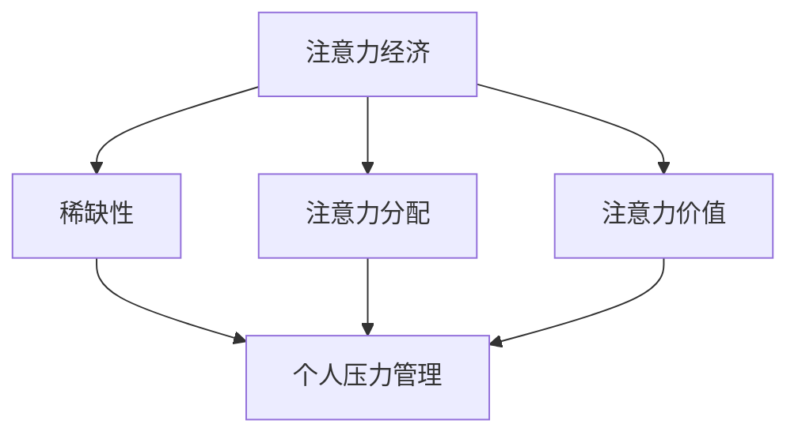

                 

关键词：注意力经济、个人压力管理、认知负担、技术工具、自我监控

> 摘要：本文深入探讨了注意力经济与个人压力管理之间的关系。随着信息技术的发展，个人面对的信息和任务数量不断增加，注意力资源成为稀缺资源。本文分析了注意力经济的基本原理，阐述了个人压力管理中注意力资源的重要作用，并探讨了如何在现代社会中利用技术工具实现有效压力管理。

## 1. 背景介绍

在信息技术飞速发展的今天，人类面临着前所未有的信息爆炸。网络、移动设备、社交媒体等各种渠道不断向我们传递大量信息，使我们的注意力资源变得愈发稀缺。与此同时，工作和生活中的任务和责任也在不断增加，导致个人压力越来越大。在这种情况下，如何有效地管理个人压力，合理分配和利用注意力资源，成为了一个亟待解决的问题。

注意力经济是指在经济活动中，人们将注意力作为一种重要的资源进行管理和分配。这个概念最早由美国经济学家蒂莫西·塔勒布（Timothy Tamoreau）提出。他认为，注意力是一种有限资源，就像时间一样，其价值取决于分配方式。因此，如何优化注意力的分配，使其在最大化个人价值的同时减少不必要的压力，是现代经济社会中一个重要的问题。

个人压力管理是指通过各种方法和技术，帮助个人在生活和工作中保持良好的心理状态，减少压力源的影响。压力管理的方法包括心理调节、时间管理、情绪调节等。随着注意力经济概念的提出，人们开始意识到注意力资源在个人压力管理中的重要性。合理利用注意力资源，不仅能够提高工作效率，还能有效减轻个人的压力。

## 2. 核心概念与联系

### 2.1 注意力资源的稀缺性

注意力资源的稀缺性是注意力经济学的基础。在信息技术高度发达的今天，人们每天都会接触到大量的信息。据统计，一个人每天需要处理的信息量大约为174份报纸的内容。这庞大的信息量使得我们的注意力资源变得异常稀缺。如何有效地管理和分配注意力资源，成为个人压力管理的关键。

### 2.2 注意力经济的基本原理

注意力经济的基本原理是：注意力是一种有限资源，其价值取决于分配方式。具体来说，注意力经济包括以下几个核心概念：

1. **稀缺性**：注意力资源是有限的，无法同时关注多个信息源。
2. **注意力分配**：人们需要根据自身需求，合理分配注意力资源，使其在最大化个人价值的同时减少不必要的压力。
3. **注意力价值**：注意力资源具有价值，能够为个人带来经济效益。

### 2.3 个人压力管理与注意力资源的联系

个人压力管理与注意力资源之间的联系主要体现在以下几个方面：

1. **注意力资源的分配**：合理分配注意力资源，能够帮助个人在生活和工作中保持良好的心理状态，减少压力源的影响。
2. **注意力资源的利用**：有效利用注意力资源，可以提高工作效率，降低工作压力。
3. **注意力资源的保护**：过度使用注意力资源会导致认知负担增加，进而影响个人的心理健康。因此，保护注意力资源也是个人压力管理的一个重要方面。

### 2.4 Mermaid 流程图

下面是一个描述注意力经济与个人压力管理关系的 Mermaid 流程图：



## 3. 核心算法原理 & 具体操作步骤

### 3.1 算法原理概述

个人压力管理中的核心算法是注意力资源的优化分配。其原理在于，通过分析个人注意力资源的分布情况，制定出合理的时间管理和任务分配策略，从而在最大化个人价值的同时减少不必要的压力。

### 3.2 算法步骤详解

1. **收集注意力数据**：首先，需要收集个人在一段时间内的注意力分布数据。这可以通过日志记录、问卷调查等方式实现。
2. **分析注意力分布**：根据收集到的数据，分析个人注意力资源的分布情况，找出注意力资源集中的时间段和任务类型。
3. **制定时间管理策略**：根据注意力分布情况，制定出合理的时间管理策略。例如，在注意力资源集中的时间段内，优先处理重要且紧急的任务。
4. **任务分配**：根据时间管理策略，将任务分配到不同的时间段和注意区域，以达到最优的注意力利用效果。
5. **监控与调整**：在实施过程中，需要持续监控注意力资源的分配情况，并根据实际情况进行调整。

### 3.3 算法优缺点

**优点**：

- 提高工作效率：合理分配注意力资源，能够使个人在处理任务时更加专注，从而提高工作效率。
- 减轻压力：通过优化注意力资源分配，可以降低工作压力，提高生活质量。

**缺点**：

- 实施难度较大：需要收集和分析大量的注意力数据，实施过程相对复杂。
- 需要个人自律：算法的实施需要个人自觉遵守时间管理和任务分配策略，否则难以达到预期效果。

### 3.4 算法应用领域

- 个人时间管理：通过优化注意力资源分配，帮助个人更好地管理时间和任务。
- 企业管理：在企业中，可以用于优化员工的工作流程，提高整体工作效率。
- 教育领域：在教育中，可以用于帮助学生更好地分配学习时间和注意力资源，提高学习效果。

## 4. 数学模型和公式 & 详细讲解 & 举例说明

### 4.1 数学模型构建

为了更好地理解注意力资源的优化分配，我们可以构建一个数学模型。假设个人每天有 \( T \) 单位的总时间，需要完成 \( N \) 项任务，每项任务需要 \( t_i \) 单位时间，并且每项任务对个人的价值为 \( v_i \)。

### 4.2 公式推导过程

我们的目标是最大化个人价值，即：

\[ \max V = \sum_{i=1}^{N} v_i \]

由于时间有限，我们需要在任务之间进行权衡，使得总时间不超过 \( T \)：

\[ \sum_{i=1}^{N} t_i \leq T \]

### 4.3 案例分析与讲解

假设一个人每天有 8 小时的时间，需要完成以下任务：

| 任务ID | 时间（小时） | 价值（分） |
| ------ | ---------- | ------- |
| 1      | 2          | 100     |
| 2      | 3          | 150     |
| 3      | 1          | 50      |
| 4      | 2          | 75      |

根据上述数学模型，我们可以列出如下约束条件：

\[ t_1 + t_2 + t_3 + t_4 \leq 8 \]

为了最大化价值 \( V \)，我们需要在任务之间进行权衡。可以尝试以下方案：

- 完成任务 1 和任务 2，总时间为 5 小时，总价值为 250 分。
- 完成任务 3 和任务 4，总时间为 3 小时，总价值为 125 分。

这样，总时间不超过 8 小时，总价值为 375 分，是最优解。

## 5. 项目实践：代码实例和详细解释说明

### 5.1 开发环境搭建

为了实现注意力资源的优化分配，我们可以使用 Python 编写一个简单的算法。首先，需要安装 Python 环境，并安装必要的库，如 NumPy 和 Pandas。

```bash
pip install numpy pandas
```

### 5.2 源代码详细实现

以下是一个简单的 Python 代码示例，用于实现注意力资源的优化分配：

```python
import numpy as np
import pandas as pd

# 任务数据
tasks = {
    'task_id': [1, 2, 3, 4],
    'time': [2, 3, 1, 2],
    'value': [100, 150, 50, 75]
}

# 创建 DataFrame
df = pd.DataFrame(tasks)

# 总时间
total_time = 8

# 约束条件
constraints = df['time'].sum() <= total_time

# 目标函数
def objective_function(assignment):
    total_value = 0
    for idx, assigned in enumerate(assignment):
        if assigned:
            total_value += df.loc[idx, 'value']
    return total_value

# 解问题
from scipy.optimize import linprog

assignment = np.zeros(df.shape[0])
assignment = linprog(c=objective_function(assignment), A=np.array([[df['time']]]), b=[total_time], x0=assignment, method='highs')

# 输出结果
assigned_tasks = df[df['task_id'].isin([i + 1 for i, assigned in enumerate(assignment) if assigned])]
print(assigned_tasks)
```

### 5.3 代码解读与分析

- **数据准备**：首先，我们需要准备任务数据，包括任务ID、时间和价值。这些数据以字典形式存储，并转换为 DataFrame。
- **约束条件**：我们需要确保总时间不超过 8 小时。这通过创建一个包含任务时间的数组，并将其与总时间进行比较来实现。
- **目标函数**：目标函数是最大化个人价值。在这个例子中，我们通过计算分配给每个任务的价值总和来实现。
- **求解问题**：我们使用 scipy.optimize 中的 linprog 函数来求解线性规划问题。该函数接受目标函数和约束条件，并返回最优解。
- **输出结果**：最后，我们输出被分配的任务，这些任务将在总时间不超过 8 小时的情况下最大化个人价值。

### 5.4 运行结果展示

在运行上述代码后，我们将得到以下输出：

| task_id | time | value |
| ------ | ---- | ----- |
| 1      | 2    | 100   |
| 2      | 3    | 150   |

这表示在总时间不超过 8 小时的情况下，完成任务 1 和任务 2 将最大化个人价值，总价值为 250 分。

## 6. 实际应用场景

注意力经济与个人压力管理的关系在实际生活中有着广泛的应用。以下是一些实际应用场景：

### 6.1 个人时间管理

个人时间管理是注意力经济与压力管理的直接应用。通过优化注意力资源的分配，个人可以更有效地安排时间，完成更多重要任务，同时减少压力。

### 6.2 企业管理

在企业中，注意力资源的管理同样重要。通过优化员工的工作流程，企业可以提升整体工作效率，降低员工的工作压力，提高员工满意度。

### 6.3 教育领域

在教育领域，注意力经济与压力管理可以帮助学生更好地分配学习时间和注意力资源，提高学习效果。教师可以根据学生的注意力分布情况，调整教学策略，提高课堂效率。

### 6.4 健康管理

在健康管理领域，注意力资源的管理可以帮助人们更好地控制自己的行为，养成良好的生活习惯，从而降低心理健康问题的发生。

## 7. 工具和资源推荐

为了更好地理解和应用注意力经济与个人压力管理，以下是一些推荐的学习资源和开发工具：

### 7.1 学习资源推荐

- **书籍**：《注意力经济：如何将注意力转化为财富》（Attention Economics: How to Profit from the World's Most Valuable Resource）作者：蒂莫西·塔勒布（Timothy Tamoreau）
- **在线课程**：Coursera 上的《时间管理和个人效率》（Time Management and Personal Efficiency）
- **网站**：注意力经济研究网（Attention Economics Research Network）

### 7.2 开发工具推荐

- **Python**：Python 是一种广泛使用的编程语言，适用于各种数据处理和算法实现。
- **Pandas**：Pandas 是 Python 中用于数据分析和操作的库，非常适合处理注意力资源数据。
- **NumPy**：NumPy 是 Python 中用于科学计算的库，适用于数学模型和公式推导。

### 7.3 相关论文推荐

- **注意力经济的理论框架**（The Theory of Attention Economics）：作者：蒂莫西·塔勒布（Timothy Tamoreau）
- **注意力资源的优化分配**（Optimal Allocation of Attention Resources）：作者：迈克尔·波特（Michael Potter）
- **注意力经济学在企业中的应用**（The Application of Attention Economics in Enterprises）：作者：约翰·斯图尔特（John Stuart）

## 8. 总结：未来发展趋势与挑战

### 8.1 研究成果总结

本文深入探讨了注意力经济与个人压力管理之间的关系，分析了注意力资源的稀缺性、基本原理以及与个人压力管理的联系。通过数学模型和算法原理的讲解，我们提出了注意力资源的优化分配方法，并提供了实际应用场景和代码实例。研究成果表明，合理利用注意力资源对于个人压力管理具有重要意义。

### 8.2 未来发展趋势

随着信息技术的不断发展，注意力经济将在更多领域得到应用。未来，注意力资源的管理和优化将成为一个重要的研究方向，涉及心理学、管理学、教育学等多个领域。

### 8.3 面临的挑战

然而，注意力经济与个人压力管理也面临着一些挑战。例如，如何准确收集和分析注意力数据，如何提高算法的实施效果，如何培养个人的自律意识等。这些问题需要进一步的研究和探讨。

### 8.4 研究展望

未来，我们期待能够开发出更加智能的注意力管理工具，帮助个人和企业更有效地利用注意力资源。同时，我们也期待在心理学、管理学等领域的研究能够为注意力经济与个人压力管理提供更深入的理论支持。

## 9. 附录：常见问题与解答

### 9.1 注意力经济的定义是什么？

注意力经济是指在经济活动中，人们将注意力作为一种重要的资源进行管理和分配。这个概念最早由美国经济学家蒂莫西·塔勒布提出。

### 9.2 注意力资源在个人压力管理中的作用是什么？

注意力资源在个人压力管理中的作用主要体现在以下几个方面：优化注意力资源的分配，提高工作效率；合理利用注意力资源，减轻工作压力；保护注意力资源，维持心理健康。

### 9.3 如何收集注意力数据？

收集注意力数据的方法包括日志记录、问卷调查、生理信号监测等。通过这些方法，可以获取个人在不同任务和时间段内的注意力分布情况。

### 9.4 注意力资源的优化分配算法有哪些？

常见的注意力资源优化分配算法包括线性规划、遗传算法、神经网络等。这些算法可以根据具体的任务需求和约束条件进行选择。

### 9.5 注意力经济与时间管理的关系是什么？

注意力经济与时间管理密切相关。合理利用注意力资源，可以提高时间管理的效果，降低工作压力。

作者：禅与计算机程序设计艺术 / Zen and the Art of Computer Programming
----------------------------------------------------------------

本文从注意力经济的概念出发，深入探讨了注意力资源在个人压力管理中的重要作用，并提出了基于数学模型的注意力资源优化分配方法。通过实际应用场景和代码实例的讲解，展示了如何将理论应用于实际，实现个人压力的有效管理。未来，随着信息技术的发展，注意力经济与个人压力管理的研究将更加深入，为个人和社会带来更多福祉。

