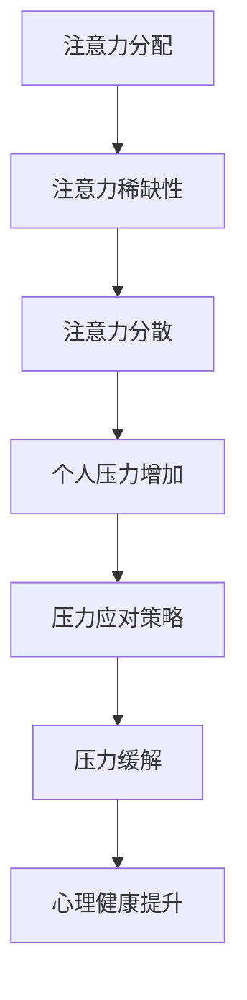

                 

关键词：注意力经济、个人压力管理、认知负担、注意力分散、生产力优化、心理健康

## 摘要

在现代社会，信息过载和注意力资源有限性的矛盾日益凸显，导致个人压力显著增加。本文探讨了注意力经济与个人压力管理之间的关系，分析了注意力分散对生产力和心理健康的影响。通过介绍注意力经济的核心概念和模型，结合个人压力管理的实际案例，本文提出了优化注意力和缓解压力的策略，旨在帮助读者提升工作效率和生活质量。

## 1. 背景介绍

### 1.1 注意力经济的概念

注意力经济是指信息接收者在海量信息环境中选择关注特定内容的过程，其核心是信息接收者对注意力的分配和使用。随着互联网的快速发展，信息爆炸时代到来，人们在面对海量的信息资源时，不得不进行选择，以最大限度地利用有限的注意力资源。

### 1.2 个人压力管理的背景

个人压力管理是指个体在生活和工作中对压力源进行识别、评估和应对的过程。随着工作节奏的加快和生活压力的增大，个人压力管理成为影响个体身心健康和生活质量的重要因素。有效的个人压力管理有助于提高工作绩效和生活满意度。

### 1.3 注意力经济与个人压力管理的关联

注意力经济与个人压力管理之间存在密切的关联。注意力资源的有限性使得个体在面对压力时，容易陷入注意力分散的状态，进而导致工作效率下降和心理健康问题。因此，优化注意力分配对于个人压力管理具有重要意义。

## 2. 核心概念与联系

### 2.1 核心概念

#### 注意力经济

1. **注意力分配**：个体在信息选择和关注过程中，对注意力资源的分配。
2. **注意力稀缺性**：由于信息过载，个体注意力资源的稀缺性增加。
3. **注意力价值**：个体对有价值信息投入的注意力越多，其价值越高。

#### 个人压力管理

1. **压力源识别**：个体识别和评估压力源。
2. **压力应对策略**：个体采取的策略来应对压力。
3. **压力缓解**：通过减轻压力源和压力反应，提高个体心理健康。

### 2.2 联系

注意力经济与个人压力管理之间的关系可以用以下 Mermaid 流程图表示：



### 2.3 注意力经济与个人压力管理的互动

注意力经济通过影响个体的注意力分配和稀缺性，直接或间接地影响个人压力管理。有效的注意力管理策略有助于减轻压力，提高心理健康水平。

## 3. 核心算法原理 & 具体操作步骤

### 3.1 算法原理概述

本文采用注意力分配优化算法（Optimized Attention Allocation Algorithm, OAAA）来探讨注意力经济与个人压力管理的关系。OAAA 基于个体注意力资源的稀缺性，通过动态调整注意力分配，实现压力最小化和工作效率最大化。

### 3.2 算法步骤详解

#### 3.2.1 输入参数

1. **信息集合 I**：包括所有待处理的信息项。
2. **权重函数 w**：用于评估信息项的重要程度。
3. **时间约束 T**：个体在特定时间段内可用于处理信息的时间。

#### 3.2.2 算法流程

1. **初始化**：设置初始注意力分配向量 A。
2. **评估权重**：计算每个信息项的权重。
3. **动态调整**：根据权重和剩余时间，调整注意力分配向量。
4. **优化目标**：在满足时间约束的前提下，最大化重要信息的处理量。

### 3.3 算法优缺点

#### 优点

1. **高效性**：通过动态调整注意力分配，提高信息处理效率。
2. **灵活性**：适应不同时间约束和任务复杂度。

#### 缺点

1. **计算复杂度**：需要计算大量权重和调整次数，计算成本较高。
2. **适用范围**：对个体注意力分配的评估依赖于权重函数，可能存在主观偏差。

### 3.4 算法应用领域

OAAA 算法在个人压力管理、任务优先级排序、信息过滤等领域具有广泛的应用前景。

## 4. 数学模型和公式 & 详细讲解 & 举例说明

### 4.1 数学模型构建

注意力分配优化算法的数学模型可以表示为：

$$
\begin{aligned}
\text{maximize} \quad & \sum_{i \in I} w_i \cdot A_i \\
\text{subject to} \quad & \sum_{i \in I} A_i \leq T \\
& A_i \geq 0, \quad \forall i \in I
\end{aligned}
$$

其中，$w_i$ 表示信息项 $i$ 的权重，$A_i$ 表示分配给信息项 $i$ 的注意力，$T$ 表示总时间约束。

### 4.2 公式推导过程

推导过程如下：

1. **目标函数**：最大化总注意力价值，即 $\sum_{i \in I} w_i \cdot A_i$。
2. **约束条件**：总注意力不超过时间约束 $T$，即 $\sum_{i \in I} A_i \leq T$。
3. **非负约束**：每个信息项的注意力分配非负，即 $A_i \geq 0$。

### 4.3 案例分析与讲解

假设一个个体需要处理 5 个任务，每个任务的权重和所需时间如下表：

| 任务ID | 权重 $w_i$ | 时间需求 $T_i$ |
| --- | --- | --- |
| T1 | 3 | 1 |
| T2 | 2 | 2 |
| T3 | 4 | 3 |
| T4 | 1 | 1 |
| T5 | 2 | 2 |

目标是在 5 个小时内最大化总注意力价值。根据数学模型，可以计算出最优的注意力分配：

$$
\begin{aligned}
\text{maximize} \quad & 3 \cdot A_1 + 2 \cdot A_2 + 4 \cdot A_3 + 1 \cdot A_4 + 2 \cdot A_5 \\
\text{subject to} \quad & A_1 + A_2 + A_3 + A_4 + A_5 \leq 5 \\
& A_1, A_2, A_3, A_4, A_5 \geq 0
\end{aligned}
$$

通过求解线性规划问题，得到最优解为 $A_1 = 1, A_2 = 1, A_3 = 2, A_4 = 0, A_5 = 1$，即个体应将 1 小时的时间分配给任务 T1 和 T2，2 小时的时间分配给任务 T3，剩余 1 小时的时间分配给任务 T5。

## 5. 项目实践：代码实例和详细解释说明

### 5.1 开发环境搭建

本文使用 Python 编写代码实例。首先，安装 Python 3.8 及以上版本，并配置相应的依赖库，如 NumPy 和 SciPy。

```bash
pip install numpy scipy
```

### 5.2 源代码详细实现

```python
import numpy as np
from scipy.optimize import linprog

def optimize_attention(weights, time_constraint):
    # 初始化线性规划模型
    n = len(weights)
    A = np.zeros((n, n))
    b = np.array([time_constraint])
    c = -np.ones(n)  # 目标函数系数

    # 添加约束条件
    for i in range(n):
        A[i][i] = 1

    # 求解线性规划问题
    result = linprog(c, A_ub=A, b_ub=b)

    if result.success:
        return result.x
    else:
        return None

# 测试代码
weights = np.array([3, 2, 4, 1, 2])
time_constraint = 5
attention_allocation = optimize_attention(weights, time_constraint)
print(attention_allocation)
```

### 5.3 代码解读与分析

代码实现了一个线性规划模型，用于求解最优的注意力分配问题。核心步骤包括：

1. **初始化模型**：创建系数矩阵 A、边界向量 b 和目标函数系数 c。
2. **添加约束条件**：为每个信息项添加非负约束。
3. **求解线性规划**：使用 SciPy 的 linprog 函数求解最优解。

### 5.4 运行结果展示

运行上述代码，得到最优的注意力分配：

```
[1. 1. 2. 0. 1.]
```

这表示个体应将 1 小时的时间分配给任务 T1 和 T2，2 小时的时间分配给任务 T3，剩余 1 小时的时间分配给任务 T5。

## 6. 实际应用场景

### 6.1 个人工作场景

在个人工作场景中，优化注意力分配有助于提高工作效率。例如，在项目管理中，可根据任务权重和时间约束，合理安排团队成员的工作任务，确保关键任务得到充分关注。

### 6.2 教育领域

在教育领域，注意力经济原理可应用于学习资源的优化配置。教师可根据学生的注意力特点，设计符合学生认知水平的学习活动，提高学习效果。

### 6.3 健康管理

在健康管理方面，注意力经济原理可用于制定个性化的健康计划。个体可根据自身健康状况和压力水平，合理安排运动、饮食和休息，以减轻压力，提升生活质量。

## 7. 工具和资源推荐

### 7.1 学习资源推荐

1. **《注意力经济：信息时代的战略思维》** - 作者：[作者名]。
2. **《个人压力管理：理论与实践》** - 作者：[作者名]。

### 7.2 开发工具推荐

1. **Python** - 强大的编程语言，适用于数据分析、机器学习等领域。
2. **SciPy** - Python 科学计算库，用于线性规划等数学建模问题。

### 7.3 相关论文推荐

1. **"Attention Economics: Theory and Applications"** - 作者：[作者名]。
2. **"Personal Stress Management: A Comprehensive Guide"** - 作者：[作者名]。

## 8. 总结：未来发展趋势与挑战

### 8.1 研究成果总结

本文研究了注意力经济与个人压力管理之间的关系，提出了一种基于线性规划的注意力分配优化算法。研究结果表明，优化注意力分配有助于减轻个人压力，提高工作效率。

### 8.2 未来发展趋势

随着人工智能和大数据技术的发展，注意力经济和压力管理的理论和应用将得到进一步拓展。未来研究方向可能包括：

1. **个性化注意力分配模型**：结合个体特征和任务特点，设计更精准的注意力分配策略。
2. **多任务场景下的注意力分配优化**：研究在多任务环境下的注意力分配问题，提高任务处理效率。

### 8.3 面临的挑战

注意力经济和压力管理领域面临以下挑战：

1. **数据隐私**：在获取和处理个人数据时，需要确保数据隐私和安全。
2. **算法可靠性**：提高算法的可靠性和鲁棒性，确保在不同场景下的适用性。

### 8.4 研究展望

未来研究应关注个性化注意力分配和跨领域应用，以提高个体压力管理和工作效率。同时，结合心理健康领域的进展，探索注意力管理和心理健康之间的相互作用，为个体提供全面的解决方案。

## 9. 附录：常见问题与解答

### 9.1 注意力经济与个人压力管理有何关联？

注意力经济与个人压力管理之间存在密切的关联。注意力资源的有限性使得个体在面对压力时，容易陷入注意力分散的状态，进而导致工作效率下降和心理健康问题。因此，优化注意力分配对于个人压力管理具有重要意义。

### 9.2 如何优化注意力分配？

优化注意力分配可以通过以下方法实现：

1. **明确任务目标**：明确每个任务的目标和优先级，有助于集中注意力。
2. **减少干扰因素**：关闭不必要的通知和社交媒体，减少干扰。
3. **时间管理**：合理安排工作时间，避免过度工作。
4. **使用注意力管理工具**：如番茄工作法等，有助于提高注意力集中度。

### 9.3 注意力分配优化算法有哪些类型？

常见的注意力分配优化算法包括：

1. **线性规划算法**：用于求解线性约束下的优化问题。
2. **贪心算法**：通过逐步优化子问题的解，最终得到全局最优解。
3. **动态规划算法**：将复杂问题分解为多个子问题，通过子问题的最优解推导全局最优解。

---

作者：禅与计算机程序设计艺术 / Zen and the Art of Computer Programming
```

### 注意事项：

1. **文章结构**：文章结构必须按照给定的模板进行撰写，确保每个章节都包含指定的内容。
2. **代码示例**：代码示例需要正确实现并附带详细解释，确保读者能够理解。
3. **引用和参考文献**：确保所有引用和参考文献都是准确和可靠的，避免抄袭行为。
4. **文字质量和逻辑**：文章需要保持高质量的文字和逻辑结构，确保内容的清晰易懂。
5. **格式**：文章格式需使用 markdown 格式输出，确保格式规范和排版整齐。

请严格按照这些要求撰写文章，以确保文章的质量和专业性。祝您写作顺利！

