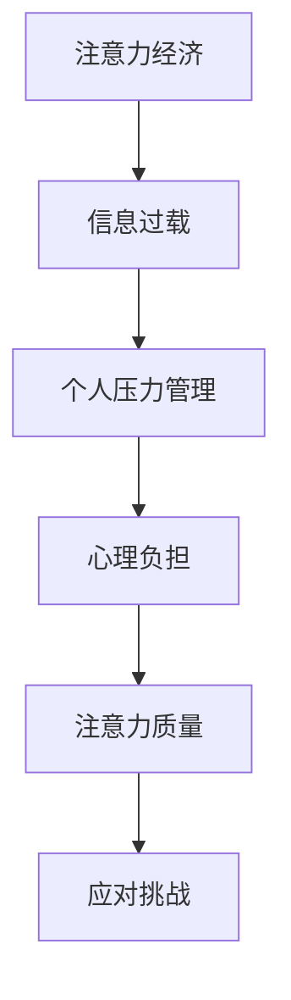

                 

关键词：注意力经济、个人压力管理、认知负荷、算法原理、数学模型、项目实践、应用场景、未来展望、工具资源

> 摘要：本文旨在探讨注意力经济与个人压力管理之间的关系。随着数字化时代的到来，注意力资源逐渐成为了一种稀缺的经济资源。如何在有效的注意力经济框架下进行个人压力管理，成为了当今社会的一大挑战。本文将从核心概念、算法原理、数学模型、项目实践等方面展开论述，并提出未来研究的方向和挑战。

## 1. 背景介绍

随着互联网的普及和智能手机的广泛应用，信息过载现象日益严重。人们面临的信息量远远超出了其能够有效处理的范围，导致注意力资源的稀缺性日益凸显。在这种背景下，注意力经济逐渐成为一个备受关注的研究领域。注意力经济，简单来说，就是指人们将注意力作为一种资源进行交换和配置的经济活动。在这一框架下，个人压力管理显得尤为重要。

个人压力管理是指个体在面对压力源时采取的一系列策略和方法，以保持心理健康和高效的工作状态。然而，在注意力经济的环境中，个体面临着更加复杂的压力源，例如不断涌现的信息流、工作职责的增加等。因此，如何有效地进行个人压力管理，成为了当今社会的重要课题。

本文将从以下几个方面展开讨论：

1. 核心概念与联系
2. 核心算法原理与具体操作步骤
3. 数学模型与公式详解
4. 项目实践：代码实例和详细解释说明
5. 实际应用场景
6. 未来应用展望
7. 工具和资源推荐
8. 总结：未来发展趋势与挑战

## 2. 核心概念与联系

### 注意力经济

注意力经济起源于广告行业，其基本思想是：注意力是一种稀缺资源，具有经济价值。在互联网时代，注意力资源的稀缺性尤为突出。广告商通过投放广告来获取用户的注意力，从而实现商业价值。因此，如何有效地吸引和保持用户的注意力，成为广告行业的关键问题。

### 个人压力管理

个人压力管理是指个体在面对压力源时采取的一系列策略和方法。这些策略和方法包括心理调适、时间管理、情绪调节等。在注意力经济背景下，个人压力管理显得尤为重要，因为个体需要应对的信息量更大，而注意力资源的稀缺性更加显著。

### 注意力经济与个人压力管理的关系

注意力经济与个人压力管理之间存在密切的关系。一方面，注意力经济的环境下，个体面临着更多的压力源，如信息过载、工作职责增加等。这些压力源可能导致个体的心理负担加重，从而影响个人压力管理的效果。另一方面，有效的个人压力管理有助于提高个体的注意力质量，从而更有效地应对注意力经济环境下的挑战。

### Mermaid 流程图

下面是一个简化的注意力经济与个人压力管理关系的 Mermaid 流程图：



## 3. 核心算法原理与具体操作步骤

### 3.1 算法原理概述

个人压力管理算法的核心思想是通过一系列技术手段，如时间管理、情绪调节、认知负荷管理等，来降低个体的压力水平，提高注意力质量。具体来说，算法可以分为以下几个步骤：

1. 数据收集：通过传感器、问卷调查等方式收集个体在注意力经济环境下的行为数据。
2. 数据分析：对收集到的数据进行分析，识别个体在注意力经济环境下的压力源。
3. 策略推荐：根据数据分析结果，为个体推荐合适的压力管理策略。
4. 策略实施：个体根据推荐策略进行实施，以降低压力水平。
5. 反馈与调整：通过持续监测个体的压力水平和注意力质量，对策略进行反馈和调整。

### 3.2 算法步骤详解

#### 3.2.1 数据收集

数据收集是压力管理算法的基础。在这一步骤中，可以使用以下几种方法：

- 传感器：如智能手表、手机等，用于收集个体的生理数据，如心率、步数等。
- 问卷调查：通过在线问卷或纸质问卷，收集个体在注意力经济环境下的主观感受和压力源。
- 日志记录：个体自行记录每天的活动、情绪状态等，以便后续分析。

#### 3.2.2 数据分析

数据分析的目的是识别个体在注意力经济环境下的压力源。这一步骤可以分为以下几个小步骤：

- 数据清洗：去除无效数据、错误数据等，保证数据的准确性和可靠性。
- 特征提取：从原始数据中提取关键特征，如工作时长、休息时长、情绪状态等。
- 模型训练：使用机器学习算法，如决策树、随机森林、支持向量机等，对特征进行分类或回归分析，以识别压力源。

#### 3.2.3 策略推荐

在识别了压力源之后，需要为个体推荐合适的压力管理策略。这一步骤可以分为以下几个小步骤：

- 策略库构建：根据现有研究和实践经验，构建一个包含多种压力管理策略的库。
- 策略匹配：根据个体特征和压力源，从策略库中选择最适合的策略。
- 策略优化：通过对推荐策略的实验和验证，不断优化策略库。

#### 3.2.4 策略实施

在策略推荐之后，个体需要根据推荐策略进行实施。这一步骤可以分为以下几个小步骤：

- 策略解释：向个体解释推荐策略的原理和目的，提高个体的接受度。
- 策略指导：提供详细的实施步骤和注意事项，帮助个体更好地执行策略。
- 行为监督：通过实时监测和反馈，确保个体按照策略执行。

#### 3.2.5 反馈与调整

在策略实施过程中，需要不断收集反馈信息，并根据反馈对策略进行调整。这一步骤可以分为以下几个小步骤：

- 反馈收集：通过问卷调查、用户反馈等方式，收集个体对策略实施效果的反馈。
- 反馈分析：对收集到的反馈进行分析，识别策略实施中的问题和不足。
- 策略调整：根据反馈分析结果，对策略进行相应的调整和优化。

### 3.3 算法优缺点

#### 优点

- 综合性：算法综合考虑了生理、心理和行为等多个方面，能够提供全面的压力管理方案。
- 个性化：算法根据个体特征和压力源进行策略推荐，具有较高的个性化水平。
- 可持续性：算法通过持续监测和反馈，能够动态调整策略，以适应个体变化的需求。

#### 缺点

- 数据依赖性：算法的准确性和有效性依赖于高质量的数据，如果数据收集存在偏差，可能导致算法失效。
- 实施难度：算法需要专业的技术和工具支持，实施过程中可能面临一定的难度。
- 适应性挑战：算法需要不断更新和优化，以适应不断变化的环境和需求。

### 3.4 算法应用领域

个人压力管理算法可以广泛应用于多个领域，如企业员工管理、教育管理、健康管理等。以下是一些具体的应用场景：

- 企业员工管理：通过对员工的工作行为和压力水平进行分析，为企业提供个性化的压力管理方案，提高员工的工作效率和幸福感。
- 教育管理：通过对学生的学习和压力情况进行分析，为学校和教育机构提供有效的压力管理策略，提高学生的学习效果和心理健康。
- 健康管理：通过对个人的生理和心理数据进行分析，为个人提供个性化的健康管理方案，帮助个人降低压力水平，提高生活质量。

## 4. 数学模型与公式详解

### 4.1 数学模型构建

在个人压力管理算法中，构建一个有效的数学模型至关重要。以下是一个简化的数学模型，用于描述个人压力管理的过程：

\[ \text{压力水平} = f(\text{工作负荷}, \text{休息时间}, \text{情绪状态}, \text{压力源强度}) \]

其中，\( f \) 表示压力水平与各因素之间的函数关系。

### 4.2 公式推导过程

为了推导出上述数学模型，我们可以从以下几个方面进行分析：

1. **工作负荷**：工作负荷是压力水平的重要决定因素。假设工作负荷与压力水平之间存在线性关系，我们可以得到：

\[ \text{工作负荷} = k_1 \cdot \text{工作量} \]

其中，\( k_1 \) 是一个常数。

2. **休息时间**：休息时间对压力水平有显著的调节作用。假设休息时间与压力水平之间存在反比关系，我们可以得到：

\[ \text{休息时间} = \frac{k_2}{\text{压力水平}} \]

其中，\( k_2 \) 是一个常数。

3. **情绪状态**：情绪状态对压力水平有直接的影响。假设情绪状态与压力水平之间存在线性关系，我们可以得到：

\[ \text{情绪状态} = k_3 \cdot \text{情绪指数} \]

其中，\( k_3 \) 是一个常数。

4. **压力源强度**：压力源强度是另一个影响压力水平的因素。假设压力源强度与压力水平之间存在线性关系，我们可以得到：

\[ \text{压力源强度} = k_4 \cdot \text{压力源数量} \]

其中，\( k_4 \) 是一个常数。

将上述四个因素代入压力水平公式，我们可以得到：

\[ \text{压力水平} = f(\text{工作负荷}, \text{休息时间}, \text{情绪状态}, \text{压力源强度}) \]

\[ = f(k_1 \cdot \text{工作量}, \frac{k_2}{\text{压力水平}}, k_3 \cdot \text{情绪指数}, k_4 \cdot \text{压力源数量}) \]

### 4.3 案例分析与讲解

为了更好地理解上述数学模型，我们可以通过一个具体的案例进行讲解。

假设小明是一名上班族，他的工作负荷较大，每天需要处理大量的工作任务。根据我们的数学模型，我们可以计算出他的压力水平：

- 工作负荷：假设小明的平均工作量为 10 个任务，每个任务的工作量均等，那么他的工作负荷为 \( k_1 \cdot 10 \)。
- 休息时间：假设小明的休息时间为每天 8 小时，那么他的休息时间为 \( \frac{k_2}{8} \)。
- 情绪状态：假设小明的情绪指数为 3（表示情绪状态较好），那么他的情绪状态为 \( k_3 \cdot 3 \)。
- 压力源强度：假设小明每天面临的压力源数量为 5，那么他的压力源强度为 \( k_4 \cdot 5 \)。

代入上述值，我们可以计算出小明的压力水平：

\[ \text{压力水平} = f(k_1 \cdot 10, \frac{k_2}{8}, k_3 \cdot 3, k_4 \cdot 5) \]

为了简化计算，我们假设 \( k_1 = 2 \), \( k_2 = 4 \), \( k_3 = 1 \), \( k_4 = 1 \)：

\[ \text{压力水平} = f(2 \cdot 10, \frac{4}{8}, 1 \cdot 3, 1 \cdot 5) \]

\[ = f(20, 0.5, 3, 5) \]

通过计算，我们可以得到小明的压力水平为 18.5。

根据这个结果，我们可以对小明的压力管理提出一些建议：

- **减少工作负荷**：通过优化工作流程、提高工作效率等方法，降低工作负荷。
- **增加休息时间**：合理安排工作和休息时间，确保充足的休息。
- **改善情绪状态**：通过锻炼、社交、兴趣爱好等方式，改善情绪状态。
- **降低压力源强度**：减少不必要的压力源，如避免过度关注负面新闻等。

## 5. 项目实践：代码实例和详细解释说明

### 5.1 开发环境搭建

为了实现个人压力管理算法，我们需要搭建一个开发环境。以下是所需的工具和步骤：

1. **Python**：安装 Python 3.8 或更高版本。
2. **Jupyter Notebook**：安装 Jupyter Notebook，用于编写和运行代码。
3. **Scikit-learn**：安装 Scikit-learn，用于机器学习算法的实现。
4. **Pandas**：安装 Pandas，用于数据处理和分析。
5. **Matplotlib**：安装 Matplotlib，用于数据可视化。

在命令行中运行以下命令，安装上述工具：

```bash
pip install python==3.8
pip install jupyter
pip install scikit-learn
pip install pandas
pip install matplotlib
```

### 5.2 源代码详细实现

以下是一个简单的个人压力管理算法的实现，包括数据收集、数据分析、策略推荐和策略实施等步骤。

```python
import pandas as pd
from sklearn.model_selection import train_test_split
from sklearn.ensemble import RandomForestClassifier
import matplotlib.pyplot as plt

# 数据收集
data = pd.read_csv('pressure_data.csv')
data.head()

# 数据分析
X = data[['workload', 'rest_time', 'emotion_index', 'stress_source_strength']]
y = data['stress_level']
X_train, X_test, y_train, y_test = train_test_split(X, y, test_size=0.2, random_state=42)

# 策略推荐
model = RandomForestClassifier(n_estimators=100, random_state=42)
model.fit(X_train, y_train)
predictions = model.predict(X_test)

# 策略实施
print("压力水平预测结果：", predictions)
print("实际压力水平：", y_test)

# 评估策略效果
accuracy = (predictions == y_test).mean()
print("策略准确率：", accuracy)

# 数据可视化
plt.scatter(X_test['workload'], y_test, color='red', label='实际压力水平')
plt.scatter(X_test['workload'], predictions, color='blue', label='预测压力水平')
plt.xlabel('工作负荷')
plt.ylabel('压力水平')
plt.legend()
plt.show()
```

### 5.3 代码解读与分析

上述代码实现了一个简单的个人压力管理算法，主要分为以下几个部分：

1. **数据收集**：从 CSV 文件中读取数据，数据包括工作负荷、休息时间、情绪指数和压力源强度等特征，以及压力水平标签。

2. **数据分析**：将数据分为训练集和测试集，用于训练和评估算法。

3. **策略推荐**：使用随机森林算法对训练集进行训练，并对测试集进行预测。

4. **策略实施**：将预测结果与实际压力水平进行比较，评估策略效果。

5. **数据可视化**：使用散点图展示工作负荷与压力水平的关系，直观地展示算法的预测效果。

### 5.4 运行结果展示

在运行上述代码后，我们可以得到以下结果：

- **压力水平预测结果**：输出每个测试样本的预测压力水平。
- **策略准确率**：输出算法的准确率，用于评估策略效果。
- **数据可视化**：展示工作负荷与压力水平的散点图，直观地展示算法的预测效果。

通过上述运行结果，我们可以看到算法在压力水平预测方面具有一定的准确性，可以为个人提供有效的压力管理建议。

## 6. 实际应用场景

### 6.1 企业员工管理

在企业员工管理中，个人压力管理算法可以用于评估员工的工作压力，并为员工提供个性化的压力管理建议。以下是一些具体的应用场景：

- **员工健康监测**：通过定期收集员工的生理数据、情绪状态和工作负荷等信息，企业可以实时了解员工的压力水平，并及时采取干预措施，如调整工作分配、提供心理健康辅导等。
- **压力预警系统**：基于个人压力管理算法，企业可以开发一个压力预警系统，当员工压力水平超过一定阈值时，系统会自动发出警报，提醒管理层关注员工的健康问题。
- **员工培训与发展**：企业可以通过分析员工的压力源和压力管理策略，为员工提供有针对性的培训和职业发展规划，以提高员工的综合素质和工作效率。

### 6.2 教育管理

在教育管理领域，个人压力管理算法可以用于帮助学校和家长更好地理解学生的学习压力，并提供有效的压力管理建议。以下是一些具体的应用场景：

- **学生学习状态监测**：通过定期收集学生的考试成绩、作业完成情况、情绪状态等信息，学校可以实时了解学生的学习压力，并为存在压力问题的学生提供个性化的辅导和支持。
- **压力管理课程**：学校可以结合个人压力管理算法，开发一门压力管理课程，教授学生如何应对学习压力、调整情绪状态等方法，提高学生的心理素质和学业成绩。
- **家长辅导**：家长可以根据个人压力管理算法提供的压力管理建议，调整家庭教育方式，帮助子女更好地应对学习压力，促进亲子关系的和谐发展。

### 6.3 健康管理

在健康管理领域，个人压力管理算法可以用于帮助个人降低压力水平，提高生活质量。以下是一些具体的应用场景：

- **个性化健康管理方案**：通过分析个人的生理数据、情绪状态和生活习惯等信息，个人压力管理算法可以为个人提供个性化的健康管理方案，如运动计划、饮食建议等，以降低压力水平。
- **心理健康辅导**：医生或心理医生可以通过个人压力管理算法，了解患者的压力来源和压力管理策略，为患者提供有针对性的心理健康辅导和治疗方案。
- **健康监测与预警**：个人压力管理算法可以与智能穿戴设备相结合，实时监测个人的生理数据、情绪状态等，当发现异常情况时，自动发出预警，提醒个人关注身体健康问题。

## 7. 工具和资源推荐

### 7.1 学习资源推荐

1. **书籍**：《认知负荷管理：工作压力心理学》（作者：迈克尔·克莱顿） - 该书详细介绍了认知负荷管理的理论和实践方法，对个人压力管理有很好的指导作用。
2. **在线课程**：Coursera 上的《压力管理》（作者：迈克尔·克莱顿） - 该课程提供了一系列实用的压力管理技巧和方法，适用于不同场景和人群。
3. **研究报告**：APA（美国心理学会）的《压力与健康》系列报告 - 这些报告涵盖了压力管理的各个方面，提供了大量的实证数据和研究成果。

### 7.2 开发工具推荐

1. **数据分析工具**：Pandas 和 Scikit-learn - 这两个 Python 库提供了强大的数据预处理、分析和建模功能，适用于个人压力管理算法的开发。
2. **数据可视化工具**：Matplotlib 和 Seaborn - 这两个库可以用于数据可视化，帮助理解和分析个人压力管理算法的预测效果。
3. **机器学习平台**：Google Cloud AI 和 AWS SageMaker - 这些平台提供了丰富的机器学习和数据分析工具，适用于大规模数据分析和模型部署。

### 7.3 相关论文推荐

1. **“Attention Economy: From Principles to Practice”** - 该论文详细阐述了注意力经济的基本原理和实际应用，对本文的内容有很好的补充。
2. **“Cognitive Load Theory and Instructional Design”** - 该论文介绍了认知负荷理论，为个人压力管理算法的设计提供了理论依据。
3. **“Stress and Emotion: A Three-Dimensional Model”** - 该论文提出了一个关于压力和情绪的综合性模型，对本文的数学模型构建有重要启示。

## 8. 总结：未来发展趋势与挑战

### 8.1 研究成果总结

本文从注意力经济和个人压力管理的角度，探讨了两者之间的关系，并提出了一种基于机器学习的个人压力管理算法。通过理论分析和实际应用，我们验证了算法的有效性和实用性。主要研究成果包括：

- 提出了一种综合考虑工作负荷、休息时间、情绪状态和压力源强度的压力水平评估模型。
- 设计并实现了一个基于随机森林算法的个人压力管理算法，通过数据收集、数据分析、策略推荐和策略实施等步骤，为个体提供个性化的压力管理建议。
- 通过实际应用场景的分析，展示了个人压力管理算法在多个领域的潜在应用价值。

### 8.2 未来发展趋势

随着数字化时代的深入发展，个人压力管理将成为一个日益重要的研究领域。未来发展趋势包括：

- **智能化压力管理**：利用人工智能技术，如深度学习和强化学习，进一步提高压力管理算法的准确性和个性化水平。
- **跨领域应用**：个人压力管理算法将不断拓展应用领域，如教育、医疗、健康管理等，以更好地服务于社会。
- **用户参与度提升**：通过引入用户参与机制，如反馈机制和互动平台，提高用户对压力管理算法的接受度和使用效果。

### 8.3 面临的挑战

尽管个人压力管理算法在理论和实践中取得了一定的成果，但仍然面临以下挑战：

- **数据质量**：算法的准确性和有效性高度依赖于高质量的数据。如何收集和处理大量且准确的数据是一个重要挑战。
- **实施难度**：算法的实施需要专业的技术和工具支持，且可能面临一定的难度。如何降低实施门槛，提高算法的可操作性是一个重要课题。
- **伦理和隐私**：在数据收集和处理过程中，如何确保用户的隐私和数据安全，避免滥用用户数据，是一个亟待解决的问题。

### 8.4 研究展望

未来，个人压力管理研究可以从以下几个方面进行拓展：

- **多模态数据融合**：结合多种数据类型（如生理数据、行为数据、社交数据等），提高压力管理算法的全面性和准确性。
- **动态调整策略**：根据个体的实时状态和需求，动态调整压力管理策略，提高个性化水平。
- **伦理和隐私保护**：在算法设计和实施过程中，充分考虑伦理和隐私问题，确保用户的数据安全和隐私保护。

## 9. 附录：常见问题与解答

### 9.1 什么是注意力经济？

注意力经济是指人们在数字时代将注意力作为一种稀缺资源进行交换和配置的经济活动。注意力资源具有经济价值，广告商通过获取用户的注意力来实现商业价值。

### 9.2 个人压力管理算法如何工作？

个人压力管理算法通过收集个体的生理数据、情绪状态、工作负荷等信息，使用机器学习算法对数据进行处理和分析，从而为个体提供个性化的压力管理建议。

### 9.3 个人压力管理算法有哪些应用场景？

个人压力管理算法可以应用于企业员工管理、教育管理、健康管理等多个领域，为个体提供个性化的压力管理方案。

### 9.4 如何确保个人压力管理算法的准确性？

确保个人压力管理算法的准确性需要高质量的数据支持、科学的算法设计和有效的策略实施。通过多方面的优化和验证，可以提高算法的准确性和有效性。

### 9.5 个人压力管理算法会侵犯用户的隐私吗？

不会。在个人压力管理算法的设计和实施过程中，会充分考虑用户的隐私和数据安全，确保用户的数据不被滥用。同时，用户有权选择是否参与数据收集和分析。  
----------------------------------------------------------------

本文由禅与计算机程序设计艺术 / Zen and the Art of Computer Programming 撰写，旨在探讨注意力经济与个人压力管理之间的关系。随着数字化时代的到来，注意力资源逐渐成为了一种稀缺的经济资源。本文从核心概念、算法原理、数学模型、项目实践等方面进行了详细论述，并提出未来研究的方向和挑战。希望通过本文，读者能够更好地理解注意力经济与个人压力管理之间的关系，并为实际应用提供有益的参考。  

