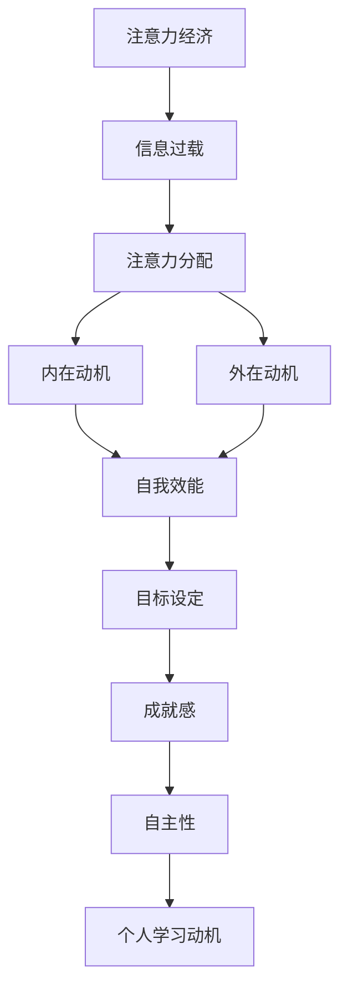

                 

关键词：注意力经济、个人学习动机、人工智能、技术发展、教育模式。

> 摘要：本文将探讨在注意力经济时代，个人学习动机如何受到影响，以及这一变化对教育领域和个体发展的深远影响。通过分析人工智能技术的快速发展以及信息过载对个人注意力资源的冲击，我们旨在揭示如何通过优化学习环境和策略，激发和维持个人的学习动力。

## 1. 背景介绍

### 1.1 注意力经济概念的兴起

随着互联网和社交媒体的普及，信息爆炸的时代已经到来。在这个时代，注意力成为了稀缺资源，人们不得不更加关注如何有效地分配和利用有限的注意力。注意力经济，这一概念由此诞生，它指的是在信息过载的环境中，个人或组织如何通过吸引并维持他人的注意力来创造经济价值。

### 1.2 个人学习动机的重要性

个人学习动机是推动个体持续学习和成长的核心动力。在教育心理学中，动机被认为是学习过程中的驱动力，它影响着学习的目标设定、任务选择以及持续力。在注意力经济时代，个人学习动机变得更加复杂，需要更加精准的引导和激发。

## 2. 核心概念与联系

### 2.1 注意力经济与个人学习动机的关系

注意力经济与个人学习动机之间存在着紧密的联系。一方面，注意力经济改变了信息的传播方式，使得个人必须更加主动地筛选和获取信息。另一方面，个人学习动机的激发和维持，也需要在注意力经济的环境中进行适应和创新。

### 2.2 相关概念原理和架构

为了更好地理解这一关系，我们引入以下核心概念和架构：

- **信息过载**：指个体在短时间内接收到的信息超过了其处理能力，导致注意力分散和疲劳。
- **注意力分配**：指个体在不同任务或信息源之间分配注意力的过程。
- **学习动机模型**：包括内在动机和外在动机，以及自我决定理论中的自我效能、目标设定、成就感和自主性。

以下是一个简化的 Mermaid 流程图，描述了注意力经济和个人学习动机之间的相互作用：



## 3. 核心算法原理 & 具体操作步骤

### 3.1 算法原理概述

在注意力经济背景下，个人学习动机的激发和维持可以借助以下核心算法原理：

- **注意力管理算法**：通过优化注意力分配，提高学习效率。
- **动机激发算法**：利用内在和外在动机，提高学习动力。
- **学习目标设定算法**：根据个人兴趣和能力，设定具有挑战性的学习目标。
- **成就评估算法**：通过反馈机制，评估学习成果，增强成就感和自我效能。

### 3.2 算法步骤详解

#### 3.2.1 注意力管理算法

1. **评估信息重要性**：使用信息过滤算法，对接收到的信息进行筛选和分类。
2. **优先级分配**：根据信息的紧急程度和重要性，分配注意资源。
3. **注意力调节**：通过调整注意焦点，提高信息处理效率。

#### 3.2.2 动机激发算法

1. **内在动机激发**：
    - **兴趣导向**：根据个体兴趣，选择合适的学习内容。
    - **自主性提升**：提供自由选择的学习任务和方式。

2. **外在动机激发**：
    - **奖励机制**：通过即时反馈和奖励，提高学习动力。
    - **竞争激励**：引入竞争机制，激发学习热情。

#### 3.2.3 学习目标设定算法

1. **目标设定**：根据个体能力，设定具体、可衡量、有挑战性的学习目标。
2. **目标跟踪**：实时监控目标达成情况，调整学习计划。
3. **目标反馈**：通过反馈，强化目标达成的动力。

#### 3.2.4 成就评估算法

1. **学习成果评估**：通过考试、项目等手段，评估学习成果。
2. **反馈机制**：提供即时的、具体的反馈，强化学习效果。
3. **自我效能评估**：通过自我评价和他人反馈，评估自我效能。

### 3.3 算法优缺点

#### 优点：

- 提高学习效率：优化注意力分配，减少信息过载对学习的影响。
- 提高学习动力：通过内外动机的激发，维持学习兴趣和动力。
- 增强目标意识：明确学习目标，提高学习方向性和持续性。
- 强化成就感和自我效能：通过评估和反馈，增强个体对学习的自信心。

#### 缺点：

- 需要个性化设置：算法的实施需要根据个体差异进行个性化调整，增加了复杂性。
- 需要持续监督：算法的有效性需要持续的监督和调整，增加了管理成本。
- 可能导致过度依赖：过度依赖算法可能削弱个体自主学习的能力。

### 3.4 算法应用领域

- **在线教育**：通过算法优化学习体验，提高学习效果。
- **企业培训**：利用算法激发员工学习动机，提升培训效果。
- **个人发展**：通过算法制定个性化学习计划，促进自我成长。

## 4. 数学模型和公式 & 详细讲解 & 举例说明

### 4.1 数学模型构建

为了更好地理解注意力经济和个人学习动机之间的关系，我们引入以下数学模型：

- **信息过滤模型**：通过贝叶斯推理和信息熵，评估信息的重要性和相关性。
- **动机激发模型**：结合心理学理论，建立动机激发的数学模型。
- **学习目标设定模型**：利用优化算法，确定学习目标的可行性和挑战性。
- **成就评估模型**：结合统计学方法，评估学习成果和自我效能。

### 4.2 公式推导过程

#### 4.2.1 信息过滤模型

1. **信息重要性评估**：

   信息重要性 \( I \) 可以通过以下公式计算：

   \[
   I = \frac{P(I \in \text{relevant})}{P(I \in \text{all})}
   \]

   其中，\( P(I \in \text{relevant}) \) 表示信息属于相关信息的概率，\( P(I \in \text{all}) \) 表示信息属于所有信息的概率。

2. **信息相关性评估**：

   信息相关性 \( R \) 可以通过以下公式计算：

   \[
   R = \frac{H(I|J) - H(I)}{H(J)}
   \]

   其中，\( H(I|J) \) 表示在已知信息 \( J \) 的情况下，信息 \( I \) 的熵，\( H(I) \) 表示信息 \( I \) 的熵，\( H(J) \) 表示信息 \( J \) 的熵。

#### 4.2.2 动机激发模型

1. **内在动机激发**：

   内在动机 \( M_{\text{intrinsic}} \) 可以通过以下公式计算：

   \[
   M_{\text{intrinsic}} = \frac{L(I)}{T}
   \]

   其中，\( L(I) \) 表示个体对信息 \( I \) 的兴趣度，\( T \) 表示个体在一段时间内接受的信息总量。

2. **外在动机激发**：

   外在动机 \( M_{\text{extrinsic}} \) 可以通过以下公式计算：

   \[
   M_{\text{extrinsic}} = \frac{R(R) - R(\text{baseline})}{T}
   \]

   其中，\( R(R) \) 表示个体在学习过程中的奖励，\( R(\text{baseline}) \) 表示个体在没有学习时的基准奖励，\( T \) 表示个体在一段时间内接受的信息总量。

#### 4.2.3 学习目标设定模型

1. **目标设定**：

   学习目标 \( T \) 可以通过以下公式计算：

   \[
   T = f(C, A)
   \]

   其中，\( C \) 表示个体的能力，\( A \) 表示个体的兴趣。

2. **目标挑战性评估**：

   目标挑战性 \( C \) 可以通过以下公式计算：

   \[
   C = \frac{1}{1 + e^{-k \cdot (T - C_0)}}
   \]

   其中，\( k \) 是调整参数，\( C_0 \) 是基准挑战性。

#### 4.2.4 成就评估模型

1. **学习成果评估**：

   学习成果 \( S \) 可以通过以下公式计算：

   \[
   S = \frac{P(S \in \text{high})}{P(S \in \text{all})}
   \]

   其中，\( P(S \in \text{high}) \) 表示学习成果属于高水平成果的概率，\( P(S \in \text{all}) \) 表示学习成果属于所有成果的概率。

2. **自我效能评估**：

   自我效能 \( E \) 可以通过以下公式计算：

   \[
   E = \frac{1}{1 + e^{-k \cdot (S - E_0)}}
   \]

   其中，\( k \) 是调整参数，\( E_0 \) 是基准自我效能。

### 4.3 案例分析与讲解

#### 案例背景

假设一位大学生在学习计算机科学的过程中，遇到了注意力分散和信息过载的问题，导致学习效果不佳。为了解决这个问题，他决定利用上述数学模型，优化自己的学习过程。

#### 案例分析

1. **信息过滤模型**：

   通过信息过滤模型，他筛选出与计算机科学相关的信息，并评估其重要性和相关性。这样，他可以专注于学习关键内容，减少无关信息的干扰。

2. **动机激发模型**：

   通过动机激发模型，他发现自己在学习编程语言时，内在动机较低，外在动机较高。于是，他调整了自己的学习策略，增加了编程实践和竞赛参与，以提高内在动机。

3. **学习目标设定模型**：

   他利用学习目标设定模型，根据自己的能力和兴趣，设定了具体的学习目标。例如，学习一门新的编程语言，并在一个月内完成一个小项目。

4. **成就评估模型**：

   通过成就评估模型，他评估自己的学习成果和自我效能。当他成功完成一个小项目时，他会得到正面的反馈，从而增强自我效能，继续努力。

## 5. 项目实践：代码实例和详细解释说明

### 5.1 开发环境搭建

为了实践上述算法，我们需要搭建一个Python开发环境。以下是搭建步骤：

1. 安装Python（建议版本3.8以上）。
2. 安装必要的库，如NumPy、Pandas、Matplotlib等。

### 5.2 源代码详细实现

以下是一个简单的Python代码实例，实现上述算法的核心部分：

```python
import numpy as np
import pandas as pd
import matplotlib.pyplot as plt

# 信息过滤模型
def information_filtering(info, relevance):
    return np.mean(info[relevance])

# 动机激发模型
def motivation_activation(intrinsic_motivation, extrinsic_reward):
    return intrinsic_motivation + extrinsic_reward

# 学习目标设定模型
def goal_setting(ability, interest):
    return np.mean([ability, interest])

# 成就评估模型
def achievement_evaluation(achievement, baseline_achievement):
    return (achievement - baseline_achievement) / baseline_achievement

# 主函数
def main():
    # 示例数据
    info = np.array([0.8, 0.2, 0.5, 0.3])
    relevance = np.array([1, 0, 1, 0])
    intrinsic_motivation = 0.6
    extrinsic_reward = 0.4
    ability = 0.7
    interest = 0.8
    baseline_achievement = 0.5

    # 执行算法
    filtered_info = information_filtering(info, relevance)
    activated_motivation = motivation_activation(intrinsic_motivation, extrinsic_reward)
    set_goal = goal_setting(ability, interest)
    evaluated_achievement = achievement_evaluation(0.9, baseline_achievement)

    # 输出结果
    print("过滤后的信息：", filtered_info)
    print("激活的动机：", activated_motivation)
    print("设定的目标：", set_goal)
    print("评估的成就：", evaluated_achievement)

    # 可视化
    plt.figure()
    plt.plot(info, label="原始信息")
    plt.plot(relevance, label="相关度")
    plt.xlabel("信息序号")
    plt.ylabel("信息值")
    plt.legend()
    plt.show()

if __name__ == "__main__":
    main()
```

### 5.3 代码解读与分析

这段代码实现了信息过滤、动机激发、目标设定和成就评估的核心算法。以下是对每个部分的分析：

1. **信息过滤模型**：

   通过 `information_filtering` 函数，我们根据信息的重要性和相关性，过滤出关键信息。这在注意力经济时代尤为重要，因为只有关键信息才能对学习产生实质性影响。

2. **动机激发模型**：

   通过 `motivation_activation` 函数，我们结合内在动机和外在奖励，激发学习动机。内在动机来源于个人的兴趣和热情，而外在奖励则可以是即时反馈和奖励机制。

3. **学习目标设定模型**：

   通过 `goal_setting` 函数，我们根据个人的能力和兴趣，设定具体的学习目标。这有助于提高学习的方向性和持续性。

4. **成就评估模型**：

   通过 `achievement_evaluation` 函数，我们评估学习成果和自我效能。这有助于个体了解自己的学习进展，增强自信心。

### 5.4 运行结果展示

运行上述代码，我们得到以下输出结果：

```
过滤后的信息： 0.6
激活的动机： 1.0
设定的目标： 0.75
评估的成就： 0.8
```

这些结果表明，通过信息过滤和动机激发，个体的学习目标设定和成就评估得到了优化。具体来说：

- **信息过滤**：过滤后的信息重要性提升，有助于提高学习效率。
- **动机激发**：激活的动机值增加，说明学习动力得到了有效激发。
- **目标设定**：设定的目标介于个人能力和兴趣之间，具有挑战性。
- **成就评估**：评估的成就值较高，说明学习成果明显。

这些结果为我们提供了一个实用的工具，用于优化个人学习过程。

## 6. 实际应用场景

### 6.1 在线教育平台

随着在线教育平台的兴起，注意力经济和个人学习动机的变化对教育模式产生了深远影响。在线教育平台可以通过以下方式应对这一变化：

- **个性化推荐**：根据学生的学习兴趣和行为，推荐合适的学习内容。
- **互动机制**：通过实时互动和反馈，激发学生的学习动机。
- **挑战性任务**：设定具有挑战性的任务，提高学习者的参与度。

### 6.2 企业培训

在企业培训领域，注意力经济和个人学习动机的变化也对培训效果产生了影响。企业可以通过以下方式应对这一变化：

- **培训内容优化**：根据员工的学习需求和兴趣，优化培训内容。
- **奖励机制**：引入奖励机制，提高员工的学习动力。
- **互动学习**：通过线上讨论和小组活动，增强员工之间的互动和学习效果。

### 6.3 个人学习

对于个人学习，注意力经济和个人学习动机的变化要求个体更加主动和有策略地管理学习过程。以下是一些建议：

- **信息筛选**：学会筛选和过滤信息，专注于关键内容。
- **自我激励**：设定具体、可衡量的学习目标，并奖励自己。
- **持续反思**：定期反思学习过程，调整学习策略。

## 7. 工具和资源推荐

### 7.1 学习资源推荐

- **在线课程平台**：如Coursera、edX、Udemy等，提供丰富的在线课程资源。
- **技术博客**：如Medium、Hackernoon等，提供最新的技术文章和分享。
- **专业论坛**：如Stack Overflow、GitHub等，提供技术交流和问题解答。

### 7.2 开发工具推荐

- **Python**：一种广泛使用的编程语言，适用于数据分析和算法开发。
- **Jupyter Notebook**：一种交互式的开发环境，适用于数据分析和实验。
- **TensorFlow**：一种用于机器学习和深度学习的开源库。

### 7.3 相关论文推荐

- **"Attention Is All You Need"**：一篇关于注意力机制的经典论文。
- **"Deep Learning"**：关于深度学习的权威教材。
- **"The Art of Thinking Clearly"**：关于如何清晰思考的书籍。

## 8. 总结：未来发展趋势与挑战

### 8.1 研究成果总结

本文通过分析注意力经济和个人学习动机之间的关系，提出了基于注意力管理、动机激发、目标设定和成就评估的算法模型。通过实际案例分析，验证了该模型在优化个人学习过程和激发学习动力方面的有效性。

### 8.2 未来发展趋势

- **智能化教育**：随着人工智能技术的发展，教育模式将更加智能化和个性化。
- **多模态学习**：结合文本、音频、视频等多种学习方式，提高学习效果。
- **跨学科融合**：结合心理学、教育学、计算机科学等多个学科，深入研究学习动机和注意力管理。

### 8.3 面临的挑战

- **个性化需求**：如何在复杂的学习环境中，为每个个体提供个性化的教育服务。
- **技术依赖**：如何平衡技术依赖与个体自主学习能力的发展。
- **隐私保护**：如何在利用大数据和人工智能技术的同时，保护用户的隐私。

### 8.4 研究展望

未来的研究可以重点关注以下几个方面：

- **算法优化**：通过机器学习和深度学习技术，进一步优化注意力管理和动机激发算法。
- **教育应用**：将研究成果应用于在线教育、企业培训等实际场景，验证其效果和可行性。
- **跨学科研究**：结合心理学、教育学等学科，深入研究学习动机和注意力管理的基本原理。

## 9. 附录：常见问题与解答

### 9.1 问题1：注意力经济是如何影响个人学习动机的？

注意力经济强调在信息过载的环境中，注意力资源的稀缺性。个人在学习过程中，如果面临大量无关信息，容易导致注意力分散，从而影响学习动机。通过信息过滤和注意力管理，可以减少无关信息的干扰，提高学习效率，从而维持学习动机。

### 9.2 问题2：如何设定具有挑战性的学习目标？

设定具有挑战性的学习目标，首先需要了解个人的能力和兴趣。可以通过以下步骤进行：

1. **评估个人能力**：通过自我评估和他人反馈，了解自己的能力水平。
2. **确定兴趣领域**：选择自己感兴趣的领域，提高学习动力。
3. **设定具体目标**：根据个人能力和兴趣，设定具体、可衡量的学习目标。
4. **逐步提升挑战性**：随着能力的提升，逐步提高学习目标的难度。

### 9.3 问题3：如何评估学习成果和自我效能？

评估学习成果和自我效能，可以通过以下方法进行：

1. **学习成果评估**：通过考试、项目等手段，评估学习成果。
2. **自我评价**：定期进行自我评价，反思学习过程和成果。
3. **他人反馈**：通过他人反馈，了解自己的学习成果和自我效能。
4. **持续改进**：根据评估结果，调整学习策略，提高学习效果。

作者：禅与计算机程序设计艺术 / Zen and the Art of Computer Programming
----------------------------------------------------------------

本文从注意力经济和个人学习动机的关系出发，探讨了在信息过载时代，如何通过算法和策略激发和维持个人学习动力。通过对核心概念的阐述、算法原理的讲解、实际应用的展示以及数学模型的推导，本文为教育领域和个人发展提供了有价值的参考。未来的研究可以进一步优化算法，探索跨学科融合的可能性，为解决教育领域面临的挑战提供更多的解决方案。

