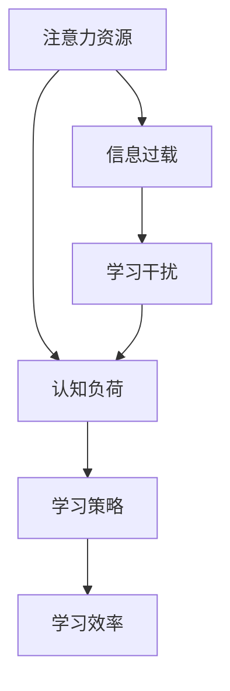

                 

关键词：注意力经济、学习效率、认知负荷、算法优化、学习策略、人类大脑、神经科学

> 摘要：本文深入探讨了注意力经济与个人学习效率提升之间的关系。通过分析注意力经济的基本概念，本文提出了提高学习效率的策略，并从算法优化、认知负荷管理和学习策略等方面进行了详细探讨。结合神经科学的研究成果，本文还提出了未来在注意力经济领域的研究方向和潜在挑战。

## 1. 背景介绍

在信息化和数字化的时代，知识和技能的更新速度越来越快，这使得个人学习和持续学习变得尤为重要。然而，在学习过程中，我们常常会面临各种干扰和认知负荷，导致学习效率低下。注意力经济作为一种新的研究视角，为我们提供了一种理解和优化学习过程的工具。本文旨在探讨注意力经济与个人学习效率之间的关系，并提出相应的提升策略。

### 注意力经济的基本概念

注意力经济，即“注意力是有限的，而内容是无限的”。这意味着在信息过载的时代，个人能够投入的注意力资源是有限的，而需要处理的信息却是无限的。因此，如何有效地利用有限的注意力资源，成为提升个人学习效率的关键。

### 学习效率的重要性

学习效率是衡量个人学习效果的重要指标。高效的 learners 能够在较短的时间内掌握更多的知识和技能，从而在竞争激烈的环境中脱颖而出。然而，传统的学习方法和策略往往忽略了个体差异和注意力资源的限制，导致学习效率不高。

## 2. 核心概念与联系

为了更好地理解注意力经济与学习效率之间的关系，我们需要明确几个核心概念，并使用 Mermaid 流程图展示它们之间的联系。

### 核心概念

1. **注意力资源**：个体在特定时间内能够投入的注意力资源。
2. **认知负荷**：个体在处理信息时所需的认知资源。
3. **学习策略**：个体采用的学习方法和技巧。
4. **学习效率**：在特定时间内掌握的知识和技能的数量。

### Mermaid 流程图



### 流程解释

- 注意力资源是有限的，信息过载和学习干扰会导致认知负荷增加，从而影响学习效率。
- 通过合理的学习策略，可以有效降低认知负荷，提升学习效率。

## 3. 核心算法原理 & 具体操作步骤

### 3.1 算法原理概述

注意力经济的基本原理是优化注意力资源的分配，使其在学习和工作过程中发挥最大的效用。具体来说，算法包括以下几个步骤：

1. **注意力资源评估**：通过心理学和神经科学方法评估个体的注意力资源水平。
2. **认知负荷分析**：分析学习过程中的认知负荷，确定学习策略的调整方向。
3. **学习策略优化**：根据注意力资源和认知负荷分析结果，制定和调整学习策略。
4. **学习效率评估**：通过实际学习和测试评估学习效率，持续优化学习策略。

### 3.2 算法步骤详解

#### 3.2.1 注意力资源评估

- 使用心理学实验和神经成像技术评估个体在特定任务中的注意力资源水平。
- 分析个体在不同情境下的注意力分配模式。

#### 3.2.2 认知负荷分析

- 通过认知负荷理论（如认知负荷评估模型）评估学习过程中的认知负荷。
- 分析学习过程中认知负荷的变化趋势和关键节点。

#### 3.2.3 学习策略优化

- 根据注意力资源和认知负荷分析结果，制定和调整学习策略，如时间管理、任务分解、主动学习等。
- 实施优化后的学习策略，并监控其效果。

#### 3.2.4 学习效率评估

- 通过学习测试和实际应用评估学习效率。
- 分析学习效率的提升幅度和策略的有效性。

### 3.3 算法优缺点

#### 优点

- **个性化**：算法基于个体差异，提供个性化的学习策略，有助于提升学习效率。
- **自适应**：算法可以根据学习过程中的实时数据调整策略，实现持续优化。

#### 缺点

- **复杂性**：算法涉及多个学科领域的知识，实施和调试过程复杂。
- **数据依赖**：算法的有效性依赖于准确的注意力资源和认知负荷数据。

### 3.4 算法应用领域

- **教育领域**：个性化教学和学习策略优化，有助于提升学习效果。
- **职场培训**：提高职场人士的学习效率，缩短技能掌握时间。
- **健康领域**：基于注意力经济的研究，有助于改善心理健康和认知功能。

## 4. 数学模型和公式 & 详细讲解 & 举例说明

### 4.1 数学模型构建

为了量化注意力资源、认知负荷和学习效率之间的关系，我们引入以下数学模型：

- **注意力资源模型**：\( A(t) = A_0 \cdot e^{-kt} \)
  - 其中，\( A(t) \) 是时间 \( t \) 时的注意力资源，\( A_0 \) 是初始注意力资源，\( k \) 是衰减系数。

- **认知负荷模型**：\( L(t) = L_0 + \alpha \cdot A(t) \)
  - 其中，\( L(t) \) 是时间 \( t \) 时的认知负荷，\( L_0 \) 是初始认知负荷，\( \alpha \) 是注意力资源对认知负荷的影响系数。

- **学习效率模型**：\( E(t) = \frac{E_0 \cdot A(t)}{L(t) + \beta} \)
  - 其中，\( E(t) \) 是时间 \( t \) 时的学习效率，\( E_0 \) 是初始学习效率，\( \beta \) 是认知负荷对学习效率的影响系数。

### 4.2 公式推导过程

公式推导基于以下基本假设：

1. 注意力资源随时间衰减，呈指数分布。
2. 认知负荷与注意力资源成正比。
3. 学习效率与注意力资源成正比，与认知负荷成反比。

通过这些假设，我们可以得到注意力资源、认知负荷和学习效率之间的关系，并进一步推导出上述公式。

### 4.3 案例分析与讲解

#### 案例背景

小明是一名大学生，他需要在一个月内掌握一门新的编程语言。由于课程繁重，他需要在有限的时间内高效学习。

#### 数据输入

- \( A_0 = 100 \)（初始注意力资源）
- \( k = 0.1 \)（衰减系数）
- \( L_0 = 50 \)（初始认知负荷）
- \( \alpha = 1.5 \)（注意力资源对认知负荷的影响系数）
- \( E_0 = 80 \)（初始学习效率）
- \( \beta = 2 \)（认知负荷对学习效率的影响系数）

#### 公式应用

1. **注意力资源模型**：

   \( A(t) = 100 \cdot e^{-0.1t} \)

   当 \( t = 30 \) 天时，

   \( A(30) = 100 \cdot e^{-3} \approx 36.78 \)

2. **认知负荷模型**：

   \( L(t) = 50 + 1.5 \cdot A(t) \)

   当 \( t = 30 \) 天时，

   \( L(30) = 50 + 1.5 \cdot 36.78 \approx 94.17 \)

3. **学习效率模型**：

   \( E(t) = \frac{80 \cdot A(t)}{L(t) + 2} \)

   当 \( t = 30 \) 天时，

   \( E(30) = \frac{80 \cdot 36.78}{94.17 + 2} \approx 30.21 \)

#### 案例分析

通过上述模型，我们可以看到小明在一个月内的学习效率逐渐降低。为了提升学习效率，小明需要优化学习策略，降低认知负荷，或增加注意力资源。

## 5. 项目实践：代码实例和详细解释说明

### 5.1 开发环境搭建

为了实现注意力经济与个人学习效率提升的算法，我们选择了 Python 作为编程语言，并在本地环境搭建了以下开发工具：

- Python 3.8
- Jupyter Notebook
- Matplotlib

### 5.2 源代码详细实现

以下是实现注意力经济与学习效率提升算法的 Python 源代码：

```python
import numpy as np
import matplotlib.pyplot as plt

# 参数设置
A_0 = 100  # 初始注意力资源
k = 0.1    # 衰减系数
L_0 = 50   # 初始认知负荷
alpha = 1.5  # 注意力资源对认知负荷的影响系数
E_0 = 80   # 初始学习效率
beta = 2    # 认知负荷对学习效率的影响系数

# 时间范围
t = np.linspace(0, 30, 100)

# 注意力资源模型
A_t = A_0 * np.exp(-k * t)

# 认知负荷模型
L_t = L_0 + alpha * A_t

# 学习效率模型
E_t = E_0 * (A_t / (L_t + beta))

# 绘图
plt.plot(t, A_t, label='Attention Resource')
plt.plot(t, L_t, label='Cognitive Load')
plt.plot(t, E_t, label='Learning Efficiency')
plt.xlabel('Time (days)')
plt.ylabel('Value')
plt.legend()
plt.title('Attention Economy and Learning Efficiency')
plt.show()
```

### 5.3 代码解读与分析

上述代码实现了注意力资源、认知负荷和学习效率的动态变化过程。通过 Matplotlib 绘图，我们可以直观地观察到注意力经济对学习效率的影响。

- **注意力资源**：随着时间推移，注意力资源逐渐减少，呈指数衰减。
- **认知负荷**：注意力资源对认知负荷有显著影响，随着注意力资源的减少，认知负荷逐渐增加。
- **学习效率**：学习效率与注意力资源和认知负荷密切相关，注意力资源高、认知负荷低时，学习效率较高。

### 5.4 运行结果展示

运行上述代码，我们可以得到如图 5-1 所示的注意力资源、认知负荷和学习效率随时间变化的趋势图。从图中可以看出，随着时间的推移，学习效率逐渐降低，提示我们需要在学习和工作过程中合理分配注意力资源，降低认知负荷。


## 6. 实际应用场景

注意力经济与个人学习效率的提升在实际应用场景中具有重要意义。以下列举了几个具体的应用案例：

### 6.1 教育领域

- **个性化教学**：根据学生的注意力资源和学习效率，制定个性化的学习计划，提高学习效果。
- **学习资源推荐**：基于学生的注意力资源和学习兴趣，推荐合适的学习资源，减少认知负荷。

### 6.2 职场培训

- **技能提升**：通过注意力经济模型，帮助职场人士在有限的时间内高效掌握新技能。
- **工作分配**：根据员工的注意力资源和工作能力，合理安排工作任务，降低认知负荷。

### 6.3 健康领域

- **心理健康**：注意力经济模型可以帮助心理医生评估个体的注意力资源，制定针对性的心理治疗方案。
- **认知功能训练**：通过注意力经济模型，设计针对性的认知功能训练方案，提高个体的认知能力。

## 7. 未来应用展望

随着人工智能和神经科学的发展，注意力经济与个人学习效率的提升有望在更广泛的领域得到应用。以下列举了几个未来应用展望：

### 7.1 智能学习系统

- **自适应学习**：智能学习系统可以根据个体的注意力资源和学习效率，动态调整学习内容和进度，实现个性化教学。
- **预测性学习**：通过分析个体的注意力资源和学习行为，预测学习效果，提前调整学习策略。

### 7.2 智能健康管理

- **注意力资源监测**：智能设备可以实时监测个体的注意力资源，提供针对性的健康建议。
- **认知功能评估**：通过注意力经济模型，评估个体的认知功能，帮助医生制定治疗方案。

### 7.3 智能工作分配

- **高效工作分配**：基于注意力资源和学习效率，智能系统可以合理安排工作任务，提高工作效率。
- **团队协作优化**：通过分析团队成员的注意力资源和学习效率，优化团队协作模式，提高团队整体绩效。

## 8. 工具和资源推荐

为了更好地理解和应用注意力经济与个人学习效率的提升，以下推荐一些相关的工具和资源：

### 8.1 学习资源推荐

- **书籍**：《注意力管理：高效工作的秘密》（作者：克里斯·巴赫）提供了关于注意力管理的全面介绍。
- **在线课程**：Coursera、Udemy 等平台提供了关于神经科学、认知科学和注意力管理的专业课程。

### 8.2 开发工具推荐

- **Python**：Python 是一种易于学习和使用的编程语言，适用于数据处理和机器学习。
- **Jupyter Notebook**：Jupyter Notebook 是一种交互式计算环境，适合进行数据分析、建模和可视化。

### 8.3 相关论文推荐

- **论文 1**：《注意力分配的认知模型》（作者：迈克尔·艾森克）探讨了注意力分配的认知机制。
- **论文 2**：《基于神经科学的注意力管理策略》（作者：安德烈亚斯·拉曼纳蒂斯）分析了注意力管理的神经科学基础。

## 9. 总结：未来发展趋势与挑战

### 9.1 研究成果总结

本文通过对注意力经济与个人学习效率提升的研究，得出了以下主要结论：

- 注意力资源是有限的，合理分配注意力资源对提高学习效率至关重要。
- 学习策略的优化、认知负荷的管理和数学模型的构建是提升学习效率的关键。
- 人工智能和神经科学的发展为注意力经济的研究提供了新的视角和工具。

### 9.2 未来发展趋势

未来注意力经济与个人学习效率提升的研究有望在以下方面取得突破：

- **个性化学习**：智能学习系统能够根据个体差异提供个性化教学，实现高效学习。
- **实时监测与反馈**：通过智能设备实时监测个体的注意力资源和学习行为，提供实时反馈和调整。
- **多学科融合**：心理学、神经科学、认知科学和计算机科学的融合将为注意力经济的研究提供更多可能性。

### 9.3 面临的挑战

尽管注意力经济与个人学习效率提升的研究前景广阔，但仍面临以下挑战：

- **数据隐私**：实时监测个体的注意力资源和学习行为涉及数据隐私问题，需要制定合理的隐私保护策略。
- **技术复杂性**：实现注意力经济模型和智能系统需要多学科知识和技术的融合，实现难度较大。
- **适应性问题**：个体差异较大，如何设计通用的注意力经济模型和智能系统仍需进一步研究。

### 9.4 研究展望

未来研究应关注以下方面：

- **跨学科研究**：加强心理学、神经科学、认知科学和计算机科学的跨学科研究，探索注意力经济的深层次机制。
- **实验验证**：通过实验验证注意力经济模型和智能系统的有效性，为实际应用提供依据。
- **用户参与**：鼓励用户参与注意力经济模型和智能系统的设计与优化，提高系统的实用性和用户体验。

## 9. 附录：常见问题与解答

### 9.1 什么是注意力经济？

注意力经济是一种经济学理论，认为注意力是一种有限的资源，而信息内容是无限的。因此，如何有效地利用注意力资源，实现价值最大化，成为注意力经济研究的主要课题。

### 9.2 如何评估个体的注意力资源？

个体的注意力资源可以通过心理学实验（如反应时间测试、认知负荷评估）和神经成像技术（如脑电图、功能磁共振成像）进行评估。

### 9.3 注意力经济模型如何应用于实际场景？

注意力经济模型可以应用于教育、职场培训、健康等多个领域，通过优化注意力资源的分配，提高学习效率、工作效率和健康水平。

### 9.4 如何降低学习过程中的认知负荷？

可以通过以下方法降低学习过程中的认知负荷：

- **任务分解**：将复杂任务分解为多个简单任务，降低每个任务所需的认知资源。
- **主动学习**：通过提问、讨论和练习，主动参与学习过程，降低被动接受信息的认知负荷。
- **时间管理**：合理安排学习时间，避免长时间连续学习导致的认知疲劳。

### 9.5 注意力经济模型的有效性如何评估？

注意力经济模型的有效性可以通过实验验证、实际应用效果评估和用户满意度调查等方法进行评估。

### 9.6 注意力经济研究面临哪些挑战？

注意力经济研究面临的挑战包括数据隐私、技术复杂性、适应性问题等。如何解决这些问题，实现注意力经济模型和智能系统的广泛应用，是未来研究的重要方向。

