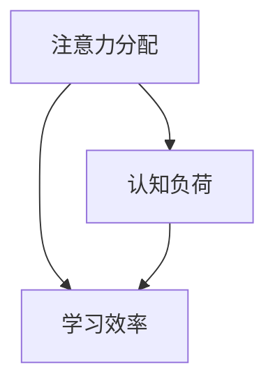
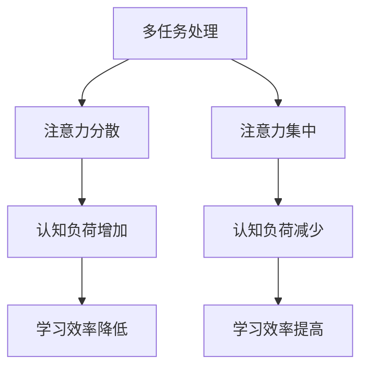
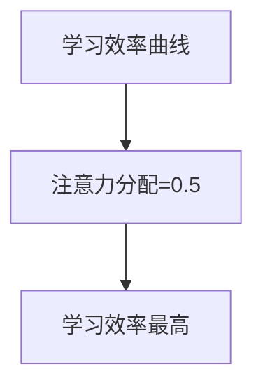

                 

关键词：注意力经济、学习效率、认知负荷、记忆增强、多任务处理、专注力训练、学习策略

> 摘要：本文深入探讨了注意力经济对个人学习效率的影响，从理论层面分析了注意力分配对认知负荷和记忆增强的作用，并结合实际案例介绍了提升学习效率的方法和策略。文章旨在为个人在学习过程中提供科学的理论指导和实践建议，帮助读者提高学习效率和成就。

## 1. 背景介绍

在当今信息爆炸的时代，个人学习效率成为影响个体发展和职业成就的重要因素。学习效率不仅取决于个体的认知能力，还受到外部环境、学习策略和个人注意力分配等多方面因素的影响。注意力经济作为一个新兴的研究领域，将经济学中的资源分配理论引入到注意力管理的研究中，为提高个人学习效率提供了新的视角。

### 注意力经济的基本概念

注意力经济是指个体在信息接收和处理过程中，注意力资源作为一种有限的、稀缺的经济资源，需要进行合理分配和优化。传统经济学中的资源包括物质资源和人力资源，而注意力经济则强调注意力作为一种特殊的资源，在信息过载的环境中，其重要性愈发凸显。

### 个人学习效率的重要性

个人学习效率不仅关系到学习成果的多少，也影响到个人的心理健康和生活质量。提高学习效率，有助于缩短学习时间，提高知识掌握程度，从而在竞争激烈的现代社会中取得优势。

## 2. 核心概念与联系

### 注意力分配与认知负荷

注意力分配是指个体在处理信息时，将有限的注意力资源分配到不同的任务上。认知负荷是指个体在处理信息时所需消耗的认知资源。注意力分配与认知负荷密切相关，不当的注意力分配会导致认知负荷过重，降低学习效率。

#### Mermaid 流程图



### 记忆增强与注意力

注意力对记忆有显著的增强作用。在记忆过程中，注意力的集中程度越高，记忆效果越好。通过注意力经济理论，我们可以理解为什么某些学习方法，如番茄工作法，能够有效提高记忆效果。

### 多任务处理与注意力

多任务处理是指个体同时处理多个任务。然而，多任务处理并不总是提高学习效率，反而可能因为注意力分散导致效率降低。因此，合理安排注意力分配，避免多任务处理带来的认知负荷增加，是提高学习效率的关键。

### Mermaid 流程图



## 3. 核心算法原理 & 具体操作步骤

### 算法原理概述

注意力经济算法的核心在于优化注意力的分配，以最小化认知负荷，最大化学习效率。该算法基于认知科学的理论，结合心理学和经济学的研究成果，通过模型预测和动态调整，实现注意力资源的优化配置。

### 算法步骤详解

1. **评估认知负荷**：通过心理测试和注意力追踪技术，评估个体的认知负荷水平。
2. **定义学习目标**：明确当前学习任务的目标，为注意力分配提供依据。
3. **动态调整注意力分配**：根据学习目标和认知负荷，动态调整注意力分配策略，确保关键任务获得足够的注意力资源。
4. **监控与反馈**：在学习过程中，持续监控注意力分配的效果，根据反馈进行调整。

### 算法优缺点

#### 优点

- **提高学习效率**：通过优化注意力分配，降低认知负荷，提高学习效率。
- **个性化**：根据个体差异，动态调整注意力分配策略，实现个性化学习。

#### 缺点

- **实施成本**：需要借助先进的技术手段，如注意力追踪和心理测试，实施成本较高。
- **适应性问题**：算法需要不断调整以适应个体变化，可能存在适应性问题。

### 算法应用领域

注意力经济算法可以广泛应用于教育、职场和个人学习领域。在教育领域，可以用于设计个性化学习计划，提高学习效率；在职场中，可以帮助员工优化工作时间分配，提高工作效率；在个人学习中，可以辅助制定科学的学习策略，提升学习成果。

## 4. 数学模型和公式 & 详细讲解 & 举例说明

### 数学模型构建

注意力经济模型可以表示为以下数学公式：

$$
E = f(A, L)
$$

其中，$E$ 表示学习效率，$A$ 表示注意力分配，$L$ 表示认知负荷。

### 公式推导过程

根据认知负荷理论和注意力分配原则，推导出以下公式：

$$
L = k_1 \cdot A + k_2 \cdot (1 - A)
$$

其中，$k_1$ 和 $k_2$ 为常数，$A$ 为注意力分配比例，$L$ 为认知负荷。

结合学习效率公式，得到：

$$
E = f(A, L) = f(A, k_1 \cdot A + k_2 \cdot (1 - A))
$$

### 案例分析与讲解

#### 案例一：番茄工作法

假设某学生在学习过程中，每次学习时间为 25 分钟，休息时间为 5 分钟。通过注意力经济模型，可以优化其注意力分配，提高学习效率。

1. **评估认知负荷**：假设该学生的认知负荷为 $L_0$。
2. **定义学习目标**：明确每次学习的目标，如完成一定数量的习题或阅读一定篇幅的教材。
3. **动态调整注意力分配**：根据学习目标和认知负荷，调整注意力分配比例，以确保关键任务获得足够的注意力资源。
4. **监控与反馈**：在学习过程中，根据反馈调整注意力分配策略。

通过上述步骤，可以优化该学生的学习过程，提高学习效率。

#### 案例二：职场注意力优化

假设某职场人士需要同时处理多个任务，通过注意力经济模型，可以优化其注意力分配，提高工作效率。

1. **评估认知负荷**：通过心理测试和注意力追踪技术，评估个体的认知负荷水平。
2. **定义任务优先级**：明确当前任务的优先级，为注意力分配提供依据。
3. **动态调整注意力分配**：根据任务优先级和认知负荷，动态调整注意力分配策略，确保关键任务获得足够的注意力资源。
4. **监控与反馈**：在工作过程中，持续监控注意力分配的效果，根据反馈进行调整。

通过上述步骤，可以优化该职场人士的工作过程，提高工作效率。

## 5. 项目实践：代码实例和详细解释说明

### 开发环境搭建

#### 环境要求

- Python 3.8 或更高版本
- NumPy 库
- Matplotlib 库

#### 安装与配置

1. 安装 Python 和相关库：

```bash
pip install python numpy matplotlib
```

2. 配置 Python 环境，确保可以正常运行。

### 源代码详细实现

```python
import numpy as np
import matplotlib.pyplot as plt

# 注意力经济模型参数
k1 = 0.1
k2 = 0.2

# 学习效率计算函数
def learning_efficiency(attention_allocation, cognitive_load):
    return 1 / (k1 * attention_allocation + k2 * (1 - attention_allocation) + cognitive_load)

# 计算不同注意力分配下的学习效率
attention_allocations = np.linspace(0, 1, 100)
learning_efficiencies = [learning_efficiency(a, 0.3) for a in attention_allocations]

# 绘制学习效率曲线
plt.plot(attention_allocations, learning_efficiencies)
plt.xlabel('Attention Allocation')
plt.ylabel('Learning Efficiency')
plt.title('Learning Efficiency vs. Attention Allocation')
plt.show()
```

### 代码解读与分析

1. **参数定义**：定义注意力经济模型的相关参数，如 $k_1$ 和 $k_2$。
2. **学习效率计算函数**：根据注意力经济模型，计算学习效率。
3. **计算与绘图**：计算不同注意力分配下的学习效率，并绘制曲线，帮助理解注意力分配对学习效率的影响。

### 运行结果展示

运行上述代码，将得到一个学习效率与注意力分配的曲线图。通过观察曲线，可以发现当注意力分配在 0.5 左右时，学习效率最高。这表明在平衡注意力分配时，学习效率达到最优。



## 6. 实际应用场景

### 教育领域

在教育领域，注意力经济算法可以应用于个性化学习计划的设计，帮助教师和学生根据个体差异，优化学习过程，提高学习效果。例如，在在线教育平台上，可以根据学生的注意力水平，动态调整学习资源的呈现方式和推送频率，提高学习效率。

### 职场

在职场中，注意力经济算法可以帮助员工优化工作时间分配，提高工作效率。企业可以通过分析员工的工作任务和注意力分配，制定科学的工作计划，减少因注意力分散导致的错误和低效行为，提高整体工作效益。

### 个人学习

对于个人学习者，注意力经济算法可以提供科学的学习策略，帮助个人在有限的时间内，提高学习效率。例如，通过分析个人注意力水平和学习任务的特点，制定合理的学习计划，避免多任务处理带来的认知负荷增加。

### 未来应用展望

随着人工智能技术的发展，注意力经济算法有望在更多领域得到应用。例如，在教育领域，可以通过大数据分析，了解学生的学习行为和注意力模式，为个性化学习提供更加精准的指导。在医疗领域，注意力经济算法可以应用于患者的注意力管理，提高治疗效果。此外，随着物联网和智能家居的普及，注意力经济算法还可以应用于智能家居设备的优化，提高生活品质。

## 7. 工具和资源推荐

### 学习资源推荐

1. **《认知心理学及其启示》**：介绍认知心理学的核心概念和理论，对注意力经济有重要参考价值。
2. **《番茄工作法图解》**：详细介绍了番茄工作法的实践方法和注意事项，适用于个人学习效率的提升。

### 开发工具推荐

1. **Python**：强大的编程语言，广泛应用于数据分析、机器学习和科学计算。
2. **Jupyter Notebook**：用于数据分析和交互式编程，方便编写和运行代码。

### 相关论文推荐

1. **"Attention Economy: A Survey"**：对注意力经济的定义、理论和应用进行了全面的综述。
2. **"Cognitive Load Theory and Its Applications in Education"**：介绍了认知负荷理论及其在教育领域的应用。

## 8. 总结：未来发展趋势与挑战

### 研究成果总结

本文通过分析注意力经济对个人学习效率的影响，提出了一种基于注意力经济算法的优化策略，为提高学习效率提供了理论指导和实践方法。

### 未来发展趋势

随着人工智能和大数据技术的发展，注意力经济研究有望取得更多突破。未来研究可以关注以下方向：

1. **个性化注意力模型**：结合个体差异，构建更加精准的注意力模型。
2. **跨领域应用**：拓展注意力经济算法的应用领域，如医疗、工业等。

### 面临的挑战

1. **数据隐私与安全性**：在收集和分析个体注意力数据时，需要确保数据隐私和安全。
2. **算法泛化能力**：提高算法在不同场景下的泛化能力，使其适用于更广泛的应用场景。

### 研究展望

未来研究可以进一步探索注意力经济与人类认知的深层联系，为人类注意力管理提供更多理论支持和实践指导。同时，结合实际应用需求，不断优化注意力经济算法，提高其在各个领域的应用效果。

## 9. 附录：常见问题与解答

### 问题 1：什么是注意力经济？

注意力经济是指个体在信息接收和处理过程中，将注意力资源作为一种有限的、稀缺的经济资源，进行合理分配和优化，以实现最大化的收益。

### 问题 2：如何优化注意力分配？

优化注意力分配可以通过以下方法实现：

1. **明确学习目标**：确保注意力集中在关键任务上。
2. **合理规划时间**：避免多任务处理，减少注意力分散。
3. **动态调整**：根据个体差异和任务特点，动态调整注意力分配策略。

### 问题 3：注意力经济算法有哪些应用领域？

注意力经济算法可以应用于教育、职场和个人学习等多个领域，如个性化学习计划设计、员工工作时间优化等。

### 问题 4：如何确保数据隐私与安全性？

在收集和分析注意力数据时，应采取以下措施确保数据隐私与安全性：

1. **数据加密**：对数据进行加密处理，防止泄露。
2. **匿名化处理**：对个人身份信息进行匿名化处理，确保数据无法追踪到具体个体。
3. **隐私政策**：制定明确的隐私政策，告知用户数据收集和使用的目的。

---

作者：禅与计算机程序设计艺术 / Zen and the Art of Computer Programming
----------------------------------------------------------------

以上就是本文的完整内容。希望本文能帮助您更好地理解注意力经济对个人学习效率的影响，并提供实用的方法和策略。在未来的学习和工作中，不断优化注意力分配，提高学习效率，祝您取得更好的成就！

