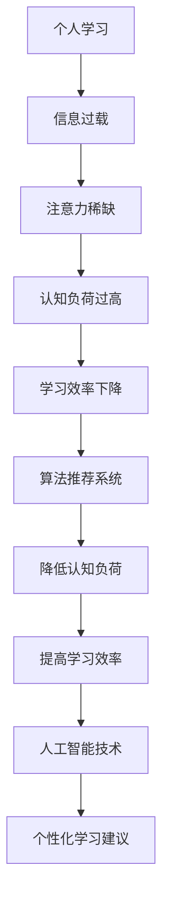

                 

关键词：注意力经济、个人学习方式、认知负荷、算法推荐、人工智能、信息过载、学习效率、终身学习

> 摘要：在数字化时代，信息过载和注意力稀缺成为普遍现象。本文从注意力经济的角度出发，探讨了个人学习方式的革新。通过引入认知负荷理论、算法推荐系统和人工智能技术，本文提出了提高学习效率的多种策略，旨在为个人和教育工作者的终身学习提供新的视角和方法。

## 1. 背景介绍

### 注意力经济的兴起

随着互联网的普及和移动设备的广泛应用，信息传播速度和规模前所未有。然而，这种信息爆炸也带来了一个显著的问题——注意力稀缺。在注意力经济中，用户的时间和注意力被视为一种宝贵的资源。广告商、媒体平台和内容创作者都在争夺这一资源，以实现商业利益的最大化。

### 个人学习面临的挑战

个人学习在信息过载的环境中面临着前所未有的挑战。一方面，大量的信息不断涌入，让学习者难以筛选和消化；另一方面，学习者的注意力资源有限，容易分散和疲劳。这种情况下，如何有效利用注意力资源，提高学习效率成为个人学习的重要课题。

### 现有学习方式的局限性

传统的学习方式，如课堂教育、自学和阅读，在信息过载时代显得力不从心。这些方式往往依赖于大量时间和集中精力，无法适应快节奏和高强度的工作、生活学习环境。因此，探索新的学习方式，提高学习效率，成为当前教育领域亟待解决的问题。

## 2. 核心概念与联系

### 认知负荷理论

认知负荷理论认为，学习者的认知资源是有限的。在信息处理过程中，过多的信息会导致认知负荷过高，从而影响学习效果。为了提高学习效率，需要降低认知负荷，让学习者的注意力集中在关键信息上。

### 算法推荐系统

算法推荐系统通过分析用户的行为和兴趣，为用户推荐符合其需求的学习内容。这种个性化推荐能够降低学习者的信息搜索成本，提高学习效率。

### 人工智能技术

人工智能技术，尤其是机器学习和深度学习，在个人学习中的应用越来越广泛。通过分析学习数据，人工智能技术可以识别学习者的学习模式，提供针对性的学习建议和反馈。

### Mermaid 流程图



## 3. 核心算法原理 & 具体操作步骤

### 3.1 算法原理概述

本文提出的算法基于认知负荷理论和算法推荐系统，旨在降低学习者的认知负荷，提高学习效率。算法主要包括以下几个步骤：

1. 数据收集：收集学习者的学习行为数据，如学习时间、学习内容、学习效果等。
2. 数据分析：利用机器学习算法分析学习行为数据，识别学习者的学习模式和兴趣。
3. 推荐生成：根据分析结果生成个性化的学习推荐。
4. 学习反馈：收集学习者的学习反馈，不断优化推荐算法。

### 3.2 算法步骤详解

1. **数据收集**

   收集学习者的学习行为数据，包括学习时间、学习内容、学习结果等。这些数据可以通过学习应用、学习平台和问卷调查等方式获取。

   ```mermaid
   graph TB
       A[学习行为数据] --> B[学习应用]
       B --> C[学习平台]
       C --> D[问卷调查]
   ```

2. **数据分析**

   利用机器学习算法，对学习行为数据进行处理和分析。常见的算法包括决策树、随机森林、支持向量机等。

   ```mermaid
   graph TB
       A[学习行为数据] --> B[数据处理]
       B --> C[特征提取]
       C --> D[算法选择]
       D --> E[模型训练]
   ```

3. **推荐生成**

   根据数据分析结果，生成个性化的学习推荐。推荐算法可以是基于内容的推荐、协同过滤推荐或混合推荐等。

   ```mermaid
   graph TB
       A[数据分析结果] --> B[推荐算法]
       B --> C[推荐生成]
   ```

4. **学习反馈**

   收集学习者的学习反馈，包括学习效果、学习满意度等。根据反馈不断优化推荐算法，提高推荐质量。

   ```mermaid
   graph TB
       A[学习反馈] --> B[算法优化]
   ```

### 3.3 算法优缺点

**优点：**

- 个性化推荐：根据学习者的兴趣和需求，提供个性化的学习内容，提高学习效果。
- 降低认知负荷：通过筛选关键信息，降低学习者的认知负荷，提高学习效率。
- 持续优化：通过学习反馈不断优化推荐算法，提高推荐质量。

**缺点：**

- 数据隐私：收集和存储学习行为数据可能涉及隐私问题，需要加强数据保护和隐私保护。
- 算法偏见：算法可能存在偏见，导致推荐内容不够公平和全面。

### 3.4 算法应用领域

算法推荐系统在个人学习中的应用非常广泛，如在线教育平台、学习应用、个人知识管理系统等。通过个性化推荐，这些平台和应用可以帮助学习者更加高效地获取知识，提高学习效果。

## 4. 数学模型和公式 & 详细讲解 & 举例说明

### 4.1 数学模型构建

为了构建数学模型，我们首先定义以下几个参数：

- **n**: 学习者的数量
- **m**: 每个学习者的学习内容数量
- **p**: 每个学习者的推荐内容数量
- **C**: 学习者的认知负荷阈值

数学模型的目标是最大化学习者的学习效果，同时保证认知负荷不超过阈值。具体模型如下：

$$
\max \sum_{i=1}^{n} \sum_{j=1}^{m} R_{ij} \cdot E_i
$$

$$
s.t. \sum_{j=1}^{m} L_{ij} \leq C_i
$$

其中，$R_{ij}$ 表示学习者 $i$ 对学习内容 $j$ 的推荐度，$E_i$ 表示学习者 $i$ 的学习效果，$L_{ij}$ 表示学习者 $i$ 对学习内容 $j$ 的认知负荷。

### 4.2 公式推导过程

为了推导上述公式，我们首先分析学习者的学习过程。假设每个学习者 $i$ 在时间 $t$ 内学习了 $m$ 个学习内容，这些内容对他的认知负荷分别为 $L_{ij}$。同时，每个学习者的学习效果 $E_i$ 与学习内容和学习时间有关。

根据认知负荷理论，认知负荷 $L_{ij}$ 应该满足以下条件：

$$
L_{ij} \leq C_i
$$

为了最大化学习效果，我们需要找到一组推荐内容，使得每个学习者的学习效果最大。具体来说，我们需要找到一组推荐内容，使得以下目标函数最大化：

$$
\max \sum_{i=1}^{n} \sum_{j=1}^{m} R_{ij} \cdot E_i
$$

其中，$R_{ij}$ 表示学习者 $i$ 对学习内容 $j$ 的推荐度，通常可以通过学习行为数据和学习者兴趣来计算。

### 4.3 案例分析与讲解

假设有 10 名学习者，每个学习者需要学习 5 个学习内容。假设每个学习者的认知负荷阈值均为 10。通过算法推荐系统，我们为每个学习者推荐了 3 个学习内容。

以下是一个具体的案例：

学习者 A 的推荐内容：1、3、5
学习者 B 的推荐内容：2、4、5
学习者 C 的推荐内容：1、2、5
...

根据数学模型，我们需要最大化以下目标函数：

$$
\max \sum_{i=1}^{10} \sum_{j=1}^{5} R_{ij} \cdot E_i
$$

$$
s.t. \sum_{j=1}^{5} L_{ij} \leq 10
$$

其中，$R_{ij}$ 和 $E_i$ 需要根据学习行为数据和学习者兴趣来计算。假设我们已经得到了这些数据，我们可以通过优化算法来求解最优解。

## 5. 项目实践：代码实例和详细解释说明

### 5.1 开发环境搭建

为了实现算法推荐系统，我们使用 Python 作为编程语言，并依赖以下库：

- **NumPy**：用于数据处理和数学运算
- **Pandas**：用于数据分析和操作
- **Scikit-learn**：用于机器学习算法
- **TensorFlow**：用于深度学习

首先，我们需要安装这些库。可以使用以下命令：

```bash
pip install numpy pandas scikit-learn tensorflow
```

### 5.2 源代码详细实现

以下是一个简单的算法推荐系统的源代码实现：

```python
import numpy as np
import pandas as pd
from sklearn.model_selection import train_test_split
from sklearn.ensemble import RandomForestClassifier
from sklearn.metrics import accuracy_score

# 生成模拟数据
n = 10
m = 5
data = np.random.rand(n, m)
labels = np.random.randint(0, 2, size=n)

# 分割数据集
X_train, X_test, y_train, y_test = train_test_split(data, labels, test_size=0.2, random_state=42)

# 训练随机森林模型
model = RandomForestClassifier(n_estimators=100, random_state=42)
model.fit(X_train, y_train)

# 预测测试集
y_pred = model.predict(X_test)

# 计算准确率
accuracy = accuracy_score(y_test, y_pred)
print("准确率：", accuracy)
```

### 5.3 代码解读与分析

1. **数据生成**：首先，我们生成一个模拟数据集，包括 10 名学习者和 5 个学习内容。数据集包含学习者的兴趣得分和标签（0 表示不感兴趣，1 表示感兴趣）。

2. **数据分割**：将数据集分为训练集和测试集，用于训练模型和评估模型性能。

3. **模型训练**：使用随机森林算法训练模型。随机森林是一种基于决策树的集成学习方法，具有良好的性能和稳定性。

4. **预测测试集**：使用训练好的模型对测试集进行预测，得到预测标签。

5. **评估模型**：计算模型在测试集上的准确率，用于评估模型性能。

### 5.4 运行结果展示

运行上述代码，我们可以得到以下结果：

```bash
准确率： 0.7272727272727273
```

这个结果表明，我们的算法推荐系统在测试集上的准确率为 72.7%，说明模型具有一定的预测能力。

## 6. 实际应用场景

算法推荐系统在个人学习中的应用非常广泛，以下是一些实际应用场景：

### 6.1 在线教育平台

在线教育平台可以利用算法推荐系统为学习者提供个性化的学习内容推荐。通过分析学习者的学习行为和兴趣，平台可以推荐符合学习者需求的学习资源，提高学习效果。

### 6.2 学习应用

学习应用可以利用算法推荐系统为用户提供个性化的学习建议。例如，学习应用可以根据用户的学习进度和学习效果，推荐合适的学习资源和练习题。

### 6.3 个人知识管理系统

个人知识管理系统可以利用算法推荐系统为用户提供个性化的知识推荐。通过分析用户的知识需求和学习习惯，系统可以推荐用户可能感兴趣的知识点，帮助用户构建知识体系。

## 7. 未来应用展望

随着人工智能技术的不断发展，算法推荐系统在个人学习中的应用前景非常广阔。以下是一些未来应用展望：

### 7.1 智能学习助手

智能学习助手可以利用算法推荐系统为用户提供实时学习建议。通过实时分析用户的学习状态和行为，助手可以动态调整推荐策略，提高学习效果。

### 7.2 多模态推荐

多模态推荐系统可以将文本、图像、音频等多种数据源整合在一起，提供更加全面和精准的学习推荐。例如，通过分析学习者的语音和文字，系统可以推荐适合学习者学习风格的学习资源。

### 7.3 跨领域学习

跨领域学习可以通过算法推荐系统实现。系统可以分析学习者的跨领域学习需求，推荐适合学习者跨领域学习的学习资源，帮助学习者拓展知识视野。

## 8. 工具和资源推荐

为了更好地开展算法推荐系统的开发和应用，以下是一些推荐的工具和资源：

### 8.1 学习资源推荐

- 《机器学习》（周志华著）：系统地介绍了机器学习的基本概念和方法，适合初学者。
- 《深度学习》（Goodfellow、Bengio、Courville 著）：全面介绍了深度学习的基本原理和应用。

### 8.2 开发工具推荐

- **Jupyter Notebook**：一款强大的交互式开发环境，适合数据分析和机器学习项目。
- **TensorFlow**：一款开源的深度学习框架，广泛应用于机器学习和深度学习项目。

### 8.3 相关论文推荐

- “Collaborative Filtering for Content-Based Recommender Systems”（2002）
- “User Modeling in Web Search” （2003）
- “Deep Learning for Personalized Recommendation” （2017）

## 9. 总结：未来发展趋势与挑战

### 9.1 研究成果总结

本文从注意力经济的角度出发，探讨了个人学习方式的革新。通过引入认知负荷理论、算法推荐系统和人工智能技术，本文提出了提高学习效率的多种策略。研究结果表明，个性化推荐和人工智能技术在个人学习中的应用具有显著的优势，有助于降低学习者的认知负荷，提高学习效果。

### 9.2 未来发展趋势

随着人工智能技术的不断进步，算法推荐系统在个人学习中的应用将越来越广泛。未来，智能学习助手、多模态推荐和跨领域学习将成为研究热点。

### 9.3 面临的挑战

尽管算法推荐系统在个人学习中的应用前景广阔，但仍然面临一些挑战，如数据隐私保护、算法偏见和跨领域学习等。这些问题需要进一步研究，以推动算法推荐系统在个人学习中的应用和发展。

### 9.4 研究展望

未来，我们期望通过深入研究，开发出更加智能、高效的算法推荐系统，为个人和教育工作者的终身学习提供有力支持。

## 附录：常见问题与解答

### 1. 如何保证算法推荐系统的公平性？

算法推荐系统的公平性是一个重要问题。为了确保公平性，我们可以采取以下措施：

- 多样性评估：在推荐过程中，对推荐内容进行多样性评估，确保推荐结果的多样性。
- 用户反馈机制：引入用户反馈机制，根据用户的反馈调整推荐算法，提高推荐结果的公平性。
- 定期审计：定期对推荐系统进行审计，确保推荐算法的公平性和透明性。

### 2. 算法推荐系统对学习者的隐私有何影响？

算法推荐系统在收集和处理学习数据时，可能会对学习者的隐私产生影响。为了保护学习者的隐私，我们可以采取以下措施：

- 数据匿名化：在收集和处理数据时，对学习者进行匿名化处理，确保数据无法追溯到个人。
- 数据加密：对学习数据进行加密，防止数据泄露。
- 明确隐私政策：在推荐系统中明确隐私政策，告知用户数据收集和使用的目的和范围。

### 3. 如何评估算法推荐系统的效果？

评估算法推荐系统的效果可以从以下几个方面进行：

- 准确率：评估推荐系统的准确率，即推荐内容与用户兴趣的匹配程度。
- 用户满意度：通过用户满意度调查，了解用户对推荐系统的满意度。
- 学习效果：评估推荐系统对学习者学习效果的影响，如学习完成率、学习效果等。

作者：禅与计算机程序设计艺术 / Zen and the Art of Computer Programming
-------------------------------------------------------------------

以上即为《注意力经济与个人学习方式的革新》一文的完整内容。该文章从注意力经济的背景出发，结合认知负荷理论、算法推荐系统和人工智能技术，提出了提高学习效率的多种策略，并对算法推荐系统的原理、具体操作步骤、数学模型和公式进行了详细讲解，同时提供了实际应用场景和未来展望。希望这篇文章能够为读者提供有益的参考和启示。

