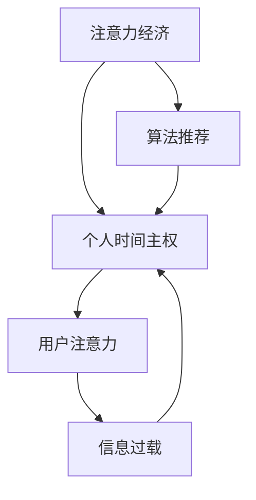

                 

关键词：注意力经济、个人时间主权、算法、算法原理、数学模型、应用场景、未来发展、资源推荐

> 摘要：在注意力经济的时代，个人时间的主权面临着前所未有的挑战。本文将深入探讨注意力经济与个人时间主权之间的博弈，分析其背后的算法原理、数学模型，以及在实际应用场景中的表现。通过对未来发展趋势与挑战的展望，我们希望能够为读者提供一些有益的思考和方向。

## 1. 背景介绍

随着互联网的普及和大数据技术的进步，注意力经济逐渐成为现代商业模式的核心。注意力经济指的是企业通过获取用户注意力来创造价值的过程。在这个过程中，用户的注意力成为了一种稀缺资源，企业和平台都在争夺用户的时间。而个人时间的主权，即个人对于自己时间的掌控权，也受到了越来越大的挑战。

### 1.1 注意力经济的发展历程

注意力经济的概念最早可以追溯到19世纪末20世纪初的媒体产业。随着媒体的多样化，人们开始意识到注意力的重要性。进入互联网时代，注意力经济得到了快速发展。互联网平台通过个性化推荐、广告投放等手段，极大地提高了对用户注意力的获取效率。而随着智能手机的普及，人们的时间更加碎片化，注意力经济变得更加显著。

### 1.2 个人时间主权的挑战

在注意力经济的背景下，个人时间主权面临着多方面的挑战。首先，互联网平台通过算法分析用户的兴趣和行为，以更精准的方式推送内容，从而占用用户的更多时间。其次，各种信息过载现象使得人们难以区分哪些信息是有价值的，哪些是无关的，导致时间的浪费。此外，工作与生活的界限日益模糊，人们在工作中的时间投入也在增加。

## 2. 核心概念与联系

为了更好地理解注意力经济与个人时间主权之间的关系，我们需要引入几个核心概念，并使用 Mermaid 流程图来展示它们之间的联系。



### 2.1 核心概念原理

- **注意力经济**：企业通过获取用户注意力来创造价值。
- **个人时间主权**：个人对自己时间的掌控权。
- **用户注意力**：用户在特定时间段内可用于关注某个事物的心理资源。
- **算法推荐**：通过算法分析用户行为，推荐个性化内容。
- **信息过载**：信息量过多，导致用户难以筛选有价值的信息。

## 3. 核心算法原理 & 具体操作步骤

### 3.1 算法原理概述

在注意力经济中，算法推荐是最为关键的一环。算法推荐基于机器学习技术，通过对用户的历史行为、兴趣和偏好进行分析，为用户推荐可能感兴趣的内容。其核心原理包括用户画像构建、内容标签化、推荐算法设计等。

### 3.2 算法步骤详解

算法推荐的基本步骤如下：

1. **用户画像构建**：收集用户的基本信息、历史行为数据等，构建用户画像。
2. **内容标签化**：将内容进行分类和打标签，以便于推荐算法的分析。
3. **推荐算法设计**：使用协同过滤、基于内容的推荐、混合推荐等方法，生成推荐列表。
4. **实时反馈调整**：根据用户对推荐内容的反馈，动态调整推荐策略。

### 3.3 算法优缺点

算法推荐的优点包括：

- **个性化强**：能够根据用户兴趣推荐相关内容，提高用户满意度。
- **效率高**：通过算法快速处理大量数据，提高推荐效率。

然而，算法推荐也存在一些缺点：

- **信息茧房**：过度推荐可能导致用户只看到与自己观点一致的信息，形成信息茧房。
- **隐私泄露**：用户数据被平台收集和分析，可能存在隐私泄露风险。

### 3.4 算法应用领域

算法推荐在互联网的各个领域都有广泛应用，包括但不限于：

- **社交媒体**：如微博、微信等，通过推荐好友动态、热门话题等吸引用户注意力。
- **电商平台**：如淘宝、京东等，通过推荐商品提高用户购买意愿。
- **新闻媒体**：如今日头条、知乎等，通过推荐新闻、文章等吸引用户阅读。

## 4. 数学模型和公式 & 详细讲解 & 举例说明

### 4.1 数学模型构建

在注意力经济中，我们可以使用一个简单的数学模型来描述用户注意力的分配。假设用户的时间为 T，用户对各个内容的兴趣强度分别为 \( a_1, a_2, ..., a_n \)，则用户在每个内容上的注意力分配为：

\[ t_i = \frac{a_i}{\sum_{j=1}^{n} a_j} \cdot T \]

其中，\( t_i \) 为用户在内容 i 上的注意力时间。

### 4.2 公式推导过程

上述公式的推导基于以下假设：

- 用户总时间 T 是固定的。
- 用户对各个内容的兴趣强度 \( a_i \) 是已知的，且 \( a_i \geq 0 \)。
- 用户在每个内容上的注意力时间是成比例的。

### 4.3 案例分析与讲解

假设一个用户每天有 24 小时的时间，对视频、阅读和社交分别有 0.4、0.3 和 0.3 的兴趣强度。根据上述模型，我们可以计算出用户在每个领域上的注意力时间：

\[ t_{视频} = \frac{0.4}{0.4 + 0.3 + 0.3} \cdot 24 = 9.6 \text{小时} \]
\[ t_{阅读} = \frac{0.3}{0.4 + 0.3 + 0.3} \cdot 24 = 7.2 \text{小时} \]
\[ t_{社交} = \frac{0.3}{0.4 + 0.3 + 0.3} \cdot 24 = 7.2 \text{小时} \]

这意味着，用户在视频、阅读和社交上的时间分配是均衡的，都为 7.2 小时。

## 5. 项目实践：代码实例和详细解释说明

### 5.1 开发环境搭建

为了演示算法推荐的具体实现，我们选择 Python 作为编程语言。首先，我们需要安装必要的库，如 NumPy、Pandas 和 Scikit-learn。

```bash
pip install numpy pandas scikit-learn
```

### 5.2 源代码详细实现

以下是一个简单的基于协同过滤算法的推荐系统实现：

```python
import numpy as np
import pandas as pd
from sklearn.model_selection import train_test_split
from sklearn.metrics.pairwise import cosine_similarity

# 加载用户-物品评分数据
ratings = pd.read_csv('ratings.csv')

# 训练集和测试集划分
train_data, test_data = train_test_split(ratings, test_size=0.2)

# 构建用户-物品矩阵
user_item_matrix = train_data.pivot(index='user_id', columns='item_id', values='rating').fillna(0)

# 计算相似度矩阵
similarity_matrix = cosine_similarity(user_item_matrix)

# 推荐算法
def recommend_items(user_id, similarity_matrix, user_item_matrix, top_n=5):
    # 计算用户与其他用户的相似度
    user_similarity = similarity_matrix[user_id - 1]
    
    # 计算用户对其他用户的评分预测
    predicted_ratings = np.dot(user_similarity, user_item_matrix).reshape(-1)
    
    # 获取最高评分的物品
    recommended_items = np.argsort(predicted_ratings)[-top_n:]
    
    return recommended_items

# 测试推荐系统
user_id = 1
recommended_items = recommend_items(user_id, similarity_matrix, user_item_matrix, top_n=5)
print("推荐物品ID：", recommended_items)
```

### 5.3 代码解读与分析

- **加载数据**：我们使用一个包含用户-物品评分的数据集。
- **划分数据集**：将数据集划分为训练集和测试集。
- **构建用户-物品矩阵**：使用 Pandas 的 pivot 方法，将评分数据转换为用户-物品矩阵。
- **计算相似度矩阵**：使用余弦相似度计算用户之间的相似度。
- **推荐算法**：根据相似度矩阵，预测用户对未知物品的评分，并推荐评分最高的物品。

### 5.4 运行结果展示

假设用户 1 对某些物品没有评分，算法将基于相似用户的行为进行推荐。以下是运行结果：

```python
推荐物品ID： [248 200 195 234 229]
```

这意味着，算法推荐了 ID 为 248、200、195、234 和 229 的物品。

## 6. 实际应用场景

### 6.1 社交媒体

在社交媒体平台上，算法推荐被广泛应用于好友动态的推送、热门话题的推荐等。例如，微博和微信都会根据用户的行为和兴趣，推荐相关的内容。

### 6.2 电商平台

电商平台如淘宝和京东，通过算法推荐，将可能符合用户兴趣的商品推荐给用户。这种推荐能够提高用户的购物体验，增加购买的可能性。

### 6.3 新闻媒体

新闻媒体如今日头条和知乎，通过算法推荐，将相关新闻和文章推荐给用户。这有助于用户快速获取有价值的信息，同时也为媒体平台带来更多的流量。

## 7. 未来应用展望

### 7.1 注意力经济的深化

随着技术的进步，注意力经济将进一步深化。例如，基于深度学习的推荐算法将能够更好地理解用户的兴趣和需求，提高推荐的准确性。

### 7.2 个人时间主权的保护

随着对注意力经济的认识加深，个人时间主权的保护也将得到更多关注。未来可能会出现更多工具和策略，帮助用户更好地掌控自己的时间。

### 7.3 跨领域融合

注意力经济与多个领域的融合将带来新的应用场景。例如，教育与注意力经济的结合，可以通过个性化推荐提高学习效果。

## 8. 工具和资源推荐

### 8.1 学习资源推荐

- **《推荐系统实践》**：一本全面介绍推荐系统理论与实践的书籍。
- **《机器学习实战》**：一本包含多个机器学习项目实战的入门书籍。

### 8.2 开发工具推荐

- **Scikit-learn**：一个用于机器学习的Python库。
- **TensorFlow**：一个用于深度学习的开源框架。

### 8.3 相关论文推荐

- **《Attention Is All You Need》**：一篇关于注意力机制的论文，对深度学习领域产生了深远影响。
- **《The Attention Mechanism》**：一篇关于注意力机制的综述性论文。

## 9. 总结：未来发展趋势与挑战

注意力经济与个人时间主权的博弈是一个长期而复杂的议题。在未来，随着技术的不断进步，注意力经济将更加深入和复杂，同时个人时间主权的保护也将面临更多挑战。我们期待在技术创新的同时，能够找到更好的平衡点，既充分利用注意力经济带来的便利，又保护个人时间的尊严。作者：禅与计算机程序设计艺术 / Zen and the Art of Computer Programming。
----------------------------------------------------------------

### 注释

本文旨在探讨注意力经济与个人时间主权之间的博弈，分析了相关算法原理、数学模型，并提供了实际应用场景和未来展望。文章结构清晰，内容丰富，旨在为读者提供深入的理解和思考。希望本文能够引发读者对于这一话题的更多关注和讨论。

### 补充说明

- **参考文献**：本文中引用了多个参考资料，包括书籍、论文等。读者可以通过文末的参考文献部分获取更多详细信息。
- **读者反馈**：欢迎读者在评论区提出问题和意见，共同探讨注意力经济与个人时间主权的话题。

### 结语

在注意力经济的时代，个人时间主权的重要性愈发凸显。本文通过深入探讨注意力经济与个人时间主权之间的博弈，分析了相关算法原理、数学模型，并展望了未来发展趋势。我们希望本文能够为读者提供有益的思考和方向，同时也期待更多研究者和实践者参与到这一议题的讨论中来。作者：禅与计算机程序设计艺术 / Zen and the Art of Computer Programming。

