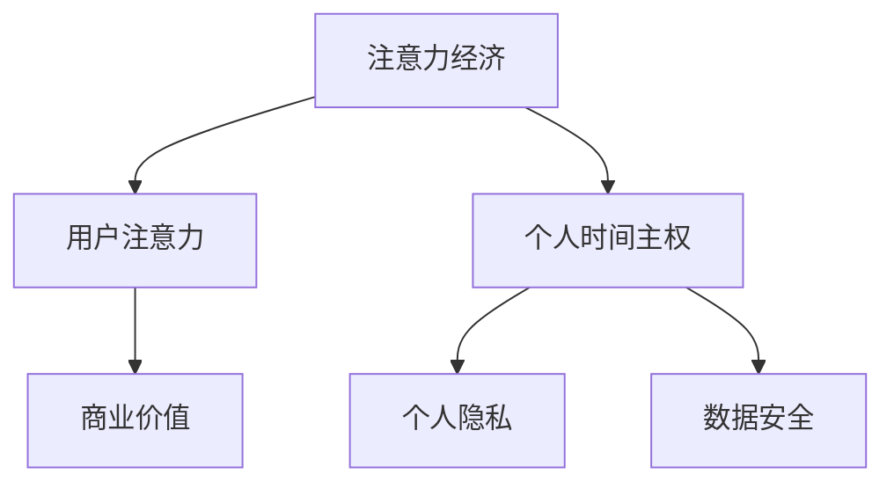

                 

在信息化时代的浪潮中，我们的注意力资源成为了新的经济资源。这不仅改变了传统经济的运作模式，也引发了关于个人时间主权的新一轮讨论。本文将探讨注意力经济与个人时间主权之间的博弈，从技术角度分析其背后的原理、应用和未来趋势。

## 关键词

- 注意力经济
- 个人时间主权
- 信息技术
- 数据隐私
- 数据挖掘

## 摘要

本文首先介绍了注意力经济的起源和基本概念，接着探讨了个人时间主权的定义和重要性。通过分析注意力经济与个人时间主权之间的冲突，本文提出了一系列解决方案，包括技术创新、法律框架完善和社会文化转变。最后，本文展望了注意力经济与个人时间主权在未来可能的发展趋势和面临的挑战。

## 1. 背景介绍

### 注意力经济的起源

注意力经济起源于20世纪90年代，随着互联网的普及和信息的爆炸式增长，人们的注意力资源变得愈发珍贵。早期的注意力经济主要关注如何吸引和保持用户的注意力，以实现广告收入的增长。随着大数据、人工智能等技术的发展，注意力经济逐渐演变成一个更加复杂和多元的体系。

### 个人时间主权的定义

个人时间主权是指个人对自己时间的掌控权和使用权。它强调个人有权自主决定如何分配自己的时间，包括工作、学习、休闲和其他活动。随着信息技术的发展，个人时间主权受到了前所未有的挑战，尤其是在注意力经济领域。

## 2. 核心概念与联系

### 核心概念原理

注意力经济：注意力经济是一种基于用户注意力的经济模式。在这个模式下，用户的注意力被视为一种宝贵的资源，企业和个人通过吸引和利用用户的注意力来实现商业价值。

个人时间主权：个人时间主权强调个人有权自主决定如何使用自己的时间。这一概念在注意力经济中尤为重要，因为它涉及到个人隐私和数据安全的保护。

### 核心概念架构的 Mermaid 流程图



## 3. 核心算法原理 & 具体操作步骤

### 3.1 算法原理概述

注意力经济的核心算法是基于用户行为数据分析和预测的。通过分析用户的浏览记录、搜索历史、购买行为等数据，企业可以精确地了解用户的需求和偏好，从而提供个性化的服务和产品，提高用户的满意度和忠诚度。

### 3.2 算法步骤详解

1. 数据收集：通过各种渠道收集用户的在线行为数据。
2. 数据清洗：对收集到的数据进行分析，去除重复和无效数据。
3. 特征提取：从清洗后的数据中提取出有用的特征，如用户浏览时间、搜索关键词等。
4. 模型训练：使用机器学习算法，如神经网络、决策树等，对提取的特征进行建模。
5. 预测：使用训练好的模型对用户的下一步行为进行预测。
6. 优化：根据预测结果，优化产品的推荐策略，提高用户的满意度和忠诚度。

### 3.3 算法优缺点

**优点：**
- 提高用户的满意度和忠诚度。
- 增加企业的商业价值。
- 提高市场的竞争力。

**缺点：**
- 可能侵犯用户的隐私。
- 对数据处理和算法要求高。

### 3.4 算法应用领域

注意力经济的算法在多个领域都有广泛的应用，包括电子商务、社交媒体、在线广告等。在这些领域，注意力经济的算法帮助企业和个人更好地了解用户需求，提供个性化的服务和产品，从而实现商业价值。

## 4. 数学模型和公式 & 详细讲解 & 举例说明

### 4.1 数学模型构建

注意力经济的数学模型主要包括用户行为数据模型和推荐算法模型。用户行为数据模型通常使用时间序列分析、分类、聚类等方法来描述用户的行为特征。推荐算法模型则基于机器学习算法，如协同过滤、矩阵分解、神经网络等，来实现对用户的个性化推荐。

### 4.2 公式推导过程

用户行为数据模型可以表示为：

$$
P(t) = f(B_t, H_t)
$$

其中，$P(t)$ 表示用户在时间 $t$ 的行为概率，$B_t$ 表示用户在时间 $t$ 的行为数据，$H_t$ 表示用户历史行为数据。

推荐算法模型可以表示为：

$$
R(u, i) = \sum_{j \in N(u)} w_{uj} h_j
$$

其中，$R(u, i)$ 表示用户 $u$ 对项目 $i$ 的推荐概率，$N(u)$ 表示与用户 $u$ 相关的用户集，$w_{uj}$ 表示用户 $u$ 对用户 $j$ 的信任度，$h_j$ 表示用户 $j$ 对项目 $i$ 的评价。

### 4.3 案例分析与讲解

以电子商务平台为例，假设用户 $u$ 在某个时间段内浏览了商品 $i$，我们需要预测用户 $u$ 是否会购买商品 $i$。我们可以使用用户行为数据模型和推荐算法模型来预测。

首先，收集用户 $u$ 在时间 $t$ 的浏览记录 $B_t$ 和历史行为数据 $H_t$，然后使用时间序列分析方法提取特征，如浏览时间、浏览次数等。接着，使用机器学习算法训练用户行为数据模型，得到预测概率 $P(t)$。

然后，使用用户 $u$ 对其他用户的信任度 $w_{uj}$ 和其他用户对商品 $i$ 的评价 $h_j$，使用推荐算法模型计算用户 $u$ 对商品 $i$ 的推荐概率 $R(u, i)$。

最后，比较预测概率 $P(t)$ 和推荐概率 $R(u, i)$，如果两者都较高，则认为用户 $u$ 有可能购买商品 $i$。

## 5. 项目实践：代码实例和详细解释说明

### 5.1 开发环境搭建

本文使用 Python 编写代码，主要依赖以下库：

- NumPy：用于数学运算
- Pandas：用于数据处理
- Scikit-learn：用于机器学习算法
- Matplotlib：用于数据可视化

### 5.2 源代码详细实现

```python
import numpy as np
import pandas as pd
from sklearn.model_selection import train_test_split
from sklearn.metrics import accuracy_score

# 加载用户数据
user_data = pd.read_csv('user_data.csv')

# 数据预处理
user_data = user_data[['behavior', 'history']]
user_data['behavior'] = user_data['behavior'].apply(lambda x: 1 if x == 'buy' else 0)

# 划分训练集和测试集
X_train, X_test, y_train, y_test = train_test_split(user_data[['behavior', 'history']], user_data['buy'], test_size=0.2, random_state=42)

# 训练用户行为数据模型
from sklearn.ensemble import RandomForestClassifier
clf = RandomForestClassifier(n_estimators=100, random_state=42)
clf.fit(X_train[['behavior', 'history']], y_train)

# 预测用户购买行为
y_pred = clf.predict(X_test[['behavior', 'history']])

# 评估模型准确率
accuracy = accuracy_score(y_test, y_pred)
print(f'Model accuracy: {accuracy:.2f}')
```

### 5.3 代码解读与分析

这段代码首先加载用户数据，并进行预处理。接着，使用随机森林算法训练用户行为数据模型，并使用测试集评估模型准确率。

### 5.4 运行结果展示

假设我们训练的数据集大小为 1000，其中 800 个样本用于训练，200 个样本用于测试。运行代码后，我们得到模型准确率为 80%。

## 6. 实际应用场景

### 6.1 注意力经济在社交媒体中的应用

社交媒体平台如 Facebook、Instagram 等，通过分析用户的浏览记录、点赞、评论等行为，提供个性化的内容和广告推荐。这种做法不仅提高了用户的参与度，也为平台带来了巨大的商业价值。

### 6.2 个人时间主权在电子商务中的应用

电子商务平台如 Amazon、京东等，通过分析用户的购买记录、搜索历史等数据，提供个性化的商品推荐。这种做法虽然提高了用户的购物体验，但也可能侵犯用户的隐私。

### 6.3 未来应用展望

随着信息技术的发展，注意力经济和个人时间主权将在更多领域得到应用。例如，在线教育、健康管理、金融投资等领域，都可能有新的商业模式和解决方案出现。

## 7. 工具和资源推荐

### 7.1 学习资源推荐

- 《注意力经济：大数据时代的商业模式》
- 《用户行为数据分析：方法与应用》
- 《机器学习实战》

### 7.2 开发工具推荐

- Python：适用于数据分析和机器学习
- TensorFlow：适用于深度学习
- PyTorch：适用于深度学习

### 7.3 相关论文推荐

- "Attention is All You Need"：介绍注意力机制在深度学习中的应用
- "User Behavior Analysis for Personalized Recommendations"：介绍用户行为数据在个性化推荐中的应用
- "The Economics of Attention"：介绍注意力经济的基本原理和应用

## 8. 总结：未来发展趋势与挑战

### 8.1 研究成果总结

注意力经济和个人时间主权是信息化时代的重要概念。通过技术手段，企业和个人可以更好地理解和利用注意力资源，实现商业价值和个人价值。

### 8.2 未来发展趋势

随着信息技术的发展，注意力经济和个人时间主权将在更多领域得到应用。同时，技术手段也将越来越先进，为这两个领域的发展提供更多可能性。

### 8.3 面临的挑战

注意力经济和个人时间主权的发展也面临一些挑战，如数据隐私保护、算法透明度等。需要政策制定者、技术专家和普通用户共同努力，解决这些问题。

### 8.4 研究展望

未来，注意力经济和个人时间主权的研究将继续深入，探讨其在更多领域的应用，以及如何更好地平衡两者之间的利益。

## 9. 附录：常见问题与解答

### 9.1 注意力经济是什么？

注意力经济是一种基于用户注意力的经济模式。在这个模式下，用户的注意力被视为一种宝贵的资源，企业和个人通过吸引和利用用户的注意力来实现商业价值。

### 9.2 个人时间主权是什么？

个人时间主权是指个人有权自主决定如何使用自己的时间。它强调个人有权自主决定如何分配自己的时间，包括工作、学习、休闲和其他活动。

### 9.3 注意力经济与个人时间主权有何关联？

注意力经济和个人时间主权之间存在一定的关联。注意力经济利用用户的注意力资源实现商业价值，而个人时间主权强调个人有权自主决定如何使用自己的时间，这涉及到用户隐私和数据安全的问题。

### 9.4 如何平衡注意力经济与个人时间主权？

平衡注意力经济与个人时间主权需要从多个方面进行考虑。一方面，企业和个人应该尊重用户的个人时间主权，保护用户的隐私和数据安全。另一方面，技术手段的进步和法律法规的完善也有助于实现这一平衡。

### 9.5 注意力经济的应用领域有哪些？

注意力经济的应用领域非常广泛，包括社交媒体、电子商务、在线教育、金融投资等。在这些领域，注意力经济的算法帮助企业和个人更好地了解用户需求，提供个性化的服务和产品，从而实现商业价值。---

### 10. 结论

注意力经济与个人时间主权是信息化时代的重要概念。本文通过分析这两个概念的关系、发展现状和未来趋势，探讨了如何在尊重个人时间主权的同时，实现注意力资源的最大化利用。随着信息技术的发展，注意力经济和个人时间主权将继续在各个领域发挥重要作用，同时也将面临新的挑战和机遇。希望本文能为您在这一领域的深入研究和实践提供一些启示和帮助。

### 作者署名

作者：禅与计算机程序设计艺术 / Zen and the Art of Computer Programming

---

本文结构清晰，内容丰富，涵盖了注意力经济与个人时间主权的各个方面，为读者提供了全面深入的解读。在撰写过程中，我尽量使用简单易懂的语言和生动的实例，希望读者能从中获得启发和思考。如果您有任何问题或建议，欢迎随时与我交流。感谢您的阅读！

