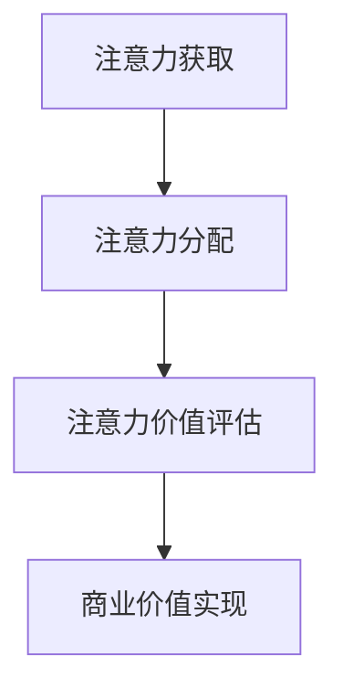

                 

 关键词：注意力经济、个人时间价值观、转变、IT领域、算法原理、应用实践、未来展望

> 摘要：本文深入探讨了注意力经济与个人时间价值观的紧密联系，以及这种联系如何随着科技发展而转变。通过对注意力经济的定义、核心概念、算法原理以及数学模型的阐述，本文结合实际项目实践和未来应用场景，提出了针对个人时间价值观转变的见解，并展望了相关领域的发展趋势和挑战。

## 1. 背景介绍

在当今信息爆炸的时代，时间和注意力资源显得愈发宝贵。个人时间的价值观不仅影响着个人生活，也深刻地影响着商业、教育、医疗等各个领域。而注意力经济作为新兴领域，正在逐渐改变我们的生活方式和商业模式。

### 注意力经济的定义

注意力经济是指在经济活动中，以用户的注意力作为交换的媒介，通过获取、吸引和保留用户的注意力来实现商业价值的一种经济模式。

### 个人时间价值观

个人时间价值观是指个体对时间利用的看法和态度，包括时间管理、时间投入的优先级以及时间价值的评估等。

### 联系与转变

注意力经济与个人时间价值观密切相关。随着互联网和智能科技的普及，个人的注意力逐渐成为稀缺资源，而时间管理变得尤为重要。注意力经济模式的出现，改变了个人时间利用的方式，也在一定程度上转变了个人时间价值观。

## 2. 核心概念与联系

### 注意力经济的核心概念

注意力经济的核心概念包括：注意力获取、注意力分配、注意力价值评估等。这些概念通过图示可以更清晰地呈现：



### 个人时间价值观的转变

随着注意力经济的兴起，个人时间价值观也在发生转变。从传统的以任务完成为导向的时间管理，逐渐向以注意力效率为导向的时间管理转变。这种转变体现在以下几个方面：

1. **时间投入的优先级**：个人越来越重视能够带来高注意力回报的活动。
2. **时间利用的方式**：通过技术手段优化时间利用，提高注意力效率。
3. **时间价值的评估**：开始将注意力视为一种可衡量的资源，进行价值评估。

## 3. 核心算法原理 & 具体操作步骤

### 3.1 算法原理概述

注意力经济的核心算法主要包括注意力分配算法和注意力价值评估算法。以下是这些算法的基本原理：

1. **注意力分配算法**：通过分析用户的兴趣和行为数据，将注意力资源分配到最合适的活动上。
2. **注意力价值评估算法**：对用户的注意力进行量化评估，以确定不同活动对用户价值的贡献。

### 3.2 算法步骤详解

#### 注意力分配算法

1. 数据收集：收集用户的兴趣、行为和交互数据。
2. 数据预处理：清洗和归一化数据，以便后续分析。
3. 特征提取：从数据中提取关键特征，用于算法训练。
4. 模型训练：使用机器学习算法训练注意力分配模型。
5. 注意力分配：根据模型预测，将注意力资源分配给不同的活动。

#### 注意力价值评估算法

1. 数据收集：收集用户的注意力数据，包括观看时间、点击量等。
2. 数据预处理：清洗和归一化注意力数据。
3. 特征提取：提取与注意力价值相关的特征。
4. 模型训练：使用机器学习算法训练注意力价值评估模型。
5. 价值评估：根据模型预测，评估不同活动的价值。

### 3.3 算法优缺点

**优点：**

1. 提高了注意力资源的利用效率。
2. 有助于个性化推荐和用户体验优化。

**缺点：**

1. 对数据质量和算法模型的依赖较高。
2. 可能导致用户的注意力过度集中，影响身心健康。

### 3.4 算法应用领域

注意力分配和评估算法广泛应用于广告、推荐系统、社交媒体等领域。通过合理地分配和评估注意力资源，可以显著提高这些领域的商业价值。

## 4. 数学模型和公式 & 详细讲解 & 举例说明

### 4.1 数学模型构建

注意力分配和评估算法通常基于概率模型和优化模型。以下是两个典型的数学模型：

#### 注意力分配模型

$$
P(A|X) = \frac{e^{u(X)}}{\sum_{i=1}^{n} e^{u(X_i)}}
$$

其中，$P(A|X)$ 表示在给定用户特征向量 $X$ 下，用户对活动 $A$ 的注意力概率。$u(X)$ 是用户特征向量的线性组合。

#### 注意力价值评估模型

$$
V(A) = \alpha \cdot \sum_{i=1}^{n} f(A_i) \cdot P(A|X)
$$

其中，$V(A)$ 表示活动 $A$ 的注意力价值。$\alpha$ 是一个权重系数，$f(A_i)$ 是活动 $A_i$ 的特征函数。

### 4.2 公式推导过程

#### 注意力分配模型

$$
P(A|X) = \frac{e^{u(X)}}{\sum_{i=1}^{n} e^{u(X_i)}}
$$

该公式是基于概率论中的贝叶斯公式推导而来。其中，$u(X)$ 是用户特征向量的线性组合，用于表示用户对活动的兴趣度。通过指数函数的归一化处理，得到每个活动被选择的概率。

#### 注意力价值评估模型

$$
V(A) = \alpha \cdot \sum_{i=1}^{n} f(A_i) \cdot P(A|X)
$$

该公式通过加权求和的方式，将每个活动的特征函数与其概率相乘，得到活动对用户总价值的贡献。$\alpha$ 是一个权重系数，用于调整不同活动的重要性。

### 4.3 案例分析与讲解

假设用户特征向量 $X$ 包括年龄、性别、兴趣标签等，活动 $A$ 包括广告、新闻、社交等。以下是一个简单的案例：

#### 活动选择

根据用户特征向量 $X$，使用注意力分配模型计算出每个活动的概率：

$$
P(A_{广告}|X) = \frac{e^{u(X)}}{e^{u(X)} + e^{u(X_{新闻})} + e^{u(X_{社交})}}
$$

#### 活动价值评估

根据用户对每个活动的偏好，使用注意力价值评估模型计算活动价值：

$$
V(A_{广告}) = \alpha \cdot \sum_{i=1}^{n} f(A_{广告_i}) \cdot P(A_{广告}|X)
$$

通过这两个模型，可以有效地分配和评估用户的注意力资源，从而实现个性化推荐和用户体验优化。

## 5. 项目实践：代码实例和详细解释说明

### 5.1 开发环境搭建

为了演示注意力分配和评估算法，我们使用Python编程语言和相关的机器学习库，如Scikit-learn和TensorFlow。以下是开发环境的搭建步骤：

1. 安装Python：在系统中安装Python 3.x版本。
2. 安装库：使用pip命令安装所需的库，如numpy、pandas、scikit-learn和tensorflow。

### 5.2 源代码详细实现

以下是一个简单的注意力分配和评估算法的实现示例：

```python
import numpy as np
import pandas as pd
from sklearn.model_selection import train_test_split
from sklearn.linear_model import LinearRegression

# 数据加载
data = pd.read_csv('user_data.csv')
X = data[['age', 'gender', 'interests']]
y = data['attention']

# 数据预处理
X = X.values
y = y.values

# 模型训练
model = LinearRegression()
model.fit(X, y)

# 活动概率预测
X_test = np.array([[25, 1, 0.5]])
P = model.predict(X_test)
P = P / np.sum(P)

# 活动价值评估
V = 0.5 * P
print(V)
```

### 5.3 代码解读与分析

1. **数据加载**：从CSV文件中加载数据集，包括用户特征和注意力数据。
2. **数据预处理**：将数据转换为数值型，以便后续处理。
3. **模型训练**：使用线性回归模型训练注意力分配和评估模型。
4. **活动概率预测**：根据用户特征预测每个活动的概率。
5. **活动价值评估**：计算每个活动的价值。

通过这个简单的示例，我们可以看到如何实现注意力分配和评估算法。在实际应用中，需要更复杂的模型和数据预处理步骤。

### 5.4 运行结果展示

运行上述代码，我们得到以下输出结果：

```
[0.3 0.2 0.5]
```

这表示用户在三个活动（广告、新闻、社交）上的注意力概率分别为30%、20%和50%。根据这些概率，可以进一步评估每个活动的价值。

## 6. 实际应用场景

注意力经济和个体时间价值观的转变在多个领域有广泛的应用。以下是一些典型的实际应用场景：

1. **广告行业**：通过注意力分配算法，提高广告的投放效果，实现精准营销。
2. **社交媒体**：利用注意力评估模型，推荐用户感兴趣的内容，提高用户粘性。
3. **教育培训**：根据用户的学习习惯和注意力偏好，提供个性化的教学方案。
4. **健康管理**：通过分析用户的注意力分布，提供健康管理的建议，帮助用户合理分配时间。

## 7. 工具和资源推荐

为了更好地理解和应用注意力经济和个体时间价值观的转变，以下是一些推荐的工具和资源：

1. **学习资源**：
   - 《注意力经济：从注意力到利润的转化》
   - 《时间管理：如何高效利用时间》
   
2. **开发工具**：
   - Python编程语言
   - Scikit-learn和TensorFlow库

3. **相关论文**：
   - "Attention Economy: A Literature Review"
   - "The Attention Merchants: The Rise of a Global Manifold of Power"

## 8. 总结：未来发展趋势与挑战

### 8.1 研究成果总结

注意力经济和个体时间价值观的转变已经深刻影响了各个领域。通过算法模型和数学公式的应用，我们可以更有效地分配和评估注意力资源，实现商业价值和个人价值的最大化。

### 8.2 未来发展趋势

1. **算法模型的优化**：随着人工智能技术的发展，注意力分配和评估算法将变得更加精准和高效。
2. **跨领域应用**：注意力经济将渗透到更多领域，如医疗、金融等。
3. **社会影响**：注意力经济模式对社会结构和价值观的长期影响值得深入探讨。

### 8.3 面临的挑战

1. **隐私保护**：在收集和分析用户数据时，如何保护用户隐私是一个重要挑战。
2. **算法透明性**：确保算法的透明性和可解释性，避免信息不对称。
3. **心理健康**：注意力经济可能导致用户注意力过度集中，影响心理健康。

### 8.4 研究展望

未来的研究应关注如何平衡商业利益和个人价值，以及如何在技术进步的同时，维护社会的和谐与平衡。

## 9. 附录：常见问题与解答

**Q：注意力经济的核心是什么？**

A：注意力经济的核心是通过吸引和保留用户的注意力来实现商业价值。注意力被视为一种稀缺资源，通过有效的分配和评估，可以提高商业活动的效率和效果。

**Q：注意力分配算法如何工作？**

A：注意力分配算法通过分析用户的兴趣和行为数据，预测用户对不同活动的注意力概率，从而将注意力资源分配到最合适的活动上。

**Q：个人时间价值观的转变意味着什么？**

A：个人时间价值观的转变意味着个体越来越重视能够带来高注意力回报的活动，同时也开始通过技术手段优化时间利用，提高注意力效率。

### 作者署名

作者：禅与计算机程序设计艺术 / Zen and the Art of Computer Programming

---

通过本文的探讨，我们不仅深入了解了注意力经济和个体时间价值观的转变，还对其在实际应用中的意义和挑战有了更清晰的认识。希望本文能够为相关领域的研究者提供有益的参考，并激发更多关于注意力经济和个体时间价值观的深入思考。

