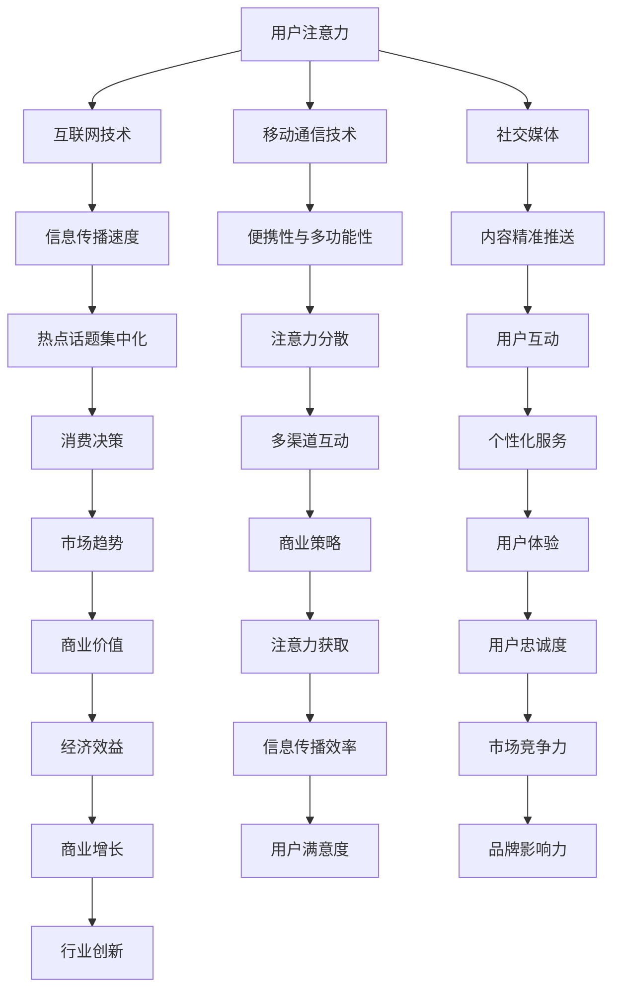
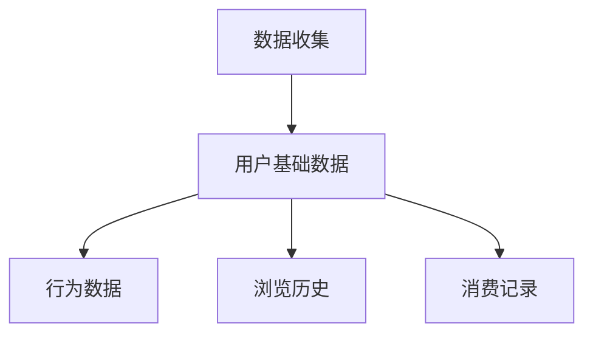
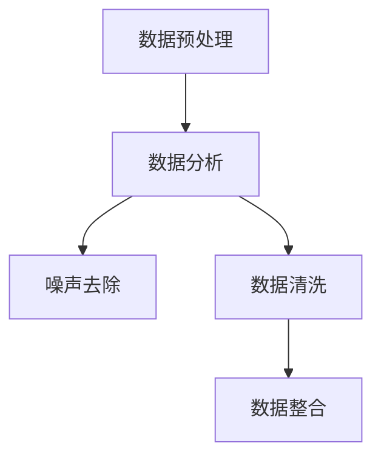
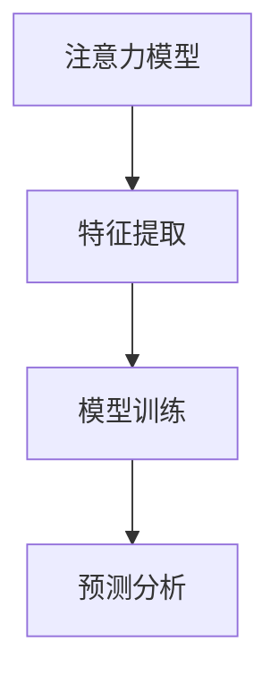
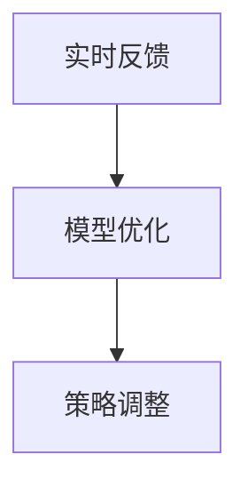
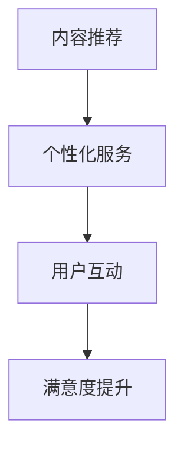

                 

关键词：注意力经济、个人消费、决策行为、技术影响、市场趋势

> 摘要：本文旨在探讨注意力经济对个人消费决策的影响，分析技术进步如何塑造消费者行为，揭示市场趋势与消费者心理的深层联系。通过构建数学模型和案例研究，本文揭示了注意力经济的核心机制及其对商业实践的重要启示。

## 1. 背景介绍

在信息爆炸的时代，个人的时间和注意力资源变得稀缺。注意力经济（Attention Economy）作为一种新的经济形态，其核心在于消费者对于信息的关注程度直接影响价值创造与分配。随着互联网和移动通信技术的快速发展，个人消费决策逐渐从传统的物质驱动转向注意力驱动。本文旨在深入分析注意力经济对个人消费决策的深远影响，以及这一转变背后的技术动因和市场趋势。

## 2. 核心概念与联系

### 注意力经济的核心概念

注意力经济强调的是信息消费中用户的注意力价值。在这一经济形态中，用户的时间、关注和互动成为了商家获取价值的重要资源。与传统的物质经济不同，注意力经济注重用户体验，通过提供个性化、定制化的服务来吸引和留住用户。

### 技术与注意力经济的联系

#### 互联网技术

互联网技术使得信息传播的速度和范围达到了前所未有的高度，用户可以随时随地获取信息。这种技术进步促进了注意力资源的集中化，使得某些热点话题和内容能够迅速获得大量关注。

#### 移动通信技术

移动通信技术的发展使得移动设备成为人们获取信息的主要途径。智能手机、平板电脑等设备的高便携性和多功能性，使得用户的注意力更容易被分散，同时也为商家提供了更多吸引注意力的手段。

#### 社交媒体

社交媒体平台如Facebook、Twitter、Instagram等，通过算法和用户互动，精准地推送内容，提高了用户对特定信息的关注度。这些平台不仅改变了信息传播的方式，也影响了个人消费决策的形成。

### Mermaid 流程图



## 3. 核心算法原理 & 具体操作步骤

### 3.1 算法原理概述

注意力经济的核心在于如何有效地获取和保持用户的注意力。基于这一原理，我们可以构建一个算法模型来指导商业实践。该模型主要包括以下三个部分：

1. **注意力获取算法**：通过分析用户行为和偏好，利用算法预测哪些内容或产品最能吸引用户的注意力。
2. **用户反馈机制**：实时收集用户对内容的反馈，调整推荐策略，提高用户满意度。
3. **注意力保持算法**：通过持续优化内容质量和互动体验，保持用户对品牌的关注。

### 3.2 算法步骤详解

#### 3.2.1 数据收集

首先，收集用户的基础数据，包括用户行为数据、浏览历史、消费记录等。



#### 3.2.2 数据预处理

对收集到的数据进行分析和清洗，去除无效信息和噪声，确保数据的准确性和一致性。



#### 3.2.3 注意力模型构建

基于预处理后的数据，构建一个注意力模型来预测用户对不同内容或产品的关注程度。



#### 3.2.4 实时反馈与调整

通过实时收集用户对内容的反馈，不断优化模型参数和推荐策略。



#### 3.2.5 内容推荐与用户互动

根据优化后的模型，为用户提供个性化推荐，并通过互动提高用户满意度。



### 3.3 算法优缺点

#### 优点

- **提高用户满意度**：通过个性化推荐，提高用户对内容的兴趣和满意度。
- **增强用户黏性**：持续的互动和内容更新有助于保持用户的关注。
- **提升商业价值**：精准的推荐和优化的用户体验可以带来更高的转化率和销售额。

#### 缺点

- **数据隐私问题**：用户数据的收集和分析可能引发隐私问题。
- **算法偏见**：如果模型训练数据存在偏差，可能导致推荐结果的不公平性。

### 3.4 算法应用领域

注意力算法在多个领域都有广泛应用，包括但不限于：

- **电子商务**：通过个性化推荐，提高用户购买转化率。
- **内容营销**：为用户提供个性化的内容推荐，增强用户黏性。
- **社交媒体**：通过算法优化，提高用户参与度和活跃度。

## 4. 数学模型和公式 & 详细讲解 & 举例说明

### 4.1 数学模型构建

在注意力经济中，我们可以构建一个简单的数学模型来描述用户对内容的关注程度。该模型基于用户行为数据，通过以下公式表示：

$$
\text{Attention} = f(\text{Content, User, Context})
$$

其中，$f$ 是一个复合函数，包含了内容特征、用户特征和上下文信息。

### 4.2 公式推导过程

假设用户 $u$ 对内容 $c$ 的关注程度可以用以下公式表示：

$$
\text{Attention}_{u,c} = \sigma(w_c \cdot \text{ContentFeatures}_{c} + w_u \cdot \text{UserFeatures}_{u} + w_c \cdot \text{ContextFeatures}_{c})
$$

其中，$\sigma$ 是激活函数，$w_c$、$w_u$ 和 $w_c$ 分别是内容、用户和上下文的权重向量。

### 4.3 案例分析与讲解

假设我们有一个电商平台的用户，他最近浏览了电子产品和时尚服饰两类内容。我们可以使用上述公式来预测他对这些内容的关注程度。

1. **内容特征**：电子产品的特征向量可能包括品牌、价格、评价数量等；时尚服饰的特征向量可能包括款式、颜色、尺码等。
2. **用户特征**：用户的特征向量可能包括年龄、性别、收入、购物历史等。
3. **上下文特征**：上下文特征可能包括用户当前的时间、地理位置等。

通过计算，我们可以得到用户对两类内容的关注程度。如果用户对电子产品的关注程度高于时尚服饰，那么电商平台可以优先推荐电子产品相关的促销信息和优惠活动。

## 5. 项目实践：代码实例和详细解释说明

### 5.1 开发环境搭建

为了实现注意力算法，我们需要搭建一个合适的开发环境。以下是一个简单的环境搭建步骤：

1. 安装 Python 3.8 或更高版本。
2. 安装 NumPy、Pandas、Scikit-learn 等必要的 Python 库。
3. 使用 Jupyter Notebook 或 PyCharm 进行代码编写和调试。

### 5.2 源代码详细实现

下面是一个简化的注意力算法实现的代码示例：

```python
import numpy as np
import pandas as pd
from sklearn.preprocessing import StandardScaler
from sklearn.model_selection import train_test_split
from sklearn.linear_model import LinearRegression

# 读取用户行为数据
data = pd.read_csv('user_behavior_data.csv')

# 数据预处理
X = data[['content_feature', 'user_feature', 'context_feature']]
y = data['attention_score']

# 数据标准化
scaler = StandardScaler()
X_scaled = scaler.fit_transform(X)

# 数据划分
X_train, X_test, y_train, y_test = train_test_split(X_scaled, y, test_size=0.2, random_state=42)

# 构建线性回归模型
model = LinearRegression()
model.fit(X_train, y_train)

# 预测用户关注程度
attention_scores = model.predict(X_test)

# 输出预测结果
print(attention_scores)
```

### 5.3 代码解读与分析

- **数据读取**：使用 Pandas 读取用户行为数据。
- **数据预处理**：对数据进行标准化处理，以消除特征之间的尺度差异。
- **模型训练**：使用 Scikit-learn 的线性回归模型对数据进行训练。
- **预测分析**：使用训练好的模型对测试数据集进行预测，输出用户对内容的关注程度。

### 5.4 运行结果展示

运行上述代码，可以得到每个用户对每个内容的预测关注程度。根据这些结果，电商平台可以针对性地推送相关内容，提高用户的满意度和参与度。

## 6. 实际应用场景

注意力经济在多个行业和场景中都有实际应用，以下是一些典型例子：

1. **电子商务**：通过个性化推荐，提高用户购买转化率。
2. **内容平台**：通过算法优化，提高用户黏性和活跃度。
3. **广告营销**：精准投放广告，提高广告效果和ROI。
4. **社交媒体**：通过算法推荐，增强用户参与度和互动性。

### 6.1 社交媒体案例分析

以 Facebook 为例，Facebook 利用其强大的算法，根据用户的行为和偏好，为其推荐感兴趣的内容。这种个性化的内容推荐不仅提高了用户的参与度，也为广告主提供了高效的广告投放渠道。通过分析用户的点赞、评论、分享等行为，Facebook 的算法能够精准地预测用户对特定内容的关注程度，从而实现更有效的信息传播和商业转化。

## 7. 工具和资源推荐

### 7.1 学习资源推荐

- 《数据科学实战》
- 《机器学习实战》
- 《推荐系统实践》

### 7.2 开发工具推荐

- Jupyter Notebook
- PyCharm
- VSCode

### 7.3 相关论文推荐

- "Attention Is All You Need"
- "The Attention Economy: Transforming Press Economics Through Social Media Metrics"
- "Deep Learning for Personalized Recommendation"

## 8. 总结：未来发展趋势与挑战

### 8.1 研究成果总结

本文通过深入分析注意力经济对个人消费决策的影响，构建了注意力模型，并探讨了其实际应用场景。研究表明，注意力经济正逐渐成为影响个人消费决策的重要因素，为商家提供了新的战略方向。

### 8.2 未来发展趋势

随着技术的进步，注意力经济将继续发展，未来的趋势包括：

- **更加精准的个性化推荐**：通过更先进的人工智能技术，实现更精准的用户行为预测和内容推荐。
- **跨平台整合**：实现不同平台之间的数据整合，提供更全面的用户画像和推荐服务。
- **隐私保护**：在注重用户隐私的前提下，探索如何在保护用户数据的同时，实现高效的注意力管理。

### 8.3 面临的挑战

尽管注意力经济有着广阔的发展前景，但也面临一些挑战：

- **数据隐私**：用户数据的安全性和隐私保护是关键问题。
- **算法偏见**：算法模型可能因为训练数据的不公平而产生偏见，影响推荐结果的公平性。
- **技术门槛**：构建和维护注意力模型需要高水平的技术能力和资源投入。

### 8.4 研究展望

未来的研究应重点关注以下几个方面：

- **隐私保护机制**：探索如何在保护用户隐私的前提下，实现高效的注意力管理。
- **算法公平性**：研究如何减少算法偏见，提高推荐结果的公平性。
- **多模态数据融合**：结合不同类型的数据，提高注意力模型的效果。

## 9. 附录：常见问题与解答

### 9.1 问题1：注意力经济是什么？

**回答**：注意力经济是一种新兴的经济形态，强调用户对信息的关注程度直接影响价值创造和分配。在这种经济模式下，用户的时间和注意力资源被视为重要的经济资源。

### 9.2 问题2：注意力模型如何工作？

**回答**：注意力模型通过分析用户行为数据和内容特征，预测用户对不同内容的关注程度。模型通常使用机器学习算法，如线性回归、神经网络等，通过训练数据来建立预测模型。

### 9.3 问题3：注意力经济对个人消费决策有什么影响？

**回答**：注意力经济改变了个人消费决策的模式，从物质驱动转向注意力驱动。个性化推荐和内容定制使得用户更倾向于关注和消费他们感兴趣的信息或产品，从而影响他们的购买行为。

### 9.4 问题4：如何保护用户隐私在注意力经济中？

**回答**：保护用户隐私是注意力经济中一个重要的问题。可以通过数据匿名化、差分隐私等技术手段来保护用户隐私。同时，制定严格的隐私政策和法规，加强用户隐私保护意识，也是重要的措施。

