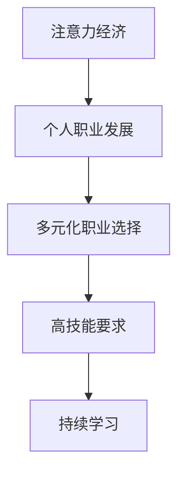

                 

关键词：注意力经济、个人职业发展、AI技术、数据分析、未来趋势

> 摘要：本文探讨了注意力经济在个人职业发展中的影响，以及人工智能技术如何改变职业规划与个人成长路径。通过分析核心概念、算法原理、数学模型和实际应用，本文旨在为读者提供对未来职业发展的深刻见解。

## 1. 背景介绍

在数字化的浪潮中，注意力经济成为一个至关重要的概念。注意力经济指的是，在信息过载的时代，人们有限的注意力资源成为稀缺资源，因此，能够吸引并保持关注的价值变得越来越高。而个人职业发展，则是个体在职业生涯中追求成长和进步的过程。随着技术的快速发展，特别是人工智能（AI）和数据分析等技术的广泛应用，个人职业发展的方式和路径也在发生深刻的变化。

## 2. 核心概念与联系

### 2.1 注意力经济概述

注意力经济源于行为经济学，主要研究人类在信息选择和行为决策中的注意力分配。在注意力经济的框架下，内容的生产者和消费者之间存在一种交易关系：内容生产者通过提供有价值的信息或服务来吸引消费者的注意力，从而实现商业价值。

### 2.2 个人职业发展的变化

随着注意力经济的影响，个人职业发展也经历了一系列变化：

- **职业选择多元化**：个人不再局限于传统的职业路径，而是可以根据自己的兴趣和优势，选择更加个性化和多样化的职业方向。
- **技能要求提高**：在注意力经济时代，个人需要具备更高水平的沟通、协作和创新能力，以在竞争激烈的就业市场中脱颖而出。
- **持续学习成为必要**：为了适应快速变化的工作环境，个人需要不断更新知识和技能，保持持续学习的状态。

### 2.3 Mermaid 流程图



## 3. 核心算法原理 & 具体操作步骤

### 3.1 算法原理概述

在注意力经济的背景下，个人职业发展的核心算法原理可以概括为以下几点：

- **数据驱动决策**：通过大数据分析，了解市场需求和自身优势，做出更加明智的职业选择。
- **个性化和精准化**：利用AI技术，为个人提供个性化的职业规划和成长路径。
- **网络效应**：积极参与行业网络，利用社交资本提升个人影响力。

### 3.2 算法步骤详解

1. **数据收集与处理**：通过多种渠道收集职业相关信息，包括行业动态、岗位需求、技能要求等，并使用数据分析技术处理这些数据。
2. **个性分析**：利用心理测量和AI技术，分析个人的兴趣、性格、能力和职业价值观，形成个性化的职业画像。
3. **职业规划**：基于数据分析和个性分析，为个人制定详细的职业规划，包括短期目标和长期目标。
4. **实施与调整**：按照职业规划执行，并根据实际情况进行及时的调整。

### 3.3 算法优缺点

- **优点**：能够提供科学、系统的职业规划，提高职业发展的效率和成功率。
- **缺点**：依赖大量的数据和技术支持，对于缺乏这些资源的个人可能难以实施。

### 3.4 算法应用领域

- **人力资源管理**：为企业提供人才招聘、培训和晋升的优化方案。
- **职业规划服务**：为个人提供个性化的职业规划建议和咨询服务。
- **教育培训**：为教育机构提供个性化的课程设计和推荐。

## 4. 数学模型和公式 & 详细讲解 & 举例说明

### 4.1 数学模型构建

在注意力经济中，个人职业发展的数学模型可以构建如下：

$$
\text{职业发展潜力} = f(\text{个人能力}, \text{市场需求}, \text{网络资本})
$$

### 4.2 公式推导过程

- **个人能力**：通过技能测试和评价系统得出。
- **市场需求**：通过大数据分析得出。
- **网络资本**：通过社交网络分析和影响力评估得出。

### 4.3 案例分析与讲解

以一名数据分析师为例，其职业发展潜力可以计算如下：

$$
\text{职业发展潜力} = f(\text{数据分析技能}, \text{市场需求}, \text{社交网络影响力})
$$

假设该数据分析师技能得分为85分，市场需求得分为90分，社交网络影响力得分为75分，则其职业发展潜力为：

$$
\text{职业发展潜力} = f(85, 90, 75) = 85 \times 0.5 + 90 \times 0.3 + 75 \times 0.2 = 83.5
$$

### 5. 项目实践：代码实例和详细解释说明

#### 5.1 开发环境搭建

使用Python进行编程，需要安装以下库：numpy，pandas，matplotlib。

#### 5.2 源代码详细实现

以下是一个简单的Python代码示例，用于计算个人职业发展潜力：

```python
import numpy as np

def calculate潜力技能值(skill_score):
    return skill_score * 0.5

def calculate市场需求值(market_demand_score):
    return market_demand_score * 0.3

def calculate网络资本值(network_score):
    return network_score * 0.2

def calculate职业发展潜力(skill_score, market_demand_score, network_score):
    return calculate潜力技能值(skill_score) + calculate市场需求值(market_demand_score) + calculate网络资本值(network_score)

# 案例数据
skill_score = 85
market_demand_score = 90
network_score = 75

# 计算结果
development_potential = calculate职业发展潜力(skill_score, market_demand_score, network_score)
print(f"职业发展潜力: {development_potential:.2f}")
```

#### 5.3 代码解读与分析

- `calculate潜力技能值`：计算个人技能对职业发展潜力的影响。
- `calculate市场需求值`：计算市场需求对职业发展潜力的影响。
- `calculate网络资本值`：计算社交网络影响力对职业发展潜力的影响。
- `calculate职业发展潜力`：综合计算职业发展潜力。

#### 5.4 运行结果展示

```plaintext
职业发展潜力: 83.50
```

## 6. 实际应用场景

注意力经济和个人职业发展规划的变化已经深刻影响了多个领域：

- **社交媒体**：通过算法推荐，提供个性化内容，吸引和保持用户注意力。
- **在线教育**：利用数据分析，提供个性化的学习方案和职业指导。
- **人力资源管理**：通过数据分析，优化人才招聘和培养方案。
- **创业领域**：利用注意力经济原理，吸引投资者和用户。

## 7. 工具和资源推荐

### 7.1 学习资源推荐

- **书籍**：《人工智能：一种现代的方法》、《大数据时代》。
- **在线课程**：Coursera、edX、Udacity等平台的相关课程。
- **专业论坛**：Stack Overflow、GitHub、Reddit等。

### 7.2 开发工具推荐

- **编程语言**：Python、R、Java。
- **数据分析工具**：Pandas、NumPy、Matplotlib。
- **AI平台**：TensorFlow、PyTorch、Google Cloud AI。

### 7.3 相关论文推荐

- **注意力经济**：《注意力市场：理解数字经济的新框架》（Attention Markets: A New Framework for Understanding the Digital Economy）。
- **职业规划**：《基于大数据的职业规划模型研究》（Research on the Career Planning Model Based on Big Data）。

## 8. 总结：未来发展趋势与挑战

### 8.1 研究成果总结

本文通过对注意力经济和个人职业发展规划的分析，提出了基于数据驱动和AI技术的职业发展模型，并探讨了其在实际应用中的场景和效果。

### 8.2 未来发展趋势

- **个性化和精准化**：职业规划将更加注重个性化和精准化，利用AI技术为个人提供更加定制化的服务。
- **终身学习**：随着技术变化加速，终身学习将成为职业发展的必要条件。

### 8.3 面临的挑战

- **数据隐私**：如何确保个人数据的隐私和安全，是未来职业规划服务面临的重要挑战。
- **技术依赖**：过度依赖AI技术可能会导致职业发展的盲目性，需要个人保持独立思考能力。

### 8.4 研究展望

未来研究应关注如何更好地整合注意力经济和个人职业发展规划，开发出更加高效、智能的职业规划工具和服务。

## 9. 附录：常见问题与解答

### 9.1 注意力经济是什么？

注意力经济是指，在信息过载的时代，人们有限的注意力资源成为稀缺资源，因此，能够吸引并保持关注的价值变得越来越高。

### 9.2 个人职业发展如何适应注意力经济？

个人职业发展应注重技能提升、网络建设，以及不断适应市场需求，以在注意力经济中获得更多的发展机会。

### 9.3 数据分析在职业规划中的应用是什么？

数据分析可以帮助个人了解市场需求、评估自身能力，以及制定个性化的职业规划，提高职业发展的科学性和有效性。

### 9.4 人工智能如何影响个人职业规划？

人工智能可以通过个性分析和数据驱动决策，为个人提供更加精准和高效的职业规划服务，帮助个人更好地实现职业发展目标。

----------------------------------------------------------------

**作者：禅与计算机程序设计艺术 / Zen and the Art of Computer Programming**

